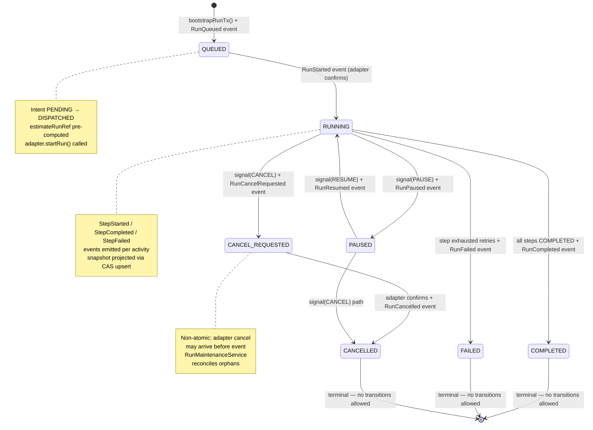
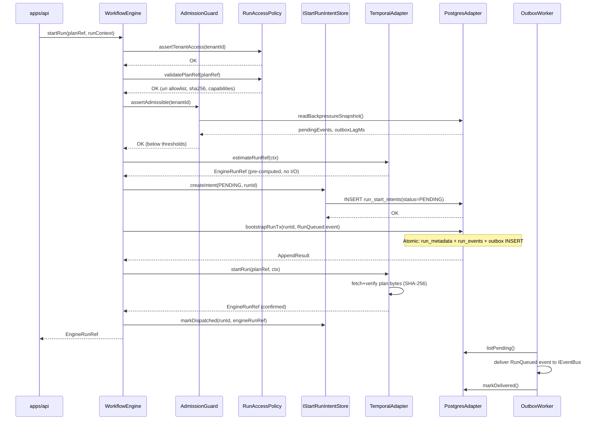
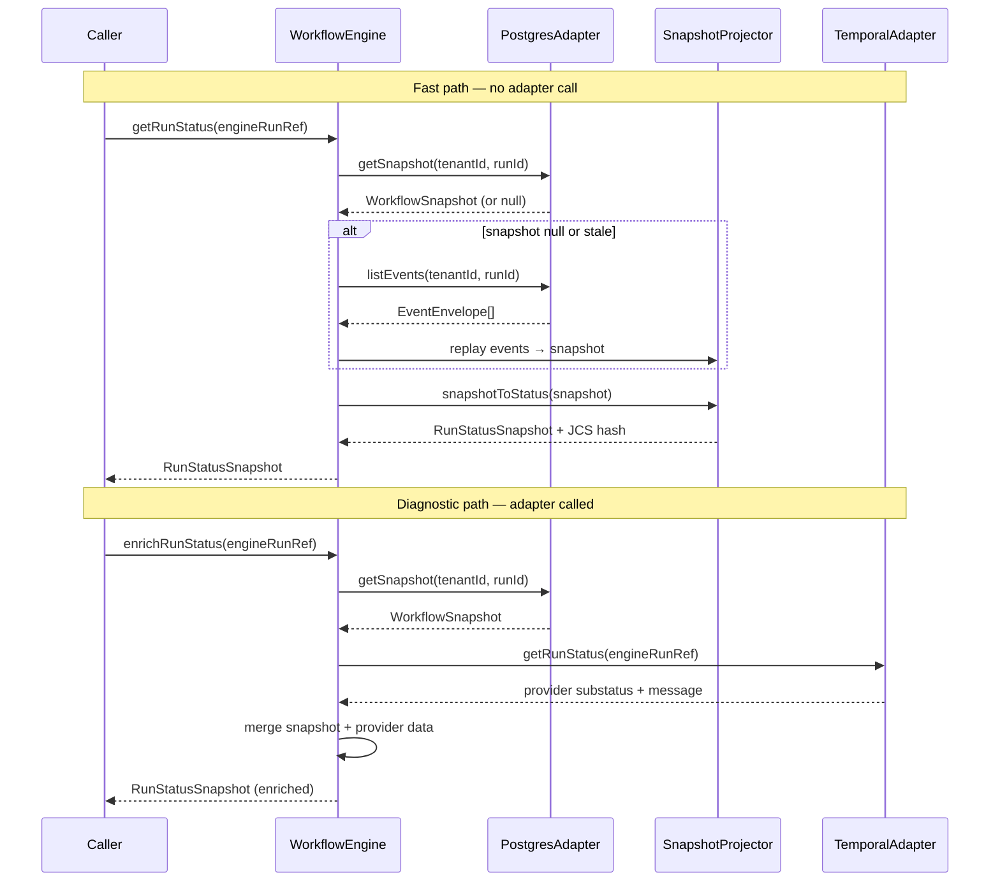
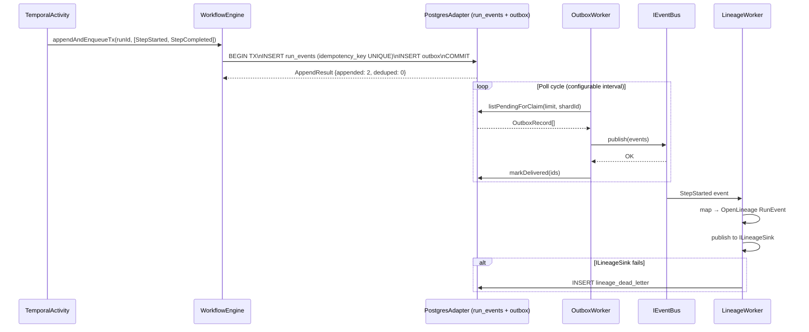
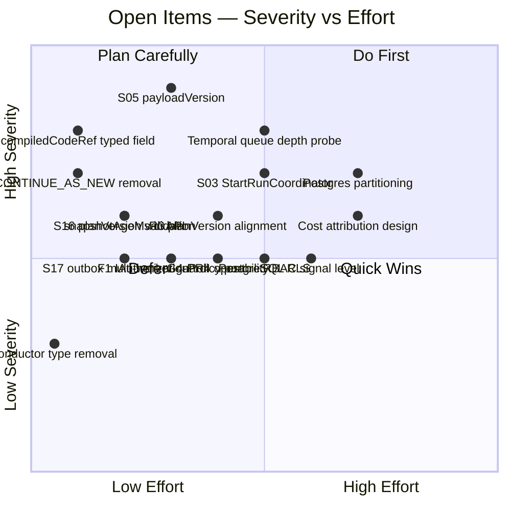

# DVT+ — Principal Architectural Review

**Date:** 2026-03-26
**Basis:** Full source audit + git log up to commit #620. Delta verified against 20260324 review.
**Scope:** All packages, apps, contracts, ADR corpus, execution workboard state.
**Method:** Code-grounded. No documentation taken at face value without source verification.

---

## Delta Since 2026-03-24 Review

The following items closed between 2026-03-24 and today:

| Item                      | What closed                                                   | Commit/PR |
| ------------------------- | ------------------------------------------------------------- | --------- |
| S02                       | `IRunStateStore` split into read/write/maintenance            | #602      |
| S09                       | Retry ownership clarified at adapter boundary                 | #595      |
| S12                       | Deprecated `saveRunMetadata`/`appendEventsTx` removed         | merged    |
| S13                       | Duplicate `estimateRunRef` declaration removed                | #592      |
| S14                       | Gateway `continueAsNew` context preserved or fails loudly     | merged    |
| S15 / S15-F1              | CAS guard on `run_snapshots.last_run_seq`                     | merged    |
| S18 / S19                 | Explicit role-bundle binding + dedicated projector query port | merged    |
| schema-migration-rollback | Rollback path for core Postgres migrations                    | merged    |
| G4-PR3                    | Admission cache + circuit breaker + persisted fallback        | merged    |
| HTTP route normalization  | Query scope validation normalized across routes               | #620      |
| Watchdog stop coverage    | Negative lifecycle test cases                                 | #617      |

**Remaining open (queued or blocked):** S03, S05, S07, S08, S11, S16, S17, S18-F1, F1, F4, F5, R3–R7, G4-PR4, G4-PR5, G5-PR2, G5-PR4.

The system moved materially since the last review. S02 closing is the most structurally significant — it eliminates the god-interface criticism that appeared in every review since 2026-03-05. What follows is a full re-evaluation against the current codebase.

---

## Domain Model Diagram

```mermaid
graph TD
    subgraph SharedKernel["@dvt/contracts (Shared Kernel)"]
        PlanRef["PlanRef\n(planId, uri, sha256, version, capabilities)"]
        RunContext["RunContext\n(tenantId, projectId, envId, runId)"]
        EngineRunRef["EngineRunRef\n(provider discriminated union)"]
        ExecutionPlan["ExecutionPlan v2\n(steps, metadata, policies)"]
        EventEnvelope["EventEnvelope\n(runId, eventType, runSeq, payload)"]
        RunStatus["RunStatus\n(QUEUED|RUNNING|PAUSED|COMPLETED|FAILED|CANCELLED)"]
    end

    subgraph PlannerDomain["@dvt/planner (Planning Domain)"]
        PlannerFacade["PlannerFacade\n(IPlanner port)"]
        Planner["Planner\n(domain service)"]
        GraphBuilder["GraphBuilder"]
        NodeSelector["NodeSelector"]
        TopoSort["TopoSort"]
        PlanAssembler["PlanAssembler\n(JCS + SHA-256)"]
        DbtManifest["dbt manifest.json\n(graph source)"]
    end

    subgraph EngineDomain["@dvt/engine (Execution Domain)"]
        WorkflowEngine["WorkflowEngine\n(IWorkflowEngine)"]
        AdmissionGuard["StartRunAdmissionGuard\n(backpressure)"]
        RunAccessPolicy["RunAccessPolicy\n(auth + rate limit)"]
        SnapshotProjector["SnapshotProjector\n(applyRunEvent — pure)"]
        IntentStore["IStartRunIntentStore\n(crash consistency)"]
    end

    subgraph StateDomain["State Layer"]
        EventLog["run_events\n(append-only, UNIQUE idempotency_key)"]
        SnapshotStore["run_snapshots\n(CQRS read model, CAS-guarded)"]
        OutboxTable["outbox\n(delivery queue)"]
        IntentTable["run_start_intents\n(PENDING→DISPATCHED→RESOLVED)"]
    end

    subgraph AdapterLayer["Adapters (Secondary Ports)"]
        TemporalAdapter["TemporalAdapter\n(IProviderAdapter)"]
        PostgresAdapter["PostgresAdapter\n(IRunStateStore roles)"]
        ArtifactStorage["ICompiledCodeStorage\n(S3/MinIO/FS)"]
    end

    subgraph DeliveryLayer["Delivery"]
        OutboxWorker["OutboxWorker\n(poll → deliver → mark)"]
        LineageWorker["LineageWorker"]
        ProjectorWorker["ProjectorWorker"]
    end

    DbtManifest --> GraphBuilder
    GraphBuilder --> NodeSelector --> TopoSort --> PlanAssembler
    PlanAssembler --> ExecutionPlan
    PlannerFacade --> Planner

    PlanRef --> WorkflowEngine
    RunContext --> WorkflowEngine
    WorkflowEngine --> AdmissionGuard
    WorkflowEngine --> RunAccessPolicy
    WorkflowEngine --> IntentStore
    WorkflowEngine --> TemporalAdapter
    WorkflowEngine --> SnapshotProjector

    TemporalAdapter --> EngineRunRef
    SnapshotProjector --> EventEnvelope
    SnapshotProjector --> RunStatus

    WorkflowEngine --> EventLog
    WorkflowEngine --> OutboxTable
    IntentStore --> IntentTable
    EventLog --> SnapshotStore

    OutboxWorker --> OutboxTable
    ProjectorWorker --> EventLog
    ProjectorWorker --> SnapshotStore
    LineageWorker --> OutboxTable
```



---

## Run Lifecycle State Machine



---

## Sequence: startRun (Happy Path)



---

## Sequence: getRunStatus vs enrichRunStatus



---

## Sequence: Event Delivery (Outbox)



---

## 1. Conceptual Soundness

### What is solid

**The tri-partition is structurally enforced and has not eroded.**

- `@dvt/planner` has zero storage dependency. `Planner.ts` receives `BuildPlanCommand` and returns a value. No I/O, no side effects.
- `@dvt/engine` has zero planner import. The boundary is `PlanRef` — a content-addressable pointer. The engine never sees plan bytes; the adapter owns fetch + verification.
- The UI does not execute. State derivation happens in `SnapshotProjector`, not in the frontend.

These invariants are not conventions — they are enforced by the package dependency graph. A developer cannot accidentally import `@dvt/planner` from `@dvt/engine` without a build error.

**S02 closing is the most material structural improvement since the system was first reviewed.**

`IRunStateStore` now decomposes into `IRunEventStore`, `IRunMetadataStore`, `IRunSnapshotStore` (and the outbox surface is owned separately). This eliminates the god-object that forced every test to mock seven responsibilities. The ISP violation that was the loudest structural finding in every prior review is gone.

**S15 (CAS guard on snapshot) closes a real race condition.**

`run_snapshots.last_run_seq` is now CAS-guarded. Two concurrent projector workers replaying the same run cannot both commit a stale snapshot. The cheaper replay loses the race and its write is silently discarded. `S15-F1` surfaces the discard outcome so repair callers can observe it. This is correct.

**Pre-dispatch intent log (ADR-0030) is correctly implemented.**

`PENDING → DISPATCHED → RESOLVED` via `IStartRunIntentStore` provides crash-consistent `startRun` semantics. If the process dies between `adapter.startRun()` and `bootstrapRunTx()`, the `RunMaintenanceService` reconciliation path detects the orphaned intent and resolves it. The window is periodic, not reactive — but the mechanism is sound.

**Deterministic plan identity is correctly implemented.**

`planId = sha256(JCS(planCore))` via RFC 8785 is the right choice. JCS key sorting removes JSON object instability. Same semantic input → same `planId` across Node runtimes.

**G4-PR3 closing is production-relevant.**

Admission guard now has a cache, circuit breaker, and persisted fallback. The path from `startRun → assertAdmissible → readBackpressureSnapshot` no longer hits Postgres on every call under nominal load. Under sustained Postgres failure, the fallback policy engages rather than crashing the admission path.

### What is fragile

**S05 is still open. This is the highest-severity unresolved finding.**

`EventEnvelope.payload` is `Record<string, unknown>` with no `payloadVersion`. Every consumer of the event log — `ProjectorWorker`, `LineageWorker`, `OutboxWorker` — deserializes this payload by convention. A shape change to `StepCompleted.payload` (e.g., adding `compiledCodeRef`) is invisible to every consumer at the type boundary. There is no schema validation at the write boundary. This was flagged in three prior reviews. It remains unfixed. The longer `S05` stays open, the larger the payload migration surface becomes.

**`compiledCodeRef` inside `stepTypeConfig: Record<string, unknown>` is a correctness gap, not tech debt.**

The `CompiledCodeRef` interface is defined. The planner emits it. The Temporal activity casts it out of the opaque map. If planner emits `compiledCodeRef` and the activity reads `compiled_code_ref` (a snake_case drift that has happened before), the activity executes with no compiled SQL and produces no type error. This is a silent correctness failure in the critical execution path. Calling it "tech debt" is wrong. It is an undetected deserialization bug waiting for a naming inconsistency.

**`S03` is queued but `StartRunApplicationService` extraction has not started.**

`WorkflowEngine.startRun()` still performs authorization, rate limiting, intent management, and adapter dispatch in a single method. This is an Application Service, not a Domain Service. The engine package owns infrastructure concerns it should not. `F1` (IAuthorizationPolicy extraction) is also queued and depends on `S03`. Until `S03` ships, the engine boundary remains wider than it should be.

**`ResolvedPolicies` is Temporal-shaped.**

`stepTimeoutMs`, `retries.maxAttempts`, `retries.backoffMs`, `concurrency.maxInFlight` map 1:1 to Temporal's `ActivityOptions`. Adding a Conductor adapter will require changing `ResolvedPolicies` — which lives in shared contracts — not just adding an adapter implementation. The `AdapterPolicyMapper` interface pattern is in place. The canonical vocabulary in `ResolvedPolicies` needs to be the minimal shared language, not a Temporal alias.

**`RunSubstatus.CONTINUE_AS_NEW` is Temporal-specific in shared contracts.**

`CONTINUE_AS_NEW` is a Temporal workflow history segmentation mechanism. It has no equivalent semantics in Conductor or any other provider. It belongs in the `TemporalAdapter` layer, not in the shared `RunSubstatus` enum. Any code path that branches on `CONTINUE_AS_NEW` in the engine or API layer is Temporal-coupled without declaring it.

**Plan version compatibility during rolling deployments is not enforced programmatically.**

`SUPPORTED_EXECUTION_PLAN_VERSIONS = ['2.3']` is a single-element array. `R3` (planVersion alignment) is queued. During a rolling deploy where the planner ships `2.4` before all engines are updated, every plan from the new planner is rejected by engines running `2.3`. The ADR-0036 governance process documents version bumps but does not implement a multi-version compatibility window at runtime. One deploy will demonstrate this gap in production.

### What is missing

- `payloadVersion` on `EventInput` — `S05`, still queued.
- `IAuthorizationPolicy` port — `F1`, queued. Authorization is wired by convention, not by contract.
- `WorkflowSnapshot` explicit CQRS read model classification — `F4`, queued. The snapshot is derived state, but this is not formally encoded in the type system.
- RBAC at signal level. Who can CANCEL vs PAUSE vs RETRY within a tenant? `RunAccessPolicy` enforces tenant-level authorization but not operation-level authorization. A tenant operator can cancel any run they can see.
- Cost attribution schema. Not a missing "nice to have" — a missing event schema decision. Adding cost data to `StepCompleted.payload` after `S05` is in place is straightforward. Without `S05`, it is a breaking change.

---

## 2. Architectural Risk Map

| Risk                                                                 | Severity       | Likelihood                     | Why                                                                                                                                                                             | Mitigation                                                                                                               |
| -------------------------------------------------------------------- | -------------- | ------------------------------ | ------------------------------------------------------------------------------------------------------------------------------------------------------------------------------- | ------------------------------------------------------------------------------------------------------------------------ |
| `S05` unversioned event payloads                                     | **Critical**   | Certain — already accumulating | Every payload shape change silently breaks ProjectorWorker, LineageWorker, any future restore path. No AJV validation at write boundary.                                        | Ship `S05` before any payload schema change. AJV per `eventType` at adapter write boundary.                              |
| `compiledCodeRef` opaque cast at activity                            | **High**       | High                           | `stepTypeConfig: Record<string,unknown>` — naming drift between planner and adapter produces no compile error, silently corrupts execution.                                     | Promote `compiledCodeRef` to typed field in `ExecutionStepV2`. Cost: one field addition.                                 |
| Temporal-specific `RunSubstatus.CONTINUE_AS_NEW` in shared contracts | **High**       | Certain — already present      | Any second provider cannot implement this value. Code branching on it in shared code is provider-coupled.                                                                       | Move to `TemporalRunSubstatus` enum inside adapter. Remove from shared contracts.                                        |
| Plan version rejection during rolling deploy                         | **High**       | High                           | `SUPPORTED_EXECUTION_PLAN_VERSIONS = ['2.3']` — single version, no range. Planner ahead of engine = 100% rejection rate.                                                        | Implement `[N-1, N]` version range support before first version bump. `R3` is the unlock.                                |
| Temporal queue saturation not flow-controlled                        | **High**       | Medium                         | `StartRunAdmissionGuard` guards DB saturation. No guard exists for Temporal task queue depth. Accepted runs queue in Temporal indefinitely under worker saturation.             | Add Temporal queue depth probe to admission path. Emit `429` when queue depth exceeds configured threshold.              |
| `S03` deferred — engine/application boundary still blurred           | **Medium**     | Certain — structural           | `WorkflowEngine.startRun()` owns auth, rate limit, intent, dispatch. Application concerns inside domain boundary. Increases coupling surface.                                   | Execute `S03`. Extract `StartRunCoordinator`. Prerequisite to `F1`.                                                      |
| Snapshot projector lag invisible to API callers                      | **Medium**     | High at scale                  | `getRunStatus()` returns snapshot without age. Callers cannot distinguish stale idle from live idle. Under projector load, lag grows undetected.                                | Add `snapshotAgeMs` to `RunStatusSnapshot`. Expose via `x-snapshot-age-ms` response header.                              |
| `run_events` unbounded growth                                        | **Medium**     | Certain over 18 months         | No TTL, no automated archive trigger. Table grows without bound. `G5-PR2` (restore) and `G5-PR4` (redaction) are queued but not done.                                           | Automate archive trigger at configurable event count or age per tenant. `G5-PR2` is the unlock.                          |
| Single PostgreSQL instance                                           | **Medium**     | Certain SPOF at scale          | No read replica. Outbox polling, snapshot queries, and event append all hit the same instance. 1000 concurrent runs → high write throughput.                                    | Read replica for query path. Partition `run_events` by `(tenant_id, created_at)` for scan reduction.                     |
| No PostgreSQL RLS as backstop                                        | **Medium**     | Low (but catastrophic)         | Tenant isolation enforced by adapter code only. One missing `tenantId` filter = cross-tenant data leak. No database-level row security.                                         | Enable PostgreSQL RLS policies on `run_events`, `run_metadata`, `run_snapshots` with `current_setting('app.tenant_id')`. |
| `S17` queued — multi-worker outbox without claim semantics           | **Medium**     | High if second worker added    | If a second `OutboxWorker` starts without `listPendingForClaim` implemented, double-delivery is guaranteed. Current contract allows this silently.                              | `S17`: fail-fast if multi-worker mode is enabled without `listPendingForClaim` support.                                  |
| dbt manifest node ordering not guaranteed stable                     | **Medium**     | Medium                         | If `manifest.nodes` key iteration order varies across dbt versions, same logical graph → different `planId`. JCS sorts keys, but input array ordering before JCS is not locked. | Normalize `manifest.nodes` to sorted array before JCS. Test across dbt versions.                                         |
| `F1` deferred — authorization as convention, not port                | **Medium**     | Certain                        | `IRunAccessPolicy` is the authorization boundary but `IAuthorizationPolicy` as a formal hexagonal port is not extracted. Auth logic can migrate without architectural guard.    | Extract `F1`. Low effort, high long-term value.                                                                          |
| Outbox dead-letter accumulation                                      | **Low-Medium** | High on ILineageSink failure   | No automated DLQ replay. Lineage dead letter grows without size alert. On sustained sink failure, every step event becomes a dead letter.                                       | DLQ size metric + alert. Automated replay with circuit breaker. `S11` is adjacent.                                       |
| `EngineRunRef.conductor` ghost type                                  | **Low**        | Certain                        | Dead discriminated union branch. No implementation. Pollutes every `switch` on `EngineRunRef`.                                                                                  | Remove `conductor` branch. Re-add when implementation starts.                                                            |
| `CustomPolicyNamespaceRegistry` with no consumers                    | **Low**        | Certain                        | Zod schema validation + denied-field scanning + byte limits for a feature with zero production consumers. Ongoing maintenance surface.                                          | Freeze or remove. Do not add to it.                                                                                      |

---

## 3. Engine Abstraction Critique

### Is `IWorkflowEngine` minimal and correct?

The surface — `startRun`, `cancelRun`, `getRunStatus`, `enrichRunStatus`, `signal` — is minimal and correct for an orchestration engine façade.

The `getRunStatus` / `enrichRunStatus` split (ADR-0015) is the right design. Fast reads from snapshot, slow enrichment from adapter. Not every read needs provider latency.

**What is wrong:** `WorkflowEngine.startRun()` is an Application Service doing the work of an Application Service. It owns five distinct concerns. The interface is minimal; the implementation is not. `S03` must extract `StartRunCoordinator`. This is not a refinement — it is a SRP correction.

### Is Temporal-first wise?

Yes, as long as it remains explicit. The problem is where Temporal semantics cross into the neutral layer:

- `RunSubstatus.CONTINUE_AS_NEW` — Temporal history segment boundary, not a universal run concept.
- `ResolvedPolicies` shape — Temporal `ActivityOptions` with renamed fields.
- Temporal determinism rules invisible in `IProviderAdapter` — no constraint annotation warning implementers.

The `TemporalPolicyMapper` pattern is correct. The `AdapterPolicyMapper` interface is the right abstraction. The canonical vocabulary must be the minimal shared language. Currently it is not.

### Is the event model robust?

Partially. Idempotency via `UNIQUE(run_id, idempotency_key)` is correctly implemented. `AppendResult.deduped` tracking makes idempotency observable. CAS guard on snapshot (`S15`) is in place.

Not robust on one critical dimension: `payload: Record<string, unknown>` with no `payloadVersion`. The event type catalog (`RunEvents.v2.ts`) is typed at `EventType` level, but payload schema is unenforceable. Event sourcing without payload versioning is a ticking clock. `S05` must ship.

### Where determinism assumptions fail

1. **dbt manifest node ordering** — `manifest.nodes` is a JSON object. Key iteration order in Node.js is insertion-order, which may vary across dbt versions. JCS sorts keys, but array ordering of `GraphNode[]` before JCS is not normalized. Risk: same logical graph, different `planId`.

2. **Non-deterministic dbt templates** — if compiled SQL includes `invocation_id` or `run_started_at`, the `compiledCodeRef.sha256` changes on every compilation of the same model. The content-addressability claim fails silently.

3. **Temporal determinism invisible in contracts** — `RunPlanWorkflow.ts` must obey Temporal's strict determinism rules. This constraint is not surfaced in `IProviderAdapter`, not documented in any ADR, and not enforced by any type annotation. A new activity contributor will break workflow replay.

---

## 4. Execution Planning Layer Analysis

### DAG analyzer

`GraphBuilder + TopoSort` is correctly implemented. Cycle detection is present. Topological sort is deterministic. The `@dvt/plan-interpreter` (dagAnalyzer) correctly analyzes the resulting DAG.

**Risk: fan-in nodes under scale.** A `dim_date` model depended on by 800 downstream models creates a node with 800 outgoing edges. `NodeSelector` upstream/downstream resolution walks the graph via recursion. On a 1000-node, 10k-edge graph with a high-degree fan-in node, this traversal is O(V²) in the worst case. Not a problem at 100 nodes; visible at 1000+.

### Partial execution

There are none — by design. A failed run at step 400/1000 requires a full re-run. This is a reasonable initial constraint that must be documented as a known limitation with a concrete consequence: for a 1000-node DAG, a failure at step 999 re-executes 998 successful models. This is expensive and not disclosed to operators.

### Retry / backoff policy ownership

`S09` closed via PR #595. Retry ownership is now clarified at the adapter boundary. Verify that the clarification is enforced in code, not just in documentation.

### Cost estimator

Does not exist. The inputs exist: `ConcurrencyPolicy`, `TimeoutPolicy`, `RetryPolicy`, step timestamps. The model does not. If cost awareness is a product requirement, designing cost data into `StepCompleted.payload` is a schema decision that must happen before `S05` adds `payloadVersion` — not after. Otherwise cost fields will always be unversioned payload entries.

### Plan versioning

`R3` is queued. Until it ships, the single-version array `['2.3']` is one deploy away from a production rejection storm. The governance process is good. The runtime enforcement is not.

### Is the planning layer over-engineered?

`CustomPolicyNamespaceRegistry` — yes. The rest of the planning layer (DAG, policy resolution, hash-addressable plan assembly, step factory, DSL evaluator) is appropriately complex for the problem space. The DSL gateway evaluator is the right abstraction for conditional branch execution.

### Is it under-specified?

Yes on:

- Partial execution guarantees (none, not documented)
- Target execution environment portability (plans built for Snowflake are not portable)
- Manifest normalization before hashing

---

## 5. State & Metadata Layer Review

### Artifact immutability

| Artifact                    | Immutable?         | Mechanism                                      |
| --------------------------- | ------------------ | ---------------------------------------------- |
| `run_events`                | Yes                | `UNIQUE(idempotency_key)` + no DELETE path     |
| `run_snapshots`             | No (derived)       | Upsert by projector — correct for a read model |
| `run_archive.archive_bytes` | Yes                | Written once, no update                        |
| S3 compiled SQL blobs       | Yes                | Content-addressed by SHA-256                   |
| `run_start_intents`         | No — mutable state | `PENDING→DISPATCHED→RESOLVED` transitions      |

**Snapshot immutability** is the right design: `run_snapshots` is a derived read model and must be rebuildable from the event log. `S15` (CAS guard) prevents concurrent projectors from regressing the snapshot. This is correct.

### Write amplification

Per step event, the system writes:

- `run_events` row (always)
- `outbox` row (always, atomic with events)
- `lineage_outbox` row (step events, via `LineageOutboxObserver`)
- `run_snapshots` upsert (if projector is co-located)

**3–4 writes per step event.**

For a 1000-node DAG with 3 retries max: up to 4000 step events × 4 writes = **16,000 writes per run lifecycle.**
At 1000 concurrent runs: **16 million writes per full fleet execution cycle.**

This is not modeled. Without WAL tuning, connection pooling, and index maintenance documentation, this is the first operational wall. The S15 CAS guard adds one read per snapshot upsert — a small additional cost.

### Event sourcing vs mutable state

The model is correct: event log as authority, snapshots as derived read models.

**Projector lag** is the operational risk that has no mitigation. `ProjectorWorker` polls `listStaleSnapshotRuns()` — a join across `run_snapshots` and `run_events`. Under load, this join is expensive. An event-driven invalidation model (append to a snapshot-work-queue on event write) would eliminate the poll and reduce lag. This is not implemented.

**Snapshot rebuild race** is mitigated by `S15` (CAS guard). Two concurrent projectors can replay the same run; the stale writer loses the CAS and its write is discarded. `S15-F1` surfaces the discard. This is correct.

**`rebuildSnapshot()` full replay** — for a run with 5000 events, this is a full `run_events` scan filtered by `run_id`. With index `(tenant_id, run_id, run_seq)` this is efficient. The index must be verified under production query plans.

---

## 7. What Is Overbuilt

**`CustomPolicyNamespaceRegistry`** — Zod schema validation, denied-field scanning, per-namespace byte limits, namespace governance — for zero documented production consumers. Every line is maintenance surface. Freeze immediately.

**`IExecutionBindingVerifier` per-step SHA-256 verification** — verifying that a blob at `storageUri` still matches `expectedSha256` at every step start is 1000 S3 calls for a 1000-node DAG. Content-addressed storage does not change after write. Run this verification once at `bootstrapRunTx`, not per step.

**Outbox sharding configuration** — ADR-0033 designs per-shard claim isolation and distributed fencing. The single-worker model has not been shown to be insufficient. Sharding adds claim-timeout complexity and coordinator overhead before the baseline is benchmarked.

**`ObservedTemporalAdapter` + `temporalObservability` + `LineageOutboxObserver` layering** — three separate decoration layers for "emit a span/event when an operation occurs." The pattern is correct; the naming and indirection is disproportionate. Flatten to two layers maximum.

**`EngineRunRef.conductor` discriminated union branch** — no implementation, no documented roadmap. Dead type branches mislead code readers and pollute `switch` exhaustiveness checks. Remove it.

---

## 8. What Is Underbuilt

**Event payload versioning (`S05`)** — critical gap. Queued, unscheduled. Must ship before any payload schema change.

**`StartRunCoordinator` extraction (`S03`)** — queued. Engine/application boundary remains blurred. Blocks `F1`.

**`IAuthorizationPolicy` formal port (`F1`)** — queued. Authorization is wired by convention, not by hexagonal port contract.

**RBAC at signal level** — not designed. `CANCEL`, `PAUSE`, `RETRY` have different risk profiles. No role-based operation authorization within a tenant. An operator can cancel any run they can see.

**Rollback / compensating transactions** — no definition. A partial run failure at step 400/1000 leaves 400 Snowflake models materialized with no documented cleanup path. For a data platform, this is a product-critical gap. Operators cannot determine which steps materialized cleanly.

**Read-your-writes staleness contract** — not specified. After `startRun()`, `getRunStatus()` reads from a snapshot that may lag by an unbounded interval. The API does not expose `snapshotAgeMs`. A caller cannot distinguish "run is idle" from "snapshot is stale."

**Temporal worker saturation backpressure** — `StartRunAdmissionGuard` guards against DB saturation. No guard for Temporal task queue depth. Under worker saturation, the system over-accepts runs.

**Cost attribution** — not designed into the event schema. Adding it later without `S05` in place makes every cost field an unversioned payload entry. The design decision for cost data in `StepCompleted.payload` must happen alongside `S05`.

**Run event log retention automation** — `G5-PR2` (archive restore) and `G5-PR4` (redaction) are queued. Without automated archive triggers, `run_events` grows without bound.

**PostgreSQL RLS as isolation backstop** — enforced by adapter code only. One missing `tenantId` filter = cross-tenant data leak. No database-level guard.

**Plan storage (`S08`)** — `PostgresPlanStore` is queued. Plans are currently passed as `PlanRef` references without a canonical plan storage layer. This makes plan history, auditing, and re-validation without re-planning impossible.

**`WorkflowSnapshot` formal CQRS classification (`F4`)** — snapshot is a derived read model but not formally typed as such. CQRS discipline requires the read model to be explicitly separated from the write model.

---

## 9. Scalability Outlook (3-Year Horizon)

### Assumptions

- 1000+ tenants
- Thousands of concurrent runs
- Large dbt projects (1000+ nodes)
- Cross-environment diffs
- Heavy cost dashboards

### Bottlenecks

**PostgreSQL single instance — critical SPOF at 12–18 months**

Single write target for all event appends, outbox inserts, snapshot upserts, and intent writes. At 1000 concurrent runs with average 10 events each at 10 events/minute = 100,000 events/minute = ~1,700 writes/second baseline. With 3–4 writes per event: **~5,000–7,000 rows/second** through one Postgres instance, shared across indexes, WAL, autovacuum, and checkpoint pressure. No read replica. No partitioning.

The `run_events` table without time-range partitioning becomes a 1B+ row table within 18 months at moderate scale. `VACUUM` performance degrades. Index bloat accumulates. Query plans degrade.

**Mitigation:**

```sql
-- Partition run_events by tenant creation range
CREATE TABLE run_events (
  tenant_id TEXT NOT NULL,
  run_id TEXT NOT NULL,
  run_seq BIGINT NOT NULL,
  ...
) PARTITION BY RANGE (created_at);

-- Monthly partitions, retained for 13 months then archived
CREATE TABLE run_events_2026_03 PARTITION OF run_events
  FOR VALUES FROM ('2026-03-01') TO ('2026-04-01');
```

**Outbox polling at scale**

`listPending()` or `listPendingForClaim()` polls the full outbox table filtered by status. At 5000 concurrent runs × 10 events/minute = 50,000 outbox rows inserted/minute. The poll loop must scan, claim, deliver, and mark at this rate. The `(shard_id, status, next_attempt_at)` index is critical. Without it, this becomes a sequential scan.

**Snapshot projector staleness under load**

`listStaleSnapshotRuns()` is a join across `run_snapshots` and `run_events`. At 5000 concurrent runs, this join is called every poll cycle. Without a push-based invalidation model (write to a snapshot work queue on event append), the projector is doing expensive joins to find work it should have been notified about.

**Planner scale: manifest fetching dominates**

At 100 plan requests/second, each fetching a 50MB dbt manifest from S3 = 5GB/s S3 egress. The DAG computation is trivial (O(V+E)). The manifest fetch is the real bottleneck. Manifest caching by `sha256` in an in-process or Redis cache eliminates redundant fetches for unchanged manifests.

**Cost dashboards require data that does not exist**

Heavy cost dashboards assume per-step duration, per-warehouse cost attribution, per-tenant billing period rollups. None of this is in the event schema. Building dashboards on unversioned `StepCompleted.payload` entries means every dashboard query is a fragile string-keyed map traversal. `S05` is a prerequisite to cost feature delivery.

### Single points of failure

| SPOF                             | Horizon                                   | Mitigation                       |
| -------------------------------- | ----------------------------------------- | -------------------------------- |
| PostgreSQL instance              | 12–18 months                              | Read replica + partition         |
| `OutboxWorker` single-process    | Now if `listPendingForClaim` not enforced | `S17`                            |
| Temporal namespace               | Temporal SaaS / cluster HA                | Temporal Cloud or self-hosted HA |
| S3/MinIO for compiled code       | Object store HA or GCS                    | Standard infrastructure          |
| `ProjectorWorker` single-process | Benign (CAS guard idempotent)             | Multiple workers safe after S15  |

---

## SOLID / Hexagonal / OOP / CQRS Alignment Matrix

| Principle           | Status          | Evidence                                                                                                                                         | Gap                                                                              |
| ------------------- | --------------- | ------------------------------------------------------------------------------------------------------------------------------------------------ | -------------------------------------------------------------------------------- |
| **SRP**             | Partial         | S02 closed: state store roles split. S03 open: `WorkflowEngine.startRun()` still owns 5 concerns                                                 | `S03`                                                                            |
| **OCP**             | Good            | `IProviderAdapter` extends via new implementations. `IStepTypeRegistry` extends via new kinds                                                    | `ResolvedPolicies` is Temporal-shaped, limits OCP for new providers              |
| **LSP**             | Good            | `MockAdapter`, `TemporalAdapter` are substitutable. `AllowAllAuthorizer` is LSP-safe (production guard)                                          | No violations found                                                              |
| **ISP**             | Improved        | S02 split `IRunStateStore` into role interfaces. `IWorkflowEngine` is minimal                                                                    | `compiledCodeRef` in opaque map violates ISP for step consumers                  |
| **DIP**             | Good            | Engine depends on abstractions (`IRunStateStore` roles, `IProviderAdapter`). Adapters depend inward                                              | `F1` open: auth not yet a formal port                                            |
| **Hexagonal Ports** | Good            | Clear primary port (`IWorkflowEngine`), secondary ports (`IRunStateStore` roles, `IProviderAdapter`, `ICompiledCodeStorage`)                     | `IAuthorizationPolicy` (`F1`) not extracted; provider selection in engine (`F5`) |
| **CQRS**            | Partial         | Planner: CQRS command pattern correct. Engine: event log (write) / snapshot (read) correct. `F4` open: snapshot not formally typed as read model | `F4`                                                                             |
| **DDD**             | Partial         | `Planner` is a domain service. `PlanAssembler` is correct aggregate. `RunAccessPolicy` crosses too many concerns                                 | `DbtStepTypeConfig` in shared contracts bleeds dbt knowledge into shared kernel  |
| **Event Sourcing**  | Good (with gap) | Append-only log, `rebuildSnapshot()`, idempotency via `UNIQUE(idempotency_key)`                                                                  | `payload: Record<string,unknown>` — no schema enforcement at write boundary      |

---

## 10. Architectural Scorecard

| Dimension                     | Score | Justification                                                                                                                                                                                                                                                                                                            |
| ----------------------------- | ----- | ------------------------------------------------------------------------------------------------------------------------------------------------------------------------------------------------------------------------------------------------------------------------------------------------------------------------ |
| **Conceptual clarity**        | 8/10  | Tri-partition is real and enforced. S02 closes the worst structural confusion. Deducted for `RunSubstatus.CONTINUE_AS_NEW` in shared contracts and `ResolvedPolicies` Temporal coupling.                                                                                                                                 |
| **Separation of concerns**    | 6/10  | S02 closed the god-interface. S03 open: `WorkflowEngine.startRun()` is still an Application Service. F1 open: auth wired by convention. DbtStepTypeConfig in shared kernel bleeds dbt knowledge.                                                                                                                         |
| **Replaceability of engine**  | 5/10  | `IProviderAdapter` is the correct extension point. But `RunSubstatus.CONTINUE_AS_NEW`, `ResolvedPolicies` shape, and Temporal determinism constraints invisible in contracts mean replacing Temporal requires changing shared contracts, not just adding an adapter.                                                     |
| **Determinism**               | 6/10  | JCS + SHA-256 plan identity is correct. Deducted for unguaranteed manifest node ordering, non-deterministic dbt template risk, and Temporal determinism rules not surfaced in contracts.                                                                                                                                 |
| **Extensibility**             | 7/10  | `IStepTypeRegistry` for new step kinds is correct. `IProviderAdapter` is the right engine extension point. Deducted for `CustomPolicyNamespaceRegistry` (over-engineered extension surface) and ghost `conductor` type.                                                                                                  |
| **Operational realism**       | 5/10  | G4-PR3 closes admission resilience. Schema rollback is in. CAS guard is in. Still missing: SLO definitions, automated DLQ replay, run retention automation, RBAC at signal level, `snapshotAgeMs` in API response, Temporal queue depth admission.                                                                       |
| **Long-term maintainability** | 6/10  | ADR process is strong. S02 closes the largest structural debt. S05 open means every payload change accumulates silent consumers. S03 open means the engine boundary grows wider over time. Payload versioning is the compounding factor — everything else can be refactored; unversioned payload drift cannot be undone. |

**Aggregate: 43/70 = 61%.** +4 points since 2026-03-24 review. Material structural improvements (S02, S15, schema-migration-rollback) landed. Operational and payload debt remains the growth limiter.

---

## 11. Strategic Recommendations

### 3 Structural Changes — Execute Now

**1. Ship `S05` (payloadVersion + per-eventType AJV schema) before any payload schema change.**

This is not optional. The system is accumulating event history. Every month `S05` stays open, the migration surface for payload versioning grows. The implementation shape:

```typescript
// EventInput — add payloadVersion
interface EventInput {
  eventType: EventType;
  idempotencyKey: string;
  stepId?: string;
  payloadVersion: '1.0'; // ← ADD THIS
  payload?: Record<string, unknown>;
}

// Adapter write boundary — validate schema at append
const schema = eventPayloadSchemas[event.eventType]; // AJV compiled schemas per eventType
if (schema && !schema(event.payload)) {
  throw new EventPayloadValidationError(event.eventType, schema.errors);
}
```

Every consumer (`ProjectorWorker`, `LineageWorker`, `OutboxWorker`) can then branch on `payloadVersion` for safe evolution.

**2. Execute `S03` — extract `StartRunCoordinator` from `WorkflowEngine`.**

`WorkflowEngine.startRun()` must not own authorization, rate limiting, intent management, and adapter dispatch. Extract:

```typescript
// Application layer — orchestrates
class StartRunCoordinator {
  constructor(
    private readonly engine: IWorkflowEngineCore, // domain
    private readonly policy: IRunAccessPolicy, // security
    private readonly intent: IStartRunIntentStore, // crash consistency
    private readonly guard: StartRunAdmissionGuard // backpressure
  ) {}

  async execute(planRef: PlanRef, ctx: RunContext): Promise<EngineRunRef> {
    await this.policy.assertTenantAccess(ctx.tenantId);
    await this.policy.validatePlanRef(planRef);
    await this.guard.assertAdmissible(ctx.tenantId);
    // ... intent → dispatch → bootstrap
  }
}

// Domain — pure lifecycle operations
interface IWorkflowEngineCore {
  bootstrap(planRef: PlanRef, ctx: ResolvedRunContext): Promise<EngineRunRef>;
  cancel(ref: EngineRunRef): Promise<void>;
  getStatus(ref: EngineRunRef): Promise<RunStatusSnapshot>;
}
```

**3. Remove `RunSubstatus.CONTINUE_AS_NEW` from shared contracts. Promote `compiledCodeRef` to a typed field.**

Two independent changes, both zero-ambiguity:

```typescript
// Before — shared contracts (wrong)
export enum RunSubstatus {
  CONTINUE_AS_NEW = 'CONTINUE_AS_NEW', // Temporal-specific, remove
  RUNNING_ACTIVITIES = 'RUNNING_ACTIVITIES',
  // ...
}

// After — in TemporalAdapter only
enum TemporalInternalSubstatus {
  CONTINUE_AS_NEW = 'CONTINUE_AS_NEW',
}

// ExecutionStepV2 — promote compiledCodeRef
interface ExecutionStepV2 {
  stepId: string;
  kind: StepKind;
  dependsOn: readonly string[];
  compiledCodeRef?: CompiledCodeRef; // ← TYPED, not inside stepTypeConfig
  stepTypeConfig?: Record<string, unknown>;
}
```

### 3 Clarifications Required Now

**1. Snapshot staleness contract — define and expose `snapshotAgeMs`.**

The API must surface how stale its data is. Define the maximum acceptable staleness bound (e.g., 30 seconds). Add `snapshotAgeMs` to `RunStatusSnapshot`. This is a contractual commitment, not a hint.

**2. dbt manifest node ordering — verify and normalize.**

Before the content-addressable plan system is trusted at scale, verify that `manifest.nodes` key iteration order is stable across dbt versions. If it is not, normalize to a sorted array before JCS hashing. Write a test that asserts the same logical graph produces the same `planId` across two manifest serializations.

**3. Temporal queue depth admission — define the probe interface.**

Define how the admission guard probes Temporal worker capacity:

```typescript
interface IQueueDepthProbe {
  getQueueDepth(taskQueue: string): Promise<number>;
}

// Wire into StartRunAdmissionGuard
async assertAdmissible(tenantId: string, taskQueue: string): Promise<void> {
  await this.assertDbAdmissible(tenantId);         // existing
  await this.assertQueueAdmissible(taskQueue);     // new
}
```

Without this, the system over-accepts under Temporal worker saturation.

### 3 Things to Freeze Immediately

**1. Freeze `CustomPolicyNamespaceRegistry` feature additions.**
Zero consumers. Every addition is waste. Freeze until a concrete consumer with documented requirements exists. If none materializes in 60 days, remove it.

**2. Freeze `EngineRunRef.conductor` type branch.**
No implementation. No roadmap. Remove from the discriminated union now. Re-add when Conductor implementation starts.

**3. Freeze `IExecutionBindingVerifier` per-step invocation.**
Move artifact SHA-256 verification to plan dispatch (`bootstrapRunTx`) — one verification per run, not one per step. At 1000 nodes per run, per-step verification is 1000 S3 calls for a check that cannot fail on content-addressed storage.

### 3 Things to Delay

**1. Delay outbox worker sharding beyond `S17`.**
Enforce `S17` (multi-worker fail-fast without claim semantics) first. Benchmark the single-worker model. Do not add sharding complexity until the baseline is shown to be insufficient.

**2. Delay cost dashboard implementation until `S05` ships.**
Cost data in `StepCompleted.payload` is an event schema decision. Building cost dashboards against unversioned payloads guarantees a breaking migration when `S05` ships. Block cost work on `S05` completion.

**3. Delay cross-environment diff.**
Requires a bi-temporal data model: plan state at time T in environment E. Nothing in the current event model supports this. Adding it before `S05` and `R3` (planVersion alignment) are in place would require immediate rework.

---

## Appendix: Open Item Priority Matrix



---

## Summary Verdict

The system made material structural progress between 2026-03-22 and today. `S02` (IRunStateStore split), `S15` (snapshot CAS guard), `schema-migration-rollback`, and `G4-PR3` (admission resilience) are production-quality improvements. The architectural skeleton is sound.

The three remaining compounding risks — unversioned event payloads (`S05`), blurred engine/application boundary (`S03`), and Temporal-specific types in shared contracts — will each generate production incidents at scale. They compound: unversioned payloads make cost attribution impossible; blurred engine boundary makes authorization port extraction (`F1`) harder; Temporal coupling in shared contracts makes the second provider option more expensive the longer it waits.

Fix `S05` first. It is the dependency for cost attribution, cross-environment diff, and safe schema evolution. Everything else is negotiable sequencing. `S05` is not.
