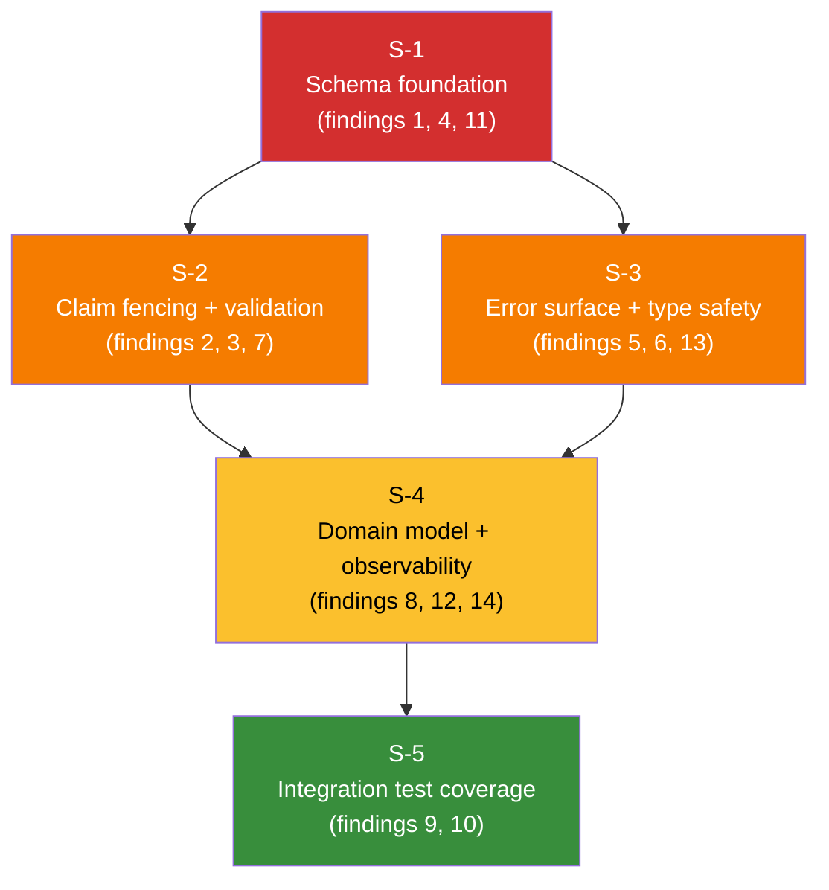

# 20260328 Lineage Outbox Fowler QA Hard Review

## Scope

- `packages/@dvt/adapter-postgres/src/PostgresLineageOutboxStore.ts`
- `packages/@dvt/adapter-postgres/src/PostgresLineageOutboxStoreSql.ts`
- `packages/@dvt/adapter-postgres/migrations/005_lineage_outbox.sql`
- `packages/@dvt/adapter-postgres/migrations/010_lineage_outbox_retry_claim_schedule.sql`
- `packages/@dvt/adapter-postgres/test/PostgresLineageOutboxStore.test.ts`

## Findings (ordered by criticality)

1. **[High] Tenant isolation risk in lineage storage**
   - `lineage_outbox` and `lineage_dead_letter` do not include `tenant_id`, and runtime operations are keyed by global `id`.
   - References:
     - `packages/@dvt/adapter-postgres/migrations/005_lineage_outbox.sql:1`
     - `packages/@dvt/adapter-postgres/migrations/005_lineage_outbox.sql:19`
     - `packages/@dvt/adapter-postgres/src/PostgresLineageOutboxStore.ts:116`
     - `packages/@dvt/adapter-postgres/src/PostgresLineageOutboxStore.ts:123`

1. **[High] Claim fencing is incomplete**
   - `listPending` stamps `claimed_at`, but `markDelivered`, `markFailed`, and `deadLetter` do not verify claim ownership, enabling stale-worker write races.
   - References:
     - `packages/@dvt/adapter-postgres/src/PostgresLineageOutboxStoreSql.ts:36`
     - `packages/@dvt/adapter-postgres/src/PostgresLineageOutboxStore.ts:116`
     - `packages/@dvt/adapter-postgres/src/PostgresLineageOutboxStore.ts:123`
     - `packages/@dvt/adapter-postgres/src/PostgresLineageOutboxStore.ts:150`

1. **[High] Unbounded/invalid limit path in dead-letter reads**
   - `listDeadLetter` does not normalize/cap `limit`; negative or excessive values are not guarded before SQL execution.
   - References:
     - `packages/@dvt/adapter-postgres/src/PostgresLineageOutboxStore.ts:173`
     - `packages/@dvt/adapter-postgres/src/PostgresLineageOutboxStoreSql.ts:97`

1. **[High] Missing index for dominant dead-letter ordering**
   - Query orders by `dead_lettered_at DESC`, but migration creates only `run_id` index, creating scale risk.
   - References:
     - `packages/@dvt/adapter-postgres/src/PostgresLineageOutboxStoreSql.ts:96`
     - `packages/@dvt/adapter-postgres/migrations/005_lineage_outbox.sql:29`

1. **[High] Raw error strings persisted without sanitization**
   - Worker sends raw `Error.message` directly to persistence (`last_error`), risking sensitive leakage and inconsistent observability payloads.
   - References:
     - `packages/@dvt/delivery/src/application/LineageWorkerRuntime.ts:151`
     - `packages/@dvt/adapter-postgres/src/PostgresLineageOutboxStore.ts:128`
     - `packages/@dvt/adapter-postgres/src/PostgresLineageOutboxStore.ts:167`

1. **[Medium] Row typing mismatch in `deadLetter` delete-return path**
   - Query returns a narrow set of columns but is typed as full `LineageOutboxRow`, masking schema drift and mapper mistakes.
   - References:
     - `packages/@dvt/adapter-postgres/src/PostgresLineageOutboxStore.ts:153`
     - `packages/@dvt/adapter-postgres/src/PostgresLineageOutboxStoreSql.ts:80`

1. **[Medium] Input validation asymmetry**
   - `normalizeLineageOutboxClaimTimeoutMs` is strict, but `listPending(limit)` only clamps to `>=0`; non-finite and non-integer values are not rejected.
   - References:
     - `packages/@dvt/adapter-postgres/src/PostgresLineageOutboxStore.ts:71`
     - `packages/@dvt/adapter-postgres/src/PostgresLineageOutboxStore.ts:103`

1. **[Medium] `status` column is mostly inert in behavior**
   - Read path filters by `status='pending'`, but lifecycle is effectively encoded in `claimed_at`/`next_attempt_at` and delete semantics; domain model is inconsistent.
   - References:
     - `packages/@dvt/adapter-postgres/migrations/005_lineage_outbox.sql:8`
     - `packages/@dvt/adapter-postgres/src/PostgresLineageOutboxStoreSql.ts:25`

1. **[Medium] Tests overfit SQL string assertions and mocks**
   - Tests mainly validate SQL fragments through `RecordingClient` instead of concurrency/transaction semantics on real Postgres behavior.
   - References:
     - `packages/@dvt/adapter-postgres/test/PostgresLineageOutboxStore.test.ts:15`
     - `packages/@dvt/adapter-postgres/test/PostgresLineageOutboxStore.test.ts:33`

1. **[Medium] Negative coverage gaps remain in dead-letter path**
   - No tests assert `listDeadLetter` ordering/limit behaviors, and no positive-path `deadLetter` insertion assertion is present.
   - References:
     - `packages/@dvt/adapter-postgres/test/PostgresLineageOutboxStore.test.ts:61`
     - `packages/@dvt/adapter-postgres/test/PostgresLineageOutboxStore.test.ts:257`

## Additional findings (post-review gap analysis — 2026-03-28)

These four risks were identified by cross-referencing the review findings against the full changeset,
including `LineageWorkerRuntime.ts`, `ILineageSink.v1.ts`, and migration 010.

11. **[Medium] Index NULLS ordering mismatch in migration 010**
    - `010_lineage_outbox_retry_claim_schedule.sql` creates the pending index as
      `(next_attempt_at, created_at, claimed_at)` with default `ASC NULLS LAST`.
      The claim query uses `ORDER BY o.next_attempt_at ASC NULLS FIRST`, which the index cannot
      satisfy without an external sort on large tables.
    - References:
      - `packages/@dvt/adapter-postgres/migrations/010_lineage_outbox_retry_claim_schedule.sql:9`
      - `packages/@dvt/adapter-postgres/src/PostgresLineageOutboxStoreSql.ts:31`

12. **[Medium] `lagCount` is batch-capped, not true queue depth**
    - `LineageWorkerRuntime._lagCount` is assigned from `store.listPending(this.batchSize)`.
      When the queue exceeds `batchSize` (default 50) the metric is always 50, masking the real
      backlog. The risk register entry `R-20260328-LINEAGE-RETRY-SCHEDULING-01` cites lag
      visibility as a mitigation but does not acknowledge this measurement distortion.
    - References:
      - `packages/@dvt/delivery/src/application/LineageWorkerRuntime.ts:113`
      - `packages/@dvt/delivery/src/application/LineageWorkerRuntime.ts:58`

13. **[Low] `listDeadLetter` is optional in the contract but unconditional in the implementation**
    - `ILineageOutboxStore.listDeadLetter?` is declared optional (the `?` suffix).
      `PostgresLineageOutboxStore` implements it without guarding. Any callsite typed to
      `ILineageOutboxStore` must null-check before invoking it; no contract-level
      documentation or runtime guard enforces this.
    - References:
      - `packages/@dvt/contracts/src/contracts/lineage/ILineageSink.v1.ts:33`
      - `packages/@dvt/adapter-postgres/src/PostgresLineageOutboxStore.ts:173`

14. **[Low] `deadLetter()` force path has no caller in `LineageWorkerRuntime`**
    - `PostgresLineageOutboxStore.deadLetter()` is implemented and unit-tested structurally,
      but `LineageWorkerRuntime` never calls `this.store.deadLetter(...)`. All DLQ promotion
      flows through `markFailed`. The method is dead code in the current integration path,
      with no operational exerciser.
    - References:
      - `packages/@dvt/delivery/src/application/LineageWorkerRuntime.ts` (no call site)
      - `packages/@dvt/adapter-postgres/src/PostgresLineageOutboxStore.ts:150`

---

## Solution plan for Berta

### Rationale and slice structure

The 14 findings split into two dependency layers.

**Layer 1 — Schema and contracts (must land first).**
Tenant isolation (finding 1) requires new columns in both tables; those columns must exist before
any behavioral fix can filter or key by `tenant_id`. Index corrections (findings 4 and 11) are
also schema-only and carry no behavioral risk on their own.

**Layer 2 — Behavioral corrections (unblocked in parallel once Layer 1 is deployed).**
Claim fencing (finding 2), input validation (findings 3 and 7), error sanitization (finding 5),
type safety (finding 6), and domain-model cleanup (findings 8 and 14) are all code changes whose
scope does not depend on one another. They can be parallelized across two assignees or two
sequential PRs with no ordering constraint between them.

**Layer 3 — Observability and contract alignment.**
`lagCount` (finding 12) and `listDeadLetter` optionality (finding 13) touch the worker runtime
and the contract boundary. They should land after the behavioral corrections are stable to avoid
merge conflicts.

**Layer 4 — Test hardening (must be last).**
Integration tests and dead-letter coverage (findings 9 and 10) must validate the corrected
behavior. They cannot be written until the Layer 2 fixes exist, or the tests will assert against
broken semantics.

---

### Slices

#### Slice S-1 — Schema foundation

**Findings addressed:** 1, 4, 11

| Item                                 | Action                                                                   |
| ------------------------------------ | ------------------------------------------------------------------------ |
| `tenant_id` on `lineage_outbox`      | Add `tenant_id TEXT NOT NULL` column; backfill strategy TBD per ADR-0031 |
| `tenant_id` on `lineage_dead_letter` | Same                                                                     |
| Index on `dead_lettered_at`          | `CREATE INDEX … ON lineage_dead_letter (dead_lettered_at DESC)`          |
| Pending index NULLS order            | Recreate with `(next_attempt_at ASC NULLS FIRST, created_at ASC)`        |

**Rationale:** Schema changes are the one hard dependency. Nothing in Layer 2 can be meaningfully
tested without `tenant_id` present. Fixing the index ordering now avoids a second migration later.

---

#### Slice S-2 — Claim fencing and input validation

**Findings addressed:** 2, 3, 7
**Depends on:** S-1 (for tenant-aware WHERE clauses)

| Item                         | Action                                                                             |
| ---------------------------- | ---------------------------------------------------------------------------------- |
| `markDelivered` fencing      | Add `AND claimed_at IS NOT NULL` or worker-id guard to DELETE                      |
| `markFailed` fencing         | Add `AND claimed_at IS NOT NULL` to UPDATE                                         |
| `deadLetter` fencing         | Add `AND claimed_at IS NOT NULL` to DELETE RETURNING                               |
| `listDeadLetter` limit guard | Reject non-finite / non-positive integer; cap at a system maximum                  |
| `listPending` limit guard    | Align with `normalizeLineageOutboxClaimTimeoutMs` pattern: reject NaN and Infinity |

**Rationale:** Fencing is a correctness invariant under the ADR-0033 sharding model.
Input validation belongs in the same slice to minimize migration count and keep the test surface
coherent.

---

#### Slice S-3 — Error surface and type safety

**Findings addressed:** 5, 6, 13
**Depends on:** S-1 (none strictly; can run in parallel with S-2)

| Item                         | Action                                                                                                                                                                  |
| ---------------------------- | ----------------------------------------------------------------------------------------------------------------------------------------------------------------------- |
| Error sanitization           | Introduce `sanitizeErrorForPersistence(err)` helper in `LineageWorkerRuntime`; strip stack frames and PII-adjacent tokens before passing to `markFailed` / `deadLetter` |
| `deadLetter` type            | Replace `query<LineageOutboxRow>` with a narrow `DeadLetterDeleteRow` interface matching the RETURNING columns                                                          |
| `listDeadLetter` optionality | Either promote the method to required in `ILineageOutboxStore` or add a null-guard wrapper in all callers and document the optional contract                            |

**Rationale:** These are contained, low-blast-radius changes. Doing them before the test slice
ensures tests cover the sanitized error surface, not the raw one.

---

#### Slice S-4 — Domain model and observability

**Findings addressed:** 8, 12, 14
**Depends on:** S-2, S-3 (behavioral baseline must be stable)

| Item                  | Action                                                                                                                                                               |
| --------------------- | -------------------------------------------------------------------------------------------------------------------------------------------------------------------- |
| `status` column       | Either remove the column and simplify queries to `claimed_at`/delete semantics, or make it a true state machine (`pending → claimed → deleted`); document the choice |
| `lagCount` accuracy   | Replace `pending.length` with a separate `COUNT(*)` query (no LIMIT) on eligible rows; expose it as `pendingCount` alongside the tick metric                         |
| `deadLetter()` caller | Either wire `deadLetter()` into `LineageWorkerRuntime` as an explicit operator-triggered force path, or remove the method from the contract and the store            |

**Rationale:** `status` and `lagCount` are domain model questions; resolving the behavioral layer
first means this slice cannot introduce regressions in claim semantics.

---

#### Slice S-5 — Integration test coverage

**Findings addressed:** 9, 10
**Depends on:** S-1, S-2, S-3, S-4

| Item                            | Action                                                                                                        |
| ------------------------------- | ------------------------------------------------------------------------------------------------------------- |
| Replace `RecordingClient` tests | Add real Postgres integration tests for claim fencing race, retry backoff schedule, and dead-letter promotion |
| `listDeadLetter` coverage       | Positive-path insertion assertion; ordering/limit boundary tests                                              |
| `deadLetter` positive path      | Assert DLQ row is created and outbox row is removed atomically                                                |

**Rationale:** Tests written against the corrected implementation are the only meaningful signal.
Writing them before the fixes would require asserting broken behavior.

---

### Dependency and parallelization diagram

S-2 and S-3 are fully parallel after S-1 merges.
S-4 waits for both S-2 and S-3 to avoid domain conflicts.
S-5 is the final gate and should not open until S-4 is merged.

---

## Assumption

- This review assumes ADR-0031 tenant-isolation expectations apply to lineage persistence surfaces unless explicitly exempted.
