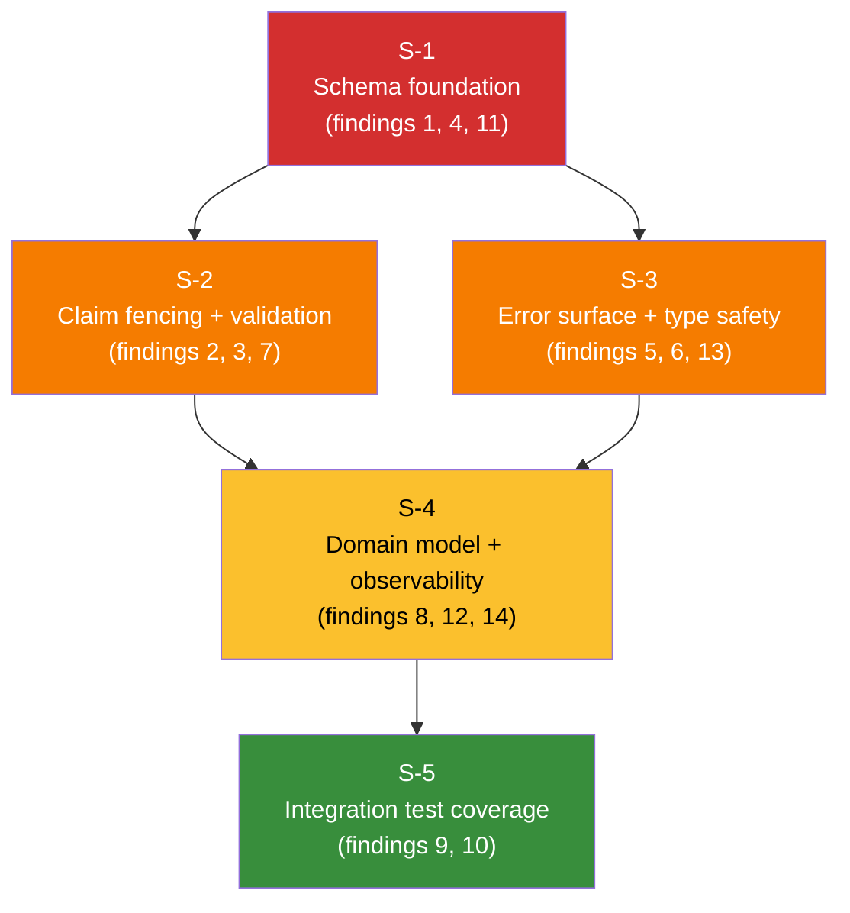

# 20260328 Lineage Outbox Fowler QA Hard Review

## Scope

- `packages/@dvt/adapter-postgres/src/PostgresLineageOutboxStore.ts`
- `packages/@dvt/adapter-postgres/src/PostgresLineageOutboxStoreSql.ts`
- `packages/@dvt/adapter-postgres/migrations/005_lineage_outbox.sql`
- `packages/@dvt/adapter-postgres/migrations/010_lineage_outbox_retry_claim_schedule.sql`
- `packages/@dvt/adapter-postgres/test/PostgresLineageOutboxStore.test.ts`

## Findings (ordered by criticality)

1. **[High] Tenant isolation risk in lineage storage**
   - `lineage_outbox` and `lineage_dead_letter` do not include `tenant_id`, and runtime operations are keyed by global `id`.
   - References:
     - `packages/@dvt/adapter-postgres/migrations/005_lineage_outbox.sql:1`
     - `packages/@dvt/adapter-postgres/migrations/005_lineage_outbox.sql:19`
     - `packages/@dvt/adapter-postgres/src/PostgresLineageOutboxStore.ts:116`
     - `packages/@dvt/adapter-postgres/src/PostgresLineageOutboxStore.ts:123`

1. **[High] Claim fencing is incomplete**
   - `listPending` stamps `claimed_at`, but `markDelivered`, `markFailed`, and `deadLetter` do not verify claim ownership, enabling stale-worker write races.
   - References:
     - `packages/@dvt/adapter-postgres/src/PostgresLineageOutboxStoreSql.ts:36`
     - `packages/@dvt/adapter-postgres/src/PostgresLineageOutboxStore.ts:116`
     - `packages/@dvt/adapter-postgres/src/PostgresLineageOutboxStore.ts:123`
     - `packages/@dvt/adapter-postgres/src/PostgresLineageOutboxStore.ts:150`

1. **[High] Unbounded/invalid limit path in dead-letter reads**
   - `listDeadLetter` does not normalize/cap `limit`; negative or excessive values are not guarded before SQL execution.
   - References:
     - `packages/@dvt/adapter-postgres/src/PostgresLineageOutboxStore.ts:173`
     - `packages/@dvt/adapter-postgres/src/PostgresLineageOutboxStoreSql.ts:97`

1. **[High] Missing index for dominant dead-letter ordering**
   - Query orders by `dead_lettered_at DESC`, but migration creates only `run_id` index, creating scale risk.
   - References:
     - `packages/@dvt/adapter-postgres/src/PostgresLineageOutboxStoreSql.ts:96`
     - `packages/@dvt/adapter-postgres/migrations/005_lineage_outbox.sql:29`

1. **[High] Raw error strings persisted without sanitization**
   - Worker sends raw `Error.message` directly to persistence (`last_error`), risking sensitive leakage and inconsistent observability payloads.
   - References:
     - `packages/@dvt/delivery/src/application/LineageWorkerRuntime.ts:151`
     - `packages/@dvt/adapter-postgres/src/PostgresLineageOutboxStore.ts:128`
     - `packages/@dvt/adapter-postgres/src/PostgresLineageOutboxStore.ts:167`

1. **[Medium] Row typing mismatch in `deadLetter` delete-return path**
   - Query returns a narrow set of columns but is typed as full `LineageOutboxRow`, masking schema drift and mapper mistakes.
   - References:
     - `packages/@dvt/adapter-postgres/src/PostgresLineageOutboxStore.ts:153`
     - `packages/@dvt/adapter-postgres/src/PostgresLineageOutboxStoreSql.ts:80`

1. **[Medium] Input validation asymmetry**
   - `normalizeLineageOutboxClaimTimeoutMs` is strict, but `listPending(limit)` only clamps to `>=0`; non-finite and non-integer values are not rejected.
   - References:
     - `packages/@dvt/adapter-postgres/src/PostgresLineageOutboxStore.ts:71`
     - `packages/@dvt/adapter-postgres/src/PostgresLineageOutboxStore.ts:103`

1. **[Medium] `status` column is mostly inert in behavior**
   - Read path filters by `status='pending'`, but lifecycle is effectively encoded in `claimed_at`/`next_attempt_at` and delete semantics; domain model is inconsistent.
   - References:
     - `packages/@dvt/adapter-postgres/migrations/005_lineage_outbox.sql:8`
     - `packages/@dvt/adapter-postgres/src/PostgresLineageOutboxStoreSql.ts:25`

1. **[Medium] Tests overfit SQL string assertions and mocks**
   - Tests mainly validate SQL fragments through `RecordingClient` instead of concurrency/transaction semantics on real Postgres behavior.
   - References:
     - `packages/@dvt/adapter-postgres/test/PostgresLineageOutboxStore.test.ts:15`
     - `packages/@dvt/adapter-postgres/test/PostgresLineageOutboxStore.test.ts:33`

1. **[Medium] Negative coverage gaps remain in dead-letter path**
   - No tests assert `listDeadLetter` ordering/limit behaviors, and no positive-path `deadLetter` insertion assertion is present.
   - References:
     - `packages/@dvt/adapter-postgres/test/PostgresLineageOutboxStore.test.ts:61`
     - `packages/@dvt/adapter-postgres/test/PostgresLineageOutboxStore.test.ts:257`

## Additional findings (post-review gap analysis — 2026-03-28)

These four risks were identified by cross-referencing the review findings against the full changeset,
including `LineageWorkerRuntime.ts`, `ILineageSink.v1.ts`, and migration 010.

11. **[Medium] Index NULLS ordering mismatch in migration 010**
    - `010_lineage_outbox_retry_claim_schedule.sql` creates the pending index as
      `(next_attempt_at, created_at, claimed_at)` with default `ASC NULLS LAST`.
      The claim query uses `ORDER BY o.next_attempt_at ASC NULLS FIRST`, which the index cannot
      satisfy without an external sort on large tables.
    - References:
      - `packages/@dvt/adapter-postgres/migrations/010_lineage_outbox_retry_claim_schedule.sql:9`
      - `packages/@dvt/adapter-postgres/src/PostgresLineageOutboxStoreSql.ts:31`

12. **[Medium] `lagCount` is batch-capped, not true queue depth**
    - `LineageWorkerRuntime._lagCount` is assigned from `store.listPending(this.batchSize)`.
      When the queue exceeds `batchSize` (default 50) the metric is always 50, masking the real
      backlog. The risk register entry `R-20260328-LINEAGE-RETRY-SCHEDULING-01` cites lag
      visibility as a mitigation but does not acknowledge this measurement distortion.
    - References:
      - `packages/@dvt/delivery/src/application/LineageWorkerRuntime.ts:113`
      - `packages/@dvt/delivery/src/application/LineageWorkerRuntime.ts:58`

13. **[Low] `listDeadLetter` is optional in the contract but unconditional in the implementation**
    - `ILineageOutboxStore.listDeadLetter?` is declared optional (the `?` suffix).
      `PostgresLineageOutboxStore` implements it without guarding. Any callsite typed to
      `ILineageOutboxStore` must null-check before invoking it; no contract-level
      documentation or runtime guard enforces this.
    - References:
      - `packages/@dvt/contracts/src/contracts/lineage/ILineageSink.v1.ts:33`
      - `packages/@dvt/adapter-postgres/src/PostgresLineageOutboxStore.ts:173`

14. **[Low] `deadLetter()` force path has no caller in `LineageWorkerRuntime`**
    - `PostgresLineageOutboxStore.deadLetter()` is implemented and unit-tested structurally,
      but `LineageWorkerRuntime` never calls `this.store.deadLetter(...)`. All DLQ promotion
      flows through `markFailed`. The method is dead code in the current integration path,
      with no operational exerciser.
    - References:
      - `packages/@dvt/delivery/src/application/LineageWorkerRuntime.ts` (no call site)
      - `packages/@dvt/adapter-postgres/src/PostgresLineageOutboxStore.ts:150`

---

## Solution plan for Berta

### Rationale and slice structure

The 14 findings split into two dependency layers.

**Layer 1 — Schema and contracts (must land first).**
Tenant isolation (finding 1) requires new columns in both tables; those columns must exist before
any behavioral fix can filter or key by `tenant_id`. Index corrections (findings 4 and 11) are
also schema-only and carry no behavioral risk on their own.

**Layer 2 — Behavioral corrections (unblocked in parallel once Layer 1 is deployed).**
Claim fencing (finding 2), input validation (findings 3 and 7), error sanitization (finding 5),
type safety (finding 6), and domain-model cleanup (findings 8 and 14) are all code changes whose
scope does not depend on one another. They can be parallelized across two assignees or two
sequential PRs with no ordering constraint between them.

**Layer 3 — Observability and contract alignment.**
`lagCount` (finding 12) and `listDeadLetter` optionality (finding 13) touch the worker runtime
and the contract boundary. They should land after the behavioral corrections are stable to avoid
merge conflicts.

**Layer 4 — Test hardening (must be last).**
Integration tests and dead-letter coverage (findings 9 and 10) must validate the corrected
behavior. They cannot be written until the Layer 2 fixes exist, or the tests will assert against
broken semantics.

---

### Slices

#### Slice S-1 — Schema foundation

**Findings addressed:** 1, 4, 11

| Item                                 | Action                                                                   |
| ------------------------------------ | ------------------------------------------------------------------------ |
| `tenant_id` on `lineage_outbox`      | Add `tenant_id TEXT NOT NULL` column; backfill strategy TBD per ADR-0031 |
| `tenant_id` on `lineage_dead_letter` | Same                                                                     |
| Index on `dead_lettered_at`          | `CREATE INDEX … ON lineage_dead_letter (dead_lettered_at DESC)`          |
| Pending index NULLS order            | Recreate with `(next_attempt_at ASC NULLS FIRST, created_at ASC)`        |

**Rationale:** Schema changes are the one hard dependency. Nothing in Layer 2 can be meaningfully
tested without `tenant_id` present. Fixing the index ordering now avoids a second migration later.

---

#### Slice S-2 — Claim fencing and input validation

**Findings addressed:** 2, 3, 7
**Depends on:** S-1 (for tenant-aware WHERE clauses)

| Item                         | Action                                                                             |
| ---------------------------- | ---------------------------------------------------------------------------------- |
| `markDelivered` fencing      | Add `AND claimed_at IS NOT NULL` or worker-id guard to DELETE                      |
| `markFailed` fencing         | Add `AND claimed_at IS NOT NULL` to UPDATE                                         |
| `deadLetter` fencing         | Add `AND claimed_at IS NOT NULL` to DELETE RETURNING                               |
| `listDeadLetter` limit guard | Reject non-finite / non-positive integer; cap at a system maximum                  |
| `listPending` limit guard    | Align with `normalizeLineageOutboxClaimTimeoutMs` pattern: reject NaN and Infinity |

**Rationale:** Fencing is a correctness invariant under the ADR-0033 sharding model.
Input validation belongs in the same slice to minimize migration count and keep the test surface
coherent.

---

#### Slice S-3 — Error surface and type safety

**Findings addressed:** 5, 6, 13
**Depends on:** S-1 (none strictly; can run in parallel with S-2)

| Item                         | Action                                                                                                                                                                  |
| ---------------------------- | ----------------------------------------------------------------------------------------------------------------------------------------------------------------------- |
| Error sanitization           | Introduce `sanitizeErrorForPersistence(err)` helper in `LineageWorkerRuntime`; strip stack frames and PII-adjacent tokens before passing to `markFailed` / `deadLetter` |
| `deadLetter` type            | Replace `query<LineageOutboxRow>` with a narrow `DeadLetterDeleteRow` interface matching the RETURNING columns                                                          |
| `listDeadLetter` optionality | Either promote the method to required in `ILineageOutboxStore` or add a null-guard wrapper in all callers and document the optional contract                            |

**Rationale:** These are contained, low-blast-radius changes. Doing them before the test slice
ensures tests cover the sanitized error surface, not the raw one.

---

#### Slice S-4 — Domain model and observability

**Findings addressed:** 8, 12, 14
**Depends on:** S-2, S-3 (behavioral baseline must be stable)

| Item                  | Action                                                                                                                                                               |
| --------------------- | -------------------------------------------------------------------------------------------------------------------------------------------------------------------- |
| `status` column       | Either remove the column and simplify queries to `claimed_at`/delete semantics, or make it a true state machine (`pending → claimed → deleted`); document the choice |
| `lagCount` accuracy   | Replace `pending.length` with a separate `COUNT(*)` query (no LIMIT) on eligible rows; expose it as `pendingCount` alongside the tick metric                         |
| `deadLetter()` caller | Either wire `deadLetter()` into `LineageWorkerRuntime` as an explicit operator-triggered force path, or remove the method from the contract and the store            |

**Rationale:** `status` and `lagCount` are domain model questions; resolving the behavioral layer
first means this slice cannot introduce regressions in claim semantics.

---

#### Slice S-5 — Integration test coverage

**Findings addressed:** 9, 10
**Depends on:** S-1, S-2, S-3, S-4

| Item                            | Action                                                                                                        |
| ------------------------------- | ------------------------------------------------------------------------------------------------------------- |
| Replace `RecordingClient` tests | Add real Postgres integration tests for claim fencing race, retry backoff schedule, and dead-letter promotion |
| `listDeadLetter` coverage       | Positive-path insertion assertion; ordering/limit boundary tests                                              |
| `deadLetter` positive path      | Assert DLQ row is created and outbox row is removed atomically                                                |

**Rationale:** Tests written against the corrected implementation are the only meaningful signal.
Writing them before the fixes would require asserting broken behavior.

---

### Dependency and parallelization diagram



S-2 and S-3 are fully parallel after S-1 merges.
S-4 waits for both S-2 and S-3 to avoid domain conflicts.
S-5 is the final gate and should not open until S-4 is merged.

---

## Commit review — 0ac73b7

**`fix(adapters): Harden lineage outbox tenant scope and claim fencing`**
18 files, +1381/−112 lines — reviewed 2026-03-28.

### Coverage of the 14 findings

| #   | Finding                                          | Status                                                                                                                                                               |
| --- | ------------------------------------------------ | -------------------------------------------------------------------------------------------------------------------------------------------------------------------- |
| 1   | Tenant isolation — no `tenant_id`                | Closed — migration 011 + SchemaManager `core_014` add column, backfill from `payload->>'tenantId'` + `run_metadata`, fallback `'__unknown_tenant__'`                 |
| 2   | Claim fencing incomplete                         | Closed — `deleteLineageOutboxByIdsSql` and `updateLineageOutboxFailureSql` add `AND status = 'claimed' AND claimed_at IS NOT NULL AND claimed_at >= (now - timeout)` |
| 3   | `listDeadLetter` unbounded limit                 | Closed — `normalizeLineageQueryLimit` rejects NaN, float, negative; cap `MAX_LINEAGE_QUERY_LIMIT = 1000`                                                             |
| 4   | Missing index on `dead_lettered_at`              | Closed — `lineage_dead_letter_tenant_dead_lettered_idx` on `(tenant_id, dead_lettered_at DESC)`                                                                      |
| 5   | Raw `err.message` persisted                      | Closed — `sanitizeErrorForPersistence`: redacts tokens/passwords, collapses whitespace, truncates to 512 chars                                                       |
| 6   | Type mismatch in `deadLetter`                    | Closed — `deadLetter()` removed from contract; `markFailed` uses precise `LineageMarkFailedRow`                                                                      |
| 7   | Asymmetric `listPending` limit validation        | Closed — `listPending` now uses same `normalizeLineageQueryLimit`                                                                                                    |
| 8   | `status` column inert                            | Closed — `status` now transitions: `'pending'` → `'claimed'` (on listPending) → `'dead_lettered'` (on markFailed max attempts) → DELETE                              |
| 9   | Tests overfit SQL mocks                          | Partial — tests expanded and improved; still `RecordingClient`-only; no real Postgres integration tests                                                              |
| 10  | Dead-letter coverage gaps                        | Closed — tests for `listDeadLetter` (tenant required, filter, invalid limits) and markFailed DLQ path                                                                |
| 11  | NULLS ordering mismatch in index 010             | Closed — index recreated with explicit `ASC NULLS FIRST` in 011 and SchemaManager                                                                                    |
| 12  | `lagCount` batch-capped                          | Closed — `countPending()` runs `COUNT(*)` with no LIMIT; runtime uses `countPending?.()` with fallback                                                               |
| 13  | `listDeadLetter?` optional vs unconditional impl | Closed — `listDeadLetter` now required in contract (no `?`), signature `(limit, tenantId)`                                                                           |
| 14  | `deadLetter()` force path with no caller         | Closed — method removed from contract and store                                                                                                                      |

**Score: 13/14 closed, 1 partial (finding 9 — real Postgres integration tests)**

### New risks introduced by this commit

**[Medium] `markDelivered` silent no-op at claim timeout boundary**

`deleteLineageOutboxByIdsSql` (line 68–73) adds:

```sql
AND claimed_at >= ($2::timestamptz - ($3::bigint * INTERVAL '1 millisecond'))
```

If processing a record takes longer than `claimTimeoutMs`, the DELETE is a silent no-op — the
method returns `void` with no feedback. The next worker reclaims and retries the same record,
risking duplicate publication to the sink.

**[Medium] Orphaned row if DELETE fails after `status = 'dead_lettered'` is written**

In `updateLineageOutboxFailureSql`, when `attempts + 1 >= MAX`, the UPDATE sets
`status = 'dead_lettered'`; the TypeScript then issues a second DELETE in the same transaction.
If that DELETE rolls back (crash, network), the row sits with `status = 'dead_lettered'` and
`claimed_at = NULL`. `listPending` filters `status = 'pending'`, so the row is permanently
orphaned — never reprocessed, never reaching the DLQ.

**[Medium] In-flight rows break `markDelivered` at upgrade time**

Rows with `claimed_at IS NOT NULL` and `status = 'pending'` (claimed under the old code, which
did not set `status = 'claimed'`) will fail the `AND status = 'claimed'` guard in
`deleteLineageOutboxByIdsSql`. Delivery silently fails; the row is reclaimed after timeout and
retried. Short window but real in rolling deployments.

**[Low] `run_metadata` assumed in migration 011 backfill**

`011_lineage_tenant_scope_hardening.sql` line 7–17 joins on `__SCHEMA__.run_metadata`. If that
table does not exist or lacks `tenant_id` in the target schema, the migration fails with no
automatic rollback path.

**[Low] Breaking contract changes on `ILineageSink.v1.ts` without version bump**

`markFailed` signature changed (new return type), `deadLetter` removed, `listDeadLetter` made
required with a new `tenantId` parameter. These are breaking changes on a `v1` file. Under
ADR-0005 and ADR-0006, breaking contract changes require a version bump or explicit ADR backing;
this commit provides neither.

### Open items for Berta after this commit

1. S-5 — integration tests against real Postgres (finding 9 still partial)
2. Harden `markDelivered` timeout boundary — add return count or raise on no-op
3. Ensure dead-letter atomicity — move `status = 'dead_lettered'` inside the same delete
   transaction or use a single atomic SQL statement
4. Migration upgrade path for in-flight `status = 'pending'` rows with `claimed_at` set
5. ADR decision or version bump for `ILineageSink.v1.ts` breaking changes

---

---

## Second Fowler QA review — adapter layer (2026-03-28)

### Scope

- `packages/@dvt/adapter-postgres/src/PostgresStateStoreAdapter.ts`
- `packages/@dvt/adapter-postgres/src/PostgresAdapterClientSession.ts`
- `packages/@dvt/adapter-postgres/src/PostgresAdapterClientSessionSql.ts`
- `packages/@dvt/adapter-postgres/src/PostgresRunStateCoordinator.ts`
- `packages/@dvt/adapter-postgres/src/PostgresSnapshotStalenessQuery.ts`
- `packages/@dvt/adapter-postgres/src/PostgresSnapshotStalenessQuerySql.ts`
- `packages/@dvt/adapter-postgres/src/PostgresBackpressureSnapshotReader.ts`

### Findings (ordered by criticality)

1. **[High] `bootstrapRunTx` wraps all `23505` unique violations as `RUN_ALREADY_EXISTS`**
   - `isUniqueViolation` checks for Postgres error code `23505` globally. Any unique constraint
     violation raised inside the transaction — including a duplicate `(run_id, idempotency_key)`
     from `run_events`, or a conflicting insert into `outbox` — is silently re-typed as
     `RUN_ALREADY_EXISTS`. Callers get an incorrect diagnosis; the real cause is masked.
   - References:
     - `packages/@dvt/adapter-postgres/src/PostgresRunStateCoordinator.ts:98`
     - `packages/@dvt/adapter-postgres/src/PostgresRunStateCoordinator.ts:138`

2. **[Medium] `resolveAndSetTenantContext` forwards unvalidated tenant to RLS setter**
   - `resolveTenantWithClient` returns the raw `tenant_id` from `run_metadata`. The result is
     passed directly to `setTenantContext` without asserting it is a non-empty string. A metadata
     corruption or schema inconsistency that yields an empty or null tenant would call
     `PostgresSchemaManager.setTenantContext(client, '')`, potentially disabling row-level security
     for the transaction.
   - References:
     - `packages/@dvt/adapter-postgres/src/PostgresRunStateCoordinator.ts:113`
     - `packages/@dvt/adapter-postgres/src/PostgresRunStateCoordinator.ts:72`

3. **[Medium] `lineageOutboxStore` is a public field — bypasses `ready()` guard and adapter delegation**
   - `lineageOutboxStore` is declared `readonly` public on `PostgresStateStoreAdapter` (line 99),
     while all other sub-components (`outboxStore`, `runStateCoordinator`, `snapshotStalenessQuery`)
     are private. Callers accessing `adapter.lineageOutboxStore.enqueue(...)` directly skip the
     `this.ready()` check and the adapter's boundary contract. No delegation methods for the
     lineage store exist on the adapter itself.
   - References:
     - `packages/@dvt/adapter-postgres/src/PostgresStateStoreAdapter.ts:99`
     - `packages/@dvt/adapter-postgres/src/PostgresStateStoreAdapter.ts:357`

4. **[Medium] Correlated subquery in `listStaleSnapshotRunsSql` — N+1 scan risk**
   - The staleness query uses a correlated subquery `SELECT MAX(e.run_seq) FROM run_events WHERE
e.run_id = m.run_id` in the WHERE clause, evaluated once per row from `run_metadata`.
     On large tables without a covering index on `run_events(run_id, run_seq DESC)`, this forces a
     sequential scan of `run_events` for every metadata row. PostgreSQL may inline it as a hash
     join under favorable statistics, but there is no guarantee. Production scale risk.
   - References:
     - `packages/@dvt/adapter-postgres/src/PostgresSnapshotStalenessQuerySql.ts:16`

5. **[Medium] `listStaleSnapshotRuns` passes `batchSize` to LIMIT without input validation**
   - `batchSize` is forwarded directly as `$1` to `LIMIT $1` with no guard against NaN, negative
     values, or non-integer inputs. This is the same class of defect as findings 3 and 7 in the
     outbox review; the pattern is inconsistent across the adapter layer.
   - References:
     - `packages/@dvt/adapter-postgres/src/PostgresSnapshotStalenessQuery.ts:22`
     - `packages/@dvt/adapter-postgres/src/PostgresSnapshotStalenessQuerySql.ts:11`

6. **[Low] `abortPendingOperations` is declared `async` but executes synchronously**
   - The method contains no `await` and performs only synchronous work (setting a flag, iterating
     a Set, calling `releaseClient`). The `async` modifier wraps the return in a resolved Promise,
     misleading callers into believing they are waiting for an asynchronous cleanup operation.
   - References:
     - `packages/@dvt/adapter-postgres/src/PostgresAdapterClientSession.ts:38`

7. **[Low] `enqueueTx` name and contract ambiguity**
   - `PostgresRunStateCoordinator.enqueueTx` resolves tenant, sets RLS context, and enqueues
     pre-built `EventEnvelope[]` objects — but does not append to the event log or update the
     snapshot. It is a re-enqueue recovery path, but its name suggests parity with
     `appendAndEnqueueTx`. No docstring or ADR reference distinguishes the two. Callers could
     use it as a primary enqueue path and silently skip the append.
   - References:
     - `packages/@dvt/adapter-postgres/src/PostgresRunStateCoordinator.ts:106`
     - `packages/@dvt/adapter-postgres/src/PostgresStateStoreAdapter.ts:309`

8. **[Low] `PostgresBackpressureSnapshotReader` has inline SQL, inconsistent with `*Sql.ts` convention**
   - Every other component introduced in this PR (`PostgresAdapterClientSession`,
     `PostgresSnapshotStalenessQuery`, `PostgresLineageOutboxStore`) centralizes SQL in a
     companion `*Sql.ts` file. `PostgresBackpressureSnapshotReader` holds a 40-line inline query
     inside the class method, breaking the pattern and making the SQL untestable in isolation.
   - References:
     - `packages/@dvt/adapter-postgres/src/PostgresBackpressureSnapshotReader.ts:77`

## Assumption

- This review assumes ADR-0031 tenant-isolation expectations apply to lineage persistence surfaces unless explicitly exempted.
