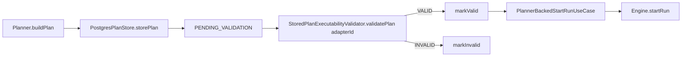
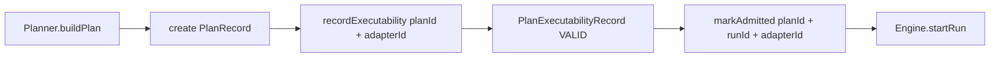

# S08 plan record and plan store gap review

## Purpose

Verify what the repository already implements for persisted plan lifecycle, and
define the real remaining gaps for S08 using Fowler-style operational modeling,
Hexagonal DDD boundaries, SRP, and CQRS.

## Scope

This review is code-grounded. It does not introduce runtime behavior directly.
It is the evidence base for the S08 ADR and execution plan.

## Code-grounded current model

The current repository is not missing persisted-plan behavior entirely.

The active runtime already includes:

- `apps/api/src/application/services/PlannerBackedStartRunUseCase.ts`
- `apps/api/src/application/services/StoredPlanExecutabilityValidator.ts`
- `packages/@dvt/adapter-postgres/src/PostgresPlanStore.ts`
- `packages/@dvt/contracts/src/contracts/planner/PlanValidationLifecycle.v1.ts`
- `packages/@dvt/contracts/src/contracts/planner/PlanExecutabilityValidation.v1.ts`

That means S08 starts from a partial bridge, not from zero.

## Findings

### P0 - Ownership drift is still unresolved

Evidence:

- `packages/@dvt/contracts/src/ports/artifact-store.ts`
- `packages/@dvt/artifacts/src/ports/ICompiledCodeStorage.ts`
- [ADR-0034](../../adr/ADR-0034-bounded-context-boundaries-and-communication-rules.md)
- [Contracts domain ownership migration plan](../proposals/contracts-domain-ownership-migration-plan-20260327.md)

Problem:

The repository still contains contradictory statements about where artifact
behavior ports belong. Adding `IPlanStore` in the wrong place would harden the
drift instead of resolving it.

Required correction:

- keep serializable planner-domain records in `@dvt/contracts`
- move plan-storage behavior to `@dvt/artifacts`

### P0 - Dual plan identity would regress ADR-0042

Evidence:

- [ADR-0042](../../adr/ADR-0042-execution-plan-canonical-identity-unification.md)
- `apps/api/src/application/services/PlannerBackedStartRunUseCase.ts`
- `packages/@dvt/adapter-postgres/src/PostgresPlanStore.ts`

Problem:

Earlier S08 sketches proposed a default model with both `canonicalPlanJson` and
`executablePlanJson` as first-class sibling payloads. That would reopen the
plan-identity split that `ADR-0042` explicitly closed.

Required correction:

- S08-v1 must persist one canonical plan artifact
- any derived executable artifact is a later optional slice, not part of the
  default peer shape

### P0 - The earlier PlanRecord sketch violated SRP

Evidence:

- `packages/@dvt/contracts/src/contracts/planner/PlanValidationLifecycle.v1.ts`
- `packages/@dvt/contracts/src/contracts/planner/PlanExecutabilityValidation.v1.ts`
- [ADR-0041](../../adr/ADR-0041-global-domain-state-model-and-boundary-contracts.md)

Problem:

One mega-record with artifact identity, validation, binding, admission,
supersession, and archival would mix distinct lifecycle axes and create a fake
domain model.

Required correction:

Split the model into:

- `PlanRecord`
- `PlanExecutabilityRecord`
- `PlanAdmissionLink`

### P1 - CQRS is still under-modeled

Evidence:

- [ADR-0041](../../adr/ADR-0041-global-domain-state-model-and-boundary-contracts.md)
- [Architectural review 2026-03-24](../../reviews/architectural-review-dvtplus-2026-03-24.md)

Problem:

If S08 introduces one broad `PlanStore` that handles all commands and queries,
the result will be repository-shaped drift rather than explicit write truth and
query truth.

Required correction:

- explicit writer port
- explicit reader port
- optional composition alias only for implementations

### P1 - The migration path from the current lifecycle facade is missing

Evidence:

- `apps/api/src/application/services/PlannerBackedStartRunUseCase.ts`
- `apps/api/src/application/services/StoredPlanExecutabilityValidator.ts`
- `packages/@dvt/adapter-postgres/src/PostgresPlanStore.ts`

Problem:

A direct cutover would create unnecessary churn. The repository already depends
on `IPlanValidationLifecycleStore` and `IPlanFetcher`.

Required correction:

Keep the current lifecycle interface as a compatibility facade during the
migration and implement it on top of the new artifacts-owned store until callers
move.

### P1 - S08 is not contract-first enough yet

Evidence:

- [ADR-0041](../../adr/ADR-0041-global-domain-state-model-and-boundary-contracts.md)

Problem:

The earlier proposal described TypeScript-like record shapes but did not bind
them to versioned schemas, parsers, and canonical contract documentation.

Required correction:

Each new serializable S08 record must ship with:

- a versioned schema
- a parser/validator
- planner contract documentation
- test evidence for schema/runtime alignment

### P2 - `bindingState` is premature

Evidence:

- `apps/api/src/application/services/PlannerBackedStartRunUseCase.ts`
- `apps/api/src/application/services/StoredPlanExecutabilityValidator.ts`

Problem:

The current runtime does not have a separate persisted binding aggregate.
Introducing `bindingState` now would be speculative rather than code-grounded.

Required correction:

Defer `bindingState` from S08-v1.

### P2 - Active planning truth is stale

Evidence:

- [Current status](../../architecture/system-delivery-status.md)
- [Planner current state assessment](../status/planner-current-state-assessment-20260320.md)
- [ADR-0040](../../adr/ADR-0040-retry-ownership-and-attempt-authority.md)

Problem:

Active docs still say:

- `S09` is open
- `S08` is blocked by `S09`
- there is no `PostgresPlanStore`

Those claims are false in the current repository.

Required correction:

Documentation truth correction must be the first S08 slice.

## Corrected target model

The clean S08-v1 model is:

- `PlanRecord`
  - one canonical persisted plan artifact
  - lineage fields only
  - archival posture only
- `PlanExecutabilityRecord`
  - one row per `planId + adapterId`
  - `PENDING | VALID | INVALID`
- `PlanAdmissionLink`
  - one row per admitted `runId + planId + adapterId`

## Conclusion

S08 is important and implementable, but the repository should not advance it as
"add a big PlanStore abstraction". The mature path is:

1. correct active planning truth
2. accept an ownership ADR
3. add contract-first records
4. add artifacts-owned writer/read ports
5. evolve the existing Postgres-backed implementation
6. cut admission over from the legacy lifecycle facade to the explicit model

## References

- [ADR-0018](../../adr/ADR-0018_Shared_Kernel_Ownership_Governance.md)
- [ADR-0034](../../adr/ADR-0034-bounded-context-boundaries-and-communication-rules.md)
- [ADR-0035](../../adr/ADR-0035-planner-public-contract-evolution-protocol.md)
- [ADR-0039](../../adr/ADR-0039-hexagonal-port-hardening-and-solid-remediation.md)
- [ADR-0040](../../adr/ADR-0040-retry-ownership-and-attempt-authority.md)
- [ADR-0041](../../adr/ADR-0041-global-domain-state-model-and-boundary-contracts.md)
- [ADR-0042](../../adr/ADR-0042-execution-plan-canonical-identity-unification.md)
- [S08 execution plan](../proposals/s08-plan-record-plan-store-execution-plan-20260402.md)
