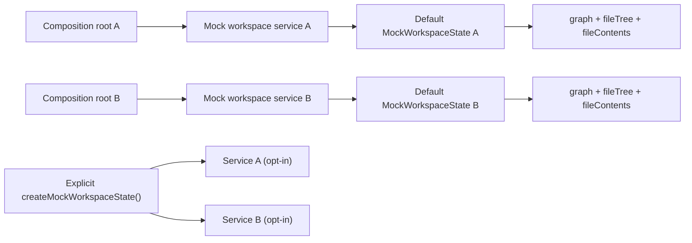

# F-04-RISK-B mock workspace isolation hard QA review

## Artifact Metadata

### Markdown Artifact Path Suggestion

- `docs/planning/reviews/20260407-f04-risk-b-mock-workspace-isolation-hard-qa-review.md`

## Summary

This review records the hard, evidence-first QA pass for Lane E
`F-04-RISK-B` after the mock workspace adapter was hardened to stop sharing
mutable state across service instances by default.

The goal of this QA pass is to verify three things:

- the original determinism risk is actually closed in code, not only in docs;
- the composition-root path also benefits from the isolation fix;
- the remaining residuals are stated explicitly instead of being hidden behind
  a green test run.

Canonical execution tracking remains in:

- `docs/planning/state/agent-lane-e.yaml`
- `docs/planning/proposals/nice-to-have/frontend-and-ux/f-04-frontend-data-boundary-hexagonal-convergence-plan-20260403.md`
- `docs/planning/closeouts/F-04-RISK-B-mock-workspace-isolation-closeout.md`

## Governing Sources

- `docs/planning/status/governance-document-rule-inventory.md`
- `AGENTS.md`
- `docs/guides/ai-work-protocol.md`
- `docs/planning/reviews/review-status-board.md`
- `docs/planning/reviews/review-naming-policy.md`
- `docs/planning/state/planning-control-tower.md`
- `docs/planning/state/agent-lane-e.yaml`
- `docs/planning/proposals/nice-to-have/frontend-and-ux/f-04-frontend-data-boundary-hexagonal-convergence-plan-20260403.md`
- `docs/architecture/frontend/appshell/data-source-service-boundary.md`
- `docs/planning/closeouts/F-04-RISK-B-mock-workspace-isolation-closeout.md`

## Findings

### High

- No critical findings.

### Medium

- No medium-severity findings.

### Low

- No low-severity findings.

## Alignment

- Doc vs code:
  Aligned. The boundary doc and lane now describe instance-local mock workspace
  state and the explicit shared-state seam.
- Promise vs implementation:
  Aligned for the stated `F-04-RISK-B` target. Default mock service instances
  no longer share mutable graph, file-tree, or file-content state, and the
  default file tree now emits unique workspace paths.
- Tests vs claims:
  Aligned for the reviewed scope. RED->GREEN evidence exists for default
  isolation, explicit shared state, and composition-root isolation.
- Current truth vs planned truth:
  Current truth now matches the lane target for `F-04-RISK-B`.
- Documentation update status:
  Updated in closeout, lane, review board, and active frontend boundary docs.
- Evidence and risk-doc status when applicable:
  No ARC evidence or risk-register update is required because the touched paths
  stay inside `apps/web` and planning docs.

## Architecture Assessment

- SRP:
  Improved. The mock adapter now owns its mutable state explicitly instead of
  leaking it through module scope.
- DDD:
  Improved. The workspace mock behaves more like a real adapter boundary with
  explicit state ownership.
- Hexagonal:
  Improved. Composition roots now receive isolated mock workspace adapters by
  default, which is the expected behavior for replaceable adapter instances.
- CQRS if relevant:
  Maintained. The slice does not blur command/query responsibilities.
- Complexity:
  Slightly increased inside the mock adapter, but justified because the new
  state seam removes hidden nondeterminism.
- Modularity:
  Improved. Shared mutable state is now opt-in instead of ambient.

## Test Assessment

- Negative paths present:
  - default mock service instances do not observe each other's imported graph
    nodes
  - default mock service instances do not observe each other's file-content
    edits
  - default mock file trees do not duplicate nested workspace paths
  - newly saved mock file paths become visible only in the owning instance's
    file tree
  - API mode still fails explicitly for unsupported warehouse import endpoints
- Negative paths missing:
  - none material for the reviewed isolation scope
- Regression status:
  Green on focused tests, full `@dvt/web` suite, build, typecheck, and repo
  pre-push gate.
- Determinism:
  Improved. The reviewed seam no longer depends on process-global mutable graph
  or file-content state.
- Local suite vs meaningful global confidence:
  Good. The QA pass used both targeted seam tests and full package validation.
- Global system view applied:
  Yes. The review checked adapter-level behavior, composition-root behavior,
  planning truth, and documentation alignment together.
- Harness or shared fixture need:
  Current harnessing is sufficient because the explicit `createMockWorkspaceState()`
  seam now covers the intentional shared-state case.
- Test grouping by type (`unit` / `integration` / `contract` / `e2e` /
  regression) and rationale:
  - `adapter/regression`: `workspaceService.test.ts`
  - `composition/regression`: `appServices.test.ts`
  - `package confidence`: `pnpm --filter @dvt/web test`, `typecheck`, `build`

## Quality Gates

- Commands executed:
  - `rg -n "^let |createMockWorkspaceState|MockWorkspaceState|createMockWorkspaceService\\(|fileContents|graphSnapshot" apps/web/src/app/services/workspace/workspaceService.mock.ts`
  - `rg -n "mockFileTree|listFiles|saveFileContent" apps/web/src/app/services/workspace/workspaceService.mock.ts`
  - `pnpm --filter @dvt/web exec vitest run src/app/services/workspace/workspaceService.test.ts src/app/services/composition/appServices.test.ts --config vitest.config.ts`
  - `pnpm --filter @dvt/web typecheck`
  - `pnpm --filter @dvt/web test`
  - `pnpm --filter @dvt/web build`
  - `pnpm docs:sync`
  - `pnpm docs:workboard:generate`
  - `pnpm exec prettier --check docs/planning/reviews/20260407-f04-risk-b-mock-workspace-isolation-hard-qa-review.md docs/planning/reviews/review-status-board.md docs/planning/state/agent-lane-e.yaml`
  - `pnpm exec markdownlint-cli2 --ignore-path .markdownlintignore docs/planning/reviews/20260407-f04-risk-b-mock-workspace-isolation-hard-qa-review.md docs/planning/reviews/review-status-board.md docs/planning/closeouts/F-04-RISK-B-mock-workspace-isolation-closeout.md`
  - `pnpm verify:prepush`
- What passed:
  - the adapter no longer exposes module-level mutable graph state
  - the default mock file tree no longer duplicates nested workspace paths
  - targeted and package-level validation passed
  - docs sync and workboard generation passed
  - markdown and formatting checks for the QA artifact and planning surfaces
    passed
  - repo pre-push gate passed
- What failed:
  - Nothing in the final review baseline
- What could not be verified:
  - Nothing material in the final review baseline

## Unblock Roadmap

### Wave 0 - Determinism closure

Tasks: `RISK-B-QA-1`, `RISK-B-QA-2`

Target:

- default mock workspace instances are isolated by default;
- shared mutable state is opt-in and test-backed.

### Wave 1 - Planning and documentary truth

Tasks: `RISK-B-QA-3`

Target:

- lane, closeout, and review navigation surfaces describe the shipped
  hardening accurately.

### Wave 2 - Residual semantics hardening

Tasks: `RISK-B-QA-4`

Target:

- new mock file paths become discoverable through explicit file-tree state
  without duplicating existing workspace paths.

## Action Artifact

### Task Checklist

- [x] `RISK-B-QA-1` Verify default mock workspace instances no longer share mutable graph state
- [x] `RISK-B-QA-2` Verify explicit shared state remains opt-in and test-backed
- [x] `RISK-B-QA-3` Reconcile lane/docs/review navigation with the shipped isolation seam
- [x] `RISK-B-QA-4` Move file-tree structure into explicit state so newly saved paths become discoverable without duplicating existing workspace paths

### Task Details

#### `RISK-B-QA-1` Verify default mock workspace instances no longer share mutable graph state

- Objective: Confirm the original determinism bug is closed at the adapter
  level.
- Scope: `workspaceService.mock.ts` and `workspaceService.test.ts`
- Recommended owner: Lane E owner.
- Dependencies: none beyond the current mock adapter slice.
- Documentation impact: reflected in boundary docs and closeout.
- Evidence / risk-doc impact: this review acts as hard-QA evidence for the
  slice; no separate risk-register update is required.
- Comment with rationale: The core risk was hidden cross-instance state bleed,
  so the first QA gate must prove default isolation.
- Definition of Done:
  - one mock service can import nodes without another default service observing
    those mutations;
  - the focused regression tests pass.

#### `RISK-B-QA-2` Verify explicit shared state remains opt-in and test-backed

- Objective: Ensure the fix did not remove the ability to share state
  intentionally in controlled test scenarios.
- Scope: `createMockWorkspaceState()` and the explicit shared-state regression
  test.
- Recommended owner: Lane E owner.
- Dependencies: `RISK-B-QA-1`
- Documentation impact: closeout and boundary doc must mention the explicit
  shared-state seam.
- Evidence / risk-doc impact: direct QA evidence only.
- Comment with rationale: The correct replacement for hidden global state is an
  explicit seam, not the total loss of shared-state capability.
- Definition of Done:
  - two services created with the same `MockWorkspaceState` observe the same
    graph mutations;
  - the behavior is covered by a focused regression test.

#### `RISK-B-QA-3` Reconcile lane/docs/review navigation with the shipped isolation seam

- Objective: Keep planning and architecture truth aligned with the implementation.
- Scope: lane registry, review board, active frontend boundary docs, and slice
  closeout.
- Recommended owner: Lane E owner.
- Dependencies: `RISK-B-QA-1`, `RISK-B-QA-2`
- Documentation impact: direct.
- Evidence / risk-doc impact: this QA artifact becomes part of the governing
  planning surface.
- Comment with rationale: Hard QA is not complete if the repository still says
  the risk is open after the code and tests closed it.
- Definition of Done:
  - the new hard-QA review is discoverable from the review board;
  - lane evidence references the review;
  - docs no longer describe `F-04-RISK-B` as merely queued or unresolved.

#### `RISK-B-QA-4` Move file-tree structure into explicit state so newly saved paths become discoverable without duplicating existing workspace paths

- Objective: Remove the remaining mismatch between mutable file contents and
  discoverable workspace paths.
- Scope: `workspaceService.mock.ts`, its regression tests, and the governed
  documentary surfaces for `F-04-RISK-B`.
- Recommended owner: Lane E owner.
- Dependencies: `RISK-B-QA-1`, `RISK-B-QA-2`, `RISK-B-QA-3`
- Documentation impact: direct because the mock boundary contract now covers
  file-tree discoverability too.
- Evidence / risk-doc impact: captured by this hard-QA artifact and the slice
  closeout.
- Comment with rationale: Once `saveFileContent()` can create or update a new
  path, `listFiles()` must reflect that path or the adapter still leaks an
  inconsistent state model. The default tree also must not surface the same
  workspace path twice, or Code and Artifacts consume an already-corrupted
  hierarchy.
- Definition of Done:
  - file-tree structure is part of `MockWorkspaceState`;
  - default mock file trees expose unique workspace paths;
  - newly saved paths appear in `listFiles()` for the owning instance;
  - independent default instances still do not observe each other's new paths.

## Mermaid Diagram

## Final Verdict

`F-04-RISK-B` passes this hard QA review with no blocking findings. The
original determinism risk is closed: default mock workspace services are now
isolated, the composition-root path inherits that behavior, the explicit
shared-state seam is test-backed, and instance-local file-tree state now keeps
workspace paths both discoverable and unique.
