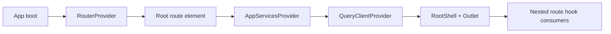

# F-04-RESIDUAL-A Root provider guard hard QA review

## Artifact Metadata

### Markdown Artifact Path Suggestion

- `docs/planning/reviews/20260408-f04-residual-a-root-provider-guard-hard-qa-review.md`

## Summary

This review records the hard, evidence-first QA pass for Lane E
`F-04-RESIDUAL-A` after provider ownership moved from `App.tsx` to `Root.tsx`
and the shell gained a direct Root-level integration guard.

The goal of this QA pass is to verify three things:

- the shipped runtime now matches the canonical shell-boundary docs;
- the new Root integration test protects the real route-composition path
  instead of a test-only wrapper;
- the residual slice closes without introducing a hidden regression in web
  routing, provider ownership, or validation posture.

Canonical execution tracking remains in:

- `docs/planning/state/agent-lane-e.yaml`
- `docs/architecture/frontend/appshell/data-source-service-boundary.md`
- `docs/planning/closeouts/F-04-RESIDUAL-A-root-provider-guard-closeout.md`

## Governing Sources

- `docs/planning/status/governance-document-rule-inventory.md`
- `AGENTS.md`
- `docs/guides/ai-work-protocol.md`
- `docs/planning/state/planning-control-tower.md`
- `docs/planning/reviews/review-status-board.md`
- `docs/planning/reviews/review-naming-policy.md`
- `docs/planning/state/agent-lane-e.yaml`
- `docs/architecture/frontend/appshell/data-source-service-boundary.md`
- `docs/planning/closeouts/F-04-RESIDUAL-A-root-provider-guard-closeout.md`

## Findings

### High

- No critical findings.

### Medium

- No medium-severity findings.

### Low

- No low-severity findings.

## Alignment

- Doc vs code:
  Aligned. The boundary doc states that `Root` owns `AppServicesProvider`, and
  the runtime now matches that ownership model.
- Promise vs implementation:
  Aligned for the stated `F-04-RESIDUAL-A` scope. `App` no longer shadows the
  provider boundary, and the real route root now carries the provider.
- Tests vs claims:
  Aligned. The focused Root integration guard fails without provider ownership
  and passes after the ownership move.
- Current truth vs planned truth:
  Current truth now matches the lane target for `F-04-RESIDUAL-A`, while the
  parent `F-04-RESIDUAL` slice remains open for `B` and `C`.
- Documentation update status:
  Updated in closeout, lane, and review surfaces.
- Evidence and risk-doc status when applicable:
  No ARC evidence or risk-register update is required because the touched paths
  remain inside `apps/web` and planning docs.

## Architecture Assessment

- SRP:
  Improved. `App` is reduced to app bootstrapping, while `Root` now owns the
  shell-composition responsibility declared in the frontend boundary docs.
- DDD:
  Maintained. No domain contract changed, but the runtime seam ownership is now
  less ambiguous.
- Hexagonal:
  Improved. The provider boundary is attached to the real route root instead of
  being implicitly hidden one level above it.
- CQRS if relevant:
  Maintained. This slice is composition and shell wiring only.
- Complexity:
  Low and justified. One ownership move removed a code/doc mismatch and made
  the integration guard meaningful.
- Modularity:
  Improved. There is now one clear shell entrypoint for route-facing services.

## Test Assessment

- Negative paths present:
  - RED phase proved `Root` fails without provider ownership when nested hook
    consumers render through the real route path
  - existing `AppServicesContext` tests still protect the hook-without-provider
    failure path
- Negative paths missing:
  - none material for the reviewed residual-A scope
- Regression status:
  Green on focused Root/provider tests, package `@dvt/web` test suite,
  package typecheck, package build, and repo pre-push gate.
- Determinism:
  No nondeterministic behavior introduced in the reviewed seam.
- Local suite vs meaningful global confidence:
  Good. The review used both focused regression coverage and full package
  validation.
- Global system view applied:
  Yes. The review checked route composition, provider ownership, docs truth,
  planning truth, and repo quality gates together.
- Harness or shared fixture need:
  Current harnessing is sufficient for this slice.
- Test grouping by type (`unit` / `integration` / `contract` / `e2e` /
  regression) and rationale:
  - `integration/regression`: `Root.test.tsx`
  - `provider-seam regression`: `AppServicesContext.test.tsx`
  - `package confidence`: `pnpm --filter @dvt/web test`, `typecheck`, `build`

## Quality Gates

- Commands executed:
  - `git diff -- apps/web/src/app/App.tsx apps/web/src/app/Root.tsx apps/web/src/app/Root.test.tsx docs/planning/state/agent-lane-e.yaml docs/planning/closeouts/F-04-RESIDUAL-A-root-provider-guard-closeout.md`
  - `rg -n "useShellRuntime\\(|useCapabilitiesQuery\\(|useAppDataSourceMode\\(|useWorkspaceService\\(|useRunsService\\(|usePlansService\\(" apps/web/src/app -g '!**/*.test.*'`
  - `pnpm --filter @dvt/web exec vitest run src/app/Root.test.tsx src/app/services/AppServicesContext.test.tsx --config vitest.config.ts`
  - `pnpm --filter @dvt/web typecheck`
  - `pnpm --filter @dvt/web test`
  - `pnpm --filter @dvt/web build`
  - `pnpm docs:sync`
  - `pnpm docs:workboard:generate`
  - `pnpm verify:prepush`
  - `pnpm exec prettier --check apps/web/src/app/App.tsx apps/web/src/app/Root.tsx apps/web/src/app/Root.test.tsx docs/planning/state/agent-lane-e.yaml docs/planning/closeouts/F-04-RESIDUAL-A-root-provider-guard-closeout.md docs/planning/reviews/20260408-f04-residual-a-root-provider-guard-hard-qa-review.md docs/planning/reviews/review-status-board.md`
  - `pnpm exec markdownlint-cli2 --ignore-path .markdownlintignore docs/planning/closeouts/F-04-RESIDUAL-A-root-provider-guard-closeout.md docs/planning/reviews/20260408-f04-residual-a-root-provider-guard-hard-qa-review.md docs/planning/reviews/review-status-board.md`
- What passed:
  - the real route root now owns the app-services provider
  - the focused Root integration guard is meaningful and green
  - package-level web validation passed
  - docs sync and workboard generation passed
  - formatting and markdown checks on the reviewed docs passed
  - repo pre-push gate passed
- What failed:
  - Nothing in the final review baseline
- What could not be verified:
  - Nothing material for the reviewed residual-A scope

## Unblock Roadmap

### Wave 0 - Provider ownership closure

Tasks: `RESIDUAL-A-QA-1`, `RESIDUAL-A-QA-2`

Target:

- `Root` is the actual provider owner at runtime;
- the integration guard proves that ownership through the real route path.

### Wave 1 - Planning and documentary truth

Tasks: `RESIDUAL-A-QA-3`

Target:

- lane, closeout, and review navigation surfaces describe the shipped residual-A
  state accurately.

### Wave 2 - Residual chain continuation

Tasks: `RESIDUAL-A-QA-4`

Target:

- the parent `F-04-RESIDUAL` chain proceeds to `F-04-RESIDUAL-B` and
  `F-04-RESIDUAL-C` without reopening provider-ownership ambiguity.

## Action Artifact

### Task Checklist

- [x] `RESIDUAL-A-QA-1` Verify that runtime provider ownership moved from `App` to `Root`
- [x] `RESIDUAL-A-QA-2` Verify that the Root integration guard exercises the real route boundary
- [x] `RESIDUAL-A-QA-3` Reconcile lane/closeout/review surfaces with the shipped residual-A truth
- [ ] `RESIDUAL-A-QA-4` Continue the parent residual chain with provider-override cleanup in `F-04-RESIDUAL-B`

### Task Details

#### `RESIDUAL-A-QA-1` Verify that runtime provider ownership moved from `App` to `Root`

- Objective: Confirm the code/doc mismatch is actually removed in runtime code.
- Scope: `App.tsx`, `Root.tsx`, and the shell-boundary doc.
- Recommended owner: Lane E owner.
- Dependencies: none beyond the active residual-A slice.
- Documentation impact: direct because the boundary doc now claims shipped
  truth, not intended future state.
- Evidence / risk-doc impact: this review acts as hard-QA evidence for the
  slice; no separate risk-register update is required.
- Comment with rationale: If `App` still owns the provider in practice, the
  residual slice is only cosmetically green.
- Definition of Done:
  - `App.tsx` no longer wraps the router with `AppServicesProvider`;
  - `Root.tsx` owns the provider boundary around `RootShell`.

#### `RESIDUAL-A-QA-2` Verify that the Root integration guard exercises the real route boundary

- Objective: Ensure the new test would fail on a real provider regression
  instead of depending on a harness-only wrapper.
- Scope: `Root.test.tsx`
- Recommended owner: Lane E owner.
- Dependencies: `RESIDUAL-A-QA-1`
- Documentation impact: validation evidence recorded in closeout and review.
- Evidence / risk-doc impact: direct QA evidence only.
- Comment with rationale: A shell guard is only useful if it proves the real
  route composition, not a test-only setup.
- Definition of Done:
  - the test mounts `Root` directly under routing;
  - nested hook consumers resolve app services successfully through `Root`.

#### `RESIDUAL-A-QA-3` Reconcile lane/closeout/review surfaces with the shipped residual-A truth

- Objective: Keep planning and review navigation aligned with the actual
  provider-ownership fix.
- Scope: lane registry, closeout, review artifact, and review board.
- Recommended owner: Lane E owner.
- Dependencies: `RESIDUAL-A-QA-1`, `RESIDUAL-A-QA-2`
- Documentation impact: direct.
- Evidence / risk-doc impact: this review becomes part of the governed planning
  surface.
- Comment with rationale: Hard QA is only durable if later readers can discover
  it from the canonical planning surfaces.
- Definition of Done:
  - lane references the review artifact;
  - review board lists the new hard-QA artifact;
  - the closeout and review agree on final validation status.

#### `RESIDUAL-A-QA-4` Continue the parent residual chain with provider-override cleanup in `F-04-RESIDUAL-B`

- Objective: Keep the parent residual slice moving without reopening the
  residual-A seam.
- Scope: lane sequencing only for this review.
- Recommended owner: Lane E owner.
- Dependencies: `RESIDUAL-A-QA-1`, `RESIDUAL-A-QA-2`, `RESIDUAL-A-QA-3`
- Documentation impact: none beyond lane sequencing.
- Evidence / risk-doc impact: none for residual-A itself.
- Comment with rationale: This review closes provider ownership, but it does
  not close the full residual chain.
- Definition of Done:
  - `F-04-RESIDUAL-B` remains the next governed slice;
  - no later residual task assumes the provider boundary is still unresolved.

## Mermaid Diagram

## Final Verdict

`F-04-RESIDUAL-A` passes this hard QA review with no blocking findings. The
runtime now matches the shell-boundary documentation, the integration guard
protects the real Root composition path, and the validation baseline is green.
The parent `F-04-RESIDUAL` chain remains open for `F-04-RESIDUAL-B` and
`F-04-RESIDUAL-C`, but no residual-A defect requires a fix before moving on.
