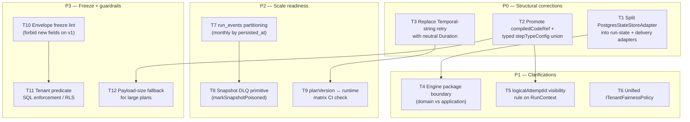
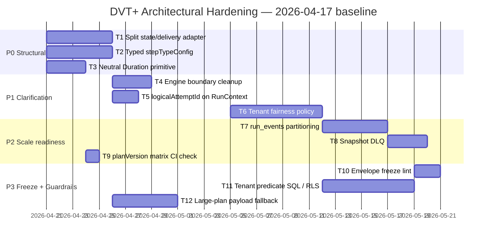
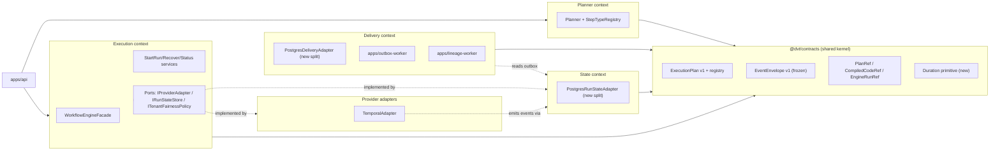

# DVT+ Deep Architectural Review

**Reviewer stance:** Principal / Staff architect. Optimized for correctness and
durability, not tone. Based strictly on current repository contents: contracts,
engine source, planner source, adapter code, and the accepted ADR catalog.

**Governing sources:**

- [AGENTS.md](../../../AGENTS.md)
- [docs/planning/status/governance-document-rule-inventory.md](../status/governance-document-rule-inventory.md)
- [docs/architecture/reference-architecture.md](../../architecture/reference-architecture.md)
- [docs/planning/execution-model/dvt-execution-model.md](../execution-model/dvt-execution-model.md)
- [docs/architecture/system-delivery-status.md](../../architecture/system-delivery-status.md)
- Canonical contracts under [`packages/@dvt/contracts/src/`](../../../packages/@dvt/contracts/src/)
- Engine implementation under [`packages/@dvt/engine/src/`](../../../packages/@dvt/engine/src/)
- ADRs 0003, 0004, 0010, 0012, 0014, 0017, 0018, 0031, 0032, 0033, 0034, 0036

**Claim under evaluation:**

> "The UI does not execute. The engine decides on its domain. The planner does
> not persist state."

---

## 1. Conceptual Soundness

### 1.1 What is solid

- `IWorkflowEngine` surface ([packages/@dvt/engine/src/contracts/IWorkflowEngine.v1.ts](../../../packages/@dvt/engine/src/contracts/IWorkflowEngine.v1.ts)) is genuinely narrow: `startRun`, `recoverRun`, `cancelRun`, `getRunStatus`, `signal`. Enrichment and health were explicitly split off (`IRunEnrichmentService`, `IRunHealthService`) — that regression guard (AR-A12-C) is real and noticed.
- `getRunStatus` is forced to the snapshot + event-replay path only; the contract forbids provider adapter calls on the default read path. This is correctly enforced at the service boundary ([RunStatusQueryService.ts](../../../packages/@dvt/engine/src/services/RunStatusQueryService.ts)).
- The CQRS split on the write side is real: `EventInput` → `EventEnvelope` with store-assigned `runSeq` and `persistedAt`; callers cannot forge order. `(runId, idempotencyKey)` is the idempotency boundary. ADR-0004 is enforced by type, not by comment.
- Pre-dispatch intent log (ADR-0030) plus `estimateRunRef()` (ADR-0014) eliminates the dual-producer bootstrap race. That is a solid distributed-systems primitive.
- Bounded-context declaration in [ADR-0034](../../adr/ADR-0034-bounded-context-boundaries-and-communication-rules.md) is unambiguous. The documentary intent is clean.
- Planner is deterministic: `planId = sha256(JCS(planCore))`, `inputHashSha256` excludes observability, canonical JSON emitted. Replay-friendly by construction.

### 1.2 What is fragile

- **"Planner / Engine / State" separation is real on paper, partial in code.** The Engine package does not import `@dvt/planner` or `@dvt/delivery` (verified by grep), but:
  - `PostgresStateStoreAdapter` implements `IRunStateStore`, `IRunSnapshotStalenessQuery`, **and** `IOutboxStorage` in a single class ([PostgresStateStoreAdapter.ts:36-38](../../../packages/@dvt/adapter-postgres/src/PostgresStateStoreAdapter.ts)). That fuses the State and Delivery bounded contexts at the physical type level. ADR-0034 §2.5 explicitly forbids delivery logic on state surfaces.
  - The Engine imports `@dvt/run-domain` and instantiates its own `SnapshotProjector`. OK; but `PostgresStateStoreRuntime` also maintains a materialized snapshot incrementally inside the adapter. Two projector implementations must stay behaviorally identical forever.
- **`ExecutionPlan` admits typed escape hatches.** `stepTypeConfig: Record<string, unknown>` is the transport for `compiledCodeRef` (ADR-0032 Option A). `@dvt/adapter-temporal/src/activities/stepActivityValidation.ts` hardcodes the string `'compiledCodeRef'`. That means:
  - The contract claims adapter-agnostic; the adapter pulls a known key by name.
  - Plan reviewers cannot tell from the schema which fields are semantic and which are opaque.
  - ADR-0034 §6.3 forbids "convenience utilities unrelated to boundary validation" in `@dvt/contracts`; `stepTypeConfig` is a de facto private channel between planner and adapter.
- **Retry policy leaks Temporal strings into the shared kernel.** [ExecutionStepRetryPolicyV1](../../../packages/@dvt/contracts/src/contracts/planner/ExecutionPlan.v1.ts) uses ``initialInterval: `${number}s` ``. The file comment is explicit: "Temporal-compatible duration strings because the current adapter is the only production runtime". ADR-0003 (Execution Model Sovereignty) says adapters translate, not define. This field does the opposite — the domain contract encodes a Temporal convention.
- **`logicalAttemptId` is silently forced to 1 at the engine boundary.** [WorkflowEngine.ts:177](../../../packages/@dvt/engine/src/core/WorkflowEngine.ts) sets `logicalAttemptId: 1` unconditionally in `resolveInitialRunContext`. Business retry is only reached through `recoverRun()`. Any caller that thinks it is supplying `logicalAttemptId` at `startRun` is wrong by construction and the types do not prevent that expectation because `RunContext` does not carry the field at all (only `ResolvedRunContext` does). The resolution is hidden in the engine — correct, but a new contributor will not see it.
- **State-driven UI at scale.** The UI reads canonical status from `getRunStatus` (snapshot + fallback). For 1000+ concurrent runs with multi-second step events, single-poll reads over Postgres snapshots are acceptable. For push-streaming (SSE/WS on Sprint 4), no contract surface exists yet. `apps/web` currently has no streaming boundary. The "state drives UI" claim is correct for pull; the push story is unbuilt.
- **Temporal payload ceiling.** `assertWorkflowStartPayloadWithinLimit` is configurable, but Temporal's default workflow input limit is ~2 MB. With ADR-0012, the engine sends the fully verified `ExecutionPlan` into the workflow args. A 1000-node dbt project with step configs, tags, and `compiledCodeRef` references will press or cross that limit. There is no fallback of "pass PlanRef, refetch inside activity" — the ADR-0012 rewrite removed it. That fallback removal is correct for integrity, but it puts a physical ceiling on plan size.

### 1.3 What is missing

- **No formal plan/event schema evolution matrix test**. ADR-0036 declares a registry and runtime compatibility matrix. Contract vector fixtures exist. There is no pairwise test that asserts `{planVersion, runtimeName} ∈ PLAN_RUNTIME_COMPATIBILITY_MATRIX ↔ engine accepts/rejects`. The mechanism exists; the enforcement surface does not.
- **No documented concurrency cap per tenant** in `IWorkflowEngine` or state-store. Outbox has rate limiting (`IOutboxRateLimiter`). Run admission has "backpressure admission" in `apps/api`. These are not unified under a single tenant fairness contract.
- **No rollback contract for `ExecutionPlan` bumps.** ADR-0017 / ADR-0036 tell you how to add a new `planVersion`. They do not say how to deprecate or force-migrate. The registry union grows monotonically unless someone writes an ADR that did not ship.
- **Cost attribution is absent.** There is no `ICostSink` port, no `CostEvidence` on `RunMetadata`, no contract for per-step cost capture. The prompt treats cost as a design axis; the repo does not.
- **Plugin runtime is absent.** Execution-model §21 declares plugin rules, but no `@dvt/plugin-*` package exists. This is documentation of a non-existent surface.

---

## 2. Architectural Risk Map

| #   | Risk                                                            | Severity    | Likelihood                      | Why                                                                                                                                                                                                                                                                                            | Mitigation                                                                                                                                                                                                                                                                                                                          |
| --- | --------------------------------------------------------------- | ----------- | ------------------------------- | ---------------------------------------------------------------------------------------------------------------------------------------------------------------------------------------------------------------------------------------------------------------------------------------------- | ----------------------------------------------------------------------------------------------------------------------------------------------------------------------------------------------------------------------------------------------------------------------------------------------------------------------------------- |
| R1  | State / Delivery fusion inside `PostgresStateStoreAdapter`      | **High**    | **High**                        | One class implements `IRunStateStore` + `IOutboxStorage` + `IRunSnapshotStalenessQuery`. ADR-0034 §2.5 forbids it. Any consumer that holds that adapter reference can bypass the delivery bounded context.                                                                                     | Split the adapter into a write-path adapter and a delivery-claim adapter. Remove outbox methods from `PostgresStateStoreAdapter`; keep them on `PostgresOutboxStore` and require the delivery runtime to depend on that store only.                                                                                                 |
| R2  | `stepTypeConfig` opaque transport leaking adapter-specific keys | **High**    | **High**                        | `compiledCodeRef`, `retries` (previously), and future kind-specific knobs travel as `Record<string, unknown>` and are mined by name in activities. This is a contract-less channel.                                                                                                            | Promote `compiledCodeRef` to a typed optional field on `ExecutionStepV1`. Force `stepTypeConfig` to a discriminated union per `StepKind`, registered in `@dvt/contracts/step-registry`. Forbid string lookups in adapters.                                                                                                          |
| R3  | Retry policy expressed in Temporal string format                | Medium      | **High**                        | `` `${number}s` `` encoding couples the domain to Temporal. A Conductor or Argo adapter must re-parse. Replay under a different runtime can disagree on semantics (leap seconds, parsing rules).                                                                                               | Model `retryPolicy` as `{ maxAttempts: number; initialInterval: Duration; maximumInterval: Duration; backoffCoefficient: number }` where `Duration` is an ISO-8601 or milliseconds primitive. Let the adapter convert.                                                                                                              |
| R4  | Event duplication under snapshot-projector staleness            | Medium      | Medium                          | `applyRunEvent` throws `InvalidStateTransitionError` on out-of-order events. A poison event blocks snapshot rebuild indefinitely. No snapshot-level DLQ.                                                                                                                                       | Add a snapshot-failure DLQ in `IRunSnapshotStalenessQuery`. Expose a `markSnapshotPoisoned(tenantId, runId, reason)` maintenance primitive. Route operator repair through it instead of relying on manual SQL.                                                                                                                      |
| R5  | Idempotency breakdown across recovery-created runs              | Medium      | Medium                          | `IIdempotencyKeyBuilder.runEventKey` includes `logicalAttemptId`. Recovery increases `logicalAttemptId`. If a caller retries `recoverRun` twice and the first succeeded partially, the second derives a different key and can produce duplicate semantic facts in a different logical attempt. | Define `recoverRun` itself as `(sourceRunId, planRef, ctx)` idempotent by `(tenantId, sourceRunId, logicalAttemptId)` through a dedicated intent, separate from start-run intent. Today it routes through `StartRunApplicationService` via `parseRecoverRunCommand` but the intent identity may not survive caller retries cleanly. |
| R6  | Planner ↔ Adapter implicit coupling through `stepKind`          | Medium      | Medium                          | `createDefaultStepTypeRegistry` only registers DBT kinds. Temporal activity dispatcher matches `step.kind` to a handler. Any new kind requires two coordinated edits and no CI check enforces the pair.                                                                                        | Add a boundary test: for every kind in `IStepTypeRegistry`, the adapter must register a handler. Fail the build otherwise.                                                                                                                                                                                                          |
| R7  | Plan integrity ceiling under Temporal payload limit             | Medium      | **High** (at scale)             | ADR-0012 dispatches the full verified `ExecutionPlan` into `workflowClient.start(args)`. Temporal caps gRPC payloads (~4 MB; default 2 MB). 1000-node projects with step configs can breach.                                                                                                   | Either (a) chunk large plans into layer-scoped sub-workflows that fetch their slice by `PlanRef`, or (b) push `PlanRef` into the workflow and reintroduce a shared verifier inside the activity boundary (reverses part of ADR-0012). Chunking preferred because it preserves ADR-0012.                                             |
| R8  | Multi-tenant isolation relies on soft policy hook               | **High**    | Medium                          | `AllowAllAuthorizer` ships as the default and is composable in production paths. `RunAccessPolicy` enforcement is per-call. No runtime guarantee that every Engine method paths through it before state-store reads.                                                                           | Move tenant enforcement into the state-store SQL layer (row-level security or mandatory `tenant_id` predicate enforced by `check` constraint on each query). Deny cross-tenant reads at the SQL boundary, not the Node boundary.                                                                                                    |
| R9  | Cost attribution missing                                        | Medium      | **High**                        | No contract port. Adding it later means versioning `RunEvents` or `WorkflowSnapshot`.                                                                                                                                                                                                          | Define `ICostSink` now, emit `StepCostRecorded` event as optional. Keep the shape minimal; capture at adapter boundary where the provider already has run-time data.                                                                                                                                                                |
| R10 | Operational complexity of multi-worker topology                 | Medium      | Medium                          | Outbox sharding (ADR-0033), projector worker, lineage worker, temporal worker, archive coordinator, purge runtime all shipped as independent runnables. Each needs dedicated config, health, metrics, rollout.                                                                                 | Publish a single `apps/dvt-runtime` composition entry that starts the right workers by flags. Keep the binaries, but make one canonical launcher path the default deployment.                                                                                                                                                       |
| R11 | Plugin security risk (aspirational)                             | Low (today) | Low (today), rises with roadmap | Execution model §21 declares plugin rules. No plugin runtime exists. When it ships, today's `stepTypeConfig` escape hatch is the path of least resistance for plugin authors.                                                                                                                  | Build plugin surface with capability tokens **before** first plugin. Do not ship a plugin runtime that reads `stepTypeConfig` directly.                                                                                                                                                                                             |
| R12 | Planner and plan-verifier drift on `planVersion` registry       | Medium      | Medium                          | Contracts own the registry; plan-verifier owns the runtime matrix. Two sources. A mismatch is silently acceptable in contract tests that do not cross-check.                                                                                                                                   | Add a contract test in a neutral workspace that asserts `SUPPORTED_EXECUTION_PLAN_VERSIONS ⊆ PLAN_RUNTIME_COMPATIBILITY_MATRIX.keys()` and every key has at least one runtime verdict.                                                                                                                                              |

---

## 3. Engine Abstraction Critique

The `IWorkflowEngine` contract ([IWorkflowEngine.v1.ts](../../../packages/@dvt/engine/src/contracts/IWorkflowEngine.v1.ts)) is minimal:

```ts
interface IWorkflowEngine {
  startRun(planRef, context);
  recoverRun(sourceRunId, planRef, context);
  cancelRun(engineRunRef);
  getRunStatus(engineRunRef);
  signal(engineRunRef, request);
}
```

That is **correct**. The real fragility is in the concrete `WorkflowEngine`
class, which is an application-layer facade that composes:

- `StartRunApplicationService`
- `RecoverRunApplicationService`
- `RunControlService` (cancel + signal)
- `RunStatusQueryService`
- authorization, plan-fetch, plan-integrity, intent store, outbox rate limiter,
  idempotency key builder, observability, clock, state store read + write,
  adapter registry, required-providers guard

The interface is narrow. The object behind it is not. That is fine for a
composition root, but the engine _package_ is now the de facto application
layer — not a pure domain core. If the claim is "the engine decides on its
domain", the domain in practice is "run lifecycle + admission + intent +
compensation + snapshot read". Call that honestly; do not sell it as a thin
domain core.

### 3.1 Temporal-first is defensible today, risky long-term

- **Defensible**: Temporal gives durable timers, signal semantics, deterministic
  replay, and activity retry for free. Replicating those on top of Postgres is
  a multi-year effort that would starve the rest of the roadmap.
- **Risky**:
  - `ExecutionStepRetryPolicyV1` leaks Temporal duration format (§1.2).
  - `IProviderAdapter.estimateRunRef` is optional; Conductor may or may not support the pattern. The engine already depends on it for the crash-consistency story. Saying it is optional but relying on it is a soft contract.
  - `CURRENT_SIGNAL_SEMANTICS_VERSION` is declared in `@dvt/contracts`, but each adapter publishes its own supported versions. There is no registry that asserts "signal v1.2 semantics are supported on both Temporal and Conductor" — when Conductor lands, silent feature asymmetry becomes possible.

### 3.2 Event model robustness

- Envelope shape is correct. `payloadVersion: 1` is locked. Persisted vs. input
  split is correctly enforced.
- The `EventType` union is exhaustive for run + step lifecycle.
- **Gap**: no `EventType` for `SnapshotRebuilt`, `ArtifactPublished`,
  `CostRecorded`, `LineagePublished`. These are emitted via outbox/lineage
  pipelines but do not carry a uniform envelope. That is acceptable because
  those are not run-lifecycle events; they are operational facts. But if the
  roadmap wants a single audit timeline, unify the envelope now, not later.

### 3.3 ExecutionPlan expressiveness

| Dimension       | Present                                                                                                           | Missing                                                                            |
| --------------- | ----------------------------------------------------------------------------------------------------------------- | ---------------------------------------------------------------------------------- |
| Identity        | `planId`, `planVersion`, `schemaVersion`, `contractVersion`, `inputHashSha256`, `plannerVersion`, `plannerGitSha` | none                                                                               |
| Structure       | Steps with `dependsOn`, `kind`, optional `retryPolicy`, optional `gateway`                                        | no fan-in/fan-out semantics beyond DAG; no cost budget per step; no SLA per step   |
| Runtime binding | separate `RunExecutionPolicy` (capabilities, plugin fingerprint)                                                  | no `resourceClass` (CPU/mem hints); no warehouse hint distinct from plugin context |
| Observability   | `observability: { tags, extra }`                                                                                  | no required `spanNameHint` or `traceCategory` — hardcoded in engine spans          |

### 3.4 Where determinism can fail

1. Temporal workflow input is the full plan. If planner adds any
   non-deterministic field (clock-stamp beyond `createdAtIso`, nondeterministic
   ordering), replay of an in-flight workflow after worker restart desynchronizes.
   Planner currently uses JCS canonicalization; stay disciplined.
2. `applyRunEvent` is declared pure, but `applyCanonicalRunEvent` comes from
   `@dvt/run-domain`. Any future injection of clock reads, env reads, or
   random IDs inside that package silently breaks projector determinism.
   No lint rule forbids it today.
3. `IClock` is threaded through engine services, which is correct. But
   `TemporalAdapter.startRun` reads no clock — good. `RunPlanWorkflow` has a
   strict comment banning `Date.now()`. That is sandbox-enforced by
   `@temporalio/workflow`. Strong.
4. Activities (`stepActivities.ts`) are non-deterministic by design. Any domain
   logic that drifts from activity to workflow scope loses replay. The boundary
   is currently disciplined; a code-review culture must maintain it.

---

## 4. Execution Planning Layer Analysis

### 4.1 DAG analyzer

- Based on `GenericGraphSourceV1`, not dbt manifest directly. Good boundary
  decoupling.
- `derivePlannerGraphSourceFromManifest` lives in
  [packages/@dvt/planner/src/application/](../../../packages/@dvt/planner/src/application/) —
  acceptable translation layer.
- `GraphBuilder` + `topoSort` + `computeTopoDepth` + limits are mechanical and
  deterministic.
- **Risk**: only one `StepFactory` (`dbtStepFactory`) ships. The "multi-source"
  graph abstraction is validated by exactly one implementation. The abstraction
  may be over-generalized for the current producer set.

### 4.2 Partial execution

- Node selection via `PlannerSelection { selectedNodeIds, includeUpstream,
includeDownstream }`. Correct primitive.
- There is no "resumed from failed step" partial plan — recovery re-plans from
  the same canonical input. If the input changed between runs (manifest
  delta), `planId` changes and therefore identity too. Good for auditability,
  painful for operators who want "re-run from step X".
- **Gap**: no explicit contract for step exclusion mid-run. Gateways provide
  branching, not exclusion.

### 4.3 Retry / backoff ownership

- `ExecutionStepRetryPolicyV1` is emitted by planner and consumed by the
  activity dispatcher (S09 closed 2026-03-24 per delivery status). Ownership is
  now planner-emitted, adapter-consumed. This is the right direction.
- **Residual risk**: Temporal's own activity retry can masquerade as a business
  retry if the logical-attempt-id discipline slips. The workflow is clear about
  this today; code review must keep it that way.

### 4.4 Cost estimator

- **Not implemented.** Status document mentions "cost attribution baseline"
  as Sprint 3 exit criteria. No contract surface exists. Treat this as absent.

### 4.5 Plan versioning

- ADR-0017 + ADR-0036 define the registry + runtime matrix. Good.
- **Soft link**: additions-only is not enforced by a machine check. A malicious
  or unaware PR can shrink `SUPPORTED_EXECUTION_PLAN_VERSIONS` and break
  deployed runtimes.

### 4.6 Over-engineered or under-specified?

- **Over-engineered**: `GenericGraphSourceV1` + step factories + registry is a
  four-layer indirection for one producer family (dbt). Keep the registry, but
  do not pretend this layer is exercised.
- **Under-specified**: no SLA/SLO annotation, no budget, no cost hint, no
  observability cardinality contract.
- **Hidden coupling to Snowflake**: the planner does not directly know about
  Snowflake. `TransformationExecutor = 'postgres' | 'dbt'` is in shared types.
  dbt is a compiler, postgres is a runtime — these are at different levels of
  abstraction. That is a concept leak.

---

## 5. State & Metadata Layer Review

### 5.1 Artifact immutability

- `PlanRef` carries `uri`, `sha256`, `schemaVersion`, `planId`, `planVersion`,
  `sizeBytes`, `expiresAt`. Immutability is addressable.
- `CompiledCodeRef` similar. Content-addressable.
- **Open**: the Artifacts bounded context (ADR-0034 §2.4) is declared but not
  extracted. `@dvt/artifacts` exists, but the artifact storage adapters (S3,
  MinIO, file://) are not owned by it yet per system-delivery-status.md.

### 5.2 Write amplification

- Outbox is at-least-once. Projector snapshot writes are upsert-on-each-event.
  Lineage outbox adds a second durable fanout. Archive lifecycle adds a third.
  For a run with N steps that is:
  - run_events writes: ~2N+4
  - snapshot upserts: ~2N+4
  - outbox enqueues: ~2N+4
  - lineage_outbox enqueues: ~N+2 (step granularity)
  - archive coordinator reads: O(run_events)

  At 1000 nodes per run and 1000 concurrent tenants, this is a high-volume
  OLTP profile on Postgres. Acceptable on a well-sized cluster, but
  unacceptable without partitioning on `run_events` (no ADR for partitioning
  is declared; check migrations).

### 5.3 Event sourcing vs mutable snapshot trade-off

- The chosen model (append-only events + derived snapshot) is correct and
  matches ADR-0004.
- `InvalidStateTransitionError` on projector is pessimistic: it assumes the
  event stream is authoritative. That is right. But without a snapshot DLQ
  (R4), operational recovery is manual.

---

## 6. Skipped (prompt omitted section 6)

The original prompt jumped from 5 to 7. Section preserved as placeholder so
this document's numbering matches the user's framework.

---

## 7. What Is Overbuilt

1. **`GenericGraphSourceV1` abstraction** for one dbt producer. The registry,
   factories, and multi-family plumbing exist; only one family ships. Keep the
   contract shape, but the planner codepaths specific to "multi-source" are
   premature.
2. **Multi-provider adapter abstraction**. `EngineRunRef` is a three-arm
   discriminated union (`temporal` | `conductor` | `mock`). Conductor is
   `ConductorAdapterStub`. The engine enforces required providers at construction
   but ships with one production provider. The indirection pays for itself only
   when provider #2 actually lands.
3. **Fine-grained outbox sharding ceremony** (ADR-0033) before a concrete
   throughput pain exists. The ADR is right that you will need this. Today's
   data volume probably does not. Ship single-owner; reshard when an SLO breaks.
4. **Separate `@dvt/observability` vs `@dvt/observability-otel` packages** with
   "facade must not pull OTel SDKs". This is a purity rule worth a line in a
   style guide, not two packages. The boundary benefit is theoretical until a
   second exporter exists.
5. **Signal semantics versioning** (`SignalSemanticsVersion`). Good idea, but
   one live version, one adapter. Overhead unless a migration is in flight.

---

## 8. What Is Underbuilt

1. **Migration strategy for `ExecutionPlan` schema**: only add; no deprecate.
2. **Rollback guarantees for ADR-0012 plan dispatch**: if an adapter reports
   success but the run never materializes provider-side, the Run Maintenance
   Service reconciles orphaned intents, but there is no user-facing rollback
   story.
3. **Distributed consistency model is implicit.** Engine + state-store +
   delivery + projector + lineage + archive = 6 writer/reader processes around
   one Postgres. Consistency is per-process best-effort. No documented
   happens-before graph.
4. **Concurrency model per tenant.** Backpressure lives in `apps/api`, rate
   limits in outbox. No single fairness contract.
5. **Backpressure strategy** is API-local. When a tenant floods `startRun`, the
   engine does not refuse early; the API does. That is fine until you add a
   second ingress (Kafka trigger, scheduler, etc.).
6. **Run retention policy** is declared by ADR-0038 and partially shipped
   (`DeliveryBufferPurgeRuntime` gated off by default). Actual retention
   windows per tenant are not visible in a config doc.
7. **SLA/SLO definitions** are absent. The Phase-1 "closed" labels do not map
   to observable availability/latency targets.
8. **Contract evolution with breaking change** — only additive policy is
   machine-enforced.

---

## 9. Scalability Outlook (3-Year Horizon)

Assumptions: 1000+ tenants, thousands of concurrent runs, 1000+ node projects,
cross-environment diffs, heavy cost dashboards.

### 9.1 Bottlenecks

| Component                        | Bottleneck shape                          | Earliest manifestation                                                               |
| -------------------------------- | ----------------------------------------- | ------------------------------------------------------------------------------------ |
| Postgres `run_events`            | Insert throughput + index bloat           | 500 concurrent runs with 1000 steps each                                             |
| Postgres `run_snapshots`         | Hot upsert on each event                  | Same workload; snapshot writer becomes the scalability limit before the event writer |
| Temporal workflow input size     | 2 MB gRPC cap                             | 2000-node dbt project or verbose `stepTypeConfig` payloads                           |
| Outbox publisher                 | Per-shard throughput with advisory locks  | When `shardCount` undersized for fan-out rate                                        |
| Projector worker snapshot fan-in | Stale-queue growth under projector outage | Multi-hour projector downtime                                                        |
| Lineage outbox                   | HTTP sink to Marquez                      | Marquez outage pushes DLQ growth fast                                                |
| API admission                    | Token bucket in process                   | Uncoordinated multi-instance API                                                     |

### 9.2 Single points of failure

- **Postgres primary.** Every bounded context except adapter-temporal converges
  on one database. Replication read-split is not evident in the code. HA story
  is "Postgres can be HA" — implicit.
- **Advisory-lock session for outbox shard ownership.** A network partition
  between worker and Postgres flips ownership. ADR-0033 acknowledges this.
- **Temporal cluster.** Single dependency for all run lifecycle.
- **Planner is stateless**, so it is not a SPOF but shares Postgres via plan
  store (`PostgresPlanStore`).

### 9.3 Data growth pressure

- `run_events`: primary growth. Archive via migration 007 / `RunArchiveCoordinator`. Policy is partial; retention enforcement is `DVT_PURGE_ENABLED=false` by default.
- `outbox`, `lineage_outbox`, `run_snapshots`, `delivery_buffer`: O(events) each.
- No declared Postgres partitioning strategy. At sustained load, monthly
  partition-by-`persisted_at` on `run_events` is not a "nice to have"; it is
  the difference between a 3-year system and a 12-month system.

### 9.4 Planner computation load

- Planner is pure and stateless. Scale-out is a horizontal knob.
- `computeTopoDepth`, `GraphBuilder`, `topoSort` are O(V+E).
- Limits (`maxNodes`, `maxDepth`, `timeoutMs`, `maxPlanSizeBytes`) exist.
- Largest risk is `canonicalPlanCoreJson` size, which is the hash input. JCS +
  JSON.stringify on a 1000-node plan is ~a few hundred kilobytes — cheap.

### 9.5 3-year verdict

The system scales to low-thousands of concurrent runs per tenant on one Postgres
with vertical scaling plus `run_events` partitioning. Beyond that, expect to
either:

- split Postgres per bounded context (state vs delivery vs plans vs archive), or
- move outbox/lineage to Kafka or a purpose-built log, or
- move `run_events` to a columnar write path and keep Postgres for snapshots.

None of this is imminent. It becomes necessary between year 2 and year 3 for
the stated target load.

---

## 10. Architectural Scorecard

| Dimension                 | Score (1–10) | Justification                                                                                                                                                                                                              |
| ------------------------- | ------------ | -------------------------------------------------------------------------------------------------------------------------------------------------------------------------------------------------------------------------- |
| Conceptual clarity        | **8**        | Bounded contexts and execution invariants are named, written, and largely enforced. Documentation density is unusually high.                                                                                               |
| Separation of concerns    | **6**        | Declared cleanly, violated in two key places: state/delivery fusion inside Postgres adapter, and engine-as-application-facade drift.                                                                                       |
| Replaceability of engine  | **5**        | Temporal is the only production adapter; `estimateRunRef` is optional but relied upon; `retryPolicy` leaks Temporal strings. The abstraction is real but not proven.                                                       |
| Determinism               | **8**        | Planner canonicalizes inputs. Workflow sandbox forbids non-deterministic APIs. Append-only event log. Only risk is unchecked drift into `@dvt/run-domain`.                                                                 |
| Extensibility             | **6**        | Contract registry for plan versions is good. `StepTypeRegistry` exists. `stepTypeConfig` escape hatch undercuts the extensibility story: extensibility by convention instead of by contract.                               |
| Operational realism       | **5**        | Six worker processes, advisory locks, sharded outbox, archive coordinator, purge runtime. Works in theory; nobody is deploying and operating all six in production yet. Runbooks and on-call playbooks lag behind code.    |
| Long-term maintainability | **7**        | ADR discipline, governance inventory, normative docs, CI gates (ARC policy, docs-sync, determinism lint) are strong. The principal risks are contract-as-shared-kernel bloat and the hidden coupling via `stepTypeConfig`. |

### SOLID / Hexagonal / OOP / CQRS check

| Principle              | Status                                                                                                                                                                                           |
| ---------------------- | ------------------------------------------------------------------------------------------------------------------------------------------------------------------------------------------------ |
| **SRP**                | Mostly honored. Violation: `PostgresStateStoreAdapter` with three interfaces.                                                                                                                    |
| **OCP**                | Plan-version registry + step-type registry give real OCP on the happy path. `stepTypeConfig` back door breaks it: extensions of plan semantics happen without opening a new ExecutionStep field. |
| **LSP**                | `IProviderAdapter` subtypes can drift on `estimateRunRef` (optional). Engine assumes presence. LSP-risky.                                                                                        |
| **ISP**                | Mostly good at declared ports. Violated at `PostgresStateStoreAdapter` which fuses three interfaces. Consumers see a god-object.                                                                 |
| **DIP**                | Engine depends on ports, not adapters. Adapters import engine ports. Directionally correct.                                                                                                      |
| **Hexagonal**          | The picture matches the reference architecture. Implementation matches for the Engine. State/Delivery adapter split is the main deviation.                                                       |
| **OOP with contracts** | Explicit. Value objects branded, aggregates named, policies named.                                                                                                                               |
| **CQRS**               | Real on the write side (`bootstrapRunTx`, `appendAndEnqueueTx`). Real on the read side (snapshot first, event replay fallback). Projector worker is separate. Good.                              |

---

## 11. Strategic Recommendations

### 11.1 Three structural changes

1. **Split `PostgresStateStoreAdapter`** into `PostgresRunStateAdapter`
   (implements `IRunStateStore` + `IRunSnapshotStalenessQuery`) and
   `PostgresDeliveryAdapter` (implements `IOutboxStorage` + lineage outbox).
   Make the delivery runtime depend only on the delivery adapter. This aligns
   shipped code with ADR-0034 §2.5.
2. **Promote `compiledCodeRef` (and other adapter-observed keys) to typed
   fields on `ExecutionStepV1`** or to a discriminated-union `stepTypeConfig`
   per `StepKind` in `@dvt/contracts/step-registry`. Forbid string-keyed lookups
   in adapters via a lint rule. The opaque `Record<string, unknown>` is a
   privacy hole across bounded contexts.
3. **Replace Temporal-string duration in `ExecutionStepRetryPolicyV1` with a
   neutral `Duration`.** Parsing to Temporal format stays in the adapter. This
   removes the loudest ADR-0003 violation.

### 11.2 Three clarifications needed

1. **Engine-as-domain vs. engine-as-application boundary.** Document whether
   `@dvt/engine` is the core domain or the application layer. Today it is
   both. Either extract an `@dvt/engine-application` workspace, or rename to
   admit the truth and stop calling `WorkflowEngine` a domain object.
2. **`logicalAttemptId` visibility to callers.** Either surface it on
   `RunContext` with a policy that rejects non-`1` for `startRun`, or document
   clearly that callers cannot set it and the engine resolves it. Current state
   is "implicitly forced to 1" — invisible discipline.
3. **Concurrency + fairness contract per tenant.** Unify outbox rate limit,
   API admission, projector throughput, and start-run cap into a single
   `ITenantFairnessPolicy`. Without this, every new ingress reinvents it.

### 11.3 Three things to freeze immediately

1. **`EventEnvelope` shape**, including `payloadVersion: 1`. Do not add new
   fields without a new `payloadVersion`. The envelope is on-disk forever.
2. **`planId = sha256(JCS(planCore))` identity rule.** Any change to
   canonicalization breaks retroactive auditability across all stored plans.
3. **Tenant-scoping requirement in every state-store read path.** Do not allow
   new read methods without `tenantId`. Freeze this as a `dependency-cruiser`
   / eslint rule now.

### 11.4 Three things to delay

1. **Plugin runtime.** There is no user for it. Every line written against the
   aspirational plugin model is ballast.
2. **Cost attribution depth.** Add a single `ICostSink` port and one event
   type. Do not design a cost model now. Let real dashboards pull the shape.
3. **Multi-engine (Conductor) work.** `ConductorAdapterStub` is a stub. Do not
   promote it until a paying reason appears. The abstraction is ready; the
   investment is not.

---

## 12. Action Plan (Bounded Tasks)

Tasks sized to a single slice each. Owners, target dates, validation hooks
follow the repository's existing lane model ([`docs/planning/state/`](../state/)).

### 12.1 Dependency chart



### 12.2 Action table

| #   | Task                                                                                                                                                                                                                                                                                       | Priority | Effort | Exit criteria                                                                                                                   | Validation                                                                  |
| --- | ------------------------------------------------------------------------------------------------------------------------------------------------------------------------------------------------------------------------------------------------------------------------------------------ | -------- | ------ | ------------------------------------------------------------------------------------------------------------------------------- | --------------------------------------------------------------------------- |
| T1  | Split `PostgresStateStoreAdapter` into `PostgresRunStateAdapter` + `PostgresDeliveryAdapter`                                                                                                                                                                                               | **P0**   | 5 d    | Delivery runtime no longer holds a reference typed as `IRunStateStore`. ADR-0034 §2.5 compliance verified by architecture test. | `pnpm test:adapter-postgres`, new arch test, affected integration suites    |
| T2  | Promote `compiledCodeRef` to typed optional field on `ExecutionStepV1`. Lock `stepTypeConfig` to discriminated union per `StepKind`. Add eslint rule forbidding string key lookups on `stepTypeConfig` in adapter packages.                                                                | **P0**   | 5 d    | `stepActivityValidation.ts` no longer references string `'compiledCodeRef'`. Contract vector fixtures updated.                  | `pnpm validate:contracts`, `pnpm test:adapter-temporal`, ADR-0032 amendment |
| T3  | Introduce neutral `Duration` primitive in `@dvt/contracts`. Convert `ExecutionStepRetryPolicyV1`. Temporal adapter owns ISO-8601 → Temporal-string mapping.                                                                                                                                | **P0**   | 3 d    | No `${number}s` literal in `@dvt/contracts`. Adapter converts at boundary. Tests cover 0 s / negative / overflow.               | `pnpm validate:contracts`, `pnpm test:engine`, `pnpm test:adapter-temporal` |
| T4  | Clarify `@dvt/engine` role. Either extract `@dvt/engine-application` or rename `WorkflowEngine` to `WorkflowEngineFacade` and move use-cases to a named application layer. Update [reference-architecture.md](../../architecture/reference-architecture.md).                               | P1       | 3 d    | Package docs state role. ADR added or extended. Import graph reflects it.                                                       | Docs sync, type-check, arch tests                                           |
| T5  | Move `logicalAttemptId` visibility policy into `RunContext`. Reject non-`1` at engine `startRun`. `recoverRun` keeps internal increment.                                                                                                                                                   | P1       | 2 d    | `RunContext` carries `logicalAttemptId` as optional; engine rejects invalid shape explicitly.                                   | `pnpm test:engine`                                                          |
| T6  | Unify tenant fairness: single `ITenantFairnessPolicy` port consumed by API admission, outbox rate limiter, projector, archive coordinator.                                                                                                                                                 | P1       | 7 d    | One policy object wired across runtimes. Config-driven per tenant.                                                              | Load test fixture, `pnpm verify:prepush`                                    |
| T7  | Add `run_events` partitioning migration (PARTITION BY RANGE (`persisted_at`)). Backfill script for existing data.                                                                                                                                                                          | P2       | 5 d    | New rows land in monthly partitions. Query plan uses partition pruning.                                                         | `pnpm test:adapter-postgres:docker`, migration replay test                  |
| T8  | Add snapshot DLQ primitive: `markSnapshotPoisoned`, `listPoisonedSnapshots`, operator runbook.                                                                                                                                                                                             | P2       | 3 d    | Projector worker routes `InvalidStateTransitionError` events to DLQ; metric emitted; runbook merged.                            | Projector tests, runbook link validated                                     |
| T9  | Add CI check: every `planVersion` in `SUPPORTED_EXECUTION_PLAN_VERSIONS` must exist as a key in `PLAN_RUNTIME_COMPATIBILITY_MATRIX` with at least one runtime verdict.                                                                                                                     | P2       | 1 d    | CI fails on mismatch.                                                                                                           | `pnpm validate:contracts`, new contract test                                |
| T10 | Freeze envelope: eslint/type rule + test asserting no new fields on `EventEnvelope` without a new `payloadVersion`.                                                                                                                                                                        | P3       | 2 d    | Adding a field to envelope requires bumping `payloadVersion`.                                                                   | Contract test, eslint rule                                                  |
| T11 | Enforce tenant predicate at SQL layer. Either Postgres RLS with role per tenant, or a `check` constraint pattern forcing `tenant_id = current_setting('app.tenant_id')` on every query.                                                                                                    | P3       | 7 d    | All state-store SQL functions assert tenant. Integration test proves cross-tenant read fails.                                   | `pnpm test:adapter-postgres:docker`                                         |
| T12 | Large-plan fallback: when verified plan size > Temporal-safe threshold, engine publishes plan to plan store and passes only `PlanRef`. A shared verifier runs once inside workflow activity. Keeps ADR-0012 engine-authoritative by requiring verifier fingerprint in activity parameters. | P3       | 5 d    | Plans > configured threshold dispatched via ref; integration test with 2000-node plan passes.                                   | New integration test, `pnpm test:adapter-temporal:integration`              |

### 12.3 High-level delivery schedule



### 12.4 Bounded-context target state



---

## 13. Final judgment (non-diplomatic)

The system is intellectually honest about what it wants to be — domain-owned
execution, hexagonal boundaries, event-sourced state, replaceable runtime.
Most of that is already real in the contracts and in the engine package.

The weaknesses are not in the ideas; they are in three places where
convenience won over purity:

1. The state-store adapter fuses state and delivery because one Postgres
   transaction is cheap.
2. `stepTypeConfig` is a policy-free transport because typing each step kind
   takes effort.
3. Retry durations follow Temporal because Temporal is the only adapter that
   exists.

All three are fixable on a 4–6 week horizon with the T1–T12 plan above. None
of them will fix themselves. Each of them grows a constituency of callers the
longer it stays.

The roadmap areas marked "overbuilt" (multi-engine, plugin runtime, cost
attribution depth, observability dual-package) should pause until a
paying customer forces them. The roadmap areas marked "underbuilt"
(partitioning, SLOs, concurrency fairness, schema migration policy,
snapshot DLQ) should not wait for one.

---

## Related

- [ADR-0003 Execution Model Sovereignty](../../adr/ADR-0003-execution-model.md)
- [ADR-0004 Event Sourcing Strategy](../../adr/ADR-0004-event-sourcing-strategy.md)
- [ADR-0012 Plan Integrity Ownership](../../adr/ADR-0012-plan-integrity-ownership.md)
- [ADR-0017 ExecutionPlan Schema Versioning](../../adr/ADR-0017_ExecutionPlan_Schema_Versioning.md)
- [ADR-0032 compiledCodeRef Ownership](../../adr/ADR-0032-compiledcoderef-ownership.md)
- [ADR-0033 Outbox Worker Sharding and Fencing](../../adr/ADR-0033-outbox-worker-sharding-and-fencing-model.md)
- [ADR-0034 Bounded Context Boundaries and Communication Rules](../../adr/ADR-0034-bounded-context-boundaries-and-communication-rules.md)
- [ADR-0036 ExecutionPlan planVersion Registry and Runtime Matrix](../../adr/ADR-0036-execution-plan-planversion-registry-and-runtime-matrix.md)
- [DVT+ Execution Model Spec](../execution-model/dvt-execution-model.md)
- [System Delivery Status](../../architecture/system-delivery-status.md)
