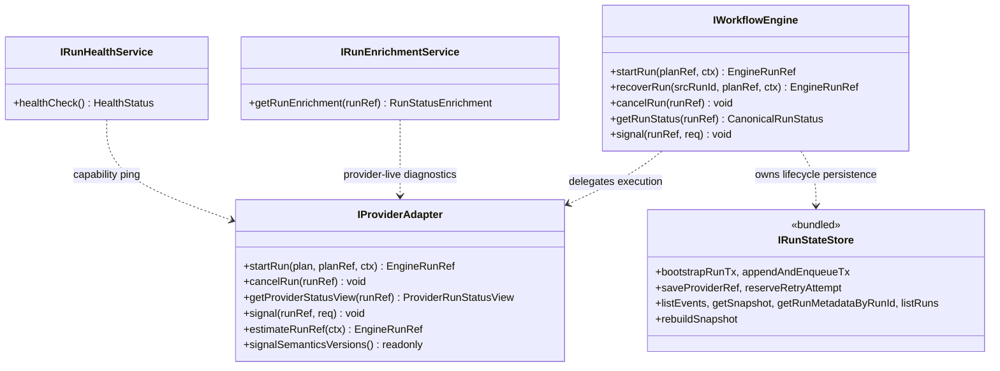
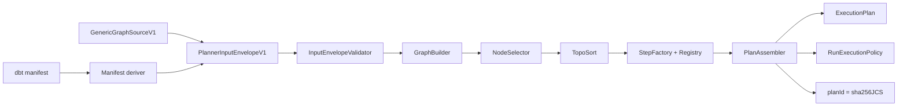
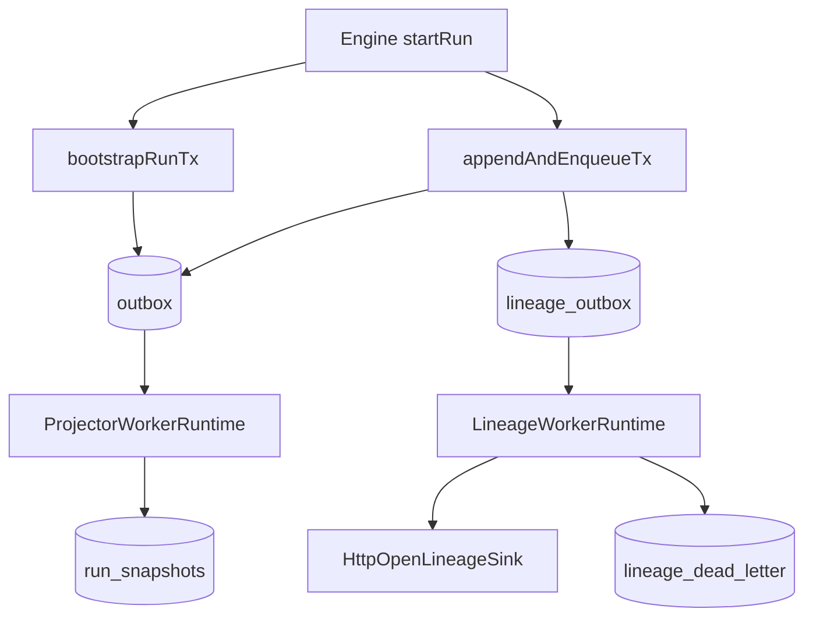
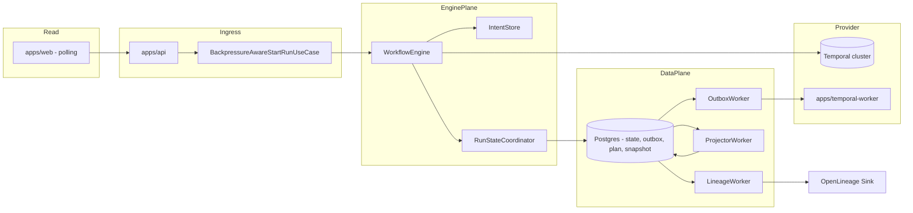
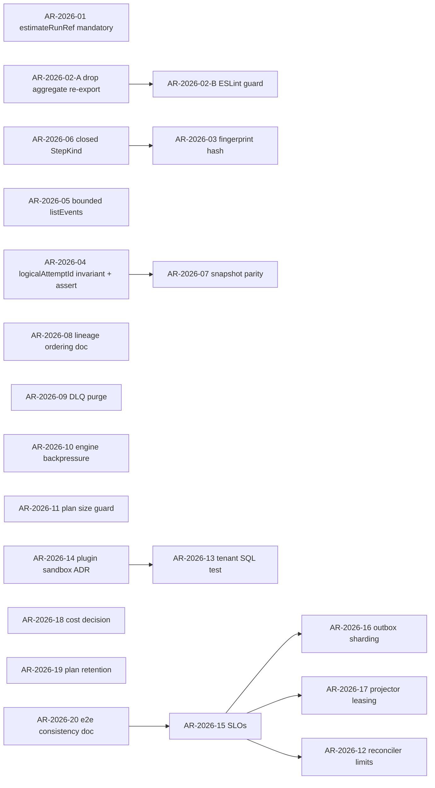
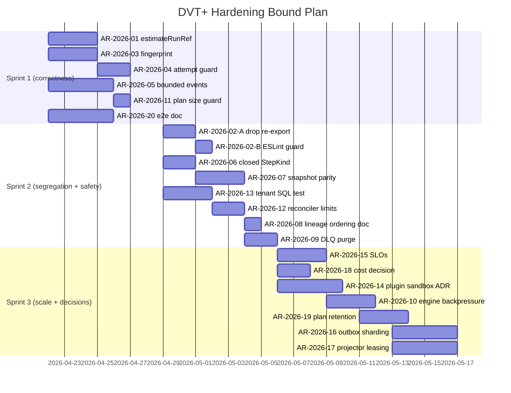

# DVT+ Deep Architectural Review

**Reviewer stance:** Principal / Staff Software Architect. Optimized for
correctness and durability, not for tone. Strict source-grounded review of the
current repository — contracts, engine, planner, adapters, delivery, and the
accepted ADR catalog.

**Companion to:** [`20260417-dvt-plus-deep-architectural-review.md`](./20260417-dvt-plus-deep-architectural-review.md). This document does not repeat that one — it sharpens the action plan.

## Governing Sources

- [`AGENTS.md`](../../../AGENTS.md), [`CLAUDE.md`](../../../CLAUDE.md)
- [`docs/planning/status/governance-document-rule-inventory.md`](../status/governance-document-rule-inventory.md)
- [`docs/architecture/reference-architecture.md`](../../architecture/reference-architecture.md)
- [`docs/planning/execution-model/dvt-execution-model.md`](../execution-model/dvt-execution-model.md)
- [`docs/architecture/system-delivery-status.md`](../../architecture/system-delivery-status.md)
- ADR-0003, 0004, 0010, 0012, 0013, 0014, 0015, 0017, 0018, 0030, 0031, 0032, 0033, 0034, 0035, 0036, 0037, 0038
- Code: [`packages/@dvt/contracts/`](../../../packages/@dvt/contracts/), [`packages/@dvt/engine/`](../../../packages/@dvt/engine/), [`packages/@dvt/planner/`](../../../packages/@dvt/planner/), [`packages/@dvt/adapter-temporal/`](../../../packages/@dvt/adapter-temporal/), [`packages/@dvt/adapter-postgres/`](../../../packages/@dvt/adapter-postgres/), [`packages/@dvt/delivery/`](../../../packages/@dvt/delivery/)

**Claim under evaluation:**

> "The UI does not execute. The engine decides on its domain. The planner does not persist state."

---

## 1. Conceptual Soundness

### 1.1 Solid

- `IWorkflowEngine` ([packages/@dvt/engine/src/contracts/IWorkflowEngine.v1.ts](../../../packages/@dvt/engine/src/contracts/IWorkflowEngine.v1.ts)) is genuinely narrow: 5 ops. Enrichment and health are split into `IRunEnrichmentService` / `IRunHealthService`; AR-A12-C added regression guards so they cannot silently reappear on the engine surface. The "engine boundary creep" risk is mechanically suppressed.
- Read path is forced through snapshot + replay only ([RunStatusQueryService.ts](../../../packages/@dvt/engine/src/services/RunStatusQueryService.ts)). `getRunStatus` is independent of provider availability — that survives a Temporal outage. Real architectural property.
- Persistence shape is segregated by type (write vs. envelope): `EventInput` excludes `runSeq` and `persistedAt`; `EventEnvelope = EventInput & { runSeq, persistedAt }`. Append authority is enforced at the type system, not in prose. ([runEvents.v1.ts](../../../packages/@dvt/contracts/src/contracts/engine/RunEvents.v1.ts))
- `(runId, idempotencyKey)` is the idempotency boundary — one place, one rule. ADR-0004 is enforceable.
- Pre-dispatch intent log (ADR-0030) + `estimateRunRef()` (ADR-0014) eliminates the dual-producer bootstrap race. Bootstrap is `estimate → createIntent → adapter.startRun → markDispatched → bootstrapRunTx → markResolved`. Compensation paths exist via `StartRunFailurePolicy`.
- Planner is pure: `PlanAssembler` computes `planId = sha256(JCS(planCore))`, `inputHashSha256 = sha256(JCS({nodes, selection, policies}))` deliberately excluding observability. Same input → same planId across runtimes. ([PlanAssembler.ts](../../../packages/@dvt/planner/src/domain/PlanAssembler.ts))
- Determinism rules are codified inside `RunPlanWorkflow.ts`: zero `Date.now`, zero `Math.random`, zero `process.env`. Replay-safety is a build-time constraint, not a code-review hope.
- Bounded-context boundary (ADR-0034) is enforceable: planner does not import engine, engine does not import concrete adapters; everything goes through ports.

### 1.2 Fragile

- **`StepKind = string`** ([ExecutionPlan.v1.ts:17](../../../packages/@dvt/contracts/src/contracts/planner/ExecutionPlan.v1.ts#L17)). The taxonomy is open. A typo or a renegade plugin can mint a kind that the registry rejects only at validate-time. There is no contract-level closed set, no exhaustiveness check at compile time. This is a deliberate extensibility choice but it pushes safety from the type system to runtime, so the registry must be airtight.
- **`stepTypeConfig?: Record<string, unknown>`** is opaque at the contract layer ([ExecutionPlan.v1.ts:100](../../../packages/@dvt/contracts/src/contracts/planner/ExecutionPlan.v1.ts#L100)). Validation happens twice (planner via `IStepTypeRegistry`, adapter via `DbtStepTypeConfigSchema.safeParse`) — both must stay in sync. There is no automated equivalence test.
- **`pluginCompatibilityFingerprint`** is computed from `Object.keys(stepTypeConfig).sort()` ([PlanAssembler.ts:147-168](../../../packages/@dvt/planner/src/domain/PlanAssembler.ts#L147-L168)). Two plans with identical key sets but incompatible value shapes produce identical fingerprints. The fingerprint protects against shape _additions_, not against shape _meaning_ changes. This is a classic compatibility-check undermatch.
- **`WorkflowSnapshot.schemaVersion = 1` is a "development baseline"** ([RunEvents.v1.ts](../../../packages/@dvt/contracts/src/contracts/engine/RunEvents.v1.ts)). No migration runway is documented. First production-grade snapshot evolution will require it.
- **`IRunStateStore` aggregate type alias still exists in the public surface.** The split into `IRunStateStoreWrite` / `IRunStateStoreRead` / `IRunStateStoreMaintenance` is _real_ and engine consumers already depend on the narrow ports (e.g. [`StartRunValidationPolicy.ts:11`](../../../packages/@dvt/engine/src/services/startRun/StartRunValidationPolicy.ts#L11), [`RunStatusQueryService.ts:15`](../../../packages/@dvt/engine/src/services/RunStatusQueryService.ts#L15), [`StartRunAdmissionGuard.ts:13`](../../../packages/@dvt/engine/src/application/StartRunAdmissionGuard.ts#L13)). What remains fragile is the convenience union `export type IRunStateStore = Write & Read & Maintenance` at [`IRunStateStore.v1.ts:250`](../../../packages/@dvt/contracts/src/engine/IRunStateStore.v1.ts#L250) and [`engine/src/ports/IRunStateStore.ts:250`](../../../packages/@dvt/engine/src/ports/IRunStateStore.ts#L250) — it is exported from `@dvt/engine/index.ts:29` and `@dvt/contracts`, so a future consumer can re-introduce the bundled dependency by accident. The S02 follow-up should be scoped to _this regression risk_, not to the contract split (which is done).
- **`logicalAttemptId` is resolved to `1` in `WorkflowEngine.startRun`** ([WorkflowEngine.ts:175-181](../../../packages/@dvt/engine/src/core/WorkflowEngine.ts#L175-L181)). The "fresh-start with prior history" failure mode does **not** materialise in practice: [`StartRunValidationPolicy.ensureRunDoesNotExist`](../../../packages/@dvt/engine/src/services/startRun/StartRunValidationPolicy.ts#L51-L54) calls `getRunMetadataByRunId` and throws `RunAlreadyExistsError` before any write reaches `bootstrapRunTx`. The real residual concern is therefore (a) the invariant is _load-bearing but invisible_ in `WorkflowEngine.startRun` itself and (b) there is no defensive in-transaction assertion if a future caller ever bypasses the validation policy. Treat as a documentation + defensive-assert task, not as an active bug.
- **Snapshot derivation is correct in spec but operationally fragile**. `getSnapshot` returning `null` falls back to a full-scan `listEvents` ([IRunStateStore.v1.ts:131-143](../../../packages/@dvt/contracts/src/engine/IRunStateStore.v1.ts#L131-L143)). For a long-lived run the unbounded fallback is a latent denial of service. There is no max-events guard at the contract.

### 1.3 Missing

- No **distributed-consistency model document**. ADR-0033 covers outbox sharding/fencing, ADR-0030 covers start-run, ADR-0013 covers bootstrap. There is no single document that closes the loop on `startRun → outbox → projector → snapshot freshness → reconciler` end-to-end.
- No **rollback / forward-only contract policy**. ADR-0017 governs `ExecutionPlan` schema versioning. Run-event envelope evolution (`payloadVersion`) is policy-only — no formal "n-1 reader supports n-1 events forever" rule.
- No **explicit backpressure contract on the engine boundary**. There is admission control inside `apps/api` (`BackpressureAwareStartRunUseCase`) but the engine itself has no first-class admission port. This is API-layer-only protection — direct engine consumers (CLI, tests, future internal callers) bypass it.
- No **canonical SLA / SLO definitions** anywhere in the repo. Without them, "is the platform healthy?" stays a subjective question and reconciler thresholds remain magic numbers.
- No **plugin sandbox runtime** in code yet. The `dbt` runner is "in-process spawn" via `DbtCliPluginRunner`; deny-by-default capability scoping is Sprint 4 work in the execution model spec but has no design surface in `docs/architecture/security/`.

---

## 2. Architectural Risk Map

| Risk                                                                     | Severity | Likelihood | Why                                                                                                                                                                                                                                      | Mitigation                                                                                                                                                                                                               |
| ------------------------------------------------------------------------ | -------- | ---------- | ---------------------------------------------------------------------------------------------------------------------------------------------------------------------------------------------------------------------------------------- | ------------------------------------------------------------------------------------------------------------------------------------------------------------------------------------------------------------------------ |
| `pluginCompatibilityFingerprint` undermatch (key-only)                   | High     | Medium     | Fingerprint hashes Object.keys + step kinds. Value-shape changes that break adapter expectations slip through.                                                                                                                           | Hash a JCS canonicalization of step config _values_, not just key names. Pair with adapter contract test that round-trips a frozen step-config corpus.                                                                   |
| Snapshot null-fallback DoS                                               | High     | Medium     | `listEvents(limit?)` defaults to unbounded. A large run with no snapshot blocks the read path.                                                                                                                                           | Make `limit` mandatory on the hot path; force callers wanting full scan to call a separate `replay()` API.                                                                                                               |
| `logicalAttemptId = 1` invariant invisible in `startRun`                 | Low      | Low        | Already protected at `StartRunValidationPolicy.ensureRunDoesNotExist`; bypassing the policy would be required to break it. The risk is invariant _visibility_, not active failure.                                                       | Document the invariant at `WorkflowEngine.startRun` call-site and add a defensive `assertFirstAttempt()` inside `bootstrapRunTx` so a future caller path cannot skip the check silently.                                 |
| `StepKind: string` open taxonomy                                         | Medium   | High       | Anyone can ship a new kind without contract review. Typos pass type-check.                                                                                                                                                               | Closed `KnownStepKind` union for built-ins; opaque `kind: string` only for plugin-declared kinds. Lint rule blocking literal kinds outside the registry.                                                                 |
| `stepTypeConfig` double validation drift                                 | Medium   | Medium     | Planner registry and adapter schema must stay in sync but live in different packages.                                                                                                                                                    | Single canonical schema source per kind in `@dvt/contracts/step-registry`. Both planner and adapter import the same Zod schema. Fail compile if duplicated.                                                              |
| Tenant isolation enforcement coverage                                    | High     | Medium     | Contracts mandate `tenantId` everywhere, but enforcement still depends on adapter discipline. ADR-0031 partial.                                                                                                                          | Property test in `@dvt/adapter-postgres`: no SQL statement runs without a tenant predicate. Static lint over generated SQL.                                                                                              |
| Outbox event duplication on projector replay                             | Medium   | Medium     | Append + outbox is atomic on the write side, but the projector consumes the outbox and could double-apply if not idempotent.                                                                                                             | Confirm `applyRunEvent` is idempotent at `runSeq` granularity; add explicit `(runId, runSeq)` upsert test in `ProjectorWorkerRuntime`.                                                                                   |
| Plugin runtime in-process risk                                           | High     | High       | `DbtCliPluginRunner` spawns dbt with full process privileges. Compromised dbt project ≈ engine compromise.                                                                                                                               | Move plugin execution out of process (sidecar / container / firecracker). ADR for plugin sandbox + capability model.                                                                                                     |
| Cost attribution missing                                                 | Medium   | High       | No `@dvt/cost-attribution` package. Cost claims in roadmap have no implementation surface.                                                                                                                                               | Drop cost-dashboard work from MVP scope or stand up a stub package with a typed port now. Decide; do not let it drift.                                                                                                   |
| Read-side scaling: no SSE/WS streaming                                   | Medium   | High       | UI polls `getRunStatus`. Thousands of concurrent runs ⇒ N×poll-rate against snapshot store.                                                                                                                                              | Sprint 4 streaming contract. Until then, document poll-rate ceiling and rate-limit at API.                                                                                                                               |
| `IRunStateStore` aggregate alias re-introduces ISP violation by accident | Low      | Medium     | Contract split is **done** (`Write`/`Read`/`Maintenance` exist and engine consumers already depend on the narrow ports). The aggregate union remains exported, so a future PR can reach for it as a shortcut and re-bundle dependencies. | Stop exporting the aggregate `IRunStateStore` from `@dvt/engine` and `@dvt/contracts` public surfaces; or gate it with an ESLint rule that blocks new imports. Frame S02 closure around the re-export, not the contract. |
| Plan-record retention undefined                                          | Medium   | Medium     | `PostgresPlanStore` writes plans; no GC story. Plans accumulate indefinitely.                                                                                                                                                            | S08 closure with retention policy + sweeper.                                                                                                                                                                             |
| Reconciler / orphan-intent storms                                        | Medium   | Medium     | `IntentReconcilerWorker` exists but no rate-limit; under provider outage, large intent backlog will slam the store.                                                                                                                      | Token-bucket per tenant; batch size cap from config; circuit breaker on adapter.lookup.                                                                                                                                  |
| ExecutionPlan size DoS                                                   | Medium   | Low        | `maxPlanSizeBytes` enforced at planner build, but adapter accepts any plan that validates schema.                                                                                                                                        | Document and enforce a hard ceiling at adapter ingress (`TemporalAdapter.startRun`) so an external plan source cannot exceed it.                                                                                         |

---

## 3. Engine Abstraction Critique

- **`IWorkflowEngine` is correctly minimal.** No status enrichment leak. No snapshot leak. Lifecycle ops only.
- **`IProviderAdapter` is correctly tight** but `estimateRunRef?` is optional. That optionality is load-bearing — the dual-producer race is only eliminated when adapters implement it. There must be a contract test that fails the adapter conformance suite if `estimateRunRef` is omitted and `bootstrapRunTx` is called before `startRun`.
- **Temporal-first is wise but the dependency-direction guard is weaker than it looks.** `RunPlanWorkflow.ts` imports `engine-types.js` (a workflow-sandbox-safe re-export of contract types). That's correct. But `@dvt/plan-interpreter` is the determinism-safe boundary — verify it stays free of Node APIs in CI, not just by convention.
- **Event model is robust on the write side, weaker on consumer-side ordering guarantees.** `runSeq` is monotonic per run, but cross-run ordering is undefined. Lineage emission across runs may arrive out of order. Document this explicitly so downstream lineage consumers do not assume global order.
- **`ExecutionPlan` is sufficiently expressive for v1.2 DBT** but does not yet model: cross-step artifact passing (only `compiledCodeRef` per step), gateway result semantics beyond boolean, or dynamic fan-out. Anything beyond static DAG + boolean gateways needs a v2 ExecutionPlan.
- **Determinism assumptions that could fail:**
  - Workflow imports `@dvt/plan-interpreter`. If that package ever pulls in `node:crypto` or `Date.now`, every existing run breaks on replay. Lock with a determinism scan in CI (already exists per ADR-0000; verify it covers `plan-interpreter`).
  - `parseOptionalNonNegativeInt` in `workflowHelpers.ts` — anything that throws on a value Temporal previously accepted breaks replay.
  - Any future `Object.entries(stepTypeConfig)` ordering inside the workflow would be deterministic on V8 but would still require a replay test if iteration order matters semantically.

---

## 4. Execution Planning Layer Analysis

- **DAG analyzer is solid.** `GraphBuilder` + `TopoSort` + depth limit + node limit. Limits prevent planner DoS. Pure functions.
- **Partial execution guarantees** are real because selection happens before topo. `includeUpstream`/`includeDownstream` semantics in `PlannerSelection` cover the standard dbt selectors. **Missing:** "exclude" semantics. Today you can include neighborhoods; you cannot subtract.
- **Retry/backoff policy ownership is now clean** (S09 closed): `ExecutionStepRetryPolicyV1` is owned by the plan, not by `stepTypeConfig`. Adapter consumes it and only it. Good. **However**, the format is `${number}s` strings — Temporal-compatible by design. If you ever target a non-Temporal runtime, you will need to re-canonicalize this — note it as an explicit Temporal-first coupling.
- **Cost estimator is absent.** The model says cost is "Sprint 3" work. There is no estimator at planner time, no estimator port, no estimated cost surfaced in `PlannerBuildResultV1`. Either declare cost-attribution out of MVP or add a stub `IExecutionCostEstimator` port now to claim the design space.
- **Plan versioning** is well-defined: `planVersion` (semantic plan grammar), `schemaVersion` (encoded payload shape), `contractVersion` (compatibility marker). ADR-0036 establishes the runtime compatibility matrix. Risk: nobody enforces `contractVersion` at the engine boundary today — add a ContractVersionPolicy and assertion in `PlanIntegrityValidator`.
- **Hidden coupling to Snowflake?** Not in the planner core. Planner is provider-agnostic. The dbt step factory and the adapter are where Snowflake assumptions live (and they live in `DbtCliPluginRunner`). The planner does not know about warehouses. Good.
- **Verdict:** Planner is **correctly sized** for v1.2. Not over-engineered. Under-specified in cost/exclusion/replay-of-plan-builds.

---

## 5. State & Metadata Layer Review

- **Artifact immutability is realistic for `ExecutionPlan` and `RunEvent`.** `EventEnvelope` cannot be rewritten — `runSeq` is store-assigned, schema enforces append-only.
- **Write amplification:** every event ⇒ events table + outbox table + (eventually) lineage_outbox + projector snapshot upsert. With high-fan-out plans you can produce 4 writes per logical event. At 1000 concurrent runs × 100 steps × 3 lifecycle events = 300k events × ~4 = 1.2M Postgres writes per run wave. **Mitigation:** outbox needs partitioning per tenant (ADR-0033 sharding) and projector needs batch upserts.
- **Event sourcing vs. mutable state tradeoff:** correctly chosen. The few mutable fields are `RunMetadata.providerRef` (reconciliation seam, ADR-0014 + saveProviderRef) and `WorkflowSnapshot` (derived). Both are explicitly modeled as projections over the immutable log. **Risk:** `saveProviderRef` permits late binding; ensure the test suite proves that no later snapshot read can observe the _pre_-reconciliation providerRef once reconciliation succeeded.
- **Snapshot consistency:** prefix-consistency is required by spec (§14.2) but not statically enforced. There is no test that asserts "snapshot at time T == replay(events up to T's runSeq)". Add a property test that replays the log and diffs against the snapshot.
- **Retention:** ADR-0037 archive + ADR-0038 delivery-buffer purge are accepted; archive coordinator and delivery-buffer purger ship in `dvt-outbox-worker`. Open: deferred deletion / restore + redaction policy. Non-trivial gap for any tenant with PII in event payloads.

---

## 6. What Is Overbuilt

- **Three near-equivalent IDs floating around:** `engineAttemptId`, `logicalAttemptId`, `idempotencyKey`. The semantics are correct but the cognitive load is high. A small "Run Identity 101" diagram in the execution model spec would prevent future regressions. Not overbuilt code, but overbuilt mental model.
- **`buildWorkflowEngineFacade` + `WorkflowEngineCoreService` + `StartRunApplicationService` + `StartRunExecutionService` + `StartRunFailurePolicy` + `StartRunValidationPolicy` + `StartRunAdmissionGuard` + `StartRunEventFactory` + `StartRunDomainConstants`**: nine collaborators for "start a run". Each has a justification (S03 pending), but the seam count is at the edge of useful-vs-cargo. Resist further splits without a measured pain point.
- **`RunMaintenanceService` family (5 files)** for orphan / stuck-intent reconciliation. ADR-0029 motivates it; verify the dispatched/pending policies are not duplicating logic. If they share >50% structure they should be one service with a strategy parameter.
- **`@dvt/contracts/contracts/planner/`** — multiple planner contracts (TransformationFlow\* alone is 6 files). The TF surface is real, but if those are pre-MVP transformation features, they should ship behind a feature flag, not as ARC-2-frozen contracts.

## 7. What Is Underbuilt

- **Cost attribution.** No package, no port, no schema. Either declare out of scope or stand up `@dvt/cost-attribution` with a typed port now.
- **SLA / SLO definitions.** Reconciler thresholds, projector lag, outbox lag, snapshot staleness — all referenced, none normatively bounded.
- **Backpressure as engine-boundary contract.** Today admission lives in `apps/api`. Engine-direct callers (CLI, tests, future automation) bypass it.
- **Plugin sandbox.** `DbtCliPluginRunner` spawns in-process. No capability model, no resource limits, no isolation.
- **Concurrency model document.** What is the per-tenant max in-flight runs? Per-run max in-flight steps? It is neither in the contract nor in the runtime.
- **Streaming read model.** No SSE/WS contract. UI polling is the only delivery path.
- **Rollback contract for ExecutionPlan.** ADR-0017 governs forward versioning; "n-1 plan compatibility" is policy-only.
- **Distributed-consistency end-to-end document.** A single page that closes the loop from start-run to lineage emission.
- **Plan retention / GC.** S08 open.
- **Tenant isolation static assertions.** Property tests over generated SQL guaranteeing every statement carries a tenant predicate.

---

## 8. Scalability Outlook (3-Year Horizon)

**Assume 1000 tenants, thousands of concurrent runs, 1000-node dbt projects, heavy cost dashboards.**

| Bottleneck                               | First-failure regime                                                       | Mitigation runway                                                                                          |
| ---------------------------------------- | -------------------------------------------------------------------------- | ---------------------------------------------------------------------------------------------------------- |
| Postgres write contention on `outbox`    | ~10K events/sec                                                            | Tenant-sharded outbox tables (ADR-0033 already specified). Implement before scale arrives.                 |
| Snapshot store hot reads from UI polling | ~1K UIs at 1Hz poll                                                        | SSE/WS streaming. Materialized read-only replica of snapshots.                                             |
| Projector single-process                 | Lag grows once events outpace snapshot upserts                             | Multi-process projector with leased run-id ranges. `ProjectorWorkerRuntime` already exists; needs leasing. |
| Lineage outbox sink dependency           | Marquez slow ⇒ DLQ growth ⇒ retention pressure                             | DLQ purge policy + per-tenant rate limit on emission.                                                      |
| Planner CPU on 1000-node graphs          | JCS canonicalization + topo-sort × concurrent builds                       | Planner is pure → trivially horizontal. Front it with a stateless service tier.                            |
| Temporal history per workflow            | Long runs trigger continueAsNew (already implemented in `RunPlanWorkflow`) | Already mitigated; verify continue-as-new tests cover state-transfer correctness.                          |
| Single Temporal namespace                | One namespace = one blast radius                                           | Per-tenant or per-shard namespace map; introduce before multi-tenant production.                           |
| Cost dashboards                          | No package today; will pull heavily from query history                     | Decide MVP scope before building the ingestion path.                                                       |

**SPOFs today:**

- Single Postgres logical instance (engine state + plans + outbox + snapshots + lineage_outbox).
- Single Temporal namespace (assumed).
- Single projector and single lineage worker per process model (mitigated by leasing only after explicit work).

**Data growth pressure:** event log dominates. Without ADR-0037 archive enforcement at scale, ~10 GB/tenant/year is a conservative floor.

---

## 9. Architectural Scorecard

| Dimension                 | Score | Justification                                                                                                                                                                                                                                                                               |
| ------------------------- | ----: | ------------------------------------------------------------------------------------------------------------------------------------------------------------------------------------------------------------------------------------------------------------------------------------------- |
| Conceptual clarity        |  8/10 | Five core principles are crisp, enforced in types. Cost / sandbox / concurrency model gaps cost two points.                                                                                                                                                                                 |
| Separation of concerns    |  8/10 | Hexagonal boundary is real and mechanical. The state-store contract is split (Write/Read/Maintenance) and engine consumers already depend on the narrow ports. Score is held at 8/10 by the residual aggregate `IRunStateStore` re-export and the size of the start-run collaborator graph. |
| Replaceability of engine  |  7/10 | Adapter contract is replaceable in principle. In practice, `${number}s` retry strings, `signalSemanticsVersions`, and continueAsNew assumptions encode Temporal-shaped expectations. Honest 7.                                                                                              |
| Determinism               |  8/10 | Workflow has hard determinism rules and a determinism scan exists. `plan-interpreter` is a load-bearing dependency that needs CI guard.                                                                                                                                                     |
| Extensibility             |  7/10 | Open `StepKind` + plugin runner is extensible. Lacks sandbox, lacks capability model.                                                                                                                                                                                                       |
| Operational realism       |  6/10 | Workers exist (`outbox`, `projector`, `lineage`, `temporal-worker`). No SLOs, no backpressure on engine boundary, no SSE, plugin runs in-process.                                                                                                                                           |
| Long-term maintainability |  7/10 | ARC-2 gates + evidence + risk registers are real and load-bearing. ADR catalog is dense and current. The four-lane planning model produces real artifacts. Score capped by underspecified plugin and cost surfaces.                                                                         |

**SOLID:** Mostly honored. SRP good (collaborator decomposition, sometimes over-eager). OCP good (registry pattern). LSP good (adapter conformance). **ISP honored at the contract** (`IRunStateStoreWrite` / `IRunStateStoreRead` / `IRunStateStoreMaintenance` exist and are consumed individually); the only ISP risk is the still-exported aggregate alias enabling future regression. DIP good (engine depends on ports).

**Hexagonal:** Yes — domain → ports → adapters direction is preserved and lint-enforced per reference architecture.

**OOP:** Real services, not anemic. Constructors do dependency injection, not work.

**CQRS:** Real on the write/read split (`IRunStateStoreWrite` vs `IRunStateStoreRead`). Real in the planner (`BuildPlanCommand` + query result). Snapshot is the read projection of the event log.

**Lacking / underbuilt:** see §8.

---

## 10. Strategic Recommendations

### Three structural changes

1. **Replace the `pluginCompatibilityFingerprint` algorithm.** Hash a JCS canonicalization of the _entire_ `stepTypeConfig` per kind, not just key names. Without this, plugin upgrades silently break runs.
2. **Retire the aggregate `IRunStateStore` re-export.** The split exists at the contract and engine-port level and consumers already use the narrow ports. The remaining work is to stop re-exporting the union from `@dvt/engine` and `@dvt/contracts`, or to gate it via an ESLint rule, so the segregation cannot be regressed by accident in a future PR. Re-frame S02 around this scope; the contract split itself is closed.
3. **Make `estimateRunRef` mandatory and remove the optional marker.** It is the only thing that closes the dual-producer race; an adapter that omits it must not be eligible for production. Add a conformance test that fails the adapter if it is missing.

### Three clarifications needed

1. **Cost attribution scope decision.** Drop from MVP or stand up a typed port. Pick one this sprint.
2. **Concurrency model.** Per-tenant in-flight limits, per-run step concurrency, projector lease semantics. Single document, one ADR.
3. **Plugin sandbox model.** Capability surface, isolation boundary (process / container / VM), trust model. Prerequisite for any non-dbt plugin.

### Three things to freeze immediately

1. **`IWorkflowEngine.v1` surface.** It is minimal and correct. ARC-2 it. No additions for two quarters without explicit ADR.
2. **`ExecutionPlan.v1.2` plan-core hashing.** `planId = sha256(JCS(planCore))` with the current `inputHashSha256` definition. Any change invalidates every existing plan record.
3. **Run event envelope ordering rule.** `runSeq` strictly increasing per run; store-assigned. No caller-supplied ordering.

### Three things to delay

1. **Multi-engine / Conductor adapter promotion.** `ConductorAdapterStub` exists. Do not promote until Temporal adapter has 6 months of production telemetry.
2. **Cross-environment diffs in UI.** Requires stable read model + streaming. Both incomplete.
3. **Cost dashboards.** Until §11.2.1 is decided, do not start.

---

## Action Plan — Bounded Tasks

Tasks target single-PR slicing. Hard ceiling: ≤5 working days; target ≤3. Items above 3 days (`AR-2026-02-A/B`, `AR-2026-16`, `AR-2026-17`) are explicitly intake-sized and must be split into smaller PR-sized sub-tasks during lane planning before they are picked up. The Gantt below treats those as planning blocks, not single-PR slices.

Each task is bound to a planning lane (`A` contracts/state-store, `B` events/lineage, `C` runtime/RBAC, `D` scale/retention) per [`AGENTS.md` lane ownership](../../../AGENTS.md). Adding the task to the planning system requires the full update protocol from [Planning Control Tower §"Mandatory Update Map"](../state/planning-control-tower.md): edit the relevant `agent-lane-*.yaml`, then update [`review-status-board.md`](./review-status-board.md), then update the owning roadmap surface (e.g. [`roadmap-by-domain.md`](../roadmap/roadmap-by-domain.md) or the review-remediation roadmap), then regenerate views. `pnpm docs:sync` and `pnpm docs:workboard:generate` cover index/board _rendering_ but do not edit the canonical YAML or the status board entries — drift will result if the YAML/board is not edited explicitly.

| ID           | Lane | Title                                                                               | Scope                                                                                                                                                                                                                                                                                                                              | ARC   | Acceptance                                                                                 |
| ------------ | ---- | ----------------------------------------------------------------------------------- | ---------------------------------------------------------------------------------------------------------------------------------------------------------------------------------------------------------------------------------------------------------------------------------------------------------------------------------- | ----- | ------------------------------------------------------------------------------------------ |
| AR-2026-01   | A    | Mandatory `estimateRunRef` on adapters                                              | Remove `?` from `IProviderAdapter.estimateRunRef`; add adapter conformance test                                                                                                                                                                                                                                                    | ARC-2 | Type-system enforcement; test fails on stub adapters                                       |
| AR-2026-02-A | A    | Remove aggregate `IRunStateStore` re-export from `@dvt/engine` and `@dvt/contracts` | Audit current consumers (none should depend on the union); drop the public re-export; keep the internal alias if used by tests only                                                                                                                                                                                                | ARC-2 | `grep IRunStateStore` returns no production import outside the file that defines the alias |
| AR-2026-02-B | A    | ESLint rule blocking new imports of aggregate `IRunStateStore`                      | Custom rule + test fixtures                                                                                                                                                                                                                                                                                                        | ARC-1 | Rule fails CI on a regression import                                                       |
| AR-2026-03   | A    | `pluginCompatibilityFingerprint` value-shape hash                                   | Replace key-only hash with JCS over full `stepTypeConfig` per kind                                                                                                                                                                                                                                                                 | ARC-2 | Regression test using two configs with same keys, different shapes                         |
| AR-2026-04   | A    | Make `logicalAttemptId` invariant explicit + defensive                              | Document the "first attempt → 1" invariant at `WorkflowEngine.startRun`; add an in-transaction `assertFirstAttempt` inside `bootstrapRunTx` (no-op if `StartRunValidationPolicy.ensureRunDoesNotExist` already passed). The validation policy already blocks runId reuse — this task is visibility + defense in depth, not bug fix | ARC-1 | Comment + assert added; regression test exercises the bypass path                          |
| AR-2026-05   | A    | Bounded `listEvents` on read path                                                   | Make `limit` mandatory on hot path; introduce separate `replay()` for unbounded                                                                                                                                                                                                                                                    | ARC-2 | Prove no runtime caller invokes unbounded scan                                             |
| AR-2026-06   | A    | Closed `KnownStepKind` union                                                        | Type-level union for built-ins; lint rule for literals                                                                                                                                                                                                                                                                             | ARC-1 | Lint blocks `kind: 'arbitrary'` outside registry                                           |
| AR-2026-07   | B    | Snapshot↔event replay parity property test                                          | Replay log, diff against snapshot for golden runs                                                                                                                                                                                                                                                                                  | ARC-1 | CI test green; failures block merge                                                        |
| AR-2026-08   | B    | Lineage emission cross-run ordering note                                            | Document and emit `(tenantId, runId, runSeq)` ordering only; no cross-run guarantee                                                                                                                                                                                                                                                | ARC-1 | Spec update + consumer doc                                                                 |
| AR-2026-09   | B    | DLQ purge policy                                                                    | TTL + tenant cap on `lineage_dead_letter`                                                                                                                                                                                                                                                                                          | ARC-1 | Migration + sweeper test                                                                   |
| AR-2026-10   | C    | Engine-boundary backpressure port                                                   | First-class admission interface on engine, not only API                                                                                                                                                                                                                                                                            | ARC-2 | Engine refuses startRun above limit even from CLI                                          |
| AR-2026-11   | C    | Plan ingress size guard at adapter                                                  | Hard byte ceiling at `TemporalAdapter.startRun`                                                                                                                                                                                                                                                                                    | ARC-1 | Test rejects oversized plan                                                                |
| AR-2026-12   | C    | Reconciler rate-limit + circuit breaker                                             | Token bucket per tenant; breaker on adapter.lookup                                                                                                                                                                                                                                                                                 | ARC-1 | Outage simulation does not trigger storm                                                   |
| AR-2026-13   | C    | Tenant-isolation SQL property test                                                  | Static assertion every generated SQL has a tenant predicate                                                                                                                                                                                                                                                                        | ARC-2 | CI gate                                                                                    |
| AR-2026-14   | C    | Plugin sandbox ADR + scoping doc                                                    | Capability model + isolation boundary decision                                                                                                                                                                                                                                                                                     | ARC-2 | ADR-00xx accepted                                                                          |
| AR-2026-15   | D    | SLO definitions                                                                     | Latency / lag / staleness / availability targets                                                                                                                                                                                                                                                                                   | ARC-1 | Numbers in `docs/runbooks/` + alerting hook                                                |
| AR-2026-16   | D    | Outbox tenant-shard rollout                                                         | Implement ADR-0033 sharding in `@dvt/adapter-postgres`                                                                                                                                                                                                                                                                             | ARC-2 | Multi-shard test                                                                           |
| AR-2026-17   | D    | Projector leasing                                                                   | Multi-projector with leased run-id ranges                                                                                                                                                                                                                                                                                          | ARC-2 | Two projectors, no double-apply                                                            |
| AR-2026-18   | D    | Cost-attribution scope decision                                                     | ADR: in-MVP or out-of-MVP. If in, stub `@dvt/cost-attribution` port                                                                                                                                                                                                                                                                | ARC-2 | ADR accepted; either deletion or port shipped                                              |
| AR-2026-19   | D    | Plan-record retention sweeper (S08)                                                 | TTL + GC; close S08                                                                                                                                                                                                                                                                                                                | ARC-2 | Plans older than retention purged with audit                                               |
| AR-2026-20   | A/B  | End-to-end consistency document                                                     | Single doc closing startRun→outbox→projector→snapshot→reconciler                                                                                                                                                                                                                                                                   | ARC-1 | Doc accepted; cross-references ADR-0013/0030/0033/0036                                     |

### Dependency graph

### Suggested sequencing (3 sprints)

### Closeout discipline per task

- ARC-2 tasks must ship with `docs/evidence/ED-YYYYMMDD-<slug>.md` and `docs/risk-register/quality/R-YYYYMMDD-<SLUG>.yaml`. Run `node tools/ci/arc-check.mjs` first.
- Run `pnpm verify:prepush` before opening any PR.
- After this file lands, run `pnpm docs:sync` to refresh `docs/planning/reviews/index.md` and the review status board.

---

## Final Judgment

The system is **architecturally honest**: the boundary claims are not slogans, they are enforced in types and in CI. The four highest-value remaining hardening moves are all small in code and large in durability:

1. Make `estimateRunRef` mandatory.
2. Split `IRunStateStore`.
3. Replace the compatibility fingerprint algorithm.
4. Bound the `listEvents` fallback.

Plugin sandbox and cost attribution are the two strategic decisions that cannot be deferred indefinitely without forcing rework later. Decide them in sprint 3 of the plan above, not in sprint 12.
