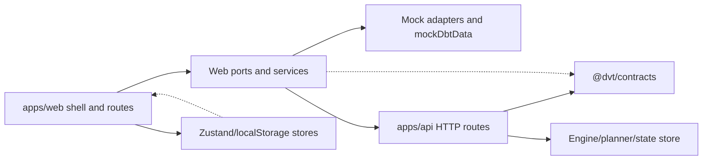
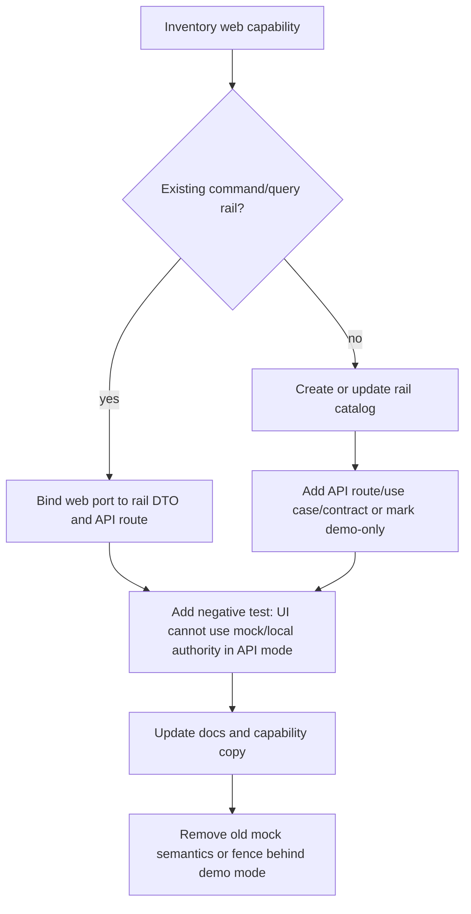

# Web API Integration Gap Review

## Scope

This review audits `apps/web/src` against `apps/api/src` and
`packages/@dvt/contracts` to identify where the web UI still consumes mock
adapters, frontend-owned state, or frontend-owned decisions instead of
contracted API routes.

The operator requested
`docs/planning/reviews/web-api-integration-gap-review-20260510.md`; this file
uses the canonical review filename required by
[`review-naming-policy.md`](./review-naming-policy.md):
`docs/planning/reviews/20260510-web-api-integration-gap-review.md`.

Current repository observation: `apps/web/src` contains 793 source files in this
checkout. The earlier inventory note that web was pending because of size is
still directionally correct; this audit covers the product-facing capability
surface rather than every component file.

## Governing Sources

- [`governance-document-rule-inventory.md`](../status/governance-document-rule-inventory.md)
- [`ai-work-protocol.md`](../../guides/ai-work-protocol.md)
- [`command-query-rail-governance.md`](../../architecture/command-query-rail-governance.md)
- [`fowler-opportunity-planning-governance.md`](../../architecture/fowler-opportunity-planning-governance.md)
- [`reference-architecture.md`](../../architecture/reference-architecture.md)
- [`system-delivery-status.md`](../../architecture/system-delivery-status.md)
- [`protectedRuntimeRailVocabulary.ts`](../../../apps/api/src/application/ports/protectedRuntimeRailVocabulary.ts)
- API routes under `apps/api/src/routes` and `apps/api/src/entrypoints/http`
- Web composition, ports, services, stores, and route views under `apps/web/src`
- Runtime and planner contracts under `packages/@dvt/contracts`

## Review Rules

The review classifies each web capability against three constraints:

- UI does not execute: the browser must not create authoritative runtime,
  execution, plan, audit, or workspace mutation outcomes.
- UI does not decide: the browser must not own authorization, admission,
  capability availability, executable validity, tenant scope, or plugin
  backend readiness.
- UI does not invent runtime state: the browser must not synthesize persisted
  run, plan, workspace, audit, or artifact truth outside explicit demo mode.

Presentation state is allowed in the UI when it is visibly local and cannot be
confused with backend truth. Examples: selected tab, panel size, viewport,
temporary selection, search filters, and route-local loading state.

## Current Integration Shape

The architecture has a usable API-backed path for session gating, runtime
health, capabilities, protected workspace graph draft read/write, plan
preview/import, run list/detail/events/start, and workspace file read. The
remaining drift is concentrated in broad `IWorkspacePort` responsibilities,
frontend static plugin composition, local authorization/session stores, and
mock/demo paths that still model product semantics.

## API And Contract Baseline

Confirmed API surfaces:

| Rail                  | API surface                                                             | Contract posture                                       | Web usage                                      |
| --------------------- | ----------------------------------------------------------------------- | ------------------------------------------------------ | ---------------------------------------------- |
| GetRuntimeSession     | `GET /session`                                                          | API-local response model; no shared web DTO contract   | `AuthRouteGate` gates protected routes         |
| Platform health       | `GET /healthz`, optional `GET /readyz`, `GET /version`, `GET /db/ready` | API-local DTOs mirrored in web capability package      | Shell health banner/admin                      |
| Runtime capabilities  | `GET /capabilities`                                                     | API-local DTO mirrored in web capability package       | Shell/plugin gating                            |
| PreviewExecutablePlan | `POST /plans/preview`                                                   | `@dvt/contracts` plan preview request/response         | Canvas plan action                             |
| ImportExecutablePlan  | `POST /plans/import`                                                    | `@dvt/contracts` execution plan/plan ref parsing       | Plans service                                  |
| StartRun              | `POST /runs/start`                                                      | start-run boundary and run state contracts             | Canvas run start                               |
| Runs read model       | `GET /runs`, `GET /runs/:runId`, `GET /runs/:runId/events`              | run event/read-model parsing partially contract-backed | Runs view, cost, canvas run tab                |
| Workspace graph draft | `GET /workspace/graph/draft`, `PUT /workspace/graph/draft`              | `@dvt/contracts` workspace graph draft schemas         | Canvas authoring draft                         |
| Workspace files read  | `GET /workspace/files`, `GET /workspace/files/:path`                    | API-local DTOs, no shared web contract                 | Code, artifacts, diff, preview provenance read |
| Admin repair          | `POST /admin/runs/:runId/rebuild-snapshot`                              | API-local route, disabled by default                   | Not used by current admin view                 |

Missing or mismatched API surfaces currently referenced or implied by web:

| Capability intent       | Current web surface                                                             | API status                                                              | Gap                                                          |
| ----------------------- | ------------------------------------------------------------------------------- | ----------------------------------------------------------------------- | ------------------------------------------------------------ |
| Diff changes            | `workspaceService.getDiffChanges()` -> `GET /diff/changes`                      | No matching route found                                                 | UI has no authoritative diff read model                      |
| Plugin catalog          | `workspaceService.getPlugins()` -> `GET /plugins` plus static `PLUGIN_REGISTRY` | No matching route found                                                 | UI owns plugin inventory and much of readiness               |
| Admin roles/audit       | `GET /admin/roles`, `GET /admin/audit`                                          | No matching route found; only rebuild snapshot exists                   | Admin view can read mock-only authority                      |
| Warehouse source import | `listWarehouseConnections`, `listWarehouseTables`, `importSources`              | Explicitly unavailable in API mode                                      | Mock mode creates graph/file state                           |
| Workspace file write    | `saveFileContent()` -> `POST /workspace/files/:path`                            | API exposes read-only `GET` routes                                      | Canvas preview provenance can call a nonexistent write route |
| Cost analytics          | `CostView` derives from graph + runs + currentRun store                         | `/capabilities` says cost unavailable; no cost read model               | UI computes product metric posture locally                   |
| Lineage read model      | `LineageView` derives from workspace graph in browser                           | No lineage query; graph draft read exists                               | UI owns traversal and column lineage interpretation          |
| Artifact import         | local file upload + parser                                                      | No artifact ingestion/query rail                                        | Browser invents imported artifact workspace state            |
| Authorization grants    | `authorizationStore` defaults all permissions to true                           | API has per-route authz but no web permission read model                | UI decides enabled actions before API denial                 |
| Workspace selector      | `sessionStore` + env + localStorage                                             | `/session` returns principal/grants but not effective workspace context | UI supplies tenant/project/environment scope                 |

## Capability Matrix

| Capability                                   | Web entry points                                                                                | Source today                                                                               | Risk: UI executes                    | Risk: UI decides | Risk: UI invents state           | Migration                                                                                                                                                                                                                                |
| -------------------------------------------- | ----------------------------------------------------------------------------------------------- | ------------------------------------------------------------------------------------------ | ------------------------------------ | ---------------- | -------------------------------- | ---------------------------------------------------------------------------------------------------------------------------------------------------------------------------------------------------------------------------------------- |
| Route authentication gate                    | `AuthRouteGate`, `LoginView`                                                                    | Real `GET /session`; mock mode bypass                                                      | Low                                  | Medium           | Low                              | Keep API gate, but add a shared session profile contract and use session grants to seed workspace scope. Mock bypass must remain explicit demo mode only.                                                                                |
| Workspace/session scope                      | `sessionStore`, `sessionContextPort`, `workspaceConfig`, `createApiClient` headers/query params | Frontend env + localStorage                                                                | Medium                               | High             | Medium                           | Add a server-owned effective workspace context query. Web may select from server-granted options, but API must issue/validate the effective scope.                                                                                       |
| Platform health                              | `platform-health` capability, `ShellHealthBanner`, admin platform tab                           | Real public API with optional probes                                                       | Low                                  | Low              | Low                              | Keep. Align DTOs through a shared contract or route-local API schema export so web stops mirroring shapes manually.                                                                                                                      |
| Runtime capabilities and plugin availability | `useCapabilitiesQuery`, `shellRuntimeModel`, `PluginsView`, `PLUGIN_REGISTRY`                   | Real `/capabilities` plus local fallback/static registry                                   | Low                                  | Medium           | Medium                           | Make network failure an unavailable/degraded state, not `frontend-local` enabled-by-default. Add backend-published plugin capability manifest or define static registry as presentation-only and deny execution unless backend confirms. |
| Canvas workspace graph draft                 | `useCanvasAuthoringRuntime`, draft repository, `workspaceGraphDraftAuthoring.*`                 | Real API in API mode; WeakMap mock in mock mode                                            | Medium                               | Medium           | High in mock mode                | Keep API path. Fence mock store behind demo wording. Require contract-backed tests that API mode never uses mock revision/audit/idempotency generation.                                                                                  |
| Canvas node/edge admission and validation    | graph handlers, `canvasRuntimePolicy`, `transformationGraphValidation`, plugin connection rules | Browser rules, then plan preview API later                                                 | Medium                               | High             | Medium                           | Keep browser rules as advisory UX only. Add a server validation query/command for design graph admissibility and make plan/start depend on API validation/proof.                                                                         |
| Canvas plan preview                          | `executeCanvasPlanAction`, `plansService.api`                                                   | Real `POST /plans/preview` in API mode; mock plan in mock mode                             | Low for API mode, High for mock mode | Medium           | High in mock mode                | Keep API path and contract parsing. Remove product semantics from mock mode or mark demo. Fix provenance file write gap before requiring provenance in API mode.                                                                         |
| Canvas run start                             | `executeCanvasRunStartAction`, `runsService.api`                                                | Real `POST /runs/start` in API mode; mock run receipt in mock mode                         | Low for API mode, High for mock mode | Medium           | High in mock mode                | Keep API path. Web may block obvious stale UI states, but backend remains authority. Mock run IDs/events must not be available outside demo mode.                                                                                        |
| Runs list/detail/events                      | `RunsView`, `useRunWorkspace`, canvas runs tab, cost input                                      | Real API in API mode; mock events in mock mode                                             | Low for API mode, High for mock mode | Low              | High in mock mode                | Keep. Convert any route-specific DTO mapping still local to shared contracts where practical.                                                                                                                                            |
| Code read-only file browser                  | `CodeView`, `useWorkspaceFileTreeQuery`, `useWorkspaceFileContentQuery`                         | Real `GET /workspace/files*` in API mode; mock file tree in mock mode                      | Low                                  | Low              | Medium in mock mode              | Keep read-only posture. Remove `saveFileContent` from the read-only port or move it to a separate command rail that exists in API.                                                                                                       |
| Preview provenance graph artifact write      | `canvasPreviewProvenance.savePreviewGraphArtifact`                                              | Calls `workspaceService.saveFileContent`, but API lacks matching POST route                | High                                 | Medium           | High                             | Either add a governed workspace artifact write command or move provenance artifact persistence into `POST /plans/preview`. Do not keep a web-only write command on `IWorkspacePort`.                                                     |
| Diff view                                    | `DiffView`, `useDiffData`, `workspaceService.getDiffChanges`                                    | API adapter calls missing `/diff/changes`; mock adapter returns `mockDiffChanges`          | Medium                               | High             | High                             | Add a `GetWorkspaceDiffChanges` query rail or disable diff in API mode. Derive diff on server from workspace/plan/git evidence, not from browser fixtures.                                                                               |
| Lineage view                                 | `LineageView`, `useLineageViewData`                                                             | Browser computes lineage from workspace graph draft                                        | Low                                  | Medium           | Medium                           | Accept as presentation while graph draft is authority, but add a lineage read-model query for column-level lineage and large graphs. Browser traversal should become fallback/advisory.                                                  |
| Artifacts view                               | `ArtifactsView`, `useArtifactsViewModel`, `useLocalManifestImport`                              | Workspace files read API plus local upload/parser                                          | Medium                               | Medium           | High for imported local manifest | Keep workspace-file previews as read-only. Move local upload/import behind an explicit local-inspection mode or add artifact ingestion/query rails.                                                                                      |
| Source import wizard                         | `SourceImportWizard`, `useSourceImportWizard`, canvas source import handlers                    | Mock-only; API mode throws unavailable and hides entry by capability                       | High in mock mode                    | High             | High                             | Add warehouse-source discovery/import commands and query rails, or keep completely demo-only. The current API-mode disabled path is correct but should be documented in shell capability copy.                                           |
| Admin roles and audit                        | `AdminView`, `useAdminViewData`                                                                 | API adapter calls missing `/admin/roles` and `/admin/audit`; mock adapter returns fixtures | Low                                  | High             | High                             | Replace with real admin read models or remove the tabs in API mode. Do not imply admin RBAC/audit truth from mock fixtures.                                                                                                              |
| Admin repair                                 | API route only                                                                                  | `POST /admin/runs/:runId/rebuild-snapshot`, disabled by default                            | N/A                                  | N/A              | N/A                              | Web has no corresponding capability. Add UI only after an admin command rail, authorization copy, and negative tests are complete.                                                                                                       |
| Cost view/plugin                             | `costContributions`, `CostView`, `useCostData`                                                  | Static optional plugin gated by `/capabilities`; no backend cost read model                | Medium                               | High             | Medium                           | Keep disabled by backend default. Before enabling, add a cost query rail and require the cost view to consume backend cost read models.                                                                                                  |
| Plugin registry and navigation               | `PLUGIN_REGISTRY`, `getRuntimePlugins`, route creation                                          | Static frontend registry filtered by partial backend capability signal                     | Low                                  | Medium           | Medium                           | Treat registry as presentation extension composition only. Runtime executable availability must come from `/capabilities` or a richer backend manifest. Unknown backend entries should not default to enabled for executable plugins.    |
| Authorization controls                       | `authorizationStore`, `canvasRuntimePolicy`, view buttons                                       | Local store defaults every permission to true                                              | Medium                               | High             | Medium                           | Replace with session/capability/authorization read model. Browser gating can remain optimistic UX only if all commands are API-authorized and denied states are visible.                                                                 |
| Shell layout and canvas viewport             | `uiLayoutStore`, `canvasInteractionStore`                                                       | localStorage presentation state                                                            | Low                                  | Low              | Low                              | Keep local. Document it as presentation-only state and ensure it never feeds execution or authorization decisions.                                                                                                                       |
| Current plan/current run selection           | `executionStore`, canvas overlays, cost                                                         | Local selected evidence cache                                                              | Medium                               | Medium           | Medium                           | Keep only as selected read-model cache. Clear or rehydrate from API after navigation/reload; do not use it as authority for run/plan existence.                                                                                          |

## Key Findings

### 1. `IWorkspacePort` mixes unrelated bounded contexts

`IWorkspacePort` currently owns graph draft reads, diff, plugins, roles, audit,
warehouse import, file reads, and file writes. This creates a single adapter
surface where some methods are real API rails, some are nonexistent routes,
some are explicitly unavailable, and some are mock-only.

This is the largest architectural friction point. It hides integration gaps
because a view can call a method that has a TypeScript implementation while the
corresponding API route does not exist.

Recommended split:

- `WorkspaceGraphDraftQueryPort`
- `WorkspaceFilesQueryPort`
- `WorkspaceArtifactCommandPort` or `PlanPreviewProvenancePort`
- `WorkspaceDiffQueryPort`
- `WorkspaceAdminReadPort`
- `WarehouseSourceImportPort`

Each port should map to one command/query rail and one API surface, or be marked
presentation/demo-only.

### 2. Several API adapters call routes that are absent

The web API workspace service references:

- `GET /diff/changes`
- `GET /plugins`
- `GET /admin/roles`
- `GET /admin/audit`
- `POST /workspace/files/:path`

The API baseline exposes protected runtime routes for plans, runs, workspace
graph draft, and workspace file reads. It does not expose those five surfaces.

This is hard drift because the code looks API-backed while operationally it
cannot succeed in API mode.

### 3. Mock mode still contains product semantics

Mock plans, runs, files, warehouse imports, graph draft revisions, audit refs,
and runtime events are more than visual fixtures. They behave like a small
runtime. That is useful for UI development, but it violates the production rule
unless it is clearly fenced as demo-only and prevented from becoming default
truth.

Risk examples:

- `runsService.mock.ts` creates `run_mock_N` and event timelines.
- `workspaceGraphDraftAuthoring.mock.ts` creates revisions, timestamps, and
  audit/correlation refs.
- `workspaceService.mock.ts` imports warehouse sources and mutates a graph/file
  tree.
- `mockDbtData.ts` contains plans, runs, roles, audit, diff, plugins, and
  files in one fixture source.

### 4. The UI owns effective workspace scope

The API has `GET /session`, and protected routes authorize scopes. However the
web workspace context is still built from env defaults and localStorage:
`tenant`, `project`, `dev` in API mode unless configured otherwise. The browser
also sends tenant/project headers and query/body scope values.

The API remains the final enforcement point, but the UX can still present an
ungranted workspace and make failing calls. A mature system would let the server
publish effective workspace choices from the authenticated principal and would
persist selection as a server-validated preference or signed scope.

### 5. Authorization defaults are optimistic

`authorizationStore` defaults `canPlan`, `canRun`, `canEditEdges`,
`canManagePlugins`, and `canManageRBAC` to `true`. API routes still deny
unauthorized commands, but the UI decides command availability before it has an
authoritative permission read model.

This should be reduced to presentation gating fed by `/session`,
`/capabilities`, and route-specific authorization read models.

### 6. Capability fallback can enable too much UI

Runtime capabilities use a real `/capabilities` query, but network failure maps
to `{ apiVersion: 'frontend-local', plugins: {} }`. Registry helpers interpret
missing plugin entries as available. That makes disconnected mode permissive for
static plugin surfaces unless a plugin has an explicit unavailable backend
signal.

For read-only shell routes this can be acceptable as degraded navigation. For
executable features it should fail closed.

### 7. Canvas has the strongest backend integration and the most local logic

Canvas now has real protected graph draft persistence and real plan/run rails.
It also contains browser-owned admission, validation, layout persistence,
draft-session working sets, source import handling, preview provenance file
write, and plugin runtime policy.

The healthy pattern is present: commands delegate to ports and API routes. The
remaining work is semantic tightening: browser validations should be advisory,
and server proofs should be the authority for planning and run execution.

## Migration Route

Prioritized capability migrations:

1. Fix the hard API mismatches in `workspaceService.api.ts`.
   - Remove or split `saveFileContent` from the read-only workspace files API
     until an API command exists.
   - Disable or route-gate diff/admin/plugin reads in API mode until real
     routes exist.
2. Add server-owned effective workspace context.
   - Extend `GET /session` or add a workspace context query.
   - Seed `sessionStore` from server-granted options, not env/localStorage as
     product truth.
3. Fence mock runtime semantics.
   - Add an explicit demo/dev posture to mock plans, runs, workspace graph,
     warehouse import, and admin/audit fixtures.
   - Add architecture tests preventing mock services from being imported by API
     mode composition.
4. Split `IWorkspacePort` by rail.
   - Make every port correspond to one query/command rail.
   - Move demo-only operations into separate demo ports.
5. Move validation/authorization authority out of browser-local stores.
   - Use API validation results for executable graph/plan readiness.
   - Replace optimistic permissions with session/capability/authorization read
     models.
6. Add backend read models for currently local views.
   - Diff query rail.
   - Admin roles/audit query rails.
   - Artifact ingestion/query rail if local import is a product capability.
   - Cost query rail before enabling cost plugin.
   - Optional lineage read model for large/column-level lineage.

## Capability-Specific Acceptance Tests To Add

- API mode composition must not call any `*.mock.ts` service for protected
  routes.
- `workspaceService.api.ts` must not contain API endpoints absent from
  `runtimeRoutes.constants.ts`, operational route registration, or an explicit
  route catalog.
- `authorizationStore` defaults must not be used as command authority for
  `canPlan`, `canRun`, or admin actions.
- Cost plugin route must not be navigable/executable when `/capabilities`
  reports `cost.available=false`.
- Diff/Admin tabs must either consume real API routes or render an unavailable
  API-mode state.
- Canvas plan preview must not require `POST /workspace/files/:path` unless the
  API route exists; provenance persistence must be owned by an API command.
- Local artifact upload must be labelled and tested as local inspection or moved
  behind an artifact import rail.

## No-Drift Checklist For Future Web Work

- Before adding a web service method, name the command/query rail.
- Before adding a route/view, declare whether it is presentation-only,
  API-backed, or demo-only.
- Do not add a method to a broad port when it belongs to a different bounded
  context.
- Do not make a missing capability default to available if it can execute or
  mutate backend state.
- Keep browser stores limited to presentation state unless their state is
  explicitly hydrated from an API read model.
- Keep mock data fixture-only and visibly separate from product semantics.

## Conclusion

The web/API integration is partially real and stronger than a pure mock shell:
session gating, health, capabilities, workspace graph draft, plans, runs, and
workspace file reads all have real API paths. The main drift is not absence of
API work; it is uneven authority boundaries. Broad web ports and static plugin
composition make mock/local behavior look equivalent to backend-backed rails.

The next valuable implementation slice is to split `IWorkspacePort` and remove
or fence every API-mode method that does not have a real route. That reduces
false confidence immediately and gives each remaining capability a clean
command/query migration path.
