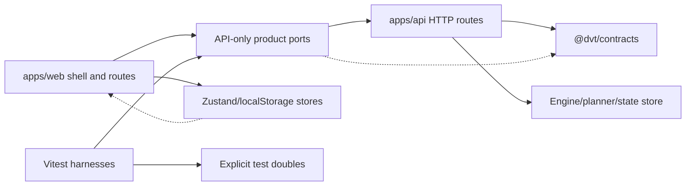
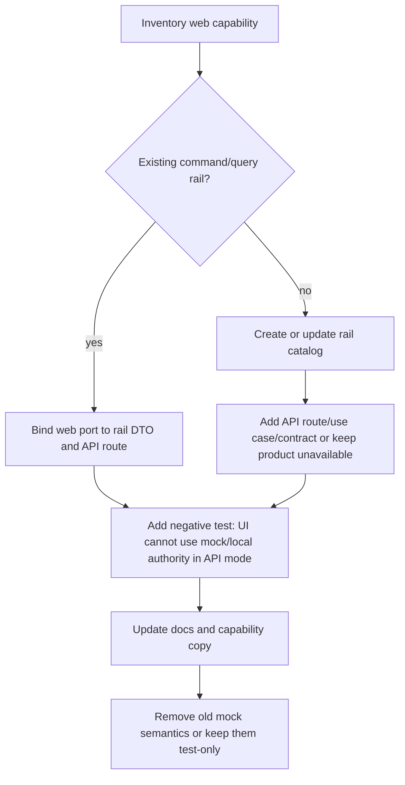

# Web API Integration Gap Review

## Scope

This review audits `apps/web/src` against `apps/api/src` and
`packages/@dvt/contracts` to identify where the web UI still consumes mock
adapters, frontend-owned state, or frontend-owned decisions instead of
contracted API routes.

The operator requested
`docs/planning/reviews/web-api-integration-gap-review-20260510.md`; this file
uses the canonical review filename required by
[`review-naming-policy.md`](./review-naming-policy.md):
`docs/planning/reviews/20260510-web-api-integration-gap-review.md`.

Current repository observation: `apps/web/src` contains 793 source files in this
checkout. The earlier inventory note that web was pending because of size is
still directionally correct; this audit covers the product-facing capability
surface rather than every component file.

## Governing Sources

- [`governance-document-rule-inventory.md`](../status/governance-document-rule-inventory.md)
- [`ai-work-protocol.md`](../../guides/ai-work-protocol.md)
- [`command-query-rail-governance.md`](../../architecture/command-query-rail-governance.md)
- [`fowler-opportunity-planning-governance.md`](../../architecture/fowler-opportunity-planning-governance.md)
- [`reference-architecture.md`](../../architecture/reference-architecture.md)
- [`system-delivery-status.md`](../../architecture/system-delivery-status.md)
- [`protectedRuntimeRailVocabulary.ts`](../../../apps/api/src/application/ports/protectedRuntimeRailVocabulary.ts)
- API routes under `apps/api/src/routes` and `apps/api/src/entrypoints/http`
- Web composition, ports, services, stores, and route views under `apps/web/src`
- Runtime and planner contracts under `packages/@dvt/contracts`

## Review Rules

The review classifies each web capability against three constraints:

- UI does not execute: the browser must not create authoritative runtime,
  execution, plan, audit, or workspace mutation outcomes.
- UI does not decide: the browser must not own authorization, admission,
  capability availability, executable validity, tenant scope, or plugin
  backend readiness.
- UI does not invent runtime state: the browser must not synthesize persisted
  run, plan, workspace, audit, or artifact truth outside explicit test
  harnesses.

Presentation state is allowed in the UI when it is visibly local and cannot be
confused with backend truth. Examples: selected tab, panel size, viewport,
temporary selection, search filters, and route-local loading state.

## Current Integration Shape

The architecture has a usable API-backed path for session gating, runtime
health, capabilities, protected workspace graph draft read/write, plan
preview/import, run list/detail/events/start, and workspace file read.

Implementation update on 2026-05-10: the broad web `IWorkspacePort` was
hard-cut from the composition root and replaced by named workspace capability
ports. The remaining drift is no longer hidden behind one TypeScript service;
it is concentrated in missing backend rails, frontend static plugin
composition, local authorization/session stores, and test fixture paths that
must stay outside product semantics.

Implementation update on 2026-05-10: product app-service composition was also
hard-cut to API-only. The former mock adapters were moved out of
`apps/web/src/app/services` into explicit test-double surfaces under
`apps/web/src/testing`. `DataSourceMode` now resolves to API-only and protected
routes no longer have a mock bypass.

## API And Contract Baseline

Confirmed API surfaces:

| Rail                  | API surface                                                             | Contract posture                                       | Web usage                                      |
| --------------------- | ----------------------------------------------------------------------- | ------------------------------------------------------ | ---------------------------------------------- |
| GetRuntimeSession     | `GET /session`                                                          | API-local response model; no shared web DTO contract   | `AuthRouteGate` gates protected routes         |
| Platform health       | `GET /healthz`, optional `GET /readyz`, `GET /version`, `GET /db/ready` | API-local DTOs mirrored in web capability package      | Shell health banner/admin                      |
| Runtime capabilities  | `GET /capabilities`                                                     | API-local DTO mirrored in web capability package       | Shell/plugin gating                            |
| PreviewExecutablePlan | `POST /plans/preview`                                                   | `@dvt/contracts` plan preview request/response         | Canvas plan action                             |
| ImportExecutablePlan  | `POST /plans/import`                                                    | `@dvt/contracts` execution plan/plan ref parsing       | Plans service                                  |
| StartRun              | `POST /runs/start`                                                      | start-run boundary and run state contracts             | Canvas run start                               |
| Runs read model       | `GET /runs`, `GET /runs/:runId`, `GET /runs/:runId/events`              | run event/read-model parsing partially contract-backed | Runs view, cost, canvas run tab                |
| Workspace graph draft | `GET /workspace/graph/draft`, `PUT /workspace/graph/draft`              | `@dvt/contracts` workspace graph draft schemas         | Canvas authoring draft                         |
| Workspace files read  | `GET /workspace/files`, `GET /workspace/files/:path`                    | API-local DTOs, no shared web contract                 | Code, artifacts, diff, preview provenance read |
| Admin repair          | `POST /admin/runs/:runId/rebuild-snapshot`                              | API-local route, disabled by default                   | Not used by current admin view                 |

Missing or mismatched API surfaces currently referenced or implied by web:

| Capability intent       | Current web surface                                                           | API status                                                              | Gap                                                          |
| ----------------------- | ----------------------------------------------------------------------------- | ----------------------------------------------------------------------- | ------------------------------------------------------------ |
| Diff changes            | `IWorkspaceDiffQueryPort.getDiffChanges()`                                    | No matching route found; API mode fails closed before transport         | UI has no authoritative diff read model                      |
| Plugin catalog          | `IWorkspacePluginCatalogQueryPort.getPlugins()` plus static `PLUGIN_REGISTRY` | No matching route found; API mode fails closed before transport         | UI owns plugin inventory and much of readiness               |
| Admin roles/audit       | `GET /admin/roles`, `GET /admin/audit`                                        | No matching route found; only rebuild snapshot exists                   | Admin view can read mock-only authority                      |
| Warehouse source import | `listWarehouseConnections`, `listWarehouseTables`, `importSources`            | Explicitly unavailable in API mode                                      | Mock mode creates graph/file state                           |
| Workspace file write    | `IWorkspaceFileContentCommandPort.saveFileContent()`                          | API exposes read-only `GET` routes; API mode fails closed before write  | Canvas preview provenance still needs an accepted write rail |
| Cost analytics          | `CostView` derives from graph + runs + currentRun store                       | `/capabilities` says cost unavailable; no cost read model               | UI computes product metric posture locally                   |
| Lineage read model      | `LineageView` derives from workspace graph in browser                         | No lineage query; graph draft read exists                               | UI owns traversal and column lineage interpretation          |
| Artifact import         | local file upload + parser                                                    | No artifact ingestion/query rail                                        | Browser invents imported artifact workspace state            |
| Authorization grants    | `authorizationStore` defaults all permissions to true                         | API has per-route authz but no web permission read model                | UI decides enabled actions before API denial                 |
| Workspace selector      | `sessionStore` + env + localStorage                                           | `/session` returns principal/grants but not effective workspace context | UI supplies tenant/project/environment scope                 |

## Capability Matrix

| Capability                                   | Web entry points                                                                                | Source today                                                                                     | Risk: UI executes               | Risk: UI decides | Risk: UI invents state           | Migration                                                                                                                                                                                                                                |
| -------------------------------------------- | ----------------------------------------------------------------------------------------------- | ------------------------------------------------------------------------------------------------ | ------------------------------- | ---------------- | -------------------------------- | ---------------------------------------------------------------------------------------------------------------------------------------------------------------------------------------------------------------------------------------- |
| Route authentication gate                    | `AuthRouteGate`, `LoginView`                                                                    | Real `GET /session` plus protected workspace context startup; no bypass                          | Low                             | Medium           | Low                              | Keep API gate, add a shared session profile contract, and continue using server-granted workspace scope before protected route rendering.                                                                                                |
| Workspace/session scope                      | `sessionStore`, `sessionContextPort`, `workspaceConfig`, `createApiClient` headers/query params | Frontend env + localStorage; remediation adds `GET /workspace/context` as server-owned authority | Medium                          | High             | Medium                           | Keep `GET /session` authentication-only. Use `GetEffectiveWorkspaceContext` to seed API-mode `sessionStore` from server-granted options before protected route rendering.                                                                |
| Platform health                              | `platform-health` capability, `ShellHealthBanner`, admin platform tab                           | Real public API with optional probes                                                             | Low                             | Low              | Low                              | Keep. Align DTOs through a shared contract or route-local API schema export so web stops mirroring shapes manually.                                                                                                                      |
| Runtime capabilities and plugin availability | `useCapabilitiesQuery`, `shellRuntimeModel`, `PluginsView`, `PLUGIN_REGISTRY`                   | Real `/capabilities` plus local fallback/static registry                                         | Low                             | Medium           | Medium                           | Make network failure an unavailable/degraded state, not `frontend-local` enabled-by-default. Add backend-published plugin capability manifest or define static registry as presentation-only and deny execution unless backend confirms. |
| Canvas workspace graph draft                 | `useCanvasAuthoringRuntime`, draft repository, `workspaceGraphDraftAuthoring.*`                 | Real API in product composition; explicit test double in `apps/web/src/testing`                  | Medium                          | Medium           | Low product; High test reuse     | Keep API path. Architecture guard prevents product composition from importing test-double revision/audit/idempotency generation.                                                                                                         |
| Canvas node/edge admission and validation    | graph handlers, `canvasRuntimePolicy`, `transformationGraphValidation`, plugin connection rules | Browser rules, then plan preview API later                                                       | Medium                          | High             | Medium                           | Keep browser rules as advisory UX only. Add a server validation query/command for design graph admissibility and make plan/start depend on API validation/proof.                                                                         |
| Canvas plan preview                          | `executeCanvasPlanAction`, `plansService.api`                                                   | Real `POST /plans/preview` in product composition; plan doubles are test-only                    | Low                             | Medium           | Low in product                   | Keep API path and contract parsing. Fix provenance file write gap before requiring provenance in API mode.                                                                                                                               |
| Canvas run start                             | `executeCanvasRunStartAction`, `runsService.api`                                                | Real `POST /runs/start` in product composition; run doubles are test-only                        | Low                             | Medium           | Low in product                   | Keep API path. Web may block obvious stale UI states, but backend remains authority. Test run IDs/events must not be available outside test-only harnesses.                                                                              |
| Runs list/detail/events                      | `RunsView`, `useRunWorkspace`, canvas runs tab, cost input                                      | Real API in product composition; event doubles are test-only                                     | Low                             | Low              | Low in product                   | Keep. Convert any route-specific DTO mapping still local to shared contracts where practical.                                                                                                                                            |
| Code read-only file browser                  | `CodeView`, `useWorkspaceFileTreeQuery`, `useWorkspaceFileContentQuery`                         | Real `GET /workspace/files*` in product composition; file-tree doubles are test-only             | Low                             | Low              | Low in product                   | Keep read-only posture. Remove `saveFileContent` from the read-only port or move it to a separate command rail that exists in API.                                                                                                       |
| Preview provenance graph artifact write      | `canvasPreviewProvenance.savePreviewGraphArtifact`, `IWorkspaceFileContentCommandPort`          | API mode fails closed because no accepted write rail exists                                      | High                            | Medium           | High                             | Either add a governed workspace artifact write command or move provenance artifact persistence into `POST /plans/preview`.                                                                                                               |
| Diff view                                    | `DiffView`, `useDiffData`, `IWorkspaceDiffQueryPort.getDiffChanges`                             | API mode fails closed; mock adapter returns `mockDiffChanges`                                    | Medium                          | High             | High                             | Add a `GetWorkspaceDiffChanges` query rail or keep the diff view unavailable in API mode. Derive diff on server from workspace/plan/git evidence, not from browser fixtures.                                                             |
| Lineage view                                 | `LineageView`, `useLineageViewData`                                                             | Browser computes lineage from workspace graph draft                                              | Low                             | Medium           | Medium                           | Accept as presentation while graph draft is authority, but add a lineage read-model query for column-level lineage and large graphs. Browser traversal should become fallback/advisory.                                                  |
| Artifacts view                               | `ArtifactsView`, `useArtifactsViewModel`, `useLocalManifestImport`                              | Workspace files read API plus local upload/parser                                                | Medium                          | Medium           | High for imported local manifest | Keep workspace-file previews as read-only. Move local upload/import behind an explicit local-inspection mode or add artifact ingestion/query rails.                                                                                      |
| Source import wizard                         | `SourceImportWizard`, `useSourceImportWizard`, canvas source import handlers                    | Product API port throws unavailable and hides entry by capability; test double can exercise UI   | Low product; High outside tests | High             | High if reused outside tests     | Add warehouse-source discovery/import commands and query rails, or keep unavailable in product runtime. The current API-mode disabled path is correct but should be documented in shell capability copy.                                 |
| Admin roles and audit                        | `AdminView`, `useAdminViewData`                                                                 | API adapter calls missing `/admin/roles` and `/admin/audit`; mock adapter returns fixtures       | Low                             | High             | High                             | Replace with real admin read models or remove the tabs in API mode. Do not imply admin RBAC/audit truth from mock fixtures.                                                                                                              |
| Admin repair                                 | API route only                                                                                  | `POST /admin/runs/:runId/rebuild-snapshot`, disabled by default                                  | N/A                             | N/A              | N/A                              | Web has no corresponding capability. Add UI only after an admin command rail, authorization copy, and negative tests are complete.                                                                                                       |
| Cost view/plugin                             | `costContributions`, `CostView`, `useCostData`                                                  | Static optional plugin gated by `/capabilities`; no backend cost read model                      | Medium                          | High             | Medium                           | Keep disabled by backend default. Before enabling, add a cost query rail and require the cost view to consume backend cost read models.                                                                                                  |
| Plugin registry and navigation               | `PLUGIN_REGISTRY`, `getRuntimePlugins`, route creation                                          | Static frontend registry filtered by partial backend capability signal                           | Low                             | Medium           | Medium                           | Treat registry as presentation extension composition only. Runtime executable availability must come from `/capabilities` or a richer backend manifest. Unknown backend entries should not default to enabled for executable plugins.    |
| Authorization controls                       | `authorizationStore`, `canvasRuntimePolicy`, view buttons                                       | Local store defaults every permission to true                                                    | Medium                          | High             | Medium                           | Replace with session/capability/authorization read model. Browser gating can remain optimistic UX only if all commands are API-authorized and denied states are visible.                                                                 |
| Shell layout and canvas viewport             | `uiLayoutStore`, `canvasInteractionStore`                                                       | localStorage presentation state                                                                  | Low                             | Low              | Low                              | Keep local. Document it as presentation-only state and ensure it never feeds execution or authorization decisions.                                                                                                                       |
| Current plan/current run selection           | `executionStore`, canvas overlays, cost                                                         | Local selected evidence cache                                                                    | Medium                          | Medium           | Medium                           | Keep only as selected read-model cache. Clear or rehydrate from API after navigation/reload; do not use it as authority for run/plan existence.                                                                                          |

## Key Findings

### 1. `IWorkspacePort` hard-cut completed

`IWorkspacePort` no longer exists as a composition dependency. The web
composition root now publishes the smallest named ports required by consumers:

- `IWorkspaceGraphSnapshotQueryPort`
- `IWorkspaceFilesQueryPort`
- `IWorkspaceDiffQueryPort`
- `IWorkspacePluginCatalogQueryPort`
- `IWorkspaceAdminReadPort`
- `IWarehouseSourceImportPort`
- `IWorkspaceFileContentCommandPort`

The semantic guard
`workspacePortDecomposition.architecture.test.ts` fails if the old broad
composition field, `useWorkspaceService`, or `createWorkspaceService` return.
It also fails if a `workspaceService*` module remains after the hard cut.
This improves the pattern from a God Port to Extract Interface plus Gateway per
command/query rail. The remaining risk is not the web dependency shape; it is
the missing backend rails that those ports now expose explicitly.

### 2. Missing workspace rails are fail-closed instead of fake API calls

The API adapter no longer calls orphan workspace routes for diff, plugins,
admin roles/audit, warehouse import, or file writes. Missing capabilities are
named by rail and fail before transport.

The API baseline still exposes only protected runtime routes for plans, runs,
workspace graph draft, and workspace file reads. The hard drift moved from
"code calls routes that do not exist" to "product capabilities are explicitly
unavailable until their backend rails are designed and implemented."

### 3. Mock runtime semantics are now test-only

Mock plans, runs, files, warehouse imports, graph draft revisions, audit refs,
and runtime events still exist, but they were moved out of product service
composition into explicit test-double files under `apps/web/src/testing`. They
remain useful for UI development, but the architecture guard now rejects
reintroducing them into the product AppServices rail.

Risk examples:

- `runsPortDoubles.ts` creates `run_mock_N` and event timelines.
- `workspaceGraphDraftAuthoringPortDoubles.ts` creates revisions, timestamps,
  and audit/correlation refs.
- `workspacePortDoubles.ts` imports warehouse sources and mutates a graph/file
  tree for tests.
- `fixtures/mockDbtData.ts` contains plans, runs, roles, audit, diff, plugins,
  and files as test-only fixture input.

### 4. The UI owns effective workspace scope

The API has `GET /session`, and protected routes authorize scopes. However the
web workspace context is still built from env defaults and localStorage:
`tenant`, `project`, `dev` in API mode unless configured otherwise. The browser
also sends tenant/project headers and query/body scope values.

The API remains the final enforcement point, but the UX can still present an
ungranted workspace and make failing calls. A mature system would let the server
publish effective workspace choices from the authenticated principal and would
persist selection as a server-validated preference or signed scope.

### 5. Authorization defaults are optimistic

`authorizationStore` defaults `canPlan`, `canRun`, `canEditEdges`,
`canManagePlugins`, and `canManageRBAC` to `true`. API routes still deny
unauthorized commands, but the UI decides command availability before it has an
authoritative permission read model.

This should be reduced to presentation gating fed by `/session`,
`/capabilities`, and route-specific authorization read models.

### 6. Capability fallback can enable too much UI

Runtime capabilities use a real `/capabilities` query, but network failure maps
to `{ apiVersion: 'frontend-local', plugins: {} }`. Registry helpers interpret
missing plugin entries as available. That makes disconnected mode permissive for
static plugin surfaces unless a plugin has an explicit unavailable backend
signal.

For read-only shell routes this can be acceptable as degraded navigation. For
executable features it should fail closed.

### 7. Canvas has the strongest backend integration and the most local logic

Canvas now has real protected graph draft persistence and real plan/run rails.
It also contains browser-owned admission, validation, layout persistence,
draft-session working sets, source import handling, preview provenance file
write, and plugin runtime policy.

The healthy pattern is present: commands delegate to ports and API routes. The
remaining work is semantic tightening: browser validations should be advisory,
and server proofs should be the authority for planning and run execution.

## Migration Route

Prioritized capability migrations:

1. Completed: fix the hard API mismatches in `workspacePorts.api.ts`.
   - Remove or split `saveFileContent` from the read-only workspace files API
     until an API command exists.
   - Disable or route-gate diff/admin/plugin reads in API mode until real
     routes exist.
   - Remediation slice 1 implemented in
     [`web-api-workspace-port-route-parity-remediation-plan-20260510.md`](../proposals/mandatory/frontend-and-ux/web-api-workspace-port-route-parity-remediation-plan-20260510.md):
     API mode now fails closed before transport for the missing diff, plugin
     catalog, admin roles, admin audit, and workspace file write rails.
2. Add server-owned effective workspace context.
   - ADR-0055 rejects extending `GET /session`; session remains
     authentication/profile only.
   - Add `GET /workspace/context` as `GetEffectiveWorkspaceContext`.
   - Seed API-mode `sessionStore` from server-granted options, not
     env/localStorage as product truth.
   - Remediation slice 2 implemented in
     [`web-api-effective-workspace-context-remediation-plan-20260510.md`](../proposals/mandatory/frontend-and-ux/web-api-effective-workspace-context-remediation-plan-20260510.md):
     protected API-mode route startup now resolves session and server-owned
     workspace context before rendering.
3. Completed: fence mock runtime semantics.
   - Product app-service composition is API-only.
   - Mock plans, runs, workspace graph, warehouse import, and admin/audit
     fixtures live under `apps/web/src/testing`.
   - `appServicesMockHardcut.architecture.test.ts` prevents product
     composition from importing test doubles, exposing `mode: 'mock'`, or
     keeping non-test `*.mock.ts` files under `apps/web/src/app/services`.
4. Completed: split `IWorkspacePort` by rail with a hard cut.
   - `workspacePorts.ts`, `workspacePorts.api.ts`, and
     test-only workspace doubles replaced the old broad service module names
     outside product runtime.
   - Every web consumer now takes graph, file, diff, admin, plugin catalog,
     warehouse import, or file-write ports explicitly.
   - The architecture guard blocks the retired broad interface, composition
     field, hook, and broad factory.
5. Move validation/authorization authority out of browser-local stores.
   - Use API validation results for executable graph/plan readiness.
   - Replace optimistic permissions with session/capability/authorization read
     models.
6. Add backend read models for currently local views.
   - Diff query rail.
   - Admin roles/audit query rails.
   - Artifact ingestion/query rail if local import is a product capability.
   - Cost query rail before enabling cost plugin.
   - Optional lineage read model for large/column-level lineage.

## Capability-Specific Acceptance Tests To Add

- Implemented: product composition must not call any mock/test-double service
  for protected routes.
- `workspacePorts.api.ts` must not contain API endpoints absent from
  `runtimeRoutes.constants.ts`, operational route registration, or an explicit
  route catalog.
- `authorizationStore` defaults must not be used as command authority for
  `canPlan`, `canRun`, or admin actions.
- Cost plugin route must not be navigable/executable when `/capabilities`
  reports `cost.available=false`.
- Implemented: Diff/Admin/API-missing workspace ports fail closed until real
  API routes exist.
- Canvas plan preview must not require `POST /workspace/files/:path` unless the
  API route exists; provenance persistence must be owned by an API command.
- Local artifact upload must be labelled and tested as local inspection or moved
  behind an artifact import rail.

## No-Drift Checklist For Future Web Work

- Before adding a web service method, name the command/query rail.
- Before adding a route/view, declare whether it is presentation-only,
  API-backed, unavailable until a backend rail exists, or test-only.
- Do not add a method to a broad port when it belongs to a different bounded
  context.
- Do not make a missing capability default to available if it can execute or
  mutate backend state.
- Keep browser stores limited to presentation state unless their state is
  explicitly hydrated from an API read model.
- Keep mock data fixture-only and visibly separate from product semantics.

## Conclusion

The web/API integration is now materially less mock-driven: session gating,
workspace context startup, health, capabilities, workspace graph draft, plans,
runs, and workspace file reads all use API-backed product composition. The
main remaining drift is no longer product mock runtime selection; it is uneven
authority boundaries for static plugin composition, local authorization stores,
and missing backend read models.

The next valuable implementation slice is to replace optimistic browser-owned
authorization and capability decisions with API-published read models. Route
parity, server-owned workspace context, the hard-cut port split, and the
API-only app-service composition now reduce false confidence in API mode.

Implementation update on 2026-05-10: the authorization and capability authority
hardcut closed that slice. `authorizationStore` defaults now deny every
executable permission, `createCapabilitiesPort` no longer converts network
failure into `frontend-local` readiness, and backend-backed plugins are
projected only when `/capabilities` publishes an explicit available backend
plugin row. The remaining web/API gaps are backend rails for diff, admin
roles/audit, cost read models, lineage read models, and artifact ingestion.
