# SQL Canvas Demanding User Flow Review

## Purpose

This review lists the professional user-flow tests that a demanding SQL graph
author would require before the Canvas can be treated as coherent product
surface.

The review is intentionally not an implementation plan. It is the discussion
surface for deciding the next frontend development order. Once accepted, each
selected test must be promoted into a mandatory frontend plan with the owning
command/query rails, Fowler matrix, allowed implementation surfaces, and
negative tests.

## Governing Sources

- `AGENTS.md`
- `docs/planning/status/governance-document-rule-inventory.md`
- `docs/guides/ai-work-protocol.md`
- `docs/planning/state/planning-control-tower.md`
- `docs/architecture/command-query-rail-governance.md`
- `docs/architecture/fowler-opportunity-planning-governance.md`
- `docs/architecture/components/web/graph/canvas-workbench-command-query-catalog.md`
- `docs/architecture/components/web/graph/canvas-workspace-explorer-component.md`
- `docs/architecture/components/web/graph/canvas-inspector-authoring-component.md`
- `docs/architecture/components/web/graph/canvas-plan-run-readiness-component.md`
- `docs/architecture/components/web/graph/canvas-execution-selection-component.md`
- `docs/planning/proposals/mandatory/frontend-and-ux/e-canvas-workflow-e2e-usability-plan-20260601.md`
- `docs/planning/proposals/mandatory/frontend-and-ux/e-source-import-commercial-hardening-plan-20260531.md`
- `docs/planning/proposals/mandatory/frontend-and-ux/f30-graph-code-artifacts-project-source-parity-plan-20260525.md`

## Current Product Finding

The current Canvas has important building blocks, but it does not yet prove a
professional SQL graph authoring loop:

1. The user can insert DVT source, SQL transform, and sink nodes, but source
   discovery and node creation are separate concerns.
1. The user can import warehouse sources, but the proof is not yet a guided
   SQL graph construction flow from discovered source to executable transform.
1. The Inspector can edit DVT source, SQL, and sink fields, but it relies on
   manual text entry for source and destination coordinates.
1. The execution readiness model requires exactly one
   `source -> sql_transform -> sink` path, but the UI does not guide the user
   through selecting that path from real catalog data and a precise output
   destination.
1. Existing E2E proofs cover selected closure, source import, plan/run, and
   graph/code/artifact parity as slices. They do not yet prove a single
   professional SQL authoring workflow where the user explores origins, chooses
   transformations, defines the exact sink, validates the impact, and runs.

The result is a product gap, not a missing local helper: a demanding user cannot
reliably perform the basic SQL workflow without knowing internal defaults,
manual metadata conventions, or test-fixture assumptions.

## Evidence Rejection

The existing Canvas user-manual screenshots are not accepted as proof for this
review. They show partial UI surfaces, not the demanded product flow. In
particular, they do not prove:

1. origin exploration from the beginning of an empty SQL Canvas;
1. visible selection of real source tables;
1. column, row-count, freshness, or connection metadata in the source decision;
1. transform authoring with input-column context;
1. exact destination selection before planning;
1. plan/run evidence naming the same selected source and destination.

Until a new E2E-backed manual captures those states, the product posture remains
`not professionally proven`. The active DB task for this remediation is
`SQL-CANVAS-UX-P0-PRO-FLOW-1`.

## Professional Flow Standard

A professional SQL graph flow must satisfy these expectations:

| Area                | Product standard                                                                                                                          |
| ------------------- | ----------------------------------------------------------------------------------------------------------------------------------------- |
| Origin discovery    | The user can browse, search, filter, and inspect real available origins before adding or connecting a source node.                        |
| Source selection    | The selected origin carries database, schema, table, columns, freshness, and connection identity into the graph without manual rewriting. |
| Transform selection | The user can choose or author the SQL transformation with visible input schema context and deterministic graph/code artifact output.      |
| Output destination  | The user can choose the exact sink adapter, database, schema, table, materialization, and write mode before planning.                     |
| Validation          | The UI blocks ambiguous or incomplete graphs and explains which origin, transform, or sink field is missing.                              |
| Proof               | Browser tests prove the workflow through governed rails, not local fixture authority or disconnected screenshots.                         |

## Demanding User Test Inventory

Legend:

- `P0`: required before the SQL Canvas can be called professionally usable.
- `P1`: required before internal alpha users can rely on it repeatedly.
- `P2`: important commercial hardening after the core loop is coherent.

| ID                  | Priority | Demanding user test                                                                                                                                            | Current blocker or missing proof                                                                                                                                        | Governing rails or surfaces                                                                  | Proof surface needed                                                   |
| ------------------- | -------- | -------------------------------------------------------------------------------------------------------------------------------------------------------------- | ----------------------------------------------------------------------------------------------------------------------------------------------------------------------- | -------------------------------------------------------------------------------------------- | ---------------------------------------------------------------------- |
| `SQL-CANVAS-UX-001` | P0       | From an empty SQL Canvas, open a source explorer and browse available warehouse connections, schemas, and tables without typing names.                         | Explorer currently renders existing project resources; `Insert` creates node kinds; source import exists as a wizard but is not a SQL graph source-selection workflow.  | `ListWarehouseConnections`, `ListWarehouseConnectionTables`, `ListProjectWorkspaceResources` | Cypress flow plus `SourceImportWizard` and explorer presentation tests |
| `SQL-CANVAS-UX-002` | P0       | Search and filter origins by connection, schema, table, and column name, then inspect row count and column metadata before adding the source.                  | Warehouse DTOs expose tables and optional columns, but current Canvas proof does not show a searchable origin browser feeding SQL graph authoring.                      | Warehouse source import port, Canvas Workspace Explorer                                      | Model test for filter/read model; Cypress source-discovery flow        |
| `SQL-CANVAS-UX-003` | P0       | Add a selected origin as a source node and see its database/schema/table/columns on the node and Inspector without manual metadata rewriting.                  | Import can create source nodes; DVT authoring can normalize imported metadata, but the end-to-end source-to-graph authoring flow is not proven as one user action path. | `ImportWarehouseSources`, `SaveWorkspaceGraphDraft`, `ConfigureCanvasDvtNode`                | Cypress source import to graph plus Inspector assertion                |
| `SQL-CANVAS-UX-004` | P0       | Connect an imported warehouse source to a SQL transform and see the connection accepted as a valid tabular producer.                                           | Connection rules cover imported warehouse source compatibility, but the professional flow is not proven from source discovery through transform connection.             | `AttachProjectResourceToCanvasObject`, graph connection rules                                | Canvas E2E connection flow; connection negative tests                  |
| `SQL-CANVAS-UX-005` | P0       | Create a SQL transform from a selected source and open an editor that shows available input columns beside the SQL.                                            | Current DVT SQL transform field is a textarea; source schema context is not integrated into transform authoring.                                                        | `ConfigureCanvasDvtNode`, `GenerateTransformationWorkspaceArtifacts`                         | Presentation test for transform context; Cypress authoring flow        |
| `SQL-CANVAS-UX-006` | P0       | Validate SQL before planning and receive errors tied to the transform and referenced input columns.                                                            | Existing graph validation validates topology, not SQL semantics or source-column references.                                                                            | `ConfigureCanvasDvtNode`, future SQL validation query if accepted                            | Unit validation model plus browser negative flow                       |
| `SQL-CANVAS-UX-007` | P0       | Select or create the exact output destination before planning: adapter, database, schema, table, materialization, and write mode.                              | Sink Inspector supports schema/table/materialization/write mode, but no destination explorer or adapter/database selection is proven.                                   | `ConfigureCanvasDvtNode`, `GenerateTransformationWorkspaceArtifacts`                         | Sink destination presentation tests plus Cypress flow                  |
| `SQL-CANVAS-UX-008` | P0       | Plan is blocked when the sink destination is missing, ambiguous, unauthorized, or only a default placeholder.                                                  | Sink validation checks text fields; professional destination authorization/collision posture is not proven.                                                             | `ObservePlanRunReadiness`, `PreviewExecutablePlan`                                           | Readiness negative tests and browser blocked-state proof               |
| `SQL-CANVAS-UX-009` | P0       | Preview the write plan before execution, including source table, SQL artifact, sink table, materialization, write mode, and row-impact posture when available. | Plan preview shows source/sink summaries in existing live proof, but not as a user-selected destination review with collision/permission posture.                       | `PreviewExecutablePlan`, `GenerateTransformationWorkspaceArtifacts`                          | Plan preview modal tests plus Cypress assertions                       |
| `SQL-CANVAS-UX-010` | P0       | Execute only the selected `source -> sql_transform -> sink` path and never widen to the full workspace when selection is partial or stale.                     | Selection seam exists and recent fixes preserve selection without graph edit rights; demanding flow needs a source/transform/sink selection proof tied to authoring.    | `RequestCanvasExecutionScope`, `PreviewExecutablePlan`, `StartRun`                           | Cypress selection closure flow with negative stale-selection case      |
| `SQL-CANVAS-UX-011` | P1       | Use a guided path builder that makes exactly one executable SQL path visible before Plan.                                                                      | Readiness can infer one path or block ambiguity, but the UI does not guide path construction or make ambiguity easy to resolve.                                         | Transformation graph validation, Plan readiness                                              | Presentation test for path guidance; Cypress ambiguous-path flow       |
| `SQL-CANVAS-UX-012` | P1       | When multiple sources exist, choose which source feeds the transform without relying on node naming or hidden edge order.                                      | Graph edges encode dependencies, but the transform authoring surface does not present an input-selection model.                                                         | `ConfigureCanvasDvtNode`, graph edge commands                                                | Transform input-selection model tests                                  |
| `SQL-CANVAS-UX-013` | P1       | When multiple transforms exist, choose the transformation to preview or run and see the selected path highlighted.                                             | Execution selection exists, but the user-facing highlight and path summary are not proven as an integrated workflow.                                                    | `RequestCanvasExecutionScope`, `ObservePlanRunReadiness`                                     | Canvas presentation and E2E path-selection tests                       |
| `SQL-CANVAS-UX-014` | P1       | Inspect generated SQL and generated graph artifact immediately after Plan and confirm they match the visible graph and selected sink.                          | F-30 proves graph/code/artifact parity as a cross-route slice; the source-explore-to-sink professional flow is not covered.                                             | `GenerateTransformationWorkspaceArtifacts`, workspace file query rails                       | Extend parity Cypress with source and sink review                      |
| `SQL-CANVAS-UX-015` | P1       | Return from a completed run to the same Canvas and see which source, transform, and sink actually executed.                                                    | Run detail has materialization and provenance evidence; returning to Canvas with highlighted executed scope is not proven.                                              | `GetRunStatus`, `ListRunEvents`, Canvas route state                                          | Runs view plus Canvas return E2E                                       |
| `SQL-CANVAS-UX-016` | P1       | Edit the source selection after a plan preview and see the plan become stale until re-planned.                                                                 | Draft freshness and persisted preview proof exist, but source-selection edits are not proven in the professional origin-selection flow.                                 | `SaveWorkspaceGraphDraft`, `PreviewExecutablePlan`, readiness                                | Plan freshness tests plus Cypress re-plan flow                         |
| `SQL-CANVAS-UX-017` | P1       | Edit sink destination after a plan preview and see the old plan become unusable for Run.                                                                       | Sink metadata participates in artifact generation, but destination-change invalidation is not proven as a user-facing contract.                                         | `ConfigureCanvasDvtNode`, `ObservePlanRunReadiness`                                          | Readiness and run-start negative tests                                 |
| `SQL-CANVAS-UX-018` | P1       | Detect an existing target table and require the user to choose replace, append, view, or a different table.                                                    | Write mode fields exist, but target collision discovery is not represented in the current Canvas flow.                                                                  | Candidate query before implementation; no accepted UI rail yet                               | New mandatory plan before code; API/web negative tests                 |
| `SQL-CANVAS-UX-019` | P1       | Show connector or catalog unavailability as a recoverable source-selection state, not as a blank explorer or disabled mystery button.                          | Source import capability gating exists, but professional error-state UX for origin discovery is not proven.                                                             | Warehouse source import port, Canvas route posture                                           | Presentation tests plus Cypress unavailable-state flow                 |
| `SQL-CANVAS-UX-020` | P1       | Preserve origin, transform, and destination choices after navigation, reload, and draft conflict recovery.                                                     | Draft persistence exists; this exact SQL authoring state roundtrip is not proven as a professional user flow.                                                           | `SaveWorkspaceGraphDraft`, `GetWorkspaceGraphDraft`                                          | Draft roundtrip test and Cypress reload proof                          |
| `SQL-CANVAS-UX-021` | P2       | Support keyboard-first source search, transform editing, sink selection, and Plan without pointer-only actions.                                                | Existing controls have some keyboard behavior, but the end-to-end SQL authoring keyboard path is not proven.                                                            | Presentation surfaces                                                                        | Accessibility-focused Cypress or Testing Library flow                  |
| `SQL-CANVAS-UX-022` | P2       | Compare two candidate outputs before choosing the sink, such as table versus view or append versus replace.                                                    | Sink fields are direct controls; no comparison/readiness preview exists.                                                                                                | Candidate planning rail needed                                                               | Future proposal                                                        |
| `SQL-CANVAS-UX-023` | P2       | Save a reusable SQL graph template with source placeholders and destination policy.                                                                            | Template behavior is separate from this core authoring loop.                                                                                                            | Canvas template rails if accepted                                                            | Future proposal                                                        |
| `SQL-CANVAS-UX-024` | P2       | Author a branching graph with one source feeding multiple transforms and sinks, or receive an explicit unsupported-state explanation.                          | Current SQL-first readiness requires exactly one source, one transform, and one sink. Branching must be either explicitly unsupported or planned as a new contract.     | Transformation graph validation, planner contract                                            | Architecture decision plus E2E negative or positive proof              |
| `SQL-CANVAS-UX-025` | P2       | Inspect source lineage and output lineage in a dense, scannable table rather than reading node cards manually.                                                 | Lineage currently has DBT-specific posture; SQL transformation lineage as professional output is not proven.                                                            | Lineage read model candidate                                                                 | Future proposal                                                        |

## Priority Order For Development Discussion

### First professional loop: P0

The first development target should be one browser-proven loop:

```mermaid
flowchart LR
  Browse["Browse real origins"]
  SelectSource["Select source"]
  AddSource["Add source node"]
  Transform["Choose or author SQL transform"]
  Destination["Choose exact sink destination"]
  Validate["Validate topology, SQL, and destination"]
  Plan["Preview plan and artifacts"]
  Run["Start run"]
  Evidence["Inspect run evidence"]

  Browse --> SelectSource --> AddSource --> Transform --> Destination
  Destination --> Validate --> Plan --> Run --> Evidence
```

Acceptance for the first loop:

1. The user does not type the source table name from memory.
1. The user does not accept a hidden or default sink table accidentally.
1. The user can see the selected source, SQL, and sink before Plan.
1. Plan refuses to proceed on missing or ambiguous origin/transform/sink data.
1. Run evidence names the same source and sink the user selected.

### Repeatable internal-alpha loop: P1

After the P0 loop is proven, the next target is repeatability:

- stale plan invalidation after source, transform, or sink edits;
- explicit path selection and highlight when multiple nodes are present;
- target collision and unavailable catalog posture;
- reload and draft-conflict recovery preserving authoring choices.

### Commercial hardening: P2

After P0/P1 are stable, hardening can add keyboard-first workflows, branching
or explicit unsupported branching posture, reusable templates, and SQL lineage
tables.

## Fowler Opportunity Classification

| Problem                                                                                        | Fowler signal                           | Expected planning response                                                                                                          |
| ---------------------------------------------------------------------------------------------- | --------------------------------------- | ----------------------------------------------------------------------------------------------------------------------------------- |
| Source discovery, import, and graph creation are disconnected from the user's mental workflow. | Boundary drift, responsibility overload | Compose the professional source-selection flow through existing warehouse and Canvas rails instead of adding another source picker. |
| Manual source and sink text fields carry important database identity.                          | Primitive obsession                     | Introduce value objects/read models for selected origin and selected destination before widening UI behavior.                       |
| Graph topology is validated, but SQL and destination intent are not guided.                    | Hidden authority                        | Move readiness toward explicit origin/transform/sink proof rather than silent defaults.                                             |
| Existing tests prove slices, not the full professional workflow.                               | Test-only confidence                    | Add a demanding Cypress flow that exercises source discovery, transform authoring, sink selection, plan, run, and evidence.         |
| Run evidence exists but is not connected back to authoring decisions.                          | Documentation drift, hidden authority   | Make run detail and Canvas return path show the selected source and sink as governed evidence.                                      |

## Review Questions

These are the decisions to make before implementation planning:

1. Should the SQL Canvas source picker use the existing DataObject Registry
   wizard, a new explorer panel mode, or a composed flow that starts in the
   explorer and opens the wizard only when no cataloged origin exists?
1. Is a SQL sink always required before Plan, or can Plan create a preview-only
   transform without an output destination?
1. Which destination authority is acceptable for the first professional loop:
   manual schema/table entry validated against rules, workspace catalog-backed
   destinations, or live warehouse target discovery?
1. Should branch graphs remain explicitly unsupported for SQL-first Canvas until
   the planner/runtime contract expands beyond one
   `source -> sql_transform -> sink` path?
1. Which P0 test should become the first mandatory implementation plan:
   source discovery to source node, transform authoring with source context, or
   exact sink destination selection?

## Proposed First Plan Boundary

The smallest coherent first plan is:

`SQL-CANVAS-UX-001` through `SQL-CANVAS-UX-010`.

This would produce one professional browser-proven workflow and avoid spending
time on secondary polish before the core SQL graph authoring problem is solved.
The plan must reuse existing rails where possible:

- `ListWarehouseConnections`
- `ListWarehouseConnectionTables`
- `ImportWarehouseSources`
- `ListProjectWorkspaceResources`
- `CreateCanvasAuthoringNode`
- `ConfigureCanvasDvtNode`
- `GenerateTransformationWorkspaceArtifacts`
- `PreviewExecutablePlan`
- `StartRun`
- `ObservePlanRunReadiness`

If exact destination discovery or SQL validation requires behavior not already
covered by an accepted rail, the next implementation plan must add or update the
Canvas/workspace command-query catalog before code changes.
