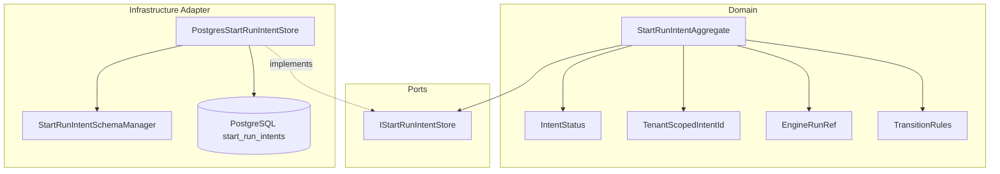
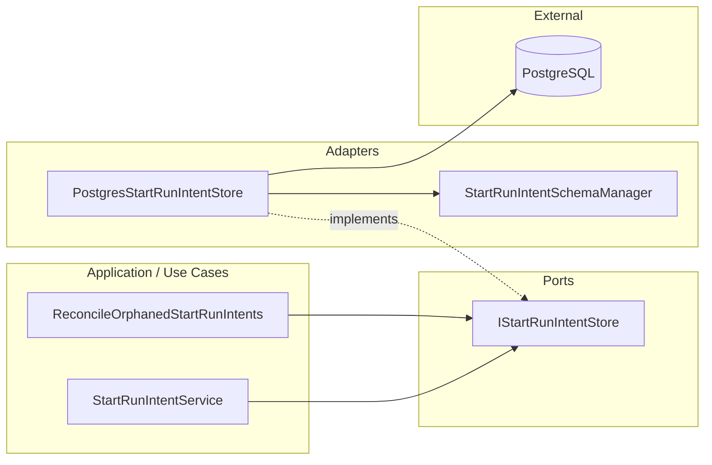
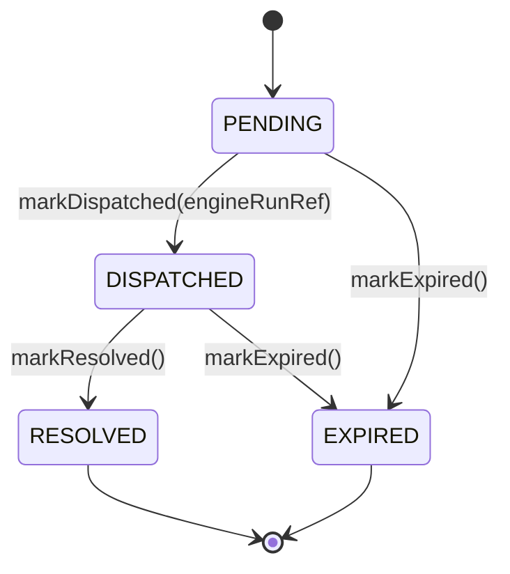
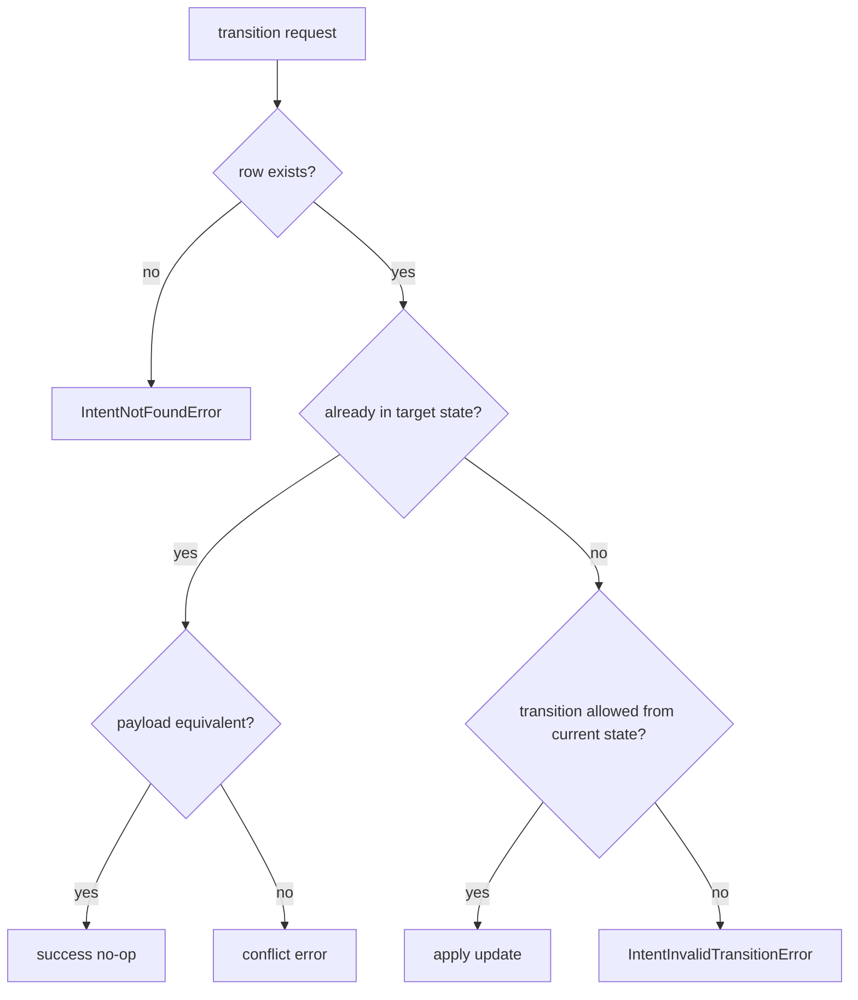
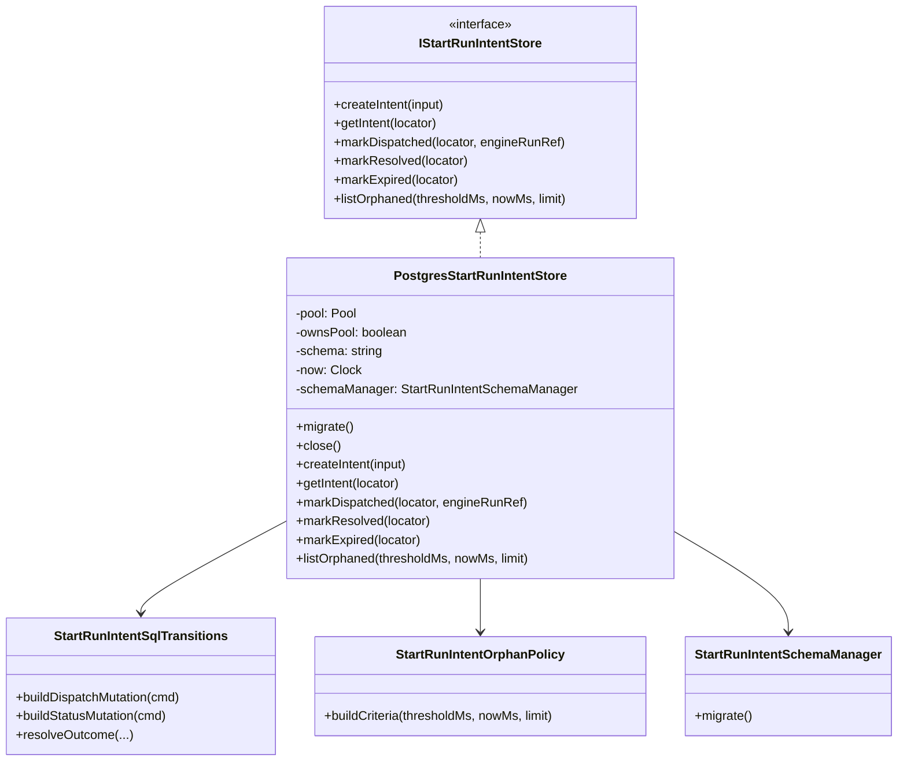

# QA Review and Class Documentation — `PostgresStartRunIntentStore`

- **File**: `packages/@dvt/adapter-postgres/src/PostgresStartRunIntentStore.ts`
- **Reviewed against**:
  - `ADR-0030: Pre-Dispatch Intent Log for startRun Crash Consistency`
  - `ADR-0031: Storage Adapter Tenant Isolation Strategy`
  - DVT+ state-centric, planner/engine/UI separation
- **Status**: **Conditional approval only after blocking fixes**
- **Reviewer stance**: hard QA / architecture review

---

## 1. Executive summary

`PostgresStartRunIntentStore` is **directionally correct** as a Postgres outbound adapter that persists `startRun` intents durably and applies SQL-backed transition guards. The class is structurally aligned with DVT+ in one important sense: it remains in the persistence boundary and does not try to plan, execute, or derive truth from runtime memory.

That said, the current implementation is **not yet merge-safe as a final design**.

The main blockers are:

1. **Tenant isolation is not enforced in operational methods**.
2. **Duplicate intent creation can silently accept conflicting identity tuples**.
3. **Transition methods are too strict for at-least-once retry semantics**.
4. **Orphan detection uses `created_at` for `DISPATCHED`, which is likely semantically wrong**.
5. **Some domain invariants are still being enforced ad hoc in the adapter instead of being clearly split between domain and persistence concerns**.

---

## 2. Architectural fit inside DVT+

DVT+ explicitly separates:

- **planning**: what should run and why,
- **execution**: how the plan is executed,
- **state**: what happened,
- **presentation**: how humans view and submit intent.

This class belongs to the **state persistence / metadata store** side of the system. That is the correct place for it.

### Correct fit

- It is an **outbound adapter** implementing a persistence port (`IStartRunIntentStore`).
- It persists durable state rather than depending on engine memory.
- It uses SQL guards for state-transition consistency.
- It keeps orchestration concerns out of the class.

### Architectural warning

The adapter currently stores `tenant_id` but **does not consistently use tenant scope when reading and mutating rows**. In DVT+, tenant/project scoping is not optional boundary decoration; it is part of the contract and authorization model. A state store adapter should make cross-tenant misuse structurally difficult, not merely improbable.

---

## 3. QA verdict

### Merge recommendation

**Do not merge as final.**

### Why

The class has a solid backbone, but the current behavior still leaves holes in:

- tenant-safe addressability,
- safe replay semantics,
- duplicate-create conflict detection,
- and orphan-state interpretation.

Those are not cosmetic issues. They directly affect crash consistency, replay safety, and tenant isolation.

---

## 4. What is good

## 4.1. Boundary discipline is mostly correct

The class does not leak into planner responsibilities or engine orchestration. That is aligned with the DVT+ rule:

> The UI does not execute. The engine does not decide. The planner does not persist state.

This store behaves like persistence infrastructure, not business workflow logic.

## 4.2. Transition outcome handling is explicit

The pattern around:

- `resolveTransitionOutcome(...)`
- `assertTransitionOutcome(...)`
- `buildTransitionMutation(...)`

is good.

It avoids the weakest possible shape (`SELECT` then `UPDATE` in separate steps) and instead computes a SQL mutation result plus a normalized outcome:

- `UPDATED`
- `INVALID`
- `NOT_FOUND`

That is materially safer under concurrency.

## 4.3. Readiness gate is correct

Requiring `await store.migrate()` before use is a good fail-closed decision. Throwing `StoreNotReadyError` is far better than implicit lazy migration or half-ready behavior.

## 4.4. Reasonable use of typed aliases

The local aliases improve readability:

- `IntentId`
- `TenantId`
- `RunId`
- `IntentTimestamp`
- `EngineRunRef`

That is a small but good OOP/TypeScript hygiene signal.

## 4.5. Pool ownership is explicit

The `ownsPool` flag is good infrastructure hygiene. It avoids silently ending an externally managed pool.

---

## 5. Blocking issues

## 5.1. Tenant isolation is not enforced in reads and transitions

### Problem

The row model contains `tenant_id`, but core operational methods are keyed only by `intent_id`:

- `markDispatched(intentId, engineRunRef)`
- `markResolved(intentId)`
- `markExpired(intentId)`
- `getIntent(intentId)`

and the SQL also addresses rows by `intent_id` only.

### Why this is blocking

This is weak for a system with tenant-scoped authorization and state isolation. Even if `intent_id` is globally unique, the adapter is relying on global identifier uniqueness instead of scoped identity.

That creates a weaker guarantee:

- **Current guarantee**: “a known `intentId` can address a row”
- **Desired guarantee**: “a row is addressable only inside the correct tenant scope”

### Required fix

All operational methods should accept a tenant-scoped locator, for example:

```ts
interface StartRunIntentLocator {
  tenantId: TenantId;
  intentId: IntentId;
}
```

and all SQL mutations/reads should filter on both:

```sql
WHERE tenant_id = $1
  AND intent_id = $2
```

### Severity

**Blocking**

---

## 5.2. `createIntent()` silently accepts conflicting duplicates

### Problem

`createIntent()` inserts on `intent_id` conflict and falls back to returning the existing row.

That means a caller could reuse the same `intentId` with a different:

- `tenantId`
- `runId`
- `provider`

and the method would still return a row instead of rejecting the mismatch.

### Why this is blocking

That turns an identity collision into a fake idempotent retry.

A retry is only valid if the identity tuple is semantically the same. If the existing row differs in tenant, run, or provider, then the caller is not retrying; it is colliding.

### Required fix

After conflict fallback, validate that the stored row matches the requested identity tuple:

- `tenantId`
- `runId`
- `provider`

If not, throw a dedicated conflict error such as:

```ts
IntentCreateConflictError
```

### Severity

**Blocking**

---

## 5.3. Transition methods are not idempotent enough for replay / retry reality

### Problem

`markDispatched()` only succeeds when the current state is `PENDING`.
If it is called again after a successful dispatch, the second call becomes `INVALID`.

The same issue likely exists for `markResolved()` and `markExpired()` once the target state has already been reached.

### Why this is blocking

DVT+ expects state writes to survive at-least-once activity semantics. When retries happen after network ambiguity or crash windows, replaying the same mutation should not become a hard failure if the stored result already equals the intended result.

### Required behavior

For transition commands, the adapter should distinguish:

1. **Already in target state with equivalent payload** → success / no-op
2. **Already in target state with conflicting payload** → conflict
3. **Existing row in incompatible state** → invalid transition
4. **Missing row** → not found

For `markDispatched(intentId, engineRunRef)` specifically:

- `PENDING -> DISPATCHED` with `engineRunRef = X` → success
- `DISPATCHED` with same `engineRunRef = X` → success / no-op
- `DISPATCHED` with different `engineRunRef = Y` → conflict
- `RESOLVED` or `EXPIRED` → invalid transition

### Severity

**Blocking**

---

## 5.4. `listOrphaned()` likely uses the wrong time basis for `DISPATCHED`

### Problem

The current query uses:

```sql
WHERE status IN ('PENDING', 'DISPATCHED')
  AND created_at < cutoff
```

### Why this is blocking

This makes `DISPATCHED` intents appear old based on their original creation time, even if dispatch happened recently.

Example:

- intent created at `10:00`
- dispatch recorded at `10:20`
- orphan scan runs at `10:21`
- threshold = 15 minutes

Under the current query, the row may already qualify as orphaned because `created_at` is too old.

### Required fix

Use a state-aware clock. One acceptable version is:

```sql
WHERE (
  status = 'PENDING' AND created_at < $1
) OR (
  status = 'DISPATCHED' AND updated_at < $1
)
```

If the domain meaning is “stuck since last transition,” then `updated_at` should likely become the only time basis.

### Severity

**Blocking**

---

## 5.5. Domain invariants are partly living in the adapter without a clear aggregate model

### Problem

The class enforces transition rules through SQL and `getAllowedFromStatuses(...)`, but the aggregate boundary is not explicit.

This leaves the design in an awkward middle state:

- not fully an anemic repository,
- not fully a domain aggregate with encapsulated invariant logic.

### Why this matters

In DDD terms, the adapter should not be the primary home of domain meaning. It can enforce storage safety, but the transition semantics should be clearly owned by a domain model or a domain state machine.

### Required improvement

Make the aggregate explicit:

- `StartRunIntent` as aggregate root or domain state machine
- repository/adapter persists it
- SQL guards remain as **defensive persistence enforcement**, not the only semantic source

### Severity

**Blocking for architecture completion**

---

## 6. Non-blocking but important issues

## 6.1. `createdAt` is caller-controlled

`createIntent()` persists `input.createdAt` into `created_at`.

That may be acceptable if ADR-0030 explicitly defines caller-supplied logical time, but if not, it is risky because it allows:

- clock skew,
- future timestamps,
- misleading orphan detection,
- replay weirdness.

### Recommendation

Prefer one of these two models:

1. **Store-owned clock** for `created_at`, with an optional `requested_at` or `client_created_at` field.
2. Strong validation if caller time is intentionally canonical.

---

## 6.2. Orphan criteria input validation is incomplete

`limit` is validated, but `thresholdMs` and `nowMs` are not.

### Missing checks

- `Number.isFinite(thresholdMs)`
- `Number.isFinite(nowMs)`
- `thresholdMs >= 0`
- optionally integer checks if required

---

## 6.3. Observability is absent

Given DVT+ places observability as a first-class architectural layer, this adapter should ideally emit:

- operation name,
- tenantId,
- outcome,
- duration,
- transition target,
- error class.

This is not a blocker for correctness, but it is a practical gap.

---

## 6.4. Pool dependency is concrete infrastructure, not abstract query execution

This is not wrong for an adapter, but from a strict DIP perspective, the class depends directly on `pg.Pool` semantics.

That is acceptable at the infrastructure edge, but it does mean unit testing and portability would improve if the query capability were abstracted behind a smaller interface.

---

## 7. SOLID assessment

## 7.1. S — Single Responsibility Principle

### What is good

The class is mostly focused on one area: persistence of `startRun` intents.

### What is weak

It currently mixes several sub-responsibilities:

- schema readiness lifecycle,
- pool lifecycle management,
- SQL persistence,
- transition outcome interpretation,
- orphan selection policy.

That is not catastrophic, but it means the class is slightly too broad.

### Verdict

**Partially compliant**

### Suggested split

- `PostgresStartRunIntentStore` → persistence operations only
- `StartRunIntentTransitionSqlPolicy` → SQL transition statements / replay semantics
- `StartRunIntentOrphanPolicy` → cutoff semantics and validation
- `StartRunIntentSchemaBootstrap` → schema lifecycle

---

## 7.2. O — Open/Closed Principle

### What is good

The use of helpers such as `buildTransitionMutation(...)` is cleaner than hardcoding logic inline everywhere.

### What is weak

Adding new statuses or changing transition semantics likely requires modifying several internal methods and SQL branches.

### Verdict

**Moderate compliance**

The design is not closed enough for transition-model changes.

---

## 7.3. L — Liskov Substitution Principle

The class implements `IStartRunIntentStore`. Assuming the port contract allows current failure semantics, the implementation is substitutable.

However, once idempotent replay semantics are clarified, this area should be revisited. A store implementation that throws on duplicate-success replay may technically satisfy the method signatures while still violating expected behavioral substitutability.

### Verdict

**Nominally compliant, behaviorally fragile**

---

## 7.4. I — Interface Segregation Principle

The class itself does not violate ISP, but the answer depends more on `IStartRunIntentStore`.

From what is visible, the store interface seems small enough.

### Verdict

**Likely compliant**

---

## 7.5. D — Dependency Inversion Principle

### What is good

The class depends on a port (`IStartRunIntentStore`) from the outside perspective and allows injection of:

- `pool`
- `now`
- `schemaManager`

### What is weak

Internally, it still depends on concrete infrastructure types like `Pool` and a Postgres-flavored schema manager. Again, that is acceptable inside an adapter, but from pure DIP it is not ideal.

### Verdict

**Acceptable for infrastructure code, not exemplary**

---

## 8. OOP assessment

## 8.1. Encapsulation

Good enough. Internal helpers are private and the API is narrow.

## 8.2. Naming

Generally good. The intent is clear.

## 8.3. State handling

Reasonable, but there is some mutable lifecycle state:

- `migratePromise`
- `migrated`

This is acceptable for readiness caching.

## 8.4. Data modeling

The class is still quite **record-oriented** rather than object-oriented.

Examples:

- `IntentRow`
- `PersistedIntentState`
- `toPersistedIntentState(...)`
- `toIntent(...)`

This is not inherently bad in infrastructure code, but it reinforces that the aggregate/domain model is weakly expressed.

### OOP verdict

**Clean infrastructure OOP, but domain modeling is thin**

---

## 9. Hexagonal architecture assessment

## 9.1. What it gets right

This class is clearly an **adapter**, not a core service.

That is good.

It fits the hexagonal shape:

- **Port**: `IStartRunIntentStore`
- **Adapter**: `PostgresStartRunIntentStore`
- **External technology**: PostgreSQL via `pg`

## 9.2. What is still weak

The adapter is carrying a bit too much policy:

- transition semantics,
- orphan semantics,
- partial invariant interpretation.

In a stricter hexagonal design, those should either be:

- owned by the domain and persisted safely here, or
- clearly named as persistence policies and isolated as collaborators.

### Hexagonal verdict

**Correct role, incomplete purity**

---

## 10. DDD assessment

## 10.1. Is this class an aggregate?

No.

It should **not** be treated as one.

This class is an **infrastructure repository/adapter**, not the domain aggregate.

## 10.2. What should the aggregate be?

The aggregate is conceptually the **StartRunIntent** lifecycle.

Its core invariants appear to include:

- identity scope,
- allowed transitions,
- dispatch payload consistency,
- terminal-state semantics,
- orphan interpretation rules.

At the moment, those invariants are partly distributed across:

- the port contract,
- `getAllowedFromStatuses(...)`,
- SQL `WHERE` clauses,
- and reviewer inference.

That is too diffuse.

## 10.3. Recommended DDD shape

### Aggregate root

`StartRunIntentAggregate`

### Value objects

- `IntentId`
- `TenantScopedIntentId`
- `RunId`
- `EngineRunRef`
- `IntentStatus`
- `IntentTimestamps`

### Repository port

`IStartRunIntentRepository` or keep `IStartRunIntentStore` if the naming is already established

### Adapter

`PostgresStartRunIntentStore`

### DDD verdict

**Current code is repository-first, aggregate-underdefined**

That is acceptable during early buildout, but not ideal if the intent lifecycle is important enough to deserve ADRs.

---

## 11. Aggregate diagram



### Reading the diagram

- The **aggregate** owns the meaning of transitions.
- The **port** defines required persistence behavior.
- The **Postgres adapter** persists and defensively guards against invalid storage transitions.
- The adapter should not be the only place where domain meaning exists.

---

## 12. Hexagonal placement diagram



### Interpretation

This is the right high-level shape.

The improvement needed is not role reassignment. It is semantic hardening:

- tenant scope,
- idempotent replay behavior,
- explicit domain invariants,
- better orphan semantics.

---

## 13. Current state machine vs desired state machine



### Missing semantic detail

The current implementation does not distinguish well enough between:

- duplicate-success replay,
- conflicting replay,
- incompatible transition.

### Desired replay-aware interpretation



---

## 14. Class documentation

## 14.1. Purpose

`PostgresStartRunIntentStore` is a PostgreSQL-backed implementation of `IStartRunIntentStore` responsible for durably persisting the `startRun` pre-dispatch intent lifecycle.

Its purpose is to ensure that intent creation and subsequent transition reconciliation survive:

- process restarts,
- transient failures,
- dispatch crash windows,
- and replay/reconciliation flows.

## 14.2. Responsibilities

### It should do

- create durable intent records,
- read intent records,
- transition intent status safely,
- list orphaned/stuck intents for reconciliation,
- enforce storage-level guards against invalid writes,
- ensure schema readiness before operational use.

### It should not do

- plan execution,
- decide execution order,
- own engine orchestration,
- own authorization decisions,
- infer state from runtime memory,
- become the aggregate itself.

## 14.3. Constructor dependencies

### `pool?: Pool`
Allows external connection management.

### `connectionString?: string`
Fallback when no pool is injected.

### `schema?: string`
Schema name, normalized via `normalizeSchema(...)`.

### `now?: () => string`
Clock injection for deterministic testing.

### `statementTimeoutMs?: number`
Postgres statement timeout.

### `queryTimeoutMs?: number`
Postgres query timeout.

### `schemaManager?: StartRunIntentSchemaManager`
Schema bootstrap collaborator.

## 14.4. Public API behavior

### `migrate(): Promise<void>`
Initializes required schema objects. Must be called before operational methods.

### `close(): Promise<void>`
Ends the pool only if the store owns it.

### `createIntent(input: CreateIntentInput): Promise<StartRunIntent>`
Creates a new `PENDING` intent or returns the existing one for the same identity. Should reject conflicting duplicate identity tuples.

### `markDispatched(intentId, engineRunRef): Promise<void>`
Marks the intent as `DISPATCHED`. Should become idempotent for duplicate-success replay.

### `markResolved(intentId): Promise<void>`
Marks the intent as `RESOLVED` when valid.

### `markExpired(intentId): Promise<void>`
Marks the intent as `EXPIRED` when valid.

### `listOrphaned(thresholdMs, nowMs, limit?): Promise<StartRunIntent[]>`
Returns intents older than the cutoff according to orphan semantics. The time basis should be state-aware.

### `getIntent(intentId): Promise<StartRunIntent | null>`
Reads the current persisted intent by identifier. Should be tenant-scoped.

---

## 15. Recommended class contract changes

## 15.1. Introduce tenant-scoped locator

```ts
export interface StartRunIntentLocator {
  tenantId: TenantId;
  intentId: IntentId;
}
```

Then evolve signatures toward:

```ts
createIntent(input: CreateIntentInput): Promise<StartRunIntent>
getIntent(locator: StartRunIntentLocator): Promise<StartRunIntent | null>
markDispatched(locator: StartRunIntentLocator, engineRunRef: EngineRunRef): Promise<void>
markResolved(locator: StartRunIntentLocator): Promise<void>
markExpired(locator: StartRunIntentLocator): Promise<void>
```

## 15.2. Add explicit conflict error for duplicate create mismatch

```ts
export class IntentCreateConflictError extends Error {}
```

## 15.3. Add explicit conflict error for dispatch payload mismatch

```ts
export class IntentDispatchConflictError extends Error {}
```

## 15.4. Consider explicit replay semantics in the port

The interface should state whether duplicate-success replay must:

- succeed as no-op, or
- fail as invalid transition.

For DVT+, the stronger recommendation is **no-op success if semantically identical**.

---

## 16. Recommended refactoring shape



### Why this refactor helps

- narrows responsibilities,
- makes transition semantics testable in isolation,
- makes orphan policy explicit,
- leaves the adapter class thinner and less policy-heavy.

---

## 17. Test plan required before approval

## 17.1. Blocking test coverage

### Tenant scope

- create same `intentId` in two different tenants must not be ambiguously addressable
- read/write with wrong tenant must not affect another tenant’s row

### Duplicate create conflict

- same `intentId`, same identity tuple → success / same row
- same `intentId`, different `runId` → conflict
- same `intentId`, different `tenantId` → conflict
- same `intentId`, different `provider` → conflict

### Replay-aware transitions

- `markDispatched` twice with same `engineRunRef` → success / no-op
- `markDispatched` twice with different `engineRunRef` → conflict
- `markResolved` twice when already resolved → success / no-op or explicit contract-defined behavior
- `markExpired` twice when already expired → same principle

### Invalid transitions

- `RESOLVED -> EXPIRED` must fail
- `EXPIRED -> RESOLVED` must fail
- dispatch from terminal state must fail

### Orphan semantics

- old `PENDING` row qualifies appropriately
- recently dispatched old row does **not** qualify incorrectly
- old `DISPATCHED` by `updated_at` does qualify when expected

### Readiness

- any operational method before `migrate()` throws `StoreNotReadyError`

### Validation

- invalid `limit` throws
- invalid `thresholdMs` throws
- invalid `nowMs` throws

---

## 18. Suggested approval rubric

## Acceptable for merge only if all of these are done

- [ ] Tenant-scoped row access is enforced in all read/write paths
- [ ] `createIntent()` detects conflicting duplicates
- [ ] replay-equivalent transitions are idempotent
- [ ] conflicting replay is rejected explicitly
- [ ] orphan detection uses the correct temporal basis
- [ ] tests cover the required matrix above

---

## 19. Final verdict

`PostgresStartRunIntentStore` is **a credible infrastructure adapter**, not junk. The implementation has real strengths:

- decent structure,
- better-than-average transition handling,
- good readiness semantics,
- clear intent.

But it is still **too weak on the exact areas that matter most** for this part of DVT+:

- tenant isolation,
- replay safety,
- identity conflict detection,
- and state semantics.

So the honest call is:

> **Good base. Not merge-complete. Needs hardening before approval.**

---

## 20. References

### Internal project evidence used

- `DVT_Product_Definition_V0.txt`
- `DVT_Product_AntiScope_V0.txt`
- `dvt_workflow_engine_artifact.txt`
- `dvt_v2_architecture_explanation.txt`
- `dvt_v2_mermaid_diagram_prompt-4.txt`

### External references

- C4 Model — https://c4model.com/
- OpenTelemetry — https://opentelemetry.io/
- Temporal — https://temporal.io/
- Temporal TypeScript SDK — https://docs.temporal.io/develop/typescript
- Conductor — https://conductor.netflix.com/
- Orkes — https://orkes.io/
- PostgreSQL — https://www.postgresql.org/docs/
- Domain-Driven Design Reference — https://www.domainlanguage.com/ddd/reference/
- Martin Fowler: Repository — https://martinfowler.com/eaaCatalog/repository.html
- Martin Fowler: Hexagonal / Ports and Adapters related material — https://martinfowler.com/bliki/HexagonalArchitecture.html
