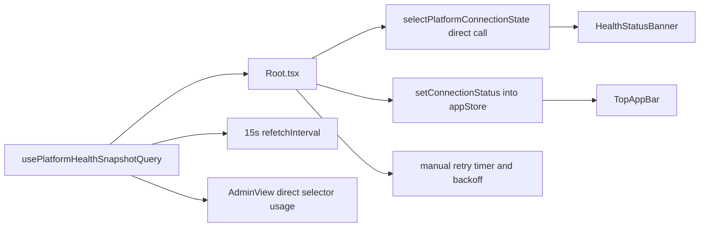
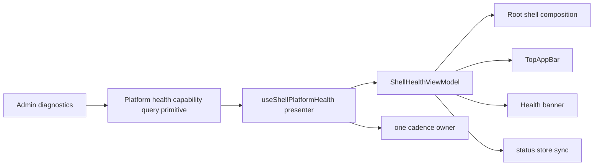

# F-03 Shell Health Fowler Hard Review

## Summary

This review covers the current `F-03` slice after
`feat(web): Add backend health banner and retry flow (#739)`.

Reviewed scope:

- `apps/web/src/app/Root.tsx`
- `apps/web/src/app/platformHealthStatus.ts`
- `apps/web/src/app/platformHealthStatus.test.ts`
- `apps/web/src/app/components/TopAppBar.tsx`
- `apps/web/src/app/views/AdminView.tsx`
- `apps/web/src/app/stores/appStore.ts`
- `apps/web/src/app/stores/index.ts`
- `apps/web/src/app/queries/useCapabilitiesQuery.ts`
- `apps/web/src/app/services/plans/plansService.ts`
- `apps/web/src/capabilities/platform-health/**`

The `parseExecutionPlanV2` runtime crash is fixed. The remaining problem is not
basic functionality but architectural drift around shell-health ownership,
state truth, retry policy, and adjacent shell boundaries.

## Governing sources

- `AGENTS.md`
- `docs/guides/ai-work-protocol.md`
- `docs/planning/state/agent-lane-e.yaml`
- `docs/architecture/frontend/index.md`
- `docs/planning/proposals/frontend-roadmap-20260219.md`
- `docs/planning/state/lane-e-shell-baseline-target-guide.md`
- `apps/web/FRONTEND_PLAN_BACK_ALIGNMENT.md`
- `docs/adr/ADR-0034-bounded-context-boundaries-and-communication-rules.md`
- `docs/adr/ADR-0039-hexagonal-port-hardening-and-solid-remediation.md`
- `docs/adr/ADR-0041-global-domain-state-model-and-boundary-contracts.md`
- `docs/adr/ADR-0041a-reconciler-health-state-and-readiness-port-semantics.md`

## Think-first analysis

### Problem summary

`F-03` has moved the shell from mock connectivity toward real backend health,
but the current implementation still mixes:

- shell composition
- health projection
- retry scheduling
- store synchronization
- partially real and partially synthetic status semantics

The slice now works well enough to render, but it does not yet satisfy the lane
objective cleanly enough to be considered a stable shell-health baseline.

### Root cause

The current change treated `Root.tsx` as the fastest place to finish `F-03`.
That landed the visible banner, but it also turned `Root` into a local
transaction script for shell health:

- one source of truth drives `TopAppBar` through the store
- a second source of truth drives the banner directly from the query snapshot
- retry cadence is split between TanStack Query polling and a second timer
  inside the route shell
- event connectivity is surfaced in the shell before a real live-events
  capability exists

This is a classic Fowler drift: presentation behavior works, but the
application policy is embedded in a view-composition node instead of a stable
presenter or application seam.

### Constraints and invariants

- Lane E requires real backend health state to be visible, but no mock
  connectivity state may remain in the shell.
- `Views -> Services -> API Client` remains the required frontend dependency
  direction.
- ADR-0041 requires explicit state models and explicit mapping at boundaries.
- ADR-0041A forbids implicit "healthy" or "configured" assumptions when state
  is not explicit.
- ADR-0034 and ADR-0039 require clear ownership boundaries and discourage
  orchestration logic from leaking into composition shells.

### Options considered

1. Minimal patch inside `Root.tsx`
   - fix pending/offline only
   - keep retry timers and direct selector usage in place

2. Introduce a shell-health presenter seam
   - one explicit shell view-model
   - one cadence owner
   - `Root` becomes a composition layer again

3. Wait for full store decomposition (`F-05`) before hardening `F-03`
   - defer cleanup until the broader shell store work lands

### Selected option and rationale

Option 2 is the correct path.

Option 1 would stop the most visible regression but preserve the same
architectural shape that caused it. Option 3 is too large and would block a
high-value shell correctness fix on unrelated decomposition work.

The right move is to harden `F-03` with a narrow presenter-level seam that:

- makes the shell state explicit
- centralizes cadence ownership
- keeps the platform-health capability reusable
- avoids prematurely dragging `F-05` into the slice

### Rejected alternatives

- A full shell store decomposition inside this slice was rejected as scope
  creep.
- A docs-only closeout was rejected because the current code still has active
  correctness and ownership drift.

## Current architecture

## Findings

### `F03-HQA-01` Blocking - split source of truth creates false outage UX

Evidence:

- `Root.tsx` skips store updates while the query is pending.
- The banner does not read the store. It recomputes status directly from the
  query snapshot.
- `selectPlatformConnectionState(undefined, false)` returns `offline`.

Consequence:

- initial shell render can show an offline banner even though no failure has
  happened yet
- the top bar and banner can disagree during boot

Why this is a real drift:

- Lane E says real backend health must be visible, not guessed.
- ADR-0041 and ADR-0041A require explicit state, not "missing data means
  outage".

Relevant files:

- `apps/web/src/app/Root.tsx`
- `apps/web/src/capabilities/platform-health/domain/platformHealthSelectors.ts`

### `F03-HQA-02` High - retry ownership is duplicated

Evidence:

- `usePlatformHealthSnapshotQuery` already polls every 15 seconds.
- `Root.tsx` adds a second retry scheduler with exponential backoff and manual
  refetch calls.

Consequence:

- cadence policy is split across two layers
- polling behavior becomes harder to reason about, test, and evolve

Why this is a real drift:

- retry/backoff is application behavior, not incidental JSX glue
- Fowler-style presentation logic should consume a view-model or application
  policy, not own it inline

Relevant files:

- `apps/web/src/capabilities/platform-health/presentation/usePlatformHealthSnapshotQuery.ts`
- `apps/web/src/app/Root.tsx`

### `F03-HQA-03` High - shell still exposes synthetic live-event semantics

Evidence:

- `PlatformConnectionState` includes `liveEvents`.
- the selector returns `polling` or `disconnected` even though no live-events
  capability is wired here
- `appStore` defaults `liveEvents` to `connected`
- `TopAppBar` and `AdminView` expose this value as if it were real shell truth

Consequence:

- the shell claims more operational truth than the frontend actually has
- `connected` is currently a synthetic default, not an observed runtime fact

Why this is a real drift:

- `F-03` only promises real backend health in shell status
- "no mock connectivity state anywhere in the shell" is currently not true

Relevant files:

- `apps/web/src/capabilities/platform-health/domain/platformHealthTypes.ts`
- `apps/web/src/capabilities/platform-health/domain/platformHealthSelectors.ts`
- `apps/web/src/app/stores/appStore.ts`
- `apps/web/src/app/components/TopAppBar.tsx`
- `apps/web/src/app/views/AdminView.tsx`

### `F03-HQA-04` High - critical shell seam still lacks behavior tests

Evidence:

- selector tests exist
- helper tests exist
- query-hook tests exist
- no render-level test covers `Root` pending, offline, degraded, recovery, or
  banner/top-bar coherence

Consequence:

- the most important regression path in the slice is unguarded
- the current pending/offline issue passed because tests stop below the real
  seam

Relevant files:

- `apps/web/src/app/platformHealthStatus.test.ts`
- `apps/web/src/capabilities/platform-health/presentation/usePlatformHealthSnapshotQuery.test.ts`

### `F03-HQA-05` Medium - `Root.tsx` now violates SRP

Evidence:

`Root.tsx` now owns:

- layout composition
- shell-health mapping
- retry state
- retry timers
- retry countdown
- store synchronization

Consequence:

- shell correctness changes require editing the route shell instead of a
  reusable presenter/application seam

Why this matters:

- ADR-0039 explicitly pushes orchestration and policy away from composition
  roots
- lane-E architecture aims for views decoupled from data and policy

### `F03-HQA-06` Medium - legacy parallel store surfaces remain active

Evidence:

- `Root.tsx` uses `app/stores/appStore.ts`
- `GraphCanvas` and other surfaces still import `app/stores/index.ts`
- both files define active Zustand stores and overlapping shell concepts

Consequence:

- shell state ownership is already fragmented
- `F-03` adds more shell behavior without reducing that fragmentation

Why this matters:

- `F-05` is about store decomposition, but `F-03` should not deepen the
  ambiguity before that work begins

Relevant files:

- `apps/web/src/app/stores/appStore.ts`
- `apps/web/src/app/stores/index.ts`

### `F03-HQA-07` Medium - adjacent shell queries still bypass the service layer

Evidence:

- `useCapabilitiesQuery.ts` performs a direct `fetch('/api/capabilities')`
- `AdminView` mixes that ad hoc query with the platform-health capability

Consequence:

- the shell is only partially following the Lane E rule
- Admin remains a mixed boundary with one capability-driven path and one ad hoc
  path

Why this matters:

- the shell health slice should not be evaluated as "architecturally clean"
  while nearby shell diagnostics still bypass the declared layering rule

Relevant files:

- `apps/web/src/app/queries/useCapabilitiesQuery.ts`
- `apps/web/src/app/views/AdminView.tsx`

### `F03-HQA-08` Medium - active docs drift from current frontend truth

Evidence:

- `system-delivery-status.md` still says web has no automated tests
- `canonical-doc-code-matrix.md` still says the same
- `FRONTEND_PLAN_BACK_ALIGNMENT.md` still references legacy
  `GlobalStatusBanner`, `usePlatformHealthQuery`, and `statusStore` surfaces as
  current

Consequence:

- canonical planning/status surfaces are overstating or misstating the actual
  frontend baseline

### `F03-HQA-09` Low but real - `plansService.ts` still carries contract drift

Evidence:

- `buildPlanRefFromPlan()` hardcodes `schemaVersion: '2.0.0'`
- it also fills `sha256` with a zero placeholder
- mapper behavior from contract plan to UI has no dedicated tests

Consequence:

- the crash is fixed, but the adjacent plan-ref and mapping contract is still
  weaker than the rest of the repo governance would expect

This is not the blocker for `F-03`, but it is part of the reviewed change set
and should not be ignored.

## Proposed target architecture

Key rule:

- the capability keeps backend-health loading and decoding reusable
- the shell presenter owns shell-specific state interpretation and cadence
- `Root` consumes the presenter; it does not invent health policy inline

## Pre-implementation brief

### Mode

Slim.

This is a hardening slice, not a new public feature.

### Scope

- fix the `F03-HQA-01/02/03/04/05` shell-health issues directly
- update active status/planning docs that are now objectively stale
- capture `F03-HQA-06/07/09` as linked residuals without forcing a full `F-05`
  or `F-06` implementation into the slice

### Touched paths expected

- `apps/web/src/app/Root.tsx`
- `apps/web/src/app/components/TopAppBar.tsx`
- new shell-health presenter files under `apps/web/src/app/` or
  `apps/web/src/app/shell/`
- `apps/web/src/app/platformHealthStatus.ts` or successor presenter helpers
- new `Root` seam tests
- active docs that currently claim stale frontend truth

### Risks and mitigations

- Risk: over-expanding into full store decomposition
  - Mitigation: keep store changes minimal and scoped to shell-health truth
- Risk: breaking the reusable platform-health capability
  - Mitigation: keep shell-specific logic outside the capability boundary
- Risk: timer-heavy tests become flaky
  - Mitigation: use fake timers and explicit hook/test harness control

### Out of scope

- full `F-05` store decomposition
- full `F-06` query standardization across all shell domains
- run/events transport implementation
- complete `plansService` contract cleanup

### Libraries evaluated

None required.

The repo already has `jsdom`, Vitest, and a shared React Query harness.

## Detailed execution plan

### `F03-FIX-1` Add seam tests first

Add a dedicated `Root` shell-health test file that proves:

- pending boot does not render offline
- offline render appears only after a real transport or protocol failure
- degraded render appears from real degraded probe data
- top bar and banner read the same effective shell-health state
- retry-now triggers an immediate refetch
- backoff resets after recovery

### `F03-FIX-2` Introduce a shell-health presenter seam

Add a narrow presenter or app-level hook, for example:

- `useShellPlatformHealth()`
- `createShellHealthViewModel()`

Expected output:

- `phase: 'bootstrapping' | 'ok' | 'degraded' | 'offline'`
- `connectionStatus`
- `connectionDetail`
- `showBanner`
- `nextRetryInSeconds`
- `retryNow()`

### `F03-FIX-3` Make pending state explicit

Do not let `undefined snapshot` collapse directly to `offline` for shell UX.

Recommendation:

- keep `selectPlatformConnectionState()` as a low-level capability projection if
  needed
- add an explicit shell phase above it so bootstrapping is modeled before the
  first successful or failed fetch

### `F03-FIX-4` Normalize cadence ownership

Choose one owner for shell-health refetch policy.

Recommended model:

- the shell-health presenter owns cadence for shell purposes
- healthy state polls on a fixed interval
- degraded and offline states back off exponentially
- manual retry resets the degraded/offline backoff

Do not keep a second hidden cadence inside `Root` after this extraction.

### `F03-FIX-5` Contract live-events semantics to what is real today

Recommended near-term rule:

- shell health should expose real REST health only
- do not present `liveEvents: connected` until a real live-events transport
  exists and is observed

Two acceptable implementations:

1. remove `liveEvents` from shell-facing status surfaces for now
2. keep it internal but never present it as runtime truth in TopBar/Admin until
   `run.observe` is real

### `F03-FIX-6` Update active docs

Correct active status docs that are now stale:

- `docs/architecture/system-delivery-status.md`
- `docs/planning/status/canonical-doc-code-matrix.md`
- active frontend alignment doc if the legacy component names remain listed as
  current truth

### `F03-FIX-7` Leave two explicit residuals instead of hiding them

Residual A:

- legacy parallel stores remain active and should be absorbed by `F-05`

Residual B:

- `plansService.ts` still needs a follow-up contract hardening slice for
  `PlanRef` integrity and mapper coverage

## Acceptance criteria

- no offline banner during initial boot without an actual failed probe
- top bar and banner never disagree on shell-health state
- only one cadence owner remains for shell-health refetch policy
- no shell surface presents synthetic live-event connectivity as real runtime
  truth
- `Root.tsx` no longer owns retry state-machine logic inline
- new tests cover the shell seam, not only selector/helper seams
- active status docs no longer claim that web has no automated tests

## Validation baseline

Executed during this review:

- `pnpm --filter @dvt/web exec vitest run src/app/platformHealthStatus.test.ts src/capabilities/platform-health/domain/platformHealthSelectors.test.ts`
- `pnpm --filter @dvt/web typecheck`
- `pnpm --filter @dvt/web build`

Required for the implementation slice that follows:

- `pnpm --filter @dvt/web exec vitest run <new root-shell test> src/app/platformHealthStatus.test.ts src/capabilities/platform-health/domain/platformHealthSelectors.test.ts`
- `pnpm --filter @dvt/web typecheck`
- `pnpm --filter @dvt/web build`
- `pnpm verify:prepush`

## Final posture

`F-03` is not blocked by missing backend capabilities anymore.

It is blocked by local shell-health ownership drift. The slice should stay
`in_progress` until the shell presenter, cadence ownership, and seam coverage
are corrected.
