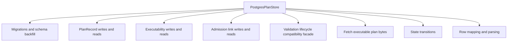
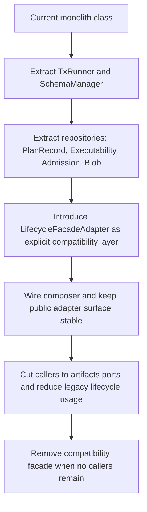

# PostgresPlanStore SRP remediation target architecture

## Purpose

Document the current responsibility drift in
`packages/@dvt/adapter-postgres/src/PostgresPlanStore.ts` and define the
target decomposition aligned with SRP, hexagonal boundaries, and ADR ownership.

## Governing sources

- [ADR-0034](../../../adr/ADR-0034-bounded-context-boundaries-and-communication-rules.md)
- [ADR-0039](../../../adr/ADR-0039-hexagonal-port-hardening-and-solid-remediation.md)
- [ADR-0043](../../../adr/ADR-0043-plan-record-plan-store-and-artifacts-ownership.md)
- [S08 execution plan](../../proposals/s08-plan-record-plan-store-execution-plan-20260402.md)

## Current state (as of 2026-04-03)

`PostgresPlanStore` currently concentrates multiple concerns in one class:

- schema lifecycle and migration DDL
- canonical plan persistence
- executability persistence
- admission link persistence
- validation lifecycle facade compatibility (`storePlan`, `markValid`,
  `markInvalid`, `getValidationRecord`)
- fetch interfaces for execution and validation
- transition and transaction orchestration
- row mapping and compatibility backfill logic

This is functionally useful for migration speed, but structurally high-risk for
maintainability.



## Why this violates SRP

Under ADR-0039, one class should not own independent reasons to change. The
current design has at least these distinct change axes:

1. storage schema and migration policy
2. plan artifact write model
3. executability write model
4. admission relation write model
5. legacy lifecycle compatibility behavior
6. read query shape and fetch rules
7. transaction policy and transition policy

Any one of these can force edits to the same file/class.

## Target architecture (ideal state)

Decompose by bounded responsibility, keep compatibility explicit, and preserve
artifacts-owned behavior ports.

```mermaid
flowchart LR
  subgraph API[apps/api]
    U1[PlannerBackedStartRunUseCase]
  end

  subgraph Adapter[packages/@dvt/adapter-postgres]
    C1[PostgresPlanStoreComposer]
    R1[PostgresPlanRecordRepository]
    R2[PostgresPlanExecutabilityRepository]
    R3[PostgresPlanAdmissionLinkRepository]
    R4[PostgresExecutablePlanBlobRepository]
    S1[PostgresPlanStoreSchemaManager]
    F1[PlanValidationLifecycleFacadeAdapter]
    TX[PostgresTxRunner]
  end

  subgraph Artifacts[packages/@dvt/artifacts]
    P1[IPlanStoreWriter]
    P2[IPlanStoreReader]
  end

  subgraph Contracts[packages/@dvt/contracts]
    K1[IPlanValidationLifecycleStore]
    K2[IPlanFetcher]
  end

  U1 --> P1
  U1 --> P2
  U1 --> K1
  U1 --> K2

  C1 --> R1
  C1 --> R2
  C1 --> R3
  C1 --> R4
  C1 --> S1
  C1 --> F1
  C1 --> TX

  F1 --> R1
  F1 --> R2
  F1 --> R4
  F1 --> TX
```

## Responsibility map (target)

### `PostgresPlanStoreSchemaManager`

- Owns `migrate()` and only schema/backfill concerns.
- No domain transition logic.

### `PostgresPlanRecordRepository`

- Owns create/update/read for `PlanRecord`.
- No executability or admission behavior.

### `PostgresPlanExecutabilityRepository`

- Owns upsert/list for `PlanExecutabilityRecord`.
- No plan blob fetch or admission queries.

### `PostgresPlanAdmissionLinkRepository`

- Owns admission link append/list and supersession relation reads.
- No validation transitions.

### `PostgresExecutablePlanBlobRepository`

- Owns fetch-by-ref behavior for executable bytes and integrity checks.

### `PlanValidationLifecycleFacadeAdapter`

- Owns only compatibility bridge from legacy lifecycle methods to the new
  repositories.
- Explicitly transitional; removable after S08 cutover completion.

### `PostgresTxRunner`

- Owns transaction and connection helpers as shared infrastructure utility.

### `PostgresPlanStoreComposer`

- Thin composition root inside adapter-postgres that assembles the above
  components and exports interface-compliant adapters.
- No business logic.

## Migration strategy



## Non-goals

- No semantic change to validation state rules in this document.
- No contract vocabulary expansion beyond S08-approved records.
- No replacement of PostgreSQL as system of record in S08-v1.

## Acceptance criteria for the refactor

- No single adapter class owns schema migration + all repositories +
  compatibility facade simultaneously.
- Public behavior remains compatible for current callers during migration.
- Artifacts ports remain the primary behavior boundary (`IPlanStoreWriter`,
  `IPlanStoreReader`).
- Lifecycle compatibility is isolated in a dedicated adapter that can be
  deleted independently.
- Tests are split per repository/facade responsibility, not centered on one god
  class.

## Quality guardrails

- Prefer small, cohesive classes with explicit constructor dependencies.
- Keep parsing/row mapping local to each repository to avoid global mapper
  coupling.
- Enforce no cross-responsibility imports (schema manager must not import
  lifecycle facade logic, etc.).
- Maintain deterministic transition rules through dedicated transition helpers,
  not ad hoc conditionals spread across repositories.
