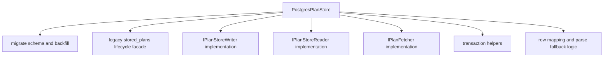
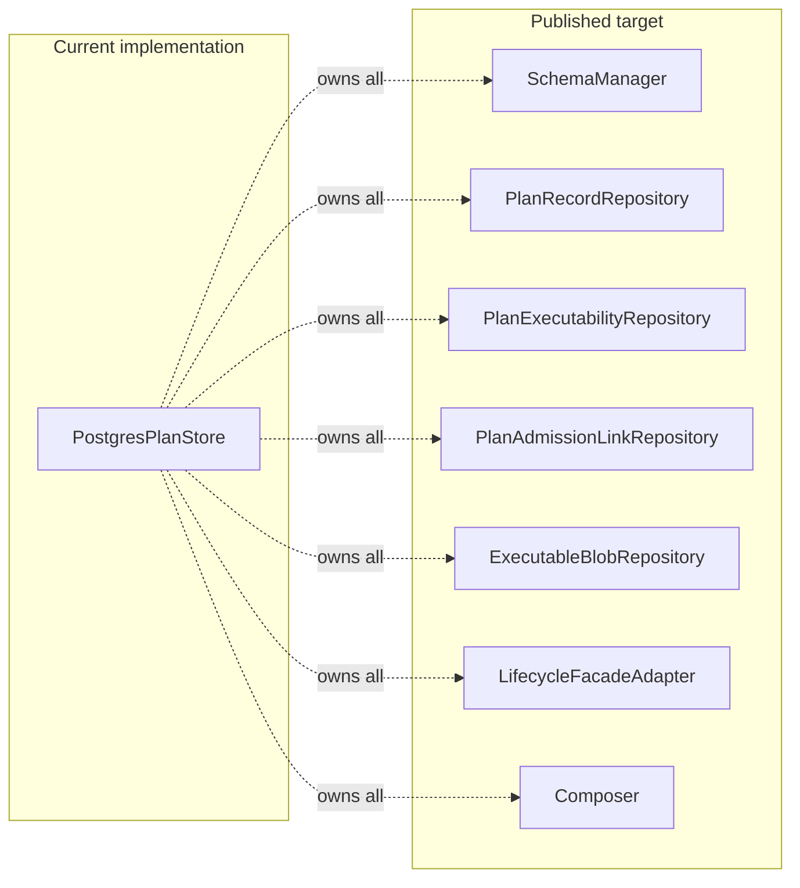

# S08 PostgresPlanStore Hard QA Review

## Summary

This review covers the current `S08` Postgres migration slice after the green PR
that introduced the three-part plan-store model into
`packages/@dvt/adapter-postgres/src/PostgresPlanStore.ts`.

Reviewed scope:

- `packages/@dvt/adapter-postgres/src/PostgresPlanStore.ts`
- `packages/@dvt/adapter-postgres/test/PostgresPlanStore.test.ts`
- `packages/@dvt/adapter-postgres/package.json`
- `packages/@dvt/adapter-postgres/tsconfig.json`
- `packages/@dvt/artifacts/src/ports/IPlanStoreReader.ts`
- `packages/@dvt/artifacts/src/ports/IPlanStoreWriter.ts`
- `packages/@dvt/contracts/src/contracts/planner/PlanRecord.v1.ts`
- `packages/@dvt/contracts/src/contracts/planner/PlanExecutabilityRecord.v1.ts`
- `docs/adr/ADR-0043-plan-record-plan-store-and-artifacts-ownership.md`
- `docs/planning/reviews/architecture-and-governance/20260403-postgres-plan-store-srp-remediation-target.md`

The PR is green. That proves merge-gate compatibility, not architectural
closure. The current implementation is useful as a transition step, but it
still contains correctness drift, contract ambiguity, and SRP violations that
should be treated as open work before `S08` is considered structurally closed.

## Governing sources

- `AGENTS.md`
- `docs/guides/ai-work-protocol.md`
- `docs/planning/state/planning-control-tower.md`
- `docs/planning/reviews/review-naming-policy.md`
- `docs/architecture/reference-architecture.md`
- `docs/adr/ADR-0019_Adapter_Equivalence_and_Maintenance_Boundary.md`
- `docs/adr/ADR-0034-bounded-context-boundaries-and-communication-rules.md`
- `docs/adr/ADR-0039-hexagonal-port-hardening-and-solid-remediation.md`
- `docs/adr/ADR-0043-plan-record-plan-store-and-artifacts-ownership.md`
- `docs/planning/proposals/mandatory/runtime-and-contracts/s08-plan-record-plan-store-execution-plan-20260402.md`
- `docs/planning/reviews/architecture-and-governance/20260403-postgres-plan-store-srp-remediation-target.md`

## Think-first analysis

### Problem summary

The new slice correctly introduces the `PlanRecord`,
`PlanExecutabilityRecord`, and `PlanAdmissionLink` tables and wires
`@dvt/artifacts` ports into `adapter-postgres`.

The remaining problem is not "does it compile and pass CI". The real problem is
that the current implementation still overloads one adapter class with:

- schema lifecycle
- compatibility migration
- legacy lifecycle facade
- artifact write/read behavior
- executability write/read behavior
- admission write/read behavior
- lineage and archival behavior

That concentration has already produced at least one real correctness defect in
supersession handling and several places where contract truth can drift without
failing loudly.

### Root cause

The slice optimized for migration speed and PR throughput:

- keep the existing `PostgresPlanStore`
- make it implement the new artifacts-owned ports
- backfill new tables from the legacy `stored_plans` table
- preserve the legacy validation facade in place

That got the repo to a mergeable transitional state. It also preserved the
monolith class shape that the target remediation doc explicitly says must be
decomposed. Once all responsibilities remained in one class, correctness and
architecture drift started to mix.

### Constraints and invariants

- ADR-0043 requires a three-part model with explicit separation between
  canonical plan artifact, adapter-scoped executability, and admission link.
- ADR-0043 keeps `IPlanStoreWriter` and `IPlanStoreReader` under
  `@dvt/artifacts`, not in `@dvt/contracts`.
- ADR-0034 requires boundaries and ownership to be explicit, with peer contexts
  communicating through shared contracts and refs, not convenience collapse.
- ADR-0039 rejects multi-reason-to-change god classes and requires ports plus
  application seams to remain cohesive.
- The target architecture doc for this slice already says one class must not
  own schema manager, repositories, compatibility facade, and composition.

## Current implementation shape

## Findings

### `S08-HQA-01` Blocking - supersession semantics are internally inconsistent

Evidence:

- `PlanRecord` exposes the field `supersedesPlanId`.
- `markSuperseded(planId, supersededByPlanId)` writes
  `supersedes_plan_id = supersededByPlanId` on the row being superseded.
- `getSupersession(planId)` does not read that field from the same row. It
  performs an inverse self-join and looks for some other row whose
  `supersedes_plan_id = current plan`.

Consequence:

- the write path and read path disagree about where the supersession relation
  lives
- `markSuperseded()` can succeed while `getSupersession()` returns `undefined`
- the relation meaning is ambiguous: is the field "this record supersedes X" or
  "this record is superseded by X"

Why this is a real defect:

- lineage and supersession are part of the `PlanRecord` model, not optional UI
  metadata
- a green PR with an internally inconsistent read/write relation is not an
  acceptable closure for `S08`

Relevant files:

- `packages/@dvt/adapter-postgres/src/PostgresPlanStore.ts`
- `packages/@dvt/contracts/src/contracts/planner/PlanRecord.v1.ts`
- `packages/@dvt/artifacts/src/ports/IPlanStoreReader.ts`
- `packages/@dvt/artifacts/src/ports/IPlanStoreWriter.ts`

Code references:

- `PostgresPlanStore.markSuperseded` at line `369`
- `PostgresPlanStore.getSupersession` at line `522`
- `PlanRecord.supersedesPlanId` at line `31`

### `S08-HQA-02` High - `createPlanRecord` is implemented as a partial upsert that can hide immutable-record drift

Evidence:

- `createPlanRecord()` delegates to `upsertPlanRecord()`.
- `upsertPlanRecord()` uses `ON CONFLICT (plan_id) DO UPDATE`.
- On conflict it updates only `state`, `updated_at`, `supersedes_plan_id`, and
  `archived_at`.
- It does not fail if `canonical_plan_json`, `canonical_hash`, `plan_version`,
  `schema_version`, `contract_version`, or `source_ref` differ.

Consequence:

- a second write for the same `planId` can silently preserve stale canonical
  artifact fields
- callers get no explicit conflict signal for immutable artifact drift
- the method name says `create`, but the behavior is actually
  `create-or-partially-mutate`

Why this is a real deviation:

- ADR-0043 treats `PlanRecord` as the canonical persisted artifact plus
  lifecycle posture
- canonical artifact identity should fail loudly on conflict, not be quietly
  tolerated

Relevant files:

- `packages/@dvt/adapter-postgres/src/PostgresPlanStore.ts`
- `docs/adr/ADR-0043-plan-record-plan-store-and-artifacts-ownership.md`

Code references:

- `PostgresPlanStore.createPlanRecord` at line `337`
- `PostgresPlanStore.upsertPlanRecord` at line `697`

### `S08-HQA-03` High - `getPlanRecordByRef` reduces `PlanRef` integrity to `planId` only

Evidence:

- `getPlanRecordByRef(planRef)` parses the `PlanRef`.
- After parsing, it calls `getPlanRecord(validated.planId)` and ignores
  `uri`, `sha256`, `schemaVersion`, `planVersion`, and `sizeBytes`.

Consequence:

- a mismatched or stale `PlanRef` can still return a `PlanRecord`
- the read path does not enforce that the ref still matches the stored
  canonical artifact identity
- the adapter weakens the value of a stable ref into an ID-only lookup

Why this matters:

- refs are supposed to carry integrity metadata, not only a lookup key
- this turns a governed boundary object into a convenience DTO

Relevant files:

- `packages/@dvt/adapter-postgres/src/PostgresPlanStore.ts`
- `docs/adr/ADR-0034-bounded-context-boundaries-and-communication-rules.md`

Code references:

- `PostgresPlanStore.getPlanRecordByRef` at line `457`

### `S08-HQA-04` High - row mapping fabricates executability data instead of surfacing corruption

Evidence:

- `toPlanExecutabilityRecord()` invents `validatedAtIso` with
  `new Date(0).toISOString()` when a `VALID` or `INVALID` row lacks it.
- the same mapper invents a fallback `rejectionReport` object when an
  `INVALID` row lacks `rejection_report_json`.

Consequence:

- persistence corruption is converted into synthetic contract-shaped data
- downstream readers cannot distinguish "real invalid rejection" from
  "adapter fabricated a fallback"
- data-quality drift becomes harder to detect and harder to repair

Why this is a real defect:

- runtime contract parsing is supposed to harden the boundary, not mask a broken
  row
- the adapter should fail fast on impossible persisted states

Relevant files:

- `packages/@dvt/adapter-postgres/src/PostgresPlanStore.ts`
- `packages/@dvt/contracts/src/contracts/planner/PlanExecutabilityRecord.v1.ts`

Code references:

- `toPlanExecutabilityRecord` at line `854`

### `S08-HQA-05` High - supersession referential integrity is not enforced

Evidence:

- `plan_executability_records.plan_id` and `plan_admission_links.plan_id` have
  foreign keys to `plan_records`.
- `plan_records.derived_from_plan_id` and `plan_records.supersedes_plan_id` are
  plain `TEXT` columns with no foreign key.
- `markSuperseded()` accepts `supersededByPlanId` without checking that the
  target record exists.

Consequence:

- the adapter can persist dangling lineage links
- `getSupersession()` can return IDs that do not resolve to a real record
- archival and lineage queries lose structural trust

Why this matters:

- `PlanRecord` lineage is part of the operational model, not comment-only data
- if the relation is important enough to have API methods, it is important
  enough to protect at the persistence boundary

Relevant files:

- `packages/@dvt/adapter-postgres/src/PostgresPlanStore.ts`

Code references:

- table DDL in `migrate` section (no FK for `derived_from_plan_id`/`supersedes_plan_id`)
- `PostgresPlanStore.markSuperseded` at line `369`

### `S08-HQA-06` Medium - the compatibility seam is still hidden inside production logic as a magic adapter id

Evidence:

- the class hardcodes `const LEGACY_EXECUTABILITY_ADAPTER_ID = '__legacy_validation__'`
- `migrate()`, `markValid()`, and `markInvalid()` all write compatibility data
  with that magic value
- the compatibility policy is not isolated behind a dedicated facade adapter

Consequence:

- the production adapter owns both the target model and the legacy bridge
- removal of the legacy seam later will require surgery in the same class that
  owns the new tables
- the transitional rule is easy to spread because it looks like normal
  production behavior

Why this is architectural drift:

- the target remediation doc already says lifecycle compatibility must be an
  explicit facade adapter
- keeping it hidden in the monolith class makes the transition harder to retire

Relevant files:

- `packages/@dvt/adapter-postgres/src/PostgresPlanStore.ts`
- `docs/planning/reviews/architecture-and-governance/20260403-postgres-plan-store-srp-remediation-target.md`

Code references:

- `LEGACY_EXECUTABILITY_ADAPTER_ID` at line `57`

### `S08-HQA-07` Medium - `PostgresPlanStore` is still a god class against the repo's own target architecture

Evidence:

The current class simultaneously owns:

- schema creation and backfill
- `stored_plans` lifecycle compatibility
- `PlanRecord` writes and reads
- `PlanExecutabilityRecord` writes and reads
- `PlanAdmissionLink` writes and reads
- executable blob fetch
- transition orchestration
- connection and transaction plumbing
- row mapping

Consequence:

- almost every `S08` change still lands in one file
- defects in one seam are harder to isolate and unit-test
- the implementation contradicts the already-published remediation target

Why this is a real deviation:

- ADR-0039 is explicit about single responsibility and port hardening
- the current code still centralizes too many independent reasons to change

Relevant files:

- `packages/@dvt/adapter-postgres/src/PostgresPlanStore.ts`
- `docs/planning/reviews/architecture-and-governance/20260403-postgres-plan-store-srp-remediation-target.md`

Code references:

- `PostgresPlanStore` declaration at line `60`

### `S08-HQA-08` Medium - the new invariants are not protected by focused negative-path tests

Evidence:

The integration suite added one broad happy-path test for the three-part model,
but it still lacks explicit coverage for:

- `markSuperseded()` plus `getSupersession()` coherence
- dangling supersession target rejection
- `archivePlan()` transition semantics
- invalid executability rows failing fast instead of inventing defaults
- `getPlanRecordByRef()` rejecting mismatched refs
- `createPlanRecord()` conflict behavior on immutable canonical fields

Consequence:

- the current supersession defect passed CI
- several architectural invariants now depend on reviewer inspection instead of
  executable proof

Relevant files:

- `packages/@dvt/adapter-postgres/test/PostgresPlanStore.test.ts`

Code references:

- `three-part model` test at line `241`

### `S08-HQA-09` Medium - merge-gate green has hidden the fact that default package tests skip the exact integration seam being changed

Evidence:

- `pnpm --filter @dvt/adapter-postgres test` passes locally.
- `test/PostgresPlanStore.test.ts` is guarded by `DVT_PG_INTEGRATION === '1'`.
- without that env var, the new store model tests are skipped and only CI smoke
  or a PG-enabled run exercises the seam.

Consequence:

- local "package tests green" is weaker than it looks for this slice
- the highest-risk behavior depends on integration-only coverage

Why this matters:

- this is acceptable as an intermediate state, but not as closure evidence for
  architectural correctness
- the new repositories or facades need smaller seams with always-on tests

Relevant files:

- `packages/@dvt/adapter-postgres/test/PostgresPlanStore.test.ts`
- `docs/guides/ai-work-protocol.md`

Code references:

- integration gating by `DVT_PG_INTEGRATION` at lines `10` to `11`

## Current architecture versus target

## Recommended remediation order

### `S08-QA-FIX-1` Lock supersession semantics first

Pick one canonical meaning and apply it everywhere:

- either the new record stores `supersedesPlanId`
- or the old record stores `supersededByPlanId`

Do not keep the current mixed model.

### `S08-QA-FIX-2` Replace partial upsert with explicit create-or-conflict behavior

- `createPlanRecord()` should either create the immutable canonical artifact or
  fail on drift
- lifecycle mutations should move to dedicated mutation methods

### `S08-QA-FIX-3` Stop fabricating contract data on read

- remove epoch fallback for `validatedAtIso`
- remove synthetic rejection report fallback
- throw explicit row-integrity errors instead

### `S08-QA-FIX-4` Add referential integrity or explicit existence checks for lineage

- add a foreign key when the schema shape allows it
- or enforce existence in code before writing the relation

### `S08-QA-FIX-5` Extract the compatibility seam

- move `__legacy_validation__` handling into a dedicated transitional adapter
- keep the main repositories free of legacy lifecycle policy

### `S08-QA-FIX-6` Split tests by responsibility

Add focused tests for:

- supersession
- archival
- create-conflict negative paths
- invalid row decoding
- ref-integrity reads

## Validation evidence

Executed during this review:

- `pnpm --filter @dvt/adapter-postgres test`
- prior PR validation remained green for the adapter slice, including the
  adapter-postgres smoke and integration jobs

Required after any fix slice that follows from this review:

- `pnpm --filter @dvt/adapter-postgres test`
- PG-enabled `PostgresPlanStore` integration coverage for the touched behavior
- `pnpm verify:prepush`

## Final posture

This slice is **merge-green but not architecture-closed**.

The new three-part model is present and usable, but the current adapter is
still a transitional monolith with one blocking correctness defect
(`S08-HQA-01`) and several high-severity integrity drifts. `S08` should remain
`in_progress` until the supersession semantics, immutable create semantics,
row-integrity behavior, and SRP decomposition are corrected.
