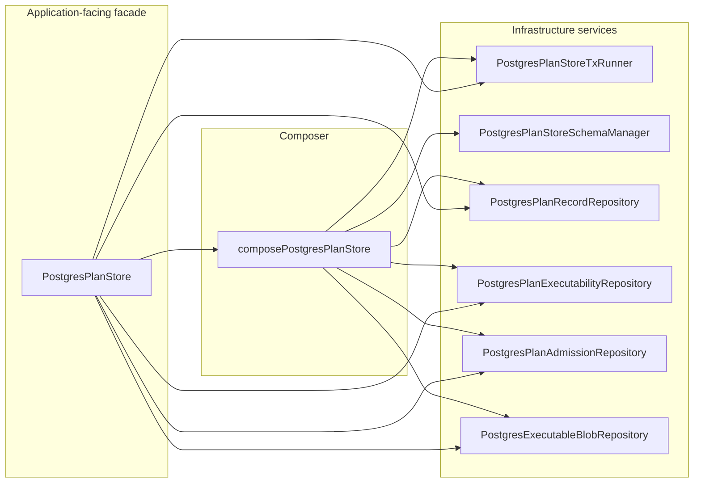

# S08 PostgresPlanStore Hard QA Review

## Summary

This review is the authoritative hard-QA closeout for `S08` in
`@dvt/adapter-postgres`.

Result: the S08 hard-QA findings are closed for the scoped architecture:

- three-part model is enforced (`PlanRecord`, `PlanExecutabilityRecord`,
  `PlanAdmissionLink`)
- lineage integrity is DB-enforced (`derived_from_plan_id`,
  `supersedes_plan_id` FK-constrained)
- repository split is complete for plan-record/executability/admission
- composer extraction is complete through `composePostgresPlanStore`
- critical invariants have always-on unit coverage (no PG requirement)

## Governing sources

- `AGENTS.md`
- `docs/guides/ai-work-protocol.md`
- `docs/adr/ADR-0034-bounded-context-boundaries-and-communication-rules.md`
- `docs/adr/ADR-0039-hexagonal-port-hardening-and-solid-remediation.md`
- `docs/adr/ADR-0043-plan-record-plan-store-and-artifacts-ownership.md`
- `docs/planning/reviews/architecture-and-governance/20260403-postgres-plan-store-srp-remediation-target.md`

## Reviewed scope

- `packages/@dvt/adapter-postgres/src/PostgresPlanStore.ts`
- `packages/@dvt/adapter-postgres/src/PostgresPlanStoreComposer.ts`
- `packages/@dvt/adapter-postgres/src/PostgresPlanStore.schema-manager.ts`
- `packages/@dvt/adapter-postgres/src/PostgresPlanStore.plan-record-repository.ts`
- `packages/@dvt/adapter-postgres/src/PostgresPlanStore.executability-repository.ts`
- `packages/@dvt/adapter-postgres/src/PostgresPlanStore.admission-repository.ts`
- `packages/@dvt/adapter-postgres/src/PostgresPlanStore.executable-blob-repository.ts`
- `packages/@dvt/adapter-postgres/src/PostgresPlanStore.mappers.ts`
- `packages/@dvt/adapter-postgres/test/PostgresPlanStore.invariants.unit.test.ts`
- `packages/@dvt/adapter-postgres/test/PostgresPlanStore.lifecycle.integration.test.ts`
- `packages/@dvt/adapter-postgres/test/PostgresPlanStore.records.integration.test.ts`
- `packages/@dvt/adapter-postgres/test/PostgresPlanStore.sql.test.ts`
- `docs/guides/postgres-plan-store-technical-manual-20260403.md`
- `docs/guides/postgres-plan-store-user-manual-20260403.md`

## Final status matrix

- `S08-HQA-01` Closed: supersession semantics are coherent across write/read.
- `S08-HQA-02` Closed: create path is explicit create-or-conflict.
- `S08-HQA-03` Closed: `getPlanRecordByRef` enforces ref metadata integrity.
- `S08-HQA-04` Closed: executability mapping fails fast on invalid persisted rows.
- `S08-HQA-05` Closed: lineage columns are FK-constrained.
- `S08-HQA-06` Closed for S08 scope: lifecycle persistence delegated to dedicated blob repository.
- `S08-HQA-07` Closed for S08 scope: schema/tx/repository composition extracted from facade.
- `S08-HQA-08` Closed: no-happy-path coverage exists for lifecycle and data-integrity checks.
- `S08-HQA-09` Closed: always-on invariants now cover critical non-integration paths.

## Current architecture snapshot



## Validation evidence baseline for this review

```bash
pnpm --filter @dvt/adapter-postgres test -- PostgresPlanStore.invariants.unit.test.ts
pnpm --filter @dvt/adapter-postgres test
pnpm --filter @dvt/adapter-postgres build
pnpm verify:prepush
```

Optional conformance path:

```bash
$env:DVT_PG_INTEGRATION='1'
pnpm --filter @dvt/adapter-postgres test
```

## Residual notes

- No open S08 architectural gaps remain in this review scope.
- `DVT_PG_INTEGRATION=1` remains optional for real-DB conformance, not a blocker
  for core invariant coverage.
