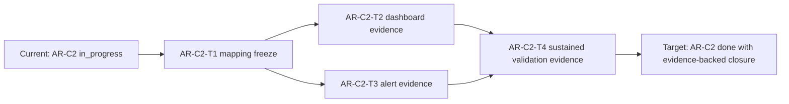

# AR-C2 Fowler hard QA review

## Findings

### High

- Severity: `High`
  Short title: AR-C2 closure is still operationally incomplete
  Why it matters: SLA documentation and emitted telemetry are not sufficient for
  production readiness unless dashboard/alert enforcement is evidenced.
  Exact evidence: `docs/planning/state/agent-lane-c.yaml` (`AR-C2` remains
  `in_progress` with pending dashboard/alert wiring and sustained validation).
  Real risk: incident detection latency and false confidence in SLA posture.
  Concrete recommendation: complete `AR-C2-T2..T4` with governed evidence
  artifacts before moving `AR-C2` to `done`; use
  `docs/runbooks/ar-c2-dashboard-alert-wiring-evidence-20260404.md` as the
  canonical capture baseline.

### Medium

- Severity: `Medium`
  Short title: Signal-to-threshold traceability was split across surfaces
  Why it matters: fragmented mapping increases drift risk across manuals,
  runbook, dashboards, and alert rules.
  Exact evidence:
  - previous split: SLA runbook + manuals + proposal
  - fix applied: `docs/runbooks/ar-c2-sla-signal-threshold-mapping-20260404.md`
    Real risk: stale or mismatched alert rules not detected during reviews.
    Concrete recommendation: keep the new mapping file as the sole canonical
    source and require `AR-C2-T2/T3` evidence to reference it directly.

- Severity: `Medium`
  Short title: QA artifact gate produced sandbox skip until execution-path hardening
  Why it matters: a skipped QA gate can create false confidence that artifact
  structure checks were enforced on this iteration.
  Exact evidence:
  - initial output: `pnpm qa:artifact:check` -> `No changed files detected. Skipping.`
  - root cause confirmation: Node git subprocess in sandbox returned `EPERM`.
  - fix applied: `scripts/qa-artifact-check.cjs` now resolves `git` explicitly and
    retries deterministic diff baselines.
  - verification result: escalated `pnpm qa:artifact:check` -> `[qa:artifact:check] OK`.
    Real risk: if sandbox limits are ignored, local QA readiness can be overstated.
    Concrete recommendation: keep the hardened script and treat escalated QA run
    as the authoritative result in this agent environment.

- Severity: `Medium`
  Short title: AR-C2 INV-5 requires non-skipped QA artifact validation
  Why it matters: AR-C2 evidence changes must prove that the QA artifact gate
  inspected a governed artifact, not merely that no candidate artifact changed.
  Exact evidence:
  - `AR-C2-INV-4` initially closed with `pnpm qa:artifact:check` reporting
    `No changed QA artifact docs detected in governed paths. Skipping.`
  - `AR-C2-INV-5` changes this QA artifact directly so the gate must validate
    `qa_artifact: true` content and return `[qa:artifact:check] OK`.
    Real risk: without a non-skip run, AR-C2 closure evidence could overstate
    review coverage.
    Concrete recommendation: keep this QA artifact in the changed set whenever
    AR-C2 evidence-gate posture changes require QA structural proof.

### Low

- Severity: `Low`
  Short title: AR-C2 execution tracking was previously coarse at parent level
  Why it matters: without child-task granularity, closure progress is hard to
  audit and easier to overstate.
  Exact evidence: prior to current update, lane tracking did not enumerate
  `AR-C2-T1..T4`; now present in `agent-lane-c.yaml`.
  Real risk: governance drift between claimed and verifiable completion.
  Concrete recommendation: keep AR-C2 child tasks as the only closure gates and
  block parent completion unless all child DoDs are evidenced.

## Task Alignment

- Declared task vs actual changes: this QA pass targets AR-C2 closure planning
  only; no runtime behavior changes were reviewed as part of this slice.
- Doc vs code: docs claim emitted metrics exist; lane references code paths for
  API and outbox-worker telemetry, consistent with AR-C2 status reason.
- Promise vs implementation: planning promise now includes explicit closure
  steps; implementation evidence for dashboard/alert enforcement is pending.
- Tests vs claims: no new runtime tests are part of this QA artifact; closure
  confidence depends on operational evidence tasks, not additional unit tests.
- Current truth vs planned truth: current state is `in_progress`; target state
  is evidence-backed `done` after `AR-C2-T2..T4` (with `AR-C2-T1` completed).
- Documentation update status: AR-C2 proposal and lane decomposition are present
  and aligned.
- Evidence and risk-doc status when applicable: evidence doc for final AR-C2
  closure is still required in `AR-C2-T4`; risk update depends on validation
  outcomes. `AR-C2-INV-5` records a non-skipped QA artifact gate result for the
  current AR-C2 evidence-gate posture.

## Architecture Assessment

- SRP: runtime SRP unchanged in this slice; QA artifact improves operational
  ownership clarity.
- DDD: bounded context ownership remains aligned (planner/API/outbox telemetry
  remains in owning components).
- Hexagonal: no boundary violation detected in this planning-only review.
- CQRS if relevant: read/write separation posture unchanged.
- Complexity: planning complexity reduced by explicit child-task decomposition.
- Modularity: governance modularity improved (proposal + lane + review aligned).

## Test Assessment

- Negative paths present: N/A for runtime code in this QA artifact.
- Negative paths missing: N/A for runtime code in this QA artifact.
- Regression status: no runtime code changed in this review artifact.
- Determinism: unchanged.
- Local suite vs meaningful confidence for this task: confidence for AR-C2
  closure depends on operational validation windows and alert firing checks.
- Global system view applied: yes; planner compile, start-run, freshness, and
  outbox metrics considered as one SLA chain.
- Harness or shared fixtures needed: not applicable for planning-only pass.
- Test grouping by type: not applicable for planning-only pass.

## Quality Gates

- Commands executed:
  - `pnpm qa:artifact:check`
  - `pnpm docs:workboard:generate`
  - `pnpm docs:sync`
  - `pnpm verify:prepush`
- What passed:
  - all commands above passed in the original slice.
  - 2026-05-13 `pnpm qa:artifact:check` passed in non-skip mode for this
    changed QA artifact.
- What failed:
  - none.
- What could not be verified:
  - runtime dashboard/alert behavior itself (requires AR-C2 execution evidence).
  - original 2026-04-04 QA artifact structure compliance for that worktree
    iteration because the gate executed in skip mode (`No changed files
detected`); this is now superseded by `AR-C2-INV-5` non-skip validation for
    the current artifact change.

## Opportunities

- Define one canonical metric mapping table reusable by docs, dashboards, and
  alert rules. Status: completed in this iteration.
- Add a reusable AR-C2 operational evidence template under
  `docs/runbooks/` for dashboard/alert wiring proof. Status: completed in this
  iteration (`ar-c2-dashboard-alert-wiring-evidence-20260404.md`).
- Keep AR-C2 closeout checklist in one artifact and link from lane + review.
  Status: completed in this iteration
  (`docs/planning/closeouts/20260404-ar-c2-sla-operational-closure-closeout.md`).

## Action Artifact

### Markdown Artifact Path Suggestion

- `docs/planning/closeouts/20260404-ar-c2-sla-operational-closure-closeout.md`

### Task Checklist

- [x] `AR-C2-T1` Freeze canonical signal-to-threshold mapping
- [x] `AR-C2-QA-1` Re-run QA artifact gate with tracked AR-C2 artifact diffs
- [x] `AR-C2-INV-5` Record non-skipped QA artifact gate for current AR-C2
      evidence artifacts
- [ ] `AR-C2-T2` Record dashboard coverage evidence per signal
- [ ] `AR-C2-T3` Record alert-rule coverage evidence per threshold
- [ ] `AR-C2-T4` Record sustained validation evidence and close AR-C2

#### `AR-C2-QA-1` Re-run QA artifact gate with tracked AR-C2 artifact diffs

- Objective: obtain real (non-skip) structural validation for QA artifacts.
- Scope: AR-C2 proposal/review/closeout/runbook artifact set.
- In current task scope: yes.
- Dependencies: AR-C2 artifact files tracked in git.
- Documentation impact: none if gate passes; corrective edits if it fails.
- Evidence / risk-doc impact: raises confidence in artifact governance.
- Comment with rationale: a skip-mode gate is observability, not enforcement.
- Definition of Done: `pnpm qa:artifact:check` runs without skip and reports
  success (or actionable failures are fixed and re-run passes).
- Iteration status: completed after execution-path hardening and escalated run
  in this environment (`[qa:artifact:check] OK`).

#### `AR-C2-INV-5` Record non-skipped QA artifact gate for current evidence artifacts

- Objective: prove the QA artifact gate validates a changed AR-C2 QA artifact
  instead of skipping because no governed artifact changed.
- Scope: this QA artifact and `AR-C2-INV-5` closeout evidence.
- In current task scope: yes.
- Dependencies: `AR-C2-INV-4`.
- Documentation impact: this review records the non-skip QA gate posture for
  the current AR-C2 evidence-gate update.
- Evidence / risk-doc impact: direct closeout evidence; no ARC evidence or risk
  entry is required because no ARC-triggering paths are touched.
- Comment with rationale: a skip-mode QA artifact gate is not proof that the
  changed AR-C2 evidence posture was structurally validated.
- Definition of Done: `pnpm qa:artifact:check` reports `[qa:artifact:check] OK`
  while this `qa_artifact: true` review is in the changed-file set.
- Iteration status: completed in `AR-C2-INV-5`.

### Task Details

#### `AR-C2-T1` Freeze canonical signal-to-threshold mapping

- Objective: establish one canonical operational mapping baseline.
- Scope: AR-C2 signals only (plan compile, run start, freshness, outbox).
- In current task scope: yes.
- Dependencies: none.
- Documentation impact: proposal/runbook/manual alignment.
- Evidence / risk-doc impact: prerequisite for all closure evidence.
- Comment with rationale: prevents metric-name drift across environments.
- Definition of Done: one governed mapping table exists and all AR-C2 signals
  are represented with owner and threshold.
- Iteration status: completed via
  `docs/runbooks/ar-c2-sla-signal-threshold-mapping-20260404.md`.

#### `AR-C2-T2` Record dashboard coverage evidence per signal

- Objective: prove operational visibility across all mapped signals.
- Scope: dashboard panels and panel owners for AR-C2 metrics.
- In current task scope: yes.
- Dependencies: `AR-C2-T1`.
- Documentation impact: attach panel evidence references in closeout/evidence.
- Evidence / risk-doc impact: direct evidence contribution.
- Comment with rationale: without panel evidence, alert posture is unverifiable.
- Definition of Done: each mapped signal has a dashboard panel evidence entry.

#### `AR-C2-T3` Record alert-rule coverage evidence per threshold

- Objective: prove enforceable SLA thresholds with routed alerts.
- Scope: alert rules, severity mapping, and routing metadata.
- In current task scope: yes.
- Dependencies: `AR-C2-T1`.
- Documentation impact: alert policy references added to closure surfaces.
- Evidence / risk-doc impact: direct evidence contribution.
- Comment with rationale: alertability is the practical SLA enforcement layer.
- Definition of Done: each mapped threshold has an active, evidenced alert rule.

#### `AR-C2-T4` Record sustained validation evidence and close AR-C2

- Objective: prove sustained SLA posture and finalize lane closure.
- Scope: validation window evidence + lane/update closeout artifacts.
- In current task scope: yes.
- Dependencies: `AR-C2-T2`, `AR-C2-T3`.
- Documentation impact: add closeout artifact and update lane status.
- Evidence / risk-doc impact: direct; risk update required if threshold failures
  are found.
- Comment with rationale: AR-C2 must close on observed operations, not intent.
- Definition of Done: evidence artifact exists with sustained windows, lane can
  move AR-C2 to `done`, and unresolved risks are explicitly tracked.

## Mermaid Diagram

## Final Verdict

Not ready
