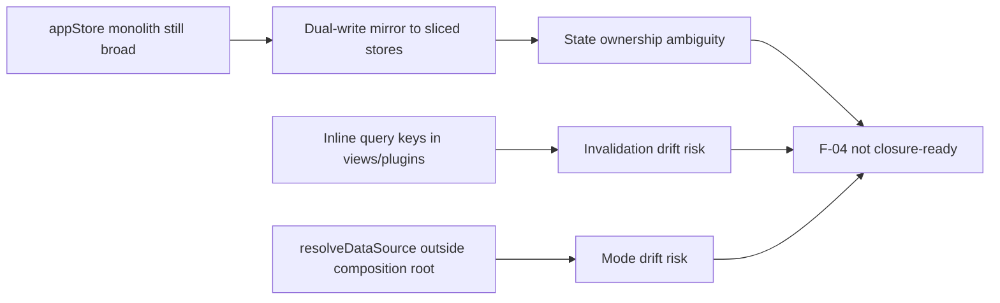

# F-04 Frontend Data Boundary Hard QA Review

## Summary

This review evaluates the active `F-04` implementation against its own target model (hexagonal data boundary, composition-root ownership, store decomposition, query-key governance).

Canonical execution tracking remains in:

- `docs/planning/state/agent-lane-e.yaml`
- `docs/planning/proposals/mandatory/frontend-and-ux/f04-frontend-data-boundary-hexagonal-convergence-plan-20260403.md`

## Governing Sources

- `docs/planning/status/governance-document-rule-inventory.md`
- `AGENTS.md`
- `docs/guides/ai-work-protocol.md`
- `docs/planning/state/planning-control-tower.md`
- `docs/planning/proposals/mandatory/frontend-and-ux/f04-frontend-data-boundary-hexagonal-convergence-plan-20260403.md`
- `docs/planning/templates/qa/TEMPLATE_QA_ARTIFACT_EXAMPLE.md`

## Findings

### Blocker

- Title: Monolithic `appStore` remains the dominant runtime boundary, so `F04-W2/W3` is not closure-ready.
  Why it matters: The slice claims decomposition, but read/write ownership still routes through one large deprecated store, preserving coupling and hidden state-sync risks.
  Evidence:
  - [appStore.ts](../../../../apps/web/src/app/stores/appStore.ts:34) still defines the full aggregate state.
  - [appStore.ts](../../../../apps/web/src/app/stores/appStore.ts:168) still mirrors writes into both legacy and sliced stores.
  - [useAppStore usage scan](../../../../apps/web/src/app/views/canvas/useCanvasStoreFacade.ts:49) shows broad consumer dependency on the monolith.
    Risk: Behavior drift between slices and legacy mirror state; future refactors can break invariants silently.
    Recommendation: Make sliced stores authoritative and reduce `useAppStore` to a temporary thin adapter with explicit decommission plan.

### High

- Title: Query key registry governance is incomplete.
  Why it matters: `F04-W4` requires centralized query keys; inline arrays keep cache invalidation policy fragmented.
  Evidence:
  - [LineageView.tsx](../../../../apps/web/src/app/views/LineageView.tsx:139) uses inline `queryKey`.
  - [DbtNodeRenderer.tsx](../../../../apps/web/src/app/plugins/dbt/DbtNodeRenderer.tsx:355) and [DbtNodeRenderer.tsx](../../../../apps/web/src/app/plugins/dbt/DbtNodeRenderer.tsx:362) use inline `queryKey`.
    Risk: Invalidation and stale-data bugs when route-level keys diverge.
    Recommendation: Migrate all query keys to `queryKeys.ts` and enforce with a lint/architecture guard.

- Title: Mode resolution is not fully owned by composition root.
  Why it matters: `F04-W1` requires single ownership; runtime mode is still resolved in non-composition modules.
  Evidence:
  - [sessionStore.ts](../../../../apps/web/src/app/stores/sessionStore.ts:24) calls `resolveDataSource()`.
  - [workspaceConfig.ts](../../../../apps/web/src/app/services/config/workspaceConfig.ts:109) calls `resolveDataSource()`.
  - [httpPlatformHealthClient.ts](../../../../apps/web/src/capabilities/platform-health/infrastructure/httpPlatformHealthClient.ts:255) calls `resolveDataSource()`.
    Risk: API/mock mode drift between subsystems and inconsistent observability metadata.
    Recommendation: Pass mode from composition root into these collaborators instead of resolving locally.

### Medium

- Title: Encoding/mojibake regression in source comments.
  Why it matters: Reduces maintainability and is a quality-gate smell for docs/code hygiene.
  Evidence:
  - [plansService.ts](../../../../apps/web/src/app/services/plans/plansService.ts:11) contains malformed characters (`�`).
    Risk: Review noise and copy/paste defects in docs/comments.
    Recommendation: Replace malformed comment text and enforce UTF-8 clean comments.

- Title: `any` remains in `appStore` API surface.
  Why it matters: Violates strict typing expectations in Lane E constraints and weakens SRP-safe refactors.
  Evidence:
  - [appStore.ts](../../../../apps/web/src/app/stores/appStore.ts:66) `data?: any`.
  - [appStore.ts](../../../../apps/web/src/app/stores/appStore.ts:107) `data?: any`.
    Risk: Hidden type regressions and non-deterministic UI payload shape usage.
    Recommendation: Replace `any` with a typed tab payload union or `unknown` plus narrowing.

### Low

- Title: Backward-compatibility aliasing remains broad in service modules.
  Why it matters: Useful short-term, but it can prolong coexistence of old/new boundaries.
  Evidence:
  - [runsService.ts](../../../../apps/web/src/app/services/runs/runsService.ts:19) deprecated alias.
  - [workspaceService.ts](../../../../apps/web/src/app/services/workspace/workspaceService.ts:22) deprecated alias.
    Risk: Migration stalls with dual contracts.
    Recommendation: Add a dated removal checkpoint tied to `F04-W6`.

## Alignment

- Doc vs code: Partial alignment. `F04-W0/W1` progressed, `W2/W3/W4` still partially implemented.
- Promise vs implementation: Composition root hardening improved, but monolithic store and inline query keys keep drift.
- Tests vs claims: Web tests are green, but no explicit fitness guard yet for query-key or store-boundary rules.
- Current truth vs planned truth: Current code is transitional, not final target architecture.
- Documentation update status: Plan is documented; QA hard findings were not yet persisted before this artifact.
- Evidence and risk-doc status when applicable: No new ARC-triggering paths in this QA artifact; no evidence/risk update required for docs-only review.

## Architecture Assessment

- SRP: Improved in service factories and `RunsView`, still weak in `appStore`.
- DDD: Port interfaces introduced and used in context wiring; anti-corruption layer not complete.
- Hexagonal: Partial. Composition root pattern is present, but mode resolution and query ownership still leak outside boundary.
- CQRS: Query extraction (`useRunWorkspace`) is positive, but global query-key governance incomplete.
- Complexity: Reduced in `RunsView`; still high in store layer.
- Modularity: Transitional modularity, not yet stable.

## Test Assessment

- Negative paths present: Existing web suite has negative tests for canvas and health.
- Negative paths missing: No explicit tests asserting “no inline query keys” or “single mode resolution owner”.
- Regression status: No runtime regression observed in executed suite.
- Determinism: Stable in current test run; store dual-write pattern still a latent determinism risk.
- Local suite vs meaningful global confidence: Good local confidence for touched web runtime; architectural invariant confidence is still weak.
- Global system view applied: Yes, boundaries checked across stores, services, views, and capability layer.
- Harness or shared fixture need: Yes, architecture fitness harness needed for import and query-key invariants.
- Test grouping by type and rationale:
  - `unit`: service and selector behavior.
  - `integration`: route/hooks wiring and presenter behavior.
  - `architecture`: import and boundary fitness (missing, required).

## Quality Gates

- Commands executed:
  - `pnpm --filter @dvt/web build`
  - `pnpm --filter @dvt/web test`
  - `pnpm --filter @dvt/web typecheck`
  - `pnpm verify:prepush`
- What passed: all commands above.
- What failed: none.
- What could not be verified: CI-only PR gates were not executed from this local QA pass.

## Unblock Roadmap

### Wave 0 - Boundary truth closure

Tasks: `F04-QA-01`, `F04-QA-02`

Target:

- authoritative store boundary is explicit;
- mode resolution ownership is singular;
- no transitional ambiguity in comments and typing.

### Wave 1 - Query and architecture hardening

Tasks: `F04-QA-03`, `F04-QA-04`

Target:

- query keys are centralized;
- architecture fitness checks enforce boundaries continuously.

### Wave 2 - Closure and deprecation retirement

Tasks: `F04-QA-05`, `F04-QA-06`

Target:

- compatibility aliases are reduced with explicit sunset;
- docs/closeout evidence matches shipped behavior.

## Action Artifact

### Markdown Artifact Path Suggestion

- `docs/planning/closeouts/20260404-f04-qa-hardening-closeout.md`

### Task Checklist

- [ ] `F04-QA-01` Make sliced stores authoritative and shrink `appStore` adapter surface
- [ ] `F04-QA-02` Remove non-composition `resolveDataSource()` calls
- [ ] `F04-QA-03` Migrate all inline query keys to `queryKeys.ts`
- [ ] `F04-QA-04` Add architecture fitness tests (imports + query-key policy)
- [ ] `F04-QA-05` Remove malformed comment encoding and `any` from `appStore`
- [ ] `F04-QA-06` Publish closeout evidence and deprecation retirement map

### Task Details

#### `F04-QA-01` Make sliced stores authoritative and shrink `appStore` adapter surface

- Objective: Eliminate dual-write state ownership.
- Scope: store boundaries and consumer migration from `useAppStore`.
- In current task scope: Yes.
- Dependencies: None.
- Documentation impact: update F-04 plan progress and architecture map.
- Evidence / risk-doc impact: none unless ARC paths are touched in same slice.
- Comment with rationale: Transitional mirror state is the largest residual architecture risk.
- Definition of Done:
  - `useAppStore` no longer owns canonical runtime state.
  - Consumers are migrated to sliced stores/facades.
  - no dual-write mirror logic remains.

#### `F04-QA-02` Remove non-composition `resolveDataSource()` calls

- Objective: Enforce composition-root single ownership of mode resolution.
- Scope: session store, workspace config, and platform-health client mode input.
- In current task scope: Yes.
- Dependencies: `F04-QA-01`.
- Documentation impact: update mode-resolution ownership notes.
- Evidence / risk-doc impact: none for web-only path.
- Comment with rationale: Multiple mode resolvers reintroduce mock/api drift.
- Definition of Done:
  - only composition root resolves data source mode.
  - collaborators receive mode as explicit dependency.

#### `F04-QA-03` Migrate all inline query keys to `queryKeys.ts`

- Objective: Centralize cache-key governance.
- Scope: `LineageView`, `DbtNodeRenderer`, and any remaining route/plugin inline keys.
- In current task scope: Yes.
- Dependencies: `F04-QA-01`.
- Documentation impact: query policy section update.
- Evidence / risk-doc impact: none expected.
- Comment with rationale: Inline keys fragment invalidation and increase stale-data risk.
- Definition of Done:
  - no inline query key arrays remain outside registry.
  - all affected tests remain green.

#### `F04-QA-04` Add architecture fitness tests (imports + query-key policy)

- Objective: Prevent regression into non-hexagonal boundaries.
- Scope: architecture tests for import boundaries and query-key governance.
- In current task scope: Yes.
- Dependencies: `F04-QA-02`, `F04-QA-03`.
- Documentation impact: testing/architecture sections updated.
- Evidence / risk-doc impact: include in closeout evidence if used for acceptance.
- Comment with rationale: Without automated guards, drift will recur.
- Definition of Done:
  - architecture fitness test suite exists and runs in CI path.
  - failing cases catch boundary violations.

#### `F04-QA-05` Remove malformed comment encoding and `any` from `appStore`

- Objective: Restore code hygiene and strict typing baseline.
- Scope: service comments and tab payload typing.
- In current task scope: Yes.
- Dependencies: None.
- Documentation impact: none.
- Evidence / risk-doc impact: none.
- Comment with rationale: hygiene issues are small but compound long-term maintenance debt.
- Definition of Done:
  - no mojibake remains in touched files.
  - `any` removed or justified by explicit typed contract.

#### `F04-QA-06` Publish closeout evidence and deprecation retirement map

- Objective: Close `F-04` with governance-compliant proof and migration sunset.
- Scope: closeout doc and deprecation timeline.
- In current task scope: Follow-up.
- Dependencies: `F04-QA-01..F04-QA-05`.
- Documentation impact: closeout + lane update + docs sync.
- Evidence / risk-doc impact: add evidence/risk docs if ARC-triggering paths are touched.
- Comment with rationale: QA closure must be traceable, not only verbal.
- Definition of Done:
  - closeout artifact references commands and results.
  - deprecation retirement has explicit checkpoints.

## Mermaid Diagram

### Current-state risk map

### Unblock sequence

## Validation Baseline For Each Execution Slice

1. `pnpm --filter @dvt/web typecheck`
2. `pnpm --filter @dvt/web test`
3. `pnpm --filter @dvt/web build`
4. `pnpm docs:sync` when docs structure changes
5. `pnpm docs:workboard:generate` when lane/progress changes
6. `pnpm verify:prepush`

## Final Verdict

Not ready
