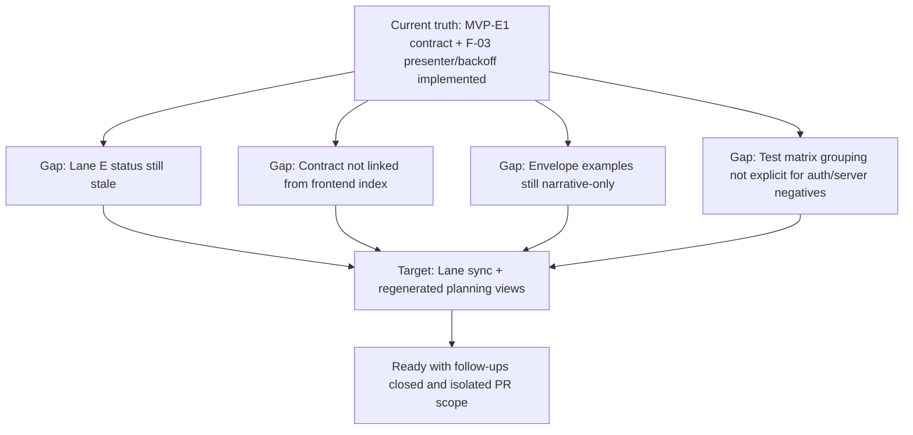

# MVP-E1 F-03 hard QA review 2026-04-04

## Findings

### High

- Title: Lane E task registry is not aligned with implemented slice status.
  Why it matters: planning truth is still reporting `MVP-E1` as queued and `F-03` at 35%, so governance surfaces under-report delivered work.
  Evidence:
  - [agent-lane-e.yaml](../../state/agent-lane-e.yaml) (`MVP-E1` queued, `progress_pct: 0`)
  - [agent-lane-e.yaml](../../state/agent-lane-e.yaml) (`F-03` in progress, `progress_pct: 35`)
  - implemented contract and shell changes exist in:
    [frontend-backend-contract-mvp-e1-20260404.md](../../../architecture/components/web/frontend-backend-contract-mvp-e1-20260404.md),
    [Root.tsx](../../../../apps/web/src/app/Root.tsx),
    [usePlatformHealthSnapshotQuery.ts](../../../../apps/web/src/capabilities/platform-health/presentation/usePlatformHealthSnapshotQuery.ts)
    Risk: execution board and readiness decisions can be made from stale task posture.
    Recommendation: update Lane E task statuses/evidence refs and regenerate planning views.

- Title: MVP-E1 contract artifact is not discoverable from frontend architecture entrypoint.
  Why it matters: contract exists but discoverability fails for engineers entering from canonical frontend index.
  Evidence:
  - [frontend index reading order](../../../architecture/components/web/index.md) does not include the new MVP-E1 artifact.
  - artifact exists at [frontend-backend-contract-mvp-e1-20260404.md](../../../architecture/components/web/frontend-backend-contract-mvp-e1-20260404.md).
    Risk: route/auth assumptions continue from older docs.
    Recommendation: add explicit link from frontend index and route/runtime manuals.

### Medium

- Title: Contract section promises canonical envelope examples but only provides narrative bullets.
  Why it matters: plan asks for canonical success/error envelope examples; current doc is descriptive only.
  Evidence:
  - plan asks for examples in [MVP-E1-D](../../proposals/nice-to-have/frontend-and-ux/mvp-e1-f03-frontend-backend-contract-and-health-plan-20260404.md)
  - current contract section [Canonical success and error envelope baseline](../../../architecture/components/web/frontend-backend-contract-mvp-e1-20260404.md) has no concrete payload samples.
    Risk: frontend error handling can diverge by interpretation.
    Recommendation: add minimal JSON examples for `2xx`, `401/403`, and health degraded/offline mappings.

### Low

- Title: QA worktree includes unrelated active changes outside MVP-E1/F-03 scope.
  Why it matters: QA verdict for this slice can be confused by parallel edits in closeouts/reviews/engine.
  Evidence:
  - `git status --short` shows unrelated files modified/untracked (`agent-lane-b.yaml`, engine review files, closeout files).
    Risk: accidental coupling in commit/PR.
    Recommendation: isolate MVP-E1/F-03 files in a dedicated commit set.

No critical findings.

## Task Alignment

- Declared task vs actual changes: mostly aligned for `MVP-E1-D` and `F-03-A..D` (contract artifact, presenter seam, backoff behavior, negative tests).
- Doc vs code: aligned for shell health semantics (`ok/degraded/offline`) and retry narrative.
- Promise vs implementation: partial; planning/lane synchronization (`MVP-E1-E`) still pending.
- Tests vs claims: strong local coverage for web presenter/query/root paths; API baseline validated.
- Current truth vs planned truth: implementation advanced beyond lane status.
- Documentation update status: contract doc added, runtime modes manual updated; frontend index linking still missing.
- Evidence/risk-doc status: no ARC-triggering paths touched in contracts/engine/adapters for this slice.
- Unrelated worktree observations: present and explicitly out of scope for this verdict.

## Architecture Assessment

- SRP: improved; health projection now centralized in one presenter model.
- DDD/Hexagonal: improved boundary use (`platform-health` capability as shell seam).
- CQRS: not directly affected in this slice.
- Complexity: reduced in `Root` by removing duplicated derivation logic.
- Modularity: better reuse of capability-level health model across shell components.

## Test Assessment

- Negative paths present: offline failures, degraded health, pending-first-check behavior, retry interaction.
- Negative paths missing: explicit 401/403 and 5xx mapping cases at shell UX level are not yet visible in this slice’s tests.
- Regression status: web and api suites passed in this QA run.
- Determinism: no nondeterministic behavior detected in changed tests.
- Global confidence: good for current seam; still benefits from explicit grouped matrix for `unit/integration/contract` for health UX policy.
- Harness/shared fixture need: existing React Query harness is useful and should be retained as canonical seam.

## Quality Gates

- Commands executed:
  - `pnpm --filter @dvt/web test`
  - `pnpm --filter @dvt/web build`
  - `pnpm --filter dvt-api build`
  - `pnpm --filter dvt-api test`
  - `pnpm docs:sync`
  - `pnpm verify:prepush`
- What passed: all commands above passed in this review run.
- What failed: none in final run.
- What could not be verified: none.

## Opportunities

- Add explicit envelope JSON examples to MVP-E1 contract doc.
- Add a small health UX test matrix grouped by type:
  - `unit`: projection and backoff policy
  - `integration`: Root shell behavior
  - `contract`: backend-to-frontend status/error mapping
- Keep lane/status updates atomic with docs/code changes to avoid governance drift.

## Executable Task List

1. `MVP-E1-E-SYNC` Sync Lane E task truth with implementation

- Priority: High
- Steps:
  - update `MVP-E1` and `F-03` status/progress/evidence in `docs/planning/state/agent-lane-e.yaml`
  - run `pnpm docs:workboard:generate`
  - run `pnpm docs:sync`
- Deliverable: Lane E reflects current execution truth and generated planning surfaces are synchronized.
- Definition of Done: lane entries updated, generated views deterministic, no drift in planning outputs.

1. `MVP-E1-D-INDEX` Make MVP-E1 contract discoverable from canonical frontend entrypoints

- Priority: High
- Steps:
  - add link to `docs/architecture/frontend/frontend-backend-contract-mvp-e1-20260404.md` from `docs/architecture/frontend/index.md`
  - add link from the relevant runtime manual section if missing
  - run `pnpm docs:sync`
- Deliverable: Contract is reachable from the frontend architecture reading path.
- Definition of Done: canonical frontend index includes contract artifact and links resolve.

1. `MVP-E1-D-ENVELOPES` Add canonical success/error payload examples

- Priority: Medium
- Steps:
  - extend `docs/architecture/frontend/frontend-backend-contract-mvp-e1-20260404.md` with concrete JSON examples for:
    - protected runtime `2xx`
    - unauthorized/forbidden (`401/403`)
    - health degraded/offline mapping
  - keep examples aligned with current API contract and health semantics
- Deliverable: Executable contract examples instead of narrative-only envelope text.
- Definition of Done: examples are present, coherent, and match implemented route/health behavior.

1. `F03-TEST-MATRIX` Add grouped health UX matrix and missing negative paths

- Priority: Medium
- Steps:
  - keep existing harness (`reactQueryHarness`) as canonical test seam
  - group tests by intent (`unit`, `integration`, `contract`) in `apps/web` health slice
  - add missing negative cases for auth/server-path mappings (`401/403`, `5xx`)
  - run `pnpm --filter @dvt/web test` and `pnpm --filter @dvt/web build`
- Deliverable: Explicit test matrix with behavior-oriented negative coverage.
- Definition of Done: matrix and tests prove degraded/offline/auth/server behavior at the correct layer.

1. `MVP-E1-F03-ISOLATE` Isolate slice from unrelated worktree changes

- Priority: Low
- Steps:
  - stage only MVP-E1/F-03 files and linked governance updates
  - exclude unrelated lane/engine/review edits from this PR
  - run `pnpm verify:prepush` before push
- Deliverable: Scope-clean commit and PR for this slice.
- Definition of Done: PR diff contains only MVP-E1/F-03 task files and required synchronized docs.

## Action Artifact

### Markdown Artifact Path Suggestion

- `docs/planning/closeouts/20260404-mvp-e1-f03-hard-qa-closeout.md`

### Task Checklist

- [x] `MVP-E1-E-SYNC` Synchronize Lane E status and evidence refs
- [x] `MVP-E1-D-INDEX` Link MVP-E1 contract artifact from frontend architecture entrypoints
- [x] `MVP-E1-D-ENVELOPES` Add canonical success/error payload examples
- [x] `F03-TEST-MATRIX` Add grouped health UX test matrix and missing auth/server negative paths
- [x] `MVP-E1-F03-ISOLATE` Isolate this slice from unrelated worktree files before merge

### Task Details

#### `MVP-E1-E-SYNC` Synchronize Lane E status and evidence refs

- Objective: align task registry with implementation truth.
- Scope: `docs/planning/state/agent-lane-e.yaml` and generated planning views.
- In current task scope: Yes.
- Dependencies: none.
- Documentation impact: lane statuses, progress, evidence refs.
- Evidence / risk-doc impact: closeout evidence should point to this QA artifact and contract doc.
- Comment with rationale: planning truth is an execution control surface; stale status is a governance defect.
- Definition of Done: `MVP-E1` and `F-03` entries reflect current posture and regenerated planning views are deterministic.

#### `MVP-E1-D-INDEX` Link MVP-E1 contract artifact from frontend architecture entrypoints

- Objective: make the contract discoverable from canonical docs paths.
- Scope: frontend index and related runtime manual entrypoints.
- In current task scope: Yes.
- Dependencies: `MVP-E1-E-SYNC`.
- Documentation impact: update links in `docs/architecture/frontend/index.md` (and adjacent entrypoints if needed).
- Evidence / risk-doc impact: none.
- Comment with rationale: undocumented discoverability causes contract drift even when artifact exists.
- Definition of Done: artifact is linked in canonical reading order and reachable from frontend architecture home.

#### `MVP-E1-D-ENVELOPES` Add canonical success/error payload examples

- Objective: convert narrative envelope policy into executable examples.
- Scope: `frontend-backend-contract-mvp-e1-20260404.md`.
- In current task scope: Yes.
- Dependencies: none.
- Documentation impact: add JSON examples for success and key failure classes.
- Evidence / risk-doc impact: none.
- Comment with rationale: examples reduce interpretation variance in frontend handling.
- Definition of Done: contract doc includes concrete samples for `2xx`, auth failure, and health degraded/offline cases.

#### `F03-TEST-MATRIX` Add grouped health UX test matrix and missing auth/server negative paths

- Objective: improve confidence and maintenance through explicit test-type grouping.
- Scope: web tests and docs note for matrix grouping.
- In current task scope: Yes.
- Dependencies: `MVP-E1-D-ENVELOPES`.
- Documentation impact: note grouping rationale in related guide/review artifact.
- Evidence / risk-doc impact: attach passing command outputs in closeout.
- Comment with rationale: current tests are strong but not yet explicit as a full grouped matrix for policy-level failures.
- Definition of Done: tests cover missing auth/server negative mappings and are tagged/grouped by intended confidence layer.

#### `MVP-E1-F03-ISOLATE` Isolate this slice from unrelated worktree files before merge

- Objective: prevent accidental mixed-scope commit.
- Scope: git staging/commit discipline.
- In current task scope: Yes.
- Dependencies: none.
- Documentation impact: none.
- Evidence / risk-doc impact: none.
- Comment with rationale: mixed-scope branches reduce traceability and increase rollback risk.
- Definition of Done: commit/PR contains only MVP-E1/F-03 files and linked governance updates.

## Mermaid Diagram

## Execution Evidence 2026-04-04

- Lane/task sync executed in `docs/planning/state/agent-lane-e.yaml` and regenerated with `pnpm docs:workboard:generate`.
- Frontend discoverability executed by linking the artifact from `docs/architecture/frontend/index.md` and `docs/architecture/frontend/frontend-runtime-modes-user-manual.md`.
- Envelope examples executed in `docs/architecture/frontend/frontend-backend-contract-mvp-e1-20260404.md`.
- Test matrix and missing auth/server negatives executed in:
  - `apps/web/src/capabilities/platform-health/domain/platformHealthSelectors.test.ts`
  - `docs/architecture/frontend/frontend-runtime-modes-user-manual.md`
- Validation evidence:
  - `pnpm --filter @dvt/web test` (pass)
  - `pnpm --filter @dvt/web build` (pass)
  - `pnpm --filter dvt-api build` (pass)
  - `pnpm --filter dvt-api test` (pass)
  - `pnpm verify:prepush` (pass)

## Final Verdict

Ready and executed
