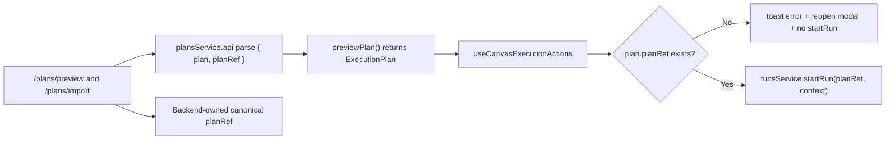
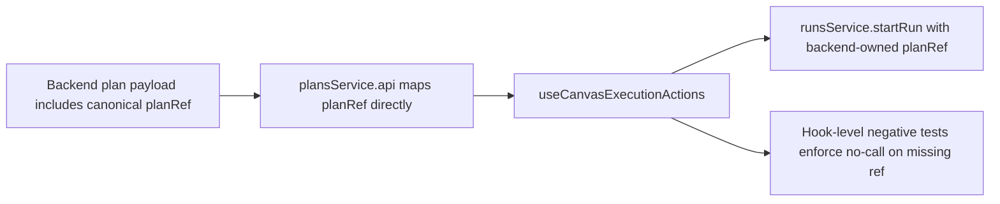

# F04-RISK-A PlanRef Runtime Boundary Hard QA Review

## Summary

This artifact applies the canonical QA template to the active `F04-RISK-A`
change set that removes mock-only `PlanRef` construction from the shared
`Canvas -> startRun` path.

Canonical execution tracking remains in:

- `docs/planning/state/agent-lane-e.yaml` (`F04-RISK-A`)
- `docs/planning/proposals/mandatory/frontend-and-ux/f04-frontend-data-boundary-hexagonal-convergence-plan-20260403.md`
- `docs/planning/closeouts/F-04-RISK-A-QA-03-backend-owned-planref-closeout.md`

## Resolution Update 2026-04-07

Current `main` no longer matches the original open-blocker state described in
this review.

- `apps/api/src/entrypoints/http/planRoutes.ts` now returns `{ plan, planRef }`
  from both preview and import routes.
- `apps/web/src/app/services/plans/plansService.api.ts` parses `planRef`
  directly from that envelope and rejects payloads that omit it.
- `apps/web/src/app/services/plans/plansService.test.ts` now covers both
  preview and import adapter paths for backend-owned `planRef`.

This review remains the canonical QA intake artifact for the original risk, but
`F04-RISK-A-QA-03` is now resolved in code and moved to documentary closeout
plus regression evidence.

## Governing Sources

- `AGENTS.md`
- `docs/planning/status/governance-document-rule-inventory.md`
- `docs/guides/ai-work-protocol.md`
- `docs/planning/templates/qa/TEMPLATE_QA_GLOBAL_CHECK_PROMPT.md`
- `docs/planning/templates/qa/TEMPLATE_QA_ARTIFACT_EXAMPLE.md`
- `docs/planning/state/agent-lane-e.yaml`
- `docs/planning/proposals/mandatory/frontend-and-ux/f04-frontend-data-boundary-hexagonal-convergence-plan-20260403.md`

## Findings

### High

- Title: API `planRef` was synthesized client-side instead of consumed as a
  backend-owned ref.
  Why it mattered:
  This created drift risk between frontend-generated refs and backend canonical
  identity rules.
  Original review evidence:
  [plansService.api.ts](/c:/dvt/apps/web/src/app/services/plans/plansService.api.ts:59)
  was flagged in the 2026-04-05 review as locally constructing `planRef`.
  Current status:
  Resolved on `main`.
  Updated evidence:
  - `apps/api/src/entrypoints/http/planRoutes.ts`
  - `apps/web/src/app/services/plans/plansService.api.ts`
  - `apps/web/src/app/services/plans/plansService.test.ts`
    Residual risk:
    No remaining `F04-RISK-A` drift risk in the API adapter path. The sibling
    mock-workspace determinism risk was later closed under
    `F-04-RISK-B`.
    Recommendation:
    Keep backend-owned `planRef` as the only accepted API-mode source of truth.

### Medium

- Title: Behavioral negative test for full `handleStartRun` path was missing (resolved in this slice).
  Why it matters: Side effects (`toast`, modal reopen, start-run short-circuit) must be protected at hook level.
  Evidence:
  - [useCanvasExecutionActions.test.tsx](../../../../apps/web/src/app/views/canvas/useCanvasExecutionActions.test.tsx:104) exercises `handleStartRun` with missing `planRef`.
  - [useCanvasExecutionActions.ts](../../../../apps/web/src/app/views/canvas/useCanvasExecutionActions.ts:89) contains modal + toast + early-return behavior.
    Risk: Reduced for this boundary after test hardening.
    Recommendation: Keep this test as mandatory guard when evolving run-start UX flow.

### Low

- Title: `ExecutionPlan` UI type gained `planRef` without companion manual/architecture update.
  Why it matters: Contract understanding can drift between docs and code for frontend contributors.
  Evidence:
  - [dbt.ts](../../../../apps/web/src/app/types/dbt.ts:48)
  - no paired update in frontend architecture/manual docs in this slice.
    Risk: Minor onboarding confusion and future duplicate fixes.
    Recommendation: Add a short doc note in the next `F04` closeout or architecture update.

## Alignment

- Doc vs code: Aligned after the 2026-04-07 documentation update.
- Promise vs implementation: Core promise met (`buildPlanRefFromPlan` removed from shared path).
- Tests vs claims: Targeted tests pass, but negative behavioral coverage is incomplete.
- Tests vs claims: Targeted tests pass, including hook-level negative behavioral coverage for missing `planRef`.
- Current truth vs planned truth: Current truth now matches the QA-03 target.
- Documentation update status: Updated across lane, closeout, and frontend contract surfaces.
- Evidence and risk-doc status when applicable: No ARC-triggering paths touched (`apps/web` only), so no ARC evidence/risk doc required.

## Architecture Assessment

- SRP: Improved. `useCanvasExecutionActions` no longer owns mock ref-construction policy.
- DDD: Better boundary ownership; `PlanRef` is moving toward adapter responsibility.
- Hexagonal: Aligned for this risk slice. API preview/import now hand off
  backend-authored `planRef` through the adapter boundary.
- CQRS if relevant: N/A for this local slice.
- Complexity: Reduced in runtime execution path; small new complexity in optional `planRef` field handling.
- Modularity: Positive change (`plansService.mock` no longer exports cross-mode helper).

## Test Assessment

- Negative paths present: Helper-level negative (`planRef` missing returns `null`).
- Negative paths missing: None for the immediate `planRef` runtime guard path.
- Regression status: No regression detected in executed suite.
- Determinism: Stable in executed tests.
- Local suite vs meaningful global confidence: Local confidence medium-high for this boundary after adding hook-level negative coverage.
- Global system view applied: Yes, review considered view hook + plans adapter + types + mock data.
- Harness or shared fixture need: Existing canvas hook harness can be reused for missing negative path.
- Test grouping by type and rationale:
  - `unit`: `resolvePlanRefForStartRun` helper behavior.
  - `integration/hook`: modal/toast/startRun side effects on missing `planRef`.
  - `adapter`: preview/import payload mapping and fail-closed envelope rejection in `plansService.test.ts`.

## Quality Gates

- Commands executed:
  - `pnpm --filter @dvt/web exec vitest run src/app/services/plans/plansService.test.ts src/app/views/canvas/useCanvasExecutionActions.test.tsx --config vitest.config.ts`
  - `pnpm --filter @dvt/web typecheck`
  - `pnpm --filter @dvt/api exec vitest run test/entrypoints/http/planRoutes.test.ts --config vitest.config.ts`
  - `pnpm verify:prepush`
- What passed: all commands above.
- What failed: none.
- What could not be verified: CI-only PR checks were not executed in this local QA pass.

## Unblock Roadmap

### Wave 0 - Runtime boundary closure

Tasks: `F04-RISK-A-QA-01`, `F04-RISK-A-QA-02`

Target:

- no shared flow synthesizes mock-only plan identity;
- hook-level negative behavior is test-backed.

### Wave 1 - Contract ownership hardening

Tasks: `F04-RISK-A-QA-03`

Target:

- frontend consumes backend-owned plan references without local reconstruction.

## Action Artifact

### Markdown Artifact Path Suggestion

- `docs/planning/reviews/architecture-and-governance/20260405-f04-risk-a-hard-qa-review.md`

### Task Checklist

- [x] `F04-RISK-A-QA-01` Add hook-level negative test for missing `planRef` in `handleStartRun`
- [x] `F04-RISK-A-QA-02` Add assertion that `runsService.startRun` is never called when `planRef` is absent
- [x] `F04-RISK-A-QA-03` Move API `planRef` ownership to backend payload and remove frontend synthesis
- [x] `F04-RISK-A-QA-04` Update frontend architecture/manual docs for `ExecutionPlan.planRef` boundary

### Closure update

- `F04-RISK-A-QA-03` is now closed in code and regression coverage.
- No `F04-RISK-A` blocker remains open.
- The former sibling follow-up under the parent risk cluster,
  `F-04-RISK-B`, is now closed separately as a mock-workspace determinism
  issue rather than a `planRef` contract issue.

### Task Details

#### `F04-RISK-A-QA-01` Add hook-level negative test for missing `planRef` in `handleStartRun`

- Objective: Validate real hook behavior, not only helper output.
- Scope: `useCanvasExecutionActions` negative path.
- Recommended owner: Frontend (Lane E).
- Dependencies: Existing canvas hook harness.
- Documentation impact: None.
- Evidence / risk-doc impact: None.
- Comment with rationale: The regression risk lives in side effects (`toast`, modal, early return), not in pure helper logic.
- Definition of Done:
  - test executes `handleStartRun` with missing `planRef`;
  - test verifies modal reopens and error path is triggered.

#### `F04-RISK-A-QA-02` Add assertion that `runsService.startRun` is never called when `planRef` is absent

- Objective: Protect the runtime boundary from invalid `startRun` calls.
- Scope: same hook-level negative test suite.
- Recommended owner: Frontend (Lane E).
- Dependencies: `F04-RISK-A-QA-01`.
- Documentation impact: None.
- Evidence / risk-doc impact: None.
- Comment with rationale: This is the core invariant of the fix.
- Definition of Done:
  - explicit assertion for zero invocations of `runsService.startRun` in missing-ref scenario.

#### `F04-RISK-A-QA-03` Move API `planRef` ownership to backend payload and remove frontend synthesis

- Objective: Eliminate contract drift risk from local ref construction.
- Scope: API plans adapter + runtime contract expectation.
- Recommended owner: Frontend + API boundary owner.
- Dependencies: backend response shape support.
- Documentation impact: runtime contract docs must describe backend-owned `planRef`.
- Evidence / risk-doc impact: none unless governed contract paths are touched.
- Comment with rationale: Canonical identity should be authored by the execution authority boundary.
- Definition of Done:
  - `plansService.api` maps `planRef` directly from backend payload;
  - no fallback local synthesis remains in API path.

#### `F04-RISK-A-QA-04` Update frontend architecture/manual docs for `ExecutionPlan.planRef` boundary

- Objective: Keep docs synchronized with shipped boundary.
- Scope: frontend architecture/manual surfaces.
- Recommended owner: Frontend docs owner.
- Dependencies: `F04-RISK-A-QA-03` preferred.
- Documentation impact: direct.
- Evidence / risk-doc impact: none.
- Comment with rationale: Prevents hidden drift and duplicate later fixes.
- Definition of Done:
  - docs mention `planRef` as required runtime bridge for `startRun`;
  - docs reflect actual owner (backend or frontend synthesis if still interim).

## Mermaid Diagram

### Current-state risk map

### Target correction path

## Validation Baseline For This Slice

1. `pnpm --filter @dvt/web test -- src/app/views/canvas/useCanvasExecutionActions.test.ts src/app/views/canvas/useCanvasController.core.test.tsx src/app/services/plans/plansService.test.ts`
2. `pnpm --filter @dvt/web typecheck`
3. `pnpm verify:prepush`

## Final Verdict

The original `QA-03` finding is now closed. This review remains the canonical
record of the risk intake and the criteria used to close it, but the current
repo truth is aligned: preview/import payloads carry backend-owned `planRef`,
the web adapter rejects missing envelopes, and the shared start-run path
remains fail-closed. Remaining `F-04` work now continues under
`F-04-RESIDUAL`, not this `planRef` slice.
