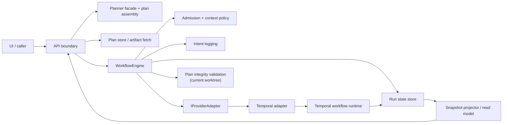
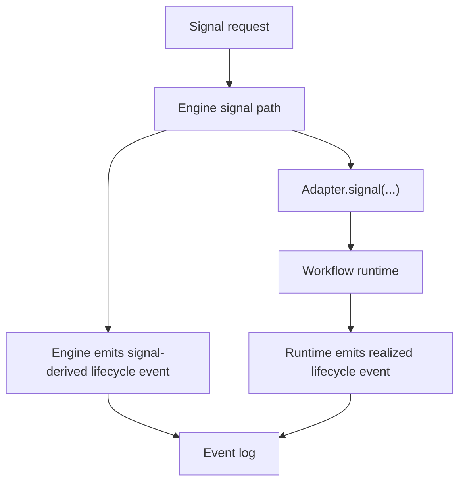
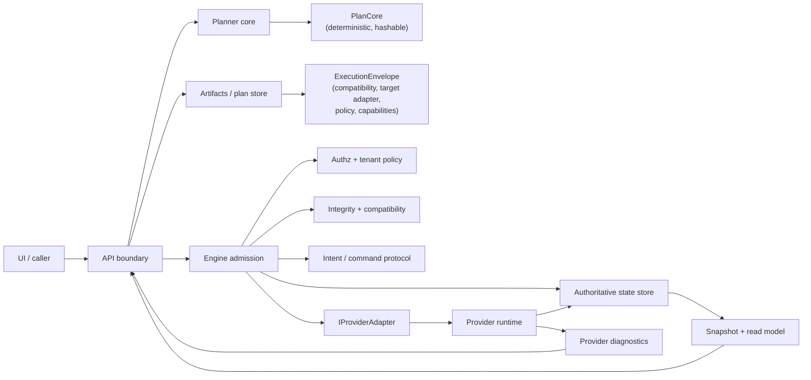
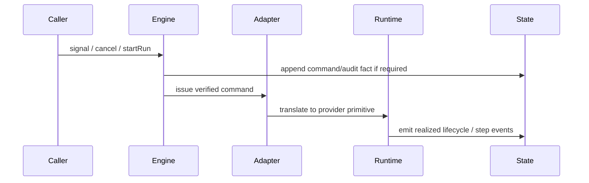
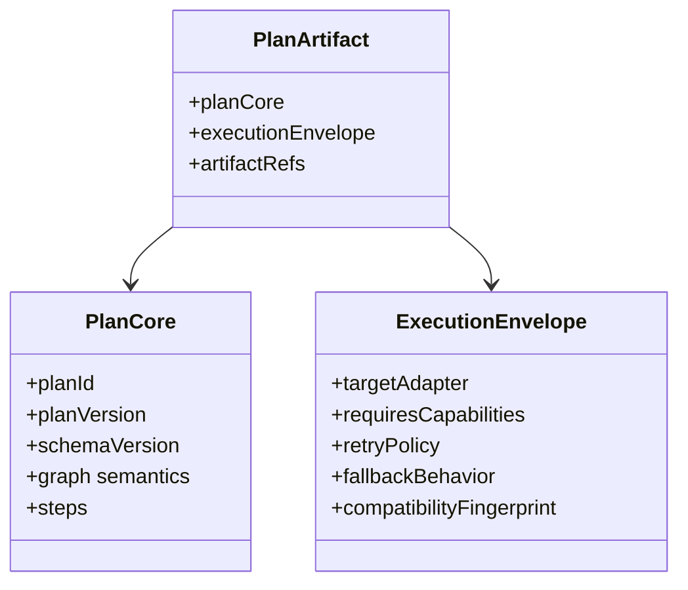

# DVT+ principles, boundaries, and target-state review

## Purpose

Save the current architectural review as a canonical review artifact, extend it
into an explicit rationale, and state which product principles should be kept,
changed, or rejected.

This review is code-grounded. It is not a marketing summary and it is not a
roadmap pitch. It is an architectural judgment of the repository as it exists
today, including the active working-state changes visible in the worktree on
2026-04-07.

## Method and evidence base

- Method: source-code-first review, ADR calibration second, product claims
  validated against implementation rather than the reverse
- Governing sources:
  - `docs/architecture/reference-architecture.md`
  - `docs/planning/execution-model/dvt-execution-model.md`
  - `docs/architecture/system-delivery-status.md`
  - `docs/adr/ADR-0003-execution-model.md`
  - `docs/adr/ADR-0004-event-sourcing-strategy.md`
  - `docs/adr/ADR-0012-plan-integrity-ownership.md`
  - `docs/adr/ADR-0014-run-driven-adapter-model.md`
  - `docs/adr/ADR-0015-getRunStatus-read-model-separation.md`
  - `docs/adr/ADR-0017_ExecutionPlan_Schema_Versioning.md`
- Primary code paths inspected:
  - `apps/api/src/modules/buildProtectedRuntimeModule.ts`
  - `apps/api/src/application/services/StoredPlanExecutabilityValidator.ts`
  - `apps/api/src/application/ports/startRunCommandContract.ts`
  - `packages/@dvt/planner/src/domain/Planner.ts`
  - `packages/@dvt/planner/src/domain/PlanAssembler.ts`
  - `packages/@dvt/planner/src/domain/manifest.ts`
  - `packages/@dvt/engine/src/core/WorkflowEngine.ts`
  - `packages/@dvt/engine/src/core/WorkflowEngineCoreService.ts`
  - `packages/@dvt/engine/src/application/StartRunAdmissionGuard.ts`
  - `packages/@dvt/engine/src/application/StartRunApplicationService.ts`
  - `packages/@dvt/engine/src/services/startRun/StartRunExecutionService.ts`
  - `packages/@dvt/engine/src/services/startRun/RunExecutionContextAdmissionPolicy.ts`
  - `packages/@dvt/engine/src/core/lifecycle/coreRuntime.ts`
  - `packages/@dvt/adapter-temporal/src/TemporalAdapter.ts`
  - `packages/@dvt/adapter-temporal/src/workflows/RunPlanWorkflow.ts`
  - `packages/@dvt/adapter-postgres/src/PostgresPlanStore.ts`
  - `packages/@dvt/adapter-postgres/src/PostgresStateStoreAdapter.ts`
  - `packages/@dvt/contracts/src/contracts/planner/ExecutionPlan.v1.ts`
  - `packages/@dvt/contracts/src/contracts/engine/SignalSemantics.v1.ts`

## Executive judgment

The architecture is credible, but one of its flagship principles is wrong as
stated.

- The separation `Planner / Engine / State` is real enough to preserve.
- `UI does not execute` is correct and should remain.
- `Planner does not persist state` is correct for the planner core and should
  remain.
- `Engine does not decide` is false in the current design and should be
  replaced, not defended.
- `State is the source of truth` is correct and should remain.
- `Provider status is enrichment, not authority` is correct and should remain.
- The run-driven adapter model is correct.
- The current `ExecutionPlan` boundary is not clean enough.
- The current multi-engine posture is overstated relative to what exists in
  code.

If nothing changes, the system will not collapse immediately. It will instead
accumulate semantic debt exactly where it claims to be strict: plan ownership,
lifecycle authority, adapter boundaries, and product-level extensibility.

## Current state

### Current runtime shape

### Current lifecycle authority problem

The system currently risks two authorities for the same semantic transition.
That is not a cosmetic problem. It is a determinism problem.

## 1. Conceptual soundness

### What is solid

- Planner purity is real. `Planner` builds plans deterministically and does not
  mutate runtime state.
- State-authoritative reads are real. `getRunStatus()` reads from snapshot/event
  state, while provider interaction is isolated to enrichment.
- The run-driven adapter model is correct for Temporal-like runtimes. The engine
  is not in the step execution hot path.
- Event-sourced persistence is the right model for auditability, replay, and
  deterministic diagnosis in this product.
- The port-and-adapter discipline is materially present. The engine core does
  not import Temporal SDK primitives directly.

### What is fragile

#### Fragility A - The principle "engine does not decide" is false

The engine decides admission, schema compatibility, plan integrity, capability
checks, signal admission, command authorization, and lifecycle policy.

That is not a bug. That is the job.

The problem is the slogan, not the behavior. If the slogan remains unchanged,
contributors will keep making bad decisions in the name of a false purity rule.

#### Fragility B - `ExecutionPlan` is carrying too much

The current contract mixes:

- deterministic planning identity
- execution/runtime compatibility
- adapter targeting
- capability requirements
- fallback behavior
- observability baggage

That is not a clean planner artifact. It is two artifacts forced into one
shape.

#### Fragility C - dbt-generic posture is weaker than advertised

The planner contract is generic. The runtime defaults are still dbt-shaped.
`dbtStepFactory` remains the default, and manifest derivation still recognizes
dbt resource types as the primary graph source. The abstraction exists. The
generic implementation does not.

#### Fragility D - multi-engine replaceability is more narrative than reality

The abstraction layer is reasonable. The product claim is ahead of the code.
Temporal is real. Mock exists for tests. Conductor is not a product runtime
today.

#### Fragility E - the provider boundary is unstable in the current worktree

The provider adapter contract is in flux and the worktree contains unresolved
conflicts in provider-boundary files. That is a direct signal that the boundary
is not stable enough yet.

### What is missing

- one clean split between planning artifact and execution envelope
- one unambiguous lifecycle event authority model
- one explicit tenant model for persisted plan artifacts
- one explicit consistency model for start-run across plan fetch, admission,
  intent logging, bootstrap, dispatch, and compensation
- one clear product posture for "Temporal-first now" versus "multi-engine now"

## 2. Are the declared product principles correct?

### Verdict by principle

| Principle                                                       | Keep or change          | Judgment                                                                                    | Replacement / clarification                                                                                                  |
| --------------------------------------------------------------- | ----------------------- | ------------------------------------------------------------------------------------------- | ---------------------------------------------------------------------------------------------------------------------------- |
| `UI does not execute`                                           | Keep                    | Correct                                                                                     | Keep as is                                                                                                                   |
| `Planner does not persist state`                                | Keep with clarification | Correct for planner core, but persistence still exists in the planning/application boundary | `Planner core does not persist runtime state; application services may persist immutable planning artifacts`                 |
| `Engine does not decide`                                        | Change                  | False and misleading                                                                        | `Engine does not invent business topology or provider semantics; it enforces admission, integrity, and lifecycle invariants` |
| `State is the source of truth`                                  | Keep                    | Correct                                                                                     | Keep as is                                                                                                                   |
| `Provider status is enrichment, not authority`                  | Keep                    | Correct                                                                                     | Keep as is                                                                                                                   |
| `Adapters receive validated contracts, not internal aggregates` | Keep with clarification | Correct but incomplete                                                                      | `Adapters receive verified execution inputs and own provider translation only`                                               |

### Recommended principle set

The correct principle set for this product should be:

1. UI submits commands and reads projections. It never executes workflows.
2. Planner core builds deterministic plan artifacts. It never mutates runtime
   state.
3. Engine owns admission, integrity, authorization, and lifecycle invariants.
   It does not redesign the plan and it does not own provider mechanics.
4. State is authoritative for run truth. Provider data is operational
   enrichment only.
5. Adapters translate domain semantics into provider runtime primitives. They
   do not own canonical business semantics.
6. Artifacts are immutable, versioned, and auditable.
7. Event authority for each lifecycle fact must be singular.

That set is stricter and more durable than the current slogan.

## 3. Architectural risk map

| Risk                                                          | Severity | Likelihood | Why                                                                                             | Mitigation                                                             |
| ------------------------------------------------------------- | -------- | ---------- | ----------------------------------------------------------------------------------------------- | ---------------------------------------------------------------------- |
| `ExecutionPlan` boundary pollution                            | High     | High       | One contract is mixing plan identity and runtime deployment concerns                            | Split into `PlanCore` and `ExecutionEnvelope`                          |
| Dual lifecycle authority on signals                           | High     | High       | Engine and runtime both risk emitting the same semantic transition                              | Pick one authority per lifecycle fact                                  |
| Unknown-step-kind policy drift                                | High     | Medium     | Planner posture and executability posture are not aligned                                       | Make the extension policy explicit and consistent                      |
| Global plan artifact without explicit tenant-neutrality proof | High     | Medium     | Plan store is effectively keyed by plan identity, not tenant identity                           | Either prove tenant neutrality or scope plan artifacts by tenant       |
| Start-run consistency sprawl                                  | High     | Medium     | Admission, integrity, intent, bootstrap, and dispatch are distributed across many collaborators | Collapse into an explicit command protocol with named phases           |
| Hardcoded runtime retry semantics                             | Medium   | High       | Retry/backoff still lives inside Temporal workflow defaults                                     | Move retry ownership into governed execution input                     |
| Multi-engine abstraction tax before second real engine        | Medium   | High       | Complexity is being paid now for a capability not delivered now                                 | Freeze product-level multi-engine claims and remove dead surfaces      |
| Snapshot replay fallback cost                                 | Medium   | High       | Snapshot miss means replaying the full event stream                                             | Keep snapshots warm, expose freshness, and partition retention         |
| Artifact / graph-source security ambiguity                    | High     | Medium     | Artifact resolution is not yet framed as a fully tenant-governed boundary                       | Add explicit artifact policy and scoped references                     |
| Cost-product narrative without cost engine                    | Medium   | High       | The product story suggests cost-aware posture, but backend cost capability is absent            | Freeze deep cost commitments until a real source-of-truth model exists |

## 4. Engine abstraction critique

### Is `IWorkflowEngine` minimal and correct?

Mostly yes.

The surface is small and credible:

- `startRun`
- `cancelRun`
- `getRunStatus`
- `enrichRunStatus`
- `signal`

That is the right level of abstraction.

The main correction is not to add more methods. It is to keep the contract
small and move accidental behavior out of it:

- provider-native diagnostics belong in enrichment
- step execution does not belong in the engine
- plan compilation does not belong in the engine

### Is Temporal-first strategy wise?

Yes.

Temporal is a good fit for deterministic orchestration, signal handling, and
replay-safe long-running execution. The mistake is not the Temporal-first
strategy. The mistake is pretending that Temporal-first already equals
multi-engine maturity.

### Is the event model robust?

The base event model is structurally good:

- append-only
- per-run ordering via `runSeq`
- idempotency keys
- derived snapshots

The weak point is event ownership, not the event envelope.

If the engine and the runtime can both emit the same semantic lifecycle fact,
the robustness of the model is compromised even if the schema is fine.

### Is `ExecutionPlan` sufficiently expressive?

It is expressive enough. That is not the problem.

The problem is that it is carrying too many categories of concern in one file:

- planning semantics
- provider capability requirements
- execution policy
- operational compatibility

The artifact is expressive. The boundary is wrong.

### Where determinism assumptions can fail

- duplicated lifecycle authority on signals
- hardcoded Temporal retry policy instead of governed execution input
- ambiguous extension policy for unknown step kinds
- future schema evolution under one overloaded `ExecutionPlan` artifact

## 5. Execution planning layer analysis

### DAG analyzer and dbt artifact posture

The DAG planning core is real and useful. The generic story is overstated.

Current reality:

- dbt artifacts are the only serious graph source
- step kinds are still dbt-centric in practice
- graph-source typing exists, but the product is not workflow-generic yet

That is not a failure. It just means the product should say "dbt-first" until
it stops being true.

### Partial execution guarantees

Node selection exists. Rich re-execution semantics do not.

The system can choose subsets of nodes. It does not yet offer a mature
business-level model for partial rerun semantics, attempt lineage, and
step-level recovery policy across engines.

### Retry/backoff ownership

This area is underbuilt.

A runtime like Temporal can provide infrastructure retry, but the product needs
governed control over:

- which step kinds retry
- which failures are retryable
- how backoff differs across step types

That is execution policy and should not remain hardcoded in a Temporal workflow
forever.

### Cost estimator realism

There is no serious cost engine yet.

Do not pretend the current system is cost-aware in a product sense. It is
cost-conscious as an architectural aspiration, not as a shipped capability.

### Plan versioning strategy

Versioning exists and is serious. Enforcement is fragmented.

The repository has the right instinct, but the versioning story is paying a lot
of complexity cost before the boundaries are fully simplified.

### Is this layer overbuilt or under-specified?

Both.

- Overbuilt in metadata layering and future-runtime posture
- Under-specified in retry ownership, rerun semantics, and graph-source
  extension policy

## 6. State and metadata layer review

### Event sourcing versus mutable state

Keep event sourcing.

For this product, event sourcing is the better model than a mutable status row
because the system needs:

- replay
- auditability
- idempotent write discipline
- separation between truth and projection

The cost is real:

- write amplification
- retention pressure
- replay cost
- operational complexity

That cost is still justified for this domain.

### Artifact immutability realism

Artifact immutability is realistic and necessary. The weak point is not the
concept. The weak point is whether plan artifacts are tenant-neutral and whether
their storage contract states that clearly.

### Metadata shape

Metadata is drifting toward a mixed bag of:

- run identity
- provider identity
- compatibility posture
- execution hints

That needs discipline before it becomes a permanent junk drawer.

## 7. What is overbuilt?

### Multi-engine posture

The interface can stay. The product claim should not.

Do not invest in Conductor parity as if it were near-term delivery unless it is
actually on the product line.

### Observability layering around start-run

The observability surface is legitimate. The amount of boilerplate in the
orchestration path is high relative to the maturity of the behavior it is
observing.

### Metadata-heavy planning artifact

Too much is being packed into the plan contract too early.

### Deep cost posture

The current code does not justify strong cost-product claims.

## 8. What is underbuilt?

- retry/backoff ownership
- distributed consistency model
- lifecycle event ownership model
- artifact security and tenant policy
- concurrency policy at engine/runtime level
- retention defaults and data growth posture
- clear rollback and rerun semantics
- product posture on dbt-first versus generic execution

## 9. Fragility deep dive

| Fragility                                 | Is it subsanable? | Recommended response                                      | Better to replace the model?                 |
| ----------------------------------------- | ----------------- | --------------------------------------------------------- | -------------------------------------------- |
| False principle: `Engine does not decide` | Yes               | Replace the principle wording                             | No                                           |
| `ExecutionPlan` boundary pollution        | Yes               | Split the artifact                                        | No                                           |
| Dual lifecycle authority                  | Yes               | Pick singular event authority per fact                    | No                                           |
| Multi-engine overclaim                    | Yes               | Freeze/remove dead product claims                         | No                                           |
| dbt-generic mismatch                      | Yes               | Declare dbt-first explicitly until generic runtime exists | No                                           |
| Plan-store tenant ambiguity               | Yes               | Formalize neutrality or scope by tenant                   | No                                           |
| Start-run collaborator sprawl             | Yes               | Introduce an explicit coordinator/protocol                | No                                           |
| Hardcoded retry policy                    | Yes               | Move retry ownership into governed input                  | No                                           |
| Event sourcing operational cost           | Partially         | Add retention, batching, projections, partitioning        | No; mutable-state replacement would be worse |

### Detailed judgment

Most fragilities are subsanable. That is the important point.

The current architecture does not need a wholesale replacement. It needs
boundary correction.

The only place where a different model would be justified would be if the team
decided it no longer values replay, auditability, or deterministic lifecycle
truth. That would be a different product. This repository is not that product.

## 10. Clear separation between components

### Recommended separation model

| Component                  | Owns                                                                                  | Must not own                                          |
| -------------------------- | ------------------------------------------------------------------------------------- | ----------------------------------------------------- |
| `UI / API`                 | commands, queries, auth context, request shaping                                      | workflow execution, plan semantics, state truth       |
| `Planner core`             | graph normalization, selection, deterministic plan core, step semantics declaration   | runtime state mutation, provider I/O, event emission  |
| `Artifacts / plan store`   | immutable plan bytes, graph-source artifacts, content-addressed retrieval             | execution decisions, tenant-bypassing reads           |
| `Engine admission`         | authz, compatibility, integrity, capability checks, intent protocol, command issuance | plan redesign, provider-native execution mechanics    |
| `Adapter runtime`          | provider translation, workflow/task execution, realized step/run event emission       | business-policy invention, canonical read-model truth |
| `State store + projector`  | authoritative event log, snapshots, outbox, archival and replay                       | provider mechanics, planning logic                    |
| `Observability / platform` | metrics, traces, audits, limits, alerts                                               | state truth, lifecycle authority                      |

### Required boundary corrections

1. Planner owns `PlanCore`, not the whole execution envelope.
2. Engine owns admission and verified dispatch, not runtime step mechanics.
3. Runtime owns realized lifecycle and step events, not engine-derived
   duplicates.
4. State store owns truth, not provider status or API caches.
5. Artifact boundary must become explicit in tenancy and immutability.

## 11. Target state

### Correct target architecture

### Correct lifecycle ownership

### Correct plan boundary

## 12. Rationale and tradeoffs

### Decision 1 - Keep event sourcing

Why:

- it preserves auditability
- it preserves deterministic replay
- it supports state-authoritative reads

Cost:

- more writes
- more retention pressure
- more projection infrastructure

Recommendation:

Keep it. Fix the operational gaps instead of replacing the model.

### Decision 2 - Keep run-driven adapters

Why:

- it matches provider runtimes like Temporal
- it keeps the engine out of step execution hot paths
- it preserves clear ownership between admission and execution

Cost:

- adapters need more internal sophistication
- runtime tests carry more weight

Recommendation:

Keep it. Do not regress to a step-driven engine model.

### Decision 3 - Replace the slogan about engine non-decision

Why:

- it is currently false
- it causes category errors
- it obscures who owns invariants

Cost:

- some docs and reviews must be updated
- contributors lose a simplistic slogan

Recommendation:

Replace it now. The current wording is architectural debt.

### Decision 4 - Split planning identity from runtime envelope

Why:

- the current `ExecutionPlan` boundary is too wide
- versioning and compatibility logic are harder than they should be
- planner outputs should remain conceptually clean

Cost:

- contract churn
- adapter and engine migration work
- tests and docs updates

Recommendation:

Do it before deeper multi-runtime or policy growth. Later will cost more.

### Decision 5 - Freeze multi-engine product claims

Why:

- only one production runtime exists
- abstraction cost is already being paid
- product claims should match delivery truth

Cost:

- some future-looking language must be toned down
- Conductor remains a future task, not a present capability

Recommendation:

Do it now. Keep the interface. Drop the illusion.

## 13. Scalability outlook

Assuming 1000+ tenants, thousands of concurrent runs, large dbt projects, and
heavy read/query traffic:

### Likely bottlenecks

- PostgreSQL write volume on events, snapshots, and outbox
- snapshot lag and replay fallback cost
- plan fetch/integrity overhead in the start-run path
- Temporal history and payload growth for very large runs
- operational complexity of retention and archival

### Single points of failure

- PostgreSQL
- Temporal
- artifact availability for plan retrieval

### Pressure points

- event volume growth
- plan artifact growth
- cross-tenant outbox interference
- absence of explicit concurrency policy

### Outlook judgment

The architecture can scale further, but not by inertia.

It needs:

- retention defaults
- batching and partitioning posture
- explicit concurrency policy
- artifact/storage hardening

## 14. Architectural scorecard

| Area                      | Score | Judgment                                                                                   |
| ------------------------- | ----- | ------------------------------------------------------------------------------------------ |
| Conceptual clarity        | 7/10  | Strong big shapes, one false flagship principle                                            |
| Separation of concerns    | 6/10  | Real boundaries, but polluted plan and lifecycle authority                                 |
| Replaceability of engine  | 5/10  | Ports exist; only one real provider path is mature                                         |
| Determinism               | 7/10  | Good foundation, weakened by duplicated lifecycle authority and runtime-owned retry policy |
| Extensibility             | 5/10  | Extensible on paper, still dbt-first and Temporal-first in practice                        |
| Operational realism       | 6/10  | Serious foundations, incomplete retention/concurrency/cost posture                         |
| Long-term maintainability | 6/10  | Strong governance, but high semantic complexity at boundary seams                          |

## 15. Strategic recommendations

### 3 structural changes

1. Split `ExecutionPlan` into `PlanCore` and `ExecutionEnvelope`.
2. Make lifecycle event authority singular: engine issues commands, runtime
   emits realized lifecycle and step events.
3. Collapse start-run behavior into a named command protocol with explicit
   phases and invariants.

### 3 clarifications needed

1. Is the product dbt-first for this release, or is generic execution actually
   in scope now?
2. Are persisted plan artifacts tenant-neutral by design, or should they be
   tenant-scoped?
3. What exact consistency guarantee is promised between accepted `startRun`,
   persisted bootstrap, and runtime dispatch?

### 3 things to freeze immediately

1. No new product claims of multi-engine support without a second real adapter.
2. No further widening of the current `ExecutionPlan` contract.
3. No new lifecycle event producers until event authority is simplified.

### 3 things to delay

1. Conductor parity.
2. Deep cost attribution and cost dashboards.
3. Generic multi-workflow positioning beyond dbt until the second real graph
   model exists.

## 16. Final recommendation

Do not replace the architecture.

Keep:

- planner / engine / state separation
- event sourcing
- run-driven adapters
- state-authoritative reads

Change:

- the false principle about engine non-decision
- the polluted plan boundary
- the lifecycle event ownership model
- the overclaimed multi-engine story

That path is cheaper than a model reset and far more durable than continuing to
explain away the current inconsistencies.
