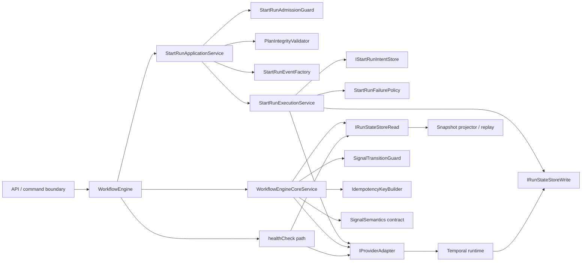
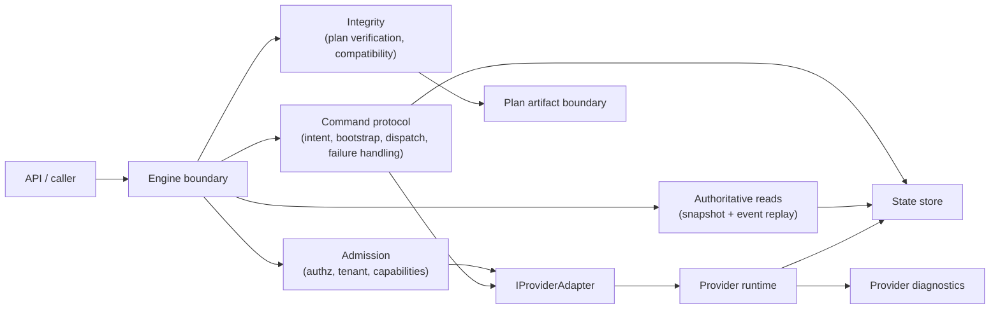
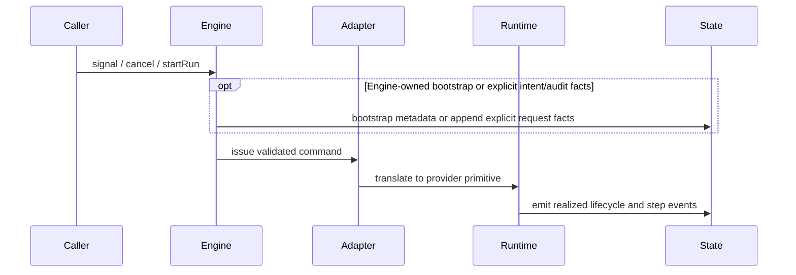

# Engine boundary current state, target state, and migration review

## Purpose

This document narrows the 2026-04-07 principal architecture review to one
question only:

What should the DVT engine own, what should it not own, what does it own today,
and what concrete migration steps would improve that boundary without violating
accepted ADRs?

This document is code-grounded and ADR-calibrated. It distinguishes between:

- an implemented protocol that merely lacks one governed summary artifact
- a real boundary defect proven by code and tests
- a design direction that is not yet mature enough to be called a migration
  step

## Companion review

This document complements:

- [20260407 DVT principles, boundaries, and target-state review](20260407-dvt-principles-boundaries-and-target-state-review.md)

## Governing sources

Architecture and ADRs:

- `docs/architecture/reference-architecture.md`
- `docs/adr/ADR-0003-execution-model.md`
- `docs/adr/ADR-0004-event-sourcing-strategy.md`
- `docs/adr/ADR-0007_RunCancellation.md`
- `docs/adr/ADR-0010-run-event-envelope-split.md`
- `docs/adr/ADR-0012-plan-integrity-ownership.md`
- `docs/adr/ADR-0013-run-state-store-bootstrapRunTx.md`
- `docs/adr/ADR-0014-run-driven-adapter-model.md`
- `docs/adr/ADR-0015-getRunStatus-read-model-separation.md`
- `docs/adr/ADR-0030-pre-dispatch-intent-log.md`

Evidence:

- `docs/evidence/critical/ED-20260401-cancel-lifecycle-workflow-owned-ordering.md`

Primary code paths:

- `packages/@dvt/engine/src/core/WorkflowEngine.ts`
- `packages/@dvt/engine/src/application/StartRunAdmissionGuard.ts`
- `packages/@dvt/engine/src/application/StartRunApplicationService.ts`
- `packages/@dvt/engine/src/services/startRun/StartRunExecutionService.ts`
- `packages/@dvt/engine/src/services/startRun/StartRunFailurePolicy.ts`
- `packages/@dvt/engine/src/services/startRun/StartRunEventFactory.ts`
- `packages/@dvt/engine/src/services/signal/SignalTransitionGuard.ts`
- `packages/@dvt/engine/src/core/WorkflowEngineCoreService.ts`
- `packages/@dvt/engine/src/core/idempotency.ts`
- `packages/@dvt/contracts/src/contracts/planner/ExecutionPlan.v1.ts`
- `packages/@dvt/contracts/src/contracts/engine/SignalSemantics.v1.ts`
- `packages/@dvt/adapter-temporal/src/TemporalAdapter.ts`
- `packages/@dvt/adapter-temporal/src/workflows/RunPlanWorkflow.ts`
- `apps/api/src/modules/buildProtectedRuntimeModule.ts`

## Executive judgment

The engine boundary is directionally correct, but the earlier draft was too
loose in two places and too vague in one.

The intended decoupling is already materially real:

- the engine is not the planner
- the engine is not the provider runtime
- the engine is not the default source of truth for status
- the engine is not the step executor

The real issues are narrower and more concrete than the earlier draft claimed:

1. `startRun()` is already implemented as a multi-phase protocol, but that
   protocol is spread across several collaborators and lacks one governed
   summary artifact that names the phases, invariants, and failure semantics
   together
2. lifecycle ownership is already aligned for `CANCEL`, but it is still split
   for `PAUSE/RESUME`
3. the `ExecutionPlan` contract still mixes deterministic plan identity and
   runtime policy metadata in one shape

The correct move is not to make the engine bigger or smaller in the abstract.
The correct move is to sharpen ownership and prove it with governed artifacts.

## Questions answered

1. What does the engine own today?
2. What should the engine own?
3. Which parts are defects versus merely under-documented?
4. What is the correct target shape?
5. Which migration steps are real, which are design work, and what must each
   prove?
6. How does the target compare to real orchestration systems?

## 1. The engine as implemented now

### Current responsibilities

From the current code, the engine owns these responsibilities:

- command entry point for `startRun`, `cancelRun`, `getRunStatus`,
  `enrichRunStatus`, and `signal`
- admission and boundary validation for run commands
- executable-plan integrity verification before adapter dispatch
- start-run orchestration, including intent logging, bootstrap, dispatch, and
  failure handling
- authoritative read path from state
- provider-enriched read path as a separate operation
- command forwarding to the adapter layer
- signal admission and transition guarding
- engine-side signal-derived event behavior for `PAUSE/RESUME`

### Evidence in code

- `WorkflowEngine` is the public engine facade in `WorkflowEngine.ts`
- `startRun()` delegates to an application service in `WorkflowEngine.ts`
- admission is explicit in `StartRunAdmissionGuard.ts`
- plan verification before dispatch is explicit in
  `StartRunApplicationService.ts`
- execution, bootstrap, dispatch, and post-dispatch handling are coordinated in
  `StartRunExecutionService.ts`
- failure and compensation behavior are explicit in `StartRunFailurePolicy.ts`
- start-run metadata and event construction are centralized in
  `StartRunEventFactory.ts`
- signal transition validation is explicit in `SignalTransitionGuard.ts`
- state-authoritative status is returned by `WorkflowEngineCoreService.ts`
- provider enrichment is separate in `WorkflowEngineCoreService.ts`
- signal handling is in `WorkflowEngineCoreService.ts`
- idempotency is a first-class collaborator in `idempotency.ts`
- API composition still treats the engine as the command boundary in
  `buildProtectedRuntimeModule.ts`

### Current as-is diagram

This is a boundary-focused as-is view. It is not meant to be a one-box-per-file
class map. It includes the collaborators that materially affect boundary
ownership, command protocol, lifecycle semantics, and state authority.

### What the engine is already not doing

This matters because it proves the main decoupling decision is already real.

The engine is not:

- building DAGs
- parsing dbt manifests
- executing provider-native tasks directly
- using provider status as the default source of truth
- containing Temporal SDK logic in its core domain path

Those are the right omissions.

## 2. What the engine should own

The correct engine role is:

- policy governor
- integrity gate
- command orchestrator
- state-authoritative boundary

It should own:

- command admission
- authorization and tenant boundary enforcement
- compatibility and capability checks
- executable-plan integrity verification before dispatch
- bootstrap and dispatch protocol
- command-to-adapter delegation
- authoritative read-model retrieval from state
- optional provider enrichment as a separate query path

It should not own:

- planning logic
- graph construction
- provider task execution
- provider-native status truth
- provider SDK mechanics
- duplicated realized lifecycle facts already emitted by the runtime

## 3. Which current issues are real

### A. The engine should stop being described as non-deciding

That phrase is wrong.

The engine decides:

- admission
- integrity
- authorization
- compatibility
- lifecycle transition eligibility at the command boundary

That is not accidental. That is the design, and it is compatible with
ADR-0003.

Correct statement:

The intent of the engine boundary is decoupling: the engine does not invent
plan topology or provider semantics, but it does own execution-policy
governance at the system boundary.

### B. Lifecycle ownership is not uniformly broken; it is split differently by signal type

The earlier draft was too broad here. The correct analysis is not "signals are
mixed". The correct analysis is "signal ownership differs by signal type, and
only one of those paths still overlaps."

#### `CANCEL`

`CANCEL` is already aligned to the workflow-owned model.

Evidence:

- ADR-0007 allows engine-side `RunCancelRequested` but does not require it, and
  explicitly forbids the engine from emitting `RunCancelled`
- the accepted evidence
  [ED-20260401-cancel-lifecycle-workflow-owned-ordering](../../../evidence/critical/ED-20260401-cancel-lifecycle-workflow-owned-ordering.md)
  states that engine `cancel()` and `signal(CANCEL)` no longer append
  `RunCancelRequested`
- tests in `WorkflowEngineCoreService.test.ts` assert that `cancel()` and
  `signal(CANCEL)` delegate without appending `RunCancelRequested`
- Temporal workflow runtime emits `RunCancelRequested` and `RunCancelled` in
  `RunPlanWorkflow.ts`

Conclusion:

`CANCEL` is not the main boundary defect anymore. Any review that still treats
it as the primary duplication risk is stale.

#### `PAUSE / RESUME`

`PAUSE / RESUME` are still split.

Evidence:

- the signal-to-event contract maps `PAUSE -> RunPaused` and
  `RESUME -> RunResumed` in `SignalSemantics.v1.ts`
- `WorkflowEngineCoreService.signal()` derives and appends those events after
  calling the adapter
- Temporal workflow runtime also emits `RunPaused` and `RunResumed` in
  `RunPlanWorkflow.ts`
- tests in `WorkflowEngineCoreService.test.ts` still assert engine-owned
  `RunPaused` and `RunResumed`

Conclusion:

The real overlap problem is not "signals" in general. It is specifically
`PAUSE/RESUME` because the engine and runtime can emit the same `EventType`.

That is a concrete code-level defect candidate, not merely a stylistic
preference.

This review is not neutral on the ownership outcome. The evidence already
points to runtime-owned realized pause and resume events. Phase 2 should
implement that decision, not reopen it.

### C. `ExecutionPlan` still mixes plan identity and runtime policy fields

This point was valid in the earlier draft, but it was under-evidenced. It also
needs one precision point: the issue is in `ExecutionPlan.metadata`, not in the
current `PlanRef` value object.

The relevant fields are in `ExecutionPlan.v1.ts`.

| Field                            | Category                                  | Why it matters                                                                                         |
| -------------------------------- | ----------------------------------------- | ------------------------------------------------------------------------------------------------------ |
| `planVersion`                    | planner identity                          | deterministic plan lineage                                                                             |
| `inputHashSha256`                | planner identity                          | deterministic plan content identity                                                                    |
| `schemaVersion`                  | contract compatibility                    | parser and consumer compatibility boundary                                                             |
| `contractVersion`                | contract compatibility                    | governed contract line                                                                                 |
| `planId`                         | planner identity                          | canonical deterministic identity                                                                       |
| `pluginCompatibilityFingerprint` | runtime compatibility                     | admission and replay compatibility posture                                                             |
| `requiresCapabilities`           | runtime compatibility and policy          | governs which adapters may execute the plan                                                            |
| `fallbackBehavior`               | runtime policy                            | governs runtime behavior when capabilities are absent                                                  |
| `targetAdapter`                  | runtime compatibility and dispatch policy | the value `any` shows this is not only concrete dispatch routing; it also constrains execution posture |

This does not prove that a split is immediately ready. It does prove that one
contract currently carries two categories of ownership.

One precision point matters here: `PlanCore` already exists in the type system
today in `ExecutionPlan.v1.ts`. The open question is not whether the concept
needs to be invented. The open question is whether callers, parsers, and
adapter boundaries should consume that existing `PlanCore` separately from the
execution-envelope metadata.

### D. The `startRun()` protocol exists, but it is not yet one governed protocol artifact

The earlier draft was wrong to imply the phases were merely proposed.

They already exist in code and ADRs:

- admission: `StartRunAdmissionGuard.ts`
- integrity verification: `StartRunApplicationService.ts`
- intent protocol: `ADR-0030-pre-dispatch-intent-log.md`
- execution, bootstrap, and dispatch: `StartRunExecutionService.ts`
- failure and post-dispatch repair: `StartRunFailurePolicy.ts`

So the real problem is narrower:

- not "the protocol does not exist"
- but "the protocol is implemented across several units and lacks one governed
  summary artifact that states the complete boundary contract together"

That is a documentation and boundary-hardening problem, not a discovery
problem.

### E. What this review is not claiming

This review is not claiming:

- that current `startRun()` behavior is semantically broken just because it is
  distributed across several classes
- that `PlanCore` / execution-envelope split is mandatory before the current
  engine can be considered valid
- that product messaging cleanup is itself a migration phase
- that `CANCEL` remains the main lifecycle ownership defect

Those overclaims would not be supported by the code.

### F. Why heterogeneous signal support does not justify a fuzzy core contract

The reason signal ownership became blurry is understandable: DVT wants to send
commands into different runtimes, and not every runtime exposes the same
control primitives.

That reality is not an argument for making every runtime-specific operation a
canonical `SignalType`.

The correct principle is narrower:

- canonical engine-owned signals should exist only for operations DVT intends
  to govern semantically across providers
- provider-private runtime commands should remain outside the canonical
  `SignalType` set
- when a canonical signal is unsupported by a provider, the engine should fail
  closed on capability or compatibility checks rather than silently invent a
  degraded semantic

`retry` is the clearest example of why this distinction matters:

- a technical retry of a provider task or activity is runtime-owned
- a retry that changes lineage, logical attempts, or governed run semantics is
  engine-owned

Without this split, the contract becomes a bag of heterogeneous control verbs
with no stable ownership rule.

### G. Recommended signal ownership matrix

This matrix captures the recommended ownership model, the current code reality,
and whether there is a real problem today.

| Signal or operation | Recommended classification                                                                                         | Engine responsibility                                                      | Runtime or adapter responsibility                                                           | Current code reality                                                                                                                | Current problem                                                            |
| ------------------- | ------------------------------------------------------------------------------------------------------------------ | -------------------------------------------------------------------------- | ------------------------------------------------------------------------------------------- | ----------------------------------------------------------------------------------------------------------------------------------- | -------------------------------------------------------------------------- |
| `PAUSE`             | canonical DVT signal                                                                                               | authorize, validate transition, check capability, dispatch                 | realize `RunPaused` when the workflow actually pauses                                       | engine and Temporal workflow both emit `RunPaused`                                                                                  | yes: duplicate realized lifecycle emission                                 |
| `RESUME`            | canonical DVT signal                                                                                               | authorize, validate transition, check capability, dispatch                 | realize `RunResumed` when the workflow actually resumes                                     | engine and Temporal workflow both emit `RunResumed`                                                                                 | yes: duplicate realized lifecycle emission                                 |
| `CANCEL`            | canonical DVT signal                                                                                               | authorize, validate, dispatch cancel intent                                | realize `RunCancelRequested` and `RunCancelled` in workflow order                           | runtime-owned and aligned                                                                                                           | no material boundary defect currently                                      |
| `RETRY_RUN`         | canonical only if DVT defines new logical-attempt or lineage semantics; otherwise remove from canonical signal set | if canonical: govern authorization, idempotency, and semantic retry policy | if canonical: realize resulting lifecycle facts; if not canonical: keep it provider-private | contract type exists, API does not expose it, Temporal throws `NotImplemented`, engine direct path delegates without derived events | yes: contract shape is ahead of product semantics and adapter support      |
| `RETRY_STEP`        | adapter-private by default unless DVT promotes it to governed step-retry semantics                                 | if promoted later: authorize and govern semantic step retry                | default path should stay provider-private; if promoted, runtime realizes resulting facts    | contract type exists, API does not expose it, Temporal throws `NotImplemented`, engine direct path delegates without derived events | yes: ownership is unresolved and contract shape is ahead of implementation |

### H. Real current problems in the repository

There are three relevant findings here.

1. `PAUSE/RESUME` duplicate realized lifecycle emission is a real current
   defect.
   - engine path appends realized events
   - Temporal workflow path also appends realized events
   - this is the only immediate semantic defect in the current signal model

2. `RETRY_*` is a real contract and boundary drift issue, but not yet a public
   product break.
   - canonical contract includes `RETRY_STEP` and `RETRY_RUN`
   - API runtime surface currently exposes only `PAUSE`, `RESUME`, and
     `CANCEL`
   - Temporal adapter rejects `RETRY_*` as phase-2 `NotImplemented`
   - engine direct calls already allow delegation with no derived run events
   - this means the product surface is narrower than the canonical signal type
     set, which reduces immediate blast radius but leaves architectural drift

3. There is still no explicit provider-mapper seam between canonical signals
   and provider-private commands.
   - the current versioned signal-semantics contract removed local hardcoding
   - it did not yet add the stronger split between DVT-owned canonical
     semantics and provider-private command vocabularies

### I. Concrete action plan mapped to planning tasks

The action plan should be sequenced against the existing Lane A tracker rather
than restated as free-floating recommendations.

| Current issue                                            | Planning task | Expected outcome                                                                                                                        |
| -------------------------------------------------------- | ------------- | --------------------------------------------------------------------------------------------------------------------------------------- |
| Duplicate realized `PAUSE/RESUME` emission               | `WE-HX-4-D`   | runtime becomes the sole producer of `RunPaused` and `RunResumed`; `SignalSemantics` and `SignalTransitionGuard` are updated coherently |
| Canonical signals mixed with provider-private commands   | `WE-HX-4-A`   | canonical `SignalType` is narrowed to DVT-owned semantics and provider-private operations move behind a separate boundary               |
| Missing canonical-signal to provider-command mapper seam | `WE-HX-4-B`   | provider mapper translates engine-owned semantics fail-closed instead of leaking provider-private commands into the contract            |
| Unresolved ownership of `RETRY_RUN` and `RETRY_STEP`     | `WE-HX-4-C`   | retry operations are explicitly classified as canonical engine-owned semantics or adapter-private commands                              |

## 4. Correct target shape

### Target responsibilities

The engine should be treated as one boundary with four owned subdomains:

1. Admission
2. Integrity
3. Command protocol
4. Authoritative reads

### Target diagram

### Target signal and lifecycle model

Important constraint:

If the engine wants to append request-intent or command-audit facts, those must
be explicit contract events. It must not emit the same realized lifecycle
`EventType` the runtime emits.

Forward design principle:

New `SignalType` values that produce realized lifecycle events MUST follow the
runtime-owned emission model. The engine validates and dispatches; the runtime
realizes.

### Why this target is correct

- it keeps the engine decoupled from provider mechanics
- it preserves the engine as the policy and integrity boundary
- it avoids duplicate semantic ownership
- it keeps the state store as the single source of truth
- it allows adapters to remain provider-specific without infecting the core

## 5. Rationale and tradeoffs

### Why the engine should not do less

There is a tempting but wrong idea:

"If the engine is too central, make the adapter or runtime own more."

That would be a mistake.

If the engine gives away:

- admission
- integrity
- compatibility
- tenant-scoped command governance

then the system loses its DVT-owned semantics and collapses toward provider-led
behavior.

That would directly violate ADR-0003, ADR-0012, and ADR-0015.

### Why the engine should not do more

There is another tempting but wrong idea:

"If the engine is important, move planning and runtime semantics into it too."

That would also be a mistake.

If the engine absorbs:

- plan construction
- graph semantics
- provider execution internals
- step-by-step runtime scheduling logic

it stops being a boundary and becomes a God service.

### Tradeoff on lifecycle ownership

Keeping realized lifecycle emission in the runtime has one cost and one major
benefit.

Cost:

- the engine loses the illusion that it can fully project lifecycle state from
  command submission alone

Benefit:

- state transitions remain tied to actual runtime realization rather than to
  request acceptance

For asynchronous orchestration systems, that tradeoff is correct. It is exactly
why ADR-0007 exists for cancellation, and the same discipline should be applied
consistently to `PAUSE/RESUME` if DVT wants a single producer per realized
lifecycle fact.

### Tradeoff on `ExecutionPlan` split

Splitting deterministic plan identity from runtime policy metadata has a clear
architectural upside and a non-trivial implementation cost.

Upside:

- cleaner ownership
- less contract ambiguity
- better control over future compatibility evolution

Cost:

- parser changes
- adapter call-site changes
- potential churn in stored plan references and tests
- ARC-2 surface across `contracts`, `engine`, and adapters

That is why this review recommends a design spike first, not a blind refactor.

### Correct balance

The engine should be:

- narrow in surface
- strict in policy
- explicit in protocol
- agnostic in provider mechanics

That is the stable balance.

## 6. Migration and hardening steps

This section separates:

- a real migration step
- a documentation and governance hardening step
- a design investigation that is not yet implementation-ready

### Phase table

| Phase                                                                                       | Type                                        | Dependency | Acceptance criteria                                                                                                                 | Regression focus                       | ARC impact                                                          |
| ------------------------------------------------------------------------------------------- | ------------------------------------------- | ---------- | ----------------------------------------------------------------------------------------------------------------------------------- | -------------------------------------- | ------------------------------------------------------------------- |
| 1. Codify existing start-run protocol                                                       | governance hardening                        | none       | one governed protocol spec names implemented phases, invariants, and failure semantics                                              | doc drift vs code                      | docs only                                                           |
| 2. Move `PAUSE/RESUME` realized lifecycle ownership to runtime                              | real migration                              | phase 1    | engine no longer emits `RunPaused` or `RunResumed`; runtime remains sole producer; contract and guard impact are handled explicitly | replay, projector, pause UX            | ARC-2 required across `engine`, `adapter-temporal`, and `contracts` |
| 3. Design spike for separate consumption of existing `PlanCore` type and execution envelope | design work                                 | phase 1    | field allocation, `PlanRef` impact, parser impact, adapter impact, and rollback posture documented                                  | contract churn without design maturity | docs first                                                          |
| 4. Optional plan-envelope implementation                                                    | real migration, only after phase 3 approval | phase 3    | approved design, parser updates, adapter alignment, tests, and ARC-2 evidence                                                       | broad contract and replay regression   | ARC-2 required                                                      |

### Phase 1 - Codify the existing `startRun()` protocol

This is not a refactor-first step. It is a governance hardening step.

Actions:

- create one governed protocol spec under
  `docs/architecture/engine/contracts/engine/StartRunProtocol.v1.md` that
  states the current protocol end to end:
  - admission
  - integrity verification
  - intent creation
  - dispatch
  - bootstrap behavior
  - failure handling and compensation
- map each phase to the actual implementation units
- record invariants already governed by ADR-0012, ADR-0013, and ADR-0030

Acceptance criteria:

- no new code path is introduced
- one artifact exists that allows reviewers to verify the protocol without
  reverse-engineering five classes
- the artifact explicitly names the existing classes and ADRs rather than
  pretending a new protocol was invented
- the artifact is linkable from the engine-contract documentation surfaces
  rather than living as an ungoverned standalone note

### Phase 2 - Move `PAUSE/RESUME` realized lifecycle ownership to runtime

This is the first real boundary change recommended by this review.

This review is not leaving the ownership choice open. The recommended outcome
is runtime-owned `RunPaused` and `RunResumed`, for the same reason
`RunCancelled` is runtime-owned: realized lifecycle state should be appended
when the runtime reaches that state, not when the engine merely submits the
command.

This phase also establishes the forward rule for future signal evolution: new
signal types that map to realized lifecycle facts should follow the same
runtime-owned model instead of reintroducing engine-derived realized events.

Actions:

- remove engine emission of `RunPaused` and `RunResumed`
- keep runtime emission of `RunPaused` and `RunResumed` as the sole realized
  lifecycle path
- version or supersede the signal-semantics contract so
  `SignalSemantics.v1.ts` is not silently reinterpreted
- add tests proving no duplicate producer path for the same `EventType`
- align projector and replay expectations with runtime-owned lifecycle facts
- explicitly decide the `SignalTransitionGuard` strategy:
  - short-term recommended path: keep speculative transition simulation as a
    validation-only mechanism, even when the engine no longer persists the
    event
  - optional later cleanup: replace speculative event simulation with a
    narrower allowed-signal table if that reduces mental overhead without
    weakening validation

Acceptance criteria:

- one accepted ADR or ADR amendment governs `PAUSE/RESUME` ownership
- `WorkflowEngineCoreService` and `RunPlanWorkflow` no longer both emit the same
  realized lifecycle event type
- `SignalSemantics.v1.ts` is not left encoding stale engine-derived
  `PAUSE/RESUME` behavior; a versioned contract change or explicit supersession
  is in place
- replay and projector tests stay green
- signal idempotency still behaves correctly under redelivery
- `SignalTransitionGuard` behavior is explicitly tested under the new ownership
  model

### Phase 3 - Design spike for separate consumption of existing `PlanCore` type and execution envelope

This is not yet an implementation step.

`PlanCore` already exists today in `ExecutionPlan.v1.ts` as a type-level split.
The design question is whether DVT should expose and consume that existing
split operationally, not whether the concept needs to be created from scratch.

Required outputs:

- a field-by-field allocation table
- `PlanRef` impact analysis
- `parsePlanRef` and Zod parser impact analysis
- `IProviderAdapter.startRun(plan, planRef, ctx)` impact analysis
- compatibility and migration posture
- explicit ARC-2 scope if implementation proceeds

Acceptance criteria:

- enough design detail exists to say whether the split is worth doing
- the proposed split is explicit about what stays in `ExecutionPlan` and what
  moves elsewhere
- no implementation starts without that artifact

### Phase 4 - Optional implementation of the plan-envelope split

This phase is conditional. It should only happen if phase 3 concludes that the
split buys real value.

Minimum implementation criteria:

- contract changes approved
- parser updates completed
- adapter signature and call-site impact handled
- tests prove planner identity and runtime compatibility still work
- ARC-2 evidence and risk updates present

### What is intentionally not in the migration plan

The earlier draft included a messaging recommendation about practical runtime
parity. That may be a valid product posture change, but it is not a technical
migration phase and is therefore removed from this plan.

## 7. Comparison with real solutions

This section is not here for generic inspiration. It is here to calibrate the
DVT engine boundary against real orchestration systems and to show which part
of their discipline is relevant to DVT.

### Temporal

Concrete DVT facts:

- DVT centralizes plan integrity in the engine before adapter dispatch via
  `StartRunApplicationService.ts`
- DVT Temporal workflow mutates workflow-local pause and cancel state in its
  signal handlers and emits realized lifecycle facts later at safe points in
  `RunPlanWorkflow.ts`
- DVT engine still appends `RunPaused` and `RunResumed` in
  `WorkflowEngineCoreService.ts`

Comparison:

- Temporal's workflow model is comfortable with workflow-owned realized state
  transitions after signal reception rather than at API submission time
- DVT already follows that discipline for cancellation
- DVT does not yet follow it consistently for pause and resume

Concrete implication for DVT:

- the strongest boundary is not "engine emits every lifecycle event"
- the strongest boundary is "engine validates and dispatches, runtime realizes"

### Conductor

Comparison:

- the only relevant lesson here is the split between a command/control surface
  and a runtime that realizes state server-side
- Conductor itself is not a close semantic template for DVT because Conductor's
  server owns workflow state natively, while DVT deliberately keeps its own
  event log and projections
- no stronger Conductor lesson is claimed by this review

Concrete implication for DVT:

- if Conductor is added later, the engine should remain above it as the
  validated command and integrity boundary
- DVT should not duplicate realized state emission just to imitate a unified
  server-runtime model it does not actually use

### AWS Step Functions

Concrete DVT fact:

- DVT already validates and version-checks execution inputs before runtime
  dispatch

Comparison:

- beyond up-front definition validation, Step Functions is not a close
  architectural analog because it collapses definition authority and managed
  runtime ownership into one service
- DVT already captures the only lesson that is clearly useful here: validated
  execution definitions before dispatch

Concrete implication for DVT:

- DVT does not need to copy more of the Step Functions model than it already
  has in plan-integrity validation
- there is no stronger Step Functions lesson claimed here

## 8. Recommended decisions

### Keep

- engine as the policy and integrity boundary
- engine as command orchestrator
- state-authoritative reads in the engine boundary
- provider-specific runtime execution in adapters

### Change

- false messaging about the engine not deciding
- move `PAUSE/RESUME` realized lifecycle ownership to the runtime
- mixed plan identity and runtime policy fields in one contract, if phase 3
  proves that split is worth the cost

### Do not do

- do not move planning into the engine
- do not move semantic ownership into the adapter
- do not widen the engine API just to mirror internal orchestration phases
- do not treat product-positioning cleanup as if it were a migration phase

## 9. Final recommendation

The engine boundary should be sharpened, not resized.

It already decouples the right things:

- planning
- provider execution
- state truth

The real hardening work is now specific:

- codify the existing start-run protocol as one governed artifact
- move `PAUSE/RESUME` realized lifecycle ownership to the runtime
- only then decide whether the `ExecutionPlan` split is worth contract churn

That is the correct path to a durable engine architecture.

## References

- Temporal docs: <https://docs.temporal.io/>
- Temporal product overview: <https://temporal.io/>
- Conductor architecture overview:
  <https://conductor-oss.github.io/conductor/devguide/architecture/index.html>
- AWS Step Functions:
  <https://docs.aws.amazon.com/step-functions/latest/dg/choosing-workflow-type.html>
