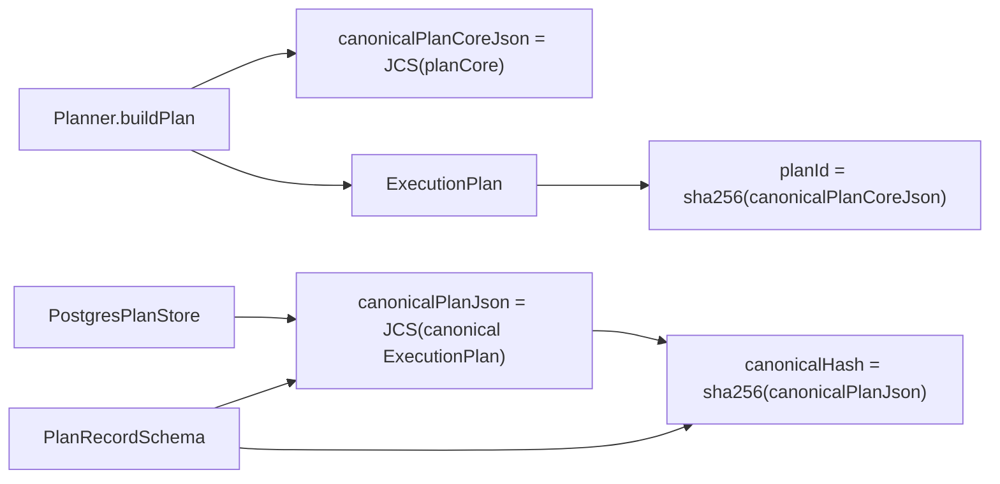
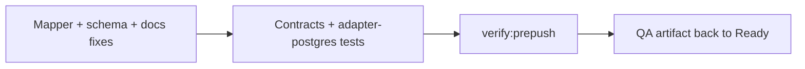

# Execution plan and run execution policy hard QA review

## Summary

This artifact reviews the active slice that introduced `RunExecutionPolicy` and
removed runtime-policy fields from `ExecutionPlan.metadata`.

Update after second-pass remediation:

- `QA-EP-5` is resolved: persisted `canonicalPlanJson` is now
  `JCS(canonical ExecutionPlan)`, so semantically equivalent plans serialize to
  the same stored bytes.
- `QA-EP-6` is resolved: `PlanRecordSchema` now rejects
  `canonicalHash !== sha256(canonicalPlanJson)`.
- `QA-EP-7` is resolved: the active execution-model draft now uses the accepted
  engine-boundary wording.
- `QA-EP-8` is resolved: validation was rerun after the fixes and the repo gate
  is green.

The slice is now closed.

Canonical execution tracking remains in:

- [agent-lane-a.yaml](../../state/agent-lane-a.yaml)
- [ADR-0046](../../../adr/ADR-0046-execution-plan-definition-and-run-execution-policy-separation.md)
- [20260407 execution-plan rationale](20260407-execution-plan-and-run-execution-policy-rationale.md)

This document is the hard QA gate for the current slice.

## Governing Sources

- [governance-document-rule-inventory.md](../../status/governance-document-rule-inventory.md)
- [AGENTS.md](../../../../AGENTS.md)
- [ai-work-protocol.md](../../../guides/ai-work-protocol.md)
- [QA global check prompt](../../templates/qa/TEMPLATE_QA_GLOBAL_CHECK_PROMPT.md)
- [QA current task check prompt](../../templates/qa/TEMPLATE_QA_CURRENT_TASK_CHECK_PROMPT.md)
- [QA artifact example](../../templates/qa/TEMPLATE_QA_ARTIFACT_EXAMPLE.md)
- [ADR-0012](../../../adr/ADR-0012-plan-integrity-ownership.md)
- [ADR-0014](../../../adr/ADR-0014-run-driven-adapter-model.md)
- [ADR-0042](../../../adr/ADR-0042-execution-plan-canonical-identity-unification.md)
- [ADR-0043](../../../adr/ADR-0043-plan-record-plan-store-and-artifacts-ownership.md)
- [ADR-0046](../../../adr/ADR-0046-execution-plan-definition-and-run-execution-policy-separation.md)
- [ExecutionPlan.v1.ts](../../../../packages/@dvt/contracts/src/contracts/planner/ExecutionPlan.v1.ts)
- [RunExecutionPolicy.v1.ts](../../../../packages/@dvt/contracts/src/contracts/engine/RunExecutionPolicy.v1.ts)
- [PlanAssembler.ts](../../../../packages/@dvt/planner/src/domain/PlanAssembler.ts)
- [schemas.ts](../../../../packages/@dvt/contracts/src/schemas.ts)
- [PostgresPlanStore.mappers.ts](../../../../packages/@dvt/adapter-postgres/src/PostgresPlanStore.mappers.ts)

## Findings

### Resolved in this iteration

- Title: persisted canonical plan JSON is now deterministic
  What changed:
  The store mapper now serializes persisted plans with `JCS(canonical
ExecutionPlan)` instead of `JSON.stringify(...)`, and regression coverage now
  proves equivalent nested key ordering yields identical persisted JSON.
  Evidence:
  [PostgresPlanStore.mappers.ts](../../../../packages/@dvt/adapter-postgres/src/PostgresPlanStore.mappers.ts),
  [PostgresPlanStore.invariants.unit.test.ts](../../../../packages/@dvt/adapter-postgres/test/PostgresPlanStore.invariants.unit.test.ts).

- Title: `PlanRecord.canonicalHash` is now enforced
  What changed:
  `PlanRecordSchema` now rejects both non-canonical `canonicalPlanJson` and
  mismatched `canonicalHash`, and contract tests cover the negative paths.
  Evidence:
  [schemas.ts](../../../../packages/@dvt/contracts/src/schemas.ts),
  [validation.test.ts](../../../../packages/@dvt/contracts/test/validation.test.ts).

- Title: active execution-model docs now use the accepted engine-boundary wording
  What changed:
  The active execution-model draft no longer teaches `Engine does not decide`;
  it now matches the accepted engine-boundary rationale.
  Evidence:
  [dvt-execution-model.md](../../execution-model/dvt-execution-model.md).

### Remaining

No open findings remain for the current slice.

## Alignment

- Doc vs code:
  Aligned.
- Promise vs implementation:
  The code now separates `RunExecutionPolicy` from `ExecutionPlan.metadata` and
  uses distinct vocabulary for plan-core hash evidence versus persisted plan
  JSON, with deterministic persistence on both artifacts.
- Tests vs claims:
  Planner-build invariants and plan-record persistence invariants are both
  covered.
- Current truth vs planned truth:
  Current truth matches the intended plan/policy separation.
- Documentation update status:
  Complete for this slice.
- Evidence and risk-doc status when applicable:
  Present for ARC-2.
  Evidence doc exists at
  [ED-20260407-execution-plan-and-run-execution-policy-separation.md](../../../evidence/ED-20260407-execution-plan-and-run-execution-policy-separation.md)
  and risk entry exists at
  [R-20260407-PLAN-POLICY-BOUNDARY-DRIFT.yaml](../../../risk-register/quality/R-20260407-PLAN-POLICY-BOUNDARY-DRIFT.yaml).
  Evidence now calls out `canonicalPlanCoreJson`; the risk entry remains open
  for the broader plan/policy boundary drift rather than for vocabulary drift.

## Architecture Assessment

- SRP:
  Improved at both the planner/engine boundary and the state-store artifact
  seam.
- DDD:
  Better bounded-context ownership between planner and engine, without
  persistence vocabulary leaking across contexts.
- Hexagonal:
  Improved. Engine admission now consumes a separate execution-policy contract.
  Persisted-plan contract enforcement now also lives at the correct port.
- CQRS if relevant:
  Still directionally correct. The planner query artifact is now explicitly
  `plan + executionPolicy + canonicalPlanCoreJson`.
- Complexity:
  Reduced in both public contract language and persisted-plan handling.
- Modularity:
  Good package seams; the persistence seam now has a single enforced owner.

## Test Assessment

- Negative paths present:
  Capability mismatch, plan-ref alignment, and planner-build hash mismatch are
  covered.
- Negative paths missing:
  None specific to the corrected slice.
- Regression status:
  Strong on runtime separation, planner-build invariants, and persisted
  plan-record determinism.
- Determinism:
  Planner determinism remains strong and clearly tested. Persisted plan
  determinism is now also guaranteed at the mapper/parser seam.
- Local suite vs meaningful global confidence:
  Global confidence is now consistent with the package-local and integration
  suites that exercised the contract split.
- Global system view applied:
  Yes. This review compared planner, contracts, engine, API, store, docs, and
  evidence together.
- Harness or shared fixture need:
  A shared artifact fixture for `PlannerBuildResultV1`, `PlanRecord`, and store
  persistence would reduce vocabulary drift.
- Test grouping by type (`unit` / `integration` / `contract` / `e2e` / regression) and rationale:
  Current tests are mostly adequate, but artifact-boundary cases should be
  grouped more explicitly as `contract` regressions because the risk is cross-
  package drift, not local logic failure.

## Quality Gates

- Commands executed:
  - `git diff --stat origin/main...HEAD`
  - `git diff --name-only origin/main...HEAD`
  - `rg -n "executionPolicy|pluginCompatibilityFingerprint|requiresCapabilities|PlanRef|StoredPlanArtifact|canonicalPlanJson|canonicalHash" apps packages docs`
  - targeted file inspections listed in the findings above
  - `pnpm --filter @dvt/contracts build`
  - `pnpm --filter @dvt/contracts test`
  - `pnpm --filter @dvt/adapter-postgres test`
  - `pnpm exec markdownlint-cli2 docs/planning/reviews/architecture-and-governance/20260407-execution-plan-and-run-execution-policy-hard-qa-review.md docs/planning/reviews/review-status-board.md`
  - `pnpm verify:prepush`
- What passed:
  - repository inspection and evidence gathering completed
  - contracts build/tests
  - adapter-postgres tests
  - markdownlint for the QA artifact and board
  - `pnpm verify:prepush`
- What failed:
  - none during this review pass
- What could not be verified:
  - no additional runtime behavior was re-executed in this pass; this review is
    focused on contract/store determinism and active docs

## Unrelated worktree observations

None in this pass.

## Unblock Roadmap

No open unblock roadmap remains for this slice.

## Action Artifact

### Task Checklist

- [x] `QA-EP-5` Canonicalize persisted `ExecutionPlan` JSON before hashing and storage
- [x] `QA-EP-6` Enforce `PlanRecord.canonicalHash === sha256(canonicalPlanJson)`
- [x] `QA-EP-7` Update active execution-model wording for engine boundary truth
- [x] `QA-EP-8` Re-run validation and refresh the QA artifact after closure

### Task Details

#### `QA-EP-5` Canonicalize persisted `ExecutionPlan` JSON before hashing and storage

- Objective: Make persisted plan artifacts deterministic across semantically
  equivalent builds.
- Scope: `toPersistedCanonicalPlanJson`, plan-store hashing, and store
  regression tests.
- Recommended owner: State-store + contracts owners.
- Dependencies: none.
- Documentation impact: update plan-store record docs if persistence format is
  tightened.
- Evidence / risk-doc impact: mention deterministic persisted JSON in evidence.
- Comment with rationale: A plan store cannot call an artifact canonical if its
  bytes change with map insertion order while `planId` remains constant.
- Definition of Done:
  - semantically equivalent `ExecutionPlan` values produce identical persisted
    `canonicalPlanJson`;
  - `canonicalHash` derived from the persisted JSON is stable for equivalent
    builds;
  - an adapter-postgres regression test proves the invariant.
    Status: done.

#### `QA-EP-6` Enforce `PlanRecord.canonicalHash === sha256(canonicalPlanJson)`

- Objective: Turn `canonicalHash` into a real contract invariant.
- Scope: `PlanRecordSchema`, contract tests, and JSON-schema sync tests.
- Recommended owner: Contracts owners.
- Dependencies: `QA-EP-5`.
- Documentation impact: `PlanStoreRecords.v1.md` should list the invariant
  explicitly.
- Evidence / risk-doc impact: evidence should cite the negative-path test.
- Comment with rationale: A hash field that is never checked is decorative
  metadata, not a contract.
- Definition of Done:
  - `parsePlanRecord` rejects mismatched `canonicalHash`;
  - a negative test proves rejection.
    Status: done.

#### `QA-EP-7` Update active execution-model wording for engine boundary truth

- Objective: Remove stale engine-boundary doctrine from active planning docs.
- Scope: `docs/planning/execution-model/dvt-execution-model.md` and any active
  linked references that repeat the same wording.
- Recommended owner: Docs + architecture owners.
- Dependencies: none.
- Documentation impact: direct.
- Evidence / risk-doc impact: none unless the slice widens.
- Comment with rationale: Active docs must not keep a slogan that the
  architecture review has already rejected.
- Definition of Done:
  - the active execution-model doc no longer says `Engine does not decide`;
  - wording matches the accepted engine-boundary rationale;
  - no active doc linked from this slice teaches the stale principle.
    Status: done.

#### `QA-EP-8` Re-run validation and refresh the QA artifact after closure

- Objective: Close the residual gaps with fresh evidence.
- Scope: touched package tests, repo gate, and this QA artifact.
- Recommended owner: Slice owner.
- Dependencies: `QA-EP-5` through `QA-EP-7`.
- Documentation impact: update this artifact and board status.
- Evidence / risk-doc impact: update if the closure changes residual risk.
- Comment with rationale: The slice is not `Ready` until the remaining
  persistence and doc gaps are actually closed, not inferred closed.
- Definition of Done:
  - touched package tests are rerun;
  - `pnpm verify:prepush` is green;
  - this artifact and the board reflect the final status.
    Status: done.

## Mermaid Diagram

### Current-state artifact split with explicit vocabulary

### Unblock sequence

## Validation Baseline For Each Execution Slice

Every correction slice under this artifact should close with:

1. touched-package checks for contracts, planner, engine, adapter-postgres, and
   API as applicable;
2. `pnpm docs:sync` when docs are updated;
3. ARC evidence/risk validation when engine/contracts/adapters are touched;
4. `pnpm verify:prepush`.

## Final Verdict

Ready.
