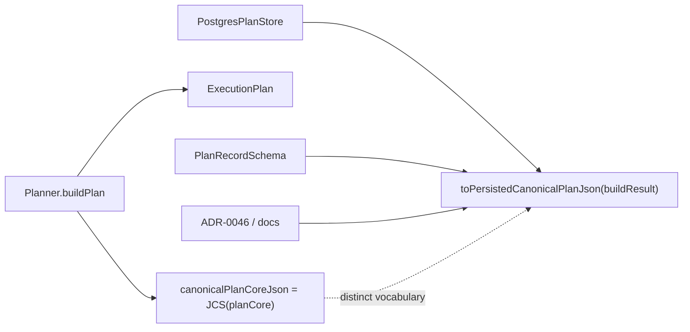
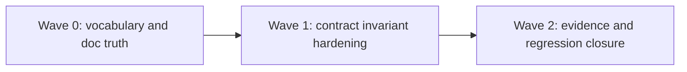

# Execution plan and run execution policy hard QA review

## Summary

This artifact reviews the active slice that introduced `RunExecutionPolicy` and
removed runtime-policy fields from `ExecutionPlan.metadata`.

Update after remediation:

- `QA-EP-1` is resolved: planner hash evidence now uses
  `canonicalPlanCoreJson`, while persisted plan records keep
  `PlanRecord.canonicalPlanJson` for the full `ExecutionPlan`.
- `QA-EP-2` is resolved: active engine/capabilities/frontend alignment docs now
  teach `RunExecutionPolicy` plus `RunContext.targetAdapter`, not retired plan
  metadata fields.
- `QA-EP-3` is resolved: `PlannerBuildResultV1Schema` now enforces that
  `canonicalPlanCoreJson` parses as `PlanCore`, equals `JCS(planCore)`, and
  that `plan.metadata.planId === sha256(canonicalPlanCoreJson)`.
- `QA-EP-4` is resolved: evidence language and validation baseline were rerun
  after the corrections; the risk entry still stays open for broader boundary
  drift, which is the intended residual posture.
- readiness is now proven by `pnpm validate:contracts`, `pnpm golden:validate`,
  `pnpm docs:status:generate`, and a final green `pnpm verify:prepush`.

Canonical execution tracking remains in:

- [agent-lane-a.yaml](../../state/agent-lane-a.yaml)
- [ADR-0046](../../../adr/ADR-0046-execution-plan-definition-and-run-execution-policy-separation.md)
- [20260407 execution-plan rationale](20260407-execution-plan-and-run-execution-policy-rationale.md)

This document is the hard QA gate for the current slice.

## Governing Sources

- [governance-document-rule-inventory.md](../../status/governance-document-rule-inventory.md)
- [AGENTS.md](../../../../AGENTS.md)
- [ai-work-protocol.md](../../../guides/ai-work-protocol.md)
- [QA global check prompt](../../templates/qa/TEMPLATE_QA_GLOBAL_CHECK_PROMPT.md)
- [QA current task check prompt](../../templates/qa/TEMPLATE_QA_CURRENT_TASK_CHECK_PROMPT.md)
- [QA artifact example](../../templates/qa/TEMPLATE_QA_ARTIFACT_EXAMPLE.md)
- [ADR-0012](../../../adr/ADR-0012-plan-integrity-ownership.md)
- [ADR-0014](../../../adr/ADR-0014-run-driven-adapter-model.md)
- [ADR-0042](../../../adr/ADR-0042-execution-plan-canonical-identity-unification.md)
- [ADR-0043](../../../adr/ADR-0043-plan-record-plan-store-and-artifacts-ownership.md)
- [ADR-0046](../../../adr/ADR-0046-execution-plan-definition-and-run-execution-policy-separation.md)
- [ExecutionPlan.v1.ts](../../../../packages/@dvt/contracts/src/contracts/planner/ExecutionPlan.v1.ts)
- [RunExecutionPolicy.v1.ts](../../../../packages/@dvt/contracts/src/contracts/engine/RunExecutionPolicy.v1.ts)
- [PlanAssembler.ts](../../../../packages/@dvt/planner/src/domain/PlanAssembler.ts)
- [schemas.ts](../../../../packages/@dvt/contracts/src/schemas.ts)
- [PostgresPlanStore.mappers.ts](../../../../packages/@dvt/adapter-postgres/src/PostgresPlanStore.mappers.ts)

## Findings

### Resolved in this iteration

- Title: `canonicalPlanJson` vocabulary split is now explicit
  What changed:
  Planner/build-result contracts, determinism tests, verifier tooling, and the
  active ADR/docs set now use `canonicalPlanCoreJson` for `JCS(planCore)`.
  `PlanRecord.canonicalPlanJson` remains the persisted full `ExecutionPlan`.
  Evidence:
  [ExecutionPlan.v1.ts](../../../../packages/@dvt/contracts/src/contracts/planner/ExecutionPlan.v1.ts:178),
  [schemas.ts](../../../../packages/@dvt/contracts/src/schemas.ts:592),
  [determinism.test.ts](../../../../packages/@dvt/planner/test/unit/determinism.test.ts:47),
  [verify.ts](../../../../packages/@dvt/plan-verifier/src/verify.ts:7),
  [ADR-0043](../../../adr/ADR-0043-plan-record-plan-store-and-artifacts-ownership.md:168),
  [ADR-0046](../../../adr/ADR-0046-execution-plan-definition-and-run-execution-policy-separation.md:88),
  and [PlanStoreRecords.v1.md](../../../contracts/planner/PlanStoreRecords.v1.md:34).

- Title: `PlannerBuildResultV1` now enforces the plan-core invariant
  What changed:
  `PlannerBuildResultV1Schema` now reparses `canonicalPlanCoreJson` as
  `PlanCore`, rejects mismatches against the returned `plan`, and rejects
  `planId` values that do not match `sha256(canonicalPlanCoreJson)`.
  Negative regression coverage was added at the contract layer, including hash
  vectors and schema-level rejection.
  Evidence:
  [schemas.ts](../../../../packages/@dvt/contracts/src/schemas.ts:592) and
  [planner.contract.test.ts](../../../../packages/@dvt/contracts/test/planner.contract.test.ts:163),
  [sha256HexUtf8.test.ts](../../../../packages/@dvt/contracts/test/sha256HexUtf8.test.ts:1).

- Title: Normative-looking engine capability docs still describe removed fields
  What changed:
  Active engine/capability docs now reference `RunExecutionPolicy` for
  capability requirements and `RunContext.targetAdapter` for adapter
  selection.
  Evidence:
  [IWorkflowEngine.reference.v1.md](../../../architecture/engine/contracts/engine/IWorkflowEngine.reference.v1.md),
  [capabilities/README.md](../../../architecture/engine/contracts/capabilities/README.md),
  and
  [FRONTEND_PLAN_BACK_ALIGNMENT.md](../../../../apps/web/FRONTEND_PLAN_BACK_ALIGNMENT.md).

- Title: Adjacent frontend alignment docs still show `requiresCapabilities` on `PlanRef`
  What changed:
  The frontend alignment doc no longer teaches `PlanRef.requiresCapabilities`.

### Remaining

No open findings remain for the current slice.

## Alignment

- Doc vs code:
  Aligned. Planner/store vocabulary and active engine/capability docs now
  describe the shipped `RunExecutionPolicy` model.
- Promise vs implementation:
  The code now separates `RunExecutionPolicy` from `ExecutionPlan.metadata` and
  uses distinct vocabulary for plan-core hash evidence versus persisted plan
  JSON.
- Tests vs claims:
  Tests and active planner/store docs now agree on the split between
  `canonicalPlanCoreJson` and `PlanRecord.canonicalPlanJson`.
- Current truth vs planned truth:
  Current truth matches the intended plan/policy separation.
- Documentation update status:
  Complete for this slice.
- Evidence and risk-doc status when applicable:
  Present for ARC-2.
  Evidence doc exists at
  [ED-20260407-execution-plan-and-run-execution-policy-separation.md](../../../evidence/ED-20260407-execution-plan-and-run-execution-policy-separation.md)
  and risk entry exists at
  [R-20260407-PLAN-POLICY-BOUNDARY-DRIFT.yaml](../../../risk-register/quality/R-20260407-PLAN-POLICY-BOUNDARY-DRIFT.yaml).
  Evidence now calls out `canonicalPlanCoreJson`; the risk entry remains open
  for the broader plan/policy boundary drift rather than for vocabulary drift.

## Architecture Assessment

- SRP:
  Improved at both the runtime-policy boundary and the planner/store artifact
  vocabulary boundary.
- DDD:
  Better bounded-context ownership between planner and engine, without
  persistence vocabulary leaking across contexts.
- Hexagonal:
  Improved. Engine admission now consumes a separate execution-policy contract.
  The remaining weakness is contract language, not port placement.
- CQRS if relevant:
  Still directionally correct. The planner query artifact is now explicitly
  `plan + executionPolicy + canonicalPlanCoreJson`.
- Complexity:
  Reduced in both code and active public contract language.
- Modularity:
  Good package seams; terminology seam corrected for the active slice.

## Test Assessment

- Negative paths present:
  Capability mismatch and plan-ref alignment checks are covered.
- Negative paths missing:
  None specific to the corrected slice.
- Regression status:
  Strong on runtime separation and artifact-language consistency.
- Determinism:
  Planner determinism remains strong and clearly tested.
- Local suite vs meaningful global confidence:
  Global confidence is now consistent with the package-local and integration
  suites that exercised the contract split.
- Global system view applied:
  Yes. This review compared planner, contracts, engine, API, store, docs, and
  evidence together.
- Harness or shared fixture need:
  A shared artifact fixture for `PlannerBuildResultV1`, `PlanRecord`, and store
  persistence would reduce vocabulary drift.
- Test grouping by type (`unit` / `integration` / `contract` / `e2e` / regression) and rationale:
  Current tests are mostly adequate, but artifact-boundary cases should be
  grouped more explicitly as `contract` regressions because the risk is cross-
  package drift, not local logic failure.

## Quality Gates

- Commands executed:
  - `git diff --stat origin/main...HEAD`
  - `git diff --name-only origin/main...HEAD`
  - `rg -n "executionPolicy|pluginCompatibilityFingerprint|requiresCapabilities|PlanRef|StoredPlanArtifact|canonicalPlanJson" apps packages docs/adr/ADR-0046-execution-plan-definition-and-run-execution-policy-separation.md`
  - targeted file inspections listed in the findings above
  - `pnpm --filter @dvt/contracts test`
  - `pnpm --filter @dvt/contracts build`
  - `pnpm validate:contracts`
  - `pnpm --filter @dvt/planner test`
  - `pnpm --filter @dvt/planner build`
  - `pnpm --filter @dvt/plan-verifier test`
  - `pnpm --filter @dvt/plan-verifier build`
  - `pnpm --filter dvt-api test`
  - `pnpm docs:sync`
  - `pnpm verify:prepush`
- What passed:
  - repository inspection and evidence gathering completed
  - contracts/planner/verifier/API validation commands
  - `pnpm validate:contracts`
  - `pnpm golden:validate`
  - `pnpm docs:status:generate`
  - `pnpm docs:sync`
  - `pnpm verify:prepush`
- What failed:
  - none in the final rerun recorded by this artifact
- What could not be verified:
  - no additional runtime behavior was re-executed in this review; this artifact
    is based on code, docs, tests, previously recorded validation evidence, and
    the final readiness gate rerun

## Unrelated worktree observations

- `apps/api/test/application/services/PlannerBackedStartRunUseCase.test.ts`
  and `packages/@dvt/planner/examples/dbt-workflow.ts` required Prettier-only
  cleanup to satisfy the branch-wide `verify:prepush` gate. That formatting
  cleanup was incidental to this slice and did not change behavior.

## Unblock Roadmap

### Wave 0 - Truth and documentation baseline

Tasks: `QA-EP-1`, `QA-EP-2`

Target:

- one meaning for `canonicalPlanJson` exists across planner, contracts, store,
  ADRs, and evidence;
- active reference docs no longer describe retired `ExecutionPlan.metadata`
  policy fields;
- evidence and rationale documents describe the actual contract truth.

### Wave 1 - Boundary and ownership hardening

Tasks: `QA-EP-3`

Target:

- planner/build-result contracts enforce the chosen invariant;
- store persistence, plan records, and verifier tooling use one stable
  vocabulary.

### Wave 2 - Regression closure

Tasks: `QA-EP-4`

Target:

- cross-package contract regressions fail fast;
- docs and evidence remain aligned with implementation.

## Action Artifact

### Task Checklist

- [x] `QA-EP-1` Unify `canonicalPlanJson` vocabulary across planner, store, and docs
- [x] `QA-EP-2` Update active contract-reference docs to the `RunExecutionPolicy` model
- [x] `QA-EP-3` Add missing contract invariants and regression tests
- [x] `QA-EP-4` Refresh evidence/risk docs and close with validation evidence

### Task Details

#### `QA-EP-1` Unify `canonicalPlanJson` vocabulary across planner, store, and docs

- Objective: Remove the dual meaning of `canonicalPlanJson`.
- Scope: planner contracts, plan-store docs, ADR-0043, ADR-0046, evidence doc,
  and store mapper naming.
- Recommended owner: Contracts + planner + state-store owners.
- Dependencies: none.
- Documentation impact: direct.
- Evidence / risk-doc impact: update both ARC documents for the slice.
- Comment with rationale: A field name with two incompatible meanings is not a
  naming nit; it is a broken boundary contract.
- Definition of Done:
  - one repository-wide definition of `canonicalPlanJson` exists;
  - the other artifact is renamed or explicitly removed;
  - docs, schemas, and store code use the same term for the same artifact.

#### `QA-EP-2` Update active contract-reference docs to the `RunExecutionPolicy` model

- Objective: Remove active docs that still teach runtime policy on
  `ExecutionPlan.metadata`.
- Scope: engine contract reference docs, capabilities docs, and adjacent
  backend-alignment docs.
- Recommended owner: Docs + engine/contracts owners.
- Dependencies: `QA-EP-1` for terminology.
- Documentation impact: direct.
- Evidence / risk-doc impact: mention the doc closure in evidence.
- Comment with rationale: A slice that changes contracts but leaves active
  reference docs stale is not done; it only moved the drift.
- Definition of Done:
  - active docs no longer mention retired policy fields on
    `ExecutionPlan.metadata`;
  - `RunExecutionPolicy` and `RunContext.targetAdapter` are the taught path;
  - stale examples are removed or explicitly marked historical.

#### `QA-EP-3` Add missing contract invariants and regression tests

- Objective: Make the plan/policy split fail fast when a producer violates it.
- Scope: `PlannerBuildResultV1Schema`, planner contract tests, plan-store
  contract tests, and any verifier fixtures touched by the chosen vocabulary.
- Recommended owner: Contracts + planner owners.
- Dependencies: `QA-EP-1`.
- Documentation impact: minimal, but examples should mirror the invariant.
- Evidence / risk-doc impact: evidence doc should cite the new regression tests.
- Comment with rationale: The public contract is only as strong as the invariant
  it actually enforces.
- Definition of Done:
  - schema enforces the chosen canonical JSON invariant;
  - at least one negative contract test proves mismatch rejection;
  - store persistence and planner output are covered by the same terminology.

#### `QA-EP-4` Refresh evidence/risk docs and close with validation evidence

- Objective: Make the governed slice evidence truthful after the corrections.
- Scope: current ARC evidence/risk docs and final validation evidence.
- Recommended owner: Slice owner.
- Dependencies: `QA-EP-1` through `QA-EP-3`.
- Documentation impact: direct.
- Evidence / risk-doc impact: direct.
- Comment with rationale: ARC evidence that describes the wrong artifact shape
  weakens governance and misleads later reviews.
- Definition of Done:
  - evidence doc reflects the final artifact vocabulary;
  - risk entry reflects the residual drift risk accurately;
  - validation evidence is rerun and recorded.

## Mermaid Diagram

### Current-state artifact split with explicit vocabulary

### Unblock sequence

## Validation Baseline For Each Execution Slice

Every correction slice under this artifact should close with:

1. touched-package checks for contracts, planner, engine, adapter-postgres, and
   API as applicable;
2. `pnpm docs:sync` when docs are updated;
3. ARC evidence/risk validation when engine/contracts/adapters are touched;
4. `pnpm verify:prepush`.

## Final Verdict

Ready.
