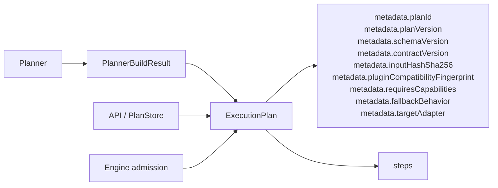
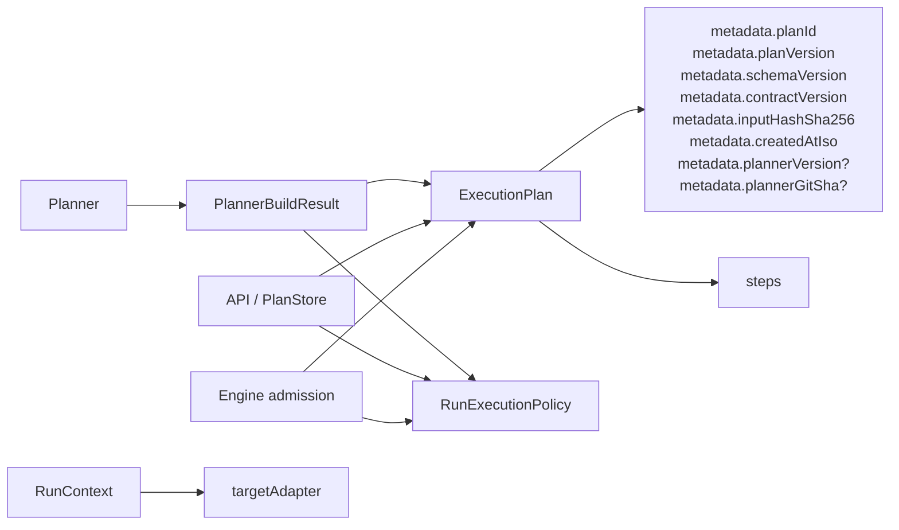

# Execution plan and run execution policy rationale

## Scope

This rationale explains the decision accepted in
[ADR-0046](../../../adr/ADR-0046-execution-plan-definition-and-run-execution-policy-separation.md).

The question is narrow:

- what belongs to the canonical planner-owned `ExecutionPlan`
- what belongs to the engine-owned execution-policy boundary

This document does not reopen the signal-ownership decision or the event-model
decision.

## Problem summary

The repository already has the right identity rule:

- `planId` is derived from `PlanCore`

Before this slice, the public `ExecutionPlan` also carried
runtime-compatibility and admission fields in
[ExecutionPlan.v1.ts](../../../../packages/@dvt/contracts/src/contracts/planner/ExecutionPlan.v1.ts).

That means one public artifact changes for two unrelated reasons:

- planner topology or deterministic definition changed
- engine runtime policy changed

That is a boundary smell.

## Pre-slice state that motivated ADR-0046

That was the problem state. It is not the current implementation.

The problem was not that planner, API, and engine shared one public plan type.
`ADR-0042` was right about that.

The problem was that the shared type mixed ownership.

## Implemented target state

The core rule is:

- plan definition and plan identity stay together
- runtime compatibility and admission policy move out
- dispatch target stays on `RunContext`

## Field-by-field ownership

| Field                            | Pre-slice location       | Implemented location                | Decision                                  |
| -------------------------------- | ------------------------ | ----------------------------------- | ----------------------------------------- |
| `planId`                         | `ExecutionPlan.metadata` | `ExecutionPlan.metadata`            | keep on plan                              |
| `planVersion`                    | `ExecutionPlan.metadata` | `ExecutionPlan.metadata`            | keep on plan                              |
| `schemaVersion`                  | `ExecutionPlan.metadata` | `ExecutionPlan.metadata`            | keep on plan                              |
| `contractVersion`                | `ExecutionPlan.metadata` | `ExecutionPlan.metadata`            | keep on plan                              |
| `inputHashSha256`                | `ExecutionPlan.metadata` | `ExecutionPlan.metadata`            | keep on plan                              |
| `createdAtIso`                   | `ExecutionPlan.metadata` | `ExecutionPlan.metadata`            | keep on plan                              |
| `plannerVersion`                 | `ExecutionPlan.metadata` | `ExecutionPlan.metadata`            | keep on plan                              |
| `plannerGitSha`                  | `ExecutionPlan.metadata` | `ExecutionPlan.metadata`            | keep on plan                              |
| `pluginCompatibilityFingerprint` | `ExecutionPlan.metadata` | `RunExecutionPolicy`                | move to policy                            |
| `requiresCapabilities`           | `ExecutionPlan.metadata` | `RunExecutionPolicy`                | move to policy                            |
| `fallbackBehavior`               | `ExecutionPlan.metadata` | removed from active shared contract | remove until real runtime semantics exist |
| `targetAdapter`                  | `ExecutionPlan.metadata` | `RunContext.targetAdapter`          | do not duplicate on plan                  |

## Why this is the right cut

### Fowler-aligned rationale

This split follows four standard architecture moves:

1. `Separated Interface`
   - the planner publishes a definition contract
   - the engine consumes a separate admission-policy contract

2. `Identity Field`
   - plan identity comes from plan definition only

3. `Published Language`
   - one public type should name one thing

4. `Service Layer`
   - planner defines
   - engine governs execution admission

The anti-pattern is one object changing for multiple reasons.

### Comparison with mature systems

Temporal:

- workflow definition and input are not the same thing as worker runtime policy
- task queues and worker/runtime constraints do not belong on the workflow
  definition itself

Step Functions:

- state-machine definition is the canonical artifact
- execution/deployment concerns are outside the definition

Airflow:

- DAG definition is distinct from scheduler/executor policy
- mixing them creates portability and debugging problems

Conductor:

- workflow definition is not the same thing as execution controls or worker
  assignment

These systems differ in product shape, but they all separate definition from
operation.

## Rejected alternatives

### A. Keep everything on `ExecutionPlan`

Rejected because:

- planner-owned and engine-owned concerns keep drifting on one contract
- a policy change keeps looking like a plan change
- review and testing scope stay ambiguous

### B. Create a heavyweight persisted `ExecutionEnvelope`

Rejected because:

- the repository does not need two heavyweight canonical artifacts
- `ADR-0043` already fixed the canonical plan-store direction
- it solves the smell by overbuilding

### C. Put `targetAdapter` on `RunExecutionPolicy`

Rejected because:

- runtime dispatch target is already owned by `RunContext`
- duplicating it in policy would recreate drift in a new place

### D. Keep runtime policy on `PlanRef`

Rejected for the target architecture because:

- `PlanRef` should reference plan identity and integrity, not admission policy
- it preserves the same ownership smell one layer later

## Implementation posture

The correct implementation is not a giant migration artifact.

It is a narrow cut:

1. shrink `ExecutionPlan`
2. publish `RunExecutionPolicy`
3. have planner emit both
4. persist policy as sidecar metadata
5. make engine admission consume verified plan plus policy

That keeps the canonical plan artifact singular while fixing ownership.

## Acceptance criteria

- no runtime-compatibility fields remain on `ExecutionPlan.metadata`
- `PlannerBuildResultV1` exposes `executionPolicy`
- `PlanRef` carries plan identity and integrity only
- engine capability and compatibility checks consume `RunExecutionPolicy`
- stored-plan persistence proves that the plan artifact remains singular while
  execution policy is persisted separately

## References

- [ADR-0046](../../../adr/ADR-0046-execution-plan-definition-and-run-execution-policy-separation.md)
- [ADR-0042](../../../adr/ADR-0042-execution-plan-canonical-identity-unification.md)
- [ADR-0043](../../../adr/ADR-0043-plan-record-plan-store-and-artifacts-ownership.md)
- [20260407 engine boundary review](./20260407-engine-boundary-current-target-and-migration-review.md)
