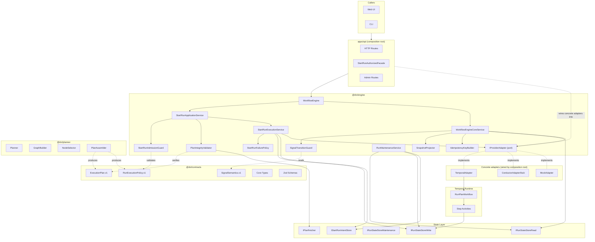
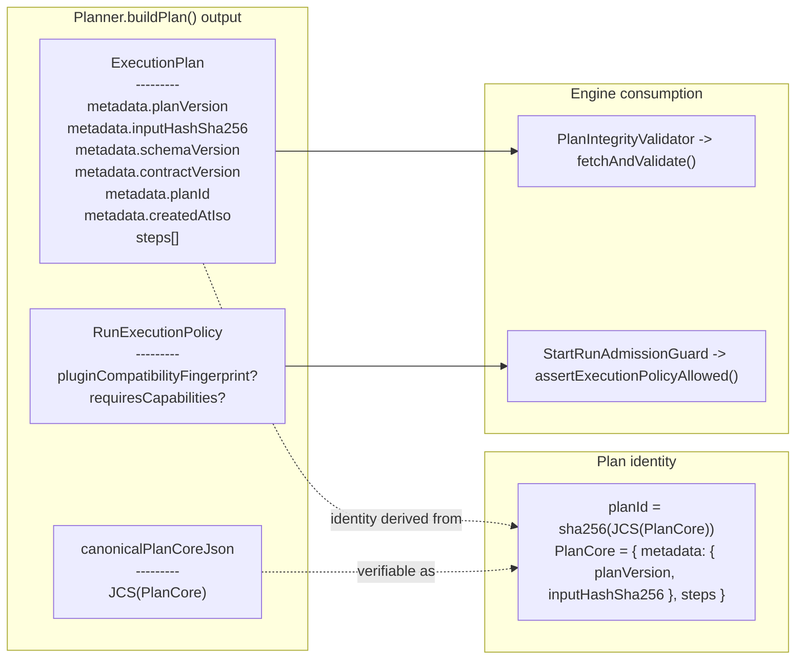
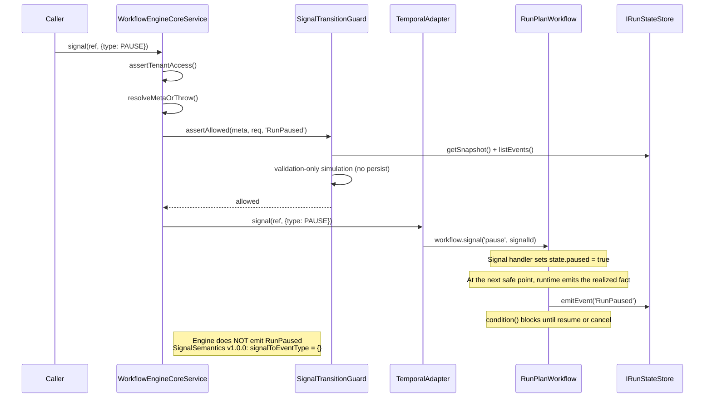
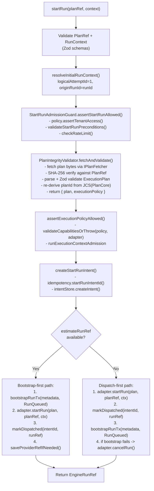

# Principal Architecture Review - Progress, Effort, and Diagrams

Companion to the 2026-04-07 principal architecture review. This document is a
status and rationale companion only. It does not override ADRs, contracts, or
the generated planning surfaces. It is updated here to reflect the current
repository working state as of 2026-04-08.

## 1. Global Effort Summary

### Lane verification snapshot

Source of truth: [Execution Workboard](../../state/execution-workboard.md).

| Lane      | Scope                              | Tasks   | Total effort | Completed weighted pts | Progress                    | Verified on |
| --------- | ---------------------------------- | ------- | ------------ | ---------------------- | --------------------------- | ----------- |
| A         | Contracts and state-store boundary | 82      | 279          | 167.15                 | **60%**                     | 2026-04-07  |
| B         | Event contract and traceability    | 20      | 79           | 52.6                   | **67%**                     | 2026-04-05  |
| C         | Runtime safety and admission       | 35      | 132          | 50.3                   | **38%**                     | 2026-04-05  |
| D         | Scale and go-to-market             | 26      | 135          | 30                     | **22%**                     | 2026-04-04  |
| E         | Frontend and UI                    | 58      | 205          | 71.17                  | **35%**                     | 2026-04-07  |
| **Total** |                                    | **221** | **830**      | **371.22**             | **44.7% weighted complete** |             |

### Progress visualization

```text
Weighted completion across all lanes (830 total effort)
======================================================
Complete [####################.........................] 371.22 pts (44.7%)
Open     [.............................................] 458.78 pts (55.3%)
======================================================
```

### Lane completion comparison

```text
Lane completion by verified workboard progress
Lane A [##################............] 60%
Lane B [####################..........] 67%
Lane C [###########...................] 38%
Lane D [######........................] 22%
Lane E [##########....................] 35%
```

## 2. Review Draft vs Current Main

### Current merged commits that changed the architecture posture

The initial 2026-04-07 working session produced intermediate local SHAs that
were later rebased. This table records the current merged refs on `origin/main`
that matter for the review conclusions.

| Commit     | Scope     | Architecture impact                                                                                          |
| ---------- | --------- | ------------------------------------------------------------------------------------------------------------ |
| `a7a116eb` | contracts | Hardened `ExecutionPlan` / `RunExecutionPolicy` separation and contract invariants.                          |
| `7f1cd325` | engine    | Codified `startRun` and signal lifecycle boundaries; `PAUSE` / `RESUME` realized lifecycle is runtime-owned. |
| `6778d4ba` | web       | Moved frontend runtime capability ownership toward a governed composition root.                              |
| `fcec05ce` | web       | Hardened frontend runtime seam boundaries.                                                                   |
| `a458af75` | web       | Removed duplicate mock workspace paths; reduced composition drift.                                           |
| `c6d20450` | docs      | Reconciled active documentation architecture surfaces with current code.                                     |
| `b9bf4576` | engine    | Narrowed `RETRY_STEP` out of the canonical signal boundary and codified the separate-use-case direction.     |
| `0df3dda3` | web       | Hardened Root provider ownership guard.                                                                      |

### Concrete review deltas now true in the current working tree

- `ExecutionPlan` vs `RunExecutionPolicy`
  - initial review concern: mixed identity and runtime policy fields
  - current merged state: separated; policy is governed independently of plan
    identity
  - status: **Done**
- Signal lifecycle ownership
  - initial review concern: engine and runtime could both imply realized
    lifecycle ownership
  - current merged state: `RunPaused`, `RunResumed`, and `RunCancelled` are
    runtime-owned facts governed by ADR-0047
  - status: **Done**
- `startRun()` protocol clarity
  - initial review concern: reviewers had to reconstruct protocol across
    multiple classes
  - current merged state:
    [StartRunProtocol.v1.md](../../../architecture/components/engine/contracts/engine/StartRunProtocol.v1.md)
    codifies the current protocol end to end
  - status: **Done**
- Operational use of `PlanCore` split
  - initial review concern: needed design clarification
  - current merged state: spike completed; recommendation is not to
    operationalize a separate public `PlanCore` artifact now
  - status: **Done, no implementation**
- `RETRY_STEP` boundary
  - initial review concern: signal surface was wider than the product truth
  - current merged state: `RETRY_STEP` removed from canonical `SignalType`;
    governed by ADR-0048 as a separate engine use case direction
  - status: **Done**
- Engine import boundary enforcement
  - initial review concern: separation was convention-only
  - current merged state: lint now blocks `@dvt/engine/src/**` from importing
    `@dvt/planner` or concrete adapters such as `@dvt/adapter-temporal`
  - status: **Done**
- `RETRY_RUN` ownership
  - initial review concern: canonical signal surface was still wider than
    product truth
  - current merged state: `RETRY_RUN` is now governed by ADR-0049 as a
    dedicated recover-run use case, outside generic `signal(...)`
  - status: **Done**

## 3. Architecture Diagrams - Current State

### 3.1 System boundary diagram (as-built)

The engine depends on `IProviderAdapter` as a port, not on concrete adapters.
Composition roots wire concrete adapters into the provider adapter map. See
[workflow-engine-subsystem-context.md](../../../architecture/components/engine/architecture/workflow-engine-subsystem-context.md)
for the governing boundary rule.



### 3.2 ExecutionPlan / RunExecutionPolicy split



### 3.3 Signal lifecycle ownership



### 3.4 StartRun protocol



## 4. Current Status Of Review Recommendations

| Recommendation | Current status | Governing artifact(s) |

- Codify the existing `startRun()` protocol
  - status: **Done**
  - material:
    [StartRunProtocol.v1.md](../../../architecture/components/engine/contracts/engine/StartRunProtocol.v1.md)
- Move `PAUSE` / `RESUME` realized lifecycle ownership to runtime
  - status: **Done**
  - material:
    [ADR-0047](../../../adr/ADR-0047-runtime-owned-realized-lifecycle-for-signal-driven-transitions.md)
- Keep speculative `SignalTransitionGuard` as validation-only
  - status: **Done**
  - material:
    [ADR-0047](../../../adr/ADR-0047-runtime-owned-realized-lifecycle-for-signal-driven-transitions.md),
    `SignalTransitionGuard` tests
- Spike the operational use of existing `PlanCore` split
  - status: **Done, recommendation is no implementation**
  - material:
    [PlanCore operational consumption design spike](./20260407-plan-core-operational-consumption-design-spike.md)
- Remove `RETRY_STEP` from the canonical signal boundary and document the
  separate use-case direction
  - status: **Done**
  - material:
    [ADR-0048](../../../adr/ADR-0048-retry-step-as-separate-engine-use-case.md)
- Add build-time boundary enforcement for engine imports
  - status: **Done on main**
  - material:
    [reference-architecture.md](../../../architecture/reference-architecture.md),
    [workflow-engine-subsystem-context.md](../../../architecture/components/engine/architecture/workflow-engine-subsystem-context.md),
    `eslint.config.cjs`
- Decide `RETRY_RUN` ownership and product posture
  - status: **Done**
  - material:
    [ADR-0049](../../../adr/ADR-0049-retry-run-as-separate-recovery-use-case.md),
    [ADR-0040](../../../adr/ADR-0040-retry-ownership-and-attempt-authority.md)

## 5. Residual Deviations And Risks

### Still open

| Item                                      | Severity | Current impact                                                    |
| ----------------------------------------- | -------- | ----------------------------------------------------------------- |
| Lane D remains at 22% verified completion | High     | Scale and go-to-market work is still materially blocked or queued |
| Lane C remains at 38% verified completion | Medium   | Runtime resilience and admission follow-through is incomplete     |

### Resolved since the initial 2026-04-07 review draft

| Item                                                                      | Resolution                                                                                                                                                   |
| ------------------------------------------------------------------------- | ------------------------------------------------------------------------------------------------------------------------------------------------------------ |
| Phase 2 executed before a governed protocol write-up existed              | [StartRunProtocol.v1.md](../../../architecture/components/engine/contracts/engine/StartRunProtocol.v1.md) now codifies the implemented protocol              |
| No durable forward rule for signal ownership                              | [ADR-0047](../../../adr/ADR-0047-runtime-owned-realized-lifecycle-for-signal-driven-transitions.md) is accepted and makes runtime ownership the forward rule |
| PlanCore split was still an open design question                          | Spike completed and explicitly recommends no additional public runtime-contract split now                                                                    |
| `RETRY_STEP` inflated the canonical signal surface                        | [ADR-0048](../../../adr/ADR-0048-retry-step-as-separate-engine-use-case.md) narrows it out of `SignalType`                                                   |
| Engine/planner and engine/adapter separation was convention-enforced only | Lint now enforces the engine import boundary on `main`                                                                                                       |

### Next architectural priority implied by the review

1. Continue closing Lane C runtime safety work now that the main signal and start-run boundaries are governed.
2. Keep architecture companion docs synchronized with generated workboard truth rather than hand-maintained point summaries.
3. Decide whether the future recover-run use case should ship as a dedicated command surface or remain roadmap-only.

## References

- [Engine boundary current/target review](./20260407-engine-boundary-current-target-and-migration-review.md)
- [DVT principles and target-state review](./20260407-dvt-principles-boundaries-and-target-state-review.md)
- [Execution plan and policy rationale](./20260407-execution-plan-and-run-execution-policy-rationale.md)
- [StartRun protocol](../../../architecture/components/engine/contracts/engine/StartRunProtocol.v1.md)
- [ADR-0047](../../../adr/ADR-0047-runtime-owned-realized-lifecycle-for-signal-driven-transitions.md)
- [ADR-0048](../../../adr/ADR-0048-retry-step-as-separate-engine-use-case.md)
- [ADR-0049](../../../adr/ADR-0049-retry-run-as-separate-recovery-use-case.md)
- [Execution Workboard](../../state/execution-workboard.md)
- [Lane A YAML](../../state/agent-lane-a.yaml)
- [Lane B YAML](../../state/agent-lane-b.yaml)
- [Lane C YAML](../../state/agent-lane-c.yaml)
- [Lane D YAML](../../state/agent-lane-d.yaml)
- [Lane E YAML](../../state/agent-lane-e.yaml)
