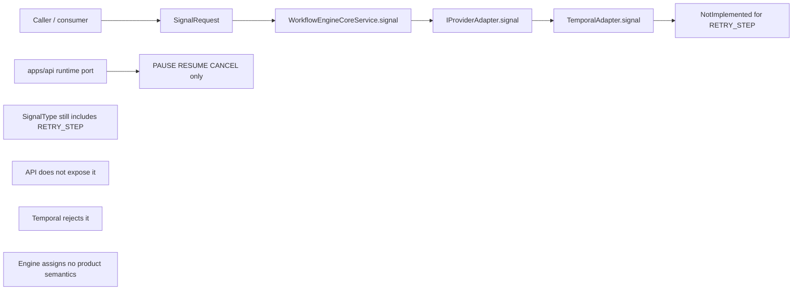
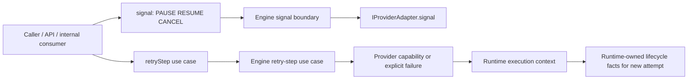

# Retry-step boundary and use-case review

Historical note: this review governs the 2026-04-07 `RETRY_STEP` slice only.
`RETRY_RUN` was intentionally left unchanged here and was later resolved by
`ADR-0049` as a dedicated recover-run use case outside canonical `SignalType`.

## Scope

This review closes one design question before implementation starts:

- `RETRY_STEP` currently exists in canonical `SignalType`.
- The shipped product does not expose or implement it as a real signal.
- The repository needs a stable boundary rule before touching contracts and
  code.

This document does three things:

1. records the current state as built;
2. justifies the target boundary using current repo evidence and mature-system
   reasoning;
3. defines the first clean implementation slice.

## Executive conclusion

`RETRY_STEP` should **not** remain in canonical `SignalType`.

It should be treated as a separate engine/application use case whose
realization may depend on the adapter, but whose semantics do not.

The first implementation slice should therefore be narrow and clean:

1. remove `RETRY_STEP` from canonical signal contracts;
2. remove signal-path code and docs that imply support;
3. keep `RETRY_RUN` unchanged in this slice at that time;
4. defer actual `retryStep(...)` runtime implementation to a later dedicated
   slice.

This is the best decision now because it removes real contract drift without
introducing a partial or fake step-retry implementation.

## Pre-slice state

### Actual repository behavior

Pre-slice evidence:

- [contracts.ts](../../../../packages/@dvt/contracts/src/types/contracts.ts)
  still includes `RETRY_STEP` in `SignalType`.
- [schemas.ts](../../../../packages/@dvt/contracts/src/schemas.ts)
  still validates `RETRY_STEP` as part of `SignalRequestSchema`.
- [runtime.ts](../../../../apps/api/src/application/ports/runtime.ts)
  only exposes `PAUSE`, `RESUME`, and `CANCEL`.
- [TemporalAdapter.ts](../../../../packages/@dvt/adapter-temporal/src/TemporalAdapter.ts)
  throws `NotImplemented` for `RETRY_STEP`.
- [WorkflowEngineCoreService.ts](../../../../packages/@dvt/engine/src/core/WorkflowEngineCoreService.ts)
  accepts `SignalRequest` generically, but does not assign step-retry-specific
  semantics.
- [ADR-0040](../../../adr/ADR-0040-retry-ownership-and-attempt-authority.md)
  explicitly left `RETRY_STEP` unsupported pending a separate decision.

### Root cause

The root cause is not missing code. The root cause is a boundary mismatch.

`RETRY_STEP` was placed in the generic signal vocabulary even though it does not
share the same semantic class as the run-control signals:

- `PAUSE`, `RESUME`, and `CANCEL` are control-plane commands against a running
  workflow;
- `RETRY_STEP` is a step-scoped recovery operation with state, lineage, and
  DAG consequences.

That mismatch created a contract wider than the shipped product and blurred
ownership across engine and adapters.

## Why `RETRY_STEP` is not a canonical signal

### 1. It is not a simple control-plane command

A real step retry needs product rules that the generic signal path does not
express:

- which run states allow it;
- which step states allow it;
- what lineage or attempt metadata changes;
- what happens to downstream work already completed;
- what authorization is required;
- how unsupported providers fail closed.

That is a use case, not just a signal enum member.

### 2. The shipped product already treats it differently

The product surface itself proves the mismatch:

- API does not expose it;
- adapters do not implement it;
- engine tests only prove generic delegation rather than a governed semantic
  path.

Leaving it in `SignalType` makes the contract lie about what the product really
supports.

### 3. Fowler-aligned boundary reasoning

This is a case for a dedicated application command, not a wider generic signal
bucket.

Why:

- it changes for different reasons than run-control signaling;
- it has richer invariants than pause or resume;
- it needs its own admission and lineage rules.

The Fowler-aligned move is to keep the generic signal boundary narrow and model
step retry explicitly when its semantics are actually ready.

### 4. Mature systems do not model task retry as a generic signal by default

Comparable systems separate step-scoped recovery from generic runtime control:

- Airflow treats task clearing or retry as an explicit scheduler operation;
- Step Functions uses redrive or replay-style operations, not a generic signal
  enum shared with pause or resume;
- Temporal keeps technical retries in runtime policy and business recovery in
  explicit workflow logic rather than a universal signal vocabulary.

The common lesson is stable:

- generic control signals stay narrow;
- step-scoped recovery is explicit when it becomes product behavior.

## Options considered

### Option A. Keep `RETRY_STEP` in `SignalType` as deferred

Pros:

- no immediate code churn
- no contract change now

Cons:

- canonical contract remains wider than product surface;
- adapter rejection remains normalized as if it were expected support;
- future consumers can continue binding to a feature that does not exist.

### Option B. Treat `RETRY_STEP` as provider-private only

Pros:

- avoids canonical drift immediately
- keeps runtimes free to expose local recovery commands

Cons:

- no stable product semantics for step retry;
- hard to build UI, RBAC, audit, or lineage around provider-private behavior.

### Option C. Make `RETRY_STEP` a separate engine use case and remove it from `SignalType`

Pros:

- narrows the canonical signal boundary to real control signals;
- preserves the option to build governed step retry later;
- aligns semantics ownership with the engine and realization details with the
  adapter.

Cons:

- requires contract cleanup now;
- pushes the actual step-retry feature into a later slice.

## Selected option

Adopt **Option C**.

## Target state

Historical note: the target state below describes the clean boundary for the
2026-04-07 `RETRY_STEP` slice. `ADR-0049` later narrowed `RETRY_RUN` out of
the generic signal surface as well, so the active canonical signal set is now
`PAUSE`, `RESUME`, and `CANCEL`.

Boundary rules in the target model:

- `SignalType` remains the canonical run-control vocabulary.
- `RETRY_STEP` is not part of that vocabulary.
- If step retry is introduced later, it is expressed as a separate use case.
- The engine owns step-retry semantics.
- The adapter owns realization mechanics.
- Realized lifecycle facts for the new attempt remain runtime-owned.

## Development decision for this slice

This slice should implement only the clean narrowing work.

### In scope now

- remove `RETRY_STEP` from canonical signal contracts;
- remove `RETRY_STEP` signal literals and dead branches from adapter/runtime
  signal code;
- update active docs so they no longer describe `RETRY_STEP` as a signal;
- add regression tests proving `RETRY_STEP` is not accepted through
  `parseSignalRequest`.

### Explicitly out of scope now

- adding a new public `retryStep(...)` API surface;
- step-retry runtime realization;
- step-retry lineage persistence;
- provider capability negotiation for step retry;
- any change to `RETRY_RUN` in this slice at the time of acceptance; that
  residual boundary was later closed by `ADR-0049`.

## Implemented outcome

This slice implements the contract-narrowing path described above:

1. `RETRY_STEP` is removed from canonical `SignalType`.
2. `SignalRequest` no longer carries step-scoped retry payload.
3. Adapter signal handling no longer advertises or switches on `RETRY_STEP`.
4. Active signal and execution docs are updated to point future step retry to a
   dedicated engine use case rather than the generic signal boundary.

## Impact analysis

### Contracts

Change now:

- remove `RETRY_STEP` from `SignalType` and `SignalTypeSchema`
- keep `RETRY_RUN` unchanged in this slice at the time

Expected impact:

- consumer compile errors reveal any remaining stale bindings;
- `SignalSemantics` remains consistent because it already derives no event for
  `RETRY_STEP`.

### Engine

Change now:

- remove signal-path code that explicitly handles `RETRY_STEP`
- keep `RETRY_RUN` behavior unchanged in this slice at the time

Expected impact:

- narrower signal switch statements
- no runtime behavior loss because `RETRY_STEP` was not implemented

### Adapters

Change now:

- remove dead `RETRY_STEP` signal branches from Temporal signal handling
- no provider-private step retry implementation is introduced in this slice

Expected impact:

- less dead code
- same runtime behavior for shipped product

### API

Change now:

- likely none, because API already excludes `RETRY_STEP`

Expected impact:

- documentation and contract alignment only

## First implementation slice

1. `@dvt/contracts`
   - narrow `SignalType`
   - narrow `SignalTypeSchema`
   - update validation tests
   - update signal semantics tests

2. `@dvt/engine`
   - remove any signal-path logic that implies `RETRY_STEP`
   - keep `RETRY_RUN` untouched

3. `@dvt/adapter-temporal`
   - remove dead `RETRY_STEP` signal branch

4. docs
   - update active signal and execution-contract docs
   - update planning/task status for the slice

## Risks and mitigations

| Risk                                                  | Effect                                       | Mitigation                                                                                        |
| ----------------------------------------------------- | -------------------------------------------- | ------------------------------------------------------------------------------------------------- |
| stale docs continue teaching `RETRY_STEP` as a signal | contract drift returns through documentation | update active docs in the same slice                                                              |
| hidden consumer usage of `RETRY_STEP` exists          | compile or test break                        | let the contract narrowing fail loudly and fix all real usages                                    |
| step retry gets delayed indefinitely                  | product feature remains absent               | treat the later use-case slice as a deliberate feature slice instead of hiding it in `SignalType` |

## Acceptance decision

This review provides enough design detail to proceed with implementation.

The repository should **not** start by adding a partial `retryStep()` API.
It should start by removing the stale `RETRY_STEP` signal claim.

That is the smallest clean move and the one most aligned with the real product
state today.

## References

- [ADR-0040](../../../adr/ADR-0040-retry-ownership-and-attempt-authority.md)
- [ADR-0047](../../../adr/ADR-0047-runtime-owned-realized-lifecycle-for-signal-driven-transitions.md)
- [contracts.ts](../../../../packages/@dvt/contracts/src/types/contracts.ts)
- [schemas.ts](../../../../packages/@dvt/contracts/src/schemas.ts)
- [WorkflowEngineCoreService.ts](../../../../packages/@dvt/engine/src/core/WorkflowEngineCoreService.ts)
- [TemporalAdapter.ts](../../../../packages/@dvt/adapter-temporal/src/TemporalAdapter.ts)
- [runtime.ts](../../../../apps/api/src/application/ports/runtime.ts)
