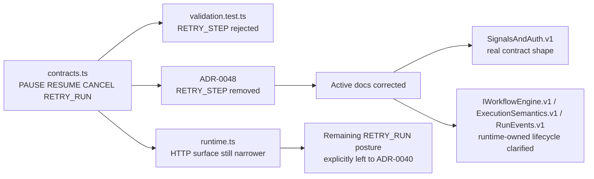

# Retry-step boundary hard QA review

## Summary

This artifact is the hard QA gate for the 2026-04-07 slice that narrowed
`RETRY_STEP` out of canonical `SignalType`.

Canonical execution tracking remains in:

- [agent-lane-a.yaml](../../state/agent-lane-a.yaml)
- [20260407 Retry-step boundary and use-case review](20260407-retry-step-boundary-and-use-case-review.md)

The original blockers identified in this QA pass were corrected in the same
slice. The review now closes as `Ready`.

## Markdown Artifact Path Suggestion

- `docs/planning/reviews/architecture-and-governance/20260407-retry-step-boundary-hard-qa-review.md`

## Governing Sources

- [governance-document-rule-inventory.md](../../status/governance-document-rule-inventory.md)
- [AGENTS.md](C:/dvt/AGENTS.md)
- [ai-work-protocol.md](C:/dvt/docs/guides/ai-work-protocol.md)
- [TEMPLATE_QA_CURRENT_TASK_CHECK_PROMPT.md](../../templates/qa/TEMPLATE_QA_CURRENT_TASK_CHECK_PROMPT.md)
- [TEMPLATE_QA_ARTIFACT_EXAMPLE.md](../../templates/qa/TEMPLATE_QA_ARTIFACT_EXAMPLE.md)
- [ADR-0040](C:/dvt/docs/adr/ADR-0040-retry-ownership-and-attempt-authority.md)
- [ADR-0047](C:/dvt/docs/adr/ADR-0047-runtime-owned-realized-lifecycle-for-signal-driven-transitions.md)
- [ADR-0048](C:/dvt/docs/adr/ADR-0048-retry-step-as-separate-engine-use-case.md)
- [contracts.ts](C:/dvt/packages/@dvt/contracts/src/types/contracts.ts)
- [runtime.ts](C:/dvt/apps/api/src/application/ports/runtime.ts)

## Findings

No critical findings remain in the reviewed slice.

### Residual note

- `RETRY_RUN` still remains outside the shipped HTTP/API runtime surface.
  That is not a regression from this slice and remains governed separately by
  [ADR-0040](C:/dvt/docs/adr/ADR-0040-retry-ownership-and-attempt-authority.md).

## Alignment

- Doc vs code:
  aligned for the reviewed boundary after the corrective docs pass.
- Promise vs implementation:
  the slice now accurately claims only `RETRY_STEP` narrowing, not full signal
  parity across every transport surface.
- Tests vs claims:
  scoped contract and engine tests support the narrowing slice, and doc truth is
  now consistent with the shipped contract.
- Current truth vs planned truth:
  current truth is explicit: canonical engine signals are `PAUSE`, `RESUME`,
  `CANCEL`, `RETRY_RUN`; `RETRY_STEP` is not canonical.
- Documentation update status:
  corrected.
- Evidence and risk-doc status when applicable:
  present and updated.

## Architecture Assessment

- SRP:
  good; the slice remains a contract-boundary narrowing, not a behavior splice.
- DDD:
  good; step retry is treated as a richer application use case rather than a
  generic signal verb.
- Hexagonal:
  improved; the signal boundary is narrower and more explicit.
- CQRS if relevant:
  not materially affected.
- Complexity:
  reduced at the contract boundary.
- Modularity:
  improved; docs no longer advertise speculative signal verbs as active contract
  truth.

## Test Assessment

- Negative paths present:
  yes; contract validation rejects `RETRY_STEP`, and engine idempotency vectors
  reflect the narrowed signal set.
- Negative paths missing:
  none identified for this slice.
- Regression status:
  green in scoped validations.
- Determinism:
  no determinism regression detected in the reviewed scope.
- Local suite vs meaningful global confidence:
  adequate for this docs-and-contract narrowing slice.
- Global system view applied:
  yes; the review covered code contract, API surface, ADRs, evidence, and active
  contract docs.
- Harness or shared fixture need:
  none beyond existing suites.
- Test grouping by type (`unit` / `integration` / `contract` / `e2e` /
  regression) and rationale:
  existing `contract` and `unit/regression` coverage is appropriate here.

## Quality Gates

- Commands executed:
  - `pnpm --filter @dvt/contracts test -- test/validation.test.ts test/signalSemantics.test.ts`
  - `pnpm --filter @dvt/engine test -- test/idempotency.vectors.test.ts test/core/WorkflowEngineCoreService.test.ts`
  - `pnpm exec markdownlint-cli2 docs/architecture/engine/contracts/engine/IWorkflowEngine.v1.md docs/architecture/engine/contracts/engine/SignalsAndAuth.v1.md docs/architecture/engine/contracts/engine/ExecutionSemantics.v1.md docs/architecture/engine/contracts/engine/RunEvents.v1.md docs/adr/ADR-0048-retry-step-as-separate-engine-use-case.md docs/evidence/ED-20260407-retry-step-boundary-narrowing.md docs/planning/reviews/architecture-and-governance/20260407-retry-step-boundary-hard-qa-review.md docs/planning/reviews/review-status-board.md`
  - `pnpm verify:prepush`
- What passed:
  - scoped `@dvt/contracts` tests
  - scoped `@dvt/engine` tests
  - markdown lint for touched docs
  - `pnpm verify:prepush`
- What failed:
  - none in the final validated state
- What could not be verified:
  - no separate API runtime behavior changed in this slice

## Mermaid Diagram

### Current-State Confirmation

## Action Artifact

### Task Checklist

- [x] `QA-RS-1` Align touched v1 engine contract docs with ADR-0047 ownership truth
- [x] `QA-RS-2` Rewrite `SignalsAndAuth.v1.md`
- [x] `QA-RS-3` Correct ADR-0048 and evidence wording about shipped-surface parity
- [x] `QA-RS-4` Re-run docs validation and close the slice

### Task Details

#### `QA-RS-1` Align touched v1 engine contract docs with ADR-0047 ownership truth

- Objective: Remove stale engine-owned lifecycle claims from active v1 docs.
- Scope: `IWorkflowEngine.v1.md`, `ExecutionSemantics.v1.md`, `RunEvents.v1.md`.
- Recommended owner: Engine/contracts docs owner.
- Dependencies: `ADR-0047`.
- Documentation impact: Active contract docs reflect runtime-owned realized lifecycle facts.
- Evidence / risk-doc impact: None beyond slice evidence alignment.
- Comment with rationale: Reviewers must not have to mentally override active docs with newer ADRs.
- Definition of Done:
  - touched v1 docs stop attributing `RunPaused`, `RunResumed`, and `RunCancelled` to engine append ownership;
  - docs point to runtime-owned lifecycle truth;
  - no contradictory producer-path guidance remains in active v1 surfaces.

#### `QA-RS-2` Rewrite `SignalsAndAuth.v1.md`

- Objective: Replace speculative signal guidance with the real canonical signal contract.
- Scope: `SignalsAndAuth.v1.md`.
- Recommended owner: Engine/contracts docs owner.
- Dependencies: `ADR-0048`, current `@dvt/contracts` signal types.
- Documentation impact: Request shape, supported signals, and non-canonical commands are explicit.
- Evidence / risk-doc impact: None beyond slice evidence alignment.
- Comment with rationale: An active contract doc that advertises unsupported verbs is a governance defect, not a harmless draft.
- Definition of Done:
  - canonical signal list matches code;
  - `SignalRequest` shape matches code;
  - speculative commands are removed or explicitly out of scope;
  - `RETRY_STEP` is documented as a separate use case, not a signal.

#### `QA-RS-3` Correct ADR-0048 and evidence wording about shipped-surface parity

- Objective: Stop overstating transport/API parity after narrowing only `RETRY_STEP`.
- Scope: `ADR-0048`, evidence note for the slice.
- Recommended owner: Slice owner.
- Dependencies: code truth and API surface truth.
- Documentation impact: ADR/evidence claims match the actual shipped HTTP/API surface.
- Evidence / risk-doc impact: Direct update to evidence wording.
- Comment with rationale: Governance text should narrow claims to what the slice actually changed, especially when `RETRY_RUN` remains unresolved at the API surface.
- Definition of Done:
  - ADR/evidence claim only `RETRY_STEP` narrowing;
  - `RETRY_RUN` is explicitly left to `ADR-0040`;
  - no text implies full surface parity that does not exist.

#### `QA-RS-4` Re-run docs validation and close the slice

- Objective: Close with validation evidence rather than narrative assertion.
- Scope: touched docs plus repo gate.
- Recommended owner: Slice owner.
- Dependencies: `QA-RS-1`, `QA-RS-2`, `QA-RS-3`.
- Documentation impact: QA artifact and board move to done state.
- Evidence / risk-doc impact: QA artifact records commands and outcomes.
- Comment with rationale: The slice is not ready until the governed doc gates pass on the actual artifact set.
- Definition of Done:
  - markdown lint passes on touched docs;
  - `pnpm verify:prepush` passes;
  - QA artifact closes as `Ready`;
  - board entry is updated to `done`.

### Closeout rationale

The implementation was already correct at the code boundary. The remaining work
was governance truth:

- remove stale engine-owned lifecycle claims from active v1 docs;
- replace the speculative signal catalog with the real contract shape;
- stop overstating API parity in ADR/evidence.

That work is now complete, and the slice closes without reopening a code-path
issue.

## Unrelated Worktree Observations

- Unrelated untracked file present during this QA:
  [20260407-principal-architecture-review-progress-and-diagrams.md](C:/dvt/docs/planning/reviews/architecture-and-governance/20260407-principal-architecture-review-progress-and-diagrams.md)
- It remains outside the scope of this slice.

## Final Verdict

Ready.

- The code boundary remains aligned with the narrowing slice.
- The governing docs now match the shipped contract truth for this slice.
- Residual `RETRY_RUN` posture is explicit and remains out of scope here.
