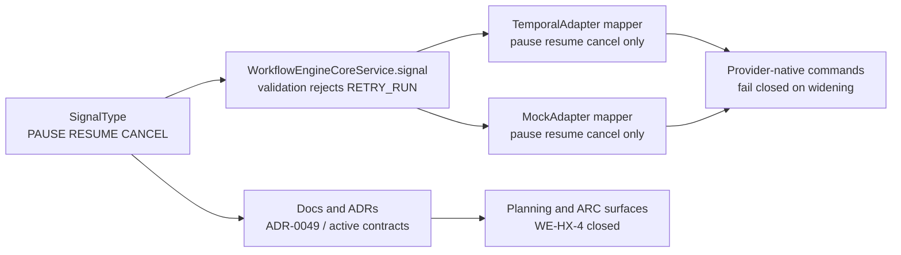

# Retry-run boundary hard QA review

## Summary

This artifact is the hard QA gate for the 2026-04-08 slice that narrowed
`RETRY_RUN` out of canonical `SignalType` and made provider signal mapping
explicit for the remaining canonical run-control surface.

Canonical execution tracking remains in:

- [agent-lane-a.yaml](../../state/agent-lane-a.yaml)
- [20260408 Retry-run boundary and provider signal mapper review](./20260408-retry-run-boundary-and-provider-signal-mapper-review.md)
- [ADR-0049](./C:/dvt/docs/adr/ADR-0049-retry-run-as-separate-recovery-use-case.md)

The slice closes the remaining `WE-HX-4-A/B/C` signal-boundary work. This QA
artifact verifies that contract, adapter, docs, planning, evidence, and risk
surfaces all agree on the same boundary truth.

### Markdown Artifact Path Suggestion

- `docs/planning/reviews/architecture-and-governance/20260408-retry-run-boundary-hard-qa-review.md`

## Governing Sources

- [governance-document-rule-inventory.md](../../status/governance-document-rule-inventory.md)
- [AGENTS.md](./C:/dvt/AGENTS.md)
- [ai-work-protocol.md](./C:/dvt/docs/guides/ai-work-protocol.md)
- [TEMPLATE_QA_CURRENT_TASK_CHECK_PROMPT.md](../../templates/qa/TEMPLATE_QA_CURRENT_TASK_CHECK_PROMPT.md)
- [TEMPLATE_QA_ARTIFACT_EXAMPLE.md](../../templates/qa/TEMPLATE_QA_ARTIFACT_EXAMPLE.md)
- [ADR-0040](./C:/dvt/docs/adr/ADR-0040-retry-ownership-and-attempt-authority.md)
- [ADR-0047](./C:/dvt/docs/adr/ADR-0047-runtime-owned-realized-lifecycle-for-signal-driven-transitions.md)
- [ADR-0048](./C:/dvt/docs/adr/ADR-0048-retry-step-as-separate-engine-use-case.md)
- [ADR-0049](./C:/dvt/docs/adr/ADR-0049-retry-run-as-separate-recovery-use-case.md)
- [20260408 Retry-run boundary and provider signal mapper review](./20260408-retry-run-boundary-and-provider-signal-mapper-review.md)

## Findings

No critical findings remain in the reviewed slice.

### Residual note

- A future recover-run feature still needs its own command surface, contract,
  and test matrix.
  Why it matters: `ADR-0049` intentionally narrows the generic signal boundary
  without implementing business recovery itself.
  Evidence: [ADR-0049](./C:/dvt/docs/adr/ADR-0049-retry-run-as-separate-recovery-use-case.md), [ADR-0040](./C:/dvt/docs/adr/ADR-0040-retry-ownership-and-attempt-authority.md)
  Risk: a later feature could regress by reusing `signal(...)` instead of a
  dedicated recovery boundary.
  Recommendation: keep the open risk entry and require a new ADR before any
  recover-run implementation proceeds.

## Alignment

- Doc vs code:
  aligned; active contracts and adapter docs now match the narrowed signal
  boundary.
- Promise vs implementation:
  aligned; the slice removes `RETRY_RUN` from canonical signals and introduces
  explicit provider mapping for `PAUSE`, `RESUME`, and `CANCEL` only.
- Tests vs claims:
  aligned; contract validation rejects `RETRY_RUN`, engine tests reject it
  before adapter side effects, and adapter tests cover the remaining canonical
  dispatch path.
- Current truth vs planned truth:
  aligned; `WE-HX-4-A`, `WE-HX-4-B`, and `WE-HX-4-C` now close on the same
  boundary decision.
- Documentation update status:
  updated across ADRs, contracts, adapter docs, planning reviews, evidence, and
  risk surfaces.
- Evidence and risk-doc status when applicable:
  present and updated for ARC-2.

## Architecture Assessment

- SRP:
  improved; generic run-control signaling and business recovery no longer share
  one enum.
- DDD:
  improved; recovery semantics are treated as a dedicated application boundary
  rather than as transport-level control.
- Hexagonal:
  improved; adapter signal realization is explicit through mapping helpers and
  fail-closed behavior.
- CQRS if relevant:
  not materially affected.
- Complexity:
  reduced at the canonical boundary and made more explicit at the adapter seam.
- Modularity:
  improved; contracts, engine, and adapters no longer carry speculative
  `RETRY_RUN` signal branches.

## Test Assessment

- Negative paths present:
  yes; contract and engine tests reject `RETRY_RUN` as non-canonical.
- Negative paths missing:
  none identified for this narrowing slice.
- Regression status:
  green in scoped validations.
- Determinism:
  idempotency vector updated to the narrowed canonical signal set.
- Local suite vs meaningful global confidence:
  adequate; contract, engine, adapter, docs, and planning surfaces are all in
  scope.
- Global system view applied:
  yes; the review covers contracts, engine, adapters, active docs, planning,
  evidence, and risk.
- Harness or shared fixture need:
  none beyond existing suites.
- Test grouping by type (`unit` / `integration` / `contract` / `e2e` /
  regression) and rationale:
  existing contract, unit, and regression coverage is sufficient for this
  boundary-narrowing slice.

## Quality Gates

- Commands executed:
  - `pnpm docs:workboard:generate`
  - `pnpm docs:sync`
  - `pnpm --filter @dvt/contracts build`
  - `pnpm --filter @dvt/contracts test`
  - `pnpm --filter @dvt/engine build`
  - `pnpm --filter @dvt/engine test -- test/idempotency.vectors.test.ts test/core/WorkflowEngineCoreService.test.ts test/adapters/MockAdapter.cancel.test.ts`
  - `pnpm --filter @dvt/adapter-temporal build`
  - `pnpm --filter @dvt/adapter-temporal test -- test/TemporalAdapter.startRun.test.ts test/workflow-literals.test.ts`
  - `pnpm docs:arc:evidence:check`
  - `pnpm docs:gov:locations`
  - `pnpm verify:prepush`
- What passed:
  - `pnpm docs:workboard:generate`
  - `pnpm docs:sync`
  - `pnpm --filter @dvt/contracts build`
  - `pnpm --filter @dvt/contracts test`
  - `pnpm --filter @dvt/engine build`
  - `pnpm --filter @dvt/engine test -- test/idempotency.vectors.test.ts test/core/WorkflowEngineCoreService.test.ts test/adapters/MockAdapter.cancel.test.ts`
  - `pnpm --filter @dvt/adapter-temporal build`
  - `pnpm --filter @dvt/adapter-temporal test -- test/TemporalAdapter.startRun.test.ts test/workflow-literals.test.ts`
  - `pnpm docs:arc:evidence:check`
  - `pnpm docs:gov:locations`
  - `pnpm exec markdownlint-cli2 ...` on all touched docs in this slice
  - `pnpm verify:prepush`
- What failed:
  - one intermediate failure in `pnpm verify:prepush` due to Prettier drift on
    `20260407-principal-architecture-review-progress-and-diagrams.md`; fixed and
    rerun green.
- What could not be verified:
  - no separate recover-run feature exists in this slice.

## Mermaid Diagram

### Closure Path

## Action Artifact

### Task Checklist

- [x] `QA-RR-1` Narrow canonical signal contracts so `RETRY_RUN` is no longer valid
- [x] `QA-RR-2` Add explicit provider signal mapper helpers for canonical run-control signals
- [x] `QA-RR-3` Align active docs, ADRs, evidence, and risk surfaces with the narrowed boundary
- [x] `QA-RR-4` Regenerate planning and docs indexes affected by the slice
- [x] `QA-RR-5` Re-run validation and close the slice with evidence

### Task Details

#### `QA-RR-1` Narrow canonical signal contracts so `RETRY_RUN` is no longer valid

- Objective: Remove residual drift between shipped run-control behavior and the
  shared signal contract.
- Scope: `SignalType`, `SignalRequest` validation, workflow signal literals,
  contract tests, and engine rejection tests.
- Recommended owner: Contracts + engine owner.
- Dependencies: `ADR-0040`, `ADR-0049`.
- Documentation impact: active signal docs must stop describing `RETRY_RUN` as
  canonical.
- Evidence / risk-doc impact: ARC-2 evidence and risk updates required.
- Comment with rationale: a canonical enum cannot safely carry a business
  recovery concept that the boundary does not implement.
- Definition of Done:
  - `SignalType` excludes `RETRY_RUN`;
  - validation rejects `RETRY_RUN`;
  - engine tests prove rejection before adapter side effects;
  - active docs stop presenting `RETRY_RUN` as a signal.

#### `QA-RR-2` Add explicit provider signal mapper helpers for canonical run-control signals

- Objective: Make the engine-to-provider signal seam explicit and fail closed.
- Scope: Temporal and mock adapter `signal(...)` implementations.
- Recommended owner: Adapter owners.
- Dependencies: `QA-RR-1`.
- Documentation impact: adapter policy/spec docs updated.
- Evidence / risk-doc impact: referenced by ARC evidence.
- Comment with rationale: explicit mappers prevent speculative verbs from
  leaking into provider adapters through shared enums.
- Definition of Done:
  - adapters translate only `PAUSE`, `RESUME`, and `CANCEL` through local
    mapping helpers;
  - unsupported values fail closed;
  - tests cover the narrowed dispatch path.

#### `QA-RR-3` Align active docs, ADRs, evidence, and risk surfaces with the narrowed boundary

- Objective: Keep governance truth synchronized with the implementation slice.
- Scope: touched v1 contract docs, adapter docs, ADR-0048 historical note,
  ADR-0049, planning reviews, evidence, and risk entries.
- Recommended owner: Slice owner.
- Dependencies: `QA-RR-1`, `QA-RR-2`.
- Documentation impact: direct.
- Evidence / risk-doc impact: direct.
- Comment with rationale: this slice is boundary governance as much as code;
  stale docs would reopen drift immediately.
- Definition of Done:
  - active docs reflect the narrowed canonical signal set;
  - ADR-0048 is framed historically for `RETRY_RUN`;
  - ADR-0049 is the active decision of record for recover-run boundary.

#### `QA-RR-4` Regenerate planning and docs indexes affected by the slice

- Objective: Keep generated planning and documentation navigation surfaces in
  sync.
- Scope: lane-generated views and docs indexes.
- Recommended owner: Slice owner.
- Dependencies: `QA-RR-3`.
- Documentation impact: generated navigation stays valid.
- Evidence / risk-doc impact: none beyond consistent indexing.
- Comment with rationale: governed docs cannot rely on manual navigation drift.
- Definition of Done:
  - `pnpm docs:workboard:generate` is run after lane changes;
  - `pnpm docs:sync` is run after adding docs artifacts;
  - generated files are updated if needed.

#### `QA-RR-5` Re-run validation and close the slice with evidence

- Objective: Close on real gates, not on narrative.
- Scope: touched packages and repo-level gates.
- Recommended owner: Slice owner.
- Dependencies: `QA-RR-1` through `QA-RR-4`.
- Documentation impact: QA artifact and board close with evidence.
- Evidence / risk-doc impact: referenced by the ARC evidence doc.
- Comment with rationale: the slice is only done when contracts, adapters, docs,
  and repo gates all agree on the same boundary.
- Definition of Done:
  - scoped contract, engine, and adapter validations pass;
  - ARC and governance checks pass;
  - `pnpm verify:prepush` passes;
  - QA artifact closes as `Ready`.

### Closeout rationale

The hard part of this slice is not code volume. It is preventing the boundary
from sliding back into an aspirational enum.

Closing `RETRY_RUN` out of canonical `signal(...)` while making adapter signal
translation explicit removes the last mixed-ownership retry verb from the shared
run-control surface.

## Unrelated Worktree Observations

- None identified during this QA pass.

## Final Verdict

Ready.
