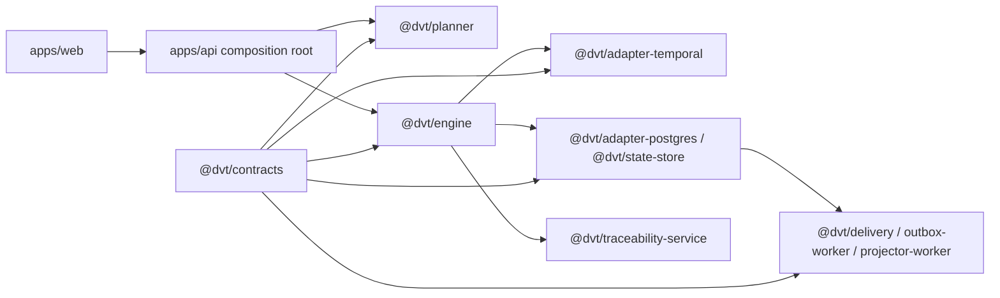
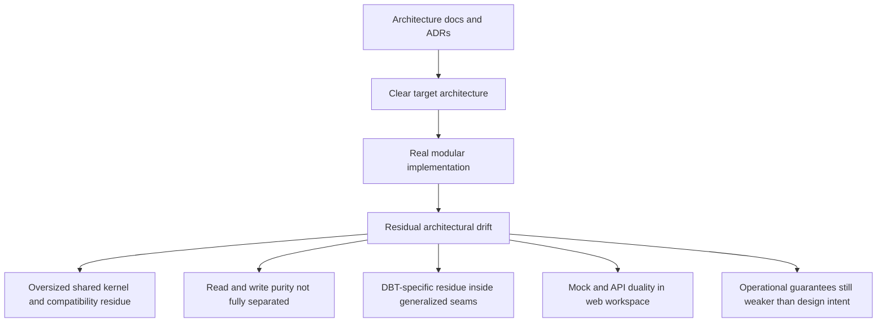
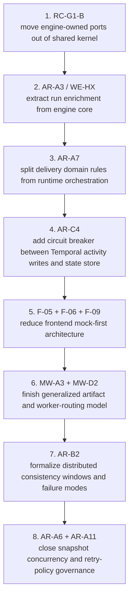

# Project Architecture Strengths, Weaknesses, And Priority Review

This review is a source-grounded architectural assessment of the current DVT
repository state.

It does not compare feature breadth. It compares architectural quality against
the standard expected from mature orchestration and control-plane systems:

- clear bounded-context ownership
- stable shared contracts
- honest composition roots
- read/write separation
- infrastructure isolation behind ports
- operational maturity
- consumer-facing boundary clarity

## Review Basis

Primary governing and status sources:

- [Governance inventory](../../status/governance-document-rule-inventory.md)
- [Repository map](../../../concepts/repository-map.md)
- [Reference architecture](../../../architecture/reference-architecture.md)
- [System delivery status](../../../architecture/system-delivery-status.md)
- [Canonical doc code matrix](../../status/canonical-doc-code-matrix.md)
- [Planning control tower](../../state/planning-control-tower.md)
- [Agent lane A](../../state/agent-lane-a.yaml)
- [ADR-0018 shared-kernel ownership governance](../../../adr/ADR-0018_Shared_Kernel_Ownership_Governance.md)
- [ADR-0034 bounded-context boundaries and communication rules](../../../adr/ADR-0034-bounded-context-boundaries-and-communication-rules.md)

Primary code anchors reviewed:

- [apps/api/src/app.ts](../../../../apps/api/src/app.ts)
- [apps/api/src/modules/buildProtectedRuntimeModule.ts](../../../../apps/api/src/modules/buildProtectedRuntimeModule.ts)
- [apps/api/src/application/services/getRunStatusUseCase.ts](../../../../apps/api/src/application/services/getRunStatusUseCase.ts)
- [packages/@dvt/engine/src/core/WorkflowEngine.ts](../../../../packages/@dvt/engine/src/core/WorkflowEngine.ts)
- [packages/@dvt/engine/src/application/StartRunApplicationService.ts](../../../../packages/@dvt/engine/src/application/StartRunApplicationService.ts)
- [packages/@dvt/planner/src/application/PlannerFacade.ts](../../../../packages/@dvt/planner/src/application/PlannerFacade.ts)
- [packages/@dvt/planner/src/domain/Planner.ts](../../../../packages/@dvt/planner/src/domain/Planner.ts)
- [packages/@dvt/planner/src/application/derivePlannerGraphSourceFromManifest.ts](../../../../packages/@dvt/planner/src/application/derivePlannerGraphSourceFromManifest.ts)
- [packages/@dvt/adapter-temporal/src/TemporalAdapter.ts](../../../../packages/@dvt/adapter-temporal/src/TemporalAdapter.ts)
- [packages/@dvt/adapter-temporal/src/workflows/workflowHelpers.ts](../../../../packages/@dvt/adapter-temporal/src/workflows/workflowHelpers.ts)
- [packages/@dvt/adapter-postgres/src/PostgresStateStoreAdapter.ts](../../../../packages/@dvt/adapter-postgres/src/PostgresStateStoreAdapter.ts)
- [packages/@dvt/adapter-postgres/src/PostgresPlanStore.ts](../../../../packages/@dvt/adapter-postgres/src/PostgresPlanStore.ts)
- [packages/@dvt/delivery/src/application/OutboxWorkerRuntime.ts](../../../../packages/@dvt/delivery/src/application/OutboxWorkerRuntime.ts)
- [packages/@dvt/traceability-service/src/lineage/mapper/StepStartedLineageMapper.ts](../../../../packages/@dvt/traceability-service/src/lineage/mapper/StepStartedLineageMapper.ts)
- [apps/web/src/app/Root.tsx](../../../../apps/web/src/app/Root.tsx)
- [apps/web/src/app/services/composition/appServices.ts](../../../../apps/web/src/app/services/composition/appServices.ts)
- [apps/web/src/app/services/workspace/workspaceService.mock.ts](../../../../apps/web/src/app/services/workspace/workspaceService.mock.ts)

## Executive Verdict

The repository is not a chaotic monolith.

It is an unusually well-governed architecture with real module boundaries,
strong contract discipline, and a credible event-sourced execution model.

Its central weakness is different:

the declared architecture is more mature than the simplification level of the
implementation.

That leaves the codebase in a transitional posture:

- architecture is clearer than the runtime seams
- ownership is clearer than the remaining physical package graph
- the backend is materially stronger than the frontend
- operational design is ahead of operational closure

## Overall Scores

| Area                                    | Score      | Judgment                                              |
| --------------------------------------- | ---------- | ----------------------------------------------------- |
| Architecture declared in docs and ADRs  | `8.8 / 10` | stronger than most systems at this size               |
| Implementation shape in code            | `7.2 / 10` | good, but transitional seams remain                   |
| Operational maturity                    | `6.5 / 10` | serious intent, incomplete hardening                  |
| Frontend and consumer-boundary maturity | `5.8 / 10` | weakest part of the system                            |
| Overall architecture quality            | `7.4 / 10` | strong system in transition, not yet fully simplified |

## Current Architecture Shape

## Main Structural Diagnosis

## What Is Strong

### 1. Governance quality is exceptional

The repository has better architectural self-description than most mature
systems.

Evidence:

- [governance-document-rule-inventory.md](../../status/governance-document-rule-inventory.md)
- [canonical-doc-code-matrix.md](../../status/canonical-doc-code-matrix.md)
- [system-delivery-status.md](../../../architecture/system-delivery-status.md)

Judgment:

- ownership is explicit
- active status versus canonical spec is distinguished clearly
- planning, risk, evidence, ADRs, and status surfaces are treated as real
  architecture inputs, not decoration

### 2. The engine is not a blob

Evidence:

- [WorkflowEngine.ts](../../../../packages/@dvt/engine/src/core/WorkflowEngine.ts)
- [StartRunApplicationService.ts](../../../../packages/@dvt/engine/src/application/StartRunApplicationService.ts)

Judgment:

- the engine is organized as an application-facing facade plus focused
  collaborators
- start-run, lifecycle, and persistence coordination are separated enough to be
  governable
- this is materially better than the average orchestration backend

### 3. The planner core is clean enough to trust

Evidence:

- [PlannerFacade.ts](../../../../packages/@dvt/planner/src/application/PlannerFacade.ts)
- [Planner.ts](../../../../packages/@dvt/planner/src/domain/Planner.ts)
- [dagAnalyzer.ts](../../../../packages/@dvt/plan-interpreter/src/dagAnalyzer.ts)
- [verify.ts](../../../../packages/@dvt/plan-verifier/src/verify.ts)

Judgment:

- deterministic planning is treated seriously
- plan validation and plan identity are explicit concerns
- the planner core reads like a domain pipeline, not a controller script

### 4. State and plan persistence are strong

Evidence:

- [PostgresStateStoreAdapter.ts](../../../../packages/@dvt/adapter-postgres/src/PostgresStateStoreAdapter.ts)
- [PostgresPlanStore.ts](../../../../packages/@dvt/adapter-postgres/src/PostgresPlanStore.ts)
- [RunArchiveCoordinator.ts](../../../../packages/@dvt/state-store/src/lifecycle/RunArchiveCoordinator.ts)

Judgment:

- persistence facades are reasonably thin
- transactionally meaningful boundaries exist
- archival and lifecycle work is more serious than the average product-stage
  backend

### 5. Traceability is unusually well-isolated

Evidence:

- [StepStartedLineageMapper.ts](../../../../packages/@dvt/traceability-service/src/lineage/mapper/StepStartedLineageMapper.ts)
- [HttpOpenLineageSink.ts](../../../../packages/@dvt/traceability-service/src/lineage/HttpOpenLineageSink.ts)

Judgment:

- mapping, IO, and degradation are properly separated
- the package is cohesive
- it compares favorably with mature systems where lineage often leaks into
  runtime code

## What Is Weak

### 1. The shared kernel is still oversized

Evidence:

- [ADR-0018](../../../adr/ADR-0018_Shared_Kernel_Ownership_Governance.md)
- [packages/@dvt/contracts/src/index.ts](../../../../packages/@dvt/contracts/src/index.ts)
- [packages/@dvt/engine/src/contracts](../../../../packages/@dvt/engine/src/contracts)
- [agent-lane-a.yaml](../../state/agent-lane-a.yaml)

Judgment:

- the repository already knows what should move out of `@dvt/contracts`
- `RC-G1-B` remains queued in the Lane A task registry under the active `RC-G1`
  migration
- this is no longer a discovery problem; it is a completion problem

In mature systems, shared kernels stay small because everyone fears changing
them. Here the repo still carries too much behavior-adjacent history in that
surface.

### 2. The API composition root is real, but too wide

Evidence:

- [app.ts](../../../../apps/api/src/app.ts)
- [buildProtectedRuntimeModule.ts](../../../../apps/api/src/modules/buildProtectedRuntimeModule.ts)

Judgment:

- the API is already a proper composition root
- but the protected-runtime module still concentrates too much assembly,
  policy, storage, planner, adapter, and telemetry wiring in one place

This is acceptable in a growing system.
It is not the shape of a fully matured one.

### 3. CQRS purity is not yet fully honest

Evidence:

- [WorkflowEngine.ts](../../../../packages/@dvt/engine/src/core/WorkflowEngine.ts)
- [getRunStatusUseCase.ts](../../../../apps/api/src/application/services/getRunStatusUseCase.ts)

Judgment:

- the system talks correctly about read-model separation
- but `enrichRunStatus()` still lives on the engine surface
- the query path still needs to reason about degradation and optional
  enrichment inside the runtime use case

Mature systems typically cut this more sharply.

### 4. DBT residue still appears in generalized seams

Evidence:

- [derivePlannerGraphSourceFromManifest.ts](../../../../packages/@dvt/planner/src/application/derivePlannerGraphSourceFromManifest.ts)
- [StepTypeRegistry.ts](../../../../packages/@dvt/contracts/src/step-registry/StepTypeRegistry.ts)
- [workflowHelpers.ts](../../../../packages/@dvt/adapter-temporal/src/workflows/workflowHelpers.ts)

Judgment:

- the repo has already done the hard-cut planner ingress move
- but source-family generalization is not completely reflected in step config,
  worker helpers, and retained utilities

This is not fatal drift. It is transitional drift.

### 5. The frontend is materially behind the backend

Evidence:

- [Root.tsx](../../../../apps/web/src/app/Root.tsx)
- [appServices.ts](../../../../apps/web/src/app/services/composition/appServices.ts)
- [runsService.ts](../../../../apps/web/src/app/services/runs/runsService.ts)
- [plansService.ts](../../../../apps/web/src/app/services/plans/plansService.ts)
- [workspaceService.ts](../../../../apps/web/src/app/services/workspace/workspaceService.ts)
- [workspaceService.mock.ts](../../../../apps/web/src/app/services/workspace/workspaceService.mock.ts)

Judgment:

- the web shell is real product code
- the service composition model is moving in the right direction
- but the module still lives in two worlds: governed API boundaries and large
  mock-backed local service surfaces

`workspaceService.mock.ts` is `589` lines long. That is a symptom, not the
root cause. The root cause is that the product shell still tolerates mock-first
coexistence more than a mature system should.

## Module-By-Module Scores

| Module or slice                  | Score      | Strengths                                                               | Weaknesses                                                   |
| -------------------------------- | ---------- | ----------------------------------------------------------------------- | ------------------------------------------------------------ |
| Governance and planning surfaces | `9.0 / 10` | unusually strong traceability, ownership, and discipline                | high cognitive overhead; ceremony risk                       |
| Contracts and shared kernel      | `7.5 / 10` | formal schemas, branded primitives, versioned boundaries                | still too much residual behavior and compatibility ownership |
| Planner                          | `7.2 / 10` | deterministic core, clean facade, strong validation                     | retained DBT-native ingress utility inside planner package   |
| Engine                           | `7.6 / 10` | clear facade plus collaborators, serious lifecycle ownership            | facade still broad; query enrichment still mixed into engine |
| API                              | `7.0 / 10` | real composition root, clear command and query paths                    | protected runtime assembly remains too wide                  |
| Temporal adapter                 | `7.6 / 10` | good provider seam, deterministic workflow support                      | helper bucket remains too broad                              |
| Postgres and state               | `8.1 / 10` | strong persistence boundaries and plan store posture                    | contract and ownership migration not fully finished          |
| Delivery and outbox              | `7.1 / 10` | real worker runtime and operational model                               | domain rules and runtime orchestration still mixed           |
| Traceability and lineage         | `8.4 / 10` | cohesive and honest package design                                      | still follows broader platform drift on shared contracts     |
| Web                              | `5.8 / 10` | real shell, composition root emerging                                   | dual mock and API world still too dominant                   |
| Observability facade             | `6.0 / 10` | correct facade design                                                   | runtime validation and production hardening still partial    |
| Small shared packages            | `8.5 / 10` | high cohesion and clarity in `dsl`, `plan-interpreter`, `plan-verifier` | easy to underinvest in because they are small                |

## Comparison With Mature Systems

### Better than average mature systems in

- architecture and planning truth surfaces
- formalized contract vocabulary
- explicit ADR-backed ownership discipline
- willingness to document drift honestly

### Weaker than mature systems in

- aggressive removal of transitional seams
- consumer-boundary simplification
- frontend contract realism
- finished operational hardening
- full closure of shared-kernel migration

The system thinks like a mature platform.
It still runs partly like a platform in disciplined transition.

## Priority Improvement Plan

### Priority 1. Finish `RC-G1-B`

Why first:

- highest leverage architectural cleanup
- reduces shared-kernel drag across engine, planner, adapters, and docs
- turns ADR-0018 from target state into reality

### Priority 2. Land `AR-A3` inside the `WE-HX` chain

Why second:

- current engine quality is high enough that its main architectural weakness is
  now read and write impurity, not raw structure
- removing enrichment from the engine facade clarifies both API and engine

### Priority 3. Execute `AR-A7`

Why third:

- delivery already works
- now it needs cleaner internal ownership between policy and orchestration

### Priority 4. Execute `AR-C4`

Why fourth:

- this is the most important operational boundary still visibly open in the API
  and runtime chain
- it addresses resilience by architecture, not by incidental retry

### Priority 5. Force the frontend out of its dual world

Suggested route:

- `F-05`
- `F-06`
- `F-09`

Why fifth:

- the web workspace is the weakest module
- backend maturity is already ahead; frontend needs to stop behaving like a
  partially mocked integration shell

### Priority 6. Close generalized artifact and worker routing work

Suggested route:

- `MW-A3`
- `MW-D2`

Why sixth:

- the planner ingress hard cut is already done
- the remaining work is to make artifacts and runtime routing tell the same
  generalized story

### Priority 7. Make consistency windows explicit

Suggested route:

- `AR-B2`

Why seventh:

- mature event-sourced systems do not only define event authority
- they also define expected lag windows and operational failure modes

### Priority 8. Turn implementation details into explicit invariants

Suggested route:

- `AR-A6`
- `AR-A11`

Why eighth:

- snapshot rebuild mutual exclusion and retry policy are still more implicit
  than they should be
- these are maturity improvements, not discovery work

## Final Judgment

If evaluated as a startup backend, this repository is very strong.

If evaluated against mature orchestration platforms, the gap is not lack of
architecture. The gap is incomplete simplification.

The repository already knows what it wants to be.

The next phase is not to invent a better architecture.

The next phase is to remove the remaining transitional seams without losing the
governance discipline that made the system strong in the first place.
