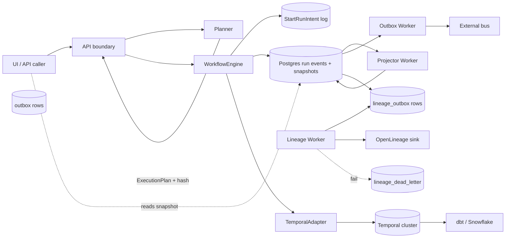
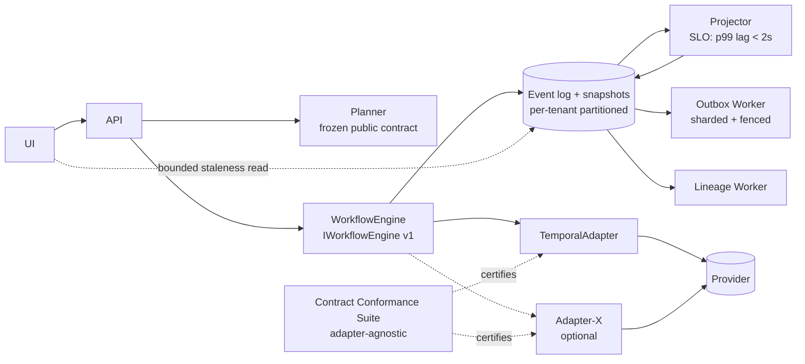
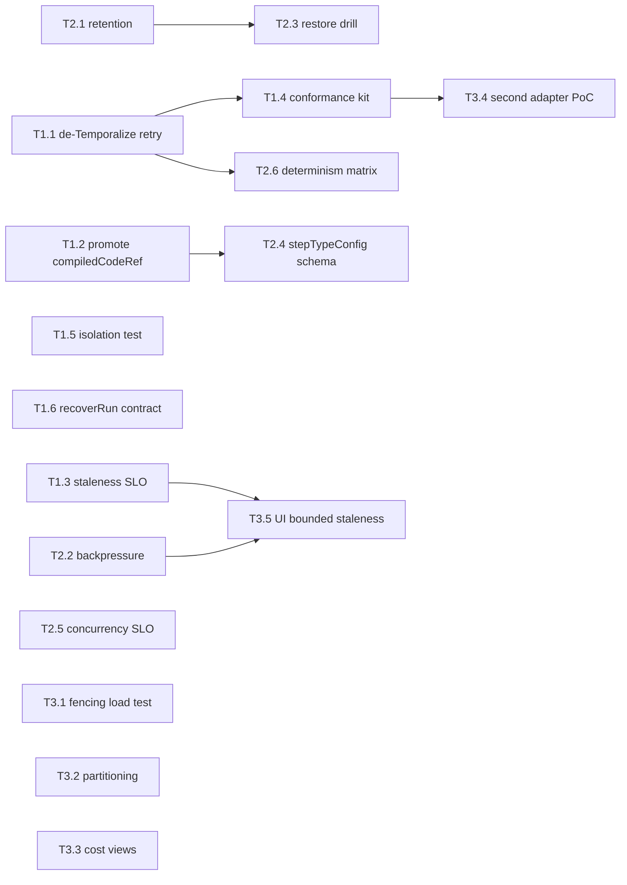

# DVT+ Architectural Review — Principal/Staff Technical Audit

**Plan-driven. Outcome-agnostic.**

**Governing sources consulted**

- `AGENTS.md` — startup/working standard rules
- `docs/planning/status/governance-document-rule-inventory.md` — canonical entry points, ADR inventory (ADR-0000..ADR-0049)
- `docs/planning/execution-model/dvt-execution-model.md` — execution contract (working normative draft)
- `docs/architecture/components/engine/contracts/engine/IWorkflowEngine.v1.md` — engine boundary
- `packages/@dvt/contracts/src/contracts/planner/ExecutionPlan.v1.ts` — canonical plan type
- `packages/@dvt/contracts/src/engine/IRunStateStore.v1.ts` — run-state contract
- `packages/@dvt/engine/src/` (core, application, ports, adapters, outbox, workers)
- `packages/@dvt/adapter-temporal/src/` — active runtime adapter
- `packages/@dvt/planner/src/` — planner domain/runtime
- ADR-0003 (execution sovereignty), ADR-0004 (event sourcing), ADR-0010 (envelope), ADR-0013 (bootstrapRunTx), ADR-0015 (read-model), ADR-0017/0036 (plan versioning), ADR-0031 (tenant isolation), ADR-0032 (compiledCodeRef), ADR-0033 (outbox sharding), ADR-0034 (bounded contexts)

Scope note: review is limited to the code and normative docs in the monorepo on branch `main` as of 2026-04-13. Marketing language, roadmap slides, and README files are ignored per governance rules.

---

## 0. Executive summary (no varnish)

DVT+ has a serious engineering backbone: explicit contracts, ADRs with real teeth, event sourcing, tenant scoping, outbox + DLQ, and an honest Temporal-first stance. That puts it above 80% of "enterprise data platforms" that claim the same.

But the architecture is carrying three structural bets that are not yet proven and are quietly fragile:

1. **`stepTypeConfig: Record<string, unknown>` as the main extensibility surface.** This is a typed vacuum. It keeps the contract stable at the cost of pushing real correctness into runtime registries that are easy to desync.
2. **Projector as an independent worker with `run_snapshots` as the canonical read model.** Correct in principle; in practice, snapshot staleness under 1000+ tenants and thousands of concurrent runs is not backed by a published SLO or a measured benchmark.
3. **Temporal-first claiming to be engine-agnostic.** `ExecutionStepRetryPolicyV1` ships Temporal-compatible duration strings (`${number}s`) directly in the canonical plan. The canonical contract already leaks the primary adapter. Calling this replaceable is optimistic.

The system is not overbuilt in most places, but it is **underspecified in the operational dimensions that actually break production**: backpressure, run retention, snapshot SLOs, cost-attribution model, and adapter-swap playbook. Those are the risks that will compound over the 3-year horizon.

---

## 1. Conceptual Soundness

### The Planner / Engine / State separation — is it real?

**Solid**

- `IWorkflowEngine` is genuinely narrow: `startRun`, `recoverRun`, `cancelRun`, `getRunStatus`, `signal`. No leakage of provider primitives. ADR-0015 correctly separates the read model from the adapter.
- `IRunStateStore` is the authority; `EventEnvelope` carries `runSeq`, `persistedAt`, `idempotencyKey`, `engineAttemptId`, `logicalAttemptId`. That is a well-shaped event-sourced boundary.
- Planner outputs `VersionedPlanCore<TVersion>` with `inputHashSha256`, `planVersion`. Inputs are explicit (`PlannerInputEnvelopeV1`). Good.
- ADR-0034 (bounded contexts) + ADR-0018 (shared kernel ownership) + ADR-0019 (adapter equivalence) together define the context seams. Most platforms never get this far.
- The execution-model document lists the ten invariants clearly: UI does not execute, engine does not redesign plan, state is truth, provider is enrichment, etc. These are not slogans — they map to real ADRs.

**Fragile**

- **`stepTypeConfig: Record<string, unknown>`** (ExecutionPlan.v1.ts:100). This is the load-bearing extensibility point. Validation is deferred to `IStepTypeRegistry` at build time and `DbtStepTypeConfigSchema.safeParse` at adapter time. Two validators, two version trains, one untyped field. This is precisely where contract drift will appear first. ADR-0032 moved `compiledCodeRef` inside `stepTypeConfig` (opaque transport) with a tech-debt note to promote it to a typed field — that note is telling.
- **Retry policy in the canonical plan uses Temporal-shaped duration strings** (`${number}s`) — the comment explicitly says "because the current adapter is the only production runtime." This is a documented leak. The "engine replaceable" claim is weakened the moment a second adapter is attempted.
- **`gateway` / `dispatch`** split between planner subset and engine full type is a seam that will accumulate parity bugs. Two shapes of the same plan, one canonical spec, one schema.
- **`recoverRun(sourceRunId, planRef, context)`** means recovery is an engine use-case that takes a plan (potentially re-compiled) and a new run identity. The re-planning loop for recovery (same inputHash? new hash? provenance chain?) is not visible from the contract alone and needs explicit ADR coverage.
- **`CanonicalRunStatus.substatus`** is owned by the engine read model, but provider-backed enrichment lives in `IRunEnrichmentService`. The "do not reuse one DTO across canonical + enrichment + diagnostics" rule is MUST NOT in the contract — which means it gets violated first.

**Missing**

- No published SLO on snapshot staleness vs event-log tail. Callers are told "snapshots accelerate reads but do not replace the event log," but the UI does not read the event log; it reads `run_snapshots`. There is no documented contract on "how stale can the canonical read be."
- No contract on **concurrency bounds per tenant** (admission control exists — Lane C — but the guarantees it provides the UI are not documented).
- No explicit **contract evolution playbook** from v1 → v2 with dual-write / dual-read windows. ADR-0036 gives a matrix; the migration _procedure_ is absent.
- No **adapter-swap playbook**. ADR-0019 says "adapter equivalence and maintenance boundary" but the contract conformance suite that would let you certify a non-Temporal adapter does not exist.

**Is state-driven UI realistic at scale?**

Yes at 100 tenants. Probably at 1000 with disciplined projector sharding. Above that, the projector becomes a bottleneck unless it is partitioned on `(tenantId, runId)` with dedicated worker pools per tenant tier. At 10k concurrent runs the `run_snapshots` row contention on hot tenants is the failure mode.

---

## 2. Architectural Risk Map

| #   | Risk                                                                             | Severity | Likelihood | Why                                                                                                                                                       | Mitigation                                                                                                                                       |
| --- | -------------------------------------------------------------------------------- | -------- | ---------- | --------------------------------------------------------------------------------------------------------------------------------------------------------- | ------------------------------------------------------------------------------------------------------------------------------------------------ |
| R1  | `stepTypeConfig` drift between planner registry and adapter consumer             | **High** | High       | Untyped transport + two validators + documented tech debt (ADR-0032)                                                                                      | Promote first-class fields (compiledCodeRef, retryPolicy) to typed `ExecutionStepV1`; shrink the opaque blob to genuinely opaque provider params |
| R2  | Projector lag becomes UI lying                                                   | High     | Medium     | `run_snapshots` is the UI's canonical read; staleness SLO not declared                                                                                    | Publish SLO (p99 lag ≤ Xs); add `snapshotLagMs` to API responses; page oncall on lag breach                                                      |
| R3  | Engine-replaceability claim vs Temporal leakage                                  | High     | Medium     | `ExecutionStepRetryPolicyV1` uses Temporal duration strings in canonical plan                                                                             | Replace with structured `{valueMs: number}` and translate at adapter; own the duration type in contracts                                         |
| R4  | Outbox / lineage worker hot-shard starvation                                     | Medium   | Medium     | ADR-0033 shards by fencing but lineage outbox is a separate worker (G10)                                                                                  | Load-test fencing under failover; add per-shard lag metrics; document shard rebalancing runbook                                                  |
| R5  | Event duplication under adapter retry at boundaries                              | Medium   | Low        | `idempotencyKey` is contract-mandated; ADR-0008 derivation rules exist                                                                                    | Periodic vector validation; add chaos test that double-delivers every event type                                                                 |
| R6  | Idempotency key collision across `logicalAttemptId` boundaries                   | Medium   | Low        | `engineAttemptId` vs `logicalAttemptId` — two axes of identity, easy to mix                                                                               | Publish derivation invariants as property tests, not just vectors                                                                                |
| R7  | Planner responsibility creep                                                     | Medium   | Medium     | Planner already owns: DAG build, retry policy materialization, compiledCodeRef resolution, step registry validation, admission link, executability record | Freeze planner public contract (ADR-0035) and require ADR for each new output field                                                              |
| R8  | Engine responsibility creep via signals                                          | Medium   | Medium     | Signals list will grow beyond PAUSE/RESUME/CANCEL once users ask for STEP_SKIP, FORCE_FAIL, RE-ATTEMPT                                                    | Make signal extension a governed ADR process; reject ad-hoc signal additions                                                                     |
| R9  | Multi-tenant isolation at the storage layer                                      | **High** | Low        | ADR-0031 is accepted; depends on pg adapter correctness under RLS or tenant-scoped queries                                                                | Automated cross-tenant property test (generate tenant A data, assert tenant B cannot read) in CI, not only at PR time                            |
| R10 | Plugin / step-kind security (arbitrary `stepTypeConfig`)                         | High     | Medium     | `Record<string, unknown>` is a sandbox escape vector if a step kind interprets a path or URL                                                              | Enforce per-kind schema at admission; reject on unknown keys; no passthrough of untrusted strings to shell/SQL                                   |
| R11 | Cost attribution complexity                                                      | Medium   | Medium     | Snowflake cost ≠ step cost; warehouse suspensions + query tags + concurrent users make attribution noisy                                                  | Treat cost as estimate + reconciliation, not authoritative; never gate execution on pre-execution cost estimate without a declared error band    |
| R12 | State write amplification                                                        | Medium   | Medium     | Every step emits Started/Completed/Failed + snapshot projection + outbox + lineage outbox                                                                 | Measure rows-per-run; set retention policy (see §8)                                                                                              |
| R13 | Run retention / archival (ADR-0037) implementation gaps                          | Medium   | Medium     | Archival ADR accepted but operational scripts + restore drills not visible                                                                                | Add quarterly restore drill; compute archive coverage as a CI metric                                                                             |
| R14 | Recovery re-planning provenance                                                  | Medium   | Medium     | `recoverRun(sourceRunId, planRef, ...)` allows re-planning; provenance chain of `inputHash` across recoveries is not in contract                          | Require `recoveryFrom: {sourceRunId, sourcePlanHash}` in plan metadata when recovering                                                           |
| R15 | Plan integrity under caller substitution                                         | Low      | Low        | ADR-0012 covers plan integrity ownership; `PlanRef` verified                                                                                              | Keep — but add a negative test: tampered PlanRef → engine refuses                                                                                |
| R16 | Operational complexity of 4 worker runtimes (engine, outbox, projector, lineage) | Medium   | High       | Each worker is a separate app (`apps/`); deploy matrix grows; startup ordering not documented                                                             | Publish service dependency graph; add startup/liveness contract per worker                                                                       |

---

## 3. Engine Abstraction Critique

**`IWorkflowEngine` is minimal and correct.** Five methods, all necessary, no operational/admin concerns mixed in. `startRun`/`recoverRun`/`cancelRun`/`getRunStatus`/`signal` is exactly the right surface.

**Problems**

1. **`CanonicalRunStatus` has an optional `execution?: RunExecutionEvidence` field.** "Evidence" is a vague bucket that will grow. Define what it contains or drop it.
2. **`recoverRun` takes a `planRef`**, which means the caller (API) decides whether to re-plan. That is a sovereignty decision that should be documented in the contract, not inferred. Add a MUST/MUST NOT about re-planning.
3. **`signal` returns `Promise<void>`.** No receipt, no idempotent ack. Under network retry, the caller cannot distinguish "accepted twice" from "accepted once." Either return `{ accepted: boolean, signalId: string }` or document the idempotency derivation.
4. **No `listRuns` / `queryRuns`.** The contract is intentionally narrow, which is correct, but read models for multi-run queries (UI list pages) have no contract — they will be built ad-hoc against Postgres views and become a second read surface competing with `getRunStatus`.

**Temporal-first strategy — wise?**

Yes, given the team size and the determinism/replay requirements. Temporal is the only open-source orchestrator that gets durable execution right without building it in-house. The wisdom collapses if:

- the team ever needs a non-Temporal adapter (Conductor is mentioned as aspirational — there is no contract conformance suite to certify it),
- Temporal's pricing/licensing forces a move (Cadence fork, etc.),
- activity-retry policy semantics diverge between Temporal and the canonical plan.

Current `ExecutionStepRetryPolicyV1` shape bets on Temporal. That is a bet, not a hedge. Call it what it is in the docs.

**Event model robustness**

Strong. `runSeq` monotonic per run, `idempotencyKey` mandated, `(runId, idempotencyKey)` dedup documented in ADR-0004. Envelope split (ADR-0010) separates input and persisted envelope. This is genuinely good. The weakness is not the model — it is enforcement coverage under failure injection.

**Determinism assumptions that could fail**

- `stepTypeConfig` contains dates, URLs, or non-canonical JSON → `inputHashSha256` instability. `json-canonicalize` is in the stack but must be enforced at every serialization boundary.
- Clock reads inside planner logic (e.g., "today's partition") without explicit injection → non-deterministic plan hash.
- `compiledCodeRef` storage URI pointing at mutable objects (no version/etag) → two runs with same hash can execute different bytes.

---

## 4. Execution Planning Layer Analysis

**DAG analyzer from dbt artifacts (G9, step-registry)**

- Correct to go through `GenericGraphSourceV1` instead of binding planner to dbt directly. Good abstraction.
- `StepKindRegistry.v1.ts` + `DbtStepTypeConfig` give typed validation at plan-build time. Good.
- Risk: dbt `manifest.json` v11 → v12 changes are frequent. Pin the exact supported versions and fail closed on unknown fields.

**Partial execution**

- `PlannerSelection { selectedNodeIds, includeUpstream?, includeDownstream? }` is clean.
- Missing: **guarantees on what "completed upstream" means across runs.** If run N completed model A, and run N+1 selects downstream of A with `includeUpstream: false`, does the engine trust the prior run's artifact? This is the classic incremental-model trap. Document the invariant.

**Retry/backoff ownership**

- Currently in the plan (`retryPolicy` per step). That is the right place in a deterministic-plan model — retries must be visible at replay.
- But the shape is Temporal-flavored. Fix it now, before a second adapter exists.

**Cost estimator realism**

- Cost estimation before execution on Snowflake is _inherently imprecise_ (data skew, cache state, concurrent users, warehouse scaling). Treat estimates as triage not gates.
- If the product claims "cost-aware execution," make sure that claim means "post-run attribution with reconciliation" and not "pre-run hard budget." The latter is a liability.

**Plan versioning**

- ADR-0017 + ADR-0036 cover the matrix. `CURRENT_EXECUTION_PLAN_SCHEMA_VERSION = 'v1.2'`. Good.
- Missing: **a schema evolution runbook** — how to add a field, how to deprecate one, dual-read windows, adapter compat matrix in CI. Without this, the registry becomes a museum of versions.

**Over/under-engineered?**

- Over: `PlannerPolicyVocabulary.v2`, `PolicyMappingTable.v1`, `PlanExecutabilityRecord.v1`, `PlanExecutabilityValidation.v1`, `PlanAdmissionLink.v1`, `PlanValidationLifecycle.v1` — six policy/lifecycle contracts in the planner for a system that currently plans dbt. At current scale this is over-built. It pays off only if genuine multi-workflow planning (beyond dbt) is a committed roadmap item. If not, collapse.
- Under: no canonical test suite for plan determinism across platforms (Linux/Windows, Node 20/22). The codebase runs on Windows in this environment — path separators, line endings, locale-dependent JSON.stringify ordering are classical landmines for hash stability.

**Hidden Snowflake coupling**

- None visible in planner contracts — good.
- But `stepTypeConfig` for `DBT_MODEL` likely encodes warehouse names, materialization strategy, etc., which are Snowflake-flavored. That's acceptable at the step-kind level; not acceptable if it leaks into planner core. Verify the planner core has zero `snowflake` string references.

---

## 5. State & Metadata Layer Review

**Artifact immutability**

- `compiledCodeRef` is content-addressed (SHA-256) and stored in S3/GCS/MinIO. This is correct and enforceable.
- `file://` is dev-only (INV-CCREF-007). Good.
- Risk: any mutable storage (no object lock, lifecycle policies that delete old versions) breaks replay. **Production buckets must enforce object lock or versioning** — this belongs in an ADR, not in a comment.

**Event sourcing vs mutable state tradeoffs**

- Pure event sourcing for the write path + snapshot projection for reads is the right shape.
- `bootstrapRunTx` (ADR-0013) as an atomic transaction is correct and rare — most systems get bootstrap wrong.
- **Write amplification**: each step produces at least Started + Completed events, plus a snapshot update, plus an outbox row, plus a lineage outbox row. For a 1000-node plan that's ~4000 writes minimum. At 100 concurrent runs of 1000-node plans, the projector/outbox load is measurable. No benchmark is cited in the repo.
- **Snapshot vs event-log divergence**: if `rebuildSnapshot` has a bug, the UI shows a different truth than the event log. Add a CI integration test that asserts `rebuildSnapshot(runId)` == canonical reconstruction from events for a fixture set.

**Missing**

- Retention policy per event type (see §8).
- Archive + restore drill cadence.
- Snapshot invalidation SLO.

---

## 6. Diagrams (current state vs target)

### 6.1 Current state — runtime data flow



### 6.2 Target state — after §11 recommendations



### 6.3 Identified hidden couplings

```mermaid
flowchart TB
    A[ExecutionPlan.retryPolicy] -->|${number}s duration string| T[Temporal SDK semantics]
    B[stepTypeConfig: unknown] -->|opaque passthrough| Adapter
    Adapter -->|interprets keys| Provider
    C[compiledCodeRef in stepTypeConfig] -->|tech-debt note<br/>ADR-0032| TypedField[Should be typed ExecutionStepV1 field]
    D[UI reads run_snapshots] -->|no SLO| Projector[Projector lag = UI truth gap]
    E[Planner 6 policy contracts] -->|pays off only if multi-workflow| Roadmap[Multi-workflow roadmap not committed]

    classDef leak fill:#ffd4d4,stroke:#c00;
    class A,B,C,D,E leak;
```

---

## 7. What Is Overbuilt

1. **Planner policy/lifecycle contract surface** — `PlannerPolicyVocabulary.v2`, `PolicyMappingTable.v1`, `PlanAdmissionLink`, `PlanExecutabilityRecord`, `PlanExecutabilityValidation`, `PlanValidationLifecycle`, `CustomPolicyNamespaceRegistry`. Seven contracts around policy before a second workflow family exists.
2. **Multi-engine abstraction marketing** — one real adapter (Temporal), no conformance suite, contract already leaks Temporal primitives. "Multi-engine" is aspirational; stop shipping it as a capability.
3. **Four separate worker apps** (`apps/api`, `apps/outbox-worker`, `apps/projector-worker`, `apps/lineage-worker`) — defensible, but the operational cost of four deployables at current product maturity is high. Consider a mode-flag single-binary for dev/small tenants.
4. **Observability layering** (`observability` + `observability-otel`) — two packages; unless there is a concrete reason for split instrumentation surfaces, collapse.
5. **Cost attribution depth** — if built beyond "warehouse query tag + post-run reconciliation," it is premature. Real cost attribution on Snowflake is a multi-quarter investment, not a feature.

---

## 8. What Is Underbuilt

1. **Contract evolution procedure** — ADR-0017/0036 give the matrix; there is no step-by-step playbook for "add a field to ExecutionPlan v1 → dual-read window → deprecate." Missing today, will be painful when you need it.
2. **Run retention policy** — events, snapshots, outbox rows, lineage rows. No declared TTL per table. ADR-0037 archival exists; purge cadence per tenant tier does not.
3. **Rollback guarantees** — if a planner deploy produces subtly wrong plans, the recovery procedure (re-plan? replay from older plan? block new runs until fix?) is not documented.
4. **Distributed consistency model** — engine → state store → outbox → external bus. The guarantee delivered to external consumers (at-least-once? exactly-once with dedup window?) is not in one place.
5. **Concurrency model** — per-tenant concurrency caps, per-run step parallelism, global admission control. Lane C owns it; public SLOs are not published.
6. **Backpressure strategy** — what happens when the projector is 60s behind? When the outbox worker is 10k rows behind? Paging, auto-scale, shedding — none of this is codified.
7. **Snapshot staleness SLO** — the UI reads snapshots; no staleness contract exists.
8. **SLA definitions** — no visible SLO/SLA surface for API p99, run start latency, signal delivery latency.
9. **Adapter conformance test kit** — the only way to honestly claim "replaceable engine."
10. **Security threat model for `stepTypeConfig`** — untrusted inputs flowing through an `unknown` bag into adapters that interpret paths, URLs, or SQL.
11. **Cross-tenant isolation continuous test** — property-based generator asserting tenant A data is never readable by tenant B across every read path.

---

## 9. Scalability Outlook (3-year horizon)

Assumptions: 1000+ tenants, thousands of concurrent runs, 1000-node dbt projects, cross-env diffs, heavy cost dashboards.

| Dimension           | Expected pressure                         | Bottleneck                                                      | Required now                                                                             |
| ------------------- | ----------------------------------------- | --------------------------------------------------------------- | ---------------------------------------------------------------------------------------- |
| Event log writes    | ~4k rows/run × 5k runs/day = 20M rows/day | Single Postgres instance                                        | Partition by `tenantId` + time; plan for Citus/Aurora or logical sharding by 2027        |
| Snapshot projection | All runs → projector                      | Projector worker throughput per shard                           | Shard by `(tenantId, runId)`; publish p99 lag SLO; autoscale workers on lag              |
| Outbox              | Mirrors event log write rate              | Fenced shards; hot shard starvation                             | Load-test ADR-0033 fencing under failover; add per-shard lag metrics                     |
| Lineage outbox      | One row per StepStarted/Completed         | OpenLineage sink throughput                                     | DLQ already exists; add sink backpressure policy                                         |
| Planner DAG         | 1000-node plan build                      | CPU-bound in planner; `json-canonicalize` hashing is O(n log n) | Measure plan build p99 today; cache build results keyed by `inputHash`                   |
| Cross-env diff      | Dual plan build + diff                    | Planner memory + CPU                                            | Streamed diff, not full in-memory plan comparison                                        |
| Cost dashboards     | Heavy read on historical events           | Event log read-amplification                                    | Materialize cost views into dedicated OLAP tables; do not query event log for dashboards |
| Temporal cluster    | All runs                                  | Temporal sharding / namespace strategy                          | Use namespace per tenant tier; monitor task queue lag                                    |
| API p99             | Snapshot reads dominated by projector lag | Same as projection                                              | Same mitigation                                                                          |

**Single points of failure**

- Temporal cluster (expected; mitigate with multi-AZ).
- Postgres primary (expected; read replicas for projector and dashboards).
- Outbox worker for a given shard (ADR-0033 fencing mitigates; needs chaos test).
- Lineage sink (DLQ mitigates loss, not latency).

**Data growth pressure**

- At 20M event rows/day, a 2-year unarchived run equals ~14B rows. The retention policy is non-negotiable at this scale. Missing today.

---

## 10. Architectural Scorecard

| Dimension                 | Score (1–10) | Justification                                                                                                                                                                                                                             |
| ------------------------- | ------------ | ----------------------------------------------------------------------------------------------------------------------------------------------------------------------------------------------------------------------------------------- |
| Conceptual clarity        | **8**        | Execution-model doc + ADRs are genuinely clear; bounded contexts explicit; invariants listed. -2 for `stepTypeConfig` untyped blob muddying the contract surface.                                                                         |
| Separation of concerns    | **7**        | Planner/Engine/State boundaries are real and enforced by packages. -3 for planner carrying 7 policy contracts, retry-policy leak in plan, and projector double-read surface risk.                                                         |
| Engine replaceability     | **4**        | Only one adapter, retry-policy shape is Temporal-flavored, no conformance test kit, no certified second adapter. Stop claiming "multi-engine" until this is 7+.                                                                           |
| Determinism               | **7**        | `inputHashSha256`, `json-canonicalize`, content-addressed artifacts, replay-capable event sourcing. -3 for Windows/locale hash-stability not proven, clock-injection rules not enforced in lint, mutable-storage S3 configs not mandated. |
| Extensibility             | **6**        | Typed step kinds + registry + canonical `StepArtifactRef`. -4 for the untyped `stepTypeConfig` being the main extension point and seven policy contracts that haven't paid off.                                                           |
| Operational realism       | **4**        | Four workers, no published SLOs, no retention policy, no backpressure plan, no restore drill cadence. ADRs exist, operations do not.                                                                                                      |
| Long-term maintainability | **7**        | ARC policy, ADR gate, evidence docs, risk register, contract versioning, conventional commits, governance inventory. -3 for the operational gaps above.                                                                                   |

**Overall: 6.1 / 10.** Strong core, operational maturity lags the design maturity.

### SOLID / Hexagonal / OOP / CQRS scoring

| Principle                   | Score | Note                                                                                                         |
| --------------------------- | ----- | ------------------------------------------------------------------------------------------------------------ |
| SRP                         | 7     | Mostly clean; planner is the widest — 7 policy contracts stretch SRP at the package level                    |
| OCP                         | 6     | Step-kind registry supports extension; `stepTypeConfig` is open in the wrong way (untyped)                   |
| LSP                         | 7     | Adapter port is narrow; only tested by Temporal — LSP not empirically verified                               |
| ISP                         | 8     | `IWorkflowEngine` is genuinely small; `IRunStateStore` could be split further (read vs write)                |
| DIP                         | 8     | Ports everywhere; adapter direction is correct                                                               |
| Hexagonal                   | 7     | Ports + adapters real; hexagon boundary leaks Temporal duration type                                         |
| OOP with explicit contracts | 8     | Contracts package, types-first, zod + JSON Schema                                                            |
| CQRS                        | 7     | Write via events, read via snapshots; the _canonical_ boundary is clear, but the UI path lacks staleness SLO |

---

## 11. Strategic Recommendations

### 11.1 Three structural changes

1. **De-Temporalize the canonical plan.** Replace `ExecutionStepRetryPolicyV1.initialInterval: ${number}s` and `maximumInterval` with structured `{ valueMs: number }` (or a `Duration` value object). Translate at the adapter boundary. Remove the "because current adapter is the only production runtime" comment.
2. **Promote `compiledCodeRef` and any widely-used `stepTypeConfig` keys to typed `ExecutionStepV1` fields.** Keep `stepTypeConfig` only for genuinely adapter-specific provider params. ADR-0032 already acknowledges this as tech debt; close it.
3. **Build the Adapter Contract Conformance Suite** (`packages/@dvt/engine-conformance`) — a test kit any `IProviderAdapter` implementation must pass. Without this, "engine-agnostic" is a claim, not a property.

### 11.2 Three clarifications needed (write ADRs)

1. **Snapshot staleness SLO** — numeric budget (e.g., p99 < 2s) + caller contract (API returns `snapshotLagMs`). ADR-0015 gave the separation; this ADR gives the SLO.
2. **Retention & archival policy per table, per tenant tier** — events, snapshots, outbox, lineage outbox, DLQ. ADR-0037 is the start; add a concrete TTL matrix + purge runbook.
3. **Recovery provenance contract** — when `recoverRun` re-plans, the new plan MUST embed `recoveryFrom: {sourceRunId, sourcePlanHash}` in metadata. Prevents silent plan substitution.

### 11.3 Three things to freeze immediately

1. **Planner public contract (ADR-0035).** Any new field is ADR-gated. No more policy contracts without a committed roadmap use-case.
2. **`IWorkflowEngine` v1.** No additions to the method surface. Signals are governed; step-retry and run-recovery are already separate use-cases per ADR-0048/0049. Hold the line.
3. **Event envelope fields.** `runSeq`, `idempotencyKey`, `engineAttemptId`, `logicalAttemptId`, `(runId, idempotencyKey)` dedup. These are load-bearing — any change is a migration event.

### 11.4 Three things to delay (do not build now)

1. **Second engine adapter.** Do not start Conductor/other until the conformance suite exists and the Temporal-leak in the plan is fixed. You will regret it.
2. **Pre-execution hard cost gating.** Keep cost as estimate + post-run reconciliation. Hard budgeting in front of Snowflake is a product liability.
3. **Multi-workflow-family planning beyond dbt.** Seven policy contracts already exist for this; do not add more until at least one non-dbt family ships end-to-end.

---

## 12. Action Plan — scoped tasks per lane

Lane mapping follows `AGENTS.md` §"Planning State Rule". Each task below is sized to one slice, includes governing sources, and carries an ARC level.

### Priority tier 1 — freeze and close known debt (next 4 weeks)

| ID   | Title                                                                                                              | Lane | ARC   | Evidence needed                                | Governing source             |
| ---- | ------------------------------------------------------------------------------------------------------------------ | ---- | ----- | ---------------------------------------------- | ---------------------------- |
| T1.1 | Replace Temporal duration strings in `ExecutionStepRetryPolicyV1` with `{ valueMs: number }` + adapter translation | A    | ARC-2 | ED + risk entry + contract version bump matrix | ADR-0003, ADR-0017, ADR-0036 |
| T1.2 | Promote `compiledCodeRef` from `stepTypeConfig` to typed `ExecutionStepV1.compiledCodeRef?`                        | A    | ARC-2 | ED + close tech-debt note in ADR-0032          | ADR-0032                     |
| T1.3 | Publish Snapshot Staleness SLO ADR + add `snapshotLagMs` to `getRunStatus` response                                | B    | ARC-2 | ED + metric dashboards                         | ADR-0015                     |
| T1.4 | Write Adapter Contract Conformance Suite — skeleton + startRun/cancelRun/signal paths                              | A    | ARC-2 | ED + green run of Temporal adapter             | ADR-0003, ADR-0019           |
| T1.5 | Close R9 — continuous cross-tenant isolation property test in CI                                                   | C    | ARC-2 | ED + failing mutation test                     | ADR-0031                     |
| T1.6 | Document `recoverRun` re-planning contract + `recoveryFrom` metadata field                                         | A    | ARC-2 | New ADR + contract update                      | ADR-0014, IWorkflowEngine.v1 |

### Priority tier 2 — operational realism (4–10 weeks)

| ID   | Title                                                                                                                | Lane | ARC   | Evidence needed                      |
| ---- | -------------------------------------------------------------------------------------------------------------------- | ---- | ----- | ------------------------------------ |
| T2.1 | Retention & archival matrix per table/tier + purge runbook                                                           | D    | ARC-2 | ADR + runbook + dry-run report       |
| T2.2 | Backpressure policy: projector lag → autoscale, outbox lag → alert, DLQ growth → page                                | D    | ARC-1 | Runbook + alert rules committed      |
| T2.3 | Quarterly restore drill (ADR-0037) — first dry-run executed and documented                                           | D    | ARC-1 | Evidence doc with before/after state |
| T2.4 | Replace `Record<string, unknown>` on `stepTypeConfig` validation with registry-enforced per-kind schema at admission | A    | ARC-2 | ED + rejected-unknown-keys test      |
| T2.5 | Per-tenant concurrency admission contract + public SLO                                                               | C    | ARC-2 | ADR + API docs                       |
| T2.6 | Plan determinism CI on Linux + Windows + Node 20/22 matrix                                                           | A    | ARC-1 | Green matrix, failing mutation       |
| T2.7 | Collapse `observability` + `observability-otel` or document why both exist                                           | A    | ARC-1 | Rationale doc or merge PR            |

### Priority tier 3 — scale readiness (10–26 weeks)

| ID   | Title                                                                                     | Lane | ARC   |
| ---- | ----------------------------------------------------------------------------------------- | ---- | ----- |
| T3.1 | Load-test ADR-0033 outbox fencing under forced failover                                   | D    | ARC-2 |
| T3.2 | Partitioning strategy for event log at 20M rows/day                                       | D    | ARC-2 |
| T3.3 | Materialized cost view pipeline (dashboards do not hit event log)                         | D    | ARC-2 |
| T3.4 | Second adapter proof-of-concept (only after T1.4) — do not ship, just certify conformance | A    | ARC-2 |
| T3.5 | UI bounded-staleness display + degraded-mode banner when `snapshotLagMs` > SLO            | C    | ARC-1 |

### Dependencies



### Freeze gates (must not change without ADR)

- `IWorkflowEngine` method surface
- Event envelope mandatory fields
- `PlanRef` identity and verification model
- `(runId, idempotencyKey)` dedup invariant
- ADR-0031 tenant isolation contract

### Out of scope for this cycle

- Second engine adapter (gated on T1.4)
- Multi-workflow family beyond dbt (gated on T2.4 + product commitment)
- Pre-execution hard cost gating (explicitly rejected)

---

## 13. Closeout

**Governing sources used:** AGENTS.md, governance inventory, execution-model spec, IWorkflowEngine.v1 contract, ExecutionPlan.v1 source, IRunStateStore.v1 source, ADRs 0003/0004/0010/0013/0015/0017/0031/0032/0033/0034/0035/0036/0037.

**What this review is:** a point-in-time architectural assessment. It is not a substitute for ADRs, evidence docs, or risk-register entries — each recommendation in §11 and each task in §12 requires its own ARC-gated slice to land.

**What this review is not:** a polished roadmap. Tasks are scoped but not estimated. Prioritization is based on risk severity × likelihood, not on team capacity.

**Honest scoring:** DVT+ is a 6.1/10 architecture carried by an 8/10 governance process. If the operational gaps in §8 land cleanly, the architecture score moves to 7.5+. If `stepTypeConfig` drift + Temporal leak are not closed, it slides to 5.5 as soon as a second adapter or a second step-kind family is attempted.
