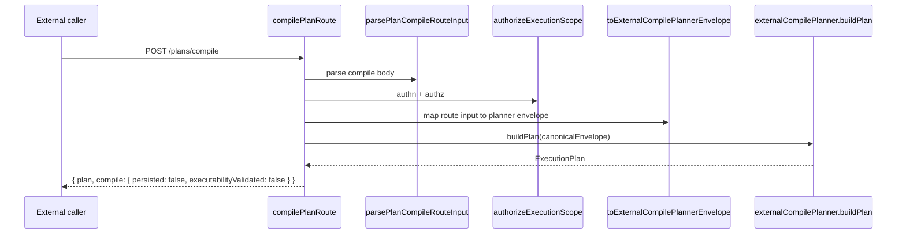
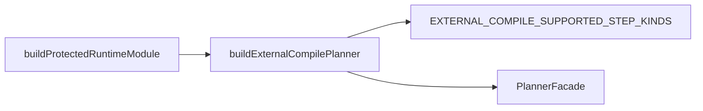
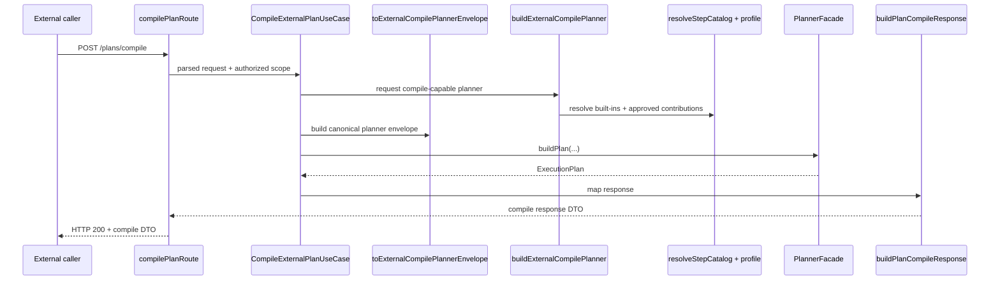

# MW-D1 external compile boundary review

## Purpose

Freeze the code-grounded Fowler, DDD, hexagonal, and CQRS analysis for `MW-D1`
before the next implementation pass.

This review is intentionally execution-oriented. It does not replace the
existing `MW-D1` proposal or target-architecture manuals. It narrows the
current repository drift to the next few seams that are worth implementing.

## Scope

This review covers the active compile-only ingress and its composition:

- `apps/api/src/entrypoints/http/compilePlanRoute.ts`
- `apps/api/src/entrypoints/http/planCompileRouteInputParser.ts`
- `apps/api/src/application/services/externalCompilePlannerEnvelopeMapper.ts`
- `apps/api/src/modules/externalCompileProfileSpec.ts`
- `apps/api/src/modules/externalCompilePlannerProfile.ts`
- `apps/api/src/modules/buildProtectedRuntimeModule.ts`
- `apps/api/test/app.test.ts`
- `apps/api/test/entrypoints/http/compilePlanRoute.test.ts`
- `apps/api/test/entrypoints/http/previewPlanRoute.auth.test.ts`
- `apps/api/test/entrypoints/http/previewPlanRoute.inputPolicy.test.ts`
- `apps/api/test/entrypoints/http/previewPlanRoute.outcomes.test.ts`
- `packages/@dvt/contracts/src/schema-packs/plan-compile.ts`
- `packages/@dvt/contracts/test/validation/plan-compile.ts`

It does not redesign preview persistence, import, or worker routing. Those
remain neighboring concerns.

## Governing sources

- `AGENTS.md`
- `docs/guides/ai-work-protocol.md`
- `docs/adr/ADR-0003-execution-model.md`
- `docs/adr/ADR-0012-plan-integrity-ownership.md`
- `docs/adr/ADR-0018_Shared_Kernel_Ownership_Governance.md`
- `docs/adr/ADR-0034-bounded-context-boundaries-and-communication-rules.md`
- `docs/adr/ADR-0035-planner-public-contract-evolution-protocol.md`
- `docs/architecture/components/planner/planner-ddd.md`
- `docs/architecture/components/api/api-current-to-target-architecture.md`
- `docs/planning/proposals/mandatory/runtime-and-contracts/mw-d1-external-plan-definition-sdk-api-plan-20260417.md`
- `docs/guides/external-compile-target-architecture-technical-manual-20260417.md`
- `docs/guides/external-compile-catalog-extension-technical-manual-20260417.md`

## Current code-grounded model

What is already true in code:

- `/plans/compile` exists as a dedicated route.
- compile rejects preview-era and legacy ingress fields instead of accepting a
  compatibility bridge.
- compile returns an `ExecutionPlan` and does not persist or validate
  executability.
- `buildProtectedRuntimeModule()` already builds a dedicated
  `externalCompilePlanner`.

Current collaboration path:

Current composition shape:

Interpretation:

- the dedicated route exists
- the dedicated planner instance exists
- the dedicated application service does not exist yet
- the resolved catalog does not exist yet
- the current profile is still a hardcoded SQL-first allowlist

## Findings

### P0 - The route is still acting as remote facade, service layer, and presenter

Evidence:

- `apps/api/src/entrypoints/http/compilePlanRoute.ts`

Problem:

The route currently owns:

- transport parsing result handling
- authorization handoff
- compile-request to planner-envelope mapping
- direct planner invocation
- compile response shaping

That is not the target Fowler layering described by the `MW-D1` proposal and
the technical manual. The route is still both the remote facade and the
compile-only application service.

Required correction:

- keep the route responsible only for transport, authn/authz, status mapping,
  and delegation
- materialize `CompileExternalPlanUseCase`
- materialize a dedicated response mapper or presenter

### P0 - The compile catalog is still implementation-first and SQL-first

Evidence:

- `apps/api/src/modules/externalCompileProfileSpec.ts`
- `apps/api/src/modules/externalCompilePlannerProfile.ts`

Problem:

The active compile boundary still hardcodes three SQL-oriented step kinds:

- `PREPARE_POSTGRES_TRANSFORM`
- `POSTGRES_SQL_TRANSFORM`
- `CAPTURE_MATERIALIZATION_EVIDENCE`

That is acceptable as a proof slice, but it is not the architecture we want to
freeze. The target model is:

- canonical family inventory
- explicit family-to-kind relationship
- resolved catalog owned by composition
- typed profile selection over that resolved catalog

As long as the boundary is a hardcoded step-kind list, `MW-D1` remains
"transformation compile with a generic wrapper", not a true external compile
surface.

Required correction:

- introduce catalog-first composition with explicit family and kind objects
- make the profile express policy over families and kinds
- keep schemas and handlers in code, not in free-form JSON

### P1 - The compile parser still borrows neighboring ingress semantics

Evidence:

- `apps/api/src/entrypoints/http/planCompileRouteInputParser.ts`

Problem:

The parser already enforces the no-legacy rule, which is correct. But it still
leans on start-run or preview-shaped helpers for body and scope normalization.
That keeps the compile boundary partially coupled to a neighboring ingress
grammar.

This is not the worst problem in the slice, but it is real drift: compile
should share low-level primitives, not compile semantics by way of other
application boundaries.

Required correction:

- extract compile-owned normalization helpers
- keep only primitive parsing reuse
- do not let preview or start-run semantics become the compile contract owner

### P1 - The repository still lacks non-dbt acceptance evidence

Evidence:

- `packages/@dvt/contracts/test/validation/plan-compile.ts`
- `apps/api/test/entrypoints/http/compilePlanRoute.test.ts`
- `apps/api/test/entrypoints/http/previewPlanRoute.outcomes.test.ts`
- `apps/api/test/app.test.ts`

Problem:

The contract and route are already named as external compile, but the living
examples are still the SQL transformation graph. That proves transport and
planner wiring for one proof family only. It does not yet prove the product
claim that systems outside the dbt ecosystem can submit graph definitions.

Required correction:

- add at least one non-dbt graph family and kind vector
- add one API integration test over that vector
- keep `targetAdapter` and worker routing out of the compile contract

### P1 - CQRS matters here, but only at the correct boundary

Evidence:

- `apps/api/src/entrypoints/http/compilePlanRoute.ts`
- `packages/@dvt/contracts/src/schema-packs/plan-compile.ts`
- `docs/guides/external-compile-target-architecture-technical-manual-20260417.md`

Problem:

It would be easy to over-apply CQRS terminology and split the compile boundary
into fake command and query services. That would be architectural theater.

Compile is a command-style derivation boundary:

- request in
- deterministic `ExecutionPlan` out
- no persistence side effects
- no read-model responsibility

The real read-side and lifecycle concerns begin later in preview, import, or
start-run flows.

Required correction:

- keep compile as one command-side application service
- do not invent a compile read-model layer
- keep persistence and executability validation outside compile

## DDD / Fowler / Hexagonal verdict

The repository is already close enough to the target architecture that `MW-D1`
does not need a rewrite. It needs a seam correction.

What is aligned:

- the compile boundary is already distinct from preview and import
- no-legacy compile ingress is already enforced
- compile does not lie about persistence or executability validation
- composition already separates the compile planner instance from the default
  planner instance

What is still drifting:

- the route still owns application orchestration
- the catalog is still hardcoded instead of resolved
- the evidence is still proof-slice oriented instead of product-slice oriented

## Minimum target cut worth implementing next

Responsibility line:

- route: transport, authn/authz, status mapping
- use case: compile-only orchestration
- composition root: profile selection, catalog resolution, planner construction
- planner: deterministic plan derivation
- plan lifecycle: persistence and executability validation, outside compile

## Implementation order

1. Materialize `CompileExternalPlanUseCase` and
   `buildPlanCompileResponse`, then reduce `compilePlanRoute` to
   remote-facade responsibilities only.
2. Replace the hardcoded step-kind allowlist with a resolved catalog plus a
   typed compile profile.
3. Keep the no-retrocompatibility rule: do not reopen preview-era or manifest
   ingress in compile.
4. Add one non-dbt external compile vector and one API integration test that
   prove the product promise without introducing worker-routing semantics.
5. Only after those seams exist, decide whether a thin SDK wrapper is needed.

## Explicit non-goals for the next slice

- do not add worker-routing data to the compile contract
- do not move `targetAdapter` selection into compile
- do not replace typed catalog definitions with free-form JSON config
- do not add legacy field compatibility for preview or manifest ingress

## Conclusion

`MW-D1` is worth continuing immediately, but only if the next code slice lands
the real architectural seams:

- route to use case split
- catalog-first composition
- one non-dbt acceptance vector

Anything smaller will keep shipping code under the `external compile` name
while preserving the old transformation-first center of gravity.
