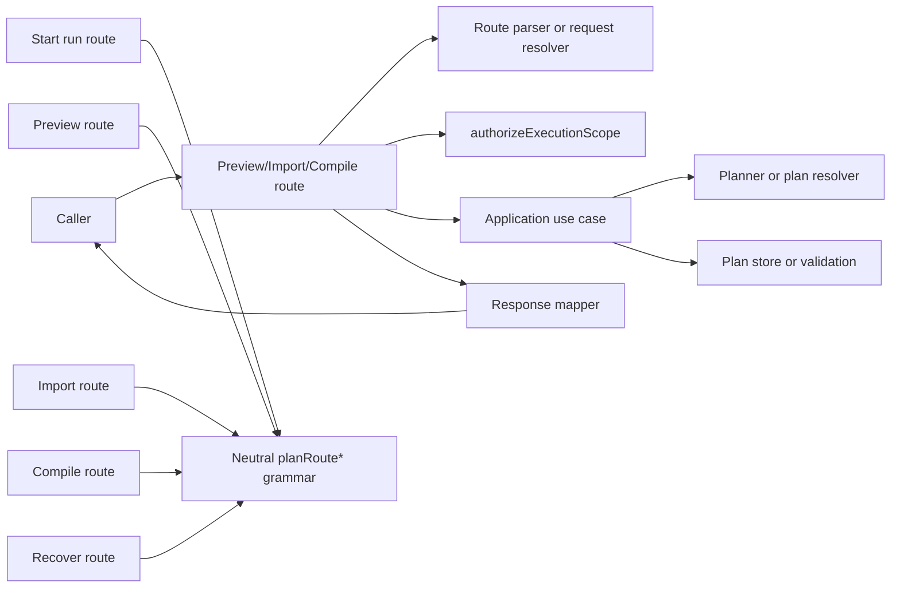

# Plan-route boundary remediation review

## Purpose

Freeze the Fowler, DDD, hexagonal, and SRP assessment for the current
plan-route branch work so the remaining remediation is explicit, sequenced, and
governed.

This review is execution-oriented. It does not reopen the accepted
`TF-A1-C`/`MW-D1` direction. It records what the branch materially improved,
what still drifts, and which next slices are worth funding.

## Scope

This review covers the active plan-route and compile-boundary reshaping in:

- `apps/api/src/entrypoints/http/previewPlanRoute.ts`
- `apps/api/src/entrypoints/http/previewPlanRouteRequestResolver.ts`
- `apps/api/src/entrypoints/http/previewPlanRouteRequestBinder.ts`
- `apps/api/src/entrypoints/http/previewPlanRouteParser.ts`
- `apps/api/src/entrypoints/http/previewPlanRouteResponseMapper.ts`
- `apps/api/src/entrypoints/http/importPlanRoute.ts`
- `apps/api/src/entrypoints/http/importPlanRouteParser.ts`
- `apps/api/src/entrypoints/http/compilePlanRoute.ts`
- `apps/api/src/entrypoints/http/planPreviewEnvelopeBinder.ts`
- `apps/api/src/entrypoints/http/planCompileRouteInputParser.ts`
- `apps/api/src/entrypoints/http/planRouteAuthorization.constants.ts`
- `apps/api/src/entrypoints/http/planRouteRequestResolver.ts`
- `apps/api/src/entrypoints/http/recoverRunRouteParser.ts`
- `apps/api/src/entrypoints/http/planRouteBodyParser.ts`
- `apps/api/src/entrypoints/http/planRoutePlanRefParser.ts`
- `apps/api/src/entrypoints/http/planRoutePlanSourcePolicy.ts`
- `apps/api/src/entrypoints/http/planRoutePlannerEnvelopeParser.ts`
- `apps/api/src/entrypoints/http/planRouteRunExecutionContextRefParser.ts`
- `apps/api/src/entrypoints/http/planRouteScope.ts`
- `apps/api/src/entrypoints/http/planRouteScopeParser.ts`
- `apps/api/src/entrypoints/http/planRouteSelectionParser.ts`
- `apps/api/src/entrypoints/http/planRouteTargetAdapterParser.ts`
- `apps/api/src/application/services/PreviewPlanUseCase.ts`
- `apps/api/src/application/services/ImportPlanUseCase.ts`
- `apps/api/src/application/services/CompilePlanUseCase.ts`
- `apps/api/src/application/services/planCompilePlannerEnvelopeMapper.ts`
- `apps/api/src/modules/planCompileBoundary.ts`
- `apps/api/test/entrypoints/http/previewPlanRoute.auth.test.ts`
- `apps/api/test/entrypoints/http/previewPlanRoute.inputPolicy.test.ts`
- `apps/api/test/entrypoints/http/previewPlanRoute.outcomes.test.ts`
- `apps/api/test/entrypoints/http/importPlanRoute.test.ts`
- `apps/api/test/entrypoints/http/compilePlanRoute.test.ts`
- `apps/api/test/entrypoints/http/planRouteRequestResolver.test.ts`
- `apps/api/test/entrypoints/http/planRouteParserHelpers.test.ts`
- `apps/api/test/entrypoints/http/planRouteScope.test.ts`
- `docs/architecture/components/api/index.md`
- `docs/guides/plan-compile-target-architecture-technical-manual-20260417.md`
- `docs/guides/plan-compile-catalog-extension-technical-manual-20260417.md`

It does not reassess worker composition, runtime execution semantics, or the
frontend Canvas slices except where they are directly affected by route-boundary
ownership.

## Governing sources

- `AGENTS.md`
- `docs/guides/ai-work-protocol.md`
- `docs/architecture/reference-architecture.md`
- `docs/adr/ADR-0012-plan-integrity-ownership.md`
- `docs/adr/ADR-0018_Shared_Kernel_Ownership_Governance.md`
- `docs/adr/ADR-0034-bounded-context-boundaries-and-communication-rules.md`
- `docs/adr/ADR-0035-planner-public-contract-evolution-protocol.md`
- `docs/planning/state/agent-lane-a.yaml`
- `docs/planning/proposals/mandatory/runtime-and-contracts/tf-a1-c-srp-and-extensibility-hardening-plan-20260414.md`
- `docs/planning/reviews/architecture-and-governance/20260418-mw-d1-external-compile-boundary-review.md`

## Branch summary

The branch is a real architectural improvement.

`planRoutes.ts` and `planRoutes.test.ts` are gone. Preview, import, compile,
and recover now own narrower seams, and shared route grammar no longer depends
on `startRun*` convenience helpers.

Compared with the pre-branch state, the backend is now closer to a Fowler
service-layer shape:

- preview behaves like a thin remote facade over an application service
- shared parsing moved toward neutral route-boundary ownership
- tests now follow narrower behavioral seams instead of one oversized route
  harness

The branch is not yet at the maturity level of a highly disciplined controller
or service boundary in a Spring, ASP.NET Core, or well-governed Rails service
layer. It is now pointed in that direction.

## Current code-grounded posture

Interpretation:

- remote-facade intent is now visible in code
- grammar ownership improved materially
- preview/import/compile now share one plan-route remote-facade shape in code
  and the active API component page points to that shared executor
- import ownership policy now uses canonical `ExecutionPlan.metadata.ownership`
- preview observability enrichment now binds once at the request boundary used
  by preview
- plan-route authorization metadata is now declared explicitly by each route
  wrapper instead of being hidden in the shared resolver
- plan-route authorization and planner-input enrichment posture now live in one
  declarative route-policy catalog
- plan-route request resolution now uses one declarative shared recipe with
  route-local parser, action, scope, and guard declarations
- preview and compile now assemble canonical planner input through one shared
  authorized planner-input seam
- compile catalog, profile, and planner-builder ownership now converge behind
  one root-owned boundary module instead of three thin composition wrappers
- compile normalization now has one canonical owner at the contract-parse
  boundary
- compile vocabulary is materially converged across active code and living
  guides

## What improved

### 1. Preview moved much closer to a true remote facade

Evidence:

- `apps/api/src/entrypoints/http/previewPlanRoute.ts`
- `apps/api/src/entrypoints/http/previewPlanRouteRequestResolver.ts`
- `apps/api/src/application/services/PreviewPlanUseCase.ts`

Before this branch, preview still behaved like a mixed transport, policy,
binding, application, and presenter module.

Now:

- the HTTP route is small
- request resolution is explicit
- the application use case owns plan build, persistence, and executability
  validation
- the response mapper owns outcome projection

This is a direct Fowler improvement.

### 2. Shared grammar no longer leaks from start-run ownership

Evidence:

- `apps/api/src/entrypoints/http/planRouteBodyParser.ts`
- `apps/api/src/entrypoints/http/planRoutePlannerEnvelopeParser.ts`
- `apps/api/src/entrypoints/http/planRouteRunExecutionContextRefParser.ts`
- `apps/api/src/entrypoints/http/startRunRouteParser.ts`

The branch fixed a real semantic coupling problem: preview/import/compile/recover
were reusing start-run grammar, not primitive parsing.

Moving shared grammar behind `planRoute*` seams is aligned with DDD and
hexagonal thinking:

- use the most neutral owner possible
- let start-run consume shared route grammar instead of exporting it
- keep application-specific command policy in the application-specific seam

### 3. Test decomposition improved the maintainability posture

Evidence:

- `apps/api/test/entrypoints/http/previewPlanRoute.auth.test.ts`
- `apps/api/test/entrypoints/http/previewPlanRoute.inputPolicy.test.ts`
- `apps/api/test/entrypoints/http/previewPlanRoute.outcomes.test.ts`
- `apps/api/test/entrypoints/http/planRouteParserHelpers.test.ts`
- `apps/api/test/entrypoints/http/planRouteScope.test.ts`

Replacing `planRoutes.test.ts` with smaller route and parser suites is a strong
move toward manageable test ownership.

This matches mature systems more closely than the previous one-file integration
harness.

### 4. Recover-route parser quality improved

Evidence:

- `apps/api/src/entrypoints/http/recoverRunRouteParser.ts`
- `apps/api/src/entrypoints/http/planRouteTargetAdapterParser.ts`

The route stopped owning ad hoc target-adapter branching and now uses a
parameterized shared parser. That is a good example of replacing convenience
conditionals with a reusable boundary primitive.

### 5. Request-resolution recipe is now codified as a declarative seam

Evidence:

- `apps/api/src/entrypoints/http/planRouteRequestResolver.ts`
- `apps/api/src/entrypoints/http/previewPlanRouteRequestResolver.ts`
- `apps/api/src/entrypoints/http/importPlanRouteRequestResolver.ts`
- `apps/api/src/entrypoints/http/compilePlanRouteRequestResolver.ts`

After closing the enrichment and authorization seams, the branch also moved the
request-resolution workflow itself into one owner.

The route-family wrappers now declare:

- request parser
- authorization action metadata
- requested-scope selector
- optional post-authorization guard

That is a meaningful maturity step because the wrappers now read more like
controller declarations over a framework recipe and less like handcrafted
adapter glue.

## Comparison with mature systems

<!-- markdownlint-disable MD060 -->

| Concern                   | Mature-system posture                                                        | Current branch posture                                                                                       | Judgment                           |
| ------------------------- | ---------------------------------------------------------------------------- | ------------------------------------------------------------------------------------------------------------ | ---------------------------------- |
| HTTP remote facade        | controller or endpoint delegates after parse and auth                        | preview/import/compile now share one handler factory and executor                                            | standardized for this route family |
| API boundary recipe       | one explicit parse -> authorize -> guard -> execute -> map response pipeline | the recipe is shared in code and now surfaced from the active API component page                             | materially codified                |
| Service layer             | orchestration lives in application service, not route                        | preview/import/compile delegate to explicit use cases                                                        | materially improved                |
| Shared boundary grammar   | neutral request DTO/parsing owner                                            | now largely `planRoute*` instead of `startRun*`                                                              | strong improvement                 |
| Observability enrichment  | one owner per boundary stage                                                 | preview observability shaping is bound once in request binding and passed through by the application service | closed in active code              |
| Authorization metadata    | route wrappers declare action semantics and helpers accept policy as input   | preview/import/compile pass explicit action metadata into the shared authorization resolver                  | materially codified                |
| Request-resolution recipe | wrappers declare route-local policy over one shared workflow                 | preview/import/compile now use one builder for parse plus authorize plus optional guard                      | materially codified                |
| Planner-input assembly    | one canonical builder attaches ownership and request metadata                | preview and compile now share one authorized planner-input helper selected from a route-policy catalog       | materially codified                |
| Boundary policy ownership | one composition owner packages policy facts and builder recipe               | one `planCompileBoundary` module now owns catalog, profile, and planner construction                         | materially converged               |
| Ubiquitous language       | one term per concept across contracts, services, docs                        | active code and active guides now use `plan compile` for the compile boundary                                | materially aligned                 |
| Ownership policy          | explicit domain metadata or policy port                                      | import enforces `ExecutionPlan.metadata.ownership`                                                           | closed in active code              |
| Living docs               | active docs match active code                                                | active API index and plan-compile guides now match the current route/code surface                            | closed in living docs              |

<!-- markdownlint-enable MD060 -->

## Findings

### Closed - Preview observability enrichment ownership was split between transport binding and application orchestration

Evidence:

- `apps/api/src/entrypoints/http/planPreviewEnvelopeBinder.ts`
- `apps/api/src/entrypoints/http/previewPlanRouteRequestBinder.ts`
- `apps/api/src/application/services/PreviewPlanUseCase.ts`

Problem:

Preview observability enrichment is currently shaped in two places:

- transport binding adds scope tags plus preview-runtime and provenance extras
- application orchestration rebuilds the same observability shape before
  planner execution

This is not yet a functional bug, but it creates two owners for the same
enrichment semantics. That is a likely future divergence point once preview
behavior or telemetry policy changes.

Correction status:

- closed on 2026-04-20
- `previewPlanRouteRequestBinder` now routes the real preview flow through
  `planPreviewEnvelopeBinder`
- `PreviewPlanUseCase` now consumes the finished observability payload instead
  of rebuilding preview scope and provenance metadata

### Closed - Plan-route authorization metadata was implicit in the shared resolver

Evidence:

- `apps/api/src/entrypoints/http/planRouteAuthorization.constants.ts`
- `apps/api/src/entrypoints/http/planRouteRequestResolver.ts`
- `apps/api/src/entrypoints/http/previewPlanRouteRequestResolver.ts`
- `apps/api/src/entrypoints/http/importPlanRouteRequestResolver.ts`
- `apps/api/src/entrypoints/http/compilePlanRouteRequestResolver.ts`

Problem:

The shared authorization helper standardized the route-family recipe, but it
also hardcoded `run:start`. That made one helper the silent owner of
route-family authorization metadata.

The route wrappers were therefore reusing a shared resolver without explicitly
declaring their own action semantics.

Correction status:

- closed on 2026-04-20
- plan-route authorization metadata now lives in
  `planRouteAuthorization.constants.ts`
- preview/import/compile wrappers now pass explicit action metadata into
  `resolveAuthorizedPlanRouteRequest`

### Closed - Compile boundary policy ownership was spread across three composition modules

Evidence:

- `apps/api/src/modules/planCompileBoundary.ts`
- `apps/api/src/modules/buildProtectedRuntimeModule.ts`
- `apps/api/test/modules.test.ts`

Problem:

The compile boundary kept the right concepts, but their executable ownership
was fragmented:

- catalog definitions lived in one module
- profile aliases lived in a second
- planner construction lived in a third

That file split no longer represented three real owners. It created maintenance
sprawl around one bounded concern and left one alias-only seam as a drift
surface.

Correction status:

- closed on 2026-04-20
- `planCompileBoundary.ts` now owns the built-in catalog, the typed compile
  profile, catalog resolution, and planner construction
- the old alias seams were removed instead of preserved through compatibility
  exports

## Repetitions worth watching

The previously open route-family repetition in this review is now closed.
At this layer, the next work is lower-order hardening rather than another
duplicated preview/import/compile seam.

## Teachings for future slices

### 1. Shared ownership must be semantic, not convenient

The move from `startRun*` grammar to `planRoute*` grammar is the right lesson:
reuse should follow ownership, not who happened to implement the helper first.

### 2. Once a boundary pipeline appears three times, it becomes framework

The durable lesson is not only to share an executor in code. The repository
should name and document the pipeline itself:

- parse
- authorize
- guard
- execute
- map response

### 3. Do not let telemetry become policy

Observability tags are valuable, but they should not silently become the source
of truth for authorization or plan ownership. This branch already closed one
instance of that drift by moving import onto canonical ownership metadata.

### 4. Give enrichment one owner

If transport binds preview observability, provenance, or scope tags, the
application should consume that finished shape instead of reconstructing it.
Split enrichment ownership is how silent semantic drift starts.

### 5. Shared helpers should take policy as input

A reusable helper may own workflow, but it should not silently own route
policy. If a wrapper has a distinct authorization action, that metadata should
stay declared at the wrapper seam and be passed into the helper explicitly.

### 6. Normalize one canonical shape in one place

Compile graph-source and selection normalization now lives at the contract
parse boundary. That is the right ownership line to preserve in future slices.

### 7. Living docs need the same closure discipline as code

Deleting `planRoutes.ts` without updating the active API index leaves a false
architecture breadcrumb. That kind of drift compounds quickly.

### 8. Vocabulary drift is an architectural bug, not just a naming nit

If two names mean the same thing, one should win on active code and active
guides. Historical proposal and review artifacts can keep older names as
history, but they should not compete with living documentation.

## Recommended remediation slices

### TF-A1-C14 - Converge compile vocabulary and active docs

Status:

- closed in the active code and living docs tracked by this review

### TF-A1-C15 - Unify preview observability enrichment ownership

Status:

- closed in active code and tests on 2026-04-20

Target:

- keep preview observability enrichment in one owner only
- let the other seam pass through or validate a finished shape
- stop rebuilding preview provenance/runtime metadata across
  `planPreviewEnvelopeBinder` and `PreviewPlanUseCase`

### TF-A1-C16 - Externalize plan-route authorization metadata

Status:

- closed in active code and tests on 2026-04-20

Target:

- make preview, import, and compile declare their authorization action
  metadata explicitly
- keep `resolveAuthorizedPlanRouteRequest` generic over the route-family
  execution recipe instead of hardcoding one route action
- remove the hidden coupling where one shared helper silently owns the
  authorization policy for the full `plan-*` family

### TF-A1-C17 - Declarativize the plan-route request-resolution recipe

Status:

- closed in active code and tests on 2026-04-20

Target:

- let plan-route wrappers declare parser, action metadata, scope selector, and
  optional guard through one shared builder
- keep the request-resolution workflow itself in one owner instead of
  repeating wrapper-level orchestration
- move the family one step closer to the mature controller pattern where
  route files are declarations over a framework recipe, not bespoke glue code

### TF-A1-C18 - Converge compile-boundary ownership

Status:

- closed in active code and docs on 2026-04-20

Target:

- keep catalog and profile as distinct concepts, but give them one executable
  owner in the composition boundary
- remove alias-only compile-boundary wrapper modules instead of preserving
  compatibility shims
- keep the compile planner fail-closed while reducing module-level sprawl

### TF-A1-C19 - Declare route policy catalog and canonical planner-input seam

Status:

- closed in active code, docs, and tests on 2026-04-20

Target:

- keep preview/import/compile route policy in one declarative catalog instead
  of splitting action and planner-input ownership metadata
- let preview and compile build canonical planner input through one shared
  authorized seam instead of separate application helpers
- add route-family policy-matrix tests so future drift is caught before it
  escapes as route outcomes

## Review verdict

This branch improved the architecture.

It did not merely move code around:

- preview is materially closer to Fowler remote-facade plus service-layer
  posture
- shared route grammar ownership is cleaner
- parser and test seams are more honest
- preview observability enrichment now has one real owner in the active flow
- plan-route authorization metadata is now explicit at the route-wrapper seam
- route-family request resolution is now expressed through one declarative
  builder instead of wrapper-specific orchestration glue
- route-family authorization and planner-input posture now live in one
  declarative policy catalog
- preview and compile now share one authorized planner-input seam
- compile-boundary policy ownership now converges in one root-owned module
  instead of three thin composition seams

The seam-level residuals captured by this review are now closed. What remains
after this point is lower-order hardening, not ambiguity about who owns preview
enrichment, route-family policy metadata, the canonical planner-input seam,
the route-family request-resolution recipe, or compile-boundary policy
assembly.
