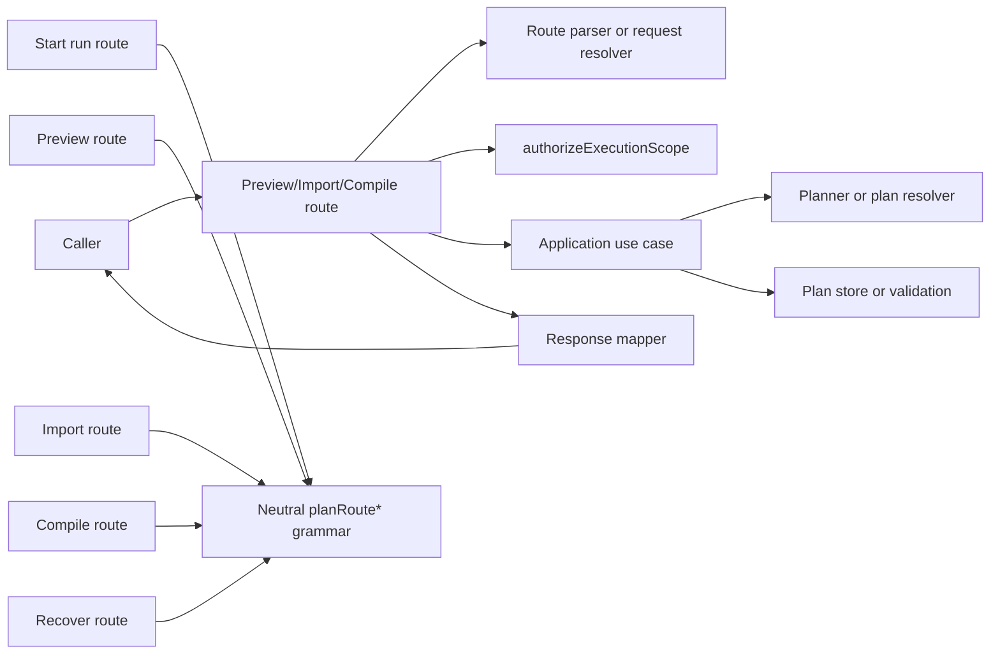

# Plan-route boundary remediation review

## Purpose

Freeze the Fowler, DDD, hexagonal, and SRP assessment for the current
plan-route branch work so the remaining remediation is explicit, sequenced, and
governed.

This review is execution-oriented. It does not reopen the accepted
`TF-A1-C`/`MW-D1` direction. It records what the branch materially improved,
what still drifts, and which next slices are worth funding.

## Scope

This review covers the active plan-route and compile-boundary reshaping in:

- `apps/api/src/entrypoints/http/previewPlanRoute.ts`
- `apps/api/src/entrypoints/http/previewPlanRouteRequestResolver.ts`
- `apps/api/src/entrypoints/http/previewPlanRouteParser.ts`
- `apps/api/src/entrypoints/http/previewPlanRouteResponseMapper.ts`
- `apps/api/src/entrypoints/http/importPlanRoute.ts`
- `apps/api/src/entrypoints/http/importPlanRouteParser.ts`
- `apps/api/src/entrypoints/http/compilePlanRoute.ts`
- `apps/api/src/entrypoints/http/planCompileRouteInputParser.ts`
- `apps/api/src/entrypoints/http/recoverRunRouteParser.ts`
- `apps/api/src/entrypoints/http/planRouteBodyParser.ts`
- `apps/api/src/entrypoints/http/planRoutePlanRefParser.ts`
- `apps/api/src/entrypoints/http/planRoutePlanSourcePolicy.ts`
- `apps/api/src/entrypoints/http/planRoutePlannerEnvelopeParser.ts`
- `apps/api/src/entrypoints/http/planRouteRunExecutionContextRefParser.ts`
- `apps/api/src/entrypoints/http/planRouteScope.ts`
- `apps/api/src/entrypoints/http/planRouteScopeParser.ts`
- `apps/api/src/entrypoints/http/planRouteSelectionParser.ts`
- `apps/api/src/entrypoints/http/planRouteTargetAdapterParser.ts`
- `apps/api/src/application/services/PreviewPlanUseCase.ts`
- `apps/api/src/application/services/ImportPlanUseCase.ts`
- `apps/api/src/application/services/CompileExternalPlanUseCase.ts`
- `apps/api/src/application/services/externalCompilePlannerEnvelopeMapper.ts`
- `apps/api/src/modules/externalCompileCatalog.ts`
- `apps/api/test/entrypoints/http/previewPlanRoute.auth.test.ts`
- `apps/api/test/entrypoints/http/previewPlanRoute.inputPolicy.test.ts`
- `apps/api/test/entrypoints/http/previewPlanRoute.outcomes.test.ts`
- `apps/api/test/entrypoints/http/importPlanRoute.test.ts`
- `apps/api/test/entrypoints/http/compilePlanRoute.test.ts`
- `apps/api/test/entrypoints/http/planRouteParserHelpers.test.ts`
- `apps/api/test/entrypoints/http/planRouteScope.test.ts`
- `docs/architecture/components/api/index.md`

It does not reassess worker composition, runtime execution semantics, or the
frontend Canvas slices except where they are directly affected by route-boundary
ownership.

## Governing sources

- `AGENTS.md`
- `docs/guides/ai-work-protocol.md`
- `docs/architecture/reference-architecture.md`
- `docs/adr/ADR-0012-plan-integrity-ownership.md`
- `docs/adr/ADR-0018_Shared_Kernel_Ownership_Governance.md`
- `docs/adr/ADR-0034-bounded-context-boundaries-and-communication-rules.md`
- `docs/adr/ADR-0035-planner-public-contract-evolution-protocol.md`
- `docs/planning/state/agent-lane-a.yaml`
- `docs/planning/proposals/mandatory/runtime-and-contracts/tf-a1-c-srp-and-extensibility-hardening-plan-20260414.md`
- `docs/planning/reviews/architecture-and-governance/20260418-mw-d1-external-compile-boundary-review.md`

## Branch summary

The branch is a real architectural improvement.

`planRoutes.ts` and `planRoutes.test.ts` are gone. Preview, import, compile,
and recover now own narrower seams, and shared route grammar no longer depends
on `startRun*` convenience helpers.

Compared with the pre-branch state, the backend is now closer to a Fowler
service-layer shape:

- preview behaves like a thin remote facade over an application service
- shared parsing moved toward neutral route-boundary ownership
- tests now follow narrower behavioral seams instead of one oversized route
  harness

The branch is not yet at the maturity level of a highly disciplined controller
or service boundary in a Spring, ASP.NET Core, or well-governed Rails service
layer. It is now pointed in that direction.

## Current code-grounded posture

Interpretation:

- remote-facade intent is now visible in code
- grammar ownership improved materially
- route orchestration is still repeated instead of standardized
- import ownership policy is still weaker than the surrounding architecture
- compile vocabulary is not yet fully converged

## What improved

### 1. Preview moved much closer to a true remote facade

Evidence:

- `apps/api/src/entrypoints/http/previewPlanRoute.ts`
- `apps/api/src/entrypoints/http/previewPlanRouteRequestResolver.ts`
- `apps/api/src/application/services/PreviewPlanUseCase.ts`

Before this branch, preview still behaved like a mixed transport, policy,
binding, application, and presenter module.

Now:

- the HTTP route is small
- request resolution is explicit
- the application use case owns plan build, persistence, and executability
  validation
- the response mapper owns outcome projection

This is a direct Fowler improvement.

### 2. Shared grammar no longer leaks from start-run ownership

Evidence:

- `apps/api/src/entrypoints/http/planRouteBodyParser.ts`
- `apps/api/src/entrypoints/http/planRoutePlannerEnvelopeParser.ts`
- `apps/api/src/entrypoints/http/planRouteRunExecutionContextRefParser.ts`
- `apps/api/src/entrypoints/http/startRunRouteParser.ts`

The branch fixed a real semantic coupling problem: preview/import/compile/recover
were reusing start-run grammar, not primitive parsing.

Moving shared grammar behind `planRoute*` seams is aligned with DDD and
hexagonal thinking:

- use the most neutral owner possible
- let start-run consume shared route grammar instead of exporting it
- keep application-specific command policy in the application-specific seam

### 3. Test decomposition improved the maintainability posture

Evidence:

- `apps/api/test/entrypoints/http/previewPlanRoute.auth.test.ts`
- `apps/api/test/entrypoints/http/previewPlanRoute.inputPolicy.test.ts`
- `apps/api/test/entrypoints/http/previewPlanRoute.outcomes.test.ts`
- `apps/api/test/entrypoints/http/planRouteParserHelpers.test.ts`
- `apps/api/test/entrypoints/http/planRouteScope.test.ts`

Replacing `planRoutes.test.ts` with smaller route and parser suites is a strong
move toward manageable test ownership.

This matches mature systems more closely than the previous one-file integration
harness.

### 4. Recover-route parser quality improved

Evidence:

- `apps/api/src/entrypoints/http/recoverRunRouteParser.ts`
- `apps/api/src/entrypoints/http/planRouteTargetAdapterParser.ts`

The route stopped owning ad hoc target-adapter branching and now uses a
parameterized shared parser. That is a good example of replacing convenience
conditionals with a reusable boundary primitive.

## Comparison with mature systems

| Concern                 | Mature-system posture                                 | Current branch posture                                         | Judgment                            |
| ----------------------- | ----------------------------------------------------- | -------------------------------------------------------------- | ----------------------------------- |
| HTTP remote facade      | controller or endpoint delegates after parse and auth | preview now does this well; import and compile partially do    | improved but not fully standardized |
| Service layer           | orchestration lives in application service, not route | preview clearly yes; import and compile still lighter or mixed | materially improved                 |
| Shared boundary grammar | neutral request DTO/parsing owner                     | now largely `planRoute*` instead of `startRun*`                | strong improvement                  |
| Ubiquitous language     | one term per concept across contracts, services, docs | `plan-compile` and `externalCompile` still compete             | still drifting                      |
| Ownership policy        | explicit domain metadata or policy port               | import still infers scope from observability tags              | not mature yet                      |
| Living docs             | active docs match active code                         | active API index still references deleted `planRoutes.ts`      | drift remains                       |

## Findings

### High - Route-facade choreography is still repeated across entrypoints

Evidence:

- `apps/api/src/entrypoints/http/previewPlanRoute.ts`
- `apps/api/src/entrypoints/http/previewPlanRouteRequestResolver.ts`
- `apps/api/src/entrypoints/http/importPlanRoute.ts`
- `apps/api/src/entrypoints/http/compilePlanRoute.ts`
- `apps/api/src/entrypoints/http/runCommandRouteExecutor.ts`

Problem:

The branch removed the god-route, but it did not yet standardize the resulting
boundary recipe.

Preview/import/compile still repeat the same steps in slightly different
shapes:

- parse or resolve body
- extract bearer token
- authorize scope
- delegate to use case or planner
- map internal errors
- send `200` plus route-specific payload

This is better than before, but mature systems usually codify this into one
standard remote-facade execution pattern. The repo already has a related
pattern in `runCommandRouteExecutor.ts`, which makes the repetition more
visible.

Required correction:

- introduce one root-owned plan-route remote-facade recipe or executor
- preserve route-specific parsers and mappers
- do not collapse the result back into another convenience god-module

### Medium - Import ownership still uses observability tags as domain truth

Evidence:

- `apps/api/src/application/services/ImportPlanUseCase.ts`

Problem:

`ImportPlanUseCase` determines scope ownership by reading
`plan.observability?.tags['dvt.scope.*']`.

That is architecturally weak:

- observability should support diagnosis, not own authorization truth
- the policy is not explicit as a domain port
- the plan shape does not make ownership semantics first-class

This is not a correctness failure if the tags are faithfully written, but it is
not the design level expected from the rest of the repository.

Required correction:

- move scope ownership onto canonical plan metadata or an explicit ownership
  policy port
- keep the import use case focused on orchestration, not telemetry decoding

### Medium - Compile normalization is duplicated in transport and application

Evidence:

- `apps/api/src/entrypoints/http/planCompileRouteInputParser.ts`
- `apps/api/src/application/services/externalCompilePlannerEnvelopeMapper.ts`

Problem:

The compile path normalizes graph source and selection twice:

- once while parsing HTTP input
- again while mapping the application command to planner envelope

That duplication is small today but structurally dangerous because it creates
two owners for one canonical shape.

Required correction:

- choose one canonical normalization owner
- let the other seam only validate, copy, or enrich

### Medium - Compile vocabulary is not yet converged

Evidence:

- `packages/@dvt/contracts/src/schema-packs/plan-compile.ts`
- `apps/api/src/application/services/externalCompilePlannerEnvelopeMapper.ts`
- `apps/api/src/modules/externalCompileCatalog.ts`
- `docs/guides/external-compile-target-architecture-technical-manual-20260417.md`

Problem:

The public contract has moved toward `plan-compile`, while application and
module naming still say `externalCompile*`, and the living guides still use
`external compile` as the dominant term.

This may be acceptable if the intended distinction is:

- `plan compile` = public route contract
- `external compile` = internal product/bounded-context name

That distinction is not documented clearly enough yet, so the code currently
reads like competing vocabularies rather than a deliberate language split.

Required correction:

- pick one documented vocabulary strategy
- align code, guides, and active architecture docs to it

### High - Active documentation drift remains

Evidence:

- `docs/architecture/components/api/index.md`

Problem:

The active API component index still references deleted `planRoutes.ts`.

That is not acceptable historical residue. It is a living architecture entry
point and must describe the real current system.

Required correction:

- remove deleted anchors from active docs
- distinguish active guidance from historical references

## Repetitions worth watching

These are not all immediate blockers, but they are the next drift sources:

- transport/auth/error choreography repeated across plan routes
- compile normalization repeated across route and application layers
- scope tagging repeated as both observability and effective ownership signal
- compile vocabulary split between `plan-compile` and `externalCompile`

## Teachings for future slices

### 1. Shared ownership must be semantic, not convenient

The move from `startRun*` grammar to `planRoute*` grammar is the right lesson:
reuse should follow ownership, not who happened to implement the helper first.

### 2. Once a route pattern appears three times, it becomes framework

Preview/import/compile now repeat enough structure that the repository should
promote the boundary recipe to a standard.

### 3. Do not let telemetry become policy

Observability tags are valuable, but they should not silently become the source
of truth for import authorization or plan ownership.

### 4. Living docs need the same closure discipline as code

Deleting `planRoutes.ts` without updating the active API index leaves a false
architecture breadcrumb. That kind of drift compounds quickly.

### 5. Vocabulary drift is an architectural bug, not just a naming nit

If `plan-compile` and `external compile` mean different things, that difference
must be explicit. If they mean the same thing, one should win.

## Recommended remediation slices

### TF-A1-C12 - Standardize the plan-route remote facade

Goal:

- keep route-specific parser and presenter seams
- remove repeated auth and response choreography
- define one route-execution recipe for preview/import/compile

Acceptance posture:

- plan-route entrypoints share one root-owned remote-facade pattern
- no entrypoint regresses into a multi-purpose convenience module

### TF-A1-C13 - Replace observability-backed import ownership

Goal:

- stop deriving import ownership from observability tags
- introduce explicit ownership metadata or a dedicated ownership-policy port

Acceptance posture:

- import ownership is first-class and testable
- observability remains supporting evidence, not authorization truth

### TF-A1-C14 - Converge compile vocabulary and active docs

Goal:

- remove active documentation drift
- align `plan-compile` versus `external compile`
- leave historical references historical, not active

Acceptance posture:

- active docs no longer reference deleted route modules
- compile boundary naming follows one declared language strategy

## Review verdict

This branch improved the architecture.

It did not merely move code around:

- preview is materially closer to Fowler remote-facade plus service-layer
  posture
- shared route grammar ownership is cleaner
- parser and test seams are more honest

The remaining issues are now narrower and more architectural:

- standardize the route-facade recipe
- stop using observability as ownership truth
- converge compile vocabulary and living docs

That is the right kind of residual work. The branch reduced structural noise and
exposed a smaller, more credible follow-up set.
