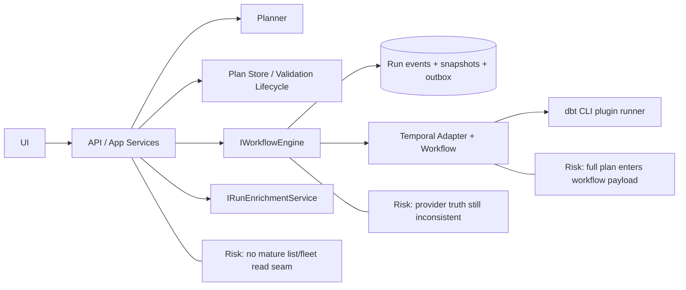
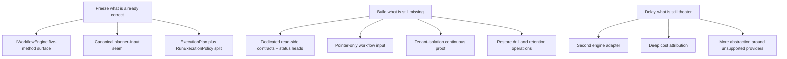
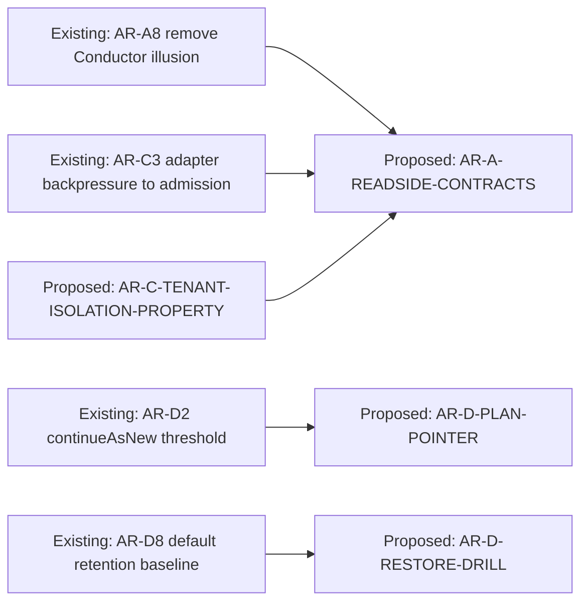

# DVT+ System Architecture Review

**Plan-driven. Outcome-agnostic.**

## Governing sources used

- `AGENTS.md`
- `docs/planning/status/governance-document-rule-inventory.md`
- `docs/guides/ai-work-protocol.md`
- `docs/architecture/reference-architecture.md`
- `docs/architecture/system-delivery-status.md`
- `docs/planning/state/planning-control-tower.md`
- `packages/@dvt/contracts/src/contracts/planner/ExecutionPlan.v1.ts`
- `packages/@dvt/contracts/src/contracts/engine/RunExecutionPolicy.v1.ts`
- `packages/@dvt/contracts/src/contracts/engine/StartRunBoundary.v1.ts`
- `packages/@dvt/contracts/src/contracts/engine/RunExecutionContext.v1.ts`
- `packages/@dvt/contracts/src/types/contracts.ts`
- `packages/@dvt/engine/src/contracts/IWorkflowEngine.v1.ts`
- `packages/@dvt/engine/src/core/WorkflowEngine.ts`
- `packages/@dvt/engine/src/application/StartRunApplicationService.ts`
- `packages/@dvt/engine/src/application/StartRunAdmissionGuard.ts`
- `packages/@dvt/engine/src/security/RunAccessPolicy.ts`
- `packages/@dvt/engine/src/application/providerSelection.ts`
- `packages/@dvt/adapter-temporal/src/TemporalAdapter.ts`
- `packages/@dvt/adapter-temporal/src/workflows/RunPlanWorkflow.ts`
- `packages/@dvt/adapter-temporal/src/plugins/dbt/DbtCliPluginRunner.ts`
- `packages/@dvt/planner/src/domain/Planner.ts`
- `packages/@dvt/planner/src/domain/PlanAssembler.ts`
- `packages/@dvt/adapter-postgres/src/PostgresRunStateStoreAdapter.ts`
- `packages/@dvt/adapter-postgres/src/PostgresStateStoreRuntime.ts`
- `packages/@dvt/adapter-postgres/src/PostgresOutboxStore.ts`
- `apps/api/src/application/services/CompilePlanUseCase.ts`
- `apps/api/src/application/services/PreviewPlanUseCase.ts`
- `apps/api/src/application/services/ImportPlanUseCase.ts`
- `apps/api/src/application/services/getRunStatusUseCase.ts`
- `apps/api/src/application/services/listRunsUseCase.ts`
- `apps/api/src/application/services/resolveAuthorizedPlannerInputEnvelope.ts`
- `apps/api/src/application/services/planRoutePolicyCatalog.ts`
- `apps/web/src/app/services/plans/plansService.api.ts`
- `apps/web/src/app/services/runs/runsService.api.ts`
- `docs/adr/ADR-0003-execution-model.md`
- `docs/adr/ADR-0004-event-sourcing-strategy.md`
- `docs/adr/ADR-0015-getRunStatus-read-model-separation.md`
- `docs/adr/ADR-0030-pre-dispatch-intent-log.md`
- `docs/adr/ADR-0031-adapter-tenant-isolation.md`
- `docs/adr/ADR-0045-dedicated-status-head-read-model.md`
- `docs/planning/reviews/architecture-and-governance/20260413-dvt-plus-architectural-audit-review.md`
- `docs/planning/reviews/architecture-and-governance/20260414-principal-architect-review-dvtplus.md`
- `docs/planning/reviews/architecture-and-governance/20260419-plan-route-boundary-remediation-review.md`

## Source-of-truth correction

The user referenced `dvt_workflow_engine_artifact` and
`dvt_v2_architecture_explanation`. Those filenames do not exist in the
repository as of 2026-04-20. That is documentation naming drift. This review
uses the actual canonical sources listed above instead of inventing aliases.

## Pattern delta since the earlier April reviews

The architecture is better than it was in the 2026-04-13 and 2026-04-14 review
baseline. These are real improvements, not optimism:

- `IWorkflowEngine` is now materially narrower in practice. Canonical status is
  separate from provider-live enrichment through `IRunEnrichmentService`.
- The plan-route boundary is cleaner. `preview`, `compile`, and `import` now
  converge on a canonical planner-input seam plus a declarative route policy
  catalog.
- `RunExecutionPolicy` is separated from `ExecutionPlan`. That is the right
  Fowler move: runtime admission policy stopped pretending to be planner-owned
  topology.
- The old criticism that the Postgres state adapter was one fused blob is now
  stale. `PostgresStateStoreRuntime` composes metadata, snapshots, events,
  outbox, and lineage collaborators explicitly.
- `RunPlanWorkflow` is no longer one oversized transaction script. Lifecycle,
  layer execution, signals, cursor parsing, artifact shaping, and cancellation
  now live in focused workflow helper modules. That is a real Fowler-style
  extract-module improvement: orchestration stayed thin while local policy
  moved closer to its reason to change.
- The branch did not fully finish the adapter/plugin boundary. DBT is
  operationally optional at the worker composition root, but still built into
  the default step-activity registry and public surface of
  `@dvt/adapter-temporal`. That is better than kernel leakage, but it is not
  the same thing as a fully externalized plugin seam.

Those are genuine pattern improvements. They do not remove the remaining scale,
truth, and replaceability problems.

## 1. Conceptual Soundness

### Verdict

The central principle still mostly holds:

> The UI does not execute.  
> The engine decides on its domain.  
> The planner does not persist state.

It holds strongly on planner purity and UI non-execution. It holds only
partially on engine sovereignty because provider truth, read-side truth, and
policy truth are still inconsistent in a few load-bearing places.

### What is solid

| Area                         | Verdict | Why it is solid                                                                                                                                             |
| ---------------------------- | ------- | ----------------------------------------------------------------------------------------------------------------------------------------------------------- |
| Planner purity               | Strong  | `Planner.buildPlan()` is deterministic, content-addressed, and persistence-free. The planner builds topology and policy materialization, not runtime state. |
| UI non-execution             | Strong  | Web code posts to `/plans/preview` and `/runs/start`. It does not talk to Temporal, Postgres, or dbt directly.                                              |
| Engine facade shape          | Good    | `IWorkflowEngine` exposes five methods. That is a sane control-plane boundary.                                                                              |
| State as source of truth     | Good    | Event log plus derived snapshot remains the model. `getRunStatus()` is explicitly canonical-read first, provider-read second.                               |
| Plan identity                | Strong  | `planId = sha256(JCS(planCore))` is a durable design choice. Mature systems do this or regret not doing it.                                                 |
| Planner-input seam           | Good    | `resolveAuthorizedPlannerInputEnvelope()` plus `PLAN_ROUTE_POLICY_CATALOG` is a real convergence seam, not documentation theater.                           |
| Postgres runtime composition | Good    | Metadata, snapshots, events, outbox, and lineage are now split collaborators under one runtime shell. That is closer to mature storage adapters.            |

### What is fragile

| Area                      | Fragility | Why it is fragile                                                                                                                                                                                                                                                                               |
| ------------------------- | --------- | ----------------------------------------------------------------------------------------------------------------------------------------------------------------------------------------------------------------------------------------------------------------------------------------------- |
| Provider truth            | High      | `StartRunBoundary.v1.ts` supports `temporal` and `mock`, but `Provider`, `EngineRunRef`, `RunExecutionContext`, `providerSelection.ts`, and Conductor stubs still advertise `conductor`. The supported runtime set is not one truth.                                                            |
| ExecutionPlan portability | High      | The canonical retry shape uses Temporal-style duration strings. The contract already leaks the only real runtime.                                                                                                                                                                               |
| Step extensibility        | High      | `stepTypeConfig?: Record<string, unknown>` remains the main extensibility surface. That is an untyped tunnel between planner and adapters.                                                                                                                                                      |
| Workflow payload shape    | High      | `TemporalAdapter.startRun()` passes the full `ExecutionPlan` into workflow input. `RunPlanWorkflow` also carries `completedStepResults`, `gatewayDecisions`, `skippedStepIds`, and `processedControlSignalIds` across `continueAsNew`. This is a payload-growth strategy, not a scale strategy. |
| Hot read path             | Medium    | Single-run canonical reads are acceptable. Fleet/list reads are not mature. `ListRunsUseCase` does `listRuns()` and then N additional `getSnapshot()` reads.                                                                                                                                    |
| Read-side composition     | Medium    | `GetRunStatusUseCase` is doing canonical status, enrichment, staleness, snapshot read, event read, and plan-record evidence assembly in one place. That is not a durable mature read-side split.                                                                                                |
| Plugin security model     | Medium    | `DbtCliPluginRunner` untars a bundle to a temp directory and shells out to `dbt`. Admission checks are good, but runtime hardening is still process-governed rather than sandbox-governed.                                                                                                      |

### What is missing

| Missing element                                               | Why it matters                                                                                                              |
| ------------------------------------------------------------- | --------------------------------------------------------------------------------------------------------------------------- |
| Dedicated read-side contract family outside `IWorkflowEngine` | Mature systems do not force list, fleet, cost, and diagnostic views through ad hoc API orchestration over low-level stores. |
| Pointer-only workflow input mode                              | Passing the whole plan into Temporal is a short-term convenience with a long-term payload ceiling.                          |
| Continuous tenant-isolation proof                             | ADR-0031 gives policy. It does not give continuous property-level proof.                                                    |
| Workflow-state schema evolution strategy                      | `continueAsNew` state is real persisted execution state. There is no governed migration posture for it.                     |
| Cost contract                                                 | "Cost-aware" remains marketing until there is a contract for emitted cost facts and reconciliation.                         |

### Is the Planner / Engine / State split actually clean?

Mostly yes.

- Planner is clean.
- State is mostly clean.
- Engine is improved, but it still carries truth drift around supported
  providers and it still depends on a mixed `IRunAccessPolicy` that bundles
  authorization, plan-ref validation, and rate limiting.

From a Fowler perspective:

- `Planner` is a clean deterministic domain service.
- `StartRunApplicationService` is the right application-service extraction.
- `WorkflowEngine` is now a facade over narrower collaborators, which is good.
- The next erosion point is the read side, not the command side.

### Is `ExecutionPlan` correctly positioned?

Better than before, but not yet fully mature.

What is correct:

- topology
- hashable identity
- per-step retry policy
- ownership metadata

What is still wrong:

- Temporal-shaped duration strings in canonical policy
- open-ended `observability` bag
- opaque `stepTypeConfig` tunnel

Mature systems keep the canonical plan small, typed, and boring. DVT is still
too permissive in the places where future drift will hurt most.

### Is state-driven UI realistic at scale?

For single-run status: yes.

For fleet views, review boards, heavy dashboards, and cost screens: not with
the current read path.

Mature systems split:

- command boundary
- single-run canonical status
- fleet/status-head reads
- analytics/cost reads

DVT currently has the first two. It does not yet have the second two in a
governed contract family.

### Are contracts sufficiently stable?

Stable enough for continued hardening. Not stable enough to claim mature
replaceability.

The stable parts:

- `IWorkflowEngine`
- `RunExecutionPolicy`
- canonical planner input seam
- event-sourced run identity

The unstable parts:

- provider set truth
- `ExecutionPlan` portability
- workflow-state evolution story
- plugin/runtime capability surface

### Comparison with mature systems

| Concern                 | DVT today | Mature systems do                                                                     |
| ----------------------- | --------- | ------------------------------------------------------------------------------------- |
| Command boundary        | Good      | Similar: narrow control-plane APIs                                                    |
| Hot status reads        | Partial   | Use dedicated status-head or materialized head reads                                  |
| Workflow payload        | Weak      | Pass plan pointer or content-addressed execution pointer, not the full DAG repeatedly |
| Provider support claims | Weak      | Align advertised providers with real conformance-tested implementations               |
| Tenant isolation        | Partial   | Use application checks plus continuous property tests and often DB backstops          |
| Extensibility           | Mixed     | Prefer typed extension catalogs over opaque config blobs                              |

## 2. Architectural Risk Map

| Risk                                  | Severity | Likelihood | Why                                                                                                                           | Mitigation                                                                                   |
| ------------------------------------- | -------- | ---------- | ----------------------------------------------------------------------------------------------------------------------------- | -------------------------------------------------------------------------------------------- |
| Workflow payload growth               | High     | High       | Full `ExecutionPlan` plus accumulated workflow state crosses the Temporal start and `continueAsNew` boundary                  | Introduce pointer-only workflow input and externalized compact execution-state artifact      |
| Hot read bottleneck                   | High     | High       | `ListRunsUseCase` is N+1 and ADR-0045 `run_status_heads` is still Proposed                                                    | Build a dedicated read-side contract family and implement `run_status_heads`                 |
| Event/state duplication drift         | Medium   | Medium     | Canonical status, workflow snapshot, provider view, plan record, and evidence model are assembled in one read use case        | Split canonical read, evidence read, and enrichment read into distinct contract surfaces     |
| Idempotency breakdown on new adapters | High     | Medium     | Conductor is still present in contracts and provider selection despite not being a real runtime                               | Remove Conductor illusion before adding any second runtime                                   |
| Planner/engine responsibility creep   | Medium   | Medium     | Planner already owns retry materialization and step validation; engine still owns mixed access policy and runtime truth drift | Freeze planner output scope and split `IRunAccessPolicy` into explicit policy roles          |
| Plugin execution security             | High     | Medium     | dbt bundle is unpacked locally and executed via CLI; admission is stronger than sandboxing                                    | Add capability allowlists, stricter bundle binding, and runtime isolation proof              |
| Multi-tenant isolation flaw           | High     | Low        | App-level tenant checks are real, but DB-level backstop is not active and continuous property testing is absent               | Add continuous tenant-isolation property tests; decide explicitly whether DB RLS is required |
| Cost attribution ambiguity            | Medium   | High       | There is no emitted cost contract, only intent and roadmap pressure                                                           | Define cost facts and reconciliation boundaries before any dashboard or budget feature       |
| Operational complexity sprawl         | Medium   | High       | Postgres runtime, outbox, projector, lineage, Temporal worker, dbt bundle runner, retention workers, intent reconciliation    | Publish stronger operational dependency graphs, restore drills, and scaling rules            |
| Documentation drift                   | Medium   | High       | Top-level architecture docs lag the shipped plan-route seam, read-boundary split, and provider truth                          | Run truth-sync documentation slices before adding more features                              |

## 3. Engine Abstraction Critique

### Is `IWorkflowEngine` minimal and correct?

Yes.

This is one of the stronger parts of the system:

- `startRun`
- `recoverRun`
- `cancelRun`
- `getRunStatus`
- `signal`

That is a minimal control-plane interface. It is close to what mature durable
execution systems expose.

The problem is not the method count. The problem is the truth around it.

### Where the engine abstraction is correct

- The engine facade no longer pretends to own enrichment.
- `StartRunApplicationService` is the correct application-service move.
- `StartRunAdmissionGuard` is the correct place for admission and capability checks.
- `TemporalAdapter` is isolated behind `IProviderAdapter`.

### Where it is still weak

| Weakness                                                                       | Why it matters                                                                   |
| ------------------------------------------------------------------------------ | -------------------------------------------------------------------------------- |
| `IRunAccessPolicy` mixes authorization, plan-ref validation, and rate limiting | This violates SRP and makes admission hardening less modular than it should be   |
| Provider truth still includes `conductor`                                      | The abstraction advertises replaceability it has not earned                      |
| `signal()` is intentionally generic                                            | Fine now, but it will become a dumping ground if not frozen                      |
| `recoverRun()` provenance rules are still underspecified                       | Recovery without explicit provenance rules becomes semantic drift under pressure |

### Is Temporal-first wise?

Yes, for the current stage.

It is the correct bet for:

- deterministic execution
- pause/resume/cancel
- durable orchestration
- activity isolation

But the repository must stop overselling that as multi-engine maturity. Right
now the truthful statement is:

- DVT is Temporal-first.
- DVT has a mock adapter for tests.
- DVT does not yet have a second production-grade runtime.

Anything stronger is false.

### Is the event model robust?

Mostly yes.

- append-only event log
- monotonic `runSeq`
- bootstrap intent before dispatch
- canonical status from state, not provider live reads

That is correct architecture.

The event model is not the problem. The read and workflow payload shapes are.

### Is `ExecutionPlan` sufficiently expressive?

It is expressive enough to execute.
It is not expressive enough to be mature.

What it can express:

- topology
- per-step retry policy
- ownership
- coarse observability

What it cannot yet express well:

- typed capability/resource requirements beyond a string list
- runtime class or worker affinity
- security-sensitive step metadata in a typed, governable shape
- workflow-state migration posture

### Where determinism assumptions could fail

| Determinism risk                 | Why                                                                                                                                         |
| -------------------------------- | ------------------------------------------------------------------------------------------------------------------------------------------- |
| Workflow-state carry-over growth | `completedStepResults`, `gatewayDecisions`, `skippedStepIds`, and processed signals are durable execution state without a migration policy  |
| Mutable artifact dependencies    | Content addressing exists, but operational enforcement of storage immutability is weaker than the design assumption                         |
| Opaque step config               | Untyped config payloads are the usual place where hidden nondeterminism enters through timestamps, environment knobs, or mutable locators   |
| Open observability bag           | Any future logic that starts depending on `observability.extra` will corrupt the separation between execution truth and diagnostic metadata |

## 4. Execution Planning Layer Analysis

### DAG analyzer based on dbt artifacts

This is one of the correct abstractions in the system.

`GenericGraphSourceV1` means the planner is not structurally bound to dbt even
though dbt is the current dominant source. That is how mature systems keep the
planner reusable.

The risk is not the graph-source abstraction. The risk is that the current
execution model still carries a very dbt-heavy runtime assumption through the
plugin runner and step config surface.

### Partial execution guarantees

Topology-level guarantees are good.
Semantic guarantees are not yet mature.

The current model guarantees:

- selected nodes
- upstream/downstream topology expansion
- deterministic step ordering

It does not yet guarantee:

- data-valid partial correctness across prior runs
- recovery provenance semantics
- artifact reuse semantics across plan re-compiles

That is normal at this stage, but it is underbuilt compared with mature systems.

### Retry/backoff policy ownership

This area improved.

Retry policy is now planner-materialized and plan-owned, which is the right
move for deterministic execution.

The remaining defect is the shape:

- ownership is correct
- encoding is not

`"${number}s"` in the canonical contract is adapter gravity leaking into the
supposedly runtime-neutral plan.

### Cost estimator realism

Low realism today.

There is no reason to pretend otherwise. For dbt plus Snowflake, accurate
pre-execution cost is inherently noisy because of:

- warehouse state
- caching
- concurrent workloads
- data skew
- model fanout

Mature systems treat pre-run cost as advisory and post-run cost as reconciled
fact. DVT does not yet have the fact model.

### Plan versioning strategy

Reasonable on paper.
Incomplete in operational terms.

What is good:

- explicit `planVersion`
- explicit `schemaVersion`
- explicit `contractVersion`

What is missing:

- workflow-state evolution procedure
- adapter compatibility matrix
- dual-read or dual-write migration discipline for workflow input state

### Is this layer over-engineered?

Slightly, but not fatally.

The planning vocabulary is ahead of current runtime maturity in these places:

- open-ended observability envelope
- some planner lifecycle surfaces
- multi-family readiness language

That is tolerable.

The bigger truth is the opposite: the layer is under-specified where it matters
operationally.

### Does it introduce hidden coupling to Snowflake?

Not in the planner core.

Yes in the surrounding runtime.

The coupling is mostly in:

- dbt CLI execution
- bundle formats
- step-type config semantics
- future cost expectations

That is acceptable if it remains step-kind-local. It becomes a problem only if
those assumptions leak back into planner-core contracts.

## 5. State & Metadata Layer Review

### Is artifact immutability realistic?

Architecturally yes.
Operationally only if enforced.

The design is correct:

- content-addressed plan artifacts
- plan refs with sha256
- run execution context bound to plan identity
- dbt bundle refs bound to tenant and hash

The operational gap is enforcement. Mature systems back this with:

- object versioning
- retention policy
- restore drills
- explicit immutability guarantees

DVT documents the model better than it proves the operations.

### Write amplification risk

Real.

For a non-trivial run, the system writes:

- run event rows
- snapshot updates
- outbox rows
- lineage outbox rows
- plan records and validation lifecycle updates around preview/import flows

This is acceptable if the hot read path is small and the retention discipline is
strict. It is not acceptable if dashboards and list screens keep reading broad
projections or event logs directly.

### Event sourcing vs mutable state tradeoffs

The tradeoff is mostly handled correctly.

- Canonical truth is the event log.
- Snapshot is derived.
- Provider live status is enrichment, not truth.

This is mature architecture.

The underbuilt part is the read-side specialization. `run_snapshots` is still
trying to be both a rich projection and a hot read surface. Mature systems split
those concerns.

### The old "fused state adapter" criticism is obsolete

The current Postgres implementation no longer justifies the earlier critique
that state, outbox, and metadata were one indivisible class. The runtime now
composes:

- metadata repository
- run event repository
- snapshot store
- outbox store
- snapshot queue
- lineage outbox store

That is a real improvement.

The new risk is different:

- many collaborating pieces
- many lifecycle jobs
- more operational coordination requirements

That is what mature systems look like, but it only pays off if the operations
layer is equally mature.

### Current weak points in the state/read layer

| Weak point                                    | Why it matters                                                                   |
| --------------------------------------------- | -------------------------------------------------------------------------------- |
| `ListRunsUseCase` N+1 snapshot reads          | This will age badly under tenant-heavy list pages and dashboards                 |
| `GetRunStatusUseCase` broad evidence assembly | The read use case is doing too much orchestration and too many fallback reads    |
| `ADR-0045` still Proposed                     | The intended hot-read fix exists only as a proposal                              |
| Retention operations vs retention design      | Policy exists; restore cadence and default-operational enforcement remain weaker |

## 6. Drift Map And Actionable Diagrams

### Current drift map

| Drift                                                   | Code/doc evidence                                                                                                                                                       | Why it matters                                                               |
| ------------------------------------------------------- | ----------------------------------------------------------------------------------------------------------------------------------------------------------------------- | ---------------------------------------------------------------------------- |
| User-referenced system docs do not exist by those names | `dvt_workflow_engine_artifact`, `dvt_v2_architecture_explanation` absent from repo                                                                                      | Source-of-truth lookup is already drifting                                   |
| Provider truth is inconsistent                          | `StartRunBoundary.v1.ts` only supports `temporal` and `mock`; `types/contracts.ts`, `RunExecutionContext.v1.ts`, and `providerSelection.ts` still include `conductor`   | The system promises portability it does not implement                        |
| Replaceable-engine story is overstated                  | `ExecutionPlan.v1.ts` retry policy uses Temporal-style duration strings; Conductor stubs remain                                                                         | Mature portability claims require conformance, not stubs                     |
| High-level architecture docs lag the shipped seams      | `docs/architecture/reference-architecture.md` does not show the explicit `IRunEnrichmentService` split, plan validation lifecycle, or current canonical plan-route seam | Top-level diagrams are behind branch reality                                 |
| Read-side maturity lags the system claim                | `ListRunsUseCase` and `GetRunStatusUseCase` still assemble broad reads directly over low-level stores                                                                   | "State-driven UI" is true only for narrow paths, not for fleet-scale reading |

Additional branch-specific drift:

- DBT still sits in the adapter default surface. `createDefaultStepActivityRegistry()`
  auto-registers `DbtStepActivity`, `ActivityDeps` exposes `dbtPluginRunner`,
  and the adapter barrel still re-exports DBT runtime seams. Worker-level
  pluginization is real, but package-level decoupling is still overstated.

### Diagram 1: Current authority map



### Diagram 1B: Temporal adapter branch reality

```mermaid
flowchart LR
    Host[apps/temporal-worker]
    Adapter[@dvt/adapter-temporal]
    Registry[createDefaultStepActivityRegistry]
    DbtActivity[DbtStepActivity]
    DbtRunner[DbtCliPluginRunner]
    Future[Future non-DBT executors]
    Risk[Risk: DBT is optional in composition,\nbut built-in in the adapter default surface]

    Host --> Adapter
    Adapter --> Registry
    Registry --> DbtActivity
    Adapter --> DbtRunner
    Future -. explicit registration .-> Adapter
    Registry --- Risk
    DbtRunner --- Risk
```

### Diagram 2: Target maturity moves



### Diagram 3: Action-plan dependency sketch



## 7. What Is Overbuilt?

### 1. Multi-engine abstraction

This is the clearest overbuild.

There is one real orchestrator: Temporal.

Keeping `conductor` in provider enums, schemas, selection logic, and stubs is
not strategic optionality. It is architecture debt disguised as optionality.

### 2. Open-ended plan observability envelope

`observability.tags`, `observability.extra`, and arbitrary additional keys are
too generous for a canonical plan artifact.

Mature systems do not make the canonical plan a dumping ground for future
metadata.

### 3. Some planner vocabulary breadth

The planner has a richer policy and lifecycle vocabulary than the current
runtime and product surface fully exploit. That is tolerable, but it is ahead
of proven need.

### 4. Portability signaling around unsupported providers

The repository spends more abstraction budget on theoretical provider
replaceability than on the very real missing read-side maturity. That is the
wrong asymmetry.

## 8. What Is Underbuilt?

### 1. Migration strategy

There is no mature workflow-state schema evolution story for `continueAsNew`
payloads. That is not a footnote. That is durable execution state.

### 2. Version evolution of contracts

Version fields exist. Evolution procedure does not.

The missing pieces are:

- dual-read windows
- adapter compatibility matrix
- rollout sequencing for workflow input changes

### 3. Rollback guarantees

Database rollback work exists in parts. Workflow-state and artifact rollback
discipline does not.

### 4. Distributed consistency model

The architecture is event-sourced and eventually consistent. That part is
correct. The precise consistency promises made to callers are still thinner than
they should be.

### 5. Concurrency model

Admission control exists. A durable per-tenant active-run or task-queue
pressure contract does not.

### 6. Backpressure strategy

This is acknowledged in planning, not closed in architecture.

Temporal saturation still does not fully shape API admission behavior.

### 7. Run retention operations

Retention policy exists.
Restore discipline does not exist at mature-system quality.

### 8. SLA closure

SLA definition work has moved, but the actual hot-path architectural support is
still weaker than the monitoring language suggests.

### 9. Read-side contracts

This is the largest current underbuild.

The system has:

- command boundary
- single-run canonical read

It still needs:

- list read contract
- fleet/head read contract
- cost/analytics read contract

### 10. Repetitions to remove

| Repetition                                                                           | Why it should be removed                                                               |
| ------------------------------------------------------------------------------------ | -------------------------------------------------------------------------------------- |
| Provider set truth repeated across contracts, schemas, provider selection, and stubs | This is exactly how portability drift becomes permanent                                |
| Read-side evidence assembly repeated inside `GetRunStatusUseCase` branches           | Canonical status, enrichment, snapshot evidence, and plan evidence need explicit seams |
| Low-level store orchestration repeated in list and status reads                      | Mature systems lift this into dedicated read models or query services                  |

## 9. Scalability Outlook (3-Year Horizon)

Assumptions:

- 1000+ tenants
- thousands of concurrent runs
- dbt projects with 1000+ nodes
- cross-environment diffs
- heavy cost dashboards

### Likely bottlenecks

| Area                | Bottleneck                             | Why                                                                             |
| ------------------- | -------------------------------------- | ------------------------------------------------------------------------------- |
| Workflow start      | Temporal payload size and replay state | Full plan plus accumulated durable execution state does not scale gracefully    |
| Fleet reads         | Postgres primary read pressure         | N+1 snapshot reads and no dedicated status-head read model                      |
| Snapshot projection | Worker lag under event volume          | Rich snapshots are expensive hot reads if they also carry broad workflow detail |
| Lineage and outbox  | Secondary write amplification          | Event-derived secondary writes grow with each executed step                     |
| Cost dashboards     | Read amplification                     | Without a cost fact model, dashboards will read the wrong surfaces              |

### Single points of failure

| Component                  | Risk                                                                                |
| -------------------------- | ----------------------------------------------------------------------------------- |
| Postgres primary           | Still the center of truth, queue coordination, snapshot reads, metadata, and outbox |
| Temporal cluster           | The only real production execution runtime                                          |
| Artifact/object store      | Required for content-addressed plans, execution context, and dbt bundles            |
| dbt worker image / runtime | Plugin execution is still operationally coupled to one CLI-hosting path             |

### Data growth pressure

The main pressure points are predictable:

- event log volume
- snapshot volume
- outbox and lineage rows
- plan artifacts and dbt bundles
- future cost facts if introduced without a bounded model

Retention policy work helps. It does not remove the need for restore discipline,
analytics separation, and read-model specialization.

### Planner computation load

Planner complexity is not the first 3-year bottleneck.

The planner is pure, deterministic, and structurally sound. The bigger problem
is duplicate compile/preview/read orchestration around it, not planner CPU
itself.

### Comparison with mature systems

Mature systems at this horizon do four things that DVT still needs:

1. They move hot reads to narrow read models.
2. They stop passing entire DAGs through workflow state.
3. They prove tenant isolation continuously.
4. They make retention and restore drills operational routine, not architecture prose.

## 10. Architectural Scorecard

| Dimension                 | Score | Justification                                                                                                                                                                                               |
| ------------------------- | ----- | ----------------------------------------------------------------------------------------------------------------------------------------------------------------------------------------------------------- |
| Conceptual clarity        | 8/10  | The core principle is understandable and mostly enforceable. The architecture has real boundaries. Score is reduced by provider-truth drift and read-side ambiguity.                                        |
| Separation of concerns    | 7/10  | Planner, engine, state, and adapters are largely well separated. Score is reduced by mixed access policy concerns and read-side orchestration breadth.                                                      |
| Replaceability of engine  | 5/10  | `IWorkflowEngine` and `IProviderAdapter` are good ports. The real system is still Temporal-first and the contracts still leak that fact.                                                                    |
| Determinism               | 7/10  | Planner determinism is strong. Event ordering is good. Score is reduced by workflow-state growth and the lack of an explicit migration story for `continueAsNew` state.                                     |
| Extensibility             | 6/10  | Step kinds, graph source, and policy seams exist. Score is reduced because the main extension tunnel is still `Record<string, unknown>`.                                                                    |
| Operational realism       | 6/10  | The system has serious runtime pieces: outbox, snapshots, intents, worker split, retention. Score is reduced because restore drills, hot-read specialization, and provider truth are not mature enough yet. |
| Long-term maintainability | 7/10  | The codebase is more governable than most systems at this stage. Score is reduced by truth drift, provider repetition, and underbuilt read-side contracts.                                                  |

### Design pattern verdict

| Pattern family | Verdict                    | Why                                                                                                                      |
| -------------- | -------------------------- | ------------------------------------------------------------------------------------------------------------------------ |
| SOLID          | Mostly achieved            | Good SRP/ISP in planner and runtime services; weakened by mixed `IRunAccessPolicy` concerns and broad read orchestration |
| Hexagonal      | Strong                     | Core logic mostly depends on ports and contracts; adapters are real adapters, not disguised domain services              |
| OOP            | Pragmatic, not rich-domain | The system uses service objects and collaborators well; it is not a rich-entity domain model, which is fine here         |
| CQRS           | Partially mature           | Command side is disciplined; read side is still under-specialized for list/fleet/cost use cases                          |

Branch-specific refactor note:

- Fowler-style refactors improved materially in this branch. The Temporal
  workflow moved from one oversized transaction script toward a thin
  orchestrator plus focused helper modules, but the package-default DBT seams
  still stop short of a clean plugin boundary.

## 11. Strategic Recommendations

### 3 structural changes

1. **Externalize workflow execution input from the full `ExecutionPlan` to a pointer-based seam.**  
   Mature systems do not keep re-serializing the whole DAG into workflow state. Move to a content-addressed plan pointer plus compact execution-state handoff.

2. **Create a governed read-side contract family outside `IWorkflowEngine`.**  
   Build `list`, `status-head`, and future `cost/fleet` reads as explicit contracts instead of letting API code orchestrate low-level stores ad hoc.

3. **Collapse provider truth to what actually runs.**  
   Remove Conductor from active provider truth until there is a real conformance-tested adapter.

### 3 clarifications needed

1. **Recovery provenance rule:** when `recoverRun()` is invoked, what is the exact contract for re-planning versus reusing the original plan artifact?
2. **Tenant-isolation stance:** is application-layer isolation sufficient by policy, or is DB-level backstop expected? Decide explicitly.
3. **Plugin-runtime trust model:** what is the allowed capability envelope for step kinds that unpack artifacts and shell out?

### 3 things to freeze immediately

1. **Freeze the current `IWorkflowEngine` five-method surface.** No width increase.
2. **Freeze the canonical planner-input seam and route policy catalog.** That work is good; stop moving it.
3. **Freeze the `ExecutionPlan` plus `RunExecutionPolicy` ownership split.** Do not merge runtime admission metadata back into the plan.

### 3 things to delay

1. **Delay any second production engine adapter.**
2. **Delay deep cost attribution until a minimal cost-fact contract exists.**
3. **Delay more portability abstraction around unsupported providers.**

### Action plan to scope the work

| Priority | Task                             | Status   | Scope                                                                                                | Why                                                                     |
| -------- | -------------------------------- | -------- | ---------------------------------------------------------------------------------------------------- | ----------------------------------------------------------------------- |
| P0       | `AR-A8`                          | existing | Remove Conductor illusion from runtime/provider truth                                                | This is the cheapest high-value truth correction                        |
| P0       | `AR-A-READSIDE-CONTRACTS`        | proposed | Define list/head/fleet read contracts outside `IWorkflowEngine` and sequence ADR-0045 implementation | This is the largest gap between current architecture and mature systems |
| P0       | `AR-D-PLAN-POINTER`              | queued   | Replace full workflow plan payload with plan pointer plus compact execution-state handoff            | This is the main scale and determinism hardening move                   |
| P1       | `AR-C3`                          | existing | Wire Temporal saturation back into admission                                                         | Mature systems reject work they cannot execute                          |
| P1       | `AR-C-TENANT-ISOLATION-PROPERTY` | proposed | Add continuous cross-tenant property testing in CI                                                   | ADR-0031 needs continuous proof, not only intent                        |
| P1       | `AR-D2`                          | existing | Govern `continueAsNew` threshold explicitly                                                          | Threshold discipline is needed before payload hardening is trustworthy  |
| P1       | `AR-D8`                          | existing | Make retention baseline operational by default                                                       | Retention policy without operational enforcement is incomplete          |
| P2       | `AR-D-RESTORE-DRILL`             | proposed | Quarterly restore drill with evidence                                                                | Mature retention systems prove restore, not just purge                  |

### Final verdict

DVT is no longer in the "promising but structurally confused" phase.

It now has a real architecture.

But it is not yet at mature-system level because:

- provider truth is still inconsistent
- hot reads are still underbuilt
- workflow payload strategy will hit scale ceilings
- tenant isolation proof is still weaker than the governance language

The next serious work is not more abstraction. It is truth correction, read-side
maturity, payload hardening, and operational proof.
