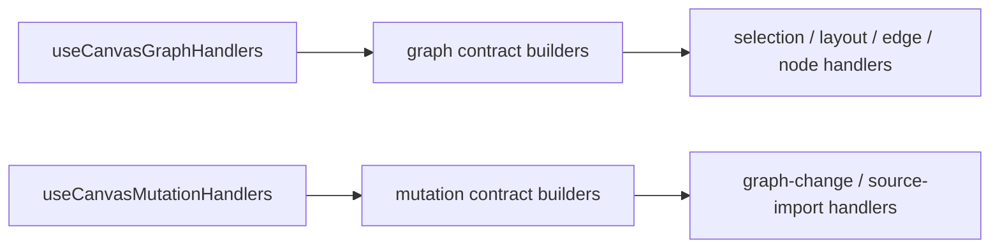
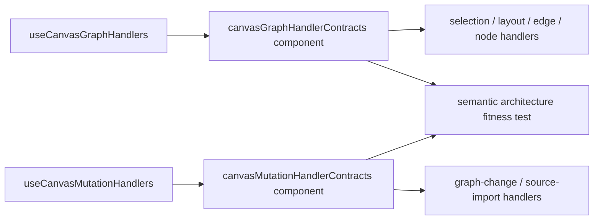
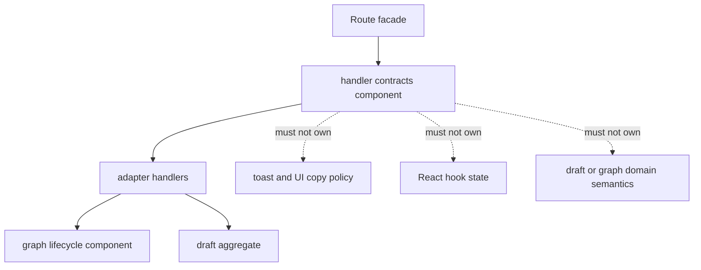

# Canvas handler seams Fowler review

## Purpose

Review the recent Canvas controller and graph-lifecycle work from a Fowler-style
architecture lens, compare the resulting posture with mature visual workbench
systems, and name the next hardening slice needed to keep the Canvas route
moving toward explicit semantic components instead of loose helper catalogs.

This review is the canonical mailbox for the handler-seam follow-up on
2026-04-21.

## Governing sources

- [Canvas Controller Current To Target Architecture](../../../architecture/components/web/graph/canvas-controller-current-to-target-architecture.md)
- [Canvas Component Map And Modernization Review](../../../architecture/components/web/graph/canvas-component-map-and-modernization-review.md)
- [Canvas Draft Session Component](../../../architecture/components/web/graph/canvas-draft-session-component.md)
- [Canvas Graph Lifecycle Component](../../../architecture/components/web/graph/canvas-graph-lifecycle-component.md)
- [TF-E2 Canvas Target Architecture Execution Plan 2026-04-17](../../proposals/mandatory/frontend-and-ux/tf-e2-canvas-target-architecture-execution-plan-20260417.md)
- [Agent Lane E](../../state/agent-lane-e.yaml)

## Scope

This review covers the current branch delta around:

- `canvasDraftSession.*`
- `canvasDraftRepository.ts`
- `canvasGraphLifecycle*.ts`
- `useCanvasGraphHandlers.ts`
- `useCanvasMutationHandlers.ts`
- graph and mutation contract-builder seams
- the local Graph/Canvas architecture pack in `docs/architecture/components/web/graph`

It does not review backend contracts, route bootstrap internals, or the full
execution handoff slice.

## Executive summary

The branch materially improved the Canvas route by moving away from
view-library-shaped mutation ownership and toward Fowler-style seams:

- repository truth is now more explicit
- aggregate truth is now clearer and more local
- graph mutation semantics live behind a namespaced component instead of a flat
  command catalog
- controller and handler facades are thinner and more explicit

However, one important architectural gap remains:

- the handler-contract and builder subsystem exists in code, but it is not yet
  treated as a first-class component with its own public API, invariants,
  consumers, and fitness functions

That gap is small enough to close now without reopening the larger TF-E2 design
questions.

## Fowler reading of the current posture

| Fowler concept         | Current owner                                                                                | Posture                  |
| ---------------------- | -------------------------------------------------------------------------------------------- | ------------------------ |
| `Repository / Gateway` | `canvasDraftRepository.ts`                                                                   | strong                   |
| `Aggregate`            | `canvasDraftSession.ts` plus baseline, machine, and working-set seams                        | strong                   |
| `Application Facade`   | `useCanvasController.ts`                                                                     | improved but still broad |
| `Application Service`  | `useCanvasAuthoringRuntime.ts`, `useCanvasExecutionActions.ts`                               | partial                  |
| `Presentation Model`   | `canvasDraftPresentationModel.ts`, `canvasRouteViewState.ts`, `canvasControllerViewModel.ts` | strong                   |
| `Domain Component`     | `canvasGraphLifecycle.ts`                                                                    | strong                   |
| `Inbound Adapter`      | `useCanvasGraphHandlers.ts`, `useCanvasMutationHandlers.ts`, `CanvasViewport.tsx`            | improved                 |

### Pattern delta since the earlier TF-E2 branch work

Improved patterns:

- explicit aggregate API instead of utility-file truth
- explicit repository boundary instead of mixed read/write route authority
- explicit graph lifecycle component instead of flat helper exports
- grouped handler dependencies through `state`, `effects`, and `policy`
  contracts instead of parent-derived `Pick<>` bags
- architecture tests guarding seam shape instead of relying only on review
  memory

### Comparison with mature visual-workbench systems

Compared with mature graph or workbench systems, the branch now follows the
right direction in three important ways:

1. widget libraries are projections, not semantic truth
2. route or controller code acts as a facade over explicit services and
   aggregates
3. mutation semantics are being collected into named components instead of
   being scattered across event handlers

The remaining gap versus mature systems is not the lack of more hooks. It is
the lack of one more named semantic component around handler contracts and
adapter composition.

In mature systems, the adapter vocabulary is usually frozen as a tiny local
component:

- one stable API for translating route interaction context into local handler
  contracts
- one place to declare invariants about what adapters may and may not own
- one fitness function validating that adapter seams do not silently re-absorb
  domain or UI-state policy

The current branch has the raw code for that shape, but not yet the fully
declared component.

## Residual antipatterns

### 1. Semantic component still implied instead of declared

`canvasGraphHandlerContracts.ts`,
`canvasGraphHandlerContractBuilders.ts`,
`canvasMutationHandlerContracts.ts`, and
`canvasMutationHandlerContractBuilders.ts`
already behave like a component. They are still named and documented as helper
files more than as one semantic unit.

### 2. Broad application-service seam

`useCanvasAuthoringRuntime.ts` remains the heaviest remaining orchestration seam
in the Canvas route. It is not broken, but it is still the largest local
concentration of coordination.

### 3. Adapter-local selection and inspector semantics

`useCanvasSelectionHandlers.ts` still owns route-relevant selection and inspect
semantics. That is acceptable for now, but it remains controlled drift toward
`TF-E2-D`.

### 4. Thinness-only architecture tests

The current architecture tests are useful, but many of them still validate
absence of hooks or large inline logic more than semantic ownership.

## Repetitions

Repeated shapes now visible in the code:

- parallel `graph` and `mutation` contract vocabularies
- parallel builder files that map broad seams into smaller sub-handler seams
- repeated `state`, `effects`, and `policy` packaging patterns
- repeated architecture tests that verify composition shape but not always the
  semantic contract of the component

These repetitions are not all bad. Some are signs of an emerging pattern that
should now be named and componentized.

## Opportunities

### Opportunity A: promote handler contracts into a named component

Treat contracts plus builders as one local semantic component.

Recommended public shape:

- `canvasGraphHandlerContractBuilders.edgeAuthoring(...)`
- `canvasGraphHandlerContractBuilders.selection(...)`
- `canvasGraphHandlerContractBuilders.layout(...)`
- `canvasGraphHandlerContractBuilders.nodeAuthoring(...)`
- `canvasMutationHandlerContractBuilders.graphChange(...)`
- `canvasMutationHandlerContractBuilders.sourceImport(...)`

This turns repeated builder functions into explicit component APIs and removes
the “loose helper function” drift.

### Opportunity B: document local ownership at module level

Every module in the handler-seam slice should declare its owned concern in a
short top-of-file docblock. This keeps local ownership visible without reading
internal code first.

### Opportunity C: add a semantic fitness function

Add one architecture test that validates the handler-contract component itself:

- builders own contract mapping only
- handler facades depend on namespaced builder APIs
- no `Pick<>`-based contract inheritance returns
- builders do not import React hooks, toasts, or graph lifecycle semantics

## Code and documentation drift

### Code drift

- The handler-contract subsystem exists, but runtime usage still exposes it as
  loose `build*` functions rather than as a namespaced component API.
- Several handler modules still lack explicit top-of-file owned-concern
  docblocks.

### Documentation drift

- The graph architecture pack documents `canvasDraftSession` and
  `canvasGraphLifecycle` as components, but not handler contracts/builders.
- The current-to-target controller page references handler composition, but it
  does not yet name the contract-builder subsystem as a local component.

## Recommended action slice

Close the drift with one slim slice:

1. create a local component document for handler contracts
2. convert contract builders from loose functions into namespaced component APIs
3. add short owned-concern docblocks to the relevant handler modules
4. add one architecture test for semantic ownership of the component
5. update the Canvas architecture pack and Lane E evidence refs

## Decision

Proceed with the slim follow-up slice above.

This is the smallest change that:

- improves Fowler-style semantic encapsulation
- reduces repetition without inventing needless abstractions
- fixes code/doc drift
- adds a stronger fitness function
- does not reopen TF-E2 scope beyond the approved handler-seam hardening

## Diagrams

### Current handler seam topology

### Target handler seam topology

### Ownership rule

