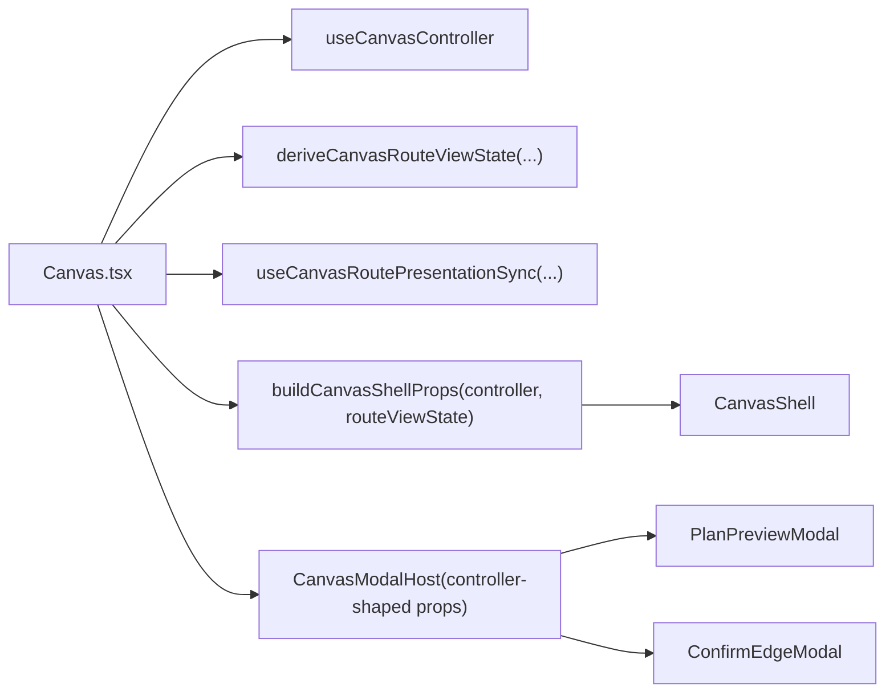
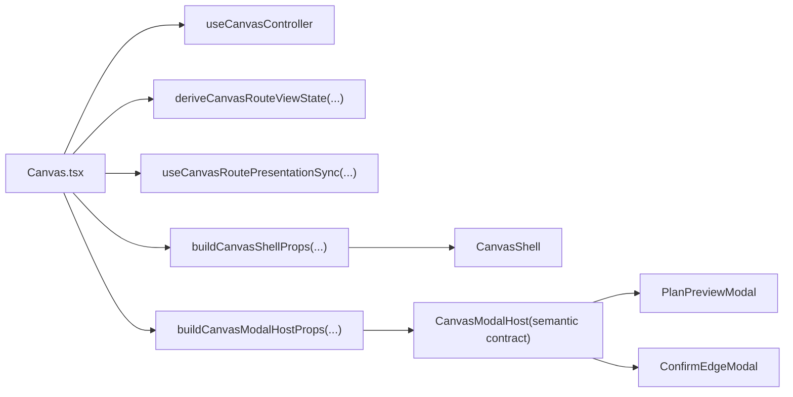
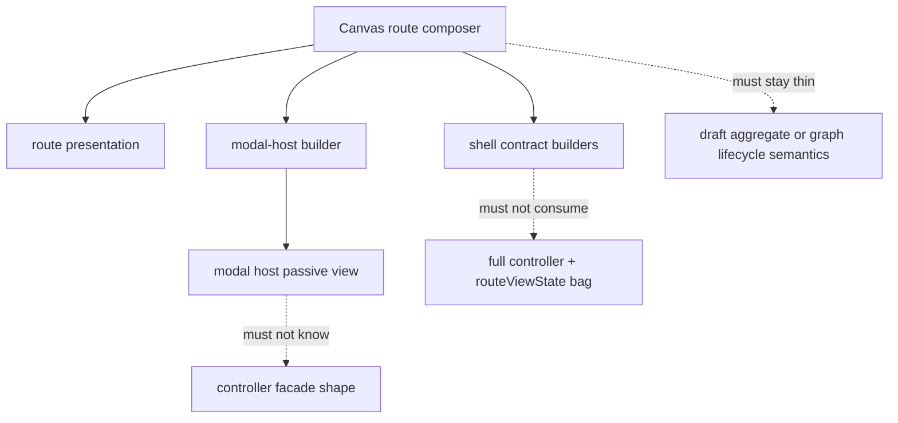

---
title: Canvas route composition Fowler review
status: Active
owner: Frontend / Architecture
last_reviewed: 2026-04-21
planning_type: review
---

# Canvas route composition Fowler review

## Purpose

Review the recent Canvas route-composition work from a Fowler-style
architecture lens, compare the current posture with mature workbench systems,
and define the smallest follow-up slice that turns route composition into an
explicit semantic component instead of a set of nearby helper seams.

This review is the canonical mailbox for the route-composition follow-up on
2026-04-21.

## Governing sources

- [Canvas Component Map And Modernization Review](../../../architecture/components/web/graph/canvas-component-map-and-modernization-review.md)
- [Canvas Controller Current To Target Architecture](../../../architecture/components/web/graph/canvas-controller-current-to-target-architecture.md)
- [Canvas Route Presentation Component](../../../architecture/components/web/graph/canvas-route-presentation-component.md)
- [Canvas Shell Component](../../../architecture/components/web/graph/canvas-shell-component.md)
- [Agent Lane E](../../state/agent-lane-e.yaml)
- [Martin Fowler - GUI Architectures](https://martinfowler.com/eaaDev/uiArchs.html)
- [VS Code source-code organization](https://github.com/microsoft/vscode/wiki/source-code-organization)

## Scope

This review covers the current branch delta around:

- `Canvas.tsx`
- `CanvasModalHost.tsx`
- `useCanvasRoutePresentationSync.ts`
- `canvasShellPropsBuilder.tsx`
- `canvasShellBuilder.types.ts`
- the shell subbuilder files under `apps/web/src/app/views/canvas/`
- the local graph architecture pack under
  `docs/architecture/components/web/graph/`

It does not review draft aggregate internals, backend contracts, or the full
Inspector editing slice.

## Executive summary

The branch clearly improved the Canvas route:

- route-visible posture is now a named presentation component
- the shell contract is now semantically grouped
- the shell contract assembler is split into subbuilders
- route composition is thinner than before

However, two residual drifts remained after that work:

1. `CanvasModalHost.tsx` was still controller-shaped through
   `Pick<ReturnType<typeof useCanvasController>>`
2. shell subbuilders still accepted one broad `controller + routeViewState`
   input bag, so semantic ownership depended on human discipline rather than on
   explicit contracts

The correct next step is not more hook extraction. The correct step is to
declare route composition as one explicit semantic component with:

- one modal-host contract
- one route-owned modal-host builder
- one concern-scoped shell-builder input vocabulary
- one architecture fitness function that protects semantic ownership rather
  than only file thinness

## Fowler reading of the current posture

<!-- markdownlint-disable MD060 -->

| Fowler concept           | Current owner                                                                                   | Posture                  |
| ------------------------ | ----------------------------------------------------------------------------------------------- | ------------------------ |
| `Presentation Model`     | `canvasDraftPresentationModel.ts`, `canvasRouteViewState.ts`, `canvasToolbarViewModel.ts`       | strong                   |
| `Supervising Controller` | `Canvas.tsx` plus route-owned builder seams                                                     | improved                 |
| `Passive View`           | `CanvasModalHost.tsx`, `CanvasCenterSurface.tsx`, `CanvasRecoveryBanner.tsx`, `CanvasShell.tsx` | improved                 |
| `Application Facade`     | `useCanvasController.ts`                                                                        | improved but still broad |
| `Component Gateway`      | `canvasShellPropsBuilder.tsx`, `canvasModalHostPropsBuilder.ts`                                 | emerging                 |

<!-- markdownlint-enable MD060 -->

### Pattern delta since the earlier TF-E2 slices

Patterns improved:

- route-visible presentation is derived once and consumed by multiple adapters
- the shell API is grouped by semantic concern instead of one flat prop bag
- route composition is no longer building every shell concern inline
- shell concern assembly is now decomposed into named subbuilders

Patterns still not fully closed before this follow-up:

- controller-shaped props leaking into view components
- broad shared builder-input bags that weaken semantic encapsulation
- architecture tests proving "thinness" more than local semantic ownership

## Comparison with mature systems

### Fowler-style UI architectures

Fowler's core observation is still the right test here: separate presentation
from domain logic and keep presentation state synchronized through explicit
events and models.

The Canvas route is materially closer to that target now than it was a few
slices ago:

- route posture lives in a presentation model
- shell and modal views can move toward passive consumers
- the route composer is becoming a supervising controller instead of an
  all-knowing screen object

The remaining gap versus a mature Fowler-style front-end is semantic
encapsulation. A passive view should not know the shape of the controller
facade. A concern-owned builder should not receive the full parent bag when it
needs only one narrow contract.

### VS Code-style workbench composition

VS Code's workbench guidance is useful here because it keeps workbench core
minimal and pushes features into explicit contributions and services.

The equivalent lesson for Canvas is:

- `Canvas.tsx` should stay small and compositional
- route-owned seams should adapt into local component contracts
- contributions should not silently depend on neighboring contributions through
  broad shared bags

This slice improves that maturity by moving the route closer to a small
workbench core with explicit local contributions:

- route presentation sync
- shell contract builder
- modal-host builder
- modal host

## Antipatterns detected

### 1. Controller-shaped passive view

`CanvasModalHost.tsx` was structurally extracted, but semantically it was still
coupled to the full controller vocabulary.

### 2. Broad builder bag inheritance

The shell subbuilders were already separate files, but they still accepted one
wide route-composer input bag. That made the decomposition look stronger than
it really was.

### 3. Thinness-only fitness checks

Several architecture tests were still checking that inline logic moved out of a
file, not that the remaining seams had stable local ownership.

### 4. Documentation lag behind code shape

The graph architecture pack documented route presentation and shell contracts
well enough, but it still lacked a dedicated route-composition component guide
for how `Canvas.tsx`, modal hosting, and shell assembly fit together.

## Repetitions

Repeated shapes currently visible:

- multiple route-owned seams adapting controller state into smaller local
  contracts
- repeated shell concern groupings: `layout`, `panels`, `graph`, `toolbar`,
  `graphCommands`, `chromeCommands`
- repeated architecture tests for seam boundaries

These repetitions are healthy if they become named component vocabulary. They
are drift if they stay as one-off helper patterns.

## Opportunities

### Opportunity A: declare a route-composition component

Treat the route composer, modal-host builder, shell builder, and publication
sync as one local semantic component with one component guide and one fitness
surface.

### Opportunity B: narrow subbuilder inputs by concern

Keep the route composer as the only place allowed to see the full route
controller plus route view state.

### Opportunity C: push modal host to a true passive view

The modal host should consume `planPreview` and `edgeConfirmation`, not a
controller-derived bag.

### Opportunity D: keep shrinking `CanvasShell.tsx`

`CanvasShell.tsx` is improved, but it still sits above the local 200-line
comfort target. The remaining line count is acceptable today because the seams
are explicit, but it is still a watch point.

## Code and documentation drift

### Code drift

- `CanvasModalHost.tsx` was extracted but not yet semantically decoupled
- shell subbuilders had physical separation without concern-scoped input
  contracts

### Documentation drift

- the graph architecture pack did not yet name route composition as its own
  local component
- Lane E tracked the modal-host hard cut, but not the broader route-composition
  semantic closure it actually requires

## Decision

Proceed with one slim route-composition follow-up slice that:

1. creates a canonical review mailbox for the remaining route-composition drift
2. publishes a local component guide for route composition
3. hard-cuts `CanvasModalHost` to a semantic modal contract
4. narrows shell subbuilder inputs to concern-scoped contracts
5. adds a semantic architecture test for the builder-input vocabulary

## Diagrams

### Current route composition before the semantic hard cut

### Target route composition after the hard cut

### Ownership rule

