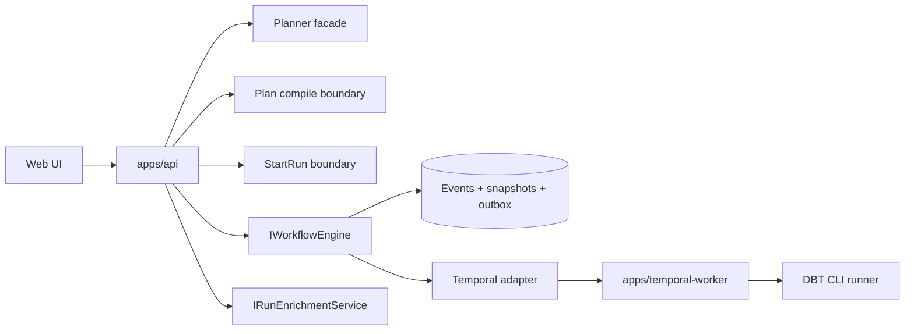
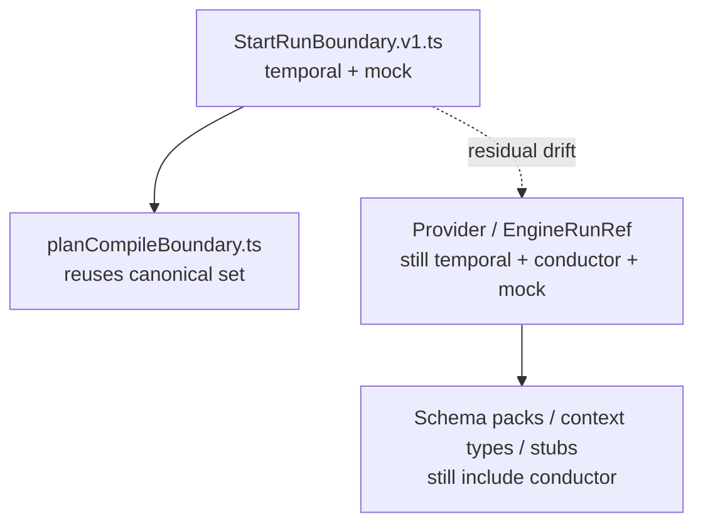
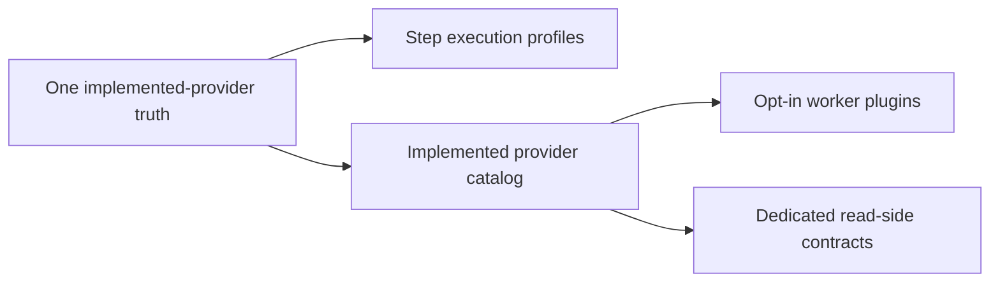

# Temporal Fowler Provider-Truth Follow-Up Review

**Plan-driven. Outcome-agnostic.**

## Scope

This review assesses the Temporal-focused branch work landed on 2026-04-20 and
the narrow 2026-04-21 follow-up correction in `apps/api`. The goal is not to
re-review Temporal in isolation; it is to judge the integrated DVT shape from a
Fowler-style architecture perspective, compare it to mature orchestration
systems, and close the smallest real drift that was still easy to fix cleanly.
For file-level API component structure, use
[Protected Runtime And Plan Compile Component](../../../architecture/components/api/protected-runtime-and-plan-compile-component.md)
as the companion map for this review.

## Governing sources used

- `AGENTS.md`
- `docs/planning/status/governance-document-rule-inventory.md`
- `docs/guides/ai-work-protocol.md`
- `docs/architecture/reference-architecture.md`
- `docs/architecture/system-delivery-status.md`
- `docs/planning/state/domain-status-board.md`
- `docs/planning/reviews/architecture-and-governance/20260420-dvt-plus-system-architecture-review.md`
- `docs/planning/closeouts/20260420-temporal-fowler-architecture-drift-follow-up-closeout.md`
- `docs/risk-register/quality/R-20260420-TEMPORAL-DBT-BUILTIN-COUPLING.yaml`
- `apps/api/src/modules/planCompileBoundary.ts`
- `apps/api/src/application/services/startRunTargetAdapterRegistry.ts`
- `packages/@dvt/contracts/src/contracts/engine/StartRunBoundary.v1.ts`
- `packages/@dvt/contracts/src/types/contracts.ts`
- `packages/@dvt/adapter-temporal/src/TemporalWorkerHost.ts`
- `packages/@dvt/adapter-temporal/src/activities/dbtStepActivity.ts`
- `apps/temporal-worker/src/runtime/createTemporalWorkerRuntime.ts`

## Primary external comparison references

These references were used to compare structural traits, not to claim feature
parity:

- [Temporal Docs](https://docs.temporal.io/)
- [AWS Step Functions: state machines](https://docs.aws.amazon.com/step-functions/latest/dg/concepts-statemachines.html)
- [Dagster Overview](https://docs.dagster.io/)
- [Apache Airflow documentation index](https://airflow.apache.org/docs/index.html)

## Executive verdict

- The branch materially improved the Temporal runtime shape. The workflow is
  less transaction-script-like, composition is clearer, and DBT is no longer
  embedded in engine-kernel semantics.
- The system is closer to a Fowler-style layered design: narrower facade,
  clearer composition roots, and better locality of change.
- Two important smells remain open: false provider optionality and partial
  pluginization.
- The smallest truthful hardening move available today was a single-source-of-truth
  correction: `apps/api/src/modules/planCompileBoundary.ts` now reuses the same
  supported-adapter set as the canonical `startRun` boundary instead of keeping
  its own divergent literal.

## Patterns Improved

| Pattern                | Improvement                                                                                                           | Why it matters                                                                       | Mature-system comparison                                                                                                              |
| ---------------------- | --------------------------------------------------------------------------------------------------------------------- | ------------------------------------------------------------------------------------ | ------------------------------------------------------------------------------------------------------------------------------------- |
| Extract Module         | Temporal workflow responsibilities were already split across focused helpers and runtime seams in the previous slice. | The orchestration shell is thinner and reasons to change are more local.             | Temporal and Step Functions both reward thin orchestration layers around explicit units of work and explicit workflow state.          |
| Separated Interface    | `IWorkflowEngine` no longer needs to absorb enrichment concerns.                                                      | Command and provider-diagnostic reads are less coupled.                              | Mature orchestrators tend to separate execution control from status and observability surfaces.                                       |
| Composition Root       | `apps/temporal-worker` now owns worker/process composition instead of pushing everything into package internals.      | Operational dependencies are more explicit and testable.                             | Airflow separates core from provider packages, and Airflow Task SDK explicitly decouples authoring/runtime interfaces from internals. |
| Single Source of Truth | This follow-up removes a second local adapter allowlist in the plan-compile boundary.                                 | Admission and plan-compilation no longer drift independently for supported adapters. | Mature systems centralize capability truth instead of repeating it in each boundary.                                                  |

## Antipatterns Still Present

| Antipattern                  | Current manifestation                                                                                                 | Why it is still a problem                                                                          |
| ---------------------------- | --------------------------------------------------------------------------------------------------------------------- | -------------------------------------------------------------------------------------------------- |
| False optionality            | `Provider`, `EngineRunRef`, schemas, and stubs still advertise `conductor`.                                           | The system narrates replaceability it does not implement.                                          |
| Partially pluginized adapter | DBT is optional in worker composition but still built into `@dvt/adapter-temporal` default activity and plugin seams. | The package surface still leaks executor-specific behavior.                                        |
| Payload accumulation         | Full `ExecutionPlan` still enters workflow input and `continueAsNew` carries growing runtime state.                   | Durable execution state will hit scale and evolution pressure before other parts of the system do. |
| Under-specialized read side  | Canonical single-run reads are decent, but fleet/list/read-head seams remain weaker than the command side.            | Mature systems do not keep broad read orchestration inside ad hoc API use cases.                   |

## What Mature Systems Do Better

| System         | Relevant trait from official docs                                                                                              | Architectural lesson for DVT                                                                                                                    |
| -------------- | ------------------------------------------------------------------------------------------------------------------------------ | ----------------------------------------------------------------------------------------------------------------------------------------------- |
| Temporal       | Temporal positions itself as durable execution that resumes after crashes and outages.                                         | Keep durable orchestration focused on reliable workflow state, not on carrying large or drifting payloads.                                      |
| Step Functions | State machines expose explicit state types, explicit JSON data flow, and explicit service-integration patterns.                | Prefer explicit execution-state contracts and explicit integration surfaces over open-ended runtime bags.                                       |
| Dagster        | Dagster emphasizes integrated lineage, observability, declarative modeling, and testability.                                   | DVT should keep pushing typed, testable orchestration seams instead of opaque extension tunnels.                                                |
| Airflow        | Airflow documents a Task SDK that decouples DAG authoring from internals, and providers are versioned independently from core. | Provider/plugin surfaces should be cleanly externalized, versionable, and not hardwired into the orchestration core or default adapter surface. |

## Repetitions Found

| Repetition                                                                                                            | Status | Resolution                                                                            |
| --------------------------------------------------------------------------------------------------------------------- | ------ | ------------------------------------------------------------------------------------- |
| Supported-adapter truth duplicated between `StartRunBoundary.v1.ts` and `apps/api/src/modules/planCompileBoundary.ts` | Fixed  | `planCompileBoundary` now derives from `SUPPORTED_START_RUN_TARGET_ADAPTERS`.         |
| Test helper repeated a raw provider-union literal array type                                                          | Fixed  | `StoredPlanExecutabilityValidator.test.ts` now reuses `StepKindExecutionProfile`.     |
| Provider truth repeated across contracts, schemas, selection logic, and stubs                                         | Open   | Requires a broader contract cleanup slice; not safe to half-remove in this follow-up. |

## Drift Map

| Drift                       | Before this slice                                                                                                       | After this slice                                           |
| --------------------------- | ----------------------------------------------------------------------------------------------------------------------- | ---------------------------------------------------------- |
| Plan compile adapter truth  | Local literal still included `conductor`.                                                                               | Now aligned to canonical `startRun` adapter truth.         |
| Reference architecture      | Top-level diagram lagged the current command/query split and current runtime seams.                                     | Updated in canonical architecture docs.                    |
| Delivery status narrative   | Did not say clearly enough that compile/admission truth is now one seam while broader provider vocabulary still drifts. | Updated in canonical status docs.                          |
| Broader provider vocabulary | `conductor` still exists in shared provider types and schema surfaces.                                                  | Still open and explicitly documented as drift, not hidden. |

## Diagram 1: Current authority map

## Diagram 2: Provider-truth drift after the fix

## Diagram 3: Target maturity move

## Pattern Application In This Slice

- Applied `Single Source of Truth`: the plan-compile boundary now consumes the
  same adapter truth as the command-admission surface.
- Applied `Prefer Contract Type Over Literal Repetition`: test helpers now reuse
  `StepKindExecutionProfile` instead of duplicating raw unions.
- Applied `Tell The Truth In Public Docs`: canonical docs now describe the
  residual provider and DBT coupling drift explicitly instead of implying clean
  portability.

## Teachings For Future Slices

- Do not introduce a second allowlist when a boundary already has a canonical
  contract.
- Do not treat partial pluginization as full decoupling. Moving composition out
  of the engine is progress, but built-ins in the adapter package are still a
  coupling.
- Do not spend abstraction budget advertising future providers before there is
  conformance-tested runtime support.
- Prefer typed execution profiles and capability catalogs over open-ended,
  adapter-local runtime policy.

## Opportunities Left Open

- Collapse repo-wide provider truth to implemented providers only.
- Move default step-registry adapter support to the same canonical runtime
  truth, or make it explicitly profile-owned per boundary.
- Finish DBT extraction from `@dvt/adapter-temporal` default runtime surface.
- Introduce pointer-only workflow input plus governed `continueAsNew` state
  evolution.
- Build dedicated list/head/fleet read contracts outside the engine facade.

## Final conclusion

The Temporal branch is now structurally better in a way Fowler would recognize:
smaller reasons to change, thinner orchestration, cleaner composition, and less
duplicated policy. The next gains will not come from adding more abstractions.
They will come from telling the truth in contracts, finishing the provider
cleanup, and externalizing plugin/runtime concerns the same way mature systems
externalize providers, integrations, and read models.
