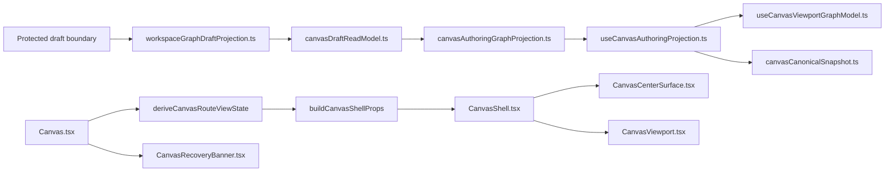
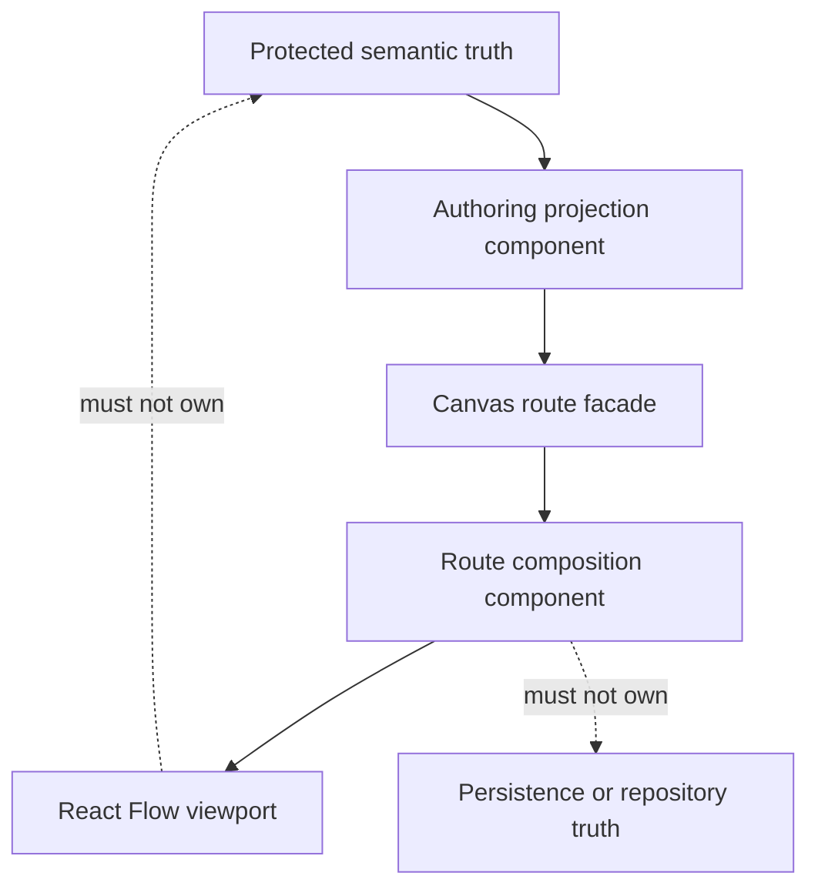
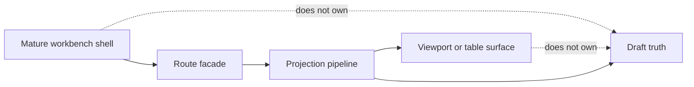

# Canvas component governance follow-up review

## Purpose

Review the 2026-04-22 Canvas branch work from a Fowler-style architecture
lens, compare the resulting posture with mature workbench systems at the
pattern level, and close the remaining code and documentation drift around
component semantics.

This review is the canonical mailbox for the post-hard-cut component-governance
follow-up on 2026-04-22.

## Governing sources

- [Graph Frontend Architecture](../../../architecture/components/web/graph/graph-frontend-architecture.md)
- [Canvas Controller Current To Target Architecture](../../../architecture/components/web/graph/canvas-controller-current-to-target-architecture.md)
- [Canvas Component Map And Modernization Review](../../../architecture/components/web/graph/canvas-component-map-and-modernization-review.md)
- [Canvas runtime truth hard-cut review](./20260422-canvas-runtime-truth-hardcut-review.md)
- [Canvas Draft Session Component](../../../architecture/components/web/graph/canvas-draft-session-component.md)
- [Canvas Graph Lifecycle Component](../../../architecture/components/web/graph/canvas-graph-lifecycle-component.md)
- [Canvas Handler Contracts Component](../../../architecture/components/web/graph/canvas-handler-contracts-component.md)
- [Frontend Fowler Implementation Pattern](../../../architecture/components/web/frontend-fowler-implementation-pattern.md)
- [TF-E2 Canvas Target Architecture Execution Plan 2026-04-17](../../proposals/mandatory/frontend-and-ux/tf-e2-canvas-target-architecture-execution-plan-20260417.md)

## Scope

This review covers the current branch delta around:

- `Canvas.tsx` and the Canvas shell composition seam
- `workspaceGraphDraftProjection.ts`, `canvasDraftReadModel.ts`,
  `canvasAuthoringGraphProjection.ts`, `useCanvasAuthoringProjection.ts`, and
  `useCanvasViewportGraphModel.ts`
- the local graph architecture pack in
  `docs/architecture/components/web/graph`
- semantic architecture fitness functions for route composition and projection

It does not re-open backend contract design, route bootstrap taxonomy, or the
full `TF-E2-D` inspector-editing scope.

## Executive summary

The branch materially improved the frontend architecture in the right
direction:

- protected draft truth is now the authoritative semantic source for active
  Canvas authoring
- React Flow remains a projection surface instead of a hidden semantic store
- route composition is thinner and more explicit
- the graph pack already has three real local components with documented public
  APIs and invariants: draft session, graph lifecycle, and handler contracts

However, there was still one governance gap:

- the semantic authoring-projection seam and the route-composition seam existed
  in code but were still documented mostly through broad reviews rather than
  local component guides

That gap causes drift:

- ownership must be re-explained in reviews
- module docblocks are inconsistent
- architecture tests cover thinness more often than semantic boundaries

This follow-up closes that drift by treating both seams as first-class local
components with local guides, diagrams, owned-concern headers, and semantic
fitness functions.

## Fowler reading of the current posture

<!-- markdownlint-disable MD060 -->

| Fowler concept         | Current owner                                                                                            | Posture                  |
| ---------------------- | -------------------------------------------------------------------------------------------------------- | ------------------------ |
| `Gateway / boundary`   | `workspaceGraphDraftProjection.ts`, `canvasDraftReadModel.ts`, `canvasDraftRepository.ts`                | strong                   |
| `Aggregate`            | `canvasDraftSession.ts` plus baseline, machine, and working-set seams                                    | strong                   |
| `Application Facade`   | `useCanvasController.ts`                                                                                 | improved but still broad |
| `Application Service`  | `useCanvasAuthoringRuntime.ts`, `useCanvasExecutionActions.ts`                                           | partial                  |
| `Presentation Model`   | `canvasDraftPresentationModel.ts`, `canvasRouteViewState.ts`, `canvasControllerViewModel.ts`             | strong                   |
| `Projection component` | `canvasAuthoringGraphProjection.ts`, `useCanvasAuthoringProjection.ts`, `useCanvasViewportGraphModel.ts` | improved                 |
| `Route composition`    | `Canvas.tsx`, `CanvasShell.tsx`, `CanvasCenterSurface.tsx`, `CanvasRecoveryBanner.tsx`                   | improved                 |
| `Inbound adapters`     | `CanvasViewport.tsx`, `useCanvasGraphHandlers.ts`, `useCanvasMutationHandlers.ts`                        | improved                 |

<!-- markdownlint-enable MD060 -->

## Comparison with mature systems

This comparison is pattern-level, not a point-in-time feature audit of named
products.

Compared with mature operator workbenches and DAG editors, the branch now
behaves more like a real system in four important ways:

1. one semantic source of truth governs authoring instead of a convenient
   compatibility view
2. the viewport library is treated as a projection and gesture adapter, not as
   semantic authority
3. route composition is explicit and thin, with presentation-state and modal
   seams separated from authoring runtime
4. repeated helper clusters are being promoted into named local components with
   public APIs and fitness functions

Mature systems usually freeze these seams early:

- shell and route composition stay separate from authoring semantics
- projection pipelines separate boundary mapping, semantic merge, and viewport
  projection
- component guides describe public API, invariants, and consumers locally

That is now true for more of the Canvas pack than it was before this branch,
but it was not yet fully true for the route-composition and
authoring-projection seams.

## Patterns improved

Patterns materially improved in this branch:

- explicit aggregate over draft truth instead of helper-file state
- explicit repository and protected-boundary mapping instead of mixed route
  authority
- explicit semantic authoring projection separated from viewport projection
- explicit route composition seam instead of one JSX-heavy route file
- local component guides as the canonical place for public API, invariants,
  transitions, and consumers
- semantic architecture tests that verify ownership boundaries in addition to
  structural thinness

## Antipatterns detected

### 1. Component semantics implied by reviews instead of local docs

Before this follow-up, the branch had to explain the authoring-projection seam
and route-composition seam in broader reviews because the local component docs
did not exist yet.

### 2. Module ownership visible only after reading implementation

Some route and projection modules still lacked short owned-concern headers.
That makes the code harder to scan and invites accidental concern bleed.

### 3. Thinness-only fitness checks

Several architecture tests already guarded against hooks, query ownership, or
barrel drift, but they did not always prove the intended semantic boundary of a
component.

### 4. Review-level repetition

The same ownership explanation around protected draft projection and route
composition was repeated across:

- the hard-cut review
- the controller current-to-target page
- the component-map review
- closeout documents

That repetition is a signal that a local component guide is missing.

## Components and code that should be grouped by component

### Group 1: Canvas authoring projection component

Files:

- `workspaceGraphDraftProjection.ts`
- `canvasDraftReadModel.ts`
- `canvasCanonicalSnapshot.ts`
- `canvasAuthoringGraphProjection.ts`
- `useCanvasAuthoringProjection.ts`
- `useCanvasViewportGraphModel.ts`

Why this is one component:

- it forms one projection pipeline from protected boundary to semantic authoring
  truth to viewport state
- it owns one local semantic rule: projection is downstream of protected truth
- consumers should not need to rediscover where semantic merge stops and
  viewport projection begins

### Group 2: Canvas route composition component

Files:

- `Canvas.tsx`
- `canvasShell.types.ts`
- `CanvasShell.tsx`
- `CanvasCenterSurface.tsx`
- `CanvasStateViews.tsx`
- `CanvasRecoveryBanner.tsx`
- `CanvasViewport.tsx`

Why this is one component:

- it owns the route-facing UI composition contract for the Canvas workbench
- it groups layout, state surfaces, shell prop contracts, viewport mounting,
  and recovery presentation
- it must stay free of persistence and semantic-authority ownership

## Teachings for future slices

1. When a helper cluster needs the same ownership explanation in more than one
   review, promote it to a component guide immediately.
2. If a module is part of a named component, add a one-line owned-concern
   header before the next slice expands it.
3. Architecture tests should prove one semantic rule for each component, not
   only absence of hooks or query clients.
4. Route views and viewport adapters should be judged by what they do not own:
   persistence, draft truth, and fallback authority.
5. Broad reviews should point to local component guides instead of becoming the
   permanent home of detailed component semantics.

## Repetitions

Useful repetitions now visible:

- repeated projection layering:
  boundary projection -> read model -> semantic merge -> viewport projection
- repeated route-composition layering:
  route entry -> presentation state -> shell props -> shell layout -> state
  surfaces
- repeated local component doc format:
  purpose -> public API -> invariants -> consumers -> fitness functions

Bad repetitions that needed fixing:

- repeating ownership claims in review docs because no local guide existed
- repeating module-level ownership only inside filenames or review prose

## Opportunities

### Opportunity A: standardize the local component-guide template

The graph pack now has enough examples to freeze one local template for
frontend component docs:

- Purpose
- Governing sources
- Component reading rule
- Why this component exists
- Public API
- File responsibilities
- Topology
- Transitions
- Invariants
- Consumers
- Fitness functions
- Drift to watch

### Opportunity B: continue shrinking `useCanvasAuthoringRuntime.ts`

The controller facade is thinner, but the authoring runtime is still the
largest orchestration seam. That remains the next architectural pressure point.

### Opportunity C: promote route-command semantics only when they stop being

adapter-local

Selection and inspector behavior should move into a dedicated semantic command
component only if they become shared route behavior. Doing that earlier would
be abstraction-first instead of pressure-first.

## Code and documentation drift

### Code drift that existed before this slice

- no local component guide for authoring projection
- no local component guide for route composition
- inconsistent owned-concern headers across route and projection files
- no semantic fitness function joining protected-boundary projection,
  authoring-projection composition, and viewport projection

### Documentation drift that existed before this slice

- broad reviews named the missing boundaries, but local graph docs did not
  expose them as first-class components
- graph-pack navigation did not route readers to local docs for these two
  seams

### Drift fixed in this follow-up

- local component docs were added for both seams
- graph-pack navigation now routes to those docs
- module headers now declare owned concern across the touched route and
  projection modules
- new architecture tests validate semantic boundary rules for those components

## Decision

Proceed with the bounded follow-up:

1. add a local component guide for authoring projection
2. add a local component guide for route composition
3. add or complete owned-concern docblocks on the touched route and projection
   modules
4. add semantic architecture tests for both components
5. update the graph architecture pack so the new guides are canonical entry
   points

This is the smallest slice that improves Fowler-style semantic encapsulation
without reopening the broader `TF-E2` runtime or inspector scope.

## Diagrams

### Current branch posture after the follow-up

### Ownership rule

### Comparison target

