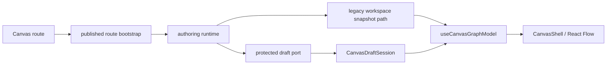
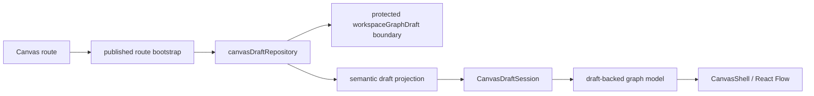
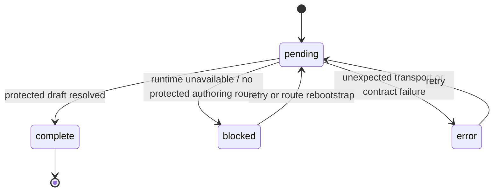
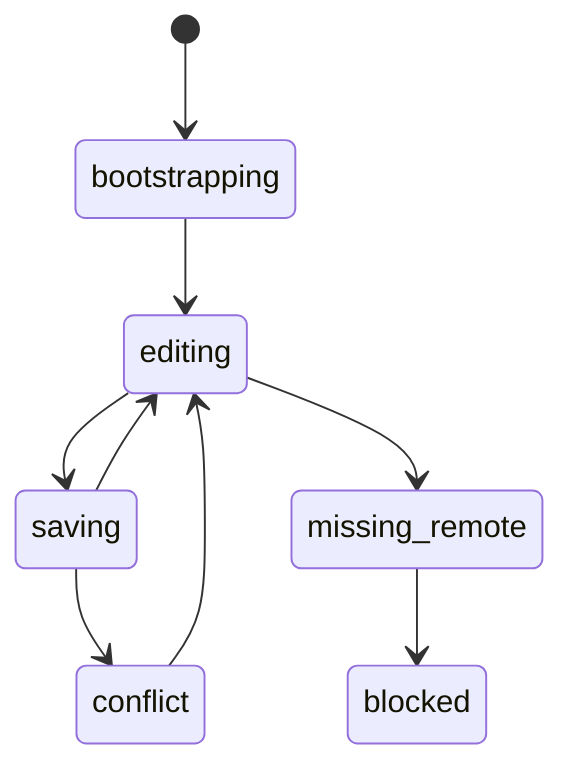

# Canvas runtime truth hard-cut review

## Purpose

Freeze the canonical no-legacy design for the next Canvas authoring slice.

This review exists to settle one question before implementation:

- what the route must do when the protected runtime draft boundary is the only
  accepted source of truth and no compatibility fallback is allowed.

This review is the canonical mailbox for the 2026-04-22 hard-cut decision on
Canvas runtime truth.

## Governing sources

- [Graph Frontend Architecture](../../../architecture/components/web/graph/graph-frontend-architecture.md)
- [Graph Route Bootstrap Architecture](../../../architecture/components/web/graph/graph-route-bootstrap-architecture.md)
- [Canvas Controller Current To Target Architecture](../../../architecture/components/web/graph/canvas-controller-current-to-target-architecture.md)
- [Canvas Component Map And Modernization Review](../../../architecture/components/web/graph/canvas-component-map-and-modernization-review.md)
- [Canvas Draft Session Component](../../../architecture/components/web/graph/canvas-draft-session-component.md)
- [Graph Sequences And State Machines](../../../architecture/components/web/graph/graph-sequences-and-state-machines.md)
- [Frontend-facing backend contract MVP-E1 2026-04-04](../../../architecture/components/web/frontend-backend-contract-mvp-e1-20260404.md)
- [Data Source Service Boundary](../../../architecture/components/web/appshell/data-source-service-boundary.md)
- [Frontend Runtime Modes User Manual](../../../architecture/components/web/frontend-runtime-modes-user-manual.md)
- [TF-E2 Canvas Target Architecture Execution Plan 2026-04-17](../../proposals/mandatory/frontend-and-ux/tf-e2-canvas-target-architecture-execution-plan-20260417.md)
- [Agent Lane E](../../state/agent-lane-e.yaml)

## Scope

This review covers the route-owned authoring path for:

- `Canvas.tsx`
- `canvasRouteViewState.ts`
- `useCanvasGraphModel.ts`
- protected draft projection and repository seams
- runtime startup posture for Canvas authoring
- local development truth versus product truth for the Canvas route

It does not redesign:

- the full auth stack
- non-Canvas routes
- the broader F-04 composition-root family outside the Canvas authoring slice
- backend route ownership, which already exists at `/workspace/graph/draft`

## Executive summary

The current architecture has already improved in the right direction:

- Canvas startup is a published route contract, not a pathname heuristic
- Canvas draft session is a real aggregate, not a loose helper set
- the protected draft authoring port exists
- read-only, forbidden, and typed format-error posture already exist at the
  route edge

However, one critical drift remains:

- the route still tolerates a split between protected draft truth and a legacy
  graph-snapshot projection path, while the shell-level data-source model still
  allows mock-backed startup semantics that are not valid for production-grade
  Canvas authoring.

That split is the wrong compromise.

The reviewed decision is:

- hard-cut Canvas authoring to protected `workspaceGraphDraft` truth
- remove authoring dependence on legacy snapshot-backed graph hydration
- remove mock-backed startup behavior from the active Canvas product path
- fail closed when protected runtime draft authority is unavailable

## Problem summary

Canvas currently mixes three truths:

1. the protected runtime draft boundary
2. a lossy projected draft read model
3. a mock-or-snapshot-backed graph hydration path that can still present a
   usable-looking graph when the protected runtime is absent

That mixture creates false operability.

The visible symptom is fake startup content and non-durable authoring behavior.
The real problem is architectural: a route that claims to own authoring truth
still depends on a secondary read path that can outlive or bypass the canonical
protected boundary.

## Root cause

The root cause is not just "mock data exists."

The actual causes are:

- `resolveDataSource()` still defaults to `mock`, so missing configuration does
  not fail closed
- Canvas graph hydration still depends on a snapshot-style path in
  `useCanvasGraphModel.ts`
- the protected draft read projection remains lossy and therefore cannot fully
  replace the legacy snapshot path yet
- docs still describe `mock` and `api` as parallel runtime modes for the
  frontend even though Canvas authoring is no longer a legitimate demo-style
  route

In Fowler terms, the route still tolerates two read models fighting for
authority:

- one canonical and protected
- one legacy and convenient

Mature systems do not let the convenient one govern authoring.

## Constraints and invariants

The implementation slice that follows this review MUST preserve these
constraints:

- Canvas is a `published` route and must publish explicit startup posture from
  real route truth
- `mount != settled`
- `blocked != empty`
- `CanvasDraftSession` remains the authoritative route-local aggregate
- protected `workspaceGraphDraft` is the only accepted remote authoring truth
- React Flow state remains a projection, never semantic authority
- no compatibility shim may keep legacy snapshot hydration alive for the active
  Canvas authoring path
- no mock-backed startup graph may appear when protected runtime truth is
  unavailable
- runtime absence must render a governed blocked state, not a fake empty graph
- the route may fail closed; it may not fail deceptive

## Options considered

### Option A: guard-only hardening over the existing split

Keep the current snapshot-based graph model, remove the most visible mock
fallbacks, and add stronger blocked-state copy.

Benefits:

- smallest code delta
- lower short-term delivery risk

Rejected because:

- it preserves the wrong read authority
- it still leaves Canvas authoring dependent on a legacy graph-snapshot seam
- it treats drift as acceptable so long as the UI looks stricter

### Option B: canonical hard-cut to protected draft truth

Re-anchor Canvas authoring to protected `workspaceGraphDraft`, replace the
lossy read projection with a semantic projection, and stop using the legacy
snapshot path as active-authoring truth.

Benefits:

- one source of truth
- one route startup story
- one persistence authority
- aligns route behavior with the backend contract that actually exists

Rejected concerns:

- larger slice than a guard-only patch

Decision:

- accepted

### Option C: transitional dual-path compatibility layer

Keep both draft and snapshot paths while gradually migrating components behind a
compatibility mapper.

Benefits:

- smoother rollout
- smaller per-PR diffs

Rejected because:

- directly contradicts the requested no-legacy posture
- entrenches the architectural split
- increases testing and debugging cost
- delays the moment when blocked-state semantics become honest

## Decision

Proceed with Option B as a clean hard-cut:

- Canvas authoring uses protected `workspaceGraphDraft` truth only
- startup is blocked when that truth is unavailable
- the active route no longer tolerates snapshot-backed compatibility fallback
- legacy graph hydration and mock-backed startup are removed from the authoring
  path, not merely hidden

## Target architecture

### Current drifted topology

The problem is not the existence of a read model.

The problem is that the active graph model can still lean on a legacy path that
is not the protected authoring boundary.

### Target topology

Target rule:

- every route-visible authoring shape is derived from protected draft truth plus
  the route-local aggregate, not from a second graph catalog.

## Component ownership after the hard-cut

| Component or seam          | Owns                                                                    | Must not own                                           |
| -------------------------- | ----------------------------------------------------------------------- | ------------------------------------------------------ |
| `Canvas.tsx`               | route composition, provider setup, route publication                    | implicit fallback, data-source heuristics, graph truth |
| `canvasRouteViewState.ts`  | `pending / blocked / error / complete` route posture                    | graph reconstruction, fallback graph seeding           |
| `canvasDraftRepository.ts` | translation to and from the protected draft boundary                    | route UI posture or React Flow state                   |
| draft semantic projection  | convert protected `DesignGraphDraft` into canonical authoring semantics | lossy ids-only downgrade                               |
| `CanvasDraftSession`       | local aggregate state, sync posture, working set, revision              | transport or hidden recovery fallback                  |
| draft-backed graph model   | project canonical nodes and edges for the viewport                      | snapshot authority or mock bootstrap                   |
| `CanvasShell` and viewport | display and interaction                                                 | route startup policy or persistence truth              |

## Startup and state-machine policy

### Route startup

Key rule:

- runtime absence is `blocked`, never `empty`

### Authoring lifecycle

Key rule:

- `missing_remote` does not re-enable fake local authority
- if protected draft truth disappears, the route leaves productive authoring
  posture

## No-legacy hard-cut rules

These rules are mandatory for the implementation slice:

1. No `mock` default for Canvas authoring.
2. No active-authoring dependence on `workspaceService.getGraphSnapshot()`.
3. No startup seed graph as a convenience fallback.
4. No compatibility shim that silently reconstructs authoring truth from legacy
   snapshot data.
5. No route copy that suggests authoring is available when protected runtime is
   absent.
6. No documentation that continues to describe Canvas authoring as a normal
   mock-backed route after the cut lands.

## Drift identified in current documentation

The current doc set still contains statements that become false under this hard
cut:

- `frontend-runtime-modes-user-manual.md` describes `mock` and `api` as peer
  runtime modes for the frontend
- `data-source-service-boundary.md` describes both modes as runnable without
  changing route truth for consumers
- `graph-frontend-architecture.md` still names `workspace snapshot` alongside
  protected draft ports in the authoring topology
- controller and Canvas docs do not yet state that legacy snapshot-backed
  authoring is forbidden

Implementation of this slice MUST update those docs in the same work item.

## Pre-implementation brief

- Mode: `Full`
- Scope:
  - hard-cut Canvas authoring to protected draft truth
  - remove no-longer-valid legacy authoring path usage
  - align route startup posture and documentation
- Touched files or paths:
  - `apps/web/src/app/services/config/dataSource.ts`
  - `apps/web/src/app/services/workspace/workspaceService.api.ts`
  - `apps/web/src/app/services/workspace/workspaceGraphDraftProjection.ts`
  - `apps/web/src/app/views/Canvas.tsx`
  - `apps/web/src/app/views/canvas/canvasRouteViewState.ts`
  - `apps/web/src/app/views/canvas/useCanvasGraphModel.ts`
  - Canvas draft repository and read-model seams as needed
  - `scripts/run-dev-stack.cjs`
  - the affected Canvas and frontend-boundary docs
- Expected outcome:
  - Canvas either authors against protected draft truth or presents a blocked
    route state; it never invents a fake graph
- Risks and mitigations:
  - risk: route becomes unavailable in local setups that relied on mock mode
    mitigation: explicit blocked-state UX and dev-stack alignment
  - risk: lossy read projection currently hides data needed by the graph model
    mitigation: replace it with semantic projection before removing legacy path
  - risk: drift persists in docs or workboard
    mitigation: update review board, lane refs, and architecture pack in the
    same slice
- Out-of-scope items:
  - inspector-editing productization
  - full Cypress proof matrix
  - non-Canvas route behavior
  - auth-platform redesign beyond what is necessary for honest blocked posture
- Validation plan:
  - targeted `apps/web` tests for route states, draft repository, and graph
    model
  - architecture tests proving Canvas no longer depends on legacy snapshot
    authoring
  - `pnpm docs:sync`
  - `pnpm docs:workboard:generate`
  - `pnpm verify:prepush`
- Test coverage plan:
  - protected runtime unavailable -> `blocked`
  - real empty draft -> `empty`
  - authoring node survives rehydration from protected draft
  - missing-remote and conflict remain fail-closed
  - no fallback graph appears when runtime truth is absent
- Libraries evaluated:
  - none; this is an internal boundary and authority hard-cut

## Fowler reading and comparison with mature systems

Compared with mature workbench systems, the right shape is:

- one command-side authority
- one read-side projection derived from that authority
- route startup coupled to real operability

The current drift is the classic immature-system compromise:

- "keep the real path, but also keep a convenient fallback so the screen always
  looks populated."

That is not resilience. It is semantic ambiguity.

Mature systems prefer explicit blocked posture over deceptive continuity.

## Recommended follow-up

This review feeds:

- `TF-E2` overall
- `TF-E2-A` directly for protected draft truth and projection closure
- `TF-E2-B` and `TF-E2-C` indirectly because node and edge lifecycle proof only
  make sense once the route has one remote truth
- `TF-E2-E` for the proof matrix that must enforce the hard-cut

## Final decision

The next Canvas authoring slice must ship as a clean cut:

- one protected draft truth
- one route-local aggregate
- one graph model derived from that truth
- zero legacy authoring fallback
- zero mock-backed startup for the active Canvas product path
