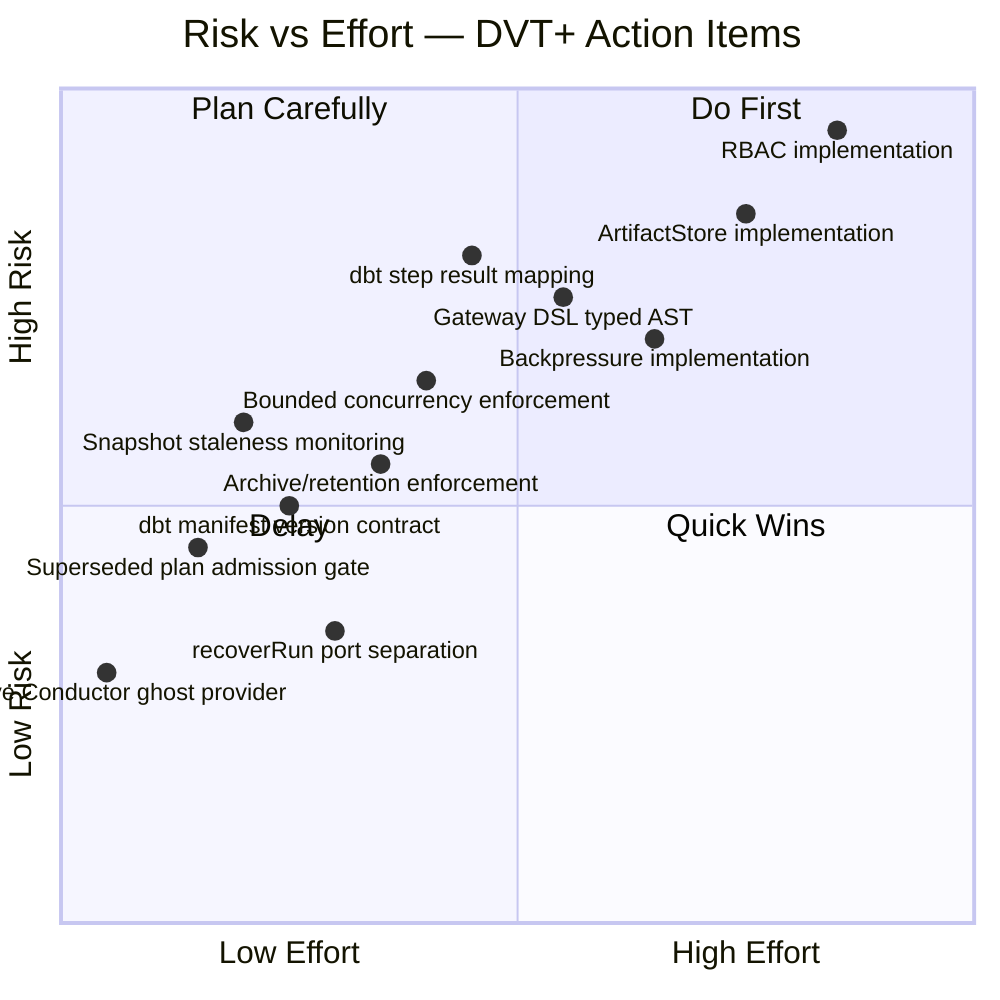
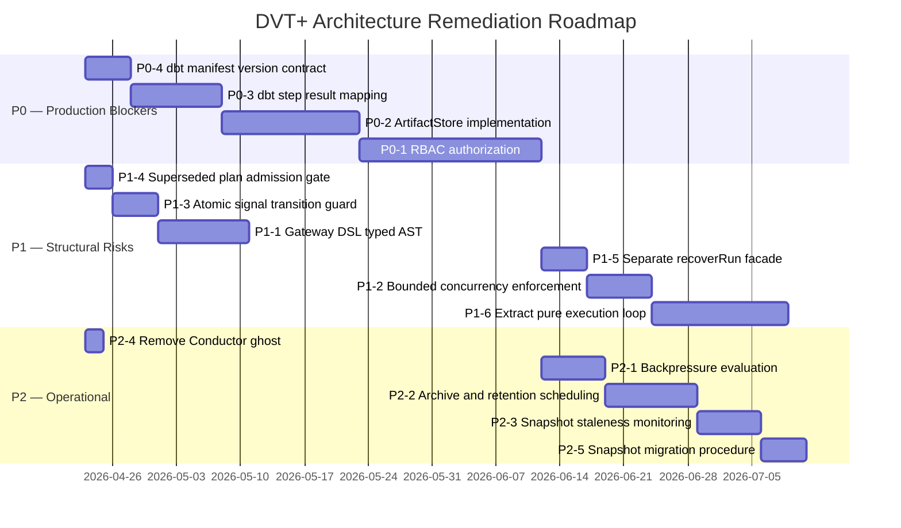

# DVT+ Principal Architect Action Plan

**Derived from:** [20260422-dvt-plus-principal-architect-deep-review.md](./20260422-dvt-plus-principal-architect-deep-review.md)
**Classification:** Pre-production blockers (P0) → Structural risks (P1) → Operational gaps (P2)

---

## Priority Matrix



---

## P0 — Pre-Production Blockers

These must be complete before any tenant is onboarded to production.

### P0-1: Implement RBAC authorization at the API boundary

**Risk addressed:** Multi-tenant data access without authorization
**Severity:** Critical

**Scope:**

- Implement `IAuthorizationService` using the design in
  `docs/architecture/components/engine/contracts/security/IAuthorization.v1.md`
- Roles: `TENANT_ADMIN`, `PLAN_AUTHOR`, `OPERATOR`, `AUDITOR`, `VIEWER`
- Actions: `RUN_START`, `RUN_CANCEL`, `SIGNAL_SEND`, `RUN_READ_STATUS`, `PLAN_CREATE`, `PLAN_READ`
- Enforce at `apps/api` boundary — not inside the engine
- Integrate with database RLS as the secondary enforcement layer
- Replace `AllowAllAuthorizer` in all non-test composition roots
- Add integration tests that prove cross-tenant requests are rejected

**Acceptance criteria:**

- `AllowAllAuthorizer` is test-only and enforced by a compile-time or linting guard
- All 5 API operations (startRun, cancelRun, signal, getRunStatus, listRuns) are gated
- Cross-tenant run access returns `403` not `404`
- Audit log entry written for every authorization decision

**Estimated effort:** 3–4 weeks

---

### P0-2: Implement IArtifactStore

**Risk addressed:** dbt runtime cannot fetch compiled artifacts — dbt steps fail silently
**Severity:** High

**Scope:**

- Implement `IArtifactStore` against Postgres + S3 or Postgres-only
- Support: `store(compiledCodeRef, artifact)`, `fetch(compiledCodeRef)`,
  `exists(compiledCodeRef)`, `purge(compiledCodeRef)`
- Wire `ArtifactBackedRunExecutionContextReader` and `ArtifactBackedDbtProjectBundleReader`
  to the real store in `createTemporalWorkerRuntime.ts`
- Add integration tests with real artifact bytes

**Acceptance criteria:**

- A dbt model step can fetch its compiled SQL artifact before execution
- A missing artifact causes `StepFailed` with code `ARTIFACT_NOT_FOUND` (not an unhandled exception)
- Artifact store passes tenant isolation tests

**Estimated effort:** 2–3 weeks

---

### P0-3: Complete dbt step result and failure mapping

**Risk addressed:** dbt execution failures are opaque — retries operate blind
**Severity:** High

**Scope:**

- Map all known dbt CLI exit codes to canonical `StepFailed.payload.failureReason`
- Map dbt test failures (assertion failures, data quality) to structured payloads
- Map dbt compilation errors separately from execution errors
- `StepCompleted.payload.resultEvidence` must include: model name, rows affected
  (where available), execution time
- Add contract fixtures for each failure mode

**Acceptance criteria:**

- Given a dbt CLI output, the mapper produces a deterministic `StepFailed` payload
- All 5 known dbt failure modes have corresponding contract fixtures and tests
- The `resultEvidence` schema is declared in `RunEvents.v1.ts` or a linked contract

**Estimated effort:** 1–2 weeks

---

### P0-4: Declare and enforce dbt manifest version compatibility

**Risk addressed:** Silent graph corruption when dbt upgrades its manifest schema
**Severity:** High

**Scope:**

- Define `SUPPORTED_DBT_MANIFEST_VERSIONS` constant in the manifest parser
- Add a schema version check at parse time (check `manifest.metadata.dbt_schema_version`)
- Reject unknown manifest versions with a typed error code
- Add ADR or contract note for the supported version matrix

**Acceptance criteria:**

- Parsing an unsupported manifest version throws a typed `UnsupportedManifestVersionError`
- The supported version matrix is declared in a single file
- A test exercises the version rejection path

**Estimated effort:** 3–5 days

---

## P1 — Structural Risks

These address architectural decisions that will become blocking problems
at scale or under production stress.

### P1-1: Replace gateway DSL string with typed algebraic expression

**Risk addressed:** Arbitrary code execution in multi-tenant workflow; non-determinism
**Severity:** High

**Scope:**

- Replace `expression: string` in `ExecutionStepV1.gateway` with:
  ```typescript
  type GatewayExpression =
    | { kind: 'step_outcome'; stepId: string; outcome: 'completed' | 'failed' | 'skipped' }
    | { kind: 'and'; operands: [GatewayExpression, GatewayExpression, ...GatewayExpression[]] }
    | { kind: 'or'; operands: [GatewayExpression, GatewayExpression, ...GatewayExpression[]] }
    | { kind: 'not'; operand: GatewayExpression };
  ```
- Bump `schemaVersion` to `v1.3` (minor, backward-compatible add if field was optional)
- Implement a pure evaluator in `executionSegmentResolver.ts`
- Add static validation at plan admission (detect unreachable steps)
- Remove any string-based expression evaluator

**Acceptance criteria:**

- Gateway expressions are validated at `buildPlan()` time with a typed error
- The evaluator has unit tests for all 4 expression kinds including nested combinations
- No string `eval()` or equivalent is reachable from the workflow execution path

**Estimated effort:** 1–2 weeks

---

### P1-2: Implement bounded concurrency enforcement in the Temporal workflow

**Risk addressed:** `ConcurrencyPolicy { kind: 'bounded' }` is declared but not enforced
**Severity:** Medium

**Scope:**

- Add a semaphore/token-bucket abstraction in the layer execution loop
  in `runPlanWorkflow.layers.ts`
- The semaphore must be deterministic (workflow-local, not external)
- Enforce `maxParallel` by throttling activity dispatch within a layer
- Emit a `PolicyEnforcementNote` in step metadata when concurrency was constrained

**Acceptance criteria:**

- A plan with `bounded(maxParallel: 2)` and 10 steps in one layer executes at most
  2 activities concurrently (verifiable in Temporal UI event history)
- The policy mapping table marks `bounded` as `canHonor: true` for the Temporal adapter
- Integration test proves ordering constraint

**Estimated effort:** 1 week

---

### P1-3: Atomic signal transition guard (PAUSE + CANCEL race)

**Risk addressed:** Concurrent signals pass application-layer guard simultaneously
**Severity:** Medium

**Scope:**

- Add a `compareAndSetRunFlags(runId, expected, next)` method to `IRunStateStoreWrite`
- Implement using a `SELECT FOR UPDATE` or optimistic locking in Postgres
- Replace the check-then-act pattern in `WorkflowEngineCoreService.signal()`
  with the atomic compare-and-set
- Add a test that proves two concurrent PAUSE + CANCEL signals for the same run
  produce exactly one winner

**Acceptance criteria:**

- Concurrent PAUSE + CANCEL for the same run produces a deterministic winner
- The losing signal returns a typed `ConflictingTransitionError` or `NullTransition`
- No duplicate `RunPaused` or `RunCancelled` events are possible

**Estimated effort:** 3–5 days

---

### P1-4: Superseded plan admission rejection

**Risk addressed:** SUPERSEDED plans can be started despite being explicitly retired
**Severity:** Medium

**Scope:**

- Add `PLAN_STATE_SUPERSEDED` to `ExecutabilityRejectionCode` in
  `PlanExecutabilityValidation.v1.ts`
- Add plan record state check in `IPlanExecutabilityValidator.validatePlan()`
- Add explicit rule: only `ACTIVE` plans may be admitted for execution
  (SUPERSEDED plans may be re-run for recovery only via `recoverRun`)

**Acceptance criteria:**

- `validatePlan()` on a SUPERSEDED plan returns `{ status: 'ERROR', code: 'PLAN_STATE_SUPERSEDED' }`
- The engine propagates this as a `planRejected` start-run result
- Recovery path (`recoverRun`) is documented as exempt from this check

**Estimated effort:** 2–3 days

---

### P1-5: Separate recoverRun from the public IWorkflowEngine facade

**Risk addressed:** Recovery is a maintenance operation exposed as a user operation
**Severity:** Low-Medium

**Scope:**

- Extract `recoverRun` from `IWorkflowEngine` to a new `IRunMaintenanceFacade`
- `IRunMaintenanceFacade` co-locates: `recoverRun`, `rebuildSnapshot`
- The maintenance facade is only available to authorized maintenance callers
  (reconciliation worker, admin API) — not to the standard run-start flow
- Update `WorkflowEngine.ts` to no longer implement `recoverRun`

**Acceptance criteria:**

- `IWorkflowEngine` has 4 methods: `startRun`, `cancelRun`, `getRunStatus`, `signal`
- `IRunMaintenanceFacade` has 2 methods: `recoverRun`, `rebuildSnapshot`
- The API layer does not expose `recoverRun` to non-admin callers

**Estimated effort:** 3–5 days

---

### P1-6: Extract pure DVT+ execution loop from Temporal workflow

**Risk addressed:** Core execution semantics locked inside provider adapter — not portable, not independently testable
**Severity:** Medium (long-term)

**Scope:**

- Extract `ExecutionLoopEngine` as a pure function:
  ```typescript
  function stepExecutionLoop(
    plan: ExecutionPlan,
    cursor: ExecutionCursor,
    layerResults: LayerResult[],
    signals: SignalQueue
  ): ExecutionLoopStep;
  ```
- `RunPlanWorkflow` becomes a thin Temporal driver calling `stepExecutionLoop`
- Unit-test `ExecutionLoopEngine` with no Temporal dependency
- Add determinism replay tests using recorded event sequences

**Acceptance criteria:**

- `ExecutionLoopEngine` has no Temporal imports
- 100% unit test coverage of gateway evaluation, cancellation, and continue-as-new decision
- The Temporal workflow unit tests exercise only the driver, not the execution logic

**Estimated effort:** 2–3 weeks

---

## P2 — Operational Gaps

These must be addressed before reaching production maturity.

### P2-1: Implement backpressure evaluation

**Risk addressed:** `TENANT_BACKPRESSURE` and `SYSTEM_BACKPRESSURE` codes are declared but not enforced

**Scope:**

- Add a `ConcurrencyCounterPort` (per-tenant active run counter) to the engine
- Add a `SystemLoadPort` (worker queue depth, Temporal namespace backlog)
- Evaluate both before admitting a new `startRun`
- Return `tenantBackpressure` or `systemBackpressure` from `startRun` when thresholds exceeded
- Configure limits per-tenant (from RBAC/tenant config once P0-1 is done)

**Estimated effort:** 1 week

---

### P2-2: Schedule and enforce archive and retention policies

**Risk addressed:** Event table grows unboundedly; `IDeliveryBufferPurgeStore` is not scheduled

**Scope:**

- Wire `IDeliveryBufferPurgeStore.purge()` to a scheduled cron task in `apps/outbox-worker`
- Wire `IRunArchiveStore` lifecycle to a scheduled archive worker
- Define retention windows per environment tier (prod: 90 days active, 365 days archive)
- Add a monitoring alert when the events table exceeds 80% of target partition size

**Estimated effort:** 1–2 weeks

---

### P2-3: Snapshot staleness monitoring

**Risk addressed:** Stale snapshots cause projector rebuilds, amplifying read load under high write volume

**Scope:**

- Track `snapshotGeneratedAt` vs. `max(emittedAt)` from events for each run
- Emit a metric `snapshot_lag_seconds` per tenant
- Alert when lag exceeds threshold (e.g., 30 seconds for active runs)
- Add an async snapshot refresh path: after `appendAndEnqueueTx()`, schedule snapshot update

**Estimated effort:** 1 week

---

### P2-4: Remove the Conductor ghost provider

**Risk addressed:** Phantom abstraction overhead in every provider-related decision

**Scope:**

- Remove `conductor` from `Provider` enum
- Remove Conductor references from policy mapping tables
- Keep the `IProviderAdapter` abstraction (it is correct) — only remove the unimplemented enum value
- Document the removal in an ADR amendment or note

**Estimated effort:** 1–2 days

---

### P2-5: Document and test snapshot schema migration procedure

**Risk addressed:** First `schemaVersion` bump has no procedure, risks corrupted snapshots

**Scope:**

- Document the migration procedure in a runbook
- Add a `snapshotSchemaVersion`-aware reader that can interpret both v1 and v2 snapshots
- Test the `rebuildSnapshot()` path with a run that has 2000 events

**Estimated effort:** 3–5 days

---

## Sequenced Delivery Roadmap



---

## Completion Gate Checklist

Before declaring production-ready:

- [ ] P0-1: RBAC — all API operations gated; cross-tenant requests return 403
- [ ] P0-2: ArtifactStore — dbt steps can fetch compiled artifacts
- [ ] P0-3: dbt result mapping — all failure modes produce structured `StepFailed` payloads
- [ ] P0-4: Manifest version contract — unsupported versions rejected with typed error
- [ ] P1-1: Gateway DSL — no string expression evaluation path reachable
- [ ] P1-2: Bounded concurrency — `maxParallel` enforced in workflow execution
- [ ] P1-3: Atomic signal guard — concurrent PAUSE+CANCEL is race-free
- [ ] P1-4: Superseded plan gate — SUPERSEDED plans rejected at admission
- [ ] P1-5: recoverRun isolated — not reachable through public `IWorkflowEngine`
- [ ] P2-4: Conductor removed — `Provider` enum has `temporal` and `mock` only
- [ ] Tenant isolation integration tests pass (cross-tenant read returns empty, not data)
- [ ] Event table partitioning strategy documented and implemented
- [ ] Archive and retention schedules active in production composition root
