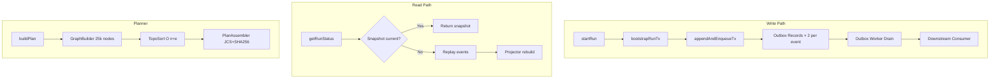
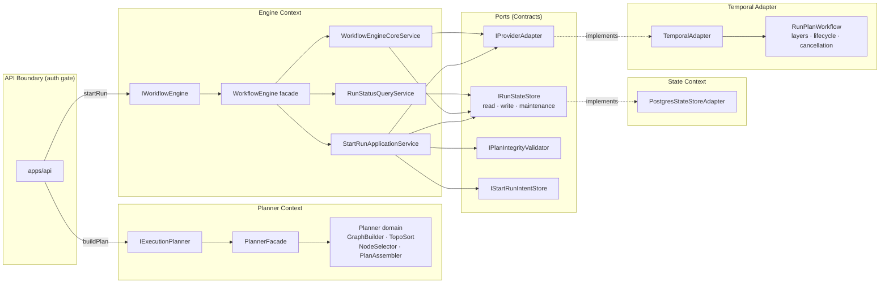
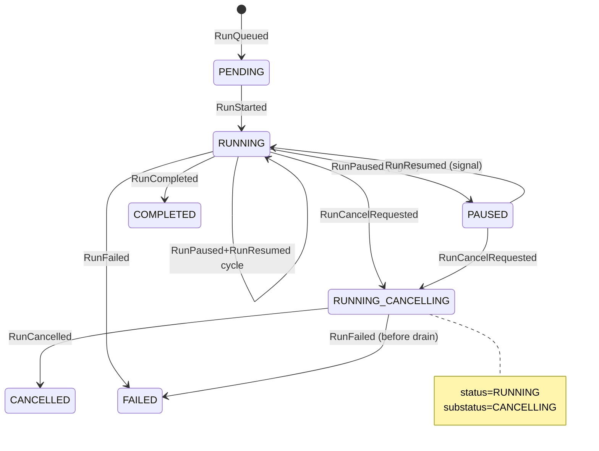
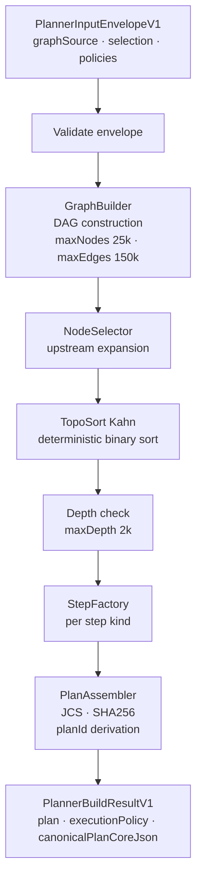
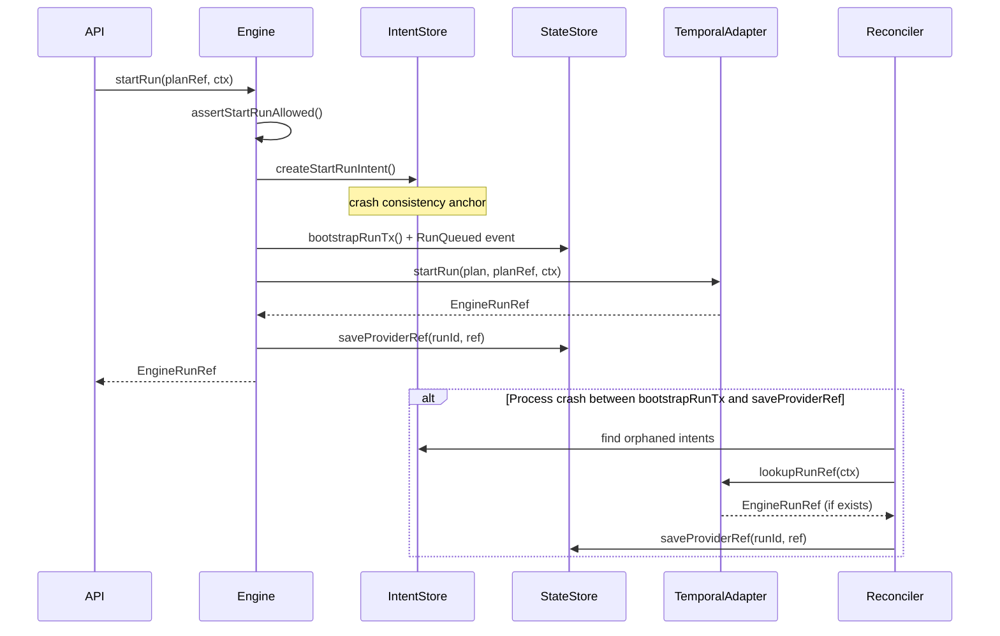
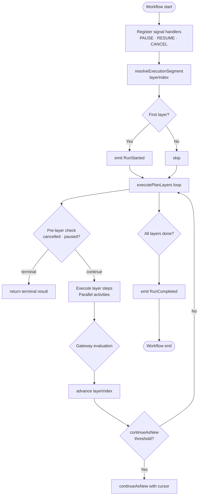

# DVT+ Principal Architect Deep Review

**Date:** 2026-04-22
**Reviewer scope:** Full system — Planner, Engine, Adapter (Temporal), State Store, Contracts,
Multi-tenancy, Scalability, Long-term maintainability
**Evidence base:** Direct code reading — `packages/@dvt/engine`, `packages/@dvt/planner`,
`packages/@dvt/adapter-temporal`, `packages/@dvt/contracts`, `packages/@dvt/state-store`,
`apps/temporal-worker`, canonical ADRs 0003/0004/0005/0006/0012/0014/0015/0017/0034

---

## 1. Conceptual Soundness

### What is solid

**Hexagonal architecture is real, not decorative.**
`WorkflowEngine.ts` is a pure delegation facade over typed ports
(`IStartRunApplicationService`, `IRunControlService`, `IRunStatusQueryService`).
The engine core has zero awareness of Postgres, Temporal, or HTTP.
Port contracts live in `@dvt/contracts`, not in the package that provides them.
This is correct hexagonal architecture — the dependency arrow points inward consistently.

**The Planner is genuinely stateless and deterministic.**
`Planner.ts` runs a pure pipeline:
manifest → graph build → node selection → topological sort → step build → plan assembly.
`planId = sha256(JCS(planCore))` means the same semantic inputs always produce the same
identifier, on any runtime (Node, Bun, Deno). The limits (`maxNodes: 25,000`,
`maxEdges: 150,000`) are declared and enforced. The pipeline is DDD-correct: commands in,
read models out, no I/O.

**Event sourcing is authoritative, not cosmetic.**
`(runId, idempotencyKey)` deduplication is SHA256-derived, not application-controlled.
`runSeq` is the ordering authority, not wall clock. `SnapshotProjector.rebuild()` can
reconstruct canonical status from events alone. `IRunStateStoreMaintenance.rebuildSnapshot()`
exists as a repair path. This is production-grade event sourcing.

**Crash consistency is solved at the right layer.**
The intent log (ADR-0030) plus `estimateRunRef()` eliminates the dual-producer race between
metadata bootstrap and adapter dispatch. If the process crashes after metadata write but before
adapter confirmation, the reconciliation worker can probe the provider. This is the correct
fix for a well-known distributed systems problem.

**CQRS within the Planner is clean.**
`BuildGraphCommand`, `SelectNodesCommand`, `AssemblePlanCommand` are true command objects.
The query side returns immutable read models. No shared mutable state, no side effects, no I/O.

**Bounded context rules are stated and enforced at import level.**
ADR-0034 forbids `@dvt/planner` ↔ `@dvt/engine` direct imports. Composition roots
(`apps/api`, `apps/outbox-worker`) own cross-context wiring. This is the correct
separation for long-term maintainability.

### What is fragile

**The "UI does not execute" principle is enforced by convention, not contract.**
There is nothing in `IWorkflowEngine` that prevents a UI component from calling it
directly if wired incorrectly in a composition root. The principle holds now because
the codebase is well-organized. It will erode the moment a shortcut is taken in a
composition root or a new API route is added without review.

**The gateway DSL is a semantic time bomb.**
`ExecutionStepV1.gateway.expression` is typed as `string` with `dslVersion: '1.0'`.
There is no formal grammar, no parser specification, no security sandbox for
expression evaluation documented in the contracts. If any future implementation uses
`eval()` or a naive expression parser, this is arbitrary code execution in a
multi-tenant workflow. The contract ships a string field with zero behavioral specification
beyond "boolean expression." This is underspecified and risky.

**Policy enforcement is declared but not verified at runtime.**
`ResolvedPolicies` maps planner policies to adapter capabilities. The adapter
_should_ honor `maxParallel: 2` (bounded concurrency). There is no runtime
verification that it did. A concurrency policy violation is silent. The system
trusts the adapter, which is correct for a trusted internal component, but there
is no audit mechanism to detect drift between declared policy and actual behavior.

**The `WorkflowSnapshot` migration path is undocumented.**
`schemaVersion: 1` is a hardcoded constant. `IRunStateStoreMaintenance.rebuildSnapshot()`
exists as a repair tool but the trigger condition, data migration procedure, and
backward compatibility rules for `schemaVersion = 2` are unspecified. The snapshot
schema will need to evolve as the feature set grows (new event types, new step kinds).

### What is missing

**RBAC: the system is unauthorized in production.**
`AllowAllAuthorizer` throws `ALLOW_ALL_AUTHORIZER_FORBIDDEN_IN_PRODUCTION` unless a flag
is set. This is a trip-wire, not a real authorization layer. At 20% completion, the
system has no enforced access control. Every `startRun`, `cancelRun`, `signal` call is
permitted to any caller that can reach the API. This is not a roadmap item — it is a
blocker for any multi-tenant production deployment.

**IArtifactStore: compilation artifacts have no storage implementation.**
5% complete means the compiled SQL, model manifests, and transformed artifact bundles
have no persistent home. Plans reference compiled artifacts via `CompiledCodeRef`, but
the store that holds those artifacts is a type definition only. Without this,
the dbt execution path cannot reliably fetch what it needs at step execution time.

**The `dbt` step result contract is incomplete.**
`StepCompleted` payloads carry optional `resultEvidence`, but the mapping from dbt CLI
exit codes, model compilation errors, test failures, and row-level assertions to
canonical DVT+ step results is 40% complete. The system can orchestrate dbt runs
but cannot reliably communicate what went wrong at the step level.

**Cost model is absent.**
No cost attribution, cost estimation, or cost model implementation was found
anywhere in the codebase. If cost-aware execution is a product differentiator,
the architecture has no hook for it beyond the planner's policy vocabulary,
which has no cost dimension.

---

## 2. Architectural Risk Map

| Risk                                                     | Severity | Likelihood | Why                                                                                                                                                 | Mitigation                                                                                                               |
| -------------------------------------------------------- | -------- | ---------- | --------------------------------------------------------------------------------------------------------------------------------------------------- | ------------------------------------------------------------------------------------------------------------------------ |
| **No real RBAC in production**                           | Critical | Certain    | `AllowAllAuthorizer` is the only impl; multi-tenant runs share zero access control                                                                  | Implement `IAuthorizationService` at API boundary before any production tenant onboarding                                |
| **Gateway DSL arbitrary execution**                      | High     | Medium     | `expression: string` with no grammar, no sandbox, multi-tenant context                                                                              | Define formal grammar in contract; use a sandboxed expression evaluator (e.g., `cel-js`) with an allow-list of operators |
| **ArtifactStore absent**                                 | High     | Certain    | `IArtifactStore` is types-only; dbt runtime fetches will fail or fall back to disk                                                                  | Implement Postgres or S3-backed artifact store before enabling dbt steps in production                                   |
| **dbt step failure mapping incomplete**                  | High     | Certain    | `StepFailed` payloads lack structured failure reason for dbt; downstream alerting and retries operate blind                                         | Complete the dbt-to-DVT+ result mapper for all known dbt failure modes                                                   |
| **Snapshot schema migration undefined**                  | Medium   | Likely     | `schemaVersion = 1`; no migration playbook; adding a new run sub-state (e.g., APPROVAL_PENDING) requires schema bump                                | Document migration procedure now; build a version-aware snapshot reader before the first schema bump                     |
| **Continue-as-new cursor bloat**                         | Medium   | Likely     | `resumeFromCursor` grows with plan size × completed steps; at 1000+ nodes per run the cursor approaches `maxContinueAsNewPayloadBytes`              | Add cursor compression or delta encoding; add a pre-flight check that rejects plans likely to exceed cursor limits       |
| **Policy enforcement is trust-based**                    | Medium   | Low-Medium | Adapter may not honor `bounded` concurrency; no runtime enforcement or audit                                                                        | Add a runtime concurrency tracker in the Temporal activity layer; emit a `PolicyViolationDetected` event if exceeded     |
| **Multi-engine abstraction (Conductor)**                 | Low      | Low        | `Provider` enum includes `conductor` with no implementation; maintaining the abstraction adds cognitive overhead                                    | Remove `conductor` from `Provider` enum until there is a real implementation; restore it when work begins                |
| **Signal concurrency — PAUSE + CANCEL race**             | Medium   | Medium     | Two concurrent signals can both pass the transition guard before either event is persisted                                                          | Make transition guard atomic (compare-and-swap on `cancelling`/`paused` flags in state store)                            |
| **Tenant isolation relies on app-layer validation only** | High     | Medium     | RLS at DB layer is documented as required but application-layer `assertTenantAccess` is 20% implemented; if RLS is misconfigured, tenant data leaks | Enforce RLS at DB layer unconditionally; add integration tests that prove cross-tenant queries fail                      |
| **Plugin security boundary absent**                      | High     | Certain    | Plugin system referenced in UI; no sandbox, no trust boundary, no capability model                                                                  | Do not accept third-party plugin code until a sandbox is designed and implemented                                        |
| **Outbox delivery context not extracted**                | Medium   | Medium     | `apps/outbox-worker` couples delivery to execution context; changes to event schema require coordinated deployment                                  | Extract `@dvt/delivery` package per ADR-0034; give the outbox worker its own schema-stable boundary                      |
| **`logicalAttemptId` overflow under heavy retry**        | Low      | Low        | `logicalAttemptId` is an integer; `maxAttempts: 20` per step × large fan-out is safe but the type has no declared upper bound                       | Document the upper bound; add a contract-level assertion                                                                 |
| **Plan record state not enforced at admission**          | Medium   | Medium     | `PlanRecord.state = SUPERSEDED` is not checked by the executability validator; SUPERSEDED plans can be started                                      | Add a `PLAN_STATE_SUPERSEDED` rejection code to `ExecutabilityRejectionCode` and enforce in admission guard              |

---

## 3. Engine Abstraction Critique

### Is IWorkflowEngine minimal and correct?

Yes, with one caveat. The 5-method surface
(`startRun`, `recoverRun`, `cancelRun`, `getRunStatus`, `signal`) is correct.
It is the smallest viable command+query interface for an execution engine.
The split between `CanonicalRunStatus` (event-log authority) and
`ProviderRunStatusView` (diagnostic enrichment) is the right design — it prevents
providers from becoming the source of truth.

The caveat: `recoverRun` as a top-level method on `IWorkflowEngine` is unusual.
Recovery is a lifecycle concern that crosses the engine and the state store boundary.
Its presence in the public facade creates an implicit assumption that recovery is a
first-class user-initiated operation. If recovery should only be trigger-driven
(by the reconciliation worker), it should be separated behind a different port.

### Is Temporal-first strategy wise?

Yes, for the current scale. Temporal's deterministic replay, signal semantics, and
activity retry model map directly onto DVT+'s event-driven step execution model.
The continue-as-new segmentation handles Temporal's history size limits cleanly.

The risk is coupling. The `RunPlanWorkflow` function encodes execution semantics
(layer-by-layer, gateway evaluation, cancellation) that are supposed to belong to
DVT+, not to Temporal. If DVT+ ever moves to a different provider, this logic must
be re-implemented in the new adapter — it is not reusable. This is acceptable
_if_ the contract boundary (`IProviderAdapter`) is kept strict. Today it is.

### Is the event model robust?

The idempotency key derivation
(`SHA256(runId | stepId | logicalAttemptId | eventType | planId | planVersion)`)
is correct. Duplicates return the existing record. The `runSeq` ordering authority
is correct. The split between `engineAttemptId` (provider-level) and
`logicalAttemptId` (DVT+ lineage) is the right abstraction.

The fragility is the `gateway.decision` field on `StepCompleted`.
The gateway expression in the plan is a `string`; the decision in the event is
presumably a `boolean` or enum. The link between expression evaluation and the
persisted decision is not formalized in the contract. Two different runtime
implementations could evaluate the same expression differently with no detection.

### Where determinism assumptions could fail

1. **Gateway expression evaluation** — if the expression string is evaluated with
   a non-deterministic function (date, random, network call), the Temporal sandbox
   will throw. But if the evaluator itself is deterministic yet semantically
   ambiguous (operator precedence, short-circuit rules), two evaluations of the
   same expression could produce different results after a workflow replay.

2. **`planId` derivation in the planner vs. re-verification in the engine** —
   both compute `sha256(JCS(planCore))`. If `planCore` serialization diverges
   between the planner version that built the plan and the engine version that
   re-verifies it (e.g., a new field added with a different default), the hash
   will not match. This is handled by schema versioning, but the tooling to
   detect this drift before deployment does not exist today.

3. **`continueAsNew` cursor correctness** — if a Temporal worker is upgraded
   mid-run and the new code interprets `resumeFromCursor.gateways` differently,
   the replayed history will diverge. Temporal's replay validator would catch
   non-determinism, but versioning of the cursor schema is not explicitly
   versioned in the workflow code.

---

## 4. Execution Planning Layer Analysis

### DAG analyzer based on dbt artifacts

`manifest.ts` parses dbt manifest into `GraphNode[]` with three resource types:
`model`, `test`, `snapshot`. The step kind mapping
(`DBT_MODEL`, `DBT_TEST`, `DBT_SNAPSHOT`) is explicit. The manifest validator
rejects unknown resource types. This is correct.

The risk: the dbt manifest schema evolves. DVT+ pins to a specific manifest shape
but the contract for which manifest versions are supported is not documented.
When dbt ships a new major version, the manifest parser will silently fail on
unrecognized fields or produce incorrect graphs from changed field semantics.

### Partial execution guarantees

Node selection with `includeUpstream: true` (default) and `includeDownstream: false`
is correct for targeted model runs. The `TopoSort.ts` handles selected subsets
with proper upstream inclusion. The guarantee is: selected nodes + their transitive
upstream will execute, in dependency order.

What is not guaranteed: that a partial run that fails midway can be cleanly resumed
from the checkpoint. `logicalAttemptId` provides lineage, and `recoverRun` provides
the API, but the semantics of which steps are re-executed vs. skipped on recovery
are not specified in the contracts.

### Retry/backoff policy ownership

Policy ownership is correct in principle:

- The planner declares the policy (`RetryPolicy`, `TimeoutPolicy`, `ConcurrencyPolicy`).
- `policies.ts` maps these to `ResolvedPolicies`.
- The adapter honors the resolved policy.

The gap: `ConcurrencyPolicy { kind: 'bounded', maxParallel }` has no runtime
enforcement mechanism. The Temporal workflow executes steps layer-by-layer with
all steps in a layer running in parallel via `Promise.all()`. There is no semaphore
or token bucket in the layer execution loop. Bounded concurrency is either
unimplemented or relies on Temporal activity slot limits, which are worker-level
not run-level. This is a behavioral gap between declared policy and runtime behavior.

### Cost estimator realism

There is no cost estimator. The planner contract includes no cost dimension.
The execution plan includes no cost estimate. The policy vocabulary has no
cost budget clause. If cost-aware execution is a product goal, the entire cost
layer must be designed from scratch — there is no scaffolding.

### Plan versioning strategy

ADR-0017 defines a correct compatibility matrix approach: same `major`, `minor <= supported`.
The `SUPPORTED_EXECUTION_PLAN_VERSIONS = ['1.0']` list is explicit. The engine
validates before bootstrap, not after. This is correct.

The gap: there is no documented procedure for what happens to in-flight runs
when a new plan version is deployed. Runs started with `v1.0` may outlive the
deployment of an adapter that drops `v1.0` support. The compatibility matrix
handles the admission gate but not the in-flight migration.

### Is this layer over-engineered?

No for the core graph model. The `GraphBuilder`, `TopoSort`, `NodeSelector`
pipeline is the minimum needed for correct DAG execution.

Yes for the policy vocabulary. `PlannerPolicyVocabulary.v2` has a discriminated
union for each of `retry`, `timeout`, and `concurrency`. The vocabulary is
well-designed but the enforcement for `concurrency` is absent and `timeout` is
also unverified at runtime. Shipping a vocabulary without enforcement is
documentation-driven over-engineering.

---

## 5. State and Metadata Layer Review

### Is artifact immutability realistic?

The event store is append-only and immutable by design. The `(runId, idempotencyKey)`
deduplication prevents re-insertion of identical events. `runSeq` is strictly
increasing and enforced in `IRunStateStoreWrite.appendAndEnqueueTx()`.

The fragility: `WorkflowSnapshot` is mutable (it is rebuilt from events). The snapshot
is a read optimization, not a source of truth. If the snapshot is out of sync with the
event log, `SnapshotProjector.rebuild()` is the recovery path. The question is:
who detects the out-of-sync condition proactively? Today, this is not monitored.

### Write amplification risk

For a 1000-step plan, a full execution produces at minimum:

- 1 `RunQueued`
- 1 `RunStarted`
- 1000 `StepStarted`
- 1000 `StepCompleted`
- 1 `RunCompleted`

That is 2003 events per run. The outbox pattern doubles this to 4006 outbox records
(one per event). At 1000 concurrent runs, that is ~4 million writes per run batch.
This is sustainable in Postgres with partitioning but requires explicit table
partitioning strategy (by `tenantId` + time range), which is not documented.

### Event sourcing vs mutable state tradeoffs

The current design makes the correct tradeoff: events are the authority, snapshots
are the acceleration layer. `IRunStateStoreMaintenance.rebuildSnapshot()` is the
safety valve. The risk is snapshot staleness under high write load. If the snapshot
rebuild lags behind event writes, `getRunStatus` will return stale data.
The system has no read-your-writes guarantee documented between `appendAndEnqueueTx()`
and `getSnapshot()`.

---

## 7. What Is Overbuilt

**The multi-engine abstraction for Conductor.**
`Provider.conductor` is in the enum. No implementation exists. The adapter
interface exists. The policy mapping table references Conductor. Every design
decision that asks "is this Temporal-specific or provider-agnostic?" now
has to account for a ghost provider. Remove it until there is a real need.

**The policy vocabulary without enforcement.**
`ConcurrencyPolicy { kind: 'bounded', maxParallel }` and
`TimeoutPolicy { kind: 'budget', maxSeconds }` are declared, validated in schema,
and mapped by the policy mapper. Neither is enforced at runtime. The vocabulary
creates a user expectation that cannot be met. Shipping `at-most-once` retry
and `unbounded` concurrency only, and marking others as `canHonor: false` in
the mapping table, is more honest.

**The `PlanRecord` state machine (ACTIVE / SUPERSEDED / ARCHIVED).**
The state machine is defined. The transitions are not enforced at the admission
gate (`ExecutabilityRejectionCode` does not include `SUPERSEDED`). The archive
lifecycle is implemented in `@dvt/state-store`. The gap between the type and
the enforcement creates a false sense of protection.

**The `RunStatusEnrichment` composite.**
A third status representation beyond `CanonicalRunStatus` and `ProviderRunStatusView`
adds API surface complexity. If no consumer of `RunStatusEnrichment` is implemented,
this is premature abstraction.

---

## 8. What Is Underbuilt

**RBAC and authorization (20% → needs 100% before production).**
The design in `IAuthorization.v1.md` is correct: roles (TENANT_ADMIN, PLAN_AUTHOR,
OPERATOR, AUDITOR, VIEWER), actions (RUN_START, RUN_CANCEL, SIGNAL_SEND),
resources (tenant-scoped), audit trail. None of it is implemented. This is not
a future feature — it is a pre-production requirement.

**Distributed concurrency model.**
Concurrent `startRun` calls for the same `runId` are handled by
`(runId, idempotencyKey)` dedup at the event level. But concurrent signals
(PAUSE + CANCEL simultaneously) have no atomic transition guard at the
state store level. The current guard is application-layer check-then-act,
which has a TOCTOU race under concurrent requests.

**Backpressure model.**
`StartRunBoundary.v1.ts` declares `TENANT_BACKPRESSURE` and `SYSTEM_BACKPRESSURE`
result codes. There is no implementation of the backpressure evaluation.
No rate limiter, no concurrency counter, no queue depth check is visible
in the engine or start-run service. The codes are type-correct but behaviorally absent.

**Rollback guarantees for failed runs.**
A failed run leaves partial state: some steps completed, some failed.
There is no documented rollback or compensation path. For dbt models that
ran and materialized a table, the table exists in Snowflake/Postgres regardless
of the run failure. The system records the failure but does not clean up
downstream state. For dbt this may be acceptable (dbt manages idempotent
materialization), but for SQL transforms it is not.

**Run retention and archival policy enforcement.**
`IDeliveryBufferPurgeStore` and `IRunArchiveStore` exist in `@dvt/state-store`.
ADR-0037 (archival) and ADR-0038 (delivery buffer retention) are accepted.
No scheduled enforcement is visible. The archive triggers, retention windows,
and purge schedules are not wired up in any composition root or worker.

**dbt manifest version compatibility matrix.**
The planner parses dbt manifests with no declared compatibility contract.
There is no `SUPPORTED_DBT_MANIFEST_VERSIONS` list. When dbt releases a new
schema version, the parser will silently produce incorrect graphs or crash
on field access.

**SLA definitions and breach detection.**
No `SLA` type, no breach threshold, no alerting hook exists in the contracts
or the observability layer. If a run exceeds its expected duration, there is
no automatic detection or escalation path.

---

## 9. Scalability Outlook — 3-Year Horizon

### Assumptions

- 1000+ tenants
- 5000 concurrent runs
- Plans with 1000–5000 steps (enterprise dbt projects)
- Cost dashboards querying 90-day event history
- Cross-environment diff features querying two plan trees simultaneously

### Bottlenecks



**Postgres event table without partitioning** is a single point of failure.
At 5000 concurrent runs × 2000 events each = 10 million rows per full-cycle batch.
Without range partitioning by `(tenantId, emittedAt)`, index scan performance
degrades nonlinearly past 100 million rows.

**The outbox worker is single-threaded per app instance.**
`apps/outbox-worker` drains the delivery buffer. At high event volume,
the outbox becomes a bottleneck. ADR-0033 (outbox sharding and fencing)
is accepted but the sharding implementation is not confirmed implemented.

**Snapshot staleness at scale.**
If 5000 concurrent runs are appending events simultaneously, `getSnapshot()`
during active execution will return a stale snapshot unless snapshot writes
are synchronous with event writes. The current `appendAndEnqueueTx()` signature
suggests events and outbox records are written together, but snapshot updates
are separate. Under high load, the snapshot lags, forcing projector rebuilds,
which read the full event log — amplifying read load.

**Planner at 5000-node graphs.**
`GraphBuilder` at `maxNodes: 25,000` and `maxEdges: 150,000` runs a Kahn's
algorithm topological sort. At O(V + E), this is ~175,000 operations.
Deterministic binary sort of the ready queue is O(V log V). For a 5000-node
graph this is ~60,000 comparisons. This is fast in isolation but the planner
is called synchronously in the API path. At 100 concurrent plan requests,
this becomes 100 × 60,000 = 6 million comparisons on the main API thread.
The planner should be moved to a worker pool or dedicated service at scale.

**Cost dashboard queries across 90-day event history.**
With no event partitioning and no materialized cost view, a dashboard query
that aggregates costs across 90 days × 1000 tenants = full table scan.
There is no cost model to query anyway, but if one is added without
a pre-aggregation strategy, this is an instant performance cliff.

### Single points of failure

1. **Postgres** — event store, snapshot store, outbox, plan store, intent store.
   All critical data is in one database. No horizontal read scaling is documented.

2. **Temporal server** — single provider. `AllowAllAuthorizer` means any component
   with network access can start runs. Temporal worker pool size is the effective
   concurrency limit.

3. **Planner in API path** — synchronous, CPU-bound, no queue.

### Data growth pressure

At 1000 tenants × 100 runs/day × 2000 events/run:

- 200 million events/day
- 72 billion events/year

This requires a mandatory partitioning and archival strategy before reaching
production scale. ADR-0037 and ADR-0038 cover the policy. The implementation
is not confirmed active.

---

## 10. Architectural Scorecard

| Dimension                     | Score | Justification                                                                                                                                                                                                                                                                                                                                                           |
| ----------------------------- | ----- | ----------------------------------------------------------------------------------------------------------------------------------------------------------------------------------------------------------------------------------------------------------------------------------------------------------------------------------------------------------------------- |
| **Conceptual clarity**        | 8/10  | The Planner/Engine/State separation is real and documented. The "UI does not execute" principle is structurally enforced. Minor deductions for gateway DSL ambiguity and the RunStatusEnrichment third status representation.                                                                                                                                           |
| **Separation of concerns**    | 7/10  | Hexagonal structure is correct. The Planner is clean. The engine is clean. Deductions: (a) `recoverRun` belongs on a maintenance port, not the public facade; (b) outbox delivery is not yet extracted; (c) `logicalAttemptId` ownership (ADR-0016) was a real boundary problem — recently resolved.                                                                    |
| **Replaceability of engine**  | 6/10  | `IProviderAdapter` is the correct abstraction. The Temporal workflow (`RunPlanWorkflow`) re-encodes DVT+ execution semantics (layer-by-layer, gateway evaluation) inside the adapter, making a provider swap a full re-implementation effort, not a port swap. The abstraction is correct; the implementation leaks.                                                    |
| **Determinism**               | 8/10  | JCS+SHA256 plan hashing is correct. Topological sort is deterministic. Temporal sandbox enforces determinism within the workflow. Deductions: gateway expression evaluation is unspecified; `resumeFromCursor` schema is unversioned in the workflow code.                                                                                                              |
| **Extensibility**             | 5/10  | Step kind registry exists and is governed. The `STEP_KIND_BRIDGE_REGISTRY` is empty — the fail-closed target state for unknown step kinds is declared but not reached. Cost model is absent. Plugin sandbox is absent. Policy enforcement is incomplete. Adding a new capability requires changes in 4–5 layers (contract, planner, adapter, validator, mapping table). |
| **Operational realism**       | 4/10  | RBAC is missing. Backpressure is declared but not implemented. Archive enforcement is not scheduled. Retention policy is not active. Snapshot staleness is not monitored. There is no SLA breach detection. The system is operationally immature relative to its conceptual sophistication.                                                                             |
| **Long-term maintainability** | 7/10  | ADRs are thorough and accepted. Bounded context rules are stated. Architecture tests protect structural invariants. Deductions: governance of dbt manifest versions is absent; snapshot schema migration is undocumented; the gap between policy declaration and enforcement will erode trust in the policy system.                                                     |

**Overall:** The system has a strong architectural skeleton and a weak operational
muscle layer. The concepts are correct. The implementation gaps are operational, not
conceptual.

---

## 11. Strategic Recommendations

### 3 structural changes

**S1. Formalize the gateway DSL as a closed algebraic type, not a string.**
Replace `expression: string` with a typed AST:

```typescript
type GatewayExpression =
  | { kind: 'step_completed'; stepId: string }
  | { kind: 'step_failed'; stepId: string }
  | { kind: 'and'; operands: GatewayExpression[] }
  | { kind: 'or'; operands: GatewayExpression[] }
  | { kind: 'not'; operand: GatewayExpression };
```

This removes arbitrary execution risk, makes evaluation deterministic, and enables
static analysis at plan admission time. This is a breaking change that must be versioned.

**S2. Separate the recovery and maintenance facade from `IWorkflowEngine`.**
`recoverRun` is a maintenance operation, not a user-facing operation.
Extract it to `IRunMaintenanceService` (alongside `rebuildSnapshot` and archive ops).
`IWorkflowEngine` should be `startRun` + `cancelRun` + `getRunStatus` + `signal` only.
This enforces the correct usage pattern and prevents recovery from being called in
non-maintenance contexts.

**S3. Extract the Temporal execution semantics into a testable DVT+ execution loop.**
The layer-by-layer execution, gateway evaluation, and cancellation handling in
`runPlanWorkflow.layers.ts` and `runPlanWorkflow.lifecycle.ts` are DVT+ logic
living inside a Temporal workflow. Extract a pure `ExecutionLoopEngine` that takes
`(plan, cursor, signals)` and returns `(nextCursor | terminal)`. The Temporal
workflow then becomes a thin driver of this pure function. This makes the core
execution logic independently testable and portable to any provider.

### 3 clarifications needed

**C1. What is the recovery semantic for partial runs?**
When `recoverRun` is called after a partial execution (steps 1-50 completed, step 51 failed),
does the new run: (a) replay from scratch, (b) skip completed steps, or
(c) start from the failure point? The contracts do not specify.
This ambiguity will produce inconsistent behavior across adapter implementations.

**C2. What is the snapshot consistency model under concurrent writes?**
Is there a guarantee that `getSnapshot()` reflects all events in
`appendAndEnqueueTx()` before a response is returned?
Or is snapshot a best-effort async projection? Consumers of `getRunStatus`
need to know whether they are reading a consistent or eventually-consistent view.

**C3. What is the eviction/admission rule for superseded plans?**
If a plan is in `SUPERSEDED` state, can it still be started?
The `PlanRecord.state` type and `PlanExecutabilityValidation.v1.ts` are separate
files with no explicit connection. The answer determines whether old plan versions
can be re-run for debugging, recovery, or audit purposes.

### 3 things to freeze immediately

**F1. Freeze the event envelope contract (`RunEventWrite`).**
The `(runId, idempotencyKey)` dedup, the `runSeq` ordering, and the
12-event type set are production-ready. Any change to the idempotency key
derivation formula invalidates all existing event history. Do not change it.

**F2. Freeze the `planId = sha256(JCS(planCore))` derivation.**
Changing the serialization algorithm or the canonical JSON library invalidates
all existing plan IDs and breaks plan references in stored run metadata.

**F3. Freeze the `IProviderAdapter` contract shape.**
`startRun`, `cancelRun`, `getProviderStatusView`, `signal`, `signalSemanticsVersions`
and the optional `estimateRunRef` are stable. Adding required methods is a
breaking change for all adapter implementations. Do not add required methods
without a versioning bump.

### 3 things to delay

**D1. Delay the cost model until RBAC and artifact store are complete.**
A cost model without authorization is a billing system without access control.
Implement RBAC and the artifact store first. The cost model requires both.

**D2. Delay the Conductor adapter.**
It adds abstraction overhead and zero current value.
Remove `conductor` from the `Provider` enum until there is a committed
delivery timeline for a Conductor implementation.

**D3. Delay `RunStatusEnrichment`.**
The third status representation creates API complexity before there is a consumer.
Keep `CanonicalRunStatus` (authority) and `ProviderRunStatusView` (diagnostic).
Introduce the composite only when a concrete dashboard or alerting consumer
requires both in one response.

---

## Architecture Flow Diagrams

### Current boundary model



### Event lifecycle state machine



### Planner pipeline



### Start-run crash-consistency model



### Temporal workflow execution loop



---

## Action Plan Reference

See [20260422-dvt-plus-principal-architect-action-plan.md](./20260422-dvt-plus-principal-architect-action-plan.md)
for the sequenced task backlog derived from this review.
