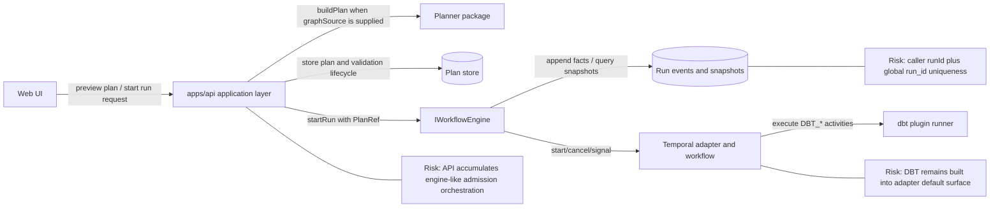
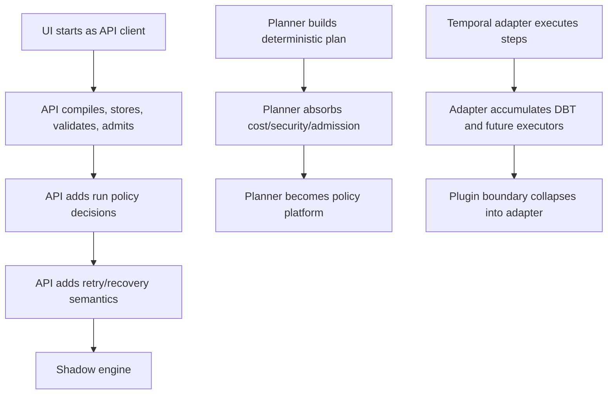
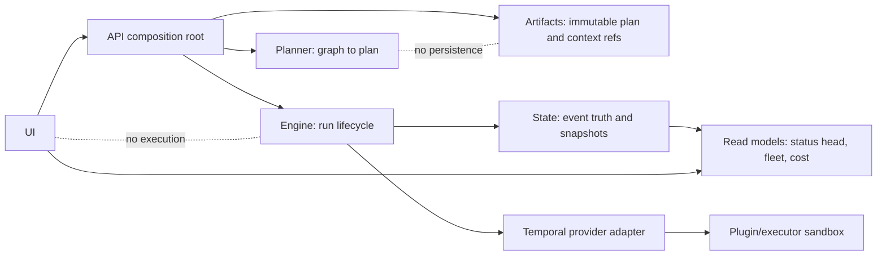
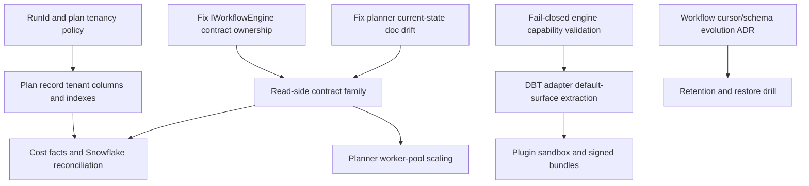

# DVT+ System Architecture Review 2026-04-23

**Date:** 2026-04-23

**Review posture:** Principal / Staff architecture review. Source-code first.
No alternative definitions are introduced.

## Governing Sources Used

- `docs/planning/status/governance-document-rule-inventory.md`
- `docs/guides/ai-work-protocol.md`
- `docs/architecture/reference-architecture.md`
- `docs/architecture/system-delivery-status.md`
- `docs/planning/status/canonical-doc-code-matrix.md`
- `docs/planning/status/planner-current-state-assessment.md`
- `docs/adr/ADR-0003-execution-model.md`
- `docs/adr/ADR-0004-event-sourcing-strategy.md`
- `docs/adr/ADR-0012-plan-integrity-ownership.md`
- `docs/adr/ADR-0014-run-driven-adapter-model.md`
- `docs/adr/ADR-0015-getRunStatus-read-model-separation.md`
- `docs/adr/ADR-0017_ExecutionPlan_Schema_Versioning.md`
- `docs/adr/ADR-0031-adapter-tenant-isolation.md`
- `docs/adr/ADR-0034-bounded-context-boundaries-and-communication-rules.md`
- `docs/adr/ADR-0035-planner-public-contract-evolution-protocol.md`
- `docs/adr/ADR-0036-execution-plan-planversion-registry-and-runtime-matrix.md`
- `docs/adr/ADR-0039-hexagonal-port-hardening-and-solid-remediation.md`
- `docs/adr/ADR-0040-retry-ownership-and-attempt-authority.md`
- `docs/adr/ADR-0042-execution-plan-canonical-identity-unification.md`
- `docs/adr/ADR-0043-plan-record-plan-store-and-artifacts-ownership.md`
- `docs/adr/ADR-0046-execution-plan-definition-and-run-execution-policy-separation.md`
- `docs/adr/ADR-0047-runtime-owned-realized-lifecycle-for-signal-driven-transitions.md`
- `packages/@dvt/contracts/src/contracts/planner/ExecutionPlan.v1.ts`
- `packages/@dvt/contracts/src/contracts/engine/RunExecutionPolicy.v1.ts`
- `packages/@dvt/contracts/src/contracts/engine/StartRunBoundary.v1.ts`
- `packages/@dvt/contracts/src/step-registry/StepTypeRegistry.ts`
- `packages/@dvt/contracts/src/step-registry/BuiltInStepTypeEntries.ts`
- `packages/@dvt/engine/src/ports/IWorkflowEngine.ts`
- `packages/@dvt/engine/src/core/WorkflowEngine.ts`
- `packages/@dvt/engine/src/application/StartRunApplicationService.ts`
- `packages/@dvt/engine/src/application/StartRunAdmissionGuard.ts`
- `packages/@dvt/engine/src/services/startRun/StartRunValidationPolicy.ts`
- `packages/@dvt/engine/src/services/startRun/StartRunExecutionService.ts`
- `packages/@dvt/engine/src/security/planIntegrity.ts`
- `packages/@dvt/planner/src/application/PlannerFacade.ts`
- `packages/@dvt/planner/src/domain/Planner.ts`
- `packages/@dvt/planner/src/domain/PlanAssembler.ts`
- `packages/@dvt/planner/src/domain/manifest.ts`
- `packages/@dvt/planner/src/domain/policies.ts`
- `packages/@dvt/planner/src/application/derivePlannerGraphSourceFromManifest.ts`
- `packages/@dvt/plan-interpreter/src/dagAnalyzer.ts`
- `packages/@dvt/adapter-temporal/src/TemporalAdapter.ts`
- `packages/@dvt/adapter-temporal/src/workflows/executionSegmentResolver.ts`
- `packages/@dvt/adapter-temporal/src/workflows/runPlanWorkflow.activities.ts`
- `packages/@dvt/adapter-temporal/src/workflows/runPlanWorkflow.stepExecution.ts`
- `packages/@dvt/adapter-temporal/src/activities/dbtStepActivity.ts`
- `packages/@dvt/adapter-postgres/src/PostgresSchemaManager.ts`
- `packages/@dvt/adapter-postgres/src/PostgresRunStateCoordinator.ts`
- `packages/@dvt/adapter-postgres/src/PostgresRunEventStorage.ts`
- `packages/@dvt/adapter-postgres/src/PostgresRunSnapshotStore.ts`
- `packages/@dvt/adapter-postgres/src/PostgresPlanStore.sql.ts`
- `packages/@dvt/adapter-postgres/src/PostgresPlanStore.plan-record-repository.ts`
- `apps/api/src/entrypoints/http/startRunRouteCommandBuilder.ts`
- `apps/api/src/entrypoints/http/planRoutePlanSourcePolicy.ts`
- `apps/api/src/application/services/PlannerBackedStartRunUseCase.ts`
- `apps/api/src/application/services/PreviewPlanUseCase.ts`
- `apps/api/src/application/services/BackpressureAwareStartRunUseCase.ts`
- `apps/api/src/application/services/StoredPlanExecutabilityValidator.ts`
- `apps/web/src/app/views/canvas/canvasPlanAction.ts`
- `apps/web/src/app/views/canvas/canvasRunStartAction.ts`
- `apps/web/src/app/services/plans/plansService.api.ts`
- `apps/web/src/app/services/runs/runsService.api.ts`
- `docs/risk-register/quality/R-20260420-TEMPORAL-DBT-BUILTIN-COUPLING.yaml`

## Source-Of-Truth Correction

The names `dvt_workflow_engine_artifact` and
`dvt_v2_architecture_explanation` are not live canonical files in the current
repository. They appear only in archived review mapping. This review uses the
current governed code and docs listed above.

The naming drift is itself a system risk: if a reviewer needs archived aliases
to find current contracts, the architecture is already too hard to navigate.

## Core Principle Verdict

The principle is mostly true today:

> The UI does not execute. The engine decides on its domain. The planner does
> not persist state.

It is not self-enforcing enough.

The planner is genuinely persistence-free. The UI does not call Temporal,
Postgres, dbt, or the engine package directly. State is the run truth for
canonical status. The weak point is the application/API layer: it compiles,
stores, validates, applies admission, probes duplicate runs, applies
backpressure, and delegates execution. That layer can become a shadow engine if
its boundaries are not frozen and split further.

## Current Authority Diagram

## 1. Conceptual Soundness

### What is solid

| Area                                | Assessment                                                                                                                                                                                         |
| ----------------------------------- | -------------------------------------------------------------------------------------------------------------------------------------------------------------------------------------------------- |
| Planner purity                      | `PlannerFacade` and `Planner` consume canonical `graphSource`, build a deterministic plan, and do not persist state. Persistence is outside `@dvt/planner`.                                        |
| Plan identity                       | `PlanAssembler` derives `planId` from `sha256(JCS(planCore))`; engine re-verifies the same core identity before adapter dispatch. This is the correct content-addressed model.                     |
| UI non-execution                    | The Canvas path uses `plansService.previewPlan()` and `runsService.startRun()`. It requires persisted preview proof before starting a run. The UI is a client of API ports, not an execution host. |
| Engine read authority               | `WorkflowEngine.getRunStatus()` delegates to state-backed status query. Provider-live status is separate diagnostic surface, not canonical truth.                                                  |
| Runtime-owned signal lifecycle      | `ADR-0047` and current Temporal cancellation/signal workflow put realized events in runtime execution, not in a preemptive engine-side mapper.                                                     |
| Plan-store separation               | `PreviewPlanUseCase` and `PlannerBackedStartRunUseCase` store plans after planner output. The planner does not know the store exists.                                                              |
| Fail-closed step validation in code | The current `StepTypeRegistry` rejects unknown step kinds. The active planner status doc still says fail-open, but code and tests show rejection.                                                  |

### What is fragile

| Area                           | Why it is fragile                                                                                                                                                                                                                                                                                                  |
| ------------------------------ | ------------------------------------------------------------------------------------------------------------------------------------------------------------------------------------------------------------------------------------------------------------------------------------------------------------------ |
| Contract ownership             | The ownership mismatch is now hard-cut: `IWorkflowEngine` is published canonically from `@dvt/engine`, implemented at `packages/@dvt/engine/src/ports/IWorkflowEngine.ts`, and no longer exposed through a contract subpath. The remaining fragility is documentation drift if governed indexes are not re-synced. |
| API orchestration breadth      | `PlannerBackedStartRunUseCase`, `PreviewPlanUseCase`, `StoredPlanExecutabilityValidator`, and `BackpressureAwareStartRunUseCase` make API responsible for compile/store/validate/admit/delegate. That is acceptable as composition, but it is one step away from becoming business execution logic.                |
| ExecutionPlan portability      | `ExecutionStepRetryPolicyV1` uses Temporal-compatible duration strings. The canonical plan leaks the only production runtime.                                                                                                                                                                                      |
| Adapter capability enforcement | API executability validation fails closed when required capabilities exist and an adapter does not declare `capabilities()`. Engine-level `StartRunValidationPolicy` returns success in that same condition. Direct engine use can bypass a guarantee that API enforces.                                           |
| DBT adapter coupling           | `DbtStepActivity` and dbt runner seams remain inside `@dvt/adapter-temporal`. Worker composition gates live DBT wiring, but package defaults still treat DBT as built-in.                                                                                                                                          |
| Tenant identity                | Start-run `runId` is now API-generated as `run_<UUIDv7>` under `ADR-0050`, and web no longer authors `run_ui_*` execution ids. The remaining fragility is storage posture: `run_metadata` still uses globally unique `run_id`, and plan-record tenancy indexes are still separate follow-up work.                  |
| Plan record tenancy            | `plan_records` has no top-level `tenant_id`, `project_id`, or `environment_id`. Ownership lives inside canonical JSON. That is weak for indexed isolation, list queries, and operational controls.                                                                                                                 |
| Documentation drift            | `planner-current-state-assessment.md` says unknown step kinds fail open. Current code rejects them. This is not a small typo: it is a governance source disagreeing with tests.                                                                                                                                    |

### What is missing

| Missing piece                                      | Why it matters                                                                                                                                                                                                                                   |
| -------------------------------------------------- | ------------------------------------------------------------------------------------------------------------------------------------------------------------------------------------------------------------------------------------------------ |
| Contract migration playbook                        | Version fields exist, but rollout, dual-read, in-flight workflow compatibility, and deprecation rules are under-specified.                                                                                                                       |
| Distributed consistency SLA                        | Start-run uses intent, bootstrap, provider start, outbox, snapshots, and reconciliation. The exact caller-visible consistency promise is not defined tightly enough.                                                                             |
| Tenant-scoped plan and residual run-storage policy | Start-run ids are now globally generated by the platform as opaque `run_<UUIDv7>` values. Plan records still need top-level tenant/project/environment indexing, and run storage still relies on global uniqueness plus persistence constraints. |
| Runtime capability matrix                          | Step-kind support and capabilities exist, but default built-ins use an all-provider profile with no required capabilities. That overstates runtime support.                                                                                      |
| Plugin sandbox and trust model                     | DBT execution shells out via adapter/worker seams. There is no mature sandbox, signing, capability envelope, or resource isolation model.                                                                                                        |
| Cost facts                                         | "Cost-aware" is not real architecture until there are emitted cost facts, attribution keys, warehouse-query reconciliation, and tenant billing boundaries.                                                                                       |
| Read-side contract family                          | Single-run status exists. Fleet/list/status-head/cost reads are still not governed like command contracts.                                                                                                                                       |

## 2. Architectural Risk Map

| Risk                         | Severity | Likelihood | Why                                                                                                                                                                                                                                                            | Mitigation                                                                                                                                       |
| ---------------------------- | -------- | ---------- | -------------------------------------------------------------------------------------------------------------------------------------------------------------------------------------------------------------------------------------------------------------- | ------------------------------------------------------------------------------------------------------------------------------------------------ |
| State explosion              | High     | High       | Each step can create started/completed/failed events, outbox rows, snapshot work, lineage rows, and future cost facts. Large dbt projects multiply write volume.                                                                                               | Partition event/outbox tables by tenant/time, define retention defaults, and add write-volume budgets per run.                                   |
| Event duplication            | High     | Medium     | Temporal retries, activity retries, local terminal events, outbox replay, and projector repair all produce repeated delivery pressure. Idempotency exists but must cover every producer.                                                                       | Maintain a producer/event/idempotency matrix and add property tests for duplicate activity/outbox/replay paths.                                  |
| Idempotency breakdown        | High     | Medium     | New adapters or plugins can emit facts outside existing idempotency key rules. Step ids and logical attempts are easy to misuse.                                                                                                                               | Make event append go through one execution-owned append gateway and forbid adapter-local event construction outside registered factories.        |
| Planner responsibility creep | Medium   | High       | Planner already materializes retry policy and validates step configs. Future cost/backpressure/security logic could be pushed into plan assembly.                                                                                                              | Freeze planner as topology plus plan-definition builder; keep admission, capability, tenancy, and cost enforcement outside planner.              |
| Engine responsibility creep  | Medium   | Medium     | Start-run admission, context binding, intent recovery, adapter resolution, and compensation already sit near engine. Wider policy roles will turn the facade into a runtime platform object.                                                                   | Split access, rate limit, plan-ref validation, capability validation, and run-context binding into explicit policies with narrow ports.          |
| Plugin security risk         | High     | High       | DBT runtime executes external project bundles and plugin context via worker/adapter code. There is no sandbox-grade boundary.                                                                                                                                  | Add signed bundle verification, extraction jail, command allowlist, resource caps, and tenant-scoped artifact access before third-party plugins. |
| Multi-tenant isolation flaw  | High     | Medium     | Caller-provided start-run `runId` is fixed by `ADR-0050`, but plan records still lack indexed tenant columns and some lineage migrations backfill `__unknown_tenant__`. Global run keys now depend on API-owned UUIDv7 allocation plus persistence uniqueness. | Keep API-owned `run_<UUIDv7>` ids opaque; add top-level tenant columns to plan records; add continuous cross-tenant tests.                       |
| Cost attribution complexity  | Medium   | High       | The system has no cost-fact contract. Snowflake cost attribution needs warehouse/query history reconciliation, not planner estimates.                                                                                                                          | Start with post-run metering facts and query-history reconciliation. Delay pre-run estimator claims.                                             |
| Operational complexity       | High     | High       | Temporal, Postgres events, snapshots, outbox, lineage outbox, plan store, archive, purge, and plugin workers all interact.                                                                                                                                     | Publish an operational dependency graph, SLOs, queue-depth thresholds, runbooks, and restore drills before scale.                                |
| Temporal-first lock-in       | Medium   | High       | Retry strings, workflow payload budgets, and continue-as-new shape are Temporal-specific.                                                                                                                                                                      | Admit Temporal-first explicitly; remove unsupported provider claims until a second adapter passes conformance tests.                             |
| State-driven UI overload     | Medium   | High       | Single-run state reads are fine; fleet dashboards and cost views will overload low-level stores without dedicated heads/materialized views.                                                                                                                    | Build governed read models for status-head, fleet list, and cost facts.                                                                          |
| Documentation drift          | Medium   | High       | Current planner docs disagree with code on unknown step-kind behavior. Archived alias names still appear in review briefs.                                                                                                                                     | Add docs truth-sync tasks after code changes and fail changed docs when claims contradict current tests.                                         |

## 3. Engine Abstraction Critique

### Is `IWorkflowEngine` minimal and correct?

Mostly yes.

The five-method surface is narrow enough:

- `startRun`
- `recoverRun`
- `cancelRun`
- `getRunStatus`
- `signal`

`getRunStatus()` reading canonical state instead of provider state is correct.
Separating enrichment and health from this facade is also correct.

The weak part is contract placement. The normative interface lives in
`@dvt/engine`, not in `@dvt/contracts`, while governance and docs keep referring
to engine contracts as shared-kernel surfaces. That mismatch will confuse
consumers and reviewers.

### Is Temporal-first wise?

Yes, as the actual runtime strategy.

No, as a portability story.

Temporal fits deterministic orchestration, activities, signals, cancellation,
and retry. The problem is that the codebase still carries multi-engine language
while the actual implementation is Temporal plus mock. Conductor vocabulary is
not a strategy. It is unearned abstraction until there is a conformance-tested
adapter.

### Is the event model robust?

It is robust on ordering and canonical authority:

- run events are ordered by `run_seq`
- snapshots are rebuildable derived state
- outbox records are produced transactionally with persisted events
- status reads use state, not provider truth

It is fragile around producer discipline. Temporal workflow activities emit
events through activity ports, engine bootstrap emits events, signal handling
emits lifecycle events, and maintenance/reconciliation can repair state. If
all paths keep using the same factories and idempotency rules, the model holds.
If a plugin or new adapter bypasses that discipline, it breaks.

### Is `ExecutionPlan` sufficiently expressive?

It is expressive enough for current DAG execution. It is too permissive for
long-term extension.

Correct:

- graph steps
- dependencies
- stable plan identity
- ownership metadata
- step-kind configs
- separate `RunExecutionPolicy` sidecar

Weak:

- `stepTypeConfig?: Record<string, unknown>` remains a wide tunnel
- `observability.extra` is open-ended
- retry policy is Temporal-shaped
- default built-in execution profiles advertise all providers

### Where determinism assumptions can fail

| Failure point             | Mechanism                                                                                                                                                    |
| ------------------------- | ------------------------------------------------------------------------------------------------------------------------------------------------------------ |
| Full-plan determinism     | `planId` is deterministic for `planCore`, but final `ExecutionPlan` includes `createdAtIso`. The full plan bytes are not stable for the same semantic input. |
| Policy semantics          | Planner maps retry policy to fixed Temporal-like durations. A future adapter may interpret these differently.                                                |
| Workflow cursor evolution | Continue-as-new state is durable execution state. Its version evolution is not governed as strongly as `ExecutionPlan`.                                      |
| Gateway semantics         | `ExecutionStep.gateway.expression` is string-shaped. If expression evaluation expands, deterministic grammar and evaluator behavior must be locked.          |
| Plugin side effects       | DBT execution is external process work. Temporal can replay workflow code deterministically, but it cannot make external CLI behavior deterministic.         |

## 4. Execution Planning Layer Analysis

### DAG analyzer based on dbt artifacts

The current active planner ingress is `GenericGraphSourceV1`, not raw dbt
manifest. dbt manifest derivation exists as a utility that maps `model`,
`test`, and `snapshot` resources to `DBT_MODEL`, `DBT_TEST`, and
`DBT_SNAPSHOT`.

That is a clean boundary if the intended canonical input is generic graph
source.

It contradicts the product phrase "dbt artifacts as canonical graph source" if
that phrase means raw manifest is the canonical planner input. The code says
raw manifest adaptation happens before planner admission. The architecture
must stop using both statements interchangeably.

### Partial execution guarantees

`NodeSelector` and topological sort provide a clean selected-subgraph model:
selected nodes plus optional upstream/downstream closure, then deterministic
execution order.

The missing guarantee is recovery semantics. A partial run that fails at step
N has no clearly governed contract saying whether recovery reuses completed
steps, replays from scratch, resumes from failure, or creates a new logical
run with lineage only.

### Retry/backoff policy ownership

Ownership is split, but not clean enough:

- planner materializes per-step retry policy
- Temporal activity proxy consumes it
- `ADR-0040` says logical retries belong to engine/application lineage
- Temporal-native activity retries remain technical

That is viable, but the contract shape is Temporal-biased. Adapter-neutral
retry intent should not use Temporal duration strings unless Temporal is
explicitly accepted as the only production runtime.

### Cost estimator realism

There is no serious cost estimator in the reviewed path.

A real dbt plus Snowflake estimator needs at least:

- node-to-query mapping
- warehouse size and runtime history
- query history reconciliation
- materialization type awareness
- tenant/project/environment attribution
- post-run correction facts

None of that is present as a governed contract. Cost-aware model is currently
aspiration, not implementation.

### Plan versioning strategy

The version registry is explicit and better than string drift. It is not
enough.

Missing:

- in-flight workflow compatibility rules
- dual-read/dual-write windows for plan schema changes
- adapter compatibility matrix enforcement in CI
- migration policy for stored plan artifacts
- operational policy for old plans after schema bump

### Is this layer over-engineered?

The core graph pipeline is not over-engineered. DAG validation, selection,
topological sort, and plan identity are required.

The policy layer is ahead of enforcement. Retry, timeout, and concurrency
vocabulary exists, but runtime enforcement and proof are uneven. That is
documentation-shaped overbuild unless each policy has a conformance test
against each supported adapter.

### Is it under-specified?

Yes.

The underspecified parts are not graph mechanics. They are operational:
recovery semantics, policy conformance, manifest version compatibility,
cost facts, and runtime capability negotiation.

### Does it introduce hidden Snowflake coupling?

Not directly in the current reviewed planner code. The planner core is generic
graph source plus step kind.

The hidden coupling risk is one layer above and below it:

- product language centers dbt plus Snowflake
- `stepTypeConfig` is open enough to smuggle warehouse details
- cost attribution will almost certainly depend on Snowflake query history
- plugin runtime currently centers DBT execution

If Snowflake policy lands inside `ExecutionPlan` instead of a warehouse
adapter/cost-fact boundary, the planner will become warehouse-coupled.

## 5. State And Metadata Layer Review

### Is artifact immutability realistic?

For plan content: mostly yes.

`PlanRecord` enforces content immutability by rejecting conflicts when canonical
fields differ for the same `plan_id`. Lifecycle state can change
(`ACTIVE`, `SUPERSEDED`, `ARCHIVED`), but the canonical plan bytes are treated
as immutable.

For run state: event immutability is realistic, snapshot immutability is not
and should not be claimed. Snapshots are mutable read models. That is fine as
long as event log remains the authority and rebuild paths are tested.

### Write amplification risk

The state model is correct but expensive:

- every run fact writes `run_events`
- every event can enqueue outbox
- event heads update
- snapshot work queue updates
- snapshots may catch up or rebuild
- lineage outbox can duplicate write pressure
- archive and purge add more rows and state transitions

At small scale this is acceptable. At thousands of concurrent runs, the design
requires partitioning, queue metrics, batch-drain controls, and explicit data
retention. Without those, Postgres becomes the system bottleneck.

### Event sourcing vs mutable state tradeoffs

Event sourcing is the right source-of-truth model for deterministic execution
and audit.

The tradeoff is operational cost:

- append-only facts need retention and restore discipline
- snapshots need staleness monitoring
- read paths need materialized heads
- schema evolution must preserve replay
- duplicate producers must be fenced

The current code has the right primitives. It does not yet have enough
operational proof for the 3-year scale target.

### Tenant isolation concerns

Postgres state has tenant columns and tenant-scoped query paths. The schema
still uses `run_id` as a global primary key for `run_metadata` and
`run_snapshots`. That posture is now acceptable for the start-run slice only
because run ids are platform-generated as opaque `run_<UUIDv7>` values, and
persistence uniqueness remains the final collision guard.

The UI no longer generates execution run ids from `Date.now()`. The remaining
tenant isolation gap is plan-record indexing and any storage surface that still
requires tenant ownership to be inferred from embedded JSON rather than indexed
columns.

## 7. What Is Overbuilt?

| Area                           | Verdict                                                                                                                |
| ------------------------------ | ---------------------------------------------------------------------------------------------------------------------- |
| Multi-engine abstraction       | Overbuilt. Temporal is real. Mock is test support. Conductor is vocabulary, not capability.                            |
| Deep cost attribution language | Overbuilt relative to implementation. There are no cost facts or Snowflake reconciliation contracts.                   |
| Observability layering         | Partly overbuilt. The system has multiple telemetry/evidence/enrichment surfaces before hot read contracts are mature. |
| Planner policy vocabulary      | Partly overbuilt. Policy types exceed runtime conformance proof.                                                       |
| Open-ended plan metadata       | Overbuilt. `observability.extra` and generic config bags invite silent coupling.                                       |
| Plugin marketplace posture     | Premature. Runtime plugin security is not strong enough for third-party extension.                                     |

## 8. What Is Underbuilt?

| Missing area                  | Required work                                                                                                                                     |
| ----------------------------- | ------------------------------------------------------------------------------------------------------------------------------------------------- |
| Migration strategy            | Govern plan, snapshot, workflow cursor, and stored artifact schema evolution with dual-read windows and rollback rules.                           |
| Contract version evolution    | Add compatibility matrix checks across planner, engine, API, adapters, and stored plans.                                                          |
| Rollback guarantees           | Define rollback/compensation for partially materialized SQL/dbt work. Recording failure is not rollback.                                          |
| Distributed consistency model | Document caller-visible consistency for start-run, intent, provider dispatch, snapshots, outbox, and reconciler repair.                           |
| Concurrency model             | Define per-tenant active run, per-adapter queue, per-worker activity, and per-step concurrency semantics.                                         |
| Backpressure strategy         | Admission must consume Temporal and worker saturation, not only abstract capacity checks.                                                         |
| Run retention policy          | Make retention defaults operational and prove restore, not just purge.                                                                            |
| SLA definitions               | Define run-start latency, planning latency, snapshot freshness, outbox lag, lineage lag, and breach events.                                       |
| Read-side contracts           | Add status-head, fleet-list, event timeline, evidence, and cost read contracts.                                                                   |
| Tenant identity model         | Start-run `runId` is globally platform-owned via `run_<UUIDv7>`. Remaining work is plan-record tenant indexing and continuous cross-tenant tests. |
| Plugin security               | Add sandboxing, signing, capability declaration, artifact isolation, and resource controls.                                                       |

## 9. Scalability Outlook - 3-Year Horizon

Assumptions:

- 1000+ tenants
- thousands of concurrent runs
- dbt projects with 1000+ nodes
- cross-environment diffs
- heavy cost dashboards

### Bottlenecks

| Bottleneck                       | Why it will hurt                                                                                                                                                                                          |
| -------------------------------- | --------------------------------------------------------------------------------------------------------------------------------------------------------------------------------------------------------- |
| Postgres write path              | Events, outbox, event heads, snapshot queue, snapshots, lineage, archive, and plan records concentrate writes in one database.                                                                            |
| Snapshot catch-up                | `getSnapshot()` can apply tail events when projector lag exists. That preserves correctness but moves projection cost onto reads.                                                                         |
| Plan store tenant queries        | Plan records lack top-level tenant columns. Querying by ownership requires JSON parsing or external indexes.                                                                                              |
| Temporal workflow payload/cursor | Start input is pointer-based now in `TemporalAdapter`, but workflow execution still resolves plan segments and carries durable cursor state. Cursor schema evolution and budget controls remain critical. |
| API planner path                 | Planning is synchronous in API use cases. A 25k-node graph is fine alone; many concurrent previews make API CPU a bottleneck.                                                                             |
| Cost dashboards                  | Without cost facts and materialized aggregates, cost dashboards will query the wrong data or force expensive warehouse/event joins.                                                                       |
| Plugin runtime                   | DBT CLI execution is worker-hosted and resource-heavy. Tenant-level isolation and queueing must be explicit.                                                                                              |

### Single points of failure

| Component             | Failure mode                                                                                         |
| --------------------- | ---------------------------------------------------------------------------------------------------- |
| Postgres primary      | Source of truth, queues, snapshots, outbox, plan records, intents, and archive catalog depend on it. |
| Temporal cluster      | Only production orchestration provider.                                                              |
| API composition layer | Compile/store/validate/admit/delegate path is centralized.                                           |
| Temporal worker image | DBT/plugin runtime depends on correct worker packaging and runtime configuration.                    |
| Artifact storage      | Plan and execution context integrity depends on artifact availability.                               |

### Data growth pressure

The event model is linear in executed steps. A 1000-node project can create
thousands of events and derived records per run. At 1000 tenants, this becomes
partitioning and retention work, not indexing work.

Required controls:

- partition event and outbox tables
- cap timeline retention by environment tier
- archive terminal runs on schedule
- materialize fleet/status heads
- aggregate cost facts separately from run events
- test restore on a schedule

### Planner computation load

The planner algorithmic shape is acceptable: graph validation and topological
sort are expected O(V + E) work plus deterministic ordering.

The issue is placement. Preview and start-run planning in the API request path
will not hold under sustained concurrent compile pressure. Move heavy planning
to a worker pool or dedicated planning service once large enterprise graphs are
common.

## 10. Architectural Scorecard

| Dimension                 | Score | Justification                                                                                                                                                                              |
| ------------------------- | ----- | ------------------------------------------------------------------------------------------------------------------------------------------------------------------------------------------ |
| Conceptual clarity        | 7/10  | The core sentence is understandable and mostly reflected in code. Score is reduced by source alias drift, provider truth drift, and docs disagreeing with tests.                           |
| Separation of concerns    | 7/10  | Planner is clean and state is mostly authoritative. API orchestration breadth, DBT in Temporal adapter defaults, and mixed admission policy prevent a higher score.                        |
| Replaceability of engine  | 5/10  | Ports exist and are useful. The actual system is Temporal-first, retry shapes are Temporal-biased, and Conductor is not real.                                                              |
| Determinism               | 7/10  | Plan core identity is deterministic and engine verifies it. Full plan bytes include volatile metadata, workflow cursor evolution is under-governed, and plugins are external side effects. |
| Extensibility             | 6/10  | Step registry and graph source are good seams. `Record<string, unknown>` configs, all-provider default profiles, and weak plugin security reduce durability.                               |
| Operational realism       | 5/10  | Intent log, outbox, snapshots, archive primitives, and backpressure use case exist. Retention, restore, SLOs, tenant identity, read heads, and plugin isolation are underbuilt.            |
| Long-term maintainability | 6/10  | Governance is strong and code is modularizing. Maintainability is held back by duplicated truth, stale docs, wide API use cases, and unearned portability surfaces.                        |

### SOLID / Hexagonal / OOP / CQRS Verdict

| Pattern   | Verdict                                                                                                                                                                                             |
| --------- | --------------------------------------------------------------------------------------------------------------------------------------------------------------------------------------------------- |
| SOLID     | Partial. Planner collaborators are clean. Engine facade is narrow. `IRunAccessPolicy`, API start-run orchestration, and adapter DBT defaults violate strict SRP.                                    |
| Hexagonal | Mostly achieved. Core domains depend on contracts and ports. Adapter and state packages implement ports. The weak point is shared contract ownership confusion and package-default plugin coupling. |
| OOP       | Pragmatic service-object OOP. This is acceptable for orchestration systems. Do not force rich entities where event-sourced facts and policies are clearer.                                          |
| CQRS      | Command side is stronger than read side. Planner command pipeline and state writes are disciplined. Fleet, status-head, evidence, and cost reads need explicit read contracts.                      |

## 11. Strategic Recommendations

### 3 structural changes

1. **Fix contract ownership for `IWorkflowEngine`.** Either publish the
   interface from `@dvt/contracts` as a real shared contract or update docs to
   state that `@dvt/engine` owns the behavior port. The current half-contract
   is not acceptable.
2. **Make capability validation fail closed everywhere.** API and engine must
   agree. Required capabilities plus missing adapter capability declaration
   must reject, not pass.
3. **Make tenant identity explicit in storage.** Add top-level tenant/project/
   environment keys to plan records and decide whether run ids are global
   platform-owned ids or composite tenant-scoped ids.

### 3 clarifications needed

1. **Canonical graph source:** is raw dbt manifest canonical, or is
   `GenericGraphSourceV1` canonical with dbt as an adapter? Current code says
   the second.
2. **Consistency promise:** after `startRun` returns, what state must be visible
   to status reads, timeline reads, outbox consumers, and operators?
3. **Recovery behavior:** does recovery replay, resume, skip completed steps, or
   create lineage-only re-execution? The facade exposes `recoverRun`; the
   semantics need to be contractual.

### 3 things to freeze immediately

1. **Freeze the narrow `IWorkflowEngine` facade.** Do not add enrichment,
   health, fleet reads, or maintenance sprawl back onto it.
2. **Freeze canonical `graphSource` route ingress.** Do not reintroduce raw
   manifests, raw nodes, or legacy planner source branches into runtime routes.
3. **Freeze state as canonical run truth.** Provider state is diagnostic. The
   event log and snapshot model own canonical status.

### 3 things to delay

1. **Delay Conductor or any second engine adapter.** Remove provider theater
   first; add a second adapter only with conformance tests.
2. **Delay deep cost dashboards.** Build post-run cost facts and Snowflake
   reconciliation first.
3. **Delay third-party plugin marketplace work.** DBT runtime isolation,
   signing, and capability enforcement are prerequisites.

## Actionable Diagrams

### Erosion Path To Prevent

### Target Boundary

### Action Plan Dependency Map

## Action Plan To Scope Tasks

| Priority | Task                                  | Scope                                                                                                                                 | Acceptance criteria                                                                      |
| -------- | ------------------------------------- | ------------------------------------------------------------------------------------------------------------------------------------- | ---------------------------------------------------------------------------------------- |
| P0       | Contract ownership cleanup            | Resolve `IWorkflowEngine` physical ownership mismatch between `@dvt/contracts` docs and `@dvt/engine` code.                           | One canonical import path is documented and enforced by tests or package exports.        |
| P0       | Capability validation fail-closed     | Change engine validation so required capabilities plus missing `adapter.capabilities()` rejects.                                      | API and engine validators return the same rejection for undeclared adapter capabilities. |
| P0       | Tenant/run identity decision (closed) | Closed by `ADR-0050` / `AR-C7`: start-run uses API-generated opaque `run_<UUIDv7>` and web no longer authors timestamp execution ids. | ADR plus API/web semantic architecture tests.                                            |
| P0       | Planner doc truth-sync                | Fix `planner-current-state-assessment.md` to state unknown step kinds are rejected in current code.                                   | Docs and `step-registry-integration.test.ts` agree.                                      |
| P1       | Plan record tenancy indexes           | Add top-level tenant/project/environment columns or governed index strategy for plan records.                                         | Tenant-scoped list/read checks do not parse ownership from canonical JSON.               |
| P1       | Read-side contract family             | Define status-head, fleet-list, timeline, evidence, and cost read contracts outside `IWorkflowEngine`.                                | UI fleet views stop orchestrating low-level state reads ad hoc.                          |
| P1       | DBT adapter decoupling                | Move DBT default activity/runner seams out of adapter-temporal default public/runtime surface.                                        | Temporal adapter default registry is executor-neutral; DBT is composition-time wiring.   |
| P1       | Workflow state evolution              | Govern continue-as-new cursor and workflow input schema compatibility.                                                                | Versioned cursor contract plus replay/migration tests.                                   |
| P2       | Cost facts                            | Introduce post-run cost facts and Snowflake query-history reconciliation before estimators.                                           | Cost dashboards read cost facts, not raw run events or planner guesses.                  |
| P2       | Retention and restore                 | Make retention defaults operational and prove restore.                                                                                | Scheduled purge/archive plus restore drill evidence.                                     |
| P2       | Plugin sandbox                        | Add signed bundles, extraction jail, resource caps, and capability allowlist.                                                         | Third-party executor cannot escape tenant/artifact/resource boundaries.                  |
| P2       | Planning scale path                   | Move heavy planning out of synchronous API path when enterprise graph sizes become common.                                            | Planner worker pool or service with queue-depth backpressure and latency SLO.            |

2026-04-23 closure update: `Tenant/run identity decision` is addressed by
`ADR-0050` and `AR-C7`. `POST /runs/start` now rejects client-provided `runId`,
the API generates the internal runtime `run_<UUIDv7>`, and the web canvas no
longer mints timestamp-based execution ids. The API allocator is explicitly not
a second engine: retry, idempotency, lifecycle, recovery, provider workflow,
engine, and state-store semantics remain outside `startRunIdentity.ts`. The
separate P1 `Plan record tenancy indexes` item remains open because it governs
plan-record storage indexing, not start-run execution identity ownership.

2026-04-23 architecture hardening update: the Fowler follow-up analysis is
stored in
`buzon/20260423-codex-fowler-tenant-run-identity-analysis-and-remediation.md`.
The UUIDv7 collision and API-not-engine follow-up is stored in
`buzon/20260423-codex-fowler-run-id-uuidv7-migration-analysis-and-remediation.md`.
The implementation now has local component guides for both sides of the
boundary:
`apps/api/docs/start-run-http-entrypoint-component.md` and
`docs/architecture/components/web/runs/start-run-client-identity-boundary.md`.
The API allocator itself is now documented separately in
`apps/api/docs/start-run-platform-identity-component.md` so the
`run_<UUIDv7>` owned concern is not buried in the wider route component.
Semantic architecture tests now guard identity ownership in
`apps/api/test/entrypoints/http/startRunIdentity.architecture.test.ts` and
`apps/web/src/app/views/canvas/canvasRunStartIdentity.architecture.test.ts`.

2026-04-23 start-run boundary grouping update: the branch now also reads
`AR-C7` and `AR-C3-A` together as one protected start-run control boundary.
The grouped local guide is
`apps/api/docs/start-run-control-boundary-component.md`, and the integrated
Fowler follow-up is stored in
`buzon/20260423-codex-fowler-branch-start-run-control-boundary-analysis-and-remediation.md`.
This is closer to mature control planes that keep caller-owned intent,
platform-owned resource identity, and executor-admission semantics in separate
owned layers.

2026-04-23 admission-boundary truth-sync update: `AR-C3-A` is now materially in
place. `apps/api` owns the abstract execution-capacity seam, the fail-closed
default binding lives in `buildProtectedStartRunRuntime.ts`, and semantic
architecture tests plus local component docs now guard the boundary. The
remaining open work is still `AR-C3-B` and `AR-C3-C`, not more abstract-seam
design.

2026-04-23 capability-validation truth-sync update: the P0 fail-closed
capability slice is now materially in place. `StartRunValidationPolicy` rejects
required-capability plans when the target adapter omits `capabilities()`,
`packages/@dvt/engine/test/contracts/capabilities.contract.test.ts` locks that
negative path in the engine package, and the active `IProviderAdapter` contract
docs no longer describe undeclared capabilities as a skipped gate. The API-side
stored-plan validator had already been fail-closed; the direct engine admission
path now matches that posture.

2026-04-23 authorization-boundary update: `apps/api` now authorizes through a
DVT-owned `IAccessDecisionService` seam with an embedded first backend. The
previous `PostgresPrincipalAccessRepository` plus
`TenantHierarchyAuthorizationPolicy` split is removed from the active protected
runtime path, the authz boundary is now one explicit component in code, and the
first cut stays network-local while preserving a pluggable backend boundary for
later external PDP adapters. The follow-up vocabulary hardening moved canonical
action objects and resource discriminants into `accessDecision.ts`, added a
local protected-security component guide, and pinned the ownership rules with a
semantic architecture test instead of relying only on thin-builder coverage.

## Final Architectural Verdict

DVT+ has a coherent architecture, not a fantasy architecture. The core split is
real enough to keep building on.

The weak parts are also real:

- contract ownership is not as clean as governance claims
- Temporal-first is honest, multi-engine is not
- state truth is solid but operationally expensive
- UI non-execution holds because API ports are disciplined, not because the
  boundary is impossible to erode
- dbt/plugin execution is still too close to the Temporal adapter default path
- cost-aware architecture is not yet implemented

The next work should be truth correction, plan-record tenant indexing,
capability fail-closed behavior, read-side contracts, plugin isolation, and
operational proof. More abstraction would be the wrong move.
