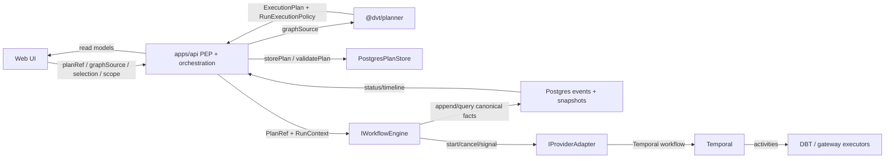
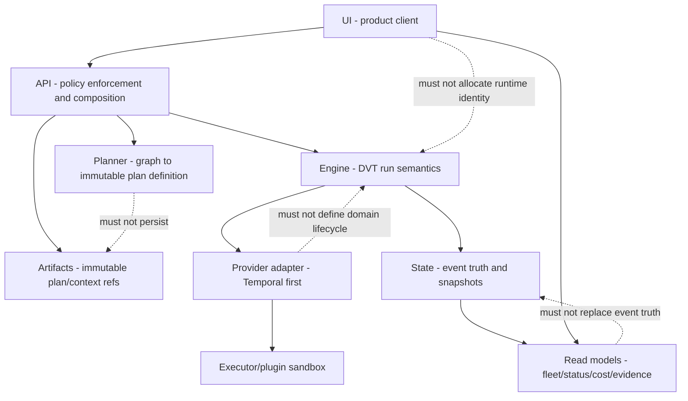
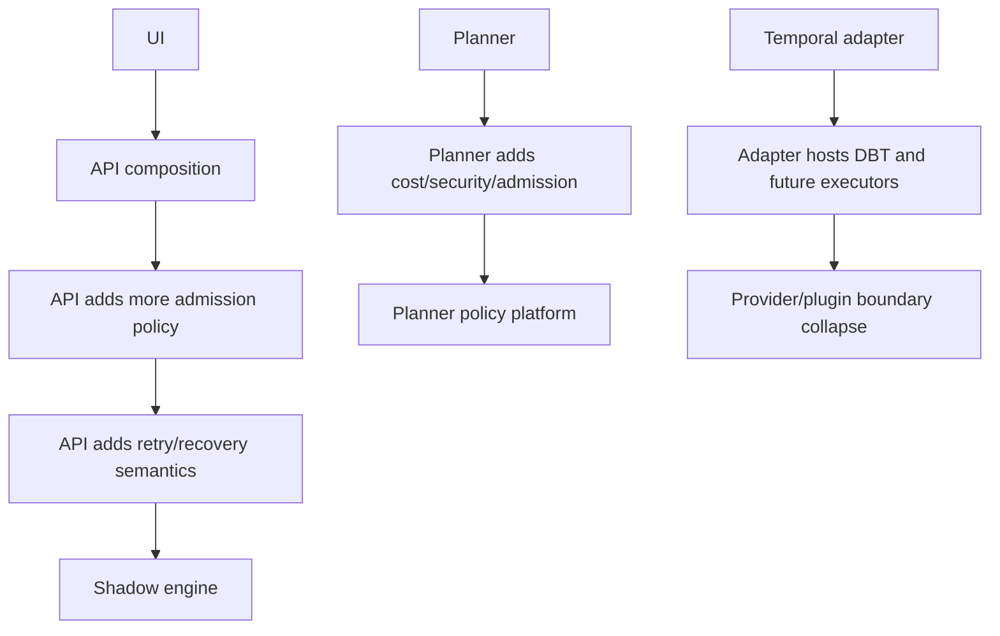
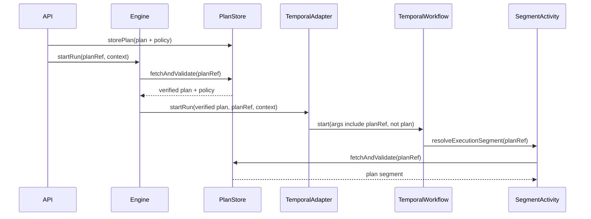
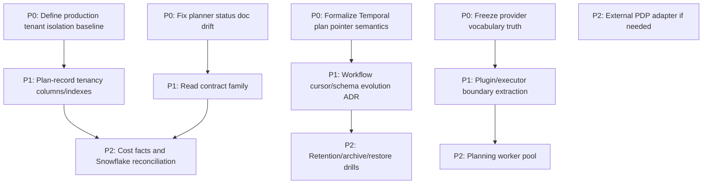

# DVT+ Hard Architecture Review 2026-04-24

**Review posture:** Principal / Staff architecture review. Source-code first.
No alternate system definition is introduced.

## Governing Sources Used

- `AGENTS.md`
- `docs/planning/status/governance-document-rule-inventory.md`
- `docs/guides/ai-work-protocol.md`
- `docs/architecture/reference-architecture.md`
- `docs/architecture/system-delivery-status.md`
- `docs/planning/status/canonical-doc-code-matrix.md`
- `docs/planning/status/planner-current-state-assessment.md`
- `docs/adr/ADR-0003-execution-model.md`
- `docs/adr/ADR-0004-event-sourcing-strategy.md`
- `docs/adr/ADR-0005-contract-formalization-tooling.md`
- `docs/adr/ADR-0012-plan-integrity-ownership.md`
- `docs/adr/ADR-0017_ExecutionPlan_Schema_Versioning.md`
- `docs/adr/ADR-0031-adapter-tenant-isolation.md`
- `docs/adr/ADR-0043-plan-record-plan-store-and-artifacts-ownership.md`
- `docs/adr/ADR-0046-execution-plan-definition-and-run-execution-policy-separation.md`
- `docs/adr/adr-0050-platform-owned-start-run-identity.md`
- `docs/adr/ADR-0051-access-decision-service-and-openfga-adapter.md`
- `docs/architecture/components/api/protected-runtime-and-plan-compile-component.md`
- `docs/architecture/components/engine/contracts/engine/IWorkflowEngine.v1.md`
- `docs/architecture/components/engine/contracts/engine/start-run-boundary.v1.md`
- `apps/api/docs/protected-security-access-decision-component.md`
- `apps/api/docs/start-run-execution-capacity-admission-component.md`
- `packages/@dvt/engine/src/ports/IWorkflowEngine.ts`
- `packages/@dvt/engine/src/core/WorkflowEngine.ts`
- `packages/@dvt/engine/src/application/StartRunApplicationService.ts`
- `packages/@dvt/engine/src/services/startRun/StartRunExecutionService.ts`
- `packages/@dvt/engine/src/security/planIntegrity.ts`
- `packages/@dvt/engine/src/adapters/IProviderAdapter.ts`
- `packages/@dvt/contracts/src/contracts/planner/ExecutionPlan.v1.ts`
- `packages/@dvt/contracts/src/contracts/planner/PlanRecord.v1.ts`
- `packages/@dvt/contracts/src/contracts/engine/StartRunBoundary.v1.ts`
- `packages/@dvt/contracts/src/types/contracts.ts`
- `packages/@dvt/contracts/src/step-registry/StepTypeRegistry.ts`
- `packages/@dvt/planner/src/application/PlannerFacade.ts`
- `packages/@dvt/planner/src/domain/Planner.ts`
- `packages/@dvt/planner/src/domain/PlanAssembler.ts`
- `packages/@dvt/plan-interpreter/src/dagAnalyzer.ts`
- `packages/@dvt/adapter-temporal/src/TemporalAdapter.ts`
- `packages/@dvt/adapter-temporal/src/workflows/RunPlanWorkflow.ts`
- `packages/@dvt/adapter-temporal/src/workflows/executionSegmentResolver.ts`
- `packages/@dvt/adapter-temporal/src/activities/activityFactory.ts`
- `packages/@dvt/adapter-temporal/src/activities/dbtStepActivity.ts`
- `packages/@dvt/adapter-postgres/src/PostgresRunStateCoordinator.ts`
- `packages/@dvt/adapter-postgres/src/PostgresRunEventStoreSql.ts`
- `packages/@dvt/adapter-postgres/src/PostgresRunSnapshotStore.ts`
- `packages/@dvt/adapter-postgres/src/PostgresPlanStore.ts`
- `packages/@dvt/adapter-postgres/src/PostgresPlanStore.sql.ts`
- `apps/api/src/application/services/PlannerBackedStartRunUseCase.ts`
- `apps/api/src/application/services/StoredPlanExecutabilityValidator.ts`
- `apps/api/src/infrastructure/auth/embeddedAccessDecisionService.ts`
- `apps/api/src/modules/protectedRuntime/buildProtectedExecutionRuntime.ts`
- `apps/api/src/modules/buildProviderAdapters.ts`
- `apps/api/src/modules/providerAdapters/createTemporalProviderAdapterFactory.ts`
- `apps/api/src/entrypoints/http/startRunRouteCommandBuilder.ts`
- `apps/web/src/app/services/runs/runsService.api.ts`
- `apps/web/src/app/views/canvas/canvasRunStartAction.ts`

## Source-Of-Truth Correction

The names `dvt_workflow_engine_artifact` and
`dvt_v2_architecture_explanation` are not live canonical files in the current
repository. Current source-of-truth material is the governed code and documents
listed above.

That naming drift is not harmless. If architecture review prompts keep using
aliases that do not exist in the active tree, new engineers will anchor on
stale mental models and miss the current contract boundaries.

## Core Principle Verdict

The principle is directionally true:

> The UI does not execute. The engine decides on its domain. The planner does
> not persist state.

It is not mechanically strong enough yet.

- The UI is currently a client of protected API ports. It sends `planRef`,
  scope, selection, and target adapter. It does not mint execution `runId`
  anymore and does not call Temporal, Postgres, dbt, or engine packages.
- The planner builds deterministic plan definition and returns sidecar
  execution policy. It does not persist state.
- The engine owns run lifecycle, plan integrity, command validation, canonical
  status reads, and adapter delegation.
- The API now owns a large control-plane slice: auth, compile, store,
  validate, duplicate probe, backpressure, execution-capacity admission, and
  delegation. That is the main erosion point.

## Current System Authority Diagram

## Target Authority Boundary

## 1. Conceptual Soundness

### What is solid

| Area                   | Assessment                                                                                                                                                                                                                    |
| ---------------------- | ----------------------------------------------------------------------------------------------------------------------------------------------------------------------------------------------------------------------------- |
| Planner / engine split | `PlannerFacade` validates `PlannerInputEnvelopeV1`, maps `graphSource`, and delegates to `Planner`. It does not persist. `PlannerBackedStartRunUseCase` owns persistence outside the planner package.                         |
| ExecutionPlan position | `ExecutionPlan` is correctly positioned as planner-owned plan definition with `RunExecutionPolicy` sidecar for runtime admission. That follows ADR-0046 and avoids putting capabilities and compatibility into plan identity. |
| Plan identity          | `PlanAssembler` computes `planId` from `JCS(planCore)`. `PlanIntegrityValidator` recomputes and rejects mismatches. That is the correct content-addressed model.                                                              |
| UI non-execution       | `canvasRunStartAction.ts` delegates to `IRunsPort`; `runsService.api.ts` sends protected HTTP payloads without `runId`. ADR-0050 is reflected in code.                                                                        |
| Engine canonical read  | `IWorkflowEngine.getRunStatus()` is a canonical read model backed by events/snapshots. Provider-live diagnostics are outside the narrow engine facade.                                                                        |
| Temporal as adapter    | Protected runtime wires Temporal through `createTemporalProviderAdapterFactory()` and `IProviderAdapter`. Temporal is configured in composition, not embedded in `buildProviderAdapters.ts`.                                  |
| State as truth         | Postgres run-state write path appends events, updates snapshots, enqueues outbox rows, and validates transitions inside transaction boundaries.                                                                               |
| RBAC boundary          | `IAccessDecisionService` is a DVT-owned access-decision port. The embedded backend is behind the port, not smeared through routes.                                                                                            |

### What is fragile

| Area                                | Weakness                                                                                                                                                                                                                                                                                                                                                                                              |
| ----------------------------------- | ----------------------------------------------------------------------------------------------------------------------------------------------------------------------------------------------------------------------------------------------------------------------------------------------------------------------------------------------------------------------------------------------------- |
| API control-plane breadth           | API compiles, stores, validates, authorizes, probes duplicates, applies delivery backpressure, applies execution-capacity admission, and delegates start-run. This is a valid composition root today, but it can become a shadow engine if policies keep accreting there.                                                                                                                             |
| ADR-0012 vs Temporal implementation | `PlanIntegrityValidator` and ADR-0012 claim adapters execute the exact verified plan instance. `TemporalAdapter.startRun()` accepts `_plan` but does not use it; the Temporal workflow resolves execution segments later through `PlanRef` and a plan fetch/validate activity. If this is intentional, the contract must say "verified immutable pointer plus revalidation", not "exact plan object". |
| Multi-engine portability            | The provider union contains `temporal` and `conductor`, `EngineRunRef` includes Conductor, and `StepTypeRegistry` defaults built-ins to all providers. Runtime production truth is Temporal-only. This is portability theater until Conductor has adapter conformance tests.                                                                                                                          |
| Retry policy portability            | `ExecutionStepRetryPolicyV1` stores Temporal-compatible duration strings. That may be pragmatic, but it is not engine-neutral.                                                                                                                                                                                                                                                                        |
| Step execution profiles             | `StepTypeRegistry` defaults built-in profiles to all providers and no capabilities unless profiles override them. That can overstate adapter support and weaken capability gates.                                                                                                                                                                                                                     |
| Plan records and tenant indexing    | `PlanRecord` has no top-level `tenantId`, `projectId`, or `environmentId`. Ownership can exist inside canonical JSON, but that is weak for indexed isolation, list queries, and operational controls.                                                                                                                                                                                                 |
| Database RLS posture                | ADR-0031 has tenant context plumbing, and queries include tenant predicates. There is no active code evidence of PostgreSQL `CREATE POLICY` or `ENABLE ROW LEVEL SECURITY`. RLS is not a real secondary enforcement layer yet.                                                                                                                                                                        |
| Plugin/runtime isolation            | DBT execution remains inside the Temporal adapter package default surface through `DbtStepActivity` and DBT runner seams. It is composition-bound, but package-level separation is still incomplete.                                                                                                                                                                                                  |
| Documentation drift                 | `planner-current-state-assessment.md` says unknown step kinds fail open. Current `StepTypeRegistry.validate()` and `step-registry-integration.test.ts` reject unknown kinds. This is a direct governance/code conflict.                                                                                                                                                                               |

### What is missing

| Missing element                   | Why it matters                                                                                                                                                           |
| --------------------------------- | ------------------------------------------------------------------------------------------------------------------------------------------------------------------------ |
| Distributed consistency model     | Start-run crosses API, plan store, intent store, engine, provider, event store, snapshot, and outbox. The caller-visible guarantee after acceptance is not tight enough. |
| Contract evolution playbook       | Version fields exist, but in-flight workflows, rollback, cursor evolution, dual-support windows, and schema migration are not fully operationalized.                     |
| Read contract family              | Single-run status is governed. Fleet views, status heads, cost facts, evidence reads, and retention-aware timelines need their own contracts.                            |
| Plan-record tenancy model         | Plan records need top-level tenant/project/environment indexes or a formally accepted alternative. JSON ownership is not enough for a 1000-tenant control plane.         |
| Plugin sandbox                    | Signed bundles, resource caps, file/network egress rules, and tenant-scoped artifact access are prerequisites for a plugin SaaS system.                                  |
| Cost fact model                   | Cost-aware architecture is not implemented until runtime cost facts, Snowflake query-history reconciliation, tenant attribution, and retention rules exist.              |
| Backpressure/concurrency contract | Admission exists, but global concurrency, tenant concurrency, worker pool pressure, and Temporal schedule pressure are not a single governed contract.                   |

## 2. Architectural Risk Map

| Risk                         | Severity | Likelihood | Why                                                                                                                                                                                   | Mitigation                                                                                                                                       |
| ---------------------------- | -------- | ---------- | ------------------------------------------------------------------------------------------------------------------------------------------------------------------------------------- | ------------------------------------------------------------------------------------------------------------------------------------------------ |
| State explosion              | High     | High       | A large dbt graph creates run events, outbox records, snapshots, snapshot queue rows, lineage, plan records, and future cost facts. Growth is multiplicative by tenant and run count. | Partition events/outbox by time and tenant, define default retention, materialize fleet/status heads, and budget max events per run.             |
| Event duplication            | High     | Medium     | Temporal retries, activity retries, idempotent event append, outbox replay, projector repair, and terminal cancellation can all re-touch the same facts.                              | Maintain a producer-to-idempotency matrix and add duplicate/replay property tests for every event producer.                                      |
| Idempotency breakdown        | High     | Medium     | New plugins or adapters can emit facts without the existing key formula or misuse `logicalAttemptId` and `stepId`.                                                                    | Forbid raw event construction outside registered factories and enforce semantic architecture tests around event producers.                       |
| Planner responsibility creep | Medium   | High       | Planner already emits retry policy and required capabilities. Cost, admission, security, and runtime scheduling could be pushed into plan build.                                      | Freeze planner as graph normalization, selection, topology, plan definition, and policy sidecar emission only.                                   |
| Engine responsibility creep  | Medium   | Medium     | Engine is already near authorization policy, plan integrity, run context binding, provider selection, intent recovery, and compensation.                                              | Keep policy objects narrow, split admission concerns, and prevent `IWorkflowEngine` from gaining health, enrichment, fleet, or admin operations. |
| API shadow engine            | High     | High       | API owns compile/store/validate/admit/delegate. That is control-plane orchestration and can silently become runtime semantics.                                                        | Treat API as PEP/composition. Add architecture tests forbidding lifecycle, retry, and provider-state semantics in route/use-case code.           |
| Plugin security risks        | Critical | High       | DBT project bundles and plugin contexts can lead to shell/file/network execution paths. A SaaS plugin model without sandboxing is not safe.                                           | Add signed bundle verification, extraction jail, command allowlist, resource caps, network egress policy, and tenant-scoped artifact reads.      |
| Multi-tenant isolation flaws | Critical | Medium     | API authz is real, but DB RLS is not evidenced. Plan records lack top-level tenancy columns. One missing tenant predicate can leak.                                                   | Add RLS policies or an accepted alternative, top-level plan tenancy keys, and continuous cross-tenant integration tests.                         |
| Cost attribution complexity  | Medium   | High       | Snowflake cost attribution needs query-history reconciliation and warehouse/session tags, not planner guesses.                                                                        | Build post-run cost facts first; delay estimator/dashboard depth until facts exist.                                                              |
| Operational complexity       | High     | High       | Temporal, Postgres state, plan store, outbox, projector, worker readiness, archive, purge, auth, and plugin runners are all live subsystems.                                          | Publish dependency graph, SLOs, readiness gates, queue thresholds, restore drills, and runbooks before production tenants.                       |
| Temporal-first lock-in       | Medium   | High       | Retry policy strings, continue-as-new behavior, payload budgeting, and workflow cursor logic are Temporal-shaped.                                                                     | Be honest: Temporal-first production baseline. Delay Conductor until conformance is real.                                                        |
| Plan integrity drift         | High     | Medium     | Engine verifies plan bytes, but Temporal workflow later fetches by `PlanRef`. If immutable storage or hash verification regresses, runtime may execute a different object.            | Either pass verified plan segments into workflow or formalize pointer revalidation as the contract and test it end to end.                       |
| Documentation/code drift     | Medium   | High       | Active docs already disagree with current step-kind behavior.                                                                                                                         | Add drift checks for high-value status claims and fix the planner current-state doc immediately.                                                 |

## 3. Engine Abstraction Critique

### IWorkflowEngine

`IWorkflowEngine` is minimal enough:

- `startRun(planRef, context)`
- `recoverRun(sourceRunId, planRef, context)`
- `cancelRun(engineRunRef)`
- `getRunStatus(engineRunRef)`
- `signal(engineRunRef, request)`

The important cut is that enrichment and health are not on the facade. That is
right. Mature workflow control planes keep command lifecycle, provider
diagnostics, health, fleet reads, and admin operations on separate ports.

The weakness is not method count. The weakness is semantic leakage around
`PlanRef` and adapter execution. The contract narrative says the adapter
executes a verified plan object. The Temporal production path starts a workflow
with a pointer and later resolves execution segments from that pointer in
activities. That may be the correct implementation for payload limits, but the
contract has to match reality.

### Temporal-first strategy

Temporal-first is wise as a production constraint and weak as a portability
claim.

What is wise:

- Temporal is mature for durable workflow orchestration.
- Determinism constraints are explicit in workflow code.
- Side effects are behind activities.
- Continue-as-new and worker readiness are handled as real operational facts.

What is not wise:

- Keeping Conductor in shared provider vocabulary without a real adapter path.
- Encoding Temporal-compatible retry durations in a canonical plan while
  still implying engine neutrality.
- Letting the Temporal adapter package keep DBT default seams as if plugin
  execution were just an adapter detail.

The correct posture is: Temporal is the only production engine. The abstraction
exists to keep DVT semantics sovereign, not to claim cheap provider switching.

### Event model robustness

The event model is stronger than average because it has:

- append-only run events;
- monotonic `runSeq`;
- idempotency by `(runId, idempotencyKey)`;
- snapshot derivation from events;
- snapshot catch-up when persisted snapshots lag;
- outbox enqueue in transactional write paths.

The weak point is scale and producer discipline. Every new activity, plugin,
or maintenance job can become an event producer. Without one enforced append
gateway and producer matrix, idempotency will erode.

### ExecutionPlan expressiveness

`ExecutionPlan` is expressive enough for current DBT/gateway execution:

- graph steps;
- `dependsOn`;
- step kind;
- step config;
- gateway fields;
- per-step retry policy;
- ownership metadata;
- observability metadata.

It is under-specified for:

- schema rollout across in-flight Temporal workflows;
- plan cursor compatibility across continue-as-new;
- generic artifact references beyond DBT built-ins;
- plugin capability requirements as mandatory profile data;
- cost facts and run-materialization evidence contracts.

### Determinism failure points

| Failure point          | Why it can fail                                                                                                                |
| ---------------------- | ------------------------------------------------------------------------------------------------------------------------------ |
| Full plan bytes        | `createdAtIso` is volatile. Determinism applies to `planCore`, not the full plan object.                                       |
| Workflow segment fetch | Workflow execution re-fetches by `PlanRef`; correctness depends on immutable storage plus hash validation.                     |
| Plugin activities      | DBT CLI execution is external side effect. Determinism only holds if the workflow records facts and activities are idempotent. |
| Retry/cursor evolution | Continue-as-new state and retry attempts need explicit versioning to survive rollout.                                          |
| Provider diagnostics   | Provider status is diagnostic, not canonical. Mixing it into status reads would break deterministic truth.                     |

## 4. Execution Planning Layer Analysis

### DAG analyzer based on dbt artifacts

The current canonical planner ingress is not raw dbt manifest. It is
`GenericGraphSourceV1`. DBT artifacts are an upstream canonical graph source
for DBT projects, but source-native adaptation happens before planner
admission. That is the right direction.

The mature pattern is the same as Dagster/Airflow/dbt Cloud control planes:
normalize source-specific graphs into an internal execution graph, then keep
execution planning independent of the source artifact format. DVT+ is moving
toward that pattern.

### Partial execution guarantees

Selection and executable-subgraph derivation exist, but the guarantee is not
fully contractual enough:

- selected closure must be deterministic;
- upstream/downstream behavior must be frozen;
- partial execution must define skipped, blocked, and materialized states;
- plan identity must include the selected semantic graph;
- UI preview and start-run must use the same closure rules.

The code is better than the contract surface here. The next risk is not
algorithmic. It is semantic ambiguity.

### Retry/backoff policy ownership

Planner currently materializes per-step retry policy into `ExecutionPlan`.
That is acceptable only if the policy is treated as plan-time execution policy,
not adapter-native scheduling semantics.

The smell is the Temporal-compatible string shape. If the system ever adds
another engine, a duration-string retry profile will either become a translation
burden or a false neutral contract. The mitigation is not to abstract it now.
The mitigation is to mark it as Temporal-first v1 and require adapter
conformance before widening.

### Cost estimator realism

Cost estimation is underbuilt. A serious Snowflake cost model needs:

- query tags bound to tenant, run, plan, step, and environment;
- warehouse/query-history reconciliation;
- post-run cost facts;
- cost-fact retention and aggregation;
- late-arriving cost reconciliation;
- corrections and auditability.

Planner-side pre-run cost hints are not durable cost accounting. Mature data
platforms separate estimated cost from metered cost. DVT+ should do the same.

### Plan versioning strategy

The repository has version fields and ADR-0017. The missing part is runtime
operation:

- in-flight workflow schema compatibility;
- Temporal cursor versioning;
- rollout windows;
- rollback behavior;
- dual planner/adapter support;
- contract migration tests.

Version strings are not a migration strategy.

### Is this layer over-engineered?

Parts are overbuilt:

- multi-engine vocabulary before multi-engine implementation;
- wide governance around future portability;
- cost-aware language before cost facts exist.

Parts are under-specified:

- partial execution semantics;
- plan/cursor version migration;
- plugin capability profiles;
- cost fact model.

### Snowflake coupling

Snowflake is not embedded in core planner code today. The risk is future cost
and DBT materialization work. Keep Snowflake in executor/cost-fact adapters,
not in planner identity or engine lifecycle.

## 5. State & Metadata Layer Review

### Artifact immutability

Artifact immutability is realistic if enforced mechanically:

- immutable `PlanRef` URIs;
- SHA-256 validation;
- no mutable `latest` path;
- persisted canonical JSON;
- plan store rejection if validation state is not valid.

The implementation has good pieces. The weak point is plan-record tenancy and
the Temporal pointer re-fetch contract. If runtime fetches by pointer, then
immutability is not optional. It is the core safety boundary.

### Write amplification risk

Write amplification is real and already visible:

- run metadata;
- run events;
- event heads;
- snapshots;
- snapshot work queue;
- outbox;
- start-run intent records;
- plan records;
- executability records;
- admission links;
- future cost facts and lineage.

At 1000 tenants, this is a data platform problem. It needs partitions,
retention, compaction, read heads, and archive/restore drills. More indexes
will not be enough.

### Event sourcing vs mutable state

The event-sourced run lifecycle is the right choice for deterministic execution
and audit.

The tradeoff is operational cost:

- every read model can drift;
- projector lag must be observable;
- snapshots must be rebuildable;
- event schema evolution must be governed;
- retention and archive are first-class production features, not cleanup.

Mutable state would be simpler but less safe for replay, audit, and provider
failure recovery. Keep event sourcing, but stop treating read-model contracts
as secondary.

## 7. What Is Overbuilt?

| Area                     | Direct assessment                                                                                                                                                          |
| ------------------------ | -------------------------------------------------------------------------------------------------------------------------------------------------------------------------- |
| Multi-engine abstraction | Overbuilt. The codebase names Conductor in shared contracts, but production runtime is Temporal-only. Keep the port. Stop advertising portability as a delivered property. |
| Cost attribution depth   | Overbuilt in narrative, underbuilt in code. Do not build dashboards before cost facts and Snowflake reconciliation exist.                                                  |
| Observability layering   | Partly overbuilt. Many ports and metrics exist, but production validation is still partial. Consolidate around actionable SLOs.                                            |
| Planner governance       | Some governance is necessary. The overbuilt part is treating future execution models as current truth.                                                                     |
| API component docs       | The component maps are useful, but they can become substitute architecture if not backed by semantic tests and code ownership guards.                                      |

## 8. What Is Underbuilt?

| Area                    | Missing work                                                                                                                        |
| ----------------------- | ----------------------------------------------------------------------------------------------------------------------------------- |
| Migration strategy      | In-flight plan/workflow/schema migration and rollback rules are not operationally complete.                                         |
| Contract evolution      | Version fields exist, but evolution workflow needs conformance tests, dual support, and compatibility windows.                      |
| Rollback guarantees     | Rollback from planner v1.3 to adapter v1.2 or worker vN to vN-1 is not fully governed.                                              |
| Distributed consistency | The exact post-acceptance guarantee across intent, provider, state, snapshot, and outbox is not contractual enough.                 |
| Concurrency model       | Tenant concurrency, worker concurrency, provider concurrency, and planner concurrency are separate concepts without one policy map. |
| Backpressure strategy   | Admission exists, but queue-depth thresholds, tenant fairness, global saturation, and worker readiness need a stable contract.      |
| Run retention policy    | Archive/purge primitives exist; default tenant/environment retention and restore drills are not mature enough.                      |
| SLA definitions         | No clear SLO/SLA family for plan preview, start-run acceptance, status freshness, worker readiness, and cost fact freshness.        |
| Security isolation      | Authorization is improved. DB RLS, plugin sandbox, signed artifacts, and tenant-scoped object access remain underbuilt.             |
| Read models             | Fleet/status/cost/evidence read contracts are underbuilt relative to command contracts.                                             |

## 9. Scalability Outlook (3-Year Horizon)

Assumptions:

- 1000+ tenants;
- thousands of concurrent runs;
- dbt projects with 1000+ nodes;
- cross-environment diffs;
- heavy cost dashboards.

### Bottlenecks

| Bottleneck           | Expected pressure                                                                                                |
| -------------------- | ---------------------------------------------------------------------------------------------------------------- |
| Postgres state store | Hot writes from events, outbox, snapshots, intent records, and plan records. Partitioning becomes mandatory.     |
| API planning path    | Synchronous planning in request flow will become CPU/latency pressure under heavy preview/start-run usage.       |
| Temporal workers     | DBT execution is resource-heavy; worker queue readiness is necessary but not sufficient for tenant fairness.     |
| Snapshot reads       | Tail-event catch-up protects correctness but can push projection work onto read requests.                        |
| Plan store           | Lack of top-level tenancy keys will hurt scoped queries, cleanup, and audit at scale.                            |
| Cost dashboards      | Without cost fact aggregation, dashboards will force expensive joins across event, plan, and warehouse metadata. |

### Single points of failure

| Component             | Failure mode                                                                                |
| --------------------- | ------------------------------------------------------------------------------------------- |
| Postgres primary      | Run truth, plan store, outbox, snapshot, intent, and access grant storage concentrate here. |
| Temporal cluster      | Only production orchestration provider.                                                     |
| Temporal worker image | DBT/plugin runtime depends on correct packaging and readyz posture.                         |
| API composition root  | Auth, planning, admission, plan storage, and engine delegation converge in one application. |
| Artifact storage      | Plan/context integrity depends on artifact availability and immutability.                   |

### Data growth pressure

At 1000 tenants, event volume is not the only issue. Derived rows and read
models are the issue:

- event log grows by executed step facts;
- outbox grows by every publishable fact;
- snapshots and work queues churn;
- plan records and executable blobs accumulate;
- cost facts will multiply per query/warehouse/session;
- audit decisions multiply per protected API operation.

The target must include:

- partitioned run event and outbox tables;
- status-head read models;
- cost fact aggregates;
- terminal run archival;
- restore proof;
- tenant/environment retention tiers.

### Planner computation load

The graph algorithms are acceptable for 1000-node projects. The system risk is
placement and concurrency. Heavy preview and compile should move to a planning
worker pool or dedicated planning service once enterprise-scale concurrent
usage arrives.

## 10. Architectural Scorecard

| Dimension                 | Score | Justification                                                                                                                                                                              |
| ------------------------- | ----- | ------------------------------------------------------------------------------------------------------------------------------------------------------------------------------------------ |
| Conceptual clarity        | 7/10  | The core split is understandable and mostly real. Score is reduced by missing canonical aliases, provider truth drift, and active doc/code disagreement.                                   |
| Separation of concerns    | 7/10  | Planner is clean; engine facade is narrow; state truth is strong. API breadth, plan fetch semantics in Temporal, and DBT-in-adapter defaults prevent a higher score.                       |
| Replaceability of engine  | 5/10  | Ports exist and help. Real production posture is Temporal-only, retry policy is Temporal-shaped, and Conductor vocabulary is not backed by a real adapter.                                 |
| Determinism               | 7/10  | Plan core identity and workflow determinism are solid. Volatile full-plan metadata, plugin side effects, and pointer re-fetch semantics reduce confidence.                                 |
| Extensibility             | 6/10  | Graph source and step registry are good seams. Default all-provider profiles, unknown config blobs, and weak plugin isolation reduce durability.                                           |
| Operational realism       | 6/10  | Intent log, outbox, snapshots, archive primitives, readiness, and fail-closed admission exist. RLS, retention defaults, restore drills, cost facts, and concurrency policy are underbuilt. |
| Long-term maintainability | 6/10  | Governance and modularization are strong. Maintainability is threatened by duplicated truth, wide API orchestration, over-advertised portability, and stale status docs.                   |

### SOLID / Hexagonal / OOP / CQRS Verdict

| Pattern   | Verdict                                                                                                                                                                                   |
| --------- | ----------------------------------------------------------------------------------------------------------------------------------------------------------------------------------------- |
| SOLID     | Partial. Small collaborators are improving. API start-run orchestration and adapter plugin defaults still have too many reasons to change.                                                |
| Hexagonal | Mostly achieved. Runtime dependencies go through ports. The weak points are shared provider vocabulary, plan pointer semantics, and DBT defaults inside Temporal adapter package surface. |
| OOP       | Service-object OOP is appropriate here. Do not force rich aggregates where event facts, policies, and ports are clearer.                                                                  |
| CQRS      | Write side is stronger than read side. Event sourcing and planner command flow are disciplined; fleet/status/cost/evidence read contracts lag.                                            |

## 11. Strategic Recommendations

### 3 structural changes

1. **Formalize Temporal plan execution semantics.** Either pass the verified
   plan/segments into the workflow, or update ADR/docs to say Temporal executes
   a verified immutable `PlanRef` with activity-time revalidation. Then add an
   integration test that proves the workflow cannot execute mutated plan bytes.
2. **Add top-level tenancy to plan records.** Add tenant/project/environment
   columns or an accepted indexed alternative. JSON ownership is not enough
   for multi-tenant operational control.
3. **Separate plugin execution from adapter defaults.** Keep Temporal as the
   workflow provider, but move DBT runner defaults behind composition-owned
   executor/plugin binding.

### 3 clarifications needed

1. **Consistency promise after `startRun` acceptance.** Define what must be
   visible in metadata, events, snapshots, outbox, and provider state after
   each accepted branch.
2. **Planner scope.** Freeze whether planner owns only graph-to-plan
   definition, or whether execution policy generation remains part of planner
   output permanently.
3. **Production isolation baseline.** State whether database RLS is mandatory
   for production or whether tenant predicates plus transaction context are
   the accepted defense-in-depth model.

### 3 things to freeze immediately

1. **Freeze the narrow `IWorkflowEngine` facade.** Do not add health,
   enrichment, fleet reads, cost reads, or admin maintenance to it.
2. **Freeze `graphSource` as planner ingress.** Do not reintroduce raw dbt
   manifest or legacy source branches into runtime route contracts.
3. **Freeze Temporal-only production truth.** Keep `temporal` as the only
   start-run target until a second adapter has conformance tests.

### 3 things to delay

1. **Delay Conductor.** A second engine now would multiply unresolved
   contract, cursor, and plugin questions.
2. **Delay advanced cost dashboards.** Build cost facts and Snowflake
   reconciliation first.
3. **Delay third-party plugin marketplace work.** Signed bundles, sandboxing,
   resource caps, and tenant-scoped artifact access are prerequisites.

## Anti-Patterns Detected

| Anti-pattern                            | Evidence                                                                                            | Correction                                                                                                   |
| --------------------------------------- | --------------------------------------------------------------------------------------------------- | ------------------------------------------------------------------------------------------------------------ |
| Paper portability                       | Conductor is present in shared provider types without production adapter truth.                     | Keep provider vocabulary aligned with implemented support or mark non-production values as test/future-only. |
| Shadow engine in API                    | API use cases compose compile, store, validate, admit, and delegate.                                | Add semantic architecture tests forbidding lifecycle/retry/provider semantics in API.                        |
| Contract says object, code uses pointer | ADR-0012 and `planIntegrity.ts` say exact plan instance; Temporal workflow resolves by `PlanRef`.   | Align contract and implementation.                                                                           |
| JSON ownership as isolation             | Plan ownership can live inside canonical plan JSON while record tables lack top-level tenancy keys. | Promote tenant/project/environment keys to queryable storage posture.                                        |
| Adapter as plugin host                  | `@dvt/adapter-temporal` still has DBT activity and runner seams in default package surface.         | Extract executor/plugin defaults behind composition.                                                         |
| Active doc contradicts tests            | Planner current-state doc says unknown kinds fail open; tests reject them.                          | Fix the status doc and add drift guard.                                                                      |

## Actionable Diagrams

### Erosion Path To Prevent

### Contract Tension Around Plan Execution

If this is the intended design, the canonical contract is pointer
revalidation, not exact object execution.

### P0/P1/P2 Dependency Map

## Action Plan To Scope Tasks

| Priority | Task                                 | Scope                                                                                                               | Acceptance criteria                                                                                         |
| -------- | ------------------------------------ | ------------------------------------------------------------------------------------------------------------------- | ----------------------------------------------------------------------------------------------------------- |
| P0       | Planner status truth-sync            | Update `docs/planning/status/planner-current-state-assessment.md` to match current unknown-step rejection behavior. | Status doc, `StepTypeRegistry.validate()`, and `step-registry-integration.test.ts` agree.                   |
| P0       | Temporal plan execution contract     | Resolve ADR-0012 wording vs Temporal pointer re-fetch implementation.                                               | Contract docs state exact execution mechanism; integration test proves mutated stored bytes cannot execute. |
| P0       | Production tenant isolation baseline | Decide RLS vs explicit-predicate-only defense-in-depth for Postgres.                                                | Security docs, adapter tests, and migration posture agree.                                                  |
| P0       | Provider vocabulary hard-cut         | Align start-run/runtime provider vocabulary with implemented Temporal-only truth.                                   | No production path advertises Conductor without conformance coverage.                                       |
| P1       | Plan-record tenancy model            | Add top-level tenant/project/environment keys or accepted indexed alternative.                                      | Tenant-scoped plan queries and cleanup do not parse canonical JSON.                                         |
| P1       | Read contract family                 | Define fleet list, status head, timeline, result evidence, and cost read contracts.                                 | UI does not assemble read truth from ad hoc low-level calls.                                                |
| P1       | Plugin/executor boundary             | Extract DBT runner defaults behind composition-owned plugin/executor binding.                                       | Temporal adapter package can run without DBT as default public runtime surface.                             |
| P1       | Workflow cursor compatibility        | Govern continue-as-new cursor/input schema and worker rollout.                                                      | Cursor version contract and replay/migration tests exist.                                                   |
| P2       | Cost facts                           | Emit post-run cost facts and reconcile Snowflake query history by tenant/run/step.                                  | Cost dashboards consume facts, not planner estimates or raw events.                                         |
| P2       | Retention and restore                | Make retention defaults production posture and prove restore.                                                       | Scheduled archive/purge plus restore drill evidence.                                                        |
| P2       | Planning scale path                  | Move heavy planning to worker pool or service when compile pressure grows.                                          | Backpressured planning queue with latency SLO and tenant fairness.                                          |
| P2       | External PDP adapter                 | Add OpenFGA or equivalent only behind `IAccessDecisionService` if embedded authz stops being enough.                | Embedded and external PDP satisfy the same conformance suite.                                               |

## Final Architectural Verdict

DVT+ has a coherent architecture with real boundaries. The core model is not
fiction.

The weak parts are also real:

- Temporal-first is production truth; multi-engine is not.
- State as source of truth is conceptually correct and operationally expensive.
- API is the main erosion point because it owns too much orchestration.
- The Temporal plan execution path contradicts the current exact-plan-object
  language unless the contract is updated.
- Tenant isolation is not production-grade until storage posture and RLS or its
  accepted alternative are closed.
- Cost-aware architecture is still mostly future architecture.
- Plugin SaaS posture is unsafe without sandboxing and signed artifact policy.

The next work should be truth correction and hardening, not more abstraction.

## Branch Remediation Note

The first P0 remediation selected from this review is the Temporal plan
execution contract. The target contract is no longer "adapter executes the
exact in-memory plan object"; the target is:

- engine pre-dispatch fetches and validates executable plan bytes;
- engine dispatches only the approved immutable `PlanRef` plus resolved run
  context;
- Temporal resolves bounded execution segments by `PlanRef`;
- every runtime fetch must revalidate `PlanRef.sha256` before execution.

The source review intentionally keeps the original finding above so the
architecture risk remains auditable.
