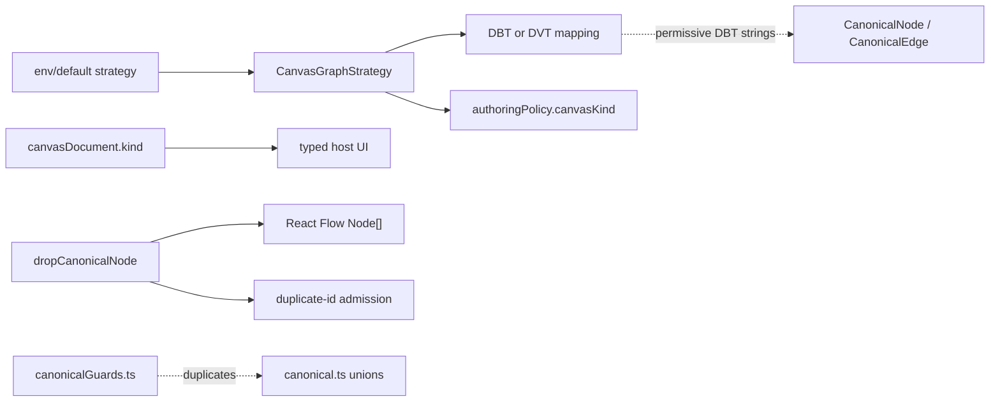
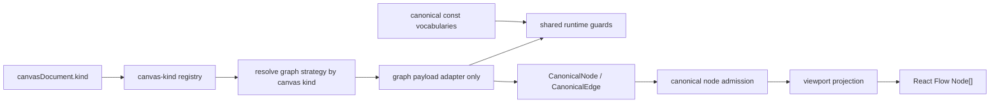
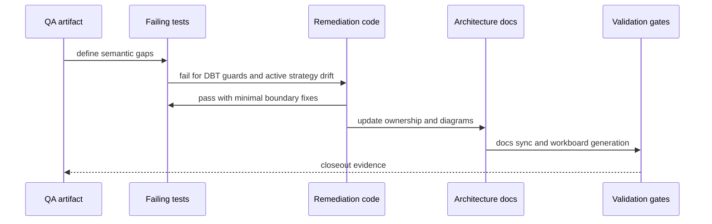

# Canvas Graph Strategy Fowler Hard QA Review

## Purpose

Record the hard QA performed on the Canvas graph-strategy policy fix and turn
the findings into a remediation plan that can be executed without re-litigating
the architectural baseline.

The reviewed slice improves the active branch by removing the false
authoring-time topology policy from node drop and duplicate flows. The remaining
issue is that several ownership seams still do not match the typed
multi-canvas host model now present in the route.

### Markdown Artifact Path Suggestion

- `docs/planning/reviews/architecture-and-governance/20260425-canvas-graph-strategy-fowler-hard-qa-review.md`

## Governing Sources

- [Governance Document And Rule Inventory](../../status/governance-document-rule-inventory.md)
- [AI Work Protocol](../../../guides/ai-work-protocol.md)
- [Review Naming Policy](../review-naming-policy.md)
- [QA Artifact Example Template](../../templates/qa/TEMPLATE_QA_ARTIFACT_EXAMPLE.md)
- [Graph Frontend Architecture](../../../architecture/components/web/graph/graph-frontend-architecture.md)
- [Canvas Inspector Authoring Component](../../../architecture/components/web/graph/canvas-inspector-authoring-component.md)
- [Canvas Playground Host Component](../../../architecture/components/web/graph/canvas-playground-host-component.md)
- [Canvas Controller Current To Target Architecture](../../../architecture/components/web/graph/canvas-controller-current-to-target-architecture.md)
- [TF-E2 Project Playground And Multi-Canvas Host Plan](../../proposals/mandatory/frontend-and-ux/tf-e2-project-playground-and-multi-canvas-host-plan-20260423.md)
- [Agent Lane E](../../state/agent-lane-e.yaml)

## Summary

The branch removes a real smell: `enforceTransformationTopology` was a false
policy surface because Canvas authoring must allow incomplete and larger graphs
while plan/run readiness validates the selected executable subgraph.

The branch is still not architecturally clean. The main remaining risks are:

- DBT graph mapping still accepts invalid domain vocabulary at a plugin
  boundary.
- active graph strategy still comes from a global environment default instead
  of the active canvas document.
- `CanvasGraphStrategy` still carries route posture data.
- node drop is documented as canonical admission but still returns React Flow
  nodes and consumes viewport options.
- canonical runtime guards duplicate type vocabulary instead of sharing one
  source of truth.
- architecture tests still lean too heavily on string absence rather than
  semantic behavior.

## Findings

### High

- Title: DBT adapter still accepts invalid domain vocabulary.
  Why it matters: The branch hardens the DVT transformation strategy but leaves
  the DBT adapter accepting `type` and `edge.type` as arbitrary strings before
  indexing closed maps. That can project `undefined` into canonical node kind,
  role, or edge relation.
  Evidence: `apps/web/src/app/plugins/dbt/dbtNodeAdapter.ts` validates DBT
  node and edge types with `typeof candidate.type === 'string'`, while
  `mapDbtNodeToCanonical` and `mapDbtEdgeToCanonical` index closed lookup
  tables.
  Risk: malformed DBT drag payloads or graph snapshots can enter Canvas
  semantic state as invalid canonical graph primitives.
  Recommendation: add closed DBT runtime guards for node type, edge type, and
  status; add negative tests for DBT `mapNodeToCanonical`, `mapEdgeToCanonical`,
  and `parseDropPayload`.

- Title: active strategy is still global instead of canvas-document-owned.
  Why it matters: The typed host now allows `dbt` and `transformation` canvases,
  but `useCanvasControllerEnvironment` resolves one graph strategy from env or
  default once. Mature multi-document workbenches resolve adapter behavior from
  the active document, not from a global shell default.
  Evidence: `apps/web/src/app/views/canvas/useCanvasControllerEnvironment.ts`
  resolves `resolveCanvasGraphStrategy()` without active canvas input, while
  `canvasHostCycleState.ts` derives UI posture from `canvasDocument.kind`.
  Risk: a restored `dbt` canvas can render typed DBT empty-state UX while drag
  parsing and toolbar posture still use the transformation strategy.
  Recommendation: resolve graph strategy from `canvasDocument.kind`, using the
  default only before a canvas document exists.

### Medium

- Title: strategy contract still mixes adapter behavior and route posture.
  Why it matters: `CanvasGraphStrategy` maps and parses plugin graph payloads,
  but it also owns `authoringPolicy.canvasKind`. That is not policy anymore;
  it is canvas-kind metadata already owned by plugin contributions.
  Evidence: `apps/web/src/app/plugins/graphStrategyContracts.ts` defines both
  mapping functions and `CanvasGraphAuthoringPolicy`.
  Risk: future plugins will add route display or lifecycle data to the strategy
  because the seam still invites it.
  Recommendation: move canvas-kind metadata to the plugin contribution or a
  dedicated canvas-kind registry and leave `CanvasGraphStrategy` as a graph
  adapter only.

- Title: drop aggregate is not a pure canonical aggregate.
  Why it matters: The docs describe node drop as canonical admission, but
  `dropCanonicalNode` imports React Flow `Node` and consumes
  `columnLevelLineageEnabled`. That couples semantic admission to viewport
  projection.
  Evidence: `apps/web/src/app/views/canvas/canvasNodeDropAggregate.ts` returns
  `Node[]` and calls `mapDroppedCanonicalNodeToCanvasNode`.
  Risk: future domain or topology rules can re-enter the viewport projection
  path because the name says aggregate while the code is a presenter helper.
  Recommendation: split canonical admission from viewport projection.

- Title: canonical guards duplicate canonical vocabulary.
  Why it matters: `canonical.ts` defines union types and `canonicalGuards.ts`
  repeats the string values manually. That creates type/runtime drift risk.
  Evidence: `apps/web/src/app/types/canonical.ts` and
  `apps/web/src/app/types/canonicalGuards.ts` contain separate role, status,
  and relation vocabularies.
  Risk: one future value can be added to the type but rejected at runtime, or
  accepted at runtime but absent from the type.
  Recommendation: export const vocabularies from `canonical.ts` and derive
  union types plus guards from those values.

- Title: architecture tests guard thinness more than behavior.
  Why it matters: The current architecture test catches string-level coupling
  such as missing imports or flags, but it does not prove the semantic invariant
  that active canvas kind, strategy, catalog, drop parsing, and toolbar posture
  move together.
  Evidence: `canvasDraftAuthoringComponent.architecture.test.ts` uses
  `toContain` and `not.toContain` checks for implementation text.
  Risk: the next refactor can pass the architecture test while reintroducing
  a behavior-level seam drift.
  Recommendation: add semantic architecture tests for strategy resolution,
  DBT invalid payload rejection, and drop/admission ownership.

### Low

- Title: current Lane E evidence refs point to replacement paths without a
  dedicated remediation owner.
  Why it matters: The branch updates evidence references away from the removed
  transformation authoring guard, but the newly discovered follow-up is not yet
  represented as its own task unless this review creates one.
  Evidence: `docs/planning/state/agent-lane-e.yaml` references the changed
  graph-strategy and drop files under TF-E2 work.
  Risk: the finding can disappear into PR discussion and be rediscovered during
  the next QA.
  Recommendation: track remediation as `TF-E2-L` under Lane E.

## Alignment

- Doc vs code: partially aligned. Docs correctly remove authoring-time topology
  enforcement, but they overstate `dropCanonicalNode` as canonical admission.
- Promise vs implementation: partially aligned. The typed host promise exists,
  but active strategy resolution is still global.
- Tests vs claims: partially aligned. Negative DVT canonical tests exist; DBT
  negative strategy tests and semantic active-canvas tests are missing.
- Current truth vs planned truth: current truth is improved but still mixed.
  Planned truth should be active-document-owned graph strategy and pure
  canonical admission.
- Documentation update status: review artifact created; component docs need
  updates during remediation.
- Evidence and risk-doc status when applicable: web-only code changes are not
  ARC-triggering unless the remediation touches contracts or adapter packages.

## Architecture Assessment

- SRP: improved by removing fake topology policy from drop and duplicate, but
  still weak where strategy owns canvas kind and drop owns viewport projection.
- DDD: canonical vocabulary exists, but runtime guards do not yet derive from a
  single ubiquitous-language source.
- Hexagonal: the plugin adapter seam exists, but DBT adapter validation is not
  fail-closed enough for a port boundary.
- CQRS if relevant: route read posture and command admission still blur through
  global strategy resolution.
- Complexity: acceptable locally, but repetition in canonical vocabulary and
  strategy metadata creates change amplification.
- Modularity: improved, with remaining modularity debt in strategy registry and
  drop/admission separation.

## Test Assessment

- Negative paths present: malformed DVT canonical role, status, relation, and
  canonical drag payload rejection.
- Negative paths missing: malformed DBT node type, DBT edge type, DBT status,
  and active canvas kind versus active strategy mismatch.
- Regression status: current PR tests and CI are green, but the tests do not
  close the two high-severity semantic gaps.
- Determinism: no nondeterministic behavior observed in the QA scope.
- Local suite vs meaningful global confidence: local suite is useful but not
  sufficient for the typed multi-canvas strategy invariant.
- Harness or shared fixture need: add a tiny strategy-resolution fixture rather
  than widening controller fixtures.
- Test grouping by type and rationale:
  - unit: DBT adapter and canonical guard behavior;
  - architecture: strategy ownership and admission/projection boundaries;
  - route integration: restored DBT/transformation canvas chooses matching
    strategy;
  - Cypress: not required for this remediation unless UI behavior changes.

## Quality Gates

- Commands executed:
  - `git diff --stat origin/main...HEAD`
  - static review of graph strategy, DBT adapter, canonical guard, drop,
    duplicate, route environment, host-cycle, and architecture docs
- What passed:
  - PR CI was already green before this QA was recorded.
- What failed:
  - CodeRabbit CLI was not available in PATH, so no CodeRabbit result is used
    as evidence.
- What could not be verified:
  - No new runtime command was executed for this review-only artifact.

## Unblock Roadmap

### Wave 0 - Truth and documentation baseline

Tasks: `TF-E2-L-A`

Target:

- active review and Lane E task exist;
- docs state the remaining current truth clearly;
- remediation starts from tests, not from a larger controller rewrite.

### Wave 1 - Boundary and ownership hardening

Tasks: `TF-E2-L-B`, `TF-E2-L-C`, `TF-E2-L-D`

Target:

- DBT and DVT strategies both fail closed at plugin boundaries;
- active graph strategy follows active canvas document kind;
- strategy metadata no longer owns route posture;
- canonical vocabularies have one runtime/type source.

### Wave 2 - Runtime and regression closure

Tasks: `TF-E2-L-E`, `TF-E2-L-F`

Target:

- canonical admission and viewport projection are separated;
- semantic architecture tests prove behavior-level invariants;
- docs, diagrams, and validation evidence are synchronized.

## Action Artifact

### Task Checklist

- [ ] `TF-E2-L-A` Preserve QA and remediation intake in planning
- [ ] `TF-E2-L-B` Add DBT fail-closed boundary tests and guards
- [ ] `TF-E2-L-C` Make active strategy resolve from active canvas document
- [ ] `TF-E2-L-D` Move canvas-kind metadata out of graph strategy
- [ ] `TF-E2-L-E` Split canonical admission from viewport projection
- [ ] `TF-E2-L-F` Replace thin architecture assertions with semantic tests and
      update docs

### Task Details

#### `TF-E2-L-A` Preserve QA and remediation intake in planning

- Objective: Keep the hard QA and its remediation route in canonical planning
  surfaces.
- Scope:
  - `docs/planning/reviews/architecture-and-governance/20260425-canvas-graph-strategy-fowler-hard-qa-review.md`
  - `docs/planning/reviews/review-status-board.md`
  - `docs/planning/state/agent-lane-e.yaml`
  - `docs/planning/roadmap/roadmap-by-domain.md`
- Recommended owner: Frontend / Architecture.
- Dependencies: none.
- Documentation impact: review, board, roadmap, and Lane E are updated.
- Evidence / risk-doc impact: no ARC evidence required for this docs-only
  intake task.
- Comment with rationale: A hard QA that only exists in chat is not governed
  system truth. It must be review-backed and lane-routed before remediation.
- Definition of Done:
  - review artifact exists and passes QA artifact checks;
  - Lane E contains `TF-E2-L`;
  - review status board links the artifact;
  - docs and workboard generators have been run.

#### `TF-E2-L-B` Add DBT fail-closed boundary tests and guards

- Objective: Close the remaining plugin-boundary validation gap in the DBT
  graph strategy.
- Scope:
  - `apps/web/src/app/plugins/dbt/dbtNodeAdapter.ts`
  - `apps/web/src/app/plugins/graphStrategyRegistry.test.ts` or a new focused
    `apps/web/src/app/plugins/dbt/dbtNodeAdapter.test.ts`
  - `apps/web/src/app/types/dbt.ts` if shared DBT vocabularies are exported
- Recommended owner: Frontend.
- Dependencies: `TF-E2-L-A`.
- Documentation impact: update component docs only if public API names change.
- Evidence / risk-doc impact: none unless package boundaries outside `apps/web`
  are touched.
- Comment with rationale: DVT and DBT are peer plugin strategies; hardening one
  while leaving the other permissive is boundary drift.
- Definition of Done:
  - tests first prove malformed DBT node type returns `null`;
  - tests first prove malformed DBT edge type returns `null`;
  - tests first prove malformed DBT status returns `null`;
  - minimal guards make those tests pass without type assertions that hide the
    boundary.
- TDD commands:
  - red: `pnpm --filter @dvt/web test -- dbtNodeAdapter.test.ts`
  - green: `pnpm --filter @dvt/web test -- dbtNodeAdapter.test.ts graphStrategyRegistry.test.ts`

#### `TF-E2-L-C` Make active strategy resolve from active canvas document

- Objective: Ensure `dbt` canvas, transformation canvas, and toolbar posture
  all use the same active canvas kind.
- Scope:
  - `apps/web/src/app/plugins/graphStrategyRegistry.ts`
  - `apps/web/src/app/views/canvas/useCanvasControllerEnvironment.ts`
  - `apps/web/src/app/views/canvas/useCanvasController.ts`
  - `apps/web/src/app/views/Canvas.routeStates.test.tsx`
- Recommended owner: Frontend.
- Dependencies: `TF-E2-L-B`.
- Documentation impact: update graph frontend architecture and playground host
  component docs.
- Evidence / risk-doc impact: none.
- Comment with rationale: In a mature workbench, the active document selects
  the adapter. A global env default can only choose the initial document kind
  before a document exists.
- Definition of Done:
  - a restored DBT canvas resolves DBT graph strategy;
  - a restored transformation canvas resolves DVT transformation strategy;
  - unknown or missing document kind fails to the documented default only before
    a document exists;
  - route tests no longer accept mismatched `canvasDocument.kind` and active
    strategy posture.
- TDD commands:
  - red: `pnpm --filter @dvt/web test -- Canvas.routeStates.test.tsx graphStrategyRegistry.test.ts`
  - green: `pnpm --filter @dvt/web test -- Canvas.routeStates.test.tsx graphStrategyRegistry.test.ts`

#### `TF-E2-L-D` Move canvas-kind metadata out of graph strategy

- Objective: Stop presenting canvas kind as graph-strategy policy.
- Scope:
  - `apps/web/src/app/plugins/graphStrategyContracts.ts`
  - `apps/web/src/app/plugins/graphStrategyRegistry.ts`
  - `apps/web/src/app/plugins/registry.ts`
  - `apps/web/src/app/plugins/nodeTypeContracts.ts`
  - `apps/web/src/app/views/canvas/canvasToolbarViewModel.ts`
- Recommended owner: Frontend / Architecture.
- Dependencies: `TF-E2-L-C`.
- Documentation impact: update Canvas graph strategy and playground diagrams.
- Evidence / risk-doc impact: none.
- Comment with rationale: Route posture belongs to the canvas-kind registry;
  graph strategies should only parse and project plugin-owned graph payloads.
- Definition of Done:
  - `CanvasGraphStrategy` no longer exposes `authoringPolicy`;
  - active canvas kind comes from `canvasDocument.kind` or canvas-kind registry;
  - no application code reads canvas kind from graph strategy;
  - tests prove strategy mapping still works for DBT and DVT.
- TDD commands:
  - red: `pnpm --filter @dvt/web test -- graphStrategyRegistry.test.ts canvasDraftAuthoringComponent.architecture.test.ts`
  - green: `pnpm --filter @dvt/web test -- graphStrategyRegistry.test.ts canvasDraftAuthoringComponent.architecture.test.ts`

#### `TF-E2-L-E` Split canonical admission from viewport projection

- Objective: Make node admission semantic and keep React Flow projection in
  viewport code.
- Scope:
  - create `apps/web/src/app/views/canvas/canvasCanonicalNodeAdmission.ts`
  - modify `apps/web/src/app/views/canvas/canvasNodeDropAggregate.ts`
  - modify `apps/web/src/app/views/canvas/useCanvasNodeDropHandlers.ts`
  - modify `apps/web/src/app/views/canvas/useCanvasAuthoringNodeCreationHandlers.ts`
  - modify `apps/web/src/app/views/canvas/canvasDuplicateNodeCommand.ts`
- Recommended owner: Frontend.
- Dependencies: `TF-E2-L-D`.
- Documentation impact: update graph frontend architecture and inspector
  authoring component diagrams.
- Evidence / risk-doc impact: source file addition under `apps/web` requires
  `pnpm docs:status:generate`.
- Comment with rationale: Calling a React Flow projection helper an aggregate
  hides the domain/presentation boundary and invites policy drift back into the
  viewport path.
- Definition of Done:
  - canonical admission detects duplicate canonical IDs without importing React
    Flow types;
  - viewport projection maps admitted canonical nodes to React Flow nodes;
  - duplicate and create-node flows reuse the same admission result;
  - tests prove duplicate detection and projection are separate concerns.
- TDD commands:
  - red: `pnpm --filter @dvt/web test -- canvasCanonicalNodeAdmission.test.ts canvasNodeDropAggregate.test.ts canvasDuplicateNodeCommand.test.ts`
  - green: `pnpm --filter @dvt/web test -- canvasCanonicalNodeAdmission.test.ts canvasNodeDropAggregate.test.ts canvasDuplicateNodeCommand.test.ts`

#### `TF-E2-L-F` Replace thin architecture assertions with semantic tests and update docs

- Objective: Convert the remediation into behavior-level fitness functions and
  aligned documentation.
- Scope:
  - `apps/web/src/app/views/canvas/canvasDraftAuthoringComponent.architecture.test.ts`
  - `docs/architecture/components/web/graph/graph-frontend-architecture.md`
  - `docs/architecture/components/web/graph/canvas-inspector-authoring-component.md`
  - `docs/architecture/components/web/graph/canvas-playground-host-component.md`
  - `docs/planning/closeouts/<date>-tf-e2-l-canvas-strategy-boundary-closeout.md`
- Recommended owner: Frontend / Architecture.
- Dependencies: `TF-E2-L-B` through `TF-E2-L-E`.
- Documentation impact: component docs and closeout updated with sequence
  diagrams and current-state/target-state ownership.
- Evidence / risk-doc impact: no ARC evidence unless contracts or adapter
  packages are touched.
- Comment with rationale: Textual absence checks are useful tripwires, but they
  should not be the only architecture guard for semantic boundaries.
- Definition of Done:
  - semantic architecture test proves active canvas kind and graph strategy are
    aligned;
  - semantic architecture test proves drop admission has no graph-strategy or
    React Flow ownership;
  - docs include current and target diagrams;
  - closeout records validation evidence and no-debt/no-stub evidence.
- TDD commands:
  - red: `pnpm --filter @dvt/web test -- canvasDraftAuthoringComponent.architecture.test.ts`
  - green: `pnpm --filter @dvt/web test -- canvasDraftAuthoringComponent.architecture.test.ts`
  - closeout: `pnpm --filter @dvt/web typecheck && pnpm --filter @dvt/web test && pnpm lint && pnpm verify:prepush`

## Mermaid Diagram

### Current drift

### Target remediation

### TDD execution sequence

## Validation Baseline For Each Execution Slice

Every implementation slice spawned from this review must run:

1. targeted `@dvt/web` tests for the touched behavior;
2. `pnpm --filter @dvt/web typecheck`;
3. `pnpm --filter @dvt/web test` when route or shared Canvas behavior changes;
4. `pnpm docs:status:generate` when source files are added or removed under
   `apps/`;
5. `pnpm docs:sync` when docs structure changes;
6. `pnpm docs:workboard:generate` when Lane E changes;
7. `pnpm verify:prepush` before claiming the slice is ready.

## Final Verdict

Not ready as a final architecture cut.

The branch is valid as an incremental fix because it removes false topology
policy from authoring. It should not be treated as the end of the Canvas
graph-strategy hardening route until `TF-E2-L` closes the active-document
strategy boundary, DBT fail-closed validation, canonical admission split, and
semantic architecture tests.
