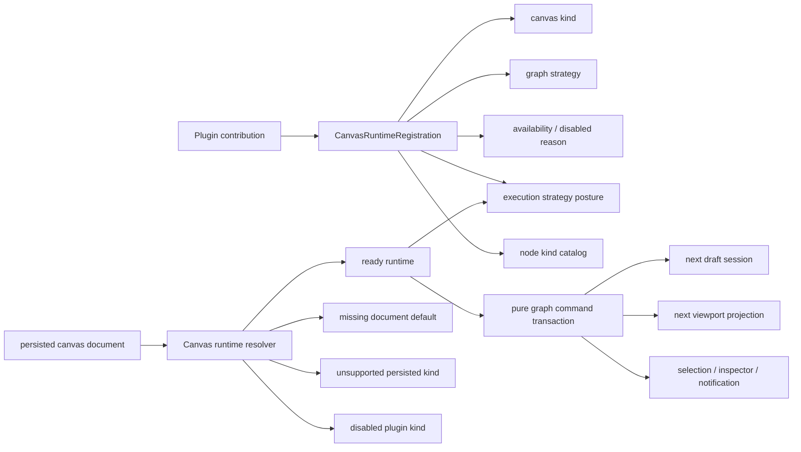
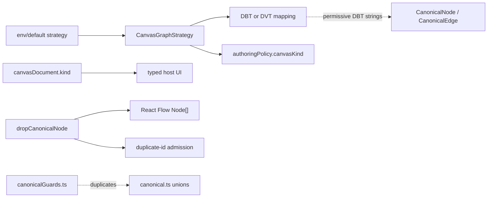
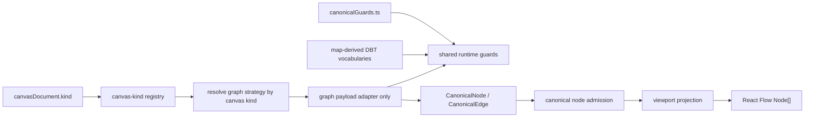
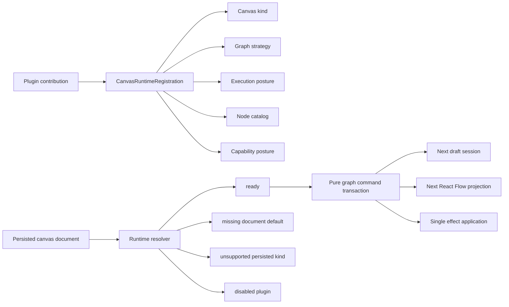
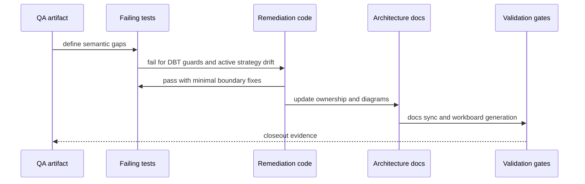

# Canvas Graph Strategy Fowler Hard QA Review

## Purpose

Record the hard QA performed on the Canvas graph-strategy policy fix and turn
the findings into a remediation plan that can be executed without re-litigating
the architectural baseline.

The reviewed slice improves the active branch by removing the false
authoring-time topology policy from node drop and duplicate flows. The remaining
issue is that several ownership seams still do not match the typed
multi-canvas host model now present in the route.

### Markdown Artifact Path Suggestion

- `docs/planning/reviews/architecture-and-governance/20260425-canvas-graph-strategy-fowler-hard-qa-review.md`

## Governing Sources

- [Governance Document And Rule Inventory](../../status/governance-document-rule-inventory.md)
- [AI Work Protocol](../../../guides/ai-work-protocol.md)
- [Review Naming Policy](../review-naming-policy.md)
- [QA Artifact Example Template](../../templates/qa/TEMPLATE_QA_ARTIFACT_EXAMPLE.md)
- [Graph Frontend Architecture](../../../architecture/components/web/graph/graph-frontend-architecture.md)
- [Canvas Inspector Authoring Component](../../../architecture/components/web/graph/canvas-inspector-authoring-component.md)
- [Canvas Playground Host Component](../../../architecture/components/web/graph/canvas-playground-host-component.md)
- [Canvas Controller Current To Target Architecture](../../../architecture/components/web/graph/canvas-controller-current-to-target-architecture.md)
- [TF-E2 Project Playground And Multi-Canvas Host Plan](../../proposals/mandatory/frontend-and-ux/tf-e2-project-playground-and-multi-canvas-host-plan-20260423.md)
- [Agent Lane E](../../state/agent-lane-e.yaml)

## Summary

The branch removes a real smell: `enforceTransformationTopology` was a false
policy surface because Canvas authoring must allow incomplete and larger graphs
while plan/run readiness validates the selected executable subgraph.

Post-remediation status:

- DBT graph mapping is now fail-closed for known DBT node and edge vocabulary.
- Active graph strategy now resolves from the persisted `canvasDocument.kind`.
- `CanvasGraphStrategy` no longer carries route posture data.
- Canonical node admission is separated from React Flow viewport projection.
- Semantic tests now cover the main active-canvas strategy path.

The branch is still not architecturally clean as a final multi-canvas cut. The
remaining risks are deeper Fowler/DDD issues:

- unknown persisted canvas kinds still fall through to the transformation
  strategy instead of becoming an explicit invalid-document posture;
- node create/drop handlers still perform side effects inside React state
  updaters;
- `canvasKinds` and graph strategies are still registered through separate
  truth sources;
- multi-canvas authoring exists, but plan/run execution remains
  transformation-only;
- DVT generic graph UI still leaks through DBT-named renderers and catalogs;
- canonical runtime guards still duplicate canonical type vocabulary instead of
  deriving from one ubiquitous-language source.

## Findings

### Closed By TF-E2-L

- DBT adapter accepted invalid domain vocabulary.
  Closed by fail-closed DBT runtime guards and focused negative tests.
- Active strategy was global instead of canvas-document-owned.
  Closed for the normal restored-document path by resolving strategy from
  `canvasDocument.kind`.
- Strategy contract mixed adapter behavior and route posture.
  Closed by removing `authoringPolicy` from `CanvasGraphStrategy`.
- Drop aggregate mixed canonical admission with React Flow projection.
  Closed by making `admitCanonicalNodeToCanvas` return semantic admission
  results only.
- Architecture tests were only thin textual tripwires.
  Partially closed by semantic active-strategy and admission tests.

### High

- Title: persisted unknown canvas kinds silently degrade to transformation.
  Why it matters: `canvasDocument.kind` is now the active selector, but the
  registry still returns the default strategy for unknown values. Missing
  documents may default to transformation; persisted unknown documents must not.
  Mature editors such as NiFi, Dagster, dbt Cloud, and VS Code workspace
  extension hosts distinguish "new default" from "unsupported persisted type".
  Evidence: `apps/web/src/app/views/canvas/canvasActiveGraphStrategy.ts`
  passes `draftReadModel?.record?.draft.canvas.kind` into
  `resolveCanvasGraphStrategy`, while
  `apps/web/src/app/plugins/graphStrategyRegistry.ts` returns the default
  strategy for any unknown normalized value.
  Risk: an invalid or disabled canvas can be parsed, edited, planned, or
  displayed with transformation semantics while the document still claims a
  different kind.
  Recommendation: replace silent fallback with a discriminated resolution
  result: `missing_document`, `ready`, `unsupported_kind`, and
  `disabled_plugin`. Only `missing_document` may choose the initial default.

- Title: node admission still performs side effects inside React state updaters.
  Why it matters: `setNodes((existingNodes) => ...)` should be a pure state
  transition. The current drop and first-node creation handlers call
  `setDraftSession` and `toast` inside the updater. React may replay updater
  functions under concurrent rendering and Strict Mode; mature React code keeps
  domain transactions outside state reducer callbacks.
  Evidence: `apps/web/src/app/views/canvas/useCanvasNodeDropHandlers.ts` and
  `apps/web/src/app/views/canvas/useCanvasAuthoringNodeCreationHandlers.ts`
  call `setDraftSession`, selection effects, and toast notifications from inside
  `setNodes` updater bodies.
  Risk: duplicate toasts, duplicated semantic admission, or viewport/session
  skew during replay, test harness retries, or future concurrent React behavior.
  Recommendation: introduce a pure command transaction that computes
  `nextNodes`, `nextDraftSession`, selection, inspector target, and notification
  from an immutable input snapshot, then apply effects once outside updater
  callbacks.

### Medium

- Title: canvas kind registry and graph strategy registry are parallel truths.
  Why it matters: `CanvasKindRegistration` declares the product-facing canvas
  kind, while `STRATEGIES` declares the technical adapter map separately. A new
  canvas kind can be visible without a strategy, or a strategy can exist without
  a visible kind. Mature plugin systems compose the contribution once and expose
  filtered, capability-aware views.
  Evidence: `apps/web/src/app/plugins/dbt/dbtContributions.ts` and
  `apps/web/src/app/plugins/dvt/dvtContributions.ts` declare `canvasKinds`,
  while `apps/web/src/app/plugins/graphStrategyRegistry.ts` owns a separate
  `STRATEGIES` map.
  Risk: plugin capability, UI catalog, drag parsing, and execution posture can
  drift independently.
  Recommendation: make graph strategy resolution derive from plugin
  contributions or add a parity-enforced `CanvasKindRuntimeRegistration` that
  binds kind, strategy, capability, and execution posture.

- Title: multi-canvas authoring has no matching execution strategy boundary.
  Why it matters: Canvas can now create `dbt` and `transformation` documents,
  but plan/run is still governed by `validateTransformationGraph` and
  `previewProfile: transformation-sql-first-v1`. That is acceptable only if DBT
  canvas is explicitly non-executable until a DBT execution strategy exists.
  Evidence: `apps/web/src/app/views/canvas/canvasExecutionState.ts`,
  `apps/web/src/app/views/canvas/canvasToolbarViewModel.ts`, and
  `apps/web/src/app/views/canvas/canvasPlanAction.ts` still expose
  transformation-specific validation as the single plan/run gate.
  Risk: DBT authoring can look first-class while execution rules remain
  transformation-specific, producing misleading UX and future branching inside
  the controller.
  Recommendation: create a `CanvasExecutionStrategy` seam keyed by canvas kind.
  Start with `transformation` executable and `dbt` explicitly blocked with
  governed copy and tests; do not fake DBT execution.

- Title: DVT generic graph UI still uses DBT-named components.
  Why it matters: `DbtNodeRenderer` and `nodeTypeCatalog.dbt.ts` are being used
  for generic DVT transformation nodes. That is a semantic leak and a future
  change amplifier: a DBT renderer change can affect DVT authoring.
  Evidence: `apps/web/src/app/plugins/dvt/dvtContributions.ts` imports
  `DbtNodeRenderer`, and `DVT_AUTHORING_NODE_KINDS` lives in
  `apps/web/src/app/plugins/nodeTypeCatalog.dbt.ts`.
  Risk: plugin ownership becomes naming-based rather than semantic, and future
  DBT-specific UI behavior can cross into DVT.
  Recommendation: extract neutral graph node rendering and DVT catalog modules,
  then let DBT specialize only DBT-specific metadata and visuals.

- Title: canonical guards duplicate canonical vocabulary.
  Why it matters: type unions in `canonical.ts` and runtime sets in
  `canonicalGuards.ts` are maintained separately. This is a classic Fowler
  "parallel inheritance / parallel data definition" drift path.
  Evidence: `apps/web/src/app/types/canonical.ts` and
  `apps/web/src/app/types/canonicalGuards.ts` contain separate role, status, and
  relation values.
  Risk: future code can compile with a new canonical value while runtime guards
  reject it, or runtime can accept a value not represented in the type.
  Recommendation: export const vocabularies from `canonical.ts` and derive both
  union types and guard sets from those values.

### Low

- Title: the QA artifact itself drifted after remediation.
  Why it matters: this document remained `status: Active` but mixed initial
  findings, completed fixes, and current risks. Active QA must distinguish
  historical findings from current blocking architecture risks.
  Evidence: the previous `Final Verdict` treated TF-E2-L as unclosed even after
  the branch completed those tasks.
  Risk: future work may chase already-fixed defects and miss the remaining
  root-cause plan.
  Recommendation: keep `TF-E2-L` as historical closure and route the remaining
  work through `TF-E2-M`.

## Alignment

- Doc vs code: improved. Docs now correctly state that graph strategies are
  payload adapters and that React Flow nodes are projection state.
- Promise vs implementation: still partially aligned. Typed multi-canvas
  authoring exists, but unsupported persisted canvas kinds and execution posture
  are not yet explicit.
- Tests vs claims: improved for DBT guards, active document strategy, and
  admission/projection. Missing coverage remains for unsupported canvas kinds,
  pure command transactions, registry parity, and execution strategy posture.
- Current truth vs planned truth: current truth is an improved incremental
  branch. Planned truth is a plugin-composed canvas runtime where kind,
  strategy, capability, and execution posture resolve from one contribution
  boundary.
- Documentation update status: this QA artifact is updated as the active
  follow-up plan; component docs must be updated in each execution phase when
  public behavior or diagrams change.
- Evidence and risk-doc status when applicable: web-only code changes are not
  ARC-triggering unless the remediation touches contracts or adapter packages.

## Architecture Assessment

- SRP: improved at the strategy and admission seams. Still weak in handler
  modules where viewport update, semantic draft mutation, selection, inspector
  focus, and notification are applied inside the same callback.
- DDD: improved by fail-closed DBT/DVT adapters. Still weak because canonical
  vocabulary has parallel type/runtime definitions and because `DVT` generic
  graph concepts live under DBT-named modules.
- Hexagonal: the plugin adapter seam exists and now validates boundary input
  better. The remaining gap is contribution composition: plugin capability,
  canvas kind, strategy, and execution posture are not one port-owned contract.
- CQRS: read posture is better because active document kind drives strategy.
  Command posture remains weak because create/drop transactions are not a pure
  command result applied once to state/effects.
- Complexity: local complexity is acceptable, but change amplification remains
  high because a new canvas kind requires edits in plugin contributions,
  strategy registry, execution validation, toolbar posture, and docs.
- Modularity: improved, but mature modularity requires one canvas runtime
  registration boundary and one execution strategy boundary.

## Test Assessment

- Negative paths present: malformed DVT canonical role, status, relation,
  canonical drag payload rejection, malformed DBT node type, malformed DBT edge
  type, malformed DBT status, and active canvas kind strategy selection.
- Negative paths missing: persisted unsupported canvas kind, disabled plugin
  canvas kind, registry parity, pure handler transaction replay, and
  non-executable DBT canvas plan/run posture.
- Regression status: current branch validation is green, but the tests do not
  close the remaining multi-canvas runtime and React-state purity gaps.
- Determinism: no nondeterministic behavior observed in the QA scope.
- Local suite vs meaningful global confidence: local suite is useful but not
  sufficient for unsupported-kind and execution-posture invariants.
- Harness or shared fixture need: add small registry fixtures for canvas kind,
  strategy, capability, and execution posture instead of widening controller
  fixtures.
- Test grouping by type and rationale:
  - unit: registry resolution, canonical vocabularies, and command transaction
    behavior;
  - architecture: strategy ownership, plugin registry parity, and execution
    posture boundaries;
  - route integration: unsupported/disabled persisted canvas posture and
    dbt/transformation execution behavior;
  - Cypress: required only when the unsupported-kind or non-executable canvas
    posture changes visible UX.

## Quality Gates

- Commands executed:
  - `git diff --stat origin/main...HEAD`
  - static review of graph strategy, DBT adapter, canonical guard, drop,
    duplicate, route environment, host-cycle, and architecture docs
- What passed:
  - PR CI was already green before this QA was recorded.
- What failed:
  - CodeRabbit CLI was not available in PATH, so no CodeRabbit result is used
    as evidence.
- What could not be verified:
  - No new runtime command was executed for this review-only artifact.
- Post-remediation artifact refresh:
  - `pnpm lint:md:changed` passed after the TF-E2-M plan update.
  - `pnpm verify:prepush` passed after the TF-E2-M plan update.

## Unblock Roadmap

### Wave 0 - Truth and documentation baseline

Tasks: `TF-E2-L-A`

Target:

- active review and Lane E task exist;
- docs state the remaining current truth clearly;
- remediation starts from tests, not from a larger controller rewrite.

### Wave 1 - Boundary and ownership hardening

Tasks: `TF-E2-L-B`, `TF-E2-L-C`, `TF-E2-L-D`

Target:

- DBT and DVT strategies both fail closed at plugin boundaries;
- active graph strategy follows active canvas document kind;
- strategy metadata no longer owns route posture;
- canonical vocabularies have one runtime/type source.

### Wave 2 - Runtime and regression closure

Tasks: `TF-E2-L-E`, `TF-E2-L-F`

Target:

- canonical admission and viewport projection are separated;
- semantic architecture tests prove behavior-level invariants;
- docs, diagrams, and validation evidence are synchronized.

## Action Artifact

### Task Checklist

- [x] `TF-E2-L-A` Preserve QA and remediation intake in planning
- [x] `TF-E2-L-B` Add DBT fail-closed boundary tests and guards
- [x] `TF-E2-L-C` Make active strategy resolve from active canvas document
- [x] `TF-E2-L-D` Move canvas-kind metadata out of graph strategy
- [x] `TF-E2-L-E` Split canonical admission from viewport projection
- [x] `TF-E2-L-F` Replace thin architecture assertions with semantic tests and
      update docs
- [x] `TF-E2-M-A` Fail closed for unsupported persisted canvas kinds
- [x] `TF-E2-M-B` Make node create/drop transactions pure
- [x] `TF-E2-M-C` Collapse canvas kind and graph strategy into one registry truth
- [x] `TF-E2-M-D` Add canvas execution strategy posture
- [x] `TF-E2-M-E` Extract neutral DVT graph UI vocabulary from DBT modules
- [x] `TF-E2-M-F` Derive canonical guards from canonical vocabularies
- [ ] `TF-E2-M-G` Replace residual thin checks with semantic fitness functions

### Task Details

#### `TF-E2-L-A` Preserve QA and remediation intake in planning

- Objective: Keep the hard QA and its remediation route in canonical planning
  surfaces.
- Scope:
  - `docs/planning/reviews/architecture-and-governance/20260425-canvas-graph-strategy-fowler-hard-qa-review.md`
  - `docs/planning/reviews/review-status-board.md`
  - `docs/planning/state/agent-lane-e.yaml`
  - `docs/planning/roadmap/roadmap-by-domain.md`
- Recommended owner: Frontend / Architecture.
- Dependencies: none.
- Documentation impact: review, board, roadmap, and Lane E are updated.
- Evidence / risk-doc impact: no ARC evidence required for this docs-only
  intake task.
- Comment with rationale: A hard QA that only exists in chat is not governed
  system truth. It must be review-backed and lane-routed before remediation.
- Definition of Done:
  - review artifact exists and passes QA artifact checks;
  - Lane E contains `TF-E2-L`;
  - review status board links the artifact;
  - docs and workboard generators have been run.

#### `TF-E2-L-B` Add DBT fail-closed boundary tests and guards

- Objective: Close the remaining plugin-boundary validation gap in the DBT
  graph strategy.
- Scope:
  - `apps/web/src/app/plugins/dbt/dbtNodeAdapter.ts`
  - `apps/web/src/app/plugins/graphStrategyRegistry.test.ts` or a new focused
    `apps/web/src/app/plugins/dbt/dbtNodeAdapter.test.ts`
  - `apps/web/src/app/types/dbt.ts` if shared DBT vocabularies are exported
- Recommended owner: Frontend.
- Dependencies: `TF-E2-L-A`.
- Documentation impact: update component docs only if public API names change.
- Evidence / risk-doc impact: none unless package boundaries outside `apps/web`
  are touched.
- Comment with rationale: DVT and DBT are peer plugin strategies; hardening one
  while leaving the other permissive is boundary drift.
- Definition of Done:
  - tests first prove malformed DBT node type returns `null`;
  - tests first prove malformed DBT edge type returns `null`;
  - tests first prove malformed DBT status returns `null`;
  - minimal guards make those tests pass without type assertions that hide the
    boundary.
- TDD commands:
  - red: `pnpm --filter @dvt/web test -- dbtNodeAdapter.test.ts`
  - green: `pnpm --filter @dvt/web test -- dbtNodeAdapter.test.ts graphStrategyRegistry.test.ts`

#### `TF-E2-L-C` Make active strategy resolve from active canvas document

- Objective: Ensure `dbt` canvas, transformation canvas, and toolbar posture
  all use the same active canvas kind.
- Scope:
  - `apps/web/src/app/plugins/graphStrategyRegistry.ts`
  - `apps/web/src/app/views/canvas/useCanvasControllerEnvironment.ts`
  - `apps/web/src/app/views/canvas/useCanvasController.ts`
  - `apps/web/src/app/views/Canvas.routeStates.test.tsx`
- Recommended owner: Frontend.
- Dependencies: `TF-E2-L-B`.
- Documentation impact: update graph frontend architecture and playground host
  component docs.
- Evidence / risk-doc impact: none.
- Comment with rationale: In a mature workbench, the active document selects
  the adapter. A global env default can only choose the initial document kind
  before a document exists.
- Definition of Done:
  - a restored DBT canvas resolves DBT graph strategy;
  - a restored transformation canvas resolves DVT transformation strategy;
  - unknown or missing document kind fails to the documented default only before
    a document exists;
  - route tests no longer accept mismatched `canvasDocument.kind` and active
    strategy posture.
- TDD commands:
  - red: `pnpm --filter @dvt/web test -- Canvas.routeStates.test.tsx graphStrategyRegistry.test.ts`
  - green: `pnpm --filter @dvt/web test -- Canvas.routeStates.test.tsx graphStrategyRegistry.test.ts`

#### `TF-E2-L-D` Move canvas-kind metadata out of graph strategy

- Objective: Stop presenting canvas kind as graph-strategy policy.
- Scope:
  - `apps/web/src/app/plugins/graphStrategyContracts.ts`
  - `apps/web/src/app/plugins/graphStrategyRegistry.ts`
  - `apps/web/src/app/plugins/registry.ts`
  - `apps/web/src/app/plugins/nodeTypeContracts.ts`
  - `apps/web/src/app/views/canvas/canvasToolbarViewModel.ts`
- Recommended owner: Frontend / Architecture.
- Dependencies: `TF-E2-L-C`.
- Documentation impact: update Canvas graph strategy and playground diagrams.
- Evidence / risk-doc impact: none.
- Comment with rationale: Route posture belongs to the canvas-kind registry;
  graph strategies should only parse and project plugin-owned graph payloads.
- Definition of Done:
  - `CanvasGraphStrategy` no longer exposes `authoringPolicy`;
  - active canvas kind comes from `canvasDocument.kind` or canvas-kind registry;
  - no application code reads canvas kind from graph strategy;
  - tests prove strategy mapping still works for DBT and DVT.
- TDD commands:
  - red: `pnpm --filter @dvt/web test -- graphStrategyRegistry.test.ts canvasDraftAuthoringComponent.architecture.test.ts`
  - green: `pnpm --filter @dvt/web test -- graphStrategyRegistry.test.ts canvasDraftAuthoringComponent.architecture.test.ts`

#### `TF-E2-L-E` Split canonical admission from viewport projection

- Objective: Make node admission semantic and keep React Flow projection in
  viewport code.
- Scope:
  - keep canonical admission in
    `apps/web/src/app/views/canvas/canvasNodeDropAggregate.ts`
  - modify `apps/web/src/app/views/canvas/useCanvasNodeDropHandlers.ts`
  - modify `apps/web/src/app/views/canvas/useCanvasAuthoringNodeCreationHandlers.ts`
  - modify `apps/web/src/app/views/canvas/canvasDuplicateNodeCommand.ts`
- Recommended owner: Frontend.
- Dependencies: `TF-E2-L-D`.
- Documentation impact: update graph frontend architecture and inspector
  authoring component diagrams.
- Evidence / risk-doc impact: source file addition under `apps/web` requires
  `pnpm docs:status:generate`.
- Comment with rationale: Calling a React Flow projection helper an aggregate
  hides the domain/presentation boundary and invites policy drift back into the
  viewport path.
- Definition of Done:
  - canonical admission detects duplicate canonical IDs without importing React
    Flow types;
  - viewport projection maps admitted canonical nodes to React Flow nodes;
  - duplicate and create-node flows reuse the same admission result;
  - tests prove duplicate detection and projection are separate concerns.
- TDD commands:
  - red: `pnpm --filter @dvt/web test -- canvasNodeDropAggregate.test.ts canvasDuplicateNodeCommand.test.ts`
  - green: `pnpm --filter @dvt/web test -- canvasNodeDropAggregate.test.ts canvasDuplicateNodeCommand.test.ts`

#### `TF-E2-L-F` Replace thin architecture assertions with semantic tests and update docs

- Objective: Convert the remediation into behavior-level fitness functions and
  aligned documentation.
- Scope:
  - `apps/web/src/app/views/canvas/canvasDraftAuthoringComponent.architecture.test.ts`
  - `docs/architecture/components/web/graph/graph-frontend-architecture.md`
  - `docs/architecture/components/web/graph/canvas-inspector-authoring-component.md`
  - `docs/architecture/components/web/graph/canvas-playground-host-component.md`
  - `docs/planning/closeouts/<date>-tf-e2-l-canvas-strategy-boundary-closeout.md`
- Recommended owner: Frontend / Architecture.
- Dependencies: `TF-E2-L-B` through `TF-E2-L-E`.
- Documentation impact: component docs and closeout updated with sequence
  diagrams and current-state/target-state ownership.
- Evidence / risk-doc impact: no ARC evidence unless contracts or adapter
  packages are touched.
- Comment with rationale: Textual absence checks are useful tripwires, but they
  should not be the only architecture guard for semantic boundaries.
- Definition of Done:
  - semantic architecture test proves active canvas kind and graph strategy are
    aligned;
  - semantic architecture test proves drop admission has no graph-strategy or
    React Flow ownership;
  - docs include current and target diagrams;
  - closeout records validation evidence and no-debt/no-stub evidence.
- TDD commands:
  - red: `pnpm --filter @dvt/web test -- canvasDraftAuthoringComponent.architecture.test.ts`
  - green: `pnpm --filter @dvt/web test -- canvasDraftAuthoringComponent.architecture.test.ts`
  - closeout: `pnpm --filter @dvt/web typecheck && pnpm --filter @dvt/web test && pnpm lint && pnpm verify:prepush`

## Deep Fowler Remediation Plan

### Root Cause Model

The remaining architecture issue is not a single bad helper. It is a boundary
composition problem:

1. `CanvasKindRegistration` models product posture.
2. `CanvasGraphStrategy` models adapter parsing and projection.
3. `validateTransformationGraph` models plan/run readiness.
4. React handlers apply viewport projection, semantic draft mutation, selection,
   inspector focus, and notification.

Those four responsibilities are currently coordinated by convention. Mature
systems coordinate them through explicit runtime registration, command result
objects, and semantic fitness functions.

Fowler reading:

- **Feature Envy**: handlers know too much about viewport state, semantic draft
  mutation, selection, inspector focus, and notifications.
- **Data Clumps**: canvas kind, strategy id, capability, node catalog, and
  execution posture travel separately but change together.
- **Divergent Change**: adding a new canvas kind requires edits in unrelated
  files.
- **Shotgun Surgery**: DBT/DVT naming drift makes generic graph UI changes touch
  plugin-specific modules.
- **Parallel Type Definitions**: canonical compile-time unions and runtime
  guards duplicate the same vocabulary.

### Target Architecture



Design invariant:

- A missing canvas document may choose a default creation posture.
- A persisted canvas document with an unsupported kind must never silently become
  `transformation`.
- A graph command must compute semantic and viewport consequences before React
  effects are applied.
- A canvas kind must have exactly one runtime registration binding UI catalog,
  graph strategy, capability posture, and execution posture.
- Execution for unsupported canvas kinds must fail closed with governed copy,
  not hidden transformation validation.

### `TF-E2-M-A` Fail Closed For Unsupported Persisted Canvas Kinds

Objective: distinguish "no canvas document yet" from "persisted document kind is
unknown or unavailable".

Files:

- Modify: `apps/web/src/app/plugins/graphStrategyRegistry.ts`
- Modify: `apps/web/src/app/views/canvas/canvasActiveGraphStrategy.ts`
- Modify: `apps/web/src/app/views/canvas/useCanvasController.ts`
- Modify: `apps/web/src/app/views/canvas/canvasControllerViewModel.ts`
- Modify: `apps/web/src/app/views/canvas/canvasHostCycleState.ts`
- Test: `apps/web/src/app/views/canvas/canvasActiveGraphStrategy.test.ts`
- Test: `apps/web/src/app/views/canvas/useCanvasController.core.test.tsx`
- Test: `apps/web/src/app/views/canvas/canvasHostCycleState.test.ts`

Steps:

1. Write a failing unit test where `draft.canvas.kind = 'unknown'` returns
   `unsupported_kind`, not `transformation`.
2. Write a failing route/controller test where unsupported persisted kind
   disables graph mutation and exposes blocked workbench posture.
3. Implement:

   ```ts
   type CanvasGraphStrategyResolution =
     | { kind: 'missing_document'; strategy: CanvasGraphStrategy }
     | { kind: 'ready'; canvasKind: string; strategy: CanvasGraphStrategy }
     | { kind: 'unsupported_kind'; canvasKind: string };
   ```

4. Update host/workbench copy to render an explicit unsupported-canvas message.
5. Run:
   `pnpm --filter @dvt/web test -- canvasActiveGraphStrategy.test.ts useCanvasController.core.test.tsx canvasHostCycleState.test.ts`
6. Commit with:
   `pnpm commit fix web "Fail closed unsupported Canvas kinds"`

Exit criteria:

- Unknown persisted kind never resolves a graph strategy.
- Missing document still allows the default creation path.
- The user sees an explicit blocked posture, not an empty transformation canvas.

### `TF-E2-M-B` Make Node Create/Drop Transactions Pure

Objective: remove side effects from React `setNodes` updater functions and make
node admission a pure command result.

Files:

- Create: `apps/web/src/app/views/canvas/canvasNodeAdmissionTransaction.ts`
- Modify: `apps/web/src/app/views/canvas/useCanvasNodeDropHandlers.ts`
- Modify: `apps/web/src/app/views/canvas/useCanvasAuthoringNodeCreationHandlers.ts`
- Modify: `apps/web/src/app/views/canvas/useCanvasNodeDuplicateHandlers.ts`
- Test: `apps/web/src/app/views/canvas/canvasNodeAdmissionTransaction.test.ts`
- Test: `apps/web/src/app/views/canvas/useCanvasGraphHandlers.nodeDrop.test.tsx`
- Test: `apps/web/src/app/views/canvas/useCanvasGraphHandlers.nodeDuplicate.test.tsx`

Steps:

1. Write failing tests that replay the transaction twice and prove only one
   semantic admission result is applied per handler call.
2. Introduce a pure result:

   ```ts
   type CanvasNodeAdmissionTransaction =
     | {
         outcome: 'added';
         nextNodes: Node[];
         nextDraftSession: CanvasDraftSession;
         selectedNodeIds: string[];
         inspectorNodeId: string;
         notification: { tone: 'success'; message: string };
       }
     | {
         outcome: 'noop';
         nextNodes: Node[];
         nextDraftSession: CanvasDraftSession;
         notification: { tone: 'info'; message: string };
       };
   ```

3. Apply `setNodes`, `setDraftSession`, selection, inspector focus, and toast
   outside updater callbacks.
4. Run:
   `pnpm --filter @dvt/web test -- canvasNodeAdmissionTransaction.test.ts useCanvasGraphHandlers.nodeDrop.test.tsx useCanvasGraphHandlers.nodeDuplicate.test.tsx`
5. Commit with:
   `pnpm commit refactor web "Make Canvas node admission transactions pure"`

Exit criteria:

- No `setDraftSession`, `toast`, `setSelectedNodes`, or `setInspectorNode`
  appears inside a `setNodes((...) => ...)` body.
- Tests prove the command result can be computed without React effects.

### `TF-E2-M-C` Collapse Canvas Kind And Graph Strategy Into One Registry Truth

Objective: bind canvas kind, graph strategy, capability posture, and node
catalog through one runtime registration.

Files:

- Modify: `apps/web/src/app/plugins/registry.ts`
- Modify: `apps/web/src/app/plugins/graphStrategyRegistry.ts`
- Modify: `apps/web/src/app/plugins/graphStrategyContracts.ts`
- Modify: `apps/web/src/app/plugins/dbt/dbtContributions.ts`
- Modify: `apps/web/src/app/plugins/dvt/dvtContributions.ts`
- Test: `apps/web/src/app/plugins/graphStrategyRegistry.test.ts`
- Test: `apps/web/src/app/plugins/registry.test.ts` or a new
  `canvasRuntimeRegistry.test.ts`

Steps:

1. Write failing parity tests:
   - every registered canvas kind has one graph strategy;
   - every graph strategy is reachable through one canvas kind;
   - disabled runtime plugins do not produce ready canvas runtime registrations.
2. Add a runtime registration shape:

   ```ts
   type CanvasRuntimeRegistration = {
     kind: string;
     pluginId: string;
     canvasKind: CanvasKindRegistration;
     graphStrategy: CanvasGraphStrategy;
     executionPosture: CanvasExecutionPosture;
   };
   ```

3. Derive strategy resolution from `getCanvasRuntimeRegistrations`.
4. Keep `resolveCanvasGraphStrategy` only as a compatibility wrapper if needed
   by lineage, or replace lineage with an explicit DBT runtime lookup.
5. Run:
   `pnpm --filter @dvt/web test -- graphStrategyRegistry.test.ts canvasRuntimeRegistry.test.ts`
6. Commit with:
   `pnpm commit refactor web "Unify Canvas runtime registration"`

Exit criteria:

- There is one mechanically tested registry truth for canvas kind and graph
  strategy.
- Adding a canvas kind without strategy fails tests.
- Adding a strategy without canvas kind fails tests unless explicitly marked
  non-canvas.

### `TF-E2-M-D` Add Canvas Execution Strategy Posture

Objective: make plan/run readiness explicit per canvas kind.

Files:

- Create: `apps/web/src/app/views/canvas/canvasExecutionStrategy.ts`
- Modify: `apps/web/src/app/views/canvas/canvasExecutionState.ts`
- Modify: `apps/web/src/app/views/canvas/canvasPlanAction.ts`
- Modify: `apps/web/src/app/views/canvas/canvasToolbarViewModel.ts`
- Modify: `apps/web/src/app/views/canvas/CanvasToolbarPrimaryControls.tsx`
- Test: `apps/web/src/app/views/canvas/canvasExecutionStrategy.test.ts`
- Test: `apps/web/src/app/views/canvas/useCanvasExecutionActions.planPreview.core.test.tsx`
- Test: `apps/web/src/app/views/canvas/CanvasToolbar.test.tsx`

Steps:

1. Write failing tests:
   - `transformation` uses transformation validation and preview profile;
   - `dbt` returns non-executable posture with governed copy;
   - Plan button is disabled for non-executable canvas kinds.
2. Add:

   ```ts
   type CanvasExecutionPosture =
     | { kind: 'executable'; profile: 'transformation-sql-first-v1' }
     | { kind: 'not_executable'; reason: string };
   ```

3. Route `deriveCanvasExecutionState` and `executeCanvasPlanAction` through the
   active execution posture.
4. Do not add fake DBT preview/run support.
5. Run:
   `pnpm --filter @dvt/web test -- canvasExecutionStrategy.test.ts useCanvasExecutionActions.planPreview.core.test.tsx CanvasToolbar.test.tsx`
6. Commit with:
   `pnpm commit feat web "Add Canvas execution posture strategy"`

Exit criteria:

- DBT canvas authoring is first-class but plan/run is explicitly blocked until
  a real DBT execution strategy exists.
- Transformation execution remains green.

### `TF-E2-M-E` Extract Neutral DVT Graph UI Vocabulary From DBT Modules

Objective: remove DBT naming from generic DVT transformation graph UI.

Files:

- Create: `apps/web/src/app/plugins/graph/GraphNodeRenderer.tsx`
- Create: `apps/web/src/app/plugins/dvt/dvtNodeTypeCatalog.ts`
- Modify: `apps/web/src/app/plugins/dvt/dvtContributions.ts`
- Modify: `apps/web/src/app/plugins/nodeTypeCatalog.dbt.ts`
- Modify: `apps/web/src/app/plugins/dbt/dbtContributions.ts`
- Test: `apps/web/src/app/plugins/dvt/dvtContributions.test.ts`
- Test: `apps/web/src/app/plugins/dbt/dbtContributions.test.ts`

Steps:

1. Write failing architecture tests proving DVT contributions do not import
   DBT renderer or DBT catalog modules.
2. Move generic renderer behavior into `GraphNodeRenderer`.
3. Move `DVT_AUTHORING_NODE_KINDS` into `dvtNodeTypeCatalog.ts`.
4. Keep DBT-specific renderer metadata in DBT modules.
5. Run:
   `pnpm --filter @dvt/web test -- dvtContributions.test.ts dbtContributions.test.ts`
6. Commit with:
   `pnpm commit refactor web "Separate DVT graph UI vocabulary from DBT"`

Exit criteria:

- DVT plugin imports no DBT renderer/catalog.
- DBT remains free to specialize DBT-only visuals without changing DVT.

### `TF-E2-M-F` Derive Canonical Guards From Canonical Vocabularies

Objective: remove duplicate canonical vocabulary declarations.

Files:

- Modify: `apps/web/src/app/types/canonical.ts`
- Modify: `apps/web/src/app/types/canonicalGuards.ts`
- Test: `apps/web/src/app/types/canonicalGuards.test.ts`
- Test: `apps/web/src/app/plugins/dvt/transformationGraphStrategy.test.ts`
- Test: `apps/web/src/app/plugins/dbt/dbtNodeAdapter.test.ts`

Steps:

1. Write failing tests that assert guard-accepted values equal exported
   canonical vocabulary arrays.
2. Export const vocabularies:

   ```ts
   export const CORE_NODE_ROLES = ['input', 'transform', 'check', 'output', 'control'] as const;
   export type CoreNodeRole = (typeof CORE_NODE_ROLES)[number];
   ```

3. Repeat for node status and edge relation.
4. Derive guard sets from those arrays.
5. Run:
   `pnpm --filter @dvt/web test -- canonicalGuards.test.ts transformationGraphStrategy.test.ts dbtNodeAdapter.test.ts`
6. Commit with:
   `pnpm commit refactor web "Derive canonical guards from vocabulary"`

Exit criteria:

- There is one canonical vocabulary declaration per concept.
- Runtime guards and TypeScript unions cannot drift independently.

### `TF-E2-M-G` Replace Residual Thin Checks With Semantic Fitness Functions

Objective: make architecture tests validate behavior and ownership, not only
source substrings.

Files:

- Modify: `apps/web/src/app/views/canvas/canvasDraftAuthoringComponent.architecture.test.ts`
- Modify: `apps/web/src/app/views/canvas/CanvasEmptyAuthoringEntrypoint.architecture.test.ts`
- Modify: `docs/architecture/components/web/graph/graph-frontend-architecture.md`
- Modify: `docs/architecture/components/web/graph/canvas-empty-authoring-entrypoint-component.md`
- Modify: `docs/planning/reviews/architecture-and-governance/20260425-canvas-graph-strategy-fowler-hard-qa-review.md`

Steps:

1. Replace string-only checks with executable invariants where possible:
   - unsupported persisted kind blocks mutation;
   - runtime registry parity holds;
   - command transaction is pure;
   - DVT has no DBT module dependency;
   - execution posture is explicit per canvas kind.
2. Keep a small number of source-text checks only for import-boundary tripwires
   that cannot be expressed semantically.
3. Update diagrams and component docs after code passes.
4. Run:
   `pnpm --filter @dvt/web test -- canvasDraftAuthoringComponent.architecture.test.ts CanvasEmptyAuthoringEntrypoint.architecture.test.ts`
5. Run:
   `pnpm --filter @dvt/web typecheck && pnpm --filter @dvt/web test && pnpm lint && pnpm verify:prepush`
6. Commit with:
   `pnpm commit test web "Add semantic Canvas architecture fitness tests"`

Exit criteria:

- The architecture suite fails for real semantic drift, not only for harmless
  local refactors.
- Docs and code diagrams describe the same runtime ownership model.

## Mermaid Diagram

### Original TF-E2-L drift



### TF-E2-L remediation target



### TF-E2-M remediation target



### TDD execution sequence



## Validation Baseline For Each Execution Slice

Every implementation slice spawned from this review must run:

1. targeted `@dvt/web` tests for the touched behavior;
2. `pnpm --filter @dvt/web typecheck`;
3. `pnpm --filter @dvt/web test` when route or shared Canvas behavior changes;
4. `pnpm docs:status:generate` when source files are added or removed under
   `apps/`;
5. `pnpm docs:sync` when docs structure changes;
6. `pnpm docs:workboard:generate` when Lane E changes;
7. `pnpm verify:prepush` before claiming the slice is ready.

## Final Verdict

Not ready as a final multi-canvas architecture cut.

The branch is valid as an incremental architecture improvement. `TF-E2-L` closed
the false authoring topology policy, DBT fail-closed adapter validation,
active-document strategy selection, graph-strategy route-posture leakage, and
canonical admission/projection split.

The remaining route is `TF-E2-M`. The next remediation must fail closed for
unsupported persisted canvas kinds, remove React side effects from state updater
callbacks, collapse canvas kind and graph strategy into one runtime registry,
make execution posture explicit per canvas kind, extract DVT graph UI vocabulary
from DBT modules, and derive runtime guards from canonical vocabularies.
