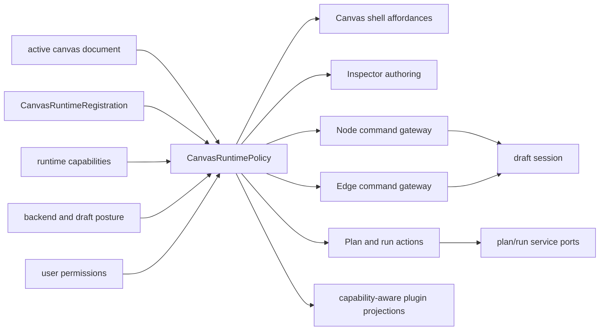
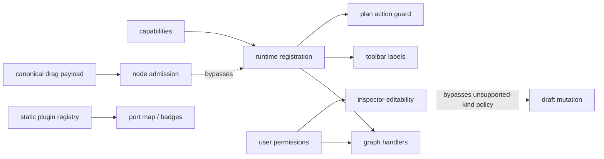
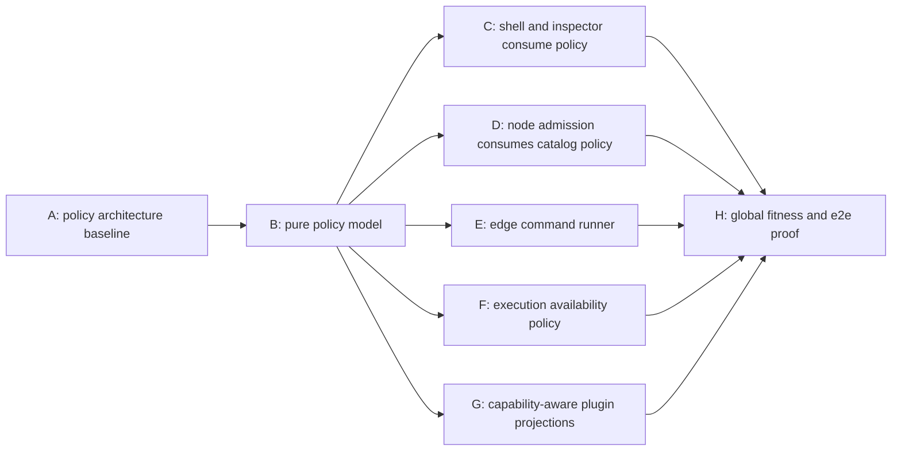
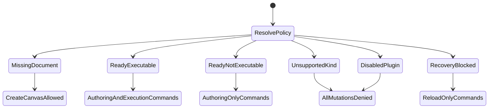

# Canvas Runtime Policy Architecture Review

## Purpose

Record the hard Fowler QA for the current Canvas branch and turn it into a
global architecture remediation plan. This review is intentionally not a list
of local patches. The target is one route-level runtime policy boundary that
all Canvas mutation, admission, execution, inspector, and plugin projections
consume.

### Markdown Artifact Path Suggestion

- `docs/planning/reviews/architecture-and-governance/20260426-canvas-runtime-policy-architecture-review.md`

## Summary

The branch materially improves Canvas architecture: runtime registrations now
bind canvas kind, graph strategy, execution posture, and authoring catalog;
node create/drop admission has a local command runner; DVT and DBT vocabulary
ownership is clearer; documentation and architecture tests are stronger.

The remaining root cause is policy fragmentation. Mature graph editors do not
let separate UI panels, drag payloads, command handlers, toolbar buttons, and
plugin projections each decide whether the active canvas may mutate or execute.
They resolve a single active runtime policy from document kind, plugin
availability, user permissions, backend posture, and draft recovery state, then
route every command and view affordance through that policy.

This review therefore proposes a global Canvas runtime-policy component:

- one application-level policy model for the active canvas;
- one policy resolver from active document, capabilities, route posture, and
  draft transport state;
- one command gateway for node and edge graph mutation effects;
- one capability-aware plugin projection surface;
- semantic architecture fitness tests that fail when any consumer bypasses the
  policy boundary.

## Governing Sources

- [Governance Document And Rule Inventory](../../status/governance-document-rule-inventory.md)
- [AGENTS.md](../../../../AGENTS.md)
- [AI Work Protocol](../../../guides/ai-work-protocol.md)
- [Review Naming Policy](../review-naming-policy.md)
- [QA Artifact Example Template](../../templates/qa/TEMPLATE_QA_ARTIFACT_EXAMPLE.md)
- [Graph Frontend Architecture](../../../architecture/components/web/graph/graph-frontend-architecture.md)
- [Canvas Empty Authoring Entrypoint Component](../../../architecture/components/web/graph/canvas-empty-authoring-entrypoint-component.md)
- [Canvas Inspector Authoring Component](../../../architecture/components/web/graph/canvas-inspector-authoring-component.md)
- [Canvas Graph Strategy Fowler Hard QA Review](./20260425-canvas-graph-strategy-fowler-hard-qa-review.md)
- [Canvas Handler Seams Fowler Review](./20260421-canvas-handler-seams-fowler-review.md)
- [Canvas Runtime Truth Hard-Cut Review](./20260422-canvas-runtime-truth-hardcut-review.md)

## Findings

No critical findings.

### High

- Title: Inspector authoring can bypass active canvas fail-closed posture.
  Why it matters: graph mutation now uses `canMutateActiveCanvas`, but
  inspector authoring still exposes editability from the lower-level draft
  transport mutability. A route that fails closed for an unsupported persisted
  canvas kind can still show node-detail edit commands.
  Evidence:
  `apps/web/src/app/views/canvas/useCanvasController.ts` computes
  `canMutateActiveCanvas`, while
  `apps/web/src/app/views/canvas/canvasControllerViewModel.ts` exposes
  `canEditInspectorNode` from `authoringRuntime.canMutateGraph`.
  Risk: unsupported or blocked canvas documents can mutate through a side
  panel after the main graph and execution posture correctly close.
  Recommendation: resolve one `CanvasRuntimePolicy` and make inspector
  authoring consume `policy.commands.canEditInspectorNode`.

- Title: Canonical drag payload admission is not constrained by active runtime
  catalog.
  Why it matters: `CANONICAL_NODE_DRAG_MIME_TYPE` is accepted before the active
  graph strategy is consulted. The payload parser validates canonical shape
  but not active canvas kind, registered node-kind membership, or
  `pluginId === kind.split(':')[0]`.
  Evidence:
  `apps/web/src/app/views/canvas/useCanvasNodeDropHandlers.ts` accepts
  canonical payloads first, and
  `apps/web/src/app/views/canvas/canvasNodeDropPayload.ts` accepts any
  `plugin:kind` shape.
  Risk: a DBT canvas can admit DVT nodes, or mismatched plugin/kind payloads
  can enter the draft session while the docs claim runtime registration owns
  the catalog.
  Recommendation: move node-kind admission into the runtime policy and require
  every node create/drop command to validate against the active runtime
  catalog.

### Medium

- Title: Execution availability is split between toolbar view state and command
  guard.
  Why it matters: DBT is declared `not_executable`, but the Plan button uses
  transformation validation rather than execution posture as the first
  availability source. A click can still fail later in the command.
  Evidence:
  `apps/web/src/app/views/canvas/CanvasToolbarPrimaryControls.tsx` disables
  Plan from `canPlan` and `canPlanTransformation`, while
  `apps/web/src/app/views/canvas/canvasPlanAction.ts` separately rejects
  `not_executable`.
  Risk: UX command availability drifts from command semantics, producing a
  misleading first-class DBT execution affordance.
  Recommendation: derive toolbar Plan/Run availability from
  `CanvasRuntimePolicy.execution`, not from transformation validation alone.

- Title: Edge authoring still performs side effects inside React state
  updaters.
  Why it matters: node create/drop was fixed with a command runner, but edge
  confirmation and reconnect still call `setDraftSession` and `toast` inside
  `setEdges` updater functions.
  Evidence:
  `apps/web/src/app/views/canvas/useCanvasEdgeAuthoringHandlers.ts` applies
  draft mutation and notifications inside `setEdges((existingEdges) => ...)`.
  Risk: React updater replay can duplicate notifications or draft mutation,
  and the branch fixes the root cause only for nodes.
  Recommendation: create a graph command gateway that serializes both node and
  edge commands and applies React effects once outside updater callbacks.

- Title: Plugin capability filtering is not applied to every plugin projection.
  Why it matters: runtime registrations, navigation, and renderers are
  capability-aware, but port maps and badges still read from the static
  registry. A disabled plugin can still contribute connection policy or badges.
  Evidence:
  `apps/web/src/app/plugins/registry.ts` uses `PLUGIN_REGISTRY` directly in
  `getPluginPortMap` and `getNodeBadges`.
  Risk: disabled plugin posture is only partial, so the route can be visually
  and semantically influenced by unavailable plugins.
  Recommendation: route all plugin projections through a capability-aware
  runtime projection owned by the same policy resolver.

### Low

- Title: Architecture tests still check components rather than a single policy
  contract.
  Why it matters: current tests catch several behaviors, but the real mature
  invariant is that all Canvas command availability and admission decisions
  come from the active runtime policy.
  Evidence: tests cover unsupported kind, runtime registration, and node
  admission, but no test constructs a `CanvasRuntimePolicy` and verifies all
  consumers use it.
  Risk: future work can fix each symptom while preserving the distributed
  policy model.
  Recommendation: add semantic architecture tests around the policy object,
  then retain source tripwires only for import-boundary cases that behavior
  cannot observe.

## Alignment

- Doc vs code: aligned for the web-scoped Canvas runtime policy route. Docs now
  describe runtime registration, policy-owned command posture, node and edge
  command runners, capability-aware plugin projections, and route-level
  Inspector fail-closed composition.
- Promise vs implementation: aligned for current Canvas authoring. The active
  route resolves one `CanvasRuntimePolicy` and forwards policy decisions to
  graph mutation, Inspector authoring, source import, Plan, Run, admission, and
  plugin projections.
- Tests vs claims: aligned for this remediation route. Unit, architecture,
  route, and selected Cypress coverage now exercise the global policy boundary.
- Current truth vs planned truth: the planned web-scoped runtime-policy
  boundary is now implemented. Future DBT execution remains out of scope until
  a real execution strategy exists.
- Documentation update status: graph architecture and this QA artifact reflect
  the shipped policy posture and final validation evidence.
- Evidence and risk-doc status when applicable: current review is web/docs
  scoped and does not trigger ARC-2. Future contract or package-boundary work
  must re-check ARC policy before PR.

## Architecture Assessment

- SRP: improved at local handler level, but policy ownership remains split
  between controller, route interaction state, toolbar, inspector, handlers,
  and registry helpers.
- DDD: the active canvas kind is closer to an aggregate context, but there is
  no explicit application service policy object guarding all commands.
- Hexagonal: plugin declarations are cleaner, but capability-aware plugin
  projections are not consistently behind one port-like boundary.
- CQRS: read posture and command guards are still partly duplicated. The target
  should make query-side affordances and command-side admission derive from the
  same policy snapshot.
- Complexity: the branch reduced several local complexity pockets but added
  coordination complexity. Without a policy boundary, new canvas kinds will
  still require shotgun edits.
- Modularity: the next improvement should be vertical: one Canvas runtime
  policy component consumed by shell, graph handlers, inspector, execution,
  and plugin projection.

## Test Assessment

- Negative paths present: unsupported persisted canvas kind, unsupported kind
  blocking Inspector authoring, malformed DBT node/edge vocabulary, malformed
  DVT canonical role/status/relation, cross-canvas-kind canonical drop
  rejection, pluginId/kind mismatch rejection, duplicate node admission, rapid
  node create/drop before rerender, edge replay resistance, disabled plugin
  projection exclusion, and non-executable execution command rejection.
- Negative paths missing: none known for the current web-scoped runtime-policy
  route. Future DBT execution must add its own strategy-level and e2e proof
  before DBT Plan/Run can become available.
- Regression status: global runtime-policy regressions are now covered by
  policy unit tests, architecture fitness, route composition tests, and the
  selected Cypress preview/run spec.
- Determinism: edge and node command effects are now serialized outside React
  updater side effects. The full web suite still reports historical React
  `act(...)` warnings around React Flow/MiniMap, but exits green.
- Local suite vs meaningful global confidence: confidence is now vertical for
  this route: pure policy, controller/shell composition, route UX, and browser
  preview/run behavior are all covered.
- Global system view applied: yes. The review assessed UX affordance, command
  execution, plugin capability projection, draft mutation, and docs together.
- Harness or shared fixture need: add a `CanvasRuntimePolicy` fixture builder
  that can construct supported, unsupported, disabled-plugin, read-only,
  recovery, and not-executable states.
- Test grouping by type and rationale:
  - unit: policy derivation, node-kind admission, execution availability;
  - integration: controller and shell consume the policy consistently;
  - architecture: no consumer bypasses the policy module;
  - regression: edge/node command replay does not duplicate side effects;
  - e2e: DBT non-executable posture and first-node authoring remain visible
    but Plan/Run are unavailable.

## Quality Gates

- Commands executed:
  - `git diff --stat origin/main...HEAD`
  - manual review of Canvas runtime registration, controller, inspector,
    toolbar, node/edge handlers, plugin registry, and architecture docs
  - `pnpm --filter @dvt/web test -- Canvas.routeStates.test.tsx`
  - `pnpm --filter @dvt/web test -- Canvas.routeStates.test.tsx canvasDraftAuthoringComponent.architecture.test.ts`
  - `pnpm --filter @dvt/web test -- canvasActiveGraphStrategy.test.ts canvasRuntimePolicy.test.ts canvasRouteInteractionState.test.ts Canvas.routeStates.test.tsx`
    (red: `disabled_plugin` was still collapsed into `unsupported_kind`)
  - `pnpm --filter @dvt/web test -- canvasActiveGraphStrategy.test.ts canvasRuntimePolicy.test.ts canvasRouteInteractionState.test.ts Canvas.routeStates.test.tsx copy.test.ts canvasDraftAuthoringComponent.architecture.test.ts`
    (green: `disabled_plugin` branch implemented)
  - `pnpm --filter @dvt/web test -- canvasActiveGraphStrategy.test.ts canvasRuntimePolicy.test.ts useCanvasController.core.test.tsx`
    (red: unsupported runtime selectors still returned transformation fallback;
    green: selectors returned `null` and `missing_document` command posture was
    covered)
  - `pnpm --filter @dvt/web build:e2e`
  - `pnpm exec cypress verify`
  - `$env:ELECTRON_RUN_AS_NODE=$null; pnpm exec cypress verify`
  - `$env:ELECTRON_RUN_AS_NODE=$null; pnpm exec start-server-and-test preview:e2e http://127.0.0.1:4173 "pnpm exec cypress run --config-file cypress.config.ts --spec cypress/e2e/canvas/canvas-preview-run-persisted.cy.ts"`
  - `pnpm --filter @dvt/web typecheck`
  - `pnpm --filter @dvt/web test`
  - `pnpm lint`
  - `pnpm lint:md:changed`
  - `pnpm qa:artifact:check`
  - `pnpm verify:prepush`
- What passed:
  - route red/green proved unsupported kind previously left Inspector authoring
    editable and now closes it through route shell composition.
  - focused route and architecture tests passed.
  - selected Cypress Canvas preview/run spec passed after clearing
    `ELECTRON_RUN_AS_NODE`; it includes DBT first-node authoring with Plan/Run
    unavailable.
  - post-review correction proved that registered but capability-disabled
    canvas kinds resolve to `disabled_plugin`, deny every mutating command, and
    render distinct route copy from unknown persisted kinds.
  - post-review correction proved that unsupported or disabled active runtimes
    do not expose a fallback graph or execution strategy to controller
    consumers.
  - `pnpm --filter @dvt/web typecheck`, `pnpm --filter @dvt/web test`,
    `pnpm lint`, `pnpm lint:md:changed`, and `pnpm qa:artifact:check` passed.
  - `pnpm verify:prepush` passed with changed-file checks, QA artifact check,
    markdown lint, and affected web typecheck green.
- What failed:
  - the first Cypress verify/run attempt failed because the local environment
    set `ELECTRON_RUN_AS_NODE=1`, which makes the Electron-based Cypress binary
    reject `--smoke-test`. Clearing the variable produced a real passing
    Cypress run.
- What could not be verified:
  - CodeRabbit was not used as evidence because the team previously classified
    the paid tool path as unavailable for this workflow.

## Global Architecture Plan

### Target Component: `CanvasRuntimePolicy`

`CanvasRuntimePolicy` is the application boundary that resolves the active
Canvas runtime posture.

Inputs:

- active canvas document kind;
- runtime registrations;
- runtime capabilities;
- backend posture;
- draft transport/recovery state;
- user permissions;
- active execution posture;
- active node-kind catalog.

Outputs:

- `document`: missing, ready, unsupported, or disabled;
- `commands`: graph, inspector, source import, plan, run, reload;
- `admission`: allowed node kinds, allowed plugin IDs, edge policy map;
- `execution`: executable, not executable, or blocked with reason;
- `plugins`: capability-filtered projections for renderers, badges, overlays,
  port maps, inspector panels, and runtime registrations.

### Target State Diagram

### Current Drift Diagram

## Unblock Roadmap

### Wave 0 - Truth and documentation baseline

Tasks: `TF-E2-POL-A`

Target:

- current drift and target policy boundary are documented;
- the existing graph-strategy QA remains historical context, while this review
  becomes the active policy-remediation intake;
- implementation starts from semantic policy tests, not from panel-local fixes.

### Wave 1 - Runtime policy boundary

Tasks: `TF-E2-POL-B`, `TF-E2-POL-C`

Target:

- `CanvasRuntimePolicy` is a pure model and resolver;
- unsupported, disabled, read-only, recovery, not-executable, and ready states
  are represented once;
- shell, controller, and tests can consume the same policy object.

### Wave 2 - Command and admission convergence

Tasks: `TF-E2-POL-D`, `TF-E2-POL-E`, `TF-E2-POL-F`

Target:

- inspector mutation, node admission, edge admission, and execution commands
  consume the policy object;
- node and edge command effects are serialized outside React state updater
  callbacks;
- drag/drop and catalog creation enforce active runtime catalog membership.

### Wave 3 - Plugin projection closure and e2e proof

Tasks: `TF-E2-POL-G`, `TF-E2-POL-H`

Target:

- all plugin contribution projections are capability-aware;
- route and Cypress coverage prove DBT authoring is available but
  non-executable, unsupported kinds fail closed, and source import remains
  capability-gated.

## Action Artifact

### Task Checklist

- [x] `TF-E2-POL-A` Publish runtime-policy current and target architecture
- [x] `TF-E2-POL-B` Add pure Canvas runtime policy model
- [x] `TF-E2-POL-C` Route shell and inspector posture through policy
- [x] `TF-E2-POL-D` Enforce node admission through active runtime catalog
- [x] `TF-E2-POL-E` Add edge command runner and remove updater side effects
- [x] `TF-E2-POL-F` Make execution availability policy-owned
- [x] `TF-E2-POL-G` Make plugin projections capability-aware
- [x] `TF-E2-POL-H` Add global policy fitness and e2e coverage

Progress note on 2026-04-26:

- `CanvasRuntimePolicy` now owns command posture, execution posture, and active
  node-kind admission for Canvas.
- `useCanvasController` routes graph mutation, Inspector editability,
  source-import availability, and plan/run availability through that policy.
- `useCanvasNodeAdmissionCommandRunner` rejects canonical nodes outside the
  active runtime catalog before applying viewport or draft-session effects.
- `useCanvasEdgeCommandRunner` now serializes edge confirmation and reconnect
  effects over a pure transaction that returns concrete next `edges` and
  `draftSession` values before React setters run.
- Plugin runtime projections now apply `RuntimeCapabilities` to port maps,
  overlays, badges, renderers, run adapters, and Canvas edge policy consumers.
- Route shell composition now intersects Inspector editability with effective
  route permissions, so unsupported or blocked canvas documents cannot keep a
  stale side-panel mutation path open.
- Global policy fitness covers architecture, route, and Cypress perspectives:
  unsupported kinds close graph, Inspector, Plan, and Run; DBT first-node
  authoring remains available while execution actions stay unavailable.
- Cypress verification requires clearing the local `ELECTRON_RUN_AS_NODE`
  environment variable before launching Electron; with that environment fixed,
  the selected Canvas preview/run spec passes.

### Remediation status after `TF-E2-POL-H`

- High finding, Inspector bypass: remediated. Controller posture is
  policy-owned and route shell composition applies effective fail-closed
  permissions before rendering Inspector authoring.
- High finding, canonical drag/drop admission: remediated. Node create/drop
  commands enforce active runtime catalog membership, plugin/kind alignment,
  and role compatibility before viewport or draft-session effects.
- Medium finding, execution availability split: remediated. Toolbar and command
  guards now consume policy-owned Plan/Run posture.
- Medium finding, edge updater side effects: remediated. Edge confirmation and
  reconnect now use a command runner over pure transaction results.
- Medium finding, plugin projection drift: remediated. Port maps, overlays,
  badges, renderers, run adapters, and edge policy consumers use
  capability-aware runtime projections.
- Low finding, policy-fitness gap: remediated for web scope. Architecture,
  route, and selected Cypress coverage now exercise the global policy boundary.

### Task Details

#### `TF-E2-POL-A` Publish runtime-policy current and target architecture

- Objective: Make the target policy boundary explicit before more Canvas code
  changes are made.
- Scope:
  - `docs/architecture/components/web/graph/graph-frontend-architecture.md`
  - `docs/architecture/components/web/graph/canvas-empty-authoring-entrypoint-component.md`
  - `docs/planning/reviews/architecture-and-governance/20260426-canvas-runtime-policy-architecture-review.md`
- Recommended owner: Frontend / Architecture.
- Dependencies: none.
- Documentation impact: adds current-state drift diagram and target
  `CanvasRuntimePolicy` diagram.
- Evidence / risk-doc impact: no ARC evidence required for docs-only work.
- Comment with rationale: Mature-system remediation needs a named component and
  policy contract before local code changes, otherwise every fix remains a
  panel-specific patch.
- Definition of Done:
  - target policy component is named in graph architecture docs;
  - current drift diagram and target diagram are present;
  - this review is linked from `review-status-board.md`;
  - `pnpm docs:sync`, `pnpm lint:md:changed`, `pnpm qa:artifact:check`, and
    `pnpm verify:prepush` pass.

#### `TF-E2-POL-B` Add pure Canvas runtime policy model

- Objective: Introduce the single policy object that every Canvas command and
  affordance can consume.
- Scope:
  - create `apps/web/src/app/views/canvas/canvasRuntimePolicy.ts`
  - create `apps/web/src/app/views/canvas/canvasRuntimePolicy.test.ts`
  - modify `apps/web/src/app/views/canvas/canvasActiveGraphStrategy.ts`
  - modify `apps/web/src/app/views/canvas/useCanvasController.ts`
- Recommended owner: Frontend.
- Dependencies: `TF-E2-POL-A`.
- Documentation impact: graph frontend architecture lists the new policy model
  as the runtime posture boundary.
- Evidence / risk-doc impact: none unless package boundaries outside `apps/web`
  are touched.
- Comment with rationale: The root problem is not one bad boolean. The route
  lacks a single application-service policy object.
- Definition of Done:
  - policy type represents `missing_document`, `ready`, `unsupported_kind`,
    and `disabled_plugin`;
  - command posture includes graph mutation, inspector mutation, source import,
    plan, run, and reload;
  - tests prove unsupported and disabled states deny every mutating command;
  - no UI component computes these command permissions independently.
- TDD commands:
  - red:
    `pnpm --filter @dvt/web test -- canvasRuntimePolicy.test.ts`
  - green:
    `pnpm --filter @dvt/web test -- canvasRuntimePolicy.test.ts canvasActiveGraphStrategy.test.ts`
- Post-review correction, 2026-04-26: `disabled_plugin` is now represented in
  `canvasActiveGraphStrategy.ts` and `canvasRuntimePolicy.ts` instead of being
  collapsed into `unsupported_kind`. Route interaction state also formats
  disabled registered plugins separately from unknown persisted canvas kinds.
- Post-review correction, 2026-04-26: active graph and execution selectors now
  return `null` for `unsupported_kind` and `disabled_plugin`, while
  `missing_document` has explicit command-posture coverage proving graph
  mutations and execution commands remain blocked until a real canvas document
  exists.

#### `TF-E2-POL-C` Route shell and inspector posture through policy

- Objective: Ensure inspector authoring and shell affordances cannot bypass the
  active runtime fail-closed state.
- Scope:
  - modify `apps/web/src/app/views/canvas/canvasControllerViewModel.ts`
  - modify `apps/web/src/app/views/canvas/canvasShellPanelsBuilder.ts`
  - modify `apps/web/src/app/views/canvas/CanvasInspectorAuthoringSection.tsx`
  - modify `apps/web/src/app/views/canvas/useCanvasController.core.test.tsx`
  - modify `apps/web/src/app/views/canvas/CanvasShell.test.tsx`
- Recommended owner: Frontend.
- Dependencies: `TF-E2-POL-B`.
- Documentation impact: inspector authoring component guide states that
  editability is policy-owned.
- Evidence / risk-doc impact: none.
- Comment with rationale: Inspector authoring is a graph mutation path. It must
  share the same fail-closed posture as node and edge commands.
- Definition of Done:
  - unsupported canvas kind disables inspector authoring;
  - read-only and recovery states disable inspector authoring;
  - existing editable ready-state behavior remains intact;
  - tests fail if `canEditInspectorNode` is derived from draft transport alone.
- TDD commands:
  - red:
    `pnpm --filter @dvt/web test -- useCanvasController.core.test.tsx CanvasShell.test.tsx`
  - green:
    `pnpm --filter @dvt/web test -- useCanvasController.core.test.tsx CanvasShell.test.tsx`

#### `TF-E2-POL-D` Enforce node admission through active runtime catalog

- Objective: Make node create/drop admission validate against the active canvas
  runtime catalog.
- Scope:
  - modify `apps/web/src/app/views/canvas/canvasNodeAdmissionTransaction.ts`
  - modify `apps/web/src/app/views/canvas/useCanvasNodeAdmissionCommandRunner.ts`
  - modify `apps/web/src/app/views/canvas/useCanvasNodeDropHandlers.ts`
  - modify `apps/web/src/app/views/canvas/useCanvasAuthoringNodeCreationHandlers.ts`
  - modify `apps/web/src/app/views/canvas/canvasNodeDropPayload.ts`
  - modify `apps/web/src/app/views/canvas/useCanvasGraphHandlers.nodeDrop.test.tsx`
- Recommended owner: Frontend.
- Dependencies: `TF-E2-POL-B`.
- Documentation impact: empty authoring and graph architecture docs state that
  active runtime catalog owns node-kind admission.
- Evidence / risk-doc impact: none.
- Comment with rationale: A canonical shape guard is not an admission policy.
  Admission must know the active bounded context.
- Definition of Done:
  - DBT canvas rejects DVT canonical drop payloads;
  - transformation canvas rejects DBT canonical drop payloads;
  - pluginId/kind mismatch is rejected;
  - catalog-created nodes remain accepted for their own active runtime;
  - no handler admits a canonical node without policy catalog validation.
- TDD commands:
  - red:
    `pnpm --filter @dvt/web test -- useCanvasGraphHandlers.nodeDrop.test.tsx`
  - green:
    `pnpm --filter @dvt/web test -- useCanvasGraphHandlers.nodeDrop.test.tsx canvasNodeAdmissionTransaction.test.ts`

#### `TF-E2-POL-E` Add edge command runner and remove updater side effects

- Objective: Apply the same command-runner discipline to edge confirmation and
  reconnect that node admission now uses.
- Scope:
  - create `apps/web/src/app/views/canvas/canvasEdgeAdmissionTransaction.ts`
  - create `apps/web/src/app/views/canvas/useCanvasEdgeCommandRunner.ts`
  - modify `apps/web/src/app/views/canvas/useCanvasEdgeAuthoringHandlers.ts`
  - modify `apps/web/src/app/views/canvas/useCanvasGraphHandlers.edgeAuthoring.test.tsx`
  - modify `apps/web/src/app/views/canvas/useCanvasGraphHandlers.edgeReconnect.test.tsx`
- Recommended owner: Frontend.
- Dependencies: `TF-E2-POL-B`.
- Documentation impact: graph frontend architecture states that graph command
  effects are runner-owned for both nodes and edges.
- Evidence / risk-doc impact: none.
- Comment with rationale: Fixing updater side effects for only node commands
  leaves the same concurrency smell in edge commands.
- Definition of Done:
  - edge confirmation computes next edges and next draft session before React
    effects are applied;
  - reconnect does the same;
  - no `toast` or `setDraftSession` call occurs inside `setEdges` updater
    callbacks;
  - tests prove replay-resistant command output.
- TDD commands:
  - red:
    `pnpm --filter @dvt/web test -- useCanvasGraphHandlers.edgeAuthoring.test.tsx useCanvasGraphHandlers.edgeReconnect.test.tsx`
  - green:
    `pnpm --filter @dvt/web test -- useCanvasGraphHandlers.edgeAuthoring.test.tsx useCanvasGraphHandlers.edgeReconnect.test.tsx`

#### `TF-E2-POL-F` Make execution availability policy-owned

- Objective: Align Plan/Run command availability with execution posture before
  the user clicks.
- Scope:
  - modify `apps/web/src/app/views/canvas/canvasExecutionState.ts`
  - modify `apps/web/src/app/views/canvas/canvasToolbarViewModel.ts`
  - modify `apps/web/src/app/views/canvas/CanvasToolbarPrimaryControls.tsx`
  - modify `apps/web/src/app/views/canvas/CanvasToolbar.test.tsx`
  - modify `apps/web/src/app/views/canvas/useCanvasExecutionActions.planPreview.core.test.tsx`
- Recommended owner: Frontend.
- Dependencies: `TF-E2-POL-B`.
- Documentation impact: execution posture docs describe Plan/Run availability
  as policy-owned.
- Evidence / risk-doc impact: none.
- Comment with rationale: A command button and command handler must share one
  availability source; otherwise the UX advertises work the domain will reject.
- Definition of Done:
  - DBT `not_executable` posture disables Plan and Run in toolbar;
  - transformation valid graph keeps Plan enabled;
  - command handler still fails closed if invoked programmatically;
  - plan status copy explains non-executable posture.
- TDD commands:
  - red:
    `pnpm --filter @dvt/web test -- CanvasToolbar.test.tsx useCanvasExecutionActions.planPreview.core.test.tsx`
  - green:
    `pnpm --filter @dvt/web test -- CanvasToolbar.test.tsx useCanvasExecutionActions.planPreview.core.test.tsx`

#### `TF-E2-POL-G` Make plugin projections capability-aware

- Objective: Ensure disabled or unavailable plugins cannot contribute partial
  runtime behavior.
- Scope:
  - modify `apps/web/src/app/plugins/registry.ts`
  - modify `apps/web/src/app/views/canvas/useCanvasEdgeAuthoringHandlers.ts`
  - modify `apps/web/src/app/views/canvas/useCanvasOverlayModel.ts`
  - modify `apps/web/src/app/plugins/registry.test.ts` or create it if absent
  - modify `apps/web/src/app/views/canvas/useCanvasGraphHandlers.edgeAuthoring.test.tsx`
- Recommended owner: Frontend.
- Dependencies: `TF-E2-POL-B`.
- Documentation impact: plugin boundary section states that all projections are
  capability-aware.
- Evidence / risk-doc impact: none.
- Comment with rationale: Plugin availability is an architectural boundary, not
  a UI filter. Port maps, badges, overlays, and runtime registrations must use
  the same capability projection.
- Definition of Done:
  - disabled plugin contributes no port map entries;
  - disabled plugin contributes no badges or overlays;
  - ready plugins keep current behavior;
  - graph edge policy receives the capability-aware port map.
- TDD commands:
  - red:
    `pnpm --filter @dvt/web test -- registry.test.ts useCanvasGraphHandlers.edgeAuthoring.test.tsx`
  - green:
    `pnpm --filter @dvt/web test -- registry.test.ts useCanvasGraphHandlers.edgeAuthoring.test.tsx`

#### `TF-E2-POL-H` Add global policy fitness and e2e coverage

- Objective: Prove the policy boundary works from unit, route, architecture,
  and browser-level perspectives.
- Scope:
  - modify `apps/web/src/app/views/canvas/canvasDraftAuthoringComponent.architecture.test.ts`
  - modify `apps/web/src/app/views/Canvas.routeStates.test.tsx`
  - modify `apps/web/cypress/e2e/canvas/canvas-preview-run-persisted.cy.ts`
  - modify `apps/web/cypress/support/canvasDraftAuthoring.ts`
  - update graph architecture docs with final validation evidence
- Recommended owner: Frontend / QA.
- Dependencies: `TF-E2-POL-C` through `TF-E2-POL-G`.
- Documentation impact: final policy diagrams and closeout evidence are added.
- Evidence / risk-doc impact: none unless future work touches contracts or
  adapter packages.
- Comment with rationale: A policy boundary that only passes unit tests can
  still be bypassed by route composition. The final gate must cover the
  integrated route and UX.
- Definition of Done:
  - architecture test fails if consumers bypass `CanvasRuntimePolicy`;
  - route test proves unsupported kind disables graph, inspector, Plan, and Run;
  - route test proves DBT authoring remains available while Plan/Run are
    unavailable;
  - Cypress proves the first-node UX and execution posture do not drift;
  - `pnpm --filter @dvt/web test`, `pnpm --filter @dvt/web typecheck`,
    `pnpm lint`, and `pnpm verify:prepush` pass.

## Mermaid Diagram

### Global remediation sequence

### Policy-owned command availability

## Validation Baseline For Each Execution Slice

Every implementation slice spawned from this review must run:

1. focused red/green tests listed in the task detail;
2. `pnpm --filter @dvt/web typecheck`;
3. `pnpm --filter @dvt/web test` when shared Canvas behavior changes;
4. `pnpm lint:md:changed` when docs change;
5. `pnpm docs:sync` when docs structure changes;
6. `pnpm docs:status:generate` when files under `apps/` are added or removed;
7. `pnpm verify:prepush` before claiming the slice is ready.

## Final Verdict

Ready as the final web-scoped Canvas runtime-policy architecture posture for
this route.

The remediation route introduced and exercised a single policy boundary instead
of continuing with panel-local fixes. Future work should preserve that boundary:
new canvas kinds, DBT execution, plugin projections, and source-import
capabilities must enter through runtime registration, `CanvasRuntimePolicy`,
and command runners rather than direct UI booleans or static registry reads.
