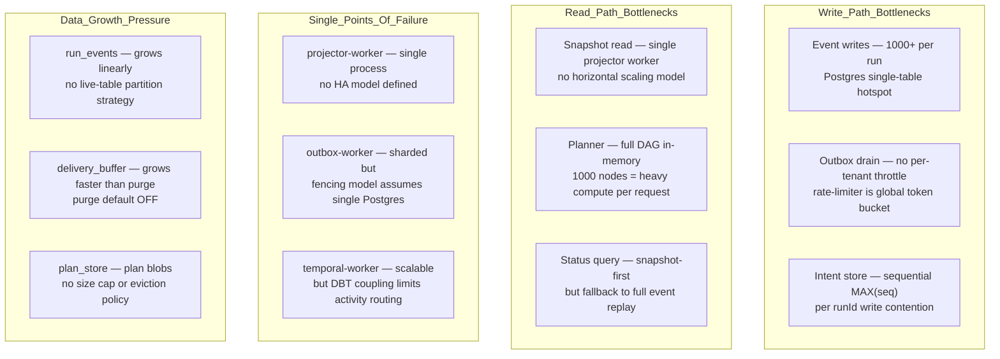
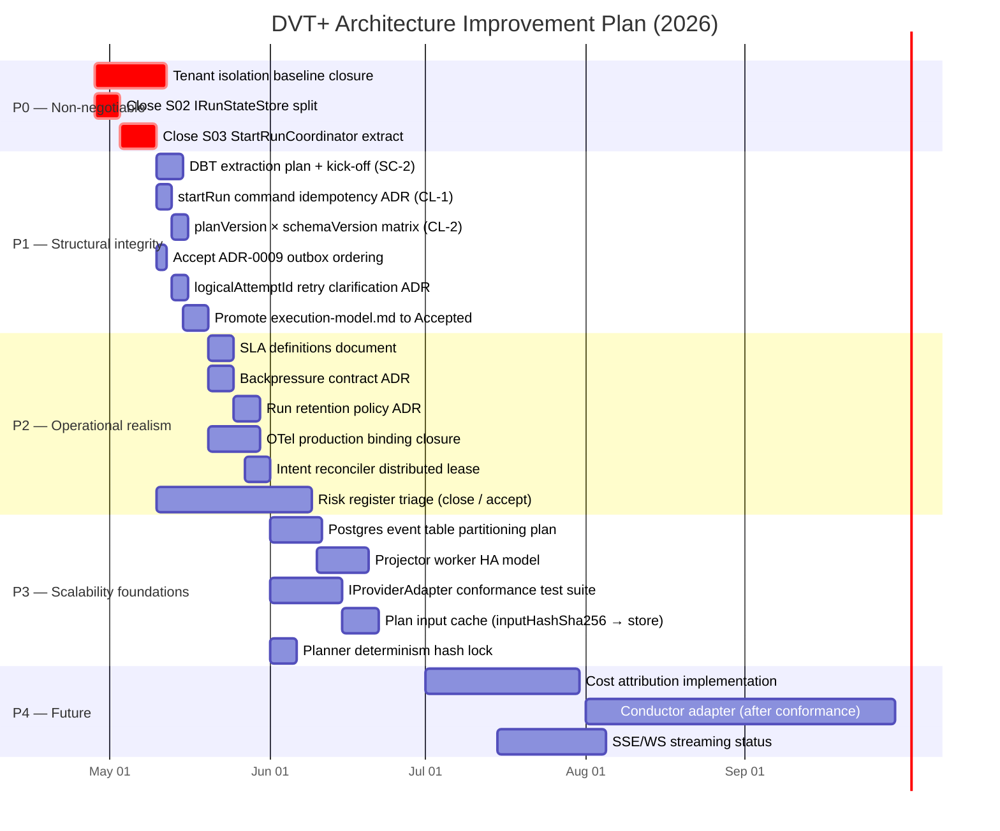
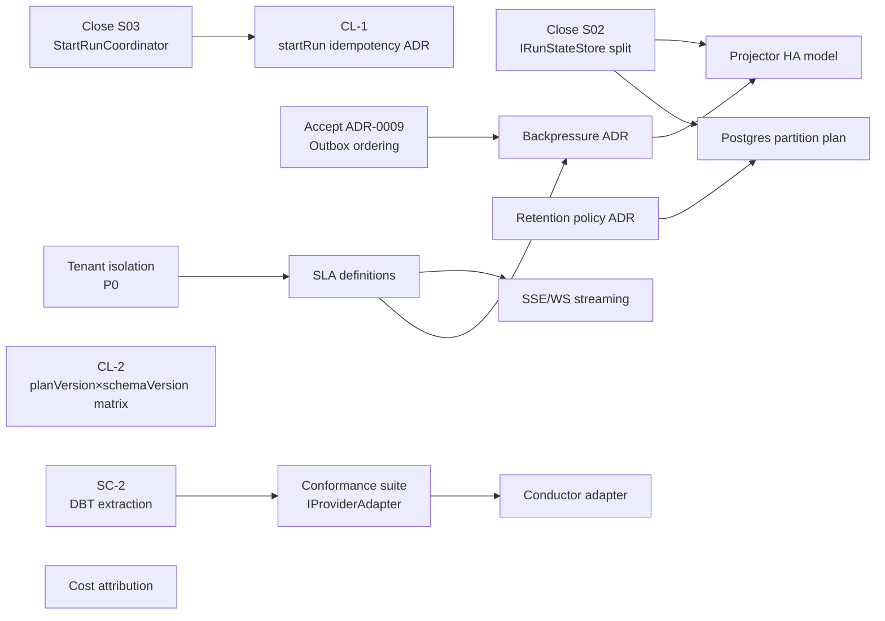

# DVT+ Deep Architectural Review

**Date:** 2026-04-27

**Reviewer role:** Principal / Staff Software Architect

**Scope:** Full codebase — contracts, engine, planner, adapters, state, delivery, apps
**Governing sources used:**
`AGENTS.md`, `governance-document-rule-inventory.md`, `reference-architecture.md`,
`dvt-execution-model.md`, `IWorkflowEngine.v1.md`, `ADR-0003`, `ADR-0004`,
`ADR-0010`, `ADR-0012`, `ADR-0014`, `ADR-0017`, `ADR-0034`, `ADR-0036`,
`system-delivery-status.md`, risk register (quality), all package sources.

**Review posture:** reference architecture review and planning intake. This
document does not replace the Review Status Board, lane YAML files, accepted
ADRs, the roadmap of record, or closeout evidence. Recommendations below must
be routed through those canonical surfaces before becoming committed delivery
work.

---

## Codebase Snapshot (2026-04-27)

| Metric                                    | Value                  |
| ----------------------------------------- | ---------------------- |
| Active workspaces                         | 24                     |
| Source files                              | 1 176                  |
| Test files                                | 623                    |
| Open risk entries (quality)               | 88                     |
| ADRs accepted                             | 29+                    |
| ADRs proposed/approved (not yet accepted) | 3                      |
| Phase 2 structural slices still open      | 4 (S02, S03, S07, S08) |

---

## 1. Conceptual Soundness

### What is solid

**Planner / Engine split is correctly positioned.**
The planner (`@dvt/planner`) produces an `ExecutionPlan` with no side effects and no
persistence calls. The engine (`@dvt/engine`) receives a `PlanRef` — a reference, not
the plan bytes — and owns lifecycle decisions. That asymmetry is correct. The planner's
26-file domain has no state-store import. The engine's `StartRunApplicationService` does
not call back into the planner. The boundary is real, not cosmetic.

**IWorkflowEngine is narrow and correctly sized.**
Five methods (`startRun`, `recoverRun`, `cancelRun`, `getRunStatus`, `signal`). The
enrichment path (`IRunEnrichmentService`) was correctly extracted out of the facade. The
health check path (`IRunHealthService`) is separate. This interface will not rot under
feature pressure because it has almost no surface to rot.

**Event sourcing with monotonic `runSeq` is correct as the source of truth.**
`INV-STATE-1` through `INV-STATE-5` in ADR-0004 are the right invariants. The
idempotency key `(runId, idempotencyKey)` is the correct deduplication boundary. The
write/persisted shape split (no `runSeq` in the write input) is correct — it prevents
callers from forging ordering.

**Run-driven adapter model (ADR-0014) is the right call.**
The engine dispatches a verified `PlanRef` to the adapter. The adapter — not the engine
— dispatches individual steps. This keeps the engine out of the step execution call path
and allows the Temporal workflow to own parallelism and retry policy. The engine's
`StartRunAdmissionGuard` and plan integrity check (ADR-0012) run before adapter
dispatch. This is the correct boundary.

**Plan versioning registry (ADR-0036) closes a real trap.**
Moving from an inline literal `'2.3'` to a versioned union over a declared registry is
correct. The `PLAN_RUNTIME_COMPATIBILITY_MATRIX` in `@dvt/plan-verifier` gives an
executable rollout policy instead of implicit big-bang cutovers.

**Bounded context communication rules (ADR-0034) are correctly stated.**
Peer contexts communicate through `@dvt/contracts` (shared kernel), not direct imports.
The forbidden pairs (`Planner ↔ Execution direct`, `Delivery → Execution direct`) are
correctly identified. Enforcement via `eslint no-restricted-imports` is mechanically
sound. Dependency-cruiser coverage exists in selected application packages; it should
not be described as repository-wide enforcement until equivalent package-graph checks
are installed across the bounded-context surfaces.

### What is fragile

**StartRunCoordinator Extraction (S03) is open.**
The intent-store pattern (pre-dispatch intent → mark dispatched → bootstrap run tx →
mark resolved) is correct in theory. But `StartRunApplicationService` still owns that
entire sequence inside the engine facade. The coordinator has not been extracted into
its own service. This means the transactional crash-recovery logic is embedded inside
the engine application service, not behind a recoverable state machine. If the engine
crashes between `markDispatched` and `bootstrapRunTx`, the recovery path depends on
`RunMaintenanceOrphanedIntentService`, which is a background reconciler — not a
synchronous compensator. The crash window exists and is not small.

**IRunStateStore Split (S02) is open.**
The current `IRunStateStore` bundles command operations (bootstrap, append, outbox
enqueue) and query operations (snapshot read, event listing, run listing) in one
interface. ADR-0015 requires that `getRunStatus` use the read model separation. But S02
has not closed the split at the interface level. This means CQRS is partially enforced
by convention, not by interface segregation. When team members add new operations,
the path of least resistance is to add them to the existing composite interface, not to
ask which side they belong to.

**DBT coupling in `@dvt/adapter-temporal` is an acknowledged but unresolved risk.**
`R-20260420-TEMPORAL-DBT-BUILTIN-COUPLING` is open. The Temporal adapter's default
public surface includes `DbtStepActivity`, `dbtPluginRunner`, and `DbtCliPluginRunner`.
This means that plugging in a non-DBT step type requires forking the adapter package or
injecting past the sealed activity dispatcher. The adapter-temporal package exports DBT
knowledge as a first-class concern, not as a plugin. This is not a clean plugin model.
It is a DBT-first adapter with a plugin-shaped seam added on top.

**`dvt-execution-model.md` is still a "Working normative draft."**
This is the specification that sits between planner, engine, adapters, state, and API.
It cannot be a draft indefinitely. Enforcement gates (lint, CI, contract checks) only
run against normative sources. As long as this document is a draft, its rules are
advisory. Every team member who reads the governance inventory sees `status: Draft` and
correctly interprets that as "this may change." That undermines the separation
guarantees the document claims to establish.

**ADR-0009 (Outbox Ordering) is only "Proposed."**
The outbox is a critical delivery path. Without an accepted ADR that defines ordering
guarantees, the `@dvt/delivery` and `dvt-outbox-worker` packages operate on an
unratified contract. If the outbox publishes events out-of-order during a sharding
rebalance, downstream consumers have no accepted invariant to reason from.

**`stepTypeConfig: Record<string, unknown>` is an open escape hatch.**
Every `ExecutionStepV1` carries an untyped `stepTypeConfig`. The plan verifier does not
validate its shape because that would require knowing the step kind. This field can
absorb any coupling — DBT-specific fields, Snowflake-specific params, plugin-specific
configs — and none of it shows up in the type system. This is where hidden
planner-to-adapter coupling accumulates over time.

### What is missing

**No accepted backpressure contract.**
The admission guard exists. The snapshot-based backpressure reader exists
(`PostgresBackpressureSnapshotReader`). But there is no accepted ADR or normative
contract that defines: what the backpressure signal means, at what threshold a tenant
is blocked, and what the SLA for unblocking is.

**No rollback guarantee.**
No ADR, contract, or runbook defines what rollback means for a failed startRun after
the adapter has been dispatched. The intent reconciler handles the orphaned-intent
case, but "rollback" is not a first-class concept. If the Temporal workflow starts but
the `bootstrapRunTx` fails, the run is in a provider-live-but-state-unknown state. The
system has recovery mechanisms but no defined rollback semantics.

**No distributed consistency model.**
Events are appended atomically per run. But cross-run consistency — e.g. "no two runs
for the same project and environment overlap" — has no defined contract. If a tenant
submits two concurrent startRun calls for the same DAG, both may proceed. Whether that
is intended or a gap is not specified.

**No SLA definitions.**
Nowhere in the accepted ADRs or normative contracts is there a statement like: "status
must reflect the terminal event within N seconds of Temporal completion." Operational
SLAs are preconditions for multi-tenant reliability, not afterthoughts.

---

## 2. Architectural Risk Map

| Risk                                                               | Severity        | Likelihood            | Why                                                                                                                                                                                                                                                                                                                        | Mitigation                                                                                                                                                                             |
| ------------------------------------------------------------------ | --------------- | --------------------- | -------------------------------------------------------------------------------------------------------------------------------------------------------------------------------------------------------------------------------------------------------------------------------------------------------------------------- | -------------------------------------------------------------------------------------------------------------------------------------------------------------------------------------- |
| **Crash window between adapter dispatch and `bootstrapRunTx`**     | High            | Medium                | `StartRunApplicationService` does these steps sequentially. A crash after `startRun(adapter)` but before `bootstrapRunTx` leaves the run provider-live with no state record. Orphaned intent reconciler fires on the next maintenance cycle.                                                                               | Close S03. Extract `StartRunCoordinator`. Make the intent-state machine the recovery point, not a background reconciler.                                                               |
| **IRunStateStore CQRS boundary erosion**                           | High            | High                  | S02 is open. The composite interface is the path of least resistance. Every new operation added to the wrong side silently merges command and query responsibilities.                                                                                                                                                      | Close S02. Split into `IRunCommandStore` and `IRunQueryStore`. Enforce at the port declaration level.                                                                                  |
| **DBT hardcoded in adapter-temporal**                              | Medium          | Realized              | Already materialized. DBT step activities and plugin runner are in the adapter default surface. Adding non-DBT steps requires adapter surgery.                                                                                                                                                                             | Track against `R-20260420`. Extract DBT activities into a `@dvt/adapter-temporal-dbt` extension. The adapter factory decides which activities to register.                             |
| **`stepTypeConfig` is an untyped escape hatch**                    | Medium          | High                  | Every step carries `Record<string, unknown>`. This field will accumulate undocumented coupling between the planner and specific adapter step handlers. It is already happening with DBT retry fields (noted in status doc).                                                                                                | Define a discriminated union for known step type configs. Push unknown configs to a typed plugin-payload envelope.                                                                     |
| **Snapshot staleness creates incorrect status reads**              | High            | Medium                | The status path is snapshot-first. If the projector worker falls behind or the snapshot is null, `getRunStatus` falls back to event replay — which is correct but slower and may return a stale terminal status to the caller between persistence and projection. Open risk: `R-20260402-SNAPSHOT-RETRY-FALLBACK-CADENCE`. | Define explicit staleness SLA. Add snapshot-age header to the status response so callers know when the snapshot was built.                                                             |
| **Planner determinism hash drift**                                 | High            | Medium                | Two open risks: `R-20260331-PLANNER-DETERMINISM-HASH-DRIFT` and `R-20260408-PLANNER-MANIFEST-KEY-ORDER-DRIFT`. If the planner produces a different hash for the same logical DAG across invocations or dbt versions, the plan cache is useless and the integrity check fails for valid plans.                              | Lock dbt manifest key ordering in `derivePlannerGraphSourceFromManifest`. Add replay tests that assert hash stability across planner versions.                                         |
| **Multi-tenant isolation baseline open**                           | Critical        | Medium                | `R-20260425-PRODUCTION-TENANT-ISOLATION-BASELINE` is open. The architecture mandates tenant scoping at every boundary. But the production-grade authz enforcement is partial. A tenant context escape in the API layer would expose run metadata and events across tenants.                                                | This cannot be Phase 3. Close tenant isolation before any production traffic. It is not a hardening item — it is a P0.                                                                 |
| **Outbox ordering not ratified**                                   | Medium          | Medium                | ADR-0009 is "Proposed." Outbox sharding with fencing (ADR-0033) exists, but the ordering guarantee across shards is undefined. Downstream OpenLineage consumers assume event ordering. If the outbox delivers out of order, lineage graphs become corrupt.                                                                 | Accept ADR-0009. Define the ordering guarantee per shard and per run. Expose the shard routing key so downstream consumers can reconstruct ordering.                                   |
| **Single Postgres as sequential event store**                      | High            | High at 1000+ tenants | Every `appendEvent` call requires an INSERT with a SELECT MAX(runSeq) per run. At 1000+ tenants with concurrent runs, this is a write hotspot. No partitioning strategy exists in the current Postgres adapter.                                                                                                            | Partition the event table by `(tenantId, runId)` hash. Evaluate advisory locks per run to avoid scan for MAX. Plan for read replicas serving the query side.                           |
| **Temporal-only adapter — IProviderAdapter untested at diversity** | Medium          | Low short-term        | `IProviderAdapter` exists as a port. But it has only one production implementation. The claimed "provider replaceability" (ADR-0003) is architecturally sound but operationally unproven. Adding Conductor would reveal gaps in the contract.                                                                              | Add a conformance test suite that any adapter implementation must pass. Do not claim replaceability until the suite exists and has been run against at least one additional adapter.   |
| **Plan store contract drift (S08 open)**                           | Medium          | High                  | S08 (`IRunStateStore` plan store contract) is open and unblocked by ADR-0040, which has not been referenced in the reviewed ADR catalog. The plan store model has three-part Postgres schema drift already flagged (`R-20260403-S08-4-POSTGRES-THREE-PART-MODEL`).                                                         | Close S08. Solidify the plan store interface before adding any additional plan record fields.                                                                                          |
| **Provider status semantic drift**                                 | Medium          | Medium                | `R-20260409-PROVIDER-STATUS-SEMANTIC-DRIFT` is open. The `IProviderAdapter.getProviderStatusView()` returns a provider-live diagnostic surface that is not mapped to canonical `CanonicalRunStatus`. If the enrichment layer maps Temporal-native states to DVT canonical states incorrectly, the UI shows wrong status.   | Add golden fixture tests for every Temporal → DVT status mapping. Gate on those fixtures in CI.                                                                                        |
| **88 open quality risk entries**                                   | High (systemic) | Realized              | A system with 88 open quality risk entries is not in a risk-managed state. It is in a risk-accumulation state. Individual risks may be small; the systemic signal is that the team is producing risk entries faster than it closes them.                                                                                   | Triage and close or accept each entry. Enforce a max-open policy: if a new risk is opened, an existing one must be closed or accepted. Treat >80 open risks as a build-health failure. |

---

## 3. Engine Abstraction Critique

### IWorkflowEngine — is it minimal and correct?

**Yes, post-enrichment split.** The current contract:

```
startRun(planRef, context) → EngineRunRef
recoverRun(sourceRunId, planRef, context) → EngineRunRef
cancelRun(engineRunRef) → void
getRunStatus(engineRunRef) → CanonicalRunStatus
signal(engineRunRef, request) → void
```

This is the correct surface. Four command/query operations. The enrichment path is
separate. The health check is separate. The facade is not leaking.

**One concern:** `recoverRun` is a separate method on `IWorkflowEngine`. But "recovery"
is a re-execution of a prior run. Whether it belongs on the same facade as `startRun` or
on a dedicated `IRunRecoveryService` depends on whether the caller needs to distinguish
between "start a new run" and "recover a prior run" at the API boundary. If the API
exposes both as `/runs/start` and `/runs/:id/recover`, they should remain separate. If
not, the method belongs on a different service. This has not been decided in the reviewed
contracts.

### Temporal-first strategy — wise?

**Conditionally.** Temporal is the right choice for a workflow engine with:

- deterministic replay
- durable execution
- activity retry with backoff
- explicit signal handling

The risk is lock-in through `@dvt/adapter-temporal`'s DBT coupling. If DBT activities
are part of the adapter's default surface, then the adapter is not a pure infrastructure
adapter — it is a DBT-aware execution environment. Replacing Temporal then requires
replacing not just the workflow runtime but also the DBT execution logic. These should
be independent.

**The `estimateRunRef` protocol is clever but fragile.** The engine calls
`estimateRunRef()` to pre-compute the `EngineRunRef` before `startRun`, bootstraps the
state with the estimated ref, then reconciles with the actual ref post-dispatch. This
eliminates a race condition. But it adds a reconciliation step with three branches
(exact match, late-bound fields update, cross-provider conflict). The cross-provider
conflict path (`cancelRun` best-effort + error) is particularly dangerous: if
`cancelRun` itself fails in that branch, the run is phantom — live in Temporal but
with a state record that is inconsistent. No risk entry covers the case where both
`estimateRunRef` mismatch AND `cancelRun` fail.

### Event model — is it robust?

**Yes for happy paths. Fragile at the gap boundary.** The envelope is correct:

```
eventId, eventType, emittedAt, tenantId, projectId, environmentId,
runId, planId, planVersion, logicalAttemptId, engineAttemptId,
idempotencyKey, [stepId], [payload]
```

The persisted shape adds `runSeq` and `persistedAt`. The separation is correct.

**Three concrete weaknesses:**

1. `logicalAttemptId` ownership is on the adapter (ADR-0016). But the engine does not
   validate that the adapter's `logicalAttemptId` matches its own expectations before
   persisting events. A misbehaving adapter could emit events with inconsistent attempt
   ids.

2. `stepId` in step events is optional. But the projector must be able to reconstruct
   step-level state. If `stepId` is absent in a `StepStarted` event, the projection
   is incomplete. The contract should make `stepId` required for step-level events.

3. The gap between `RunCancelRequested` and `RunCancelled` is owned by the runtime
   execution context (ADR-0047). The engine only sends the signal; Temporal writes
   the realized fact. If Temporal is partitioned during this window, the run stays in
   `CANCEL_REQUESTED` indefinitely. No TTL or escalation path is defined for that state.

### Where determinism assumptions could fail

1. **dbt manifest ordering.** `derivePlannerGraphSourceFromManifest` converts dbt
   `manifest.json` into a `GenericGraphSourceV1`. If `manifest.json` node key order
   changes across dbt versions (which it has historically), the plan hash changes for
   the same logical DAG. This breaks plan caching and integrity checks on re-runs
   with a dbt version bump.

2. **Planner policies applied in non-deterministic order.** `policies.ts` in the planner
   domain applies policy classes to steps. If the policy application order depends on
   object key enumeration (JavaScript objects have unreliable key order for non-integer
   keys), the resulting plan may differ across Node.js versions. The risk entry
   `R-20260331-PLANNER-DETERMINISM-HASH-DRIFT` captures this but is open.

3. **`jcs.ts` (JSON Canonical Serialization).** This is the correct approach for
   deterministic hashing. But it must be applied to the full plan core before hashing,
   including nested `stepTypeConfig` objects. If `stepTypeConfig` contains any
   `undefined` values (which JSON serialization drops) or Date objects (which serialize
   differently across environments), the hash is environment-dependent.

4. **Temporal workflow determinism.** Temporal enforces workflow replay safety, but only
   within the Temporal determinism model (no side effects outside activities). If any
   adapter code makes a direct network call outside an activity boundary, Temporal's
   replay detector will flag it — but only at runtime, not at compile time. The
   `determinism-tooling.md` doc and related CI checks need to enforce this boundary.

---

## 4. Execution Planning Layer Analysis

### DAG analyzer based on dbt artifacts

The planner derives `GenericGraphSourceV1` from dbt manifests via
`derivePlannerGraphSourceFromManifest`. The abstraction is intentional: the planner
does not know it is processing dbt — it processes a generic graph with nodes and
edges. This is correct directionally.

**But the abstraction leaks through `stepKind`.** Step kinds like `dbt-model`, `dbt-test`,
`dbt-seed` etc. are defined in `TransformationFlowStepKinds.v1.ts`. The step kind
string is the coupling point that the `GenericGraphSourceV1` abstraction does not
eliminate. The Temporal adapter's `stepActivityDispatcher` routes on step kind. So the
planner emits step kinds, the engine passes them through, and the adapter dispatches on
them. This is correct, but it means adding a new non-DBT step kind requires changes
to: (1) planner step factory, (2) contracts step kind registry, (3) adapter dispatcher
— in that dependency order. The coupling is explicit and manageable, but it is not
zero.

### Partial execution guarantees

`ExecutableSubgraph` derives a subset of the full DAG based on `ExecutionSelection`
(selected nodes + upstream + downstream). This is a powerful feature. But the guarantee
is:

- The derived subgraph is topologically valid for execution.
- Steps not in the subgraph are not executed.

What is NOT guaranteed:

- The partial execution leaves the dbt DAG in a consistent state (some models may be
  stale relative to their upstream sources).
- A subsequent full run is safe after a partial execution (it depends on dbt's own
  freshness checks, which the planner does not know about).

This is a domain knowledge gap, not an architectural bug. But operators need to
understand that partial execution does not guarantee dbt project consistency.

### Retry/backoff policy ownership

ADR-0012A defines canonical error codes. The retry policy is defined per step in
`ExecutionStepRetryPolicyV1`. The Temporal adapter reads this policy and configures
activity retry options. This is the correct ownership model.

**But `logicalAttemptId` vs Temporal-native retry is not cleanly separated.** A Temporal
activity retry (infrastructure retry) and a business-level retry (explicit `retryRun`
or `retryStep`) are two different things. ADR-0016 says `logicalAttemptId` belongs to
the adapter. ADR-0048 (retry step) and ADR-0049 (retry run) add dedicated use cases.
But the relationship between a Temporal activity retry `(attempt N)` and the
`engineAttemptId` in the event envelope is not formally mapped. A Temporal activity
that fails twice before succeeding on attempt 3 will emit what `engineAttemptId`? The
contract does not specify.

### Cost estimator realism

**Cost attribution is not implemented.** The delivery status says "Phase 3+." There is
no cost estimator, no Snowflake query cost hook, and no cost-per-step attribution. The
dvt-execution-model.md mentions cost hooks as a Platform responsibility. The strategic
roadmap mentions cost attribution as a capability. But there is no code.

This is not a failure — it is correctly deferred. But the architecture documents should
stop mentioning cost attribution as a first-class capability until the implementation
exists. Promising cost attribution in architecture diagrams without code creates false
confidence for stakeholders.

### Plan versioning strategy

The `planVersion` registry (ADR-0036) with `PLAN_RUNTIME_COMPATIBILITY_MATRIX` is
correct. The bounded change set (registry → versioned schema → planner emission →
matrix → tests) is the right process.

**One gap:** the current `planVersion` registry shows `2.3` as the current version in
the `ExecutionPlan` type definition. But `schemaVersion` is `v1.2`. Two versioning axes
(`planVersion` and `schemaVersion`) create ambiguity: which one does the engine validate
for compatibility? Which one does the adapter check? ADR-0017 governs schema versioning.
ADR-0036 governs plan versioning. The relationship between them is not defined in a
single normative table. This will cause drift as versions evolve independently.

---

## 5. State & Metadata Layer Review

### Artifact immutability — is it realistic?

**Yes for plan artifacts. Partially for run events.**

Plan artifacts (`PlanRef` + blob) are stored in the plan store with SHA256 integrity.
The engine re-validates SHA256 before dispatch (ADR-0012). This is correct immutability.

Run events are append-only (ADR-0004). `runSeq` is monotonic. `idempotencyKey` prevents
duplicate writes. The events themselves are not mutable after write. This is correct.

**What breaks the immutability story:**

- `saveProviderRef(tenantId, runId, actual)` mutates `RunMetadata.providerRef` after
  bootstrap. This is not an event — it is a direct metadata update. It is necessary
  for the `estimateRunRef` reconciliation protocol, but it is a mutable field on an
  otherwise immutable record. This creates an exception to the immutability model that
  must be explicitly acknowledged, not hidden.

- Snapshot tables are mutable by design (they are projections). But the rule "snapshots
  are derived, never authoritative" must be enforced at the query layer. If any code
  path bypasses the event log and reads only the snapshot for authoritative decisions,
  immutability is violated indirectly.

### Write amplification risk

Every `appendEvent` call writes to:

1. The event log table.
2. The outbox table (atomic with the event).
3. Potentially the intent store (mark dispatched / mark resolved).

For a dbt project with 500 models, a full run generates approximately:

- 1 RunQueued
- 1 RunStarted
- 500 StepStarted
- 500 StepCompleted (or StepFailed)
- 1 RunCompleted

Total: ~1003 event writes, each with an outbox entry. At 100 concurrent runs across
10 tenants, this is ~100 000 writes. Postgres can handle this, but:

- The outbox worker must drain 100 000 records per run batch.
- Each delivery attempt re-reads the outbox record, updates delivery state, and
  potentially DLQs failures.
- At scale, the outbox table will grow faster than it can be purged if the purge
  runtime (`DeliveryBufferPurger`) is not keeping pace.

**ADR-0038** governs delivery buffer retention and purge. The purge runtime is gated
behind `DVT_PURGE_ENABLED=false` by default. That is the correct default for safety —
but it means production operators must explicitly enable purging, and if they forget,
the outbox table grows unbounded.

### Event sourcing vs mutable state tradeoffs

**The chosen model is correct for this domain.** Event sourcing gives:

- Complete audit history
- Deterministic replay
- Time-travel for debugging

**The cost that is not acknowledged in the documents:**

- Schema evolution of event payloads is operationally hard. Adding a required field
  to `StepStarted` means all historical events lack that field. Projectors must
  handle absent fields as default values. The `payloadVersion` field in the event
  envelope (S05, closed) addresses this — but it requires every projector to handle
  version-specific payload shapes.
- Long-running runs accumulate large event streams. A 1000-node dbt project that runs
  for 2 hours produces 2000+ events. Snapshot staleness detection and rebuild must be
  efficient for these cases.

---

## 6. Governance And Review Routing

This review is intentionally source-code first, but it is not itself an
execution queue. Use it as intake for existing governance surfaces:

- structural implementation work belongs in lane YAML and generated workboard
  views
- normative behavior changes belong in accepted ADRs or contract docs
- residual operational exposure belongs in the risk register
- roadmap sequencing belongs in the roadmap of record

Where this review proposes freezes, dates, or priority groups, treat them as
architectural recommendations until those canonical surfaces accept them.

---

## 7. What Is Overbuilt

**Governance ceremony volume.**
The codebase has 88 open quality risk entries, 50+ review documents in `architecture-and-governance/`,
and 38 ADRs. Most of the risk entries are narrow tactical drift items (2–4 files affected).
The governance infrastructure is heavier than the system complexity warrants at this
stage. The team is spending engineering time writing risk entries instead of closing
them.

**Multi-engine abstraction for a single-engine reality.**
`IProviderAdapter`, `StartRunBoundary.v1.ts`, `PLAN_RUNTIME_COMPATIBILITY_MATRIX` — all
of these are designed to support multiple provider runtimes. The only production runtime
is Temporal. The Conductor adapter does not exist. The conformance test suite for
adapters does not exist. The multi-engine abstraction is sound but over-invested relative
to the operational reality. This is the classic "we designed for replaceability but only
built one thing" trap.

**Execution model specification depth.**
`dvt-execution-model.md` is 989 lines covering 27 sections, including a four-sprint
implementation plan, a list of ADRs to create, and artifacts to maintain. That document
is trying to be a project plan, an architectural spec, and a standards reference
simultaneously. It is none of them cleanly. The architecture spec and the project plan
should be separate documents.

**Plan preview surface complexity.**
The system has `TransformationFlowPreview.v1.ts`, `PlanExecutabilityRecord`,
`PlanExecutabilityValidation`, `PlanValidationLifecycle`, `PlanAdmissionLink`,
`ExecutionBindingVerification` — six contract types governing the plan preview and
admission flow. For a system where the only supported runtime is Temporal and the only
supported step type family is dbt, this is more surface than necessary.

**Observability contract depth without production binding.**
`@dvt/observability` defines ports and cardinality policies. `@dvt/observability-otel`
provides the binding. But "production validation remains incomplete." Writing
observability contracts without closing the production binding creates governance debt:
the contracts exist but are not enforced. Either close the OTel binding now or remove
the contract surface until it is ready.

---

## 8. What Is Underbuilt

**Migration strategy for contract evolution.**
No ADR defines what happens when `ExecutionStep` or `RunEvent` schema changes. The
`payloadVersion` field (S05) was added to the envelope. But the migration path for
existing events in production is undefined. If `StepStarted` gains a required field in
`v1.3`, how are historical `v1.2` events read by the projector? The current answer
is implicit (handle null/undefined in projectors). The correct answer is an explicit
migration contract.

**Version evolution of `IWorkflowEngine`.**
The current contract is `v1`. The file is `IWorkflowEngine.v1.md`. What happens when
`v2` is needed? The `VERSIONING.md` doc says "one live `v1` line, rewrite in place."
That is fine for pre-stable. But "rewrite in place" with no migration period is a
breaking change for API consumers. There is no canary-release protocol, no
compatibility window, and no deprecation notice mechanism.

**Rollback guarantees.**
`apps/api` calls `engine.startRun()`. The engine dispatches to Temporal. If the API
crashes after dispatch but before returning `EngineRunRef` to the caller, the run is
live in Temporal but the API caller received an error. The caller retries. The engine
receives a second `startRun`. The idempotency model works at the event level but not
at the startRun command level — there is no `requestId` deduplication at the `startRun`
boundary. The caller could start two runs for the same logical intent.

**Concurrency model for the planner.**
The planner is a stateless service (correct). But `GraphBuilder` and `TopoSort` are
pure in-process computations. For a 1000-node dbt project, `TopoSort` processes the
entire DAG in memory. There is no streaming, no incremental computation, and no
concurrency model for parallel plan assembly. This is fine for small projects but
becomes a bottleneck at scale.

**Backpressure strategy definition.**
`PostgresBackpressureSnapshotReader` exists. But there is no accepted contract for:

- What metric triggers backpressure (active runs per tenant? queue depth?).
- What the response is (queue the request? reject it? wait with timeout?).
- What the SLA is for resuming after backpressure releases.

**Run retention policy.**
ADR-0037 covers archival. ADR-0038 covers delivery buffer purge. But there is no
normative document that answers: "How long does a completed run's event log stay in
the live `run_events` table before archival?" The archive lifecycle is partial — the
restore and redaction paths are open. Production operators cannot make a retention
commitment without these answers.

**SLA definitions.**
None exist. No normative document states the maximum acceptable latency for:

- `startRun` end-to-end acknowledgment
- First event emission after dispatch
- `getRunStatus` response time
- Snapshot staleness bound
  Without SLAs, there is no objective definition of "system is degraded."

**Distributed lease for intent reconciler.**
The `IntentReconcilerWorker` runs reconciliation to detect orphaned intents. If two
instances of the worker run concurrently (e.g., during a rolling deploy), both may
reconcile the same intent. ADR-0033 covers outbox worker sharding with fencing. No
equivalent fencing model exists for the intent reconciler. Board 015 (`board-015-intent-reconciler-distributed-lease.md`) addresses this, but it is still in the sprint
board state, not closed.

---

## 9. Scalability Outlook (3-Year Horizon)

Assumptions: 1000+ tenants, thousands of concurrent runs, 1000+ node dbt projects,
heavy cost dashboards, cross-environment diffs.



### Bottleneck analysis

**Postgres event table at 1000+ tenants with concurrent runs:**
At 1000 tenants × 10 concurrent runs × 1000 events/run = 10 million events in a single
batch window. Without hash-partitioning by `(tenantId, runId)`, the `run_events` table
becomes a write hotspot. The `MAX(runSeq)` pattern for monotonic sequence assignment
does not scale horizontally because it requires a row-level lock or serializable
transaction.

**Snapshot projector is a single process:**
`apps/projector-worker` runs `ProjectorWorkerRuntime`. There is no HA model, no sharding
strategy, and no horizontal scaling path defined. If the projector falls behind during
a peak load, snapshot staleness grows, and the status read path falls back to event
replay — which adds more load to Postgres reads.

**Planner compute for 1000-node DAGs:**
`TopoSort` + `GraphBuilder` + `NodeSelector` run in-process per plan request. For a
1000-node DAG with upstream/downstream selection, this is O(N+E) computation — fast
in theory but memory-intensive in Node.js. No plan caching exists (the `inputHashSha256`
is the cache key, but there is no cache store — plans are recomputed per request).
The `R-20260412-AR-D1-INCREMENTAL-SNAPSHOT-PROJECTION` risk mentions incremental
snapshot projection but this is a different concern.

**Cross-environment diffs:**
If the product adds cross-environment DAG diff (two manifests, diff the node sets), the
planner must process two 1000-node graphs and produce a diff. No diff algorithm or
streaming model exists. At scale this is a 2× planner compute spike for every diff
request.

**Cost dashboards:**
Undefined at the architecture level. Any cost attribution that requires querying
Snowflake's `QUERY_HISTORY` view at scale will hit Snowflake's own API rate limits.
The attribution model must be async (batch, not real-time) or it will create feedback
loops between cost queries and billing.

**Temporal cluster as SPOF:**
The entire execution path depends on Temporal. If the Temporal cluster is unavailable,
`startRun` fails. There is no offline queue, no degraded mode, and no circuit breaker
at the engine-to-adapter boundary. `RunStateCommandPortCircuitBreaker` exists in the
adapter for the state-store path — not for the Temporal dispatch path.

---

## 10. Architectural Scorecard

| Dimension                     | Score | Justification                                                                                                                                                                                                                                                                                                                                                       |
| ----------------------------- | ----- | ------------------------------------------------------------------------------------------------------------------------------------------------------------------------------------------------------------------------------------------------------------------------------------------------------------------------------------------------------------------- |
| **Conceptual clarity**        | 7/10  | The core separation (Planner/Engine/State) is clear and documented. But the execution model spec is a draft, two ADRs are unaccepted, and the `stepTypeConfig` escape hatch obscures actual coupling. The 88-risk backlog is a clarity failure signal.                                                                                                              |
| **Separation of concerns**    | 6/10  | Correct in declared intention. Eroded in practice: S02 (IRunStateStore split) and S03 (StartRunCoordinator extraction) are open. DBT coupling in adapter-temporal violates the plugin model. `estimateRunRef` mutation in RunMetadata breaks immutability consistency.                                                                                              |
| **Replaceability of engine**  | 5/10  | The `IProviderAdapter` port is correctly positioned. But (1) no conformance test suite exists to verify a second adapter would work, (2) DBT is embedded in the Temporal adapter default surface making it non-trivially replaceable, and (3) the claim has never been operationally validated. The score reflects architectural intent minus operational evidence. |
| **Determinism**               | 7/10  | `runSeq` monotonicity, `(runId, idempotencyKey)` deduplication, JCS hashing, and Temporal replay safety are all present. Loses points for: open manifest key-order drift risk, `stepTypeConfig` that may contain non-serializable values, and the policy application order in the planner.                                                                          |
| **Extensibility**             | 6/10  | The port model and bounded contexts make extensions architecturally possible. In practice, adding a non-DBT step kind requires changes in 3 packages in order. Adding a new adapter requires building a conformance suite first. Plugin runtime is Phase 4, not Phase 1. The step kind registry and compatibility matrix add ceremony to extensions.                |
| **Operational realism**       | 4/10  | No SLAs defined. Production tenant isolation is open (R-20260425). OTel production binding incomplete. Purge disabled by default. Snapshot projector is a single process with no HA model. The system has strong paper guarantees but limited operational closure evidence.                                                                                         |
| **Long-term maintainability** | 6/10  | ADR culture and governance structure are genuine strengths. The 88-risk backlog, 50+ review documents in a single directory, and 4 open structural slices are genuine liabilities. The `dvt-execution-model.md` draft status means the primary normative spec is soft. The review-per-decision velocity is unsustainable.                                           |

**Overall: 41/70 — Architecturally sound direction, execution maturity gap.**

---

## Solid, DDD, Hexagonal, OOP, CQRS Assessment

### SOLID compliance

| Principle | Assessment                                                                                                                                                                                                               |
| --------- | ------------------------------------------------------------------------------------------------------------------------------------------------------------------------------------------------------------------------ |
| **SRP**   | Partially violated. `IRunStateStore` mixes command and query (S02 open). `StartRunApplicationService` orchestrates too many concerns (S03 open). `@dvt/adapter-temporal` mixes Temporal orchestration and DBT execution. |
| **OCP**   | Partial. Step kind registry allows extension. But `stepActivityDispatcher` in the adapter switches on step kind — adding a new kind requires modifying the dispatcher.                                                   |
| **LSP**   | Satisfied for the current single adapter. Untested for future adapters.                                                                                                                                                  |
| **ISP**   | Violated at `IRunStateStore`. Satisfied at `IWorkflowEngine` (post enrichment split).                                                                                                                                    |
| **DIP**   | Satisfied structurally. Domain core depends on ports. Adapters implement ports. No SDK imports in domain layer.                                                                                                          |

### Hexagonal compliance

**Mostly correct.** Domain core (`@dvt/engine`, `@dvt/planner`) defines ports. Adapters
implement those ports. Composition roots (`apps/api`, `apps/temporal-worker`) wire the
dependencies. Mechanical enforcement is partially in place through package
manifests, eslint rules, and selected dependency-cruiser configurations.
Repository-wide package-graph enforcement remains a follow-up, not a closed
fact.

**Violation:** `@dvt/adapter-temporal` is not a pure infrastructure adapter. It contains
business-logic decisions (DBT activity routing, gateway DSL evaluation inside the Temporal
workflow). The hexagonal model requires that business logic lives in the domain core,
not in adapters. DBT-specific step dispatch logic should be in a domain service
(`IStepExecutorPolicy`) that the adapter delegates to, not in the adapter's own
activity implementations.

### DDD bounded context compliance

**Compliant in structure, partial in enforcement.**

The six bounded contexts (Planner, Execution, State, Artifacts, Delivery, Observability)
are correctly identified with aggregate roots and ports. The `@dvt/contracts` shared
kernel is the correct communication mechanism.

**Gaps:**

- `@dvt/run-domain` exists as a separate package but its relationship to the Execution
  context is not explicit in ADR-0034. Is `run-domain` the domain layer of the
  Execution context, or is it a separate context?
- `@dvt/canonical` contains cryptographic utilities used across contexts. This is
  a utility library, not a bounded context. It should be explicitly classified as
  technical infrastructure, not domain logic.

### CQRS compliance

**Correctly modeled, incompletely implemented.**

Write path: event append → outbox enqueue → atomic.
Read path: snapshot first → event replay fallback.

**Violation:** The `IRunStateStore` interface combines both paths. Until S02 is closed,
CQRS is not enforced at the contract level. Any implementation of `IRunStateStore` is
permitted to implement both sides with shared state, violating CQRS's independent
scalability requirement.

---

## 11. Strategic Recommendations

### 3 Structural Changes (Immediate)

**SC-1: Close S02 and S03 before adding any new engine features.**

`IRunStateStore` must be split into `IRunCommandStore` and `IRunQueryStore`. The engine's
`IRunStateStore` port must be replaced by two separate injected dependencies. This is not
an optimization — it is a correctness requirement for the CQRS model. Estimate: 2–3 days.

`StartRunCoordinator` must be extracted from `StartRunApplicationService` with an
explicit state machine: `PENDING → INTENT_CREATED → DISPATCHED → BOOTSTRAPPED → RESOLVED`.
Each state transition must be recoverable independently. The intent reconciler then handles
the `DISPATCHED` → timeout case, not the general failure case. Estimate: 3–5 days.

**SC-2: Extract DBT activities from `@dvt/adapter-temporal` into `@dvt/adapter-temporal-dbt`.**

The Temporal adapter must become a pure workflow orchestration adapter. DBT-specific
activities (`DbtStepActivity`, `DbtCliPluginRunner`, `dbtPluginRunner`) must move to a
separate package that is composed in at the `apps/temporal-worker` level. The adapter
factory registers step handlers by step kind. The adapter itself has no DBT knowledge.
This makes the adapter truly replaceable and makes non-DBT step types additive, not
surgical. Estimate: 1 week.

**SC-3: Promote `dvt-execution-model.md` to Accepted normative status or replace it
with the sum of existing Accepted ADRs.**

A "Working normative draft" specification is not normative. Either: (a) accept the
document formally, add it to the governance hierarchy, and enforce it in CI the same way
ADRs are enforced; or (b) acknowledge that the ADR catalog is the normative source and
the execution model doc is informational only. The current state — draft document that
is referenced as normative in the governance inventory — is architecturally incoherent.

---

### 3 Clarifications Needed

**CL-1: What is the `startRun` idempotency boundary at the command level?**

The event write path has `(runId, idempotencyKey)` deduplication. But `startRun` itself
does not have a `requestId` deduplication key. If the API caller retries a failed
`startRun` call (e.g., after a 503), the engine may start two runs. The team must decide:
(a) `startRun` is idempotent by `requestId` (add `requestId` to `RunContext`); or
(b) `startRun` is not idempotent and the API layer is responsible for preventing
duplicate calls. This decision must be captured in an ADR.

**CL-2: What is the relationship between `planVersion` and `schemaVersion`?**

Both appear in `ExecutionPlan.metadata`. ADR-0017 governs schema versioning.
ADR-0036 governs plan versioning. There is no table that says: "planVersion 2.3 is
valid with schemaVersion v1.2; planVersion 3.0 requires schemaVersion v2.0." The engine
validates both independently. A plan could theoretically have a valid `planVersion` but
an invalid `schemaVersion`. The compatibility matrix must be two-dimensional and
documented in a single normative table.

**CL-3: Who owns `logicalAttemptId` increment on retry?**

ADR-0016 says the adapter owns `logicalAttemptId`. ADR-0049 says retry-run is a
separate engine use case. If the engine calls `recoverRun`, it creates a new run with a
new `logicalAttemptId`. But if the adapter handles a Temporal activity retry internally,
does `logicalAttemptId` increment? The answer must be: no — infrastructure retries do
not change `logicalAttemptId`. Only explicit business retries (`retryRun`, `retryStep`)
do. This must be written into the adapter conformance requirements.

---

### 3 Things to Freeze Immediately

**FR-1: Freeze `@dvt/contracts` public surface until S02 and S08 are closed.**

Every new contract type added to `@dvt/contracts` before the IRunStateStore split and
plan store contract are stabilized is potential dead weight or future migration cost.
The shared kernel is already large (25+ contract files in the planner namespace alone).
No new contract additions until the structural slices that affect the current contracts
are closed.

**FR-2: Freeze new adapter features in `@dvt/adapter-temporal` until DBT extraction
is planned (SC-2).**

Adding new Temporal adapter capabilities before extracting the DBT coupling makes SC-2
progressively harder. Every new activity that references DBT step kinds, DBT config
shapes, or the DBT plugin runner increases the surface that must be extracted. Freeze
new adapter feature work until the extraction plan is accepted.

**FR-3: Freeze the risk register from accepting new entries without closing existing ones.**

The 88-entry risk backlog is not being reduced. Adding new entries without a closure
policy creates the illusion of risk management without the substance. Implement a
max-open policy: if the risk register exceeds 80 entries, new entries require a closure
paired entry. Until the backlog drops below 50, no new entries for items that can be
immediately closed as "accepted" or "mitigated."

---

### 3 Things to Delay

**DL-1: Delay cost attribution implementation until Phase 3 as planned — but remove
cost attribution from architecture diagrams and contract surface.**

The `dvt-execution-model.md` and several ADRs mention cost attribution as a Platform
responsibility. No code exists. Remove cost attribution from all normative surfaces
until it is implemented. Leaving it in architecture docs creates stakeholder
expectations that the codebase cannot yet satisfy.

**DL-2: Delay second provider adapter (Conductor or equivalent) until the conformance
test suite exists.**

Building a Conductor adapter before there is an executable conformance test suite
validates nothing about adapter replaceability. Build the conformance suite for
`IProviderAdapter` first. Run it against the Temporal adapter. Fix gaps. Then the suite
becomes the acceptance gate for the second adapter.

**DL-3: Delay streaming status updates (SSE/WS) until the snapshot staleness SLA is
defined.**

Streaming status requires a guarantee about update frequency. Without a defined snapshot
staleness SLA, the stream cannot make any latency promise. Defining the SLA first (see
"What Is Underbuilt" section) is a prerequisite for streaming design, not a parallel
track.

---

## Action Plan — Review Intake Backlog

This timeline is architectural intake for planning discussion. It is not a
committed delivery roadmap until the relevant lane files, roadmap surfaces, and
ADRs accept the work.



---

## Dependency Graph of Fixes



---

## Summary

The DVT+ architecture is conceptually sound. The core triptych — Planner does not
persist, Engine owns lifecycle, UI does not execute — is enforced at the package level
and partially enforced at the interface level. The event sourcing model, the
`IWorkflowEngine` contract, and the ADR governance structure are genuine architectural
assets.

The system's problems are not conceptual — they are execution maturity gaps:

1. Four open structural slices (S02, S03, S07, S08) are debt against the stated architecture, not future work.
2. 88 open quality risk entries is a backlog management failure, not a sign of rigorous risk culture.
3. Tenant isolation is open in production. This is not technical debt — it is an unshipped requirement.
4. The system claims provider replaceability but has one provider and no conformance test suite.
5. Operational SLAs, retention policy, and backpressure contract are undefined. A system without SLAs cannot be operated or sold.

The architectural direction is correct. The distance between the stated architecture and
the shipped system is larger than it should be at this stage. Close the structural slices.
Define the operational contracts. The conceptual foundations will hold.
