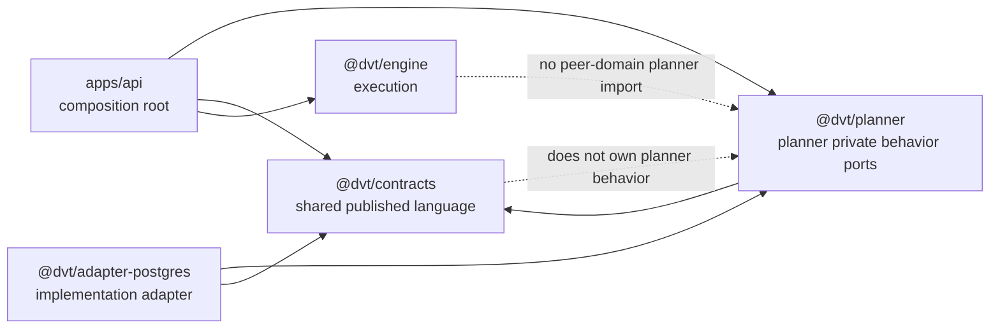
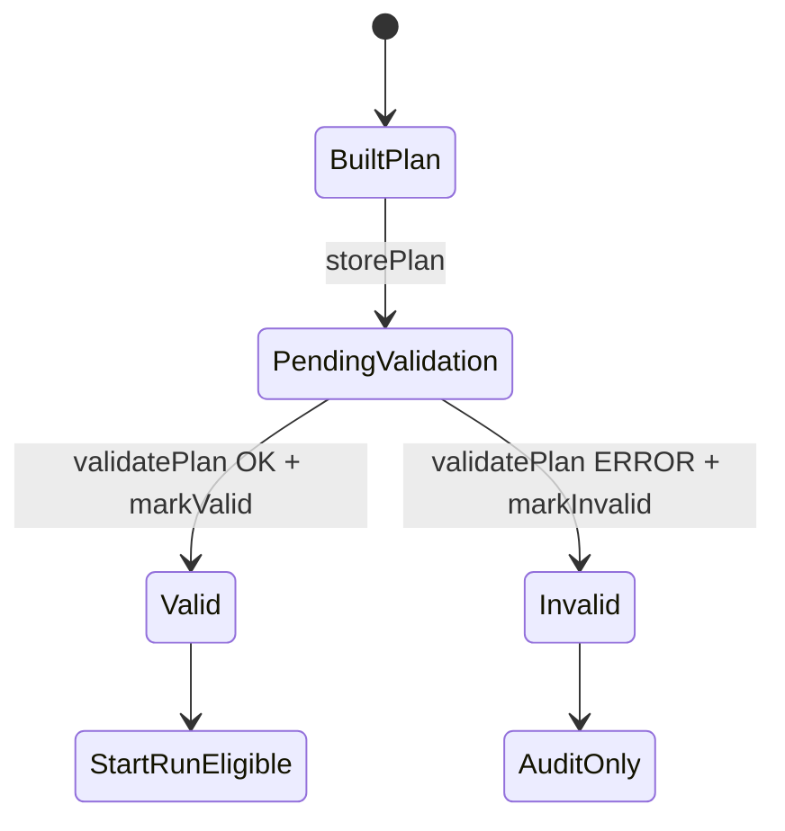
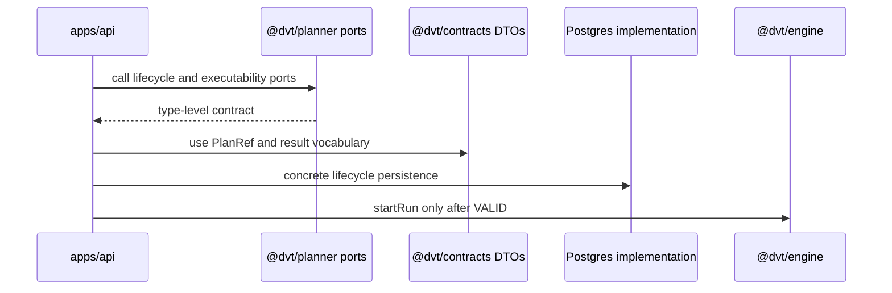

# RC-G1-D Fowler Architecture Review

This is the architecture-review mailbox record for the `RC-G1-D` branch. It
reviews the branch through a Fowler-style lens: bounded contexts, shared
kernel, published language, ports and adapters, composition roots, and
architecture tests that protect semantic intent instead of only file placement.

## Review Basis

Primary governing sources:

- [Governance inventory](../../status/governance-document-rule-inventory.md)
- [AI work protocol](../../../guides/ai-work-protocol.md)
- [ADR-0018 Shared Kernel Ownership Governance](../../../adr/ADR-0018_Shared_Kernel_Ownership_Governance.md)
- [ADR-0034 Bounded Context Boundaries And Communication Rules](../../../adr/ADR-0034-bounded-context-boundaries-and-communication-rules.md)
- [ADR-0035 Planner Public Contract Evolution Protocol](../../../adr/ADR-0035-planner-public-contract-evolution-protocol.md)
- [RC-G1 ownership migration plan](../../proposals/mandatory/runtime-and-contracts/contracts-domain-ownership-migration-plan-20260327.md)
- [RC-G1-D closeout](../../closeouts/20260427-rc-g1-d-planner-ownership-migration-closeout.md)
- [Planner private behavior ports component](../../../architecture/components/planner/planner-private-behavior-ports-component.md)

Primary code reviewed:

- `packages/@dvt/planner/src/contracts/PlanExecutabilityValidation.ts`
- `packages/@dvt/planner/src/contracts/ExecutionBindingVerification.ts`
- `packages/@dvt/planner/src/contracts/PlanValidationLifecycle.ts`
- `packages/@dvt/planner/src/contracts/CustomPolicyNamespaceRegistry.ts`
- `packages/@dvt/contracts/src/contracts/planner/*.v1.ts`
- `packages/@dvt/planner/test/unit/planner-private-ownership.architecture.test.ts`
- `packages/@dvt/contracts/test/planner-private-ownership.architecture.test.ts`
- `apps/api/src/application/services/*Plan*`
- `packages/@dvt/adapter-postgres/src/PostgresPlanStore.ts`

## Executive Verdict

`RC-G1-D` improves the architecture materially. It moves planner-private
behavior out of the shared kernel and toward the bounded context that owns the
semantics.

Compared with mature modular monoliths and distributed systems using DDD, the
branch now has the right physical ownership. The remaining gap was semantic
encapsulation: the code proved where the ports lived, but not why the modules
existed, which vocabulary they were allowed to use, or which dependencies would
make the boundary regress.

This follow-up closes that gap with:

- module-level `Owned concern` docblocks
- a planner-local component guide with API, invariants, transitions, consumers,
  and diagrams
- a semantic architecture test that checks type-only barrel publication,
  dependency shape, and shared vocabulary usage, not only name presence
- synchronized closeout, evidence, and risk documentation

## Mature-System Comparison

| Fowler/DDD concern            | Mature-system posture                                                                | RC-G1-D posture before hardening                                       | Hardening applied                                                                          |
| ----------------------------- | ------------------------------------------------------------------------------------ | ---------------------------------------------------------------------- | ------------------------------------------------------------------------------------------ |
| Shared Kernel                 | Shared package contains published language, DTOs, schemas, and refs only.            | `@dvt/contracts` kept shared vocabulary and removed the private ports. | Evidence and tests now distinguish shared vocabulary from behavior ownership explicitly.   |
| Bounded Context               | Behavior ports live with the context that owns the decision.                         | Ports moved to `@dvt/planner`.                                         | Each port module now states its owned concern at the module boundary.                      |
| Published Language            | Cross-context vocabulary is stable and serializable.                                 | Result and record DTOs remained in `@dvt/contracts`.                   | Semantic tests require planner ports to depend on those DTOs through `import type`.        |
| Ports and Adapters            | Domains define replaceable dependencies; adapters implement only the port they need. | `@dvt/adapter-postgres` imports the planner lifecycle store interface. | Risk register documents this as implementation dependency, not planner-service coupling.   |
| Composition Root              | Application layer wires planner, execution, and state without peer-domain imports.   | `apps/api` performs the cross-context composition.                     | Component sequence documents the admission flow and its transition gate.                   |
| Architecture Fitness Function | Tests protect rules that humans usually forget.                                      | Tests proved absence/presence at barrels.                              | Guards now cover type-only barrel export, docblocks, vocabulary imports, and peer imports. |

## Improved Patterns

1. Shared Kernel became smaller and more honest.
   `@dvt/contracts` now holds serializable planner vocabulary, not private
   planner behavior.

2. Bounded Context ownership is clearer.
   Planner-private ports now live in `@dvt/planner`, with app and adapter code
   importing them from the owning context.

3. Ports and Adapters are more explicit.
   Postgres implements the lifecycle store port instead of treating the shared
   kernel as a neutral dumping ground for behavior.

4. Composition Root remains the cross-context coordinator.
   API orchestration can know planner, contracts, adapter, and execution
   surfaces. Peer domain packages still do not need to import each other.

5. Architecture tests became semantic fitness functions.
   The new guard verifies module intent, vocabulary ownership, dependency
   direction, and DTO/behavior separation.

## Anti-Patterns Detected

| Anti-pattern                   | Evidence                                                                       | Risk                                                                                             | Fix                                                                                                 |
| ------------------------------ | ------------------------------------------------------------------------------ | ------------------------------------------------------------------------------------------------ | --------------------------------------------------------------------------------------------------- |
| Shared-kernel convenience dump | Historical mixed files placed DTOs and behavior ports together.                | `@dvt/contracts` becomes a behavior owner by accident.                                           | Behavior ports now live in `@dvt/planner`; DTO vocabulary stays in `@dvt/contracts`.                |
| Thin-barrel theater            | Previous tests checked names absent/present but not semantic dependency shape. | A future edit could satisfy the barrel test while reintroducing runtime coupling.                | Planner test now checks type-only barrel export, owned concern, DTO absence, and forbidden imports. |
| Comment-after-import ownership | Existing modules described ownership only after imports.                       | Ownership was not the first thing a maintainer saw or a test could enforce.                      | Each module now starts with a short `Owned concern` docblock.                                       |
| Adapter-as-domain shortcut     | `@dvt/adapter-postgres` now depends on `@dvt/planner`.                         | This is valid only while the adapter implements a port, not if it starts using planner services. | Risk register and component guide constrain the dependency as implementation-only.                  |
| Documentation truth lag        | Closeout/evidence described structural migration, not semantic hardening.      | Reviewers could think the work was complete while the semantic boundary remained implicit.       | Closeout, evidence, risk, and component docs now describe the semantic guard.                       |

## Component Grouping Opportunities

The branch exposes one coherent component that should be treated as a local
planner component:

- `packages/@dvt/planner/src/contracts/PlanExecutabilityValidation.ts`
- `packages/@dvt/planner/src/contracts/ExecutionBindingVerification.ts`
- `packages/@dvt/planner/src/contracts/PlanValidationLifecycle.ts`
- `packages/@dvt/planner/src/contracts/CustomPolicyNamespaceRegistry.ts`

These files should stay grouped as `Planner private behavior ports`. They share
the same ownership rule: behavior lives in planner, serializable vocabulary
lives in contracts, and concrete implementation lives in adapters or app
composition.

The serializable vocabulary files under
`packages/@dvt/contracts/src/contracts/planner/*.v1.ts` should not be grouped
with the behavior modules. They are shared-kernel published language, not
planner-private code.

## Repetitions Fixed

Before this follow-up, the work repeated the same idea in multiple weaker
forms:

- inline comments said the ports were planner-owned
- architecture tests said the ports were present in planner
- closeout text said behavior moved from contracts

Those were directionally aligned, but each one was partial. The repetition was
collapsed into a stronger structure:

- module docblocks state the owned concern
- the component guide centralizes API, invariants, transitions, consumers, and
  extension rules
- semantic architecture tests mechanically enforce the component guide's most
  important constraints, including type-only publication from the root barrel

## Drift Fixed

| Drift                                                                           | Fix                                                                                                 |
| ------------------------------------------------------------------------------- | --------------------------------------------------------------------------------------------------- |
| Code moved ports to planner, but modules did not start with semantic ownership. | Added first-line `Owned concern` docblocks in all four port modules.                                |
| Architecture tests validated location, not behavior/DTO separation.             | Added semantic assertions for type-only exports, shared vocabulary, and forbidden dependencies.     |
| Planner docs did not include a local guide for the new component.               | Added `planner-private-behavior-ports-component.md` and linked it from the planner component index. |
| Evidence and risk docs did not mention semantic hardening.                      | Updated ARC evidence and risk mitigations to include component docs and semantic tests.             |

## System Diagrams

### Boundary Context Map

### Validation Lifecycle

### Admission Collaboration

## Lessons For Future Slices

- Move behavior ownership and semantic documentation together. A package move
  without an owned-concern statement leaves too much review burden on humans.
- Architecture tests should protect intent, not just import thinness.
- Adapter dependencies into owner packages need explicit labels: implement a
  port, do not consume domain services.
- Shared-kernel DTO files can still be semantically owned by a bounded context;
  physical location and semantic authorship are different decisions.
- A component guide should appear when a slice creates a new coherent local
  surface, even if the implementation is only interfaces.

## Opportunities

1. Promote the semantic architecture-test pattern to the remaining owner-package
   ports moved by `RC-G1-B` and `RC-G1-C`.
2. Add dependency-cruiser or equivalent package graph checks for the same rules
   once the existing lint and package tests prove stable.
3. Audit `@dvt/planner/src/index.ts` transitional re-exports separately; they
   are not part of this slice, but they remain a surface where convenience can
   hide ownership.
4. Apply the local component-guide format to adapter-postgres plan-store
   behavior if future work expands the lifecycle implementation.

## Applied Changes In This Follow-Up

- Added semantic architecture assertions to
  `packages/@dvt/planner/test/unit/planner-private-ownership.architecture.test.ts`.
- Added first-line `Owned concern` docblocks to all four planner-private
  behavior-port modules.
- Added the local component guide at
  `docs/architecture/components/planner/planner-private-behavior-ports-component.md`.
- Updated the planner component index, RC-G1-D closeout, ARC evidence, and risk
  register to reflect semantic encapsulation.

## Conclusion

The branch is now closer to mature system posture: the shared kernel publishes
language, the planner owns planner-private behavior, the application composes
cross-context work, and automated tests enforce the boundary's meaning.

The important architectural improvement is no longer just "ports moved out of
contracts." It is "planner-private behavior has a documented component,
explicit invariants, transition semantics, known consumers, and a fitness
function that prevents the old shape from returning under a different import."
