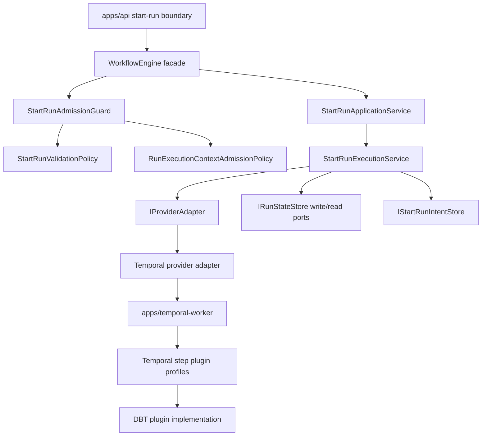
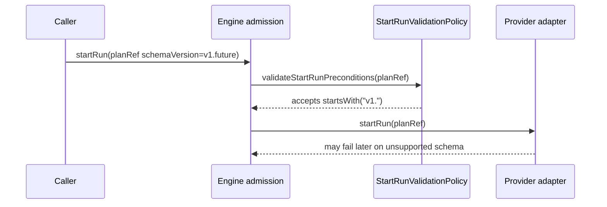
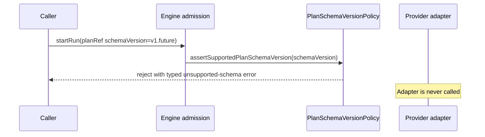
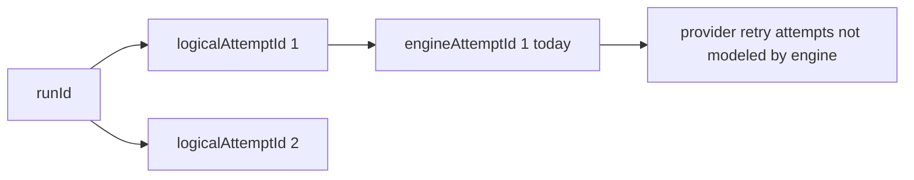
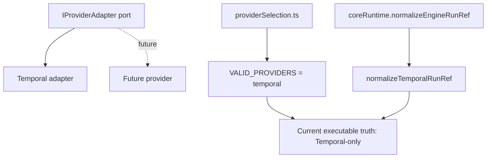

# DVT Engine Package Audit Review

**Plan-driven. Outcome-agnostic.**

This review canonizes the former local draft
`dvt_engine_audit_full_mermaid.md` into the governed review format required by
the repository. It is a package-level review of the DVT `engine`; it is not a
full-system review and it is not a normative contract.

## Governing Sources

- `AGENTS.md`
- `docs/planning/status/governance-document-rule-inventory.md`
- `docs/guides/ai-work-protocol.md`
- `docs/concepts/domain-language.md`
- `docs/architecture/reference-architecture.md`
- `docs/planning/status/canonical-doc-code-matrix.md`
- `docs/planning/reviews/review-naming-policy.md`
- `docs/planning/reviews/review-status-board.md`
- ADR-0003: execution model sovereignty
- ADR-0004: event sourcing strategy
- ADR-0005: contract formalization tooling
- ADR-0012: plan integrity ownership
- ADR-0014: run-driven adapter model
- ADR-0017: execution plan schema versioning
- ADR-0040: retry ownership and attempt authority

## Canonicalization Decision

The original draft was useful but not canonical. It had no frontmatter, used a
non-compliant underscore filename, mixed current findings with stale DBT-centric
claims, and failed Markdown lint table style checks. This version:

- renames the review to `20260429-dvt-engine-package-audit-review.md`;
- aligns language with DVT domain terminology;
- separates current findings from findings closed by later work;
- treats DBT as a plugin implemented by the Temporal adapter, not an engine
  kernel concern;
- records user stories as candidate backlog, not as completed implementation;
- keeps Mermaid diagrams as explanatory review material.

## Baseline And Scope

Baseline checked: `main` at `2522f130` (`refactor(engine): Harden plugin
admission architecture (#1049)`).

Primary source paths:

- `packages/@dvt/engine/src/application/providerSelection.ts`
- `packages/@dvt/engine/src/application/StartRunAdmissionGuard.ts`
- `packages/@dvt/engine/src/services/startRun/StartRunValidationPolicy.ts`
- `packages/@dvt/engine/src/services/startRun/StartRunExecutionService.ts`
- `packages/@dvt/engine/src/services/startRun/RunExecutionContextAdmissionPolicy.ts`
- `packages/@dvt/engine/src/core/lifecycle/coreRuntime.ts`
- `packages/@dvt/engine/src/core/lifecycle/coreDomainConstants.ts`
- `packages/@dvt/engine/src/index.ts`
- `packages/@dvt/engine/test/core/WorkflowEngine.test.ts`
- `packages/@dvt/engine/test/services/RunExecutionContextAdmissionPolicy.*.test.ts`
- `packages/@dvt/adapter-temporal/src/plugins/dbt/*`
- `packages/@dvt/adapter-temporal/test/dbt-core-decoupling.architecture.test.ts`

Out of scope:

- full web/frontend posture;
- complete API inventory;
- implementing the stories below;
- declaring provider portability as delivered beyond the currently implemented
  Temporal runtime path.

## Executive Verdict

The `engine` package is structurally serious. It has a thin facade,
application-service boundaries, event-sourced lifecycle ownership,
transactional bootstrap/outbox behavior, plan integrity checks, recovery
semantics, and meaningful negative tests.

The strongest remaining architectural risk is not rot. It is **semantic drift**:
some names and public surfaces imply more generality than the current runtime
actually proves. Mature systems avoid that drift by making compatibility
matrices, provider registries, attempt semantics, and public API surfaces
mechanically verifiable.

## Current Architecture Map

Interpretation:

- The engine owns run admission and run lifecycle.
- Providers are ports behind `IProviderAdapter`.
- DBT is no longer a kernel concept; it is adapter plugin behavior.
- The current production provider truth is still Temporal-only.

## Corrected Findings

### Resolved Or No Longer Accurate

| Claim from draft                                  | Current state                                                                                          | Decision              |
| ------------------------------------------------- | ------------------------------------------------------------------------------------------------------ | --------------------- |
| Engine admission is DBT-hardcoded                 | Current admission uses `IRunExecutionContextBindingPolicy` and generic plugin requirements             | Retired               |
| DBT must be removed from engine core              | The core admission path is plugin-bearing, and DBT code lives in adapter-temporal plugin paths         | Closed for this audit |
| Run-execution-context tests are one monolith      | The suite is split by acceptance, plugin requirements, provenance, compatibility, and SRP architecture | Closed for this audit |
| DBT step kinds are the only relevant plugin kinds | The plugin seam is generic; DBT is one implementation                                                  | Retired               |

### Still Current

| Priority | Finding                                                                 | Evidence path                                       | Impact                                                                                | Direction                                                                  |
| -------- | ----------------------------------------------------------------------- | --------------------------------------------------- | ------------------------------------------------------------------------------------- | -------------------------------------------------------------------------- |
| P0       | `schemaVersion` admission accepts any `v1.*`                            | `StartRunValidationPolicy.ts`                       | Future or invalid schema lines can enter runtime                                      | Add explicit supported schema-version policy                               |
| P1       | `engineAttemptId` is fixed at `1`                                       | `coreDomainConstants.ts`, `StartRunEventFactory.ts` | Physical re-dispatch semantics are not observable                                     | Define fixed-v1 semantics or implement allocator                           |
| P1       | Provider abstraction remains Temporal-only in runtime normalization     | `providerSelection.ts`, `coreRuntime.ts`            | Portability claims can outrun executable proof                                        | Keep honesty docs and add registry/conformance before a second provider    |
| P1       | Public package barrel is broad                                          | `packages/@dvt/engine/src/index.ts`                 | Consumers can depend on semi-internal services                                        | Split public, testing, and internal exports                                |
| P2       | Some architecture tests still inspect source text                       | `WorkflowEngine.test.ts`, architecture test suites  | Tests can pass on string shape rather than semantics                                  | Prefer semantic behavior tests or AST-backed checks                        |
| P2       | No-estimate start-run path has a provider-start-before-bootstrap window | `StartRunExecutionService.ts`                       | Compensation is implemented, but the invariant should be documented and stress-tested | Add explicit proof or require estimate capability for production providers |

## Drift Register

| Drift                            | Current truth                                                                    | Mature-system posture                                                                  |
| -------------------------------- | -------------------------------------------------------------------------------- | -------------------------------------------------------------------------------------- |
| `schemaVersion` vs `planVersion` | Both exist, but only `planVersion` has a dedicated support policy                | Compatibility matrix covers both axes and rejects unknown combinations                 |
| Provider replaceability          | Port exists; implemented runtime path is Temporal                                | Portability claim is documented as potential until conformance proves another provider |
| Attempt identity                 | `logicalAttemptId` carries business retry lineage; `engineAttemptId` is constant | Physical attempt semantics are either intentionally fixed or allocated and tested      |
| Public API barrel                | Many application and service exports are reachable from root                     | Stable API exports are separate from testing helpers and internal implementation       |
| Architecture fitness tests       | Some tests read source strings                                                   | Fitness functions validate behavior, dependency graph, AST, or package exports         |

## Architecture Diagrams

### Schema-Version Admission Gap

Target:

### Attempt Identity Model

Decision required:

- If `engineAttemptId` is intentionally fixed in v1, document it as reserved
  and forbid treating it as a physical attempt counter.
- If the engine must represent redispatch, add allocation semantics and
  negative tests for duplicate or out-of-order attempts.

### Provider Truth

## Comparison With Mature Systems

| Area                   | Current DVT posture                                          | Mature-system posture                                              |
| ---------------------- | ------------------------------------------------------------ | ------------------------------------------------------------------ |
| Contract compatibility | Partial: `planVersion` policy exists; schema policy is loose | Version matrix is explicit and tested at ingress                   |
| Provider ports         | Good port shape, one implemented provider                    | Conformance suite proves every provider before claims are made     |
| Event lifecycle        | Strong append/outbox/projector model                         | Same, plus documented migration and attempt semantics              |
| Plugin extensibility   | Improved: plugin requirements are generic                    | Plugin admission, execution, fixture, and docs template exist      |
| Public package API     | Broad root barrel                                            | Minimal public API with internal/test-only surfaces isolated       |
| Architecture tests     | Useful but mixed semantic/string checks                      | Semantic fitness functions with AST or dependency graph validation |

## User Stories

These stories are candidate backlog derived from this review. They are not
implementation evidence until promoted into the lane YAML registry and closed
with tests, docs, evidence, and risk updates where required.

### Story EA-20260429-01 - Strict Plan Schema-Version Admission

**As** a runtime operator, **I want** start-run admission to reject unsupported
`schemaVersion` values before adapter dispatch, **so that** future or malformed
plan schemas cannot fail late inside provider execution.

Acceptance criteria:

- `StartRunValidationPolicy` delegates to an explicit
  `PlanSchemaVersionPolicy`.
- Current `ExecutionPlan` schema version is accepted.
- Unsupported but syntactically plausible versions such as `v1.future` are
  rejected.
- Unsupported major versions such as `v2.0` are rejected.
- Adapter `startRun` is not called on schema-version rejection.
- Error mapping remains typed and caller-visible.

Negative scenarios:

- `schemaVersion = ''` rejects.
- `schemaVersion = 'v1.future'` rejects.
- `schemaVersion = 'v2.0'` rejects.
- Valid `planVersion` with invalid `schemaVersion` still rejects.

Likely ownership:

- Lane C for admission behavior.
- Lane A for contract/version compatibility wording if the policy moves to a
  shared contract surface.

### Story EA-20260429-02 - Plan Version And Schema Version Matrix

**As** an architect, **I want** `planVersion` and `schemaVersion` compatibility
declared in one matrix, **so that** planning, engine admission, and adapter
decode behavior cannot evolve independently.

Acceptance criteria:

- Matrix states supported `(planVersion, schemaVersion)` pairs.
- Engine admission uses the matrix or a generated equivalent.
- Adapter validation references the same compatibility truth.
- Documentation explains which axis changes behavior and which axis changes
  serialized shape.

Negative scenarios:

- Supported `planVersion` plus unsupported `schemaVersion` rejects.
- Unsupported `planVersion` plus supported `schemaVersion` rejects.
- Documentation claims are rejected by tests if a code path accepts a
  non-matrix pair.

Likely ownership:

- Lane D for versioning-governance assessment.
- Lane A/C for implementation once the decision is accepted.

### Story EA-20260429-03 - Engine Attempt Semantics

**As** a maintainer investigating failed runs, **I want** `engineAttemptId`
semantics to be explicit, **so that** recovery, redispatch, and provider retry
events are not confused with business retry lineage.

Acceptance criteria:

- ADR-0040 or an addendum states whether `engineAttemptId` is reserved/fixed or
  allocated.
- Event factories follow that decision mechanically.
- Tests prove first start-run attempt semantics.
- If allocation is selected, tests prove redispatch increments without changing
  `logicalAttemptId`.
- If fixed-v1 is selected, tests prove no code treats it as a physical counter.

Negative scenarios:

- Duplicate physical attempts cannot emit ambiguous event envelopes.
- Recovery cannot silently reuse stale provider references with a misleading
  attempt identity.

Likely ownership:

- Lane C for runtime safety.
- ADR follow-up if semantics change.

### Story EA-20260429-04 - Provider Registry And Conformance Truth

**As** a platform maintainer, **I want** provider selection, run-ref
normalization, and conformance to be registry-backed, **so that** adding a
second provider is a governed extension rather than a set of scattered edits.

Acceptance criteria:

- Current docs continue to say production runtime is Temporal-only.
- A provider registry owns adapter lookup and run-ref normalization.
- Unknown providers reject through one typed path.
- A provider conformance test suite exists before any new provider is
  advertised as supported.
- Existing Temporal behavior remains unchanged.

Negative scenarios:

- Adding a provider name to a union is insufficient to pass conformance.
- Unknown provider IDs cannot pass `resolveEngineProvider`.
- Provider-specific run-ref shape cannot be normalized by the wrong provider.

Likely ownership:

- Lane A for contract/provider vocabulary.
- Lane C for runtime admission and operational behavior.

### Story EA-20260429-05 - Public Engine API Surface Split

**As** a package consumer, **I want** the engine root export to expose only the
stable public surface, **so that** application services and internals do not
become accidental external contracts.

Acceptance criteria:

- Root `index.ts` exports stable contracts, ports, and facade builders only.
- Testing helpers move behind a test-only entrypoint.
- Internal application services are either unexported or exported through a
  documented advanced entrypoint.
- Package-surface tests assert the allowed export groups.
- Existing downstream imports are migrated deliberately.

Negative scenarios:

- A consumer cannot import private start-run service internals from the root.
- A new internal service export fails package-surface validation.

Likely ownership:

- Lane A for boundary and contract ownership.

### Story EA-20260429-06 - Semantic Architecture Fitness Functions

**As** a reviewer, **I want** architecture tests to validate semantics rather
than brittle source strings, **so that** refactors do not pass or fail based on
incidental formatting.

Acceptance criteria:

- Source-string tests are replaced where behavior or AST checks can express the
  invariant.
- Remaining source-string guards are justified as documentation or import
  policy checks.
- At least one AST-backed test proves facade thinness or owned-concern
  boundaries.
- The test suite documents which checks are semantic and which are textual.

Negative scenarios:

- Reformatting a method cannot change a semantic architecture result.
- A facade can no longer pass by containing expected strings while still
  constructing forbidden dependencies indirectly.

Likely ownership:

- Lane A for architectural boundary fitness.
- Lane C when the tested invariant is runtime-safety behavior.

### Story EA-20260429-07 - StartRun Provider-Ref Bootstrap Proof

**As** an operator, **I want** the start-run bootstrap/adapter dispatch order to
be documented and stress-tested, **so that** provider-start-before-bootstrap and
estimate-ref flows have explicit failure handling.

Acceptance criteria:

- The current two-path behavior is documented:
  `estimateRunRef` pre-bootstraps before adapter start; no estimate starts the
  provider before bootstrap and compensates on persistence failure.
- Negative tests cover bootstrap failure after provider start.
- Negative tests cover compensation failure visibility.
- Production provider capability expectations are explicit.

Negative scenarios:

- Provider starts but state bootstrap fails: compensation is attempted and the
  original error remains visible.
- Compensation fails: the error is logged/observed without hiding the
  persistence failure.
- Estimated and actual provider refs disagree on non-late-bound identity:
  reconciliation rejects and compensates.

Likely ownership:

- Lane C for runtime safety and operability.

### Story EA-20260429-08 - Plugin Extension Template

**As** a plugin author, **I want** a local template for adding a new step
plugin, **so that** SQL, DBT, and future plugins follow the same admission,
execution, fixture, and documentation shape.

Acceptance criteria:

- Template documents plugin manifest, supported step kinds, context key,
  admission policy binding, activity registry, runner contract, test fixtures,
  and component guide requirements.
- DBT is referenced as an example implementation, not as the architectural
  default.
- A sample non-DBT plugin story proves the extension point is generic.

Negative scenarios:

- A plugin cannot require run-execution context without declaring binding
  policy.
- A plugin cannot register step kinds by editing engine kernel code.
- A plugin cannot bypass compatibility fingerprint checks when configured.

Likely ownership:

- Lane C for runtime plugin execution.
- Lane A for contract/extension documentation.

## Prioritized Follow-Up

| Order | Story          | Why first                                                                     |
| ----- | -------------- | ----------------------------------------------------------------------------- |
| 1     | EA-20260429-01 | It prevents late execution of unsupported plan schema shapes                  |
| 2     | EA-20260429-02 | It prevents version-policy drift across planner, engine, and adapters         |
| 3     | EA-20260429-07 | It closes the most operationally risky start-run failure window               |
| 4     | EA-20260429-03 | It makes recovery and retry investigations unambiguous                        |
| 5     | EA-20260429-05 | It reduces accidental public contracts before more consumers depend on them   |
| 6     | EA-20260429-06 | It improves long-term fitness-function quality                                |
| 7     | EA-20260429-04 | It should land before a second provider, not before the current Temporal path |
| 8     | EA-20260429-08 | It improves extension ergonomics once the core admission story is stable      |

## Documentation Drift To Fix When Stories Start

- `docs/architecture/reference-architecture.md` should continue to state that
  Temporal is the only implemented start-run provider until conformance changes.
- `docs/planning/status/canonical-doc-code-matrix.md` should link a strict
  schema-version policy when one exists.
- Component docs under `docs/architecture/components/engine/` should reference
  the selected attempt-semantics decision after EA-20260429-03.
- Plugin docs should avoid DBT-centric phrasing and describe DBT as one plugin.

## Validation Notes

This review is a planning artifact. It records findings and candidate stories;
it does not implement runtime behavior. The expected validation for this
canonicalization is documentation validation:

- Markdown lint for this file.
- Documentation sync after adding and renaming the review.
- `pnpm verify:prepush` before presenting the slice as ready.

Implementation of any story touching `packages/@dvt/engine/**`,
`packages/@dvt/contracts/**`, or `packages/@dvt/adapter-*/**` triggers ARC-2
evidence and risk-register requirements.
